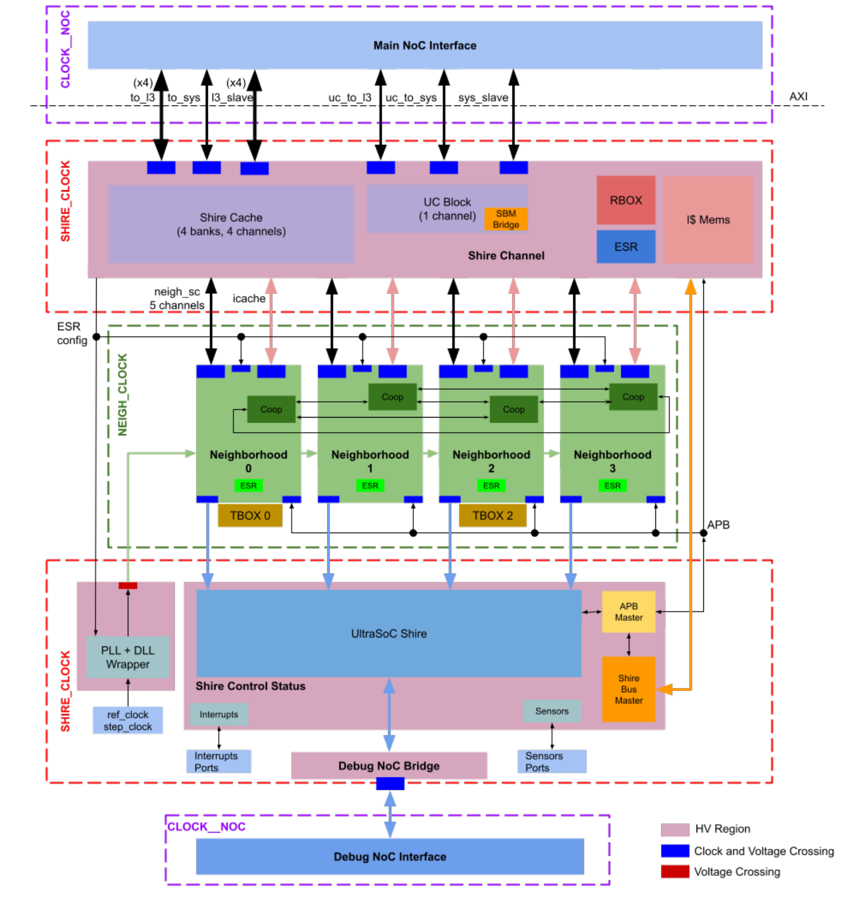
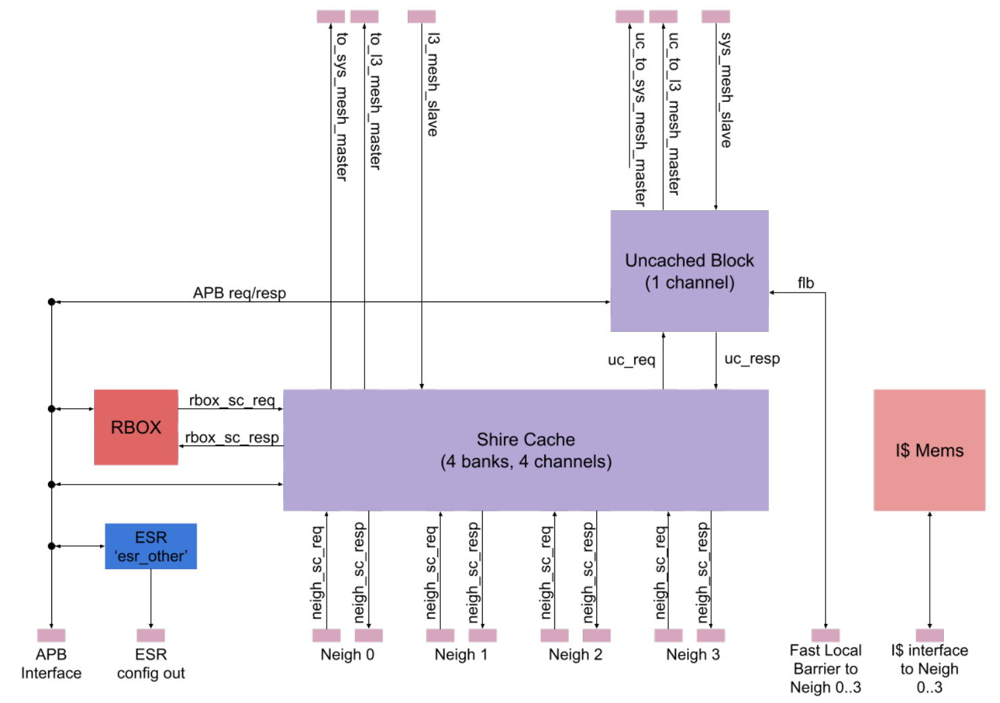
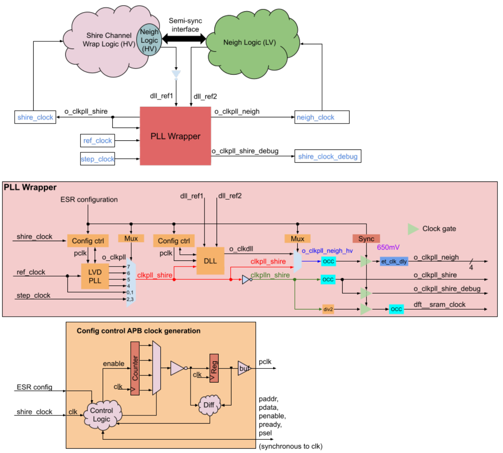
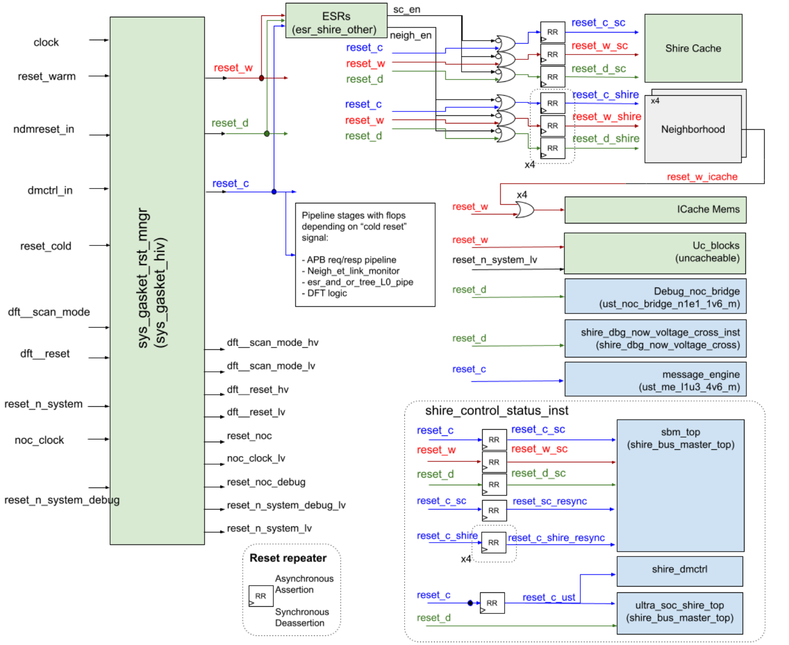
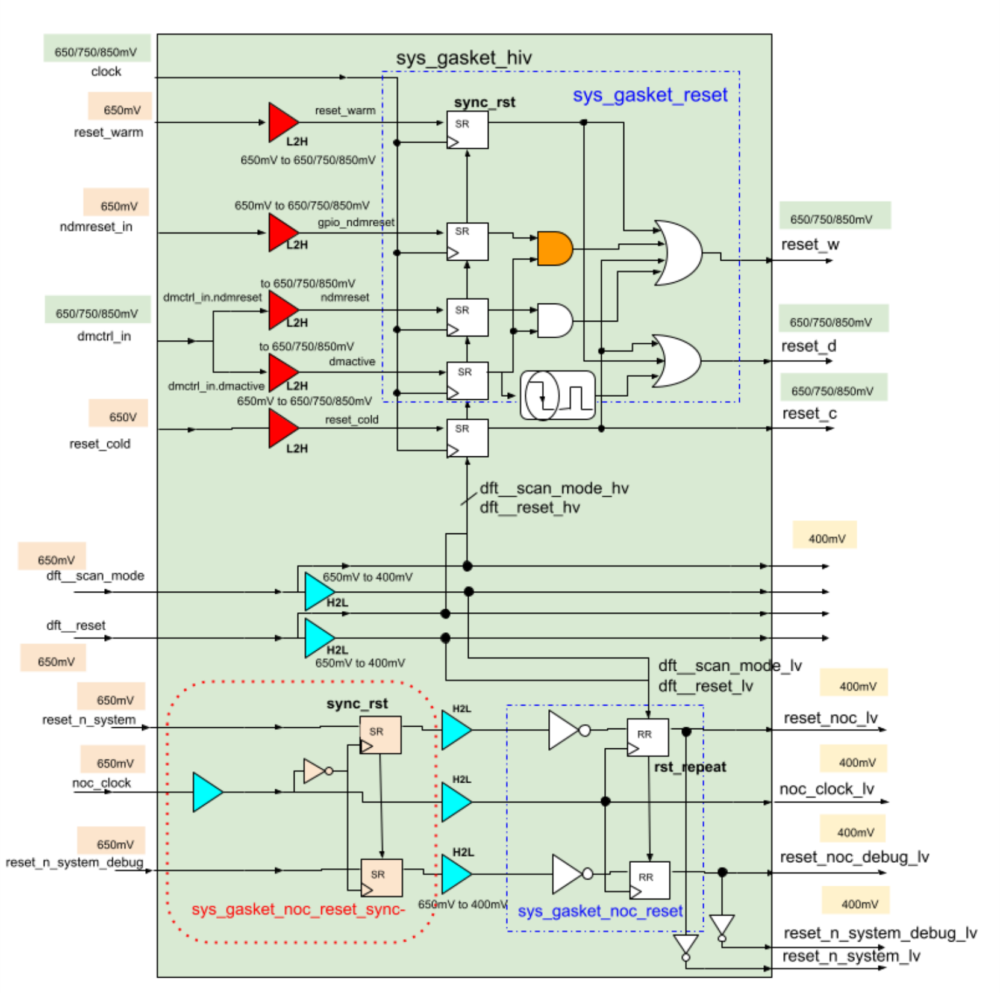

# CORE-ET Minion Shire Description 

<u>Ildefonso Gomariz Juanjo Galindo Xavier Reves</u> 

# Table of Contents 

|**1 Introduction**|4|
|---|---|
|**2 External Interfaces**|6|
|2.1 System|7|
|2.2 Debug|7|
|2.3 Sensors|7|
|2.4 Test|7|
|2.5 Interrupts|7|
|2.5.1 ioshire_combined_err_int|7|
|2.5.2 ioshire_noc_err_int|8|
|**3 Building Blocks**|10|
|3.1 Shire Channel|10|
|3.1.1 Shire Cache|10|
|3.1.2 UC_Block|11|
|3.1.3 ESR|11|
|3.2 Neighborhood|11|
|3.3 Main and Debug NoC|11|
|3.4 Shire Control Status|11|
|**4 Clock and Reset Signals**|11|
|4.1 Clock|11|
|4.1.1 PLL and DLL Configuration|14|
|4.2 Reset|14|
|**5 Voltage Domains**|18|
|**6 Debug**|19|
|6.1 Debug Interface|19|
|6.2 Debug Memory Map|19|
|**7 Glossary**|20|
|**8 References**|21|

# Revision History 

|**Version**|**Date**|**Author**|**Changes**|
|---|---|---|---|
|v0.1|2018.12.04||Document created|
|v0.5|2020.06.30||Completed first round of revisions and updates|
|v0.6|2021.01.28||Adjusted document format|
|v0.7|2021.03.26||Major content revision|
|v0.7.1|2021.10.18|Jennie Weyant|Format and grammar review|

## 1 Introduction 

A Minion Shire is so named because it contains 32 <u>Minion</u> processors together with a set of blocks that allow for these processors to have access to the instructions and data to process. The main functional blocks of a Minion Shire are four Minion Neighborhoods and an L2 cache divided into four banks and a total of 4 Mbytes. Each Minion Neighborhood contains eight Minion Processors for a total of 32 Minions per Shire. 

Each Shire also contains: 

- Functionality to support fast Inter-Processor Interrupts (IPIs), Fast Local Credit counters, and Uncacheable [UC] accesses 

- Debug support to access local resources and to control the execution of the Minions inside the Neighborhoods 

- ET System Register (ESR) banks to control and configure all the functional components inside the Minion Shire 

- Two-level Instruction Caches (ICaches), distributed between Neighborhood and Shire Channel blocks 

- Temperature sensors and process monitors 

- A Phase-Locked Loop (PLL) to generate independent clocks for the Neighborhoods 

L2 cache misses (and Uncachable accesses) will leave the L2 cache and go to the Network on Chip (NoC) interface. The NoC interface allows read/write requests to reach the top-level NoC (which is separate from the crossbars internal to the Shire) and travel to other Shires or to a memory controller. The debug infrastructure is connected to its own NoC for independent access to the debug resources. 

The building blocks are embedded in different voltage and clock regions, separated by clock domain synchronizers and level shifters. 

The figure below shows a simplified diagram of the Minion Shire top level. For a detailed description of the power domains and their features, please refer to the Power Spec document. 

_Figure 1_ 

## 2 External Interfaces 

In this section, a list of all the Minion Shire interfaces along with a minimal description are provided. Please note that the following list does not include the signals of the interfaces that are automatically generated for the “stamped” NoCs (for both the regular NoC and Debug NoC) since there are so many signals in this category. 

|**Interface ‘Nickname’**|**Signals Involved**|
|---|---|
|System|reset_cold, reset_warm, step_clock, ref_clock, shire_id_reset_val, shire_phy_id Provide basic “system-level” inputs to the Minion Shire|
|Test|dft__*, ate_clock_* Signals for Design For Testing (DFT) implementation minshire_tdr_* Signals for the Joint Test Action Group (JTAG) Test Data Register (TDR) control yin_*, yan_* PLL debug signals vl_sms_shire_top_*, vl_srv_u_sms_shire_top_*, dm*_et_blocks SMS signals|
|Debug|dmctrl, debug_and_or_tree_* Provide basic control for the debug operations dbg_noc_bridge_* Signals for the Debug NoC message routing msg_lock_enable_* Signals used to lock or unlock the access to UltraSoc debug modules|
|Temperature sensor|clk_ts, rstn_ts, ts_* Temperature sensor interface|
|Process sensor|clk_pd, rstn_pd, pd_* Process sensor interface|
|Voltage sensor|minionshire_vin_hi, minionshire_vin_lo Voltage sensor analog interface|
|Interrupts|plic_mtip, plic_meip, plic_sei, ioshire_log_err_int Input (from the Platform-Level Interrupt Controller [PLIC]) ioshire_combined_err_int, ioshire_noc_err_int Output (to the PLIC)|
|Main NoC|clk__noc, reset_n_system, ns_* The NoC has specific clock and reset signals (See the Main and Debug NoC section)|
|Debug NoC|clk__noc, reset_n_system_debug, <others> The Debug NoC uses the same clock but different reset signals from the Main NoC (See the Main and Debug NoC section)|

_Table 1_ 

### 2.1 System 

The system signals include the different reset signals, basic source clocks, and identifiers for the Shire. Refer to the Clock and Reset Signals section for more details. 

The Shire identifiers, which are stored in ESRs and propagated down to the Minions, are necessary for communication within the System on Chip (SoC). These must match the NoC constants (refer to the Main and Debug NoC section for details) but are not directly used within the NoC. 

### 2.2 Debug 

For a full description of the function of the signals associated with debug, please proceed to the <u>Debug section.</u> 

### 2.3 Sensors 

Information regarding the on-die monitors can be found on the following Confluence page: On- <u>Die Monitors.</u> 

### 2.4 Test 

The documentation for this section is under construction. 

### 2.5 Interrupts 

#### 2.5.1 ioshire_combined_err_int 

This output interrupt to the PLIC is an Or’ed signal of the output interrupts from the error loggers in the Shire Cache (one per Shire Cache Bank) and the error logger in the ICache (one per Neighborhood). The loggers can be configured to enable this interrupt and to select the interrupt sources. 

Details regarding the configuration of the ICache error logger can be found in the <u>ICache documentation.</u> 

Details regarding the configuration of the Shire Cache error logger can be found in the <u>Shire Cache Spec.</u> 

The ICache and the Shire Cache logger have their own set of registers to configure and check the status of the loggers. Apart from that, there’s a read-only status register (shire_error_log) in the _Shire other_ ESR that reports logged and detected errors (neigh_sc* is for icache*). 

This is a 16-bit register containing error information from the ICache (4 + 4 bits) and shire_cache banks (4 + 4 bits). The structure of the register is as follows: 

_{neigh_sc_err_logged[3:0], sc_bank_err_logged[3:0], neigh_sc_err_detected[3:0], sc_bank_err_detected[3:0]}_ 

The output interrupt to the PLIC ioshire_combine_err_int is an OR of the *_err_detected bit in the shire_error_log register. 

#### 2.5.2 ioshire_noc_err_int 

This output interrupt to the PLIC is an OR’ed signal of several interrupt sources from the NoC meshstop wrapper (Debug and Main NoCs). The status of these bits could be checked in the read-only register Shire_NoC_Interrupt_Status of the _Shire other_ ESR. 

|**Shire_NoC_Interrupt_Status[20] :** **Shire_NoC_Interrupt_Status[19] :**|**Dbg-NoC's ns_utsoc_interrupt_defer_sh0_dn** **Dbg-NoC's ns_utsoc_interrupt_defer_15_9**|
|---|---|
|**Shire_NoC_Interrupt_Status[18] :**|**NoC's ns_interrupt_defer_sib_tosys_sh0_m**|
|**Shire_NoC_Interrupt_Status[17] :**|**NoC's ns_interrupt_defer_sib_tol3_sh0_m**|
|**Shire_NoC_Interrupt_Status[16] :**|**NoC's ns_interrupt_defer_sh0_sb_s**|
|**Shire_NoC_Interrupt_Status[15] :**|**NoC's ns_interrupt_defer_sh0_l3d_s**|
|**Shire_NoC_Interrupt_Status[14] :**|**NoC's ns_interrupt_defer_sh0_l3c_s**|
|**Shire_NoC_Interrupt_Status[13] :**|**NoC's ns_interrupt_defer_sh0_l3b_s**|
|**Shire_NoC_Interrupt_Status[12] :**|**NoC's ns_interrupt_defer_sh0_l3_s**|
|**Shire_NoC_Interrupt_Status[11] :**|**NoC's ns_interrupt_defer_sh0_l2tol3d_m**|
|**Shire_NoC_Interrupt_Status[10] :**|**NoC's ns_interrupt_defer_sh0_l2tol3c_m**|
|**Shire_NoC_Interrupt_Status[09] :**|**NoC's ns_interrupt_defer_sh0_l2tol3b_m**|
|**Shire_NoC_Interrupt_Status[08] :**|**NoC's ns_interrupt_defer_8_9**|
|**Shire_NoC_Interrupt_Status[07] :**|**NoC's ns_interrupt_defer_7_9**|
|**Shire_NoC_Interrupt_Status[06] :**|**NoC's ns_interrupt_defer_6_9**|
|**Shire_NoC_Interrupt_Status[05] :**|**NoC's ns_interrupt_defer_5_9**|
|**Shire_NoC_Interrupt_Status[04] :**|**NoC's ns_interrupt_defer_4_9**|
|**Shire_NoC_Interrupt_Status[03] :**|**NoC's ns_interrupt_defer_3_9**|
|**Shire_NoC_Interrupt_Status[02] :**|**NoC's ns_interrupt_defer_2_9**|
|**Shire_NoC_Interrupt_Status[01] :**|**NoC's ns_interrupt_defer_1_9**|
|**Shire_NoC_Interrupt_Status[00] :**|**NoC's ns_interrupt_defer_0_9**|

The <u>Main and Debug NoC section can be consulted for details regarding each particular interrupt.</u> 

## 3 Building Blocks 

As can be seen in the diagram in the Introduction section, there are five main building blocks. In the next few sections, each of these building blocks will be further addressed. 

### 3.1 Shire Channel 

The Shire Channel includes the Shire Cache, the UC block, the L1 ICache data memory, and a portion of the ESRs. Details regarding the ICache memory can be found in the <u>Neighborhood</u> section since the only reason this memory is located in the Shire Channel is because it has to be operated at high voltage. 

The block diagram of the Shire Channel appears in the following figure: 

_Figure 2_ 

#### 3.1.1 Shire Cache 

Please refer to specific documentation for <u>Shire Cache.</u> 

#### 3.1.2 UC_Block 

Details about the UC block can be found in <u>UC Specification.</u> 

#### 3.1.3 ESR 

The full list of the ESRs can be found in the <u>ESR Registers</u> spreadsheet. The _Shire other_ section contains the ESRs that are found inside the Shire Channel. 

A description of the function of each ESR is distributed across the different PRM documents. For instance, <u>PRM: CORE-ET Programmer’s Reference Manual, describes, for different</u> functionalities,  how to use the ESRs. 

### 3.2 Neighborhood 

A Neighborhood is a hierarchical entity containing a total of eight Minions plus some shared logic grouped in the Neighborhood Channel. The Minions along with the agents contained in the channel share a 512-bit ET-Link bus to access the next level of the hierarchy (Shire Cache / UC block). 

For further details, please refer to the <u>Neighborhood Description</u> document. 

### 3.3 Main and Debug NoC 

The documentation for the Main NoC can be accessed <u>here.</u> 

### 3.4 Shire Control Status 

The Shire Control Status module includes a set of components for debug (further details are provided in the <u>Debug</u> section), all those components are encapsulated inside “ultrasoc_shire_top”, which is a module that masks run control operations to the Minions, provides access to internal registers, and allows for Shire signal monitoring. In addition, the Shire Control Status module also contains the Shire Bus Master and a couple of auxiliary modules that allow for die temperature monitoring and manufacturing dependencies (process monitor). 

## 4 Clock and Reset Signals 

The basic functional clock and reset signals are described in this section. In the Debug section, which includes reference to the debug documentation, further details regarding the reset signals can be found. The debug and functional reset signals are merged to build the final reset tree. 

### 4.1 Clock 

There are five different clocks operating in the Minion Shire: 

|**Clock Name**|**Source**|**Freq.** **(MHz)**|**DFT** **Clocking**|**Description**|
|---|---|---|---|---|
|ref_clock|Pin|24/100|N/A|Clock reference to feed the PLL to generate the Neighborhood clocks|
|step_clk|Pin|400 to 1000||Step clock, the step clock is distributed to all the Minion Shires and comes from PLL4 in the IOShire. Step clock is programmed by the Service Processor during boot.|
|o_clkpll_shire|PLL Wrapper|1000|DFT to Insert OCC|Output from the Minion Shire’s local DPLL to feed the Minion Shire logic, including debug modules, excluding NoC modules. Connected to the shire_clock signal in shire_top|
|o_clkpll_neigh|PLL Wrapper|1000|DFT to Insert OCC|Output from the Delay-Locked Loop (DLL) to feed the four Neighborhoods. Connected to the clock_neigh signal in shire_top. This is a version of shire_clock shifted 180º|
|clk__noc|Pin|500|DFT to Insert OCC|Clock for the Main NoC and Debug NoC which comes from PLL2 in the IOShire and feeds all the NoC nodes.|

_Table 2_ 

The diagram shown below represents the internal components of the PLL Wrapper that drives the Minion Shire clock. The upper part of the diagram provides an overview of the inputs and outputs of the PLL Wrapper in the context of the top-level blocks of the Minion Shire for which the clock is generated. 

The driving point for o_clkpll_shire ( **shire_clock** ) is the output of a series of glitch-free muxes that allow for selecting among a series of clock sources via ESR configuration bits. Selectable clocks are the reference clock (ref_clock), the step clock (step_clock), or one of the four outputs from the PLL. 

The driving point for o_clkpll_neigh ( **clock_neigh** ), excluding the clock gate, is the output of a glitch-free mux that allows for selecting the output of the DLL or the inverted version of o_clkpll_shire. This signal contains four separate wires, one for every Neighborhood. Different ESR bits allow for selecting the desired clock source and gating per line. 

_Figure 3_ 

A third clock for the debug blocks, o_clkpll_shire_debug ( **shire_clock_debug** ), is a gated branch of shire_clock. However, _global clock gating for shire_clock is not available given that switching it off at this point would make it impossible to update the ESR and activate it again,_ as the ESR block is driven by shire_clock. 

An additional clock is generated inside each of the Config control blocks. This clock is derived from shire_clock using a counter. The different bits of the counter can be used to obtain different division rates to ensure that the APB clock to PLL or DLL meets the maximum speed requirements of that interface. Clock pclk is inverted to center the edge in the middle of the data validity period, which is guaranteed by design. 

#### 4.1.1 PLL and DLL Configuration 

In the Minion Shire (Minshire), the APB interface of the PLL/DLL _is not_ connected to the main Shire APB bus. 

So, the PLL and DLL registers are _not_ memory mapped; however, the Service Processor (SP) should be able to indirectly write and read any register in the PLL/DLL modules. The initialization procedures of the PLL and the DLL cores are detailed in the <u>Minion Shire PLL and DLL Initialization document.</u> 

### 4.2 Reset 

The main reset signals in the Minion Shire are generated inside a top-level component named sys_gasket. The diagrams below show the connections of sys_gasket and its internal structure. 

Different types of input functional reset signals are combined in sys_gasket: 

- reset_cold: input pin to Shire. This is the main reset applied after power-up, or whenever necessary. This signal resets all the sequential elements that have a reset (mainly synchronous, but some components use it as an asynchronous reset) 

- reset_warm: input pin to Shire. This reset signal has almost the same behavior as reset_cold, except that some of the ESR values are left untouched, to avoid having to reconfigure them 

- ndmreset: input pin to Shire. Signal from debug control input bus that produces a reset similar to reset_warm, except that it does not reset the modules used for debug (i.e. resets all “non-debug” logic) 

- gpio_ndmreset: internal (to Shire) signal generated from debug modules that has exactly the same behavior as ndmreset 

- dmactive: input pin to Shire. Signal from the debug control input bus that produces a reset for the debug logic once it is deactivated (i.e. upon a falling edge of this signal, a reset pulse is generated for the debug logic). 

_Figure 4_ 

_Figure 5_ 

The logic inside sys_gasket generates three output reset signals: reset_c, reset_w, and reset_d: 

- reset_c: only connected to reset_cold input. Used for memory elements that are only reset at system power-up (or full reset). 

- reset_w: combines reset_cold, reset_warm, and the different sources of ndmreset. Used to reset any non-debug logic that is not reset by reset_c. 

- reset_d: combines reset_cold, reset_warm, and dmactive falling edge. Used to reset only debug logic. 

Additionally, the reset signals for the NoC are routed and synchronized through the sys_gasket. For the NoC, a single clock (clk__noc) and two different reset signals are used, one for the main NoC (reset_n_system) and the other for the Debug NoC (reset_n_system_debug). 

## 5 Voltage Domains 

The Minion Shire includes different voltage domains, which are described in the Minshire section of the <u>Power Spec</u> document. A full description of the nominal voltage values for each region are out of the scope of this document. 

The decisions regarding the voltage region assigned to each block were made based on performance and power. To separate different voltage domains, which are often but not always associated with different clock domains, the Physical Design (PD) team has designed specific library elements to be used. Level shifters, FIFOs, and synchronizers are part of this library. 

The different voltage regions for every component are shown in the figure in the <u>Introduction</u> section. 

## 6 Debug 

Detailed debug implementation and diagrams for the Minion Shire can be found in the <u>MAS: Minion Shire Debug</u> document. 

### 6.1 Debug Interface 

The main debug interface to the Minion Shire contains the dmctrl and dmstatus signals, defined according to the <u>Debug High-Level Specification document (the dmcontrol and dmstatus</u> registers, respectively). 

These signals should be treated as asynchronous to any of the Minion Shire clocks. The group of signals is sampled at the input to the Minion Shire when an indication of a change to the registers arrives, with the assumption that at the SoC top level, all the signals travel with minimal skew. 

Additionally, there are the reset__n_system_debug and clk__noc_debug inputs, which are connected to the UltraSoC infrastructure and to the Debug NoC. 

### 6.2 Debug Memory Map 

The memory map for debug is defined in the <u>Debug Memory Map</u> section of the PRM document. 

## 7 Glossary 

APB Advanced Peripheral Bus DFT Design for Testability DLL Delay-Locked Loop ESR ET System Register FLB Fast Local Barrier IPI Inter-Processor Interrupt JTAG Joint Test Action Group NoC Network on Chip PD Physical Design PLIC Platform-Level Interrupt Controller PLL Phase-Locked Loop RZBOX Rasterization and Z-test unit SC Shire Cache SoC System on Chip TBOX Texture unit TDR Test Data Register UC Uncacheable 

## 8 References 

1. <u>Minion Processor Description</u> 

2. <u>Minion Neighborhood Description</u> 

3. <u>Minion ICache Description</u> 

4. <u>Shire Cache Specification</u> 

5. <u>Shire Bus Master Specification</u> 

6. <u>UC Specification</u> 

7. <u>Shire Bus Master Specification</u> 

8. <u>Minion Shire PLL and DLL Initialization</u> 

9. <u>MAS: Minion Shire Debug</u> 

10. <u>Debug High-Level Specification</u> 

