# CORE-ET Neighborhood Description 

### <u>Ildefonso Gomariz</u> 

<u>Xavier Reves</u> 

# Table of Contents 

|**1 Introduction**|5|
|---|---|
|**2 Overview**|6|
|2.1 Block Diagram|6|
|2.2 Physical Layout|7|
|**3 Interfaces**|8|
|**4 Building Blocks**|13|
|4.1 Minions|13|
|4.2 ICache|14|
|4.3 Request Datapath|14|
|4.3.1 Minion Request Datapath|15|
|4.3.2 Request Datapath Arbiter|17|
|4.3.3 ET-Link Request Pre-Processing|18|
|4.3.4 Intermediate and Output FIFOs|18|
|4.3.5 Output Request Interface|19|
|4.4 Response Datapath|20|
|4.4.1 Input Response Interface and Cooperative TLoad Access|20|
|4.4.2 Fill FIFO|21|
|4.4.3 Minion Response Datapath|22|
|4.5 Cooperative TensorLoad|23|
|4.6 Cooperative TensorStore|24|
|4.7 Fast Local Messaging Network|26|
|4.8 Fast Local Barrier|28|
|4.9 Interrupts|29|
|4.10 Fast Credit Counter|29|
|4.11 Performance Monitor Unit|29|
|4.11.1 Interface to Minions|30|
|4.11.2 Power Saving Considerations|31|
|4.11.3 Implementation|31|
|4.12 APB Access|32|
|4.13 External Configuration|33|
|4.14 Page Table Walkers|34|
|4.15 TBOX Logic|34|
|**5 ET System Registers**|36|
|5.1 MINION_BOOT|36|
|5.2 MPROT|36|
|5.3 VMSPAGESIZE|36|
|5.4 IPI_REDIRECT_PC|36|
|5.5 HACTRL|36|
|5.6 HASTATUS0|36|
|5.7 HASTATUS1|36|
|5.8 AND_OR_TREEL0|37|
| 5.9 PMU_CTRL|37|
|5.10 NEIGH_CHICKEN|37|
|5.11 ICACHE_ERR_LOG_CTL|38|
|5.12 ICACHE_ERR_LOG_INFO|38|
|5.13 ICACHE_ERR_LOG_ADDRESS|38|
|5.14 ICACHE_SBE_DBE_COUNTS|38|
|5.15 TEXTURE_CONTROL|38|
|5.16 TEXTURE_STATUS|38|
|5.17 TEXTURE_IMAGE_TABLE_PTR|38|
|**6 Clock and Reset Signals**|39|
|6.1 Clocks|39|
|6.1.1 Clock Domain Crossing|39|
|6.1.2 DLL Delay Estimation|41|
|6.2 Resets|41|
|**7 Voltage Domains**|45|
|7.1 Voltage Domain Crossing|45|
|7.2 Power Control and Isolation|46|
|7.2.1 Logical Stubbing|47|
|**8 Debug**|49|
|**9 Glossary**|50|
|**10 References**|52|

# Revision History 

|**Version**|**Date**|**Author**|**Changes**|
|---|---|---|---|
|v0.1.0|2021.02.19|Ildefonso Gomariz|Document created|
|v1.0.0|2021.03.29|Ildefonso Gomariz|First version finished|
|v1.0.1|2021.04.22|Ildefonso Gomariz|Updated links to PRM|
|v1.0.2|2021.10.14|Jennie Weyant|Format and grammar review|

## 1 Introduction 

This description corresponds to the Neighborhood implementation in the A0 revision of the ET-SoC-1 device. Refer to the <u>PRM: CORE-ET Programmer's Reference Manual for a general</u> overview of the ET-SoC-1 system. 

The main intended users of this document are the members of the VLSI team in charge of designing and verifying the Neighborhood. It may also be useful as a reference manual for the software (SW) team, especially the <u>ET System Registers section.</u> 

The microarchitecture of the Neighborhood is presented and its interfaces and building blocks are detailed in this document. There is a full section dedicated to the ET System Registers (ESRs), which can be used to configure the behavior and check the status of the Neighborhood. The clock and reset distribution and the different voltage domains are also explained in detail. Last, a section with references to different debug resources is provided. 

## 2 Overview 

A Neighborhood is a hierarchical entity containing a total of eight Minions plus some shared logic grouped in the Neighborhood Channel. The Minions along with the agents contained in the channel share a 512-bit ET-Link bus to access the next level of the hierarchy (Shire Cache [SC] / Uncached [UC] block). 

The Neighborhood is divided into two clock and voltage domains. The so-called Low Voltage (LV) region includes the eight Minions and most of the Neighborhood Channel logic, and runs with its own clock (i.e. the Neighborhood clock). The High Voltage (HV) region contains the interface logic to the upper hierarchy level (i.e. the Shire Channel) and runs with the Shire clock. Both areas are connected through a semi-synchronous interface. 

#### 2.1 Block Diagram 

The Neighborhood Channel contains the following shared logic: 

- A two-level Instruction Cache (ICache), which is composed of two L0 microcaches plus a L1 32 KB ICache 

- Two Page Table Walkers1 (PTWs) 

- Shared ET-Link request and response buses to the next level of the hierarchy (L2 Shire Cache and UC block) 

- A Cooperative TensorLoad unit 

- A Cooperative TensorStore unit 

- A Fast Local Messaging Network for fast Minion messaging interconnection 

- A Fast Local Barrier unit (FLB) 

- Interrupt lines 

- A Performance Monitor Unit (PMU) 

- Neighborhood ET System Registers (ESRs) 

- Advanced Peripheral Bus (APB) for ESR and debug access 

- Other debug logic: 

   - Run control for Minions 

   - Status Monitor (SM) access to Minion and Neighborhood internal signals 

- Clock Domain Crossing (CDC) and Voltage Domain Crossing (VDC) logic 

- Delay-Locked Loop (DLL) delay estimation logic 

The following figure shows a block diagram of the Neighborhood: 

1 Virtual Memory logic is unused in A0 (see Page Table Walkers) 

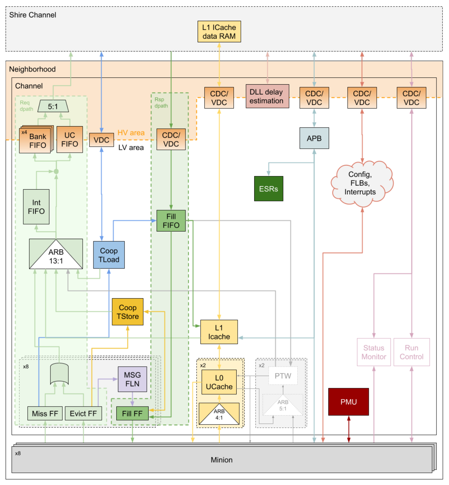

_Figure 1 - Neighborhood Block Diagram_ 

#### 2.2 Physical Layout 

The Minions are piled up in two columns of four Minions each, on the left and right sides of the Neighborhood Channel respectively, which is placed in the center column. All the ports are placed on the top boundary of the channel (namely, the **north** ), which is the only interface with the next level of the hierarchy (i.e. the Shire Channel). This interface is in the same clock and voltage domain as the Shire Channel (namely, the **HV region** ), while the Minions and the rest of the Neighborhood Channel share their own clock and voltage domain (the **LV region** ). 

The Minions are synthesised as an independent physical partition and then placed in the Neighborhood layout (see <u>Minions). They are flipped vertically and/or horizontally so that their</u> pins are properly oriented for connection with the Neighborhood Channel logic. They have been distributed in such a way as to minimize the distance that the Fast Local Messaging Network that interconnects them must travel and the congestion that it generates (see Fast <u>Local Messaging Network).</u> 

The following figure shows the physical layout of the Neighborhood: 

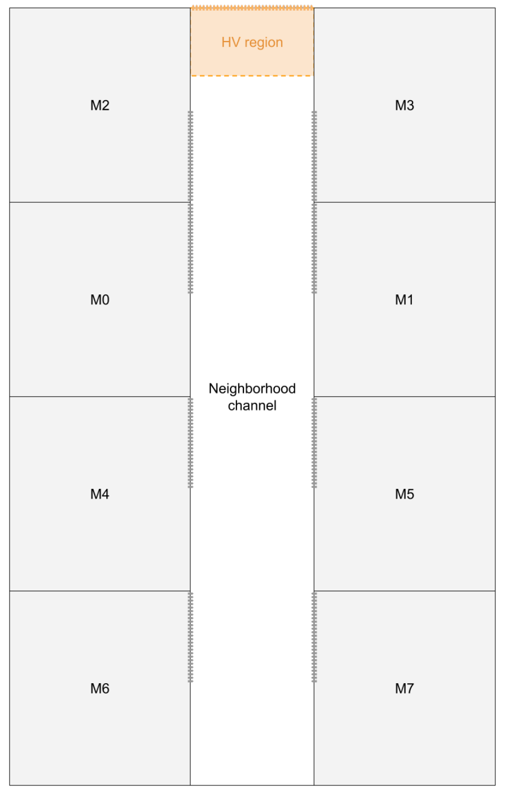

_Figure 2 - Neighborhood Physical Layout_ 

The fact that the Neighborhood Channel has such an elongated form factor makes it challenging to synthesize, place, and route the design. As the logic in the channel is shared among all the Minions, it naturally tends to accumulate in the center of the channel, with thousands of wires going in and out of the common logic area. Also, all the signals connected to the ports need to traverse the channel up to the north interface. This, in addition to the long distances, makes timing and congestion the main bottlenecks of the Neighborhood’s physical design. 

## 3 Interfaces 

The following is a list of all the interfaces of the Neighborhood and their ports: 

**Neighborhood Interfaces**

|**Interface**|**Port**|**I/O**|**Description**|
|---|---|---|---|
|System signals (see Clock and |clock|I|Neighborhood clock|
|Reset Signals)|clock_shire|I|Shire clock|
||reset_c_shire|I|Shire cold reset|
||reset_d_shire|I|Shire debug reset|
||reset_w_shire|I|Shire warm reset|
||reset_warm|I|Global warm reset|
||reset_w_icache|O|Warm reset to the ICache L1 data RAM|
|DFT (refer to the |dft__scanin_hv|I|Scan In|
|DFT Specification)|dft__scanout_hv|O|Scan Out|
||dft__scan_mode_hv|I|Scan Mode|
||dft__reset_byp_hv|I|Reset bypass|
||dft__scan_enable_hv|I|Scan Enable|
||dft__test_mode_hv|I|Compression selection|
||dft__reset_hv|I|Design for Testing (DFT) mode reset|
||dft__clock_gate_en_hv|I|Integrated Clock Gating (ICG) Test Enable (TE) connection|
||dft__cntl_hv|I|Spare bus|
||dft__occ_scanin_hv|I|On-Chip Clock Controller (OCC) scan input|
||dft__occ_scanout_hv|O|OCC scan output|
||dft__occ_reset_hv|I|OCC reset|
||dft__occ_testmode_hv|I|OCC test mode|
||dft__scan_ate_clk_hv|I|Automatic Test Equipment (ATE) shift clock|

|dft__occ_bypass_hv|I|OCC bypass|
|---|---|---|
|dft__use_reset_cntl_hv|I|DFT reset control|
|dft__reset_cntl_hv|I|DFT reset control|
|esr_minion_mem_override|I|Memory control override from Test Data Register (TDR)|

###### **Neighborhood Interfaces** 

|**Interface**|**Port**|**I/O**|**Description**|
|---|---|---|---|
|ECO|eco_i|I|_Unconnected ports. Reserved for_ _ECO_|
||eco_o|O||
|Power control (see Power Control |pwr_ctrl_glb_nsleepin|I|Neighborhood power control|
|and Isolation)|pwr_ctrl_glb_nsleepout|O|Neighborhood current power state|
||pwr_ctrl_glb_isolate|I|Neighborhood isolation|
||pwr_ctrl_min_nsleepin|I|Per-Minion power control _Unused in A0_|
||pwr_ctrl_min_nsleepout|O|Per-Minion current power state _Unused in A0_|
||pwr_ctrl_min_isolate|I|Per Minion isolation control _Unused in A0_|
|Debug (see Debug)|bpam_rc_tbox_ack_hi|O|Texture Box (TBOX) run control status _Unused in A0_|
||bpam_run_control|I|Basic Partitioned Access Method (BPAM) run control|
||dmctrl|I|IOShire debug control ESR|
||esr_and_or_tree_L0|O|Minion run control status|
|External configuration |esr_clk_gate_ctrl|I|Minion clock gate override|
|(see External Configuration)|shire_id|I|Shire ID|
||neigh_id|I|Neighborhood ID|
||shire_tbox_id|I|TBOX ID _Unused in A0_|
||shire_tbox_en|I|TBOX enable _Unused in A0_|
||esr_thread0_enable|I|Minion thread 0 enable|
||esr_thread1_enable|I|Minion thread 1 enable|
||esr_minion_features|I|Features supported by Minions|
||esr_shire_coop_mode|I|Cooperative mode enable|
|ICache Prefetch (see ICache)|esr_icache_prefetch_conf|I|ICache prefetch configuration|
||esr_icache_prefetch_start|I|ICache prefetch start|
||esr_icache_prefetch_done|O|ICache prefetch done|
|ICache Error Reporting |esr_icache_err_detected|O|ICache error detected notification|
|(see ICache)|esr_icache_err_logged|O|ICache error logged notification|

###### **Neighborhood Interfaces** 

|**Interface**|**Port**|**I/O**|**Description**|
|---|---|---|---|
|DLL feedback (see Clocks)|dll_feedback_shire|O|Shire clock output for DLL feedback|
||dll_feedback_neigh|O|Neighborhood clock output for DLL feedback|
|DLL delay estimation |esr_dll_dly_est_ctl|I|DLL delay estimation control|
|(see DLL delay Estimation)|esr_dll_dly_est_sts|O|DLL delay estimation status|
|ET-Link request (see Request |neigh_sc_req_info|O|ET-Link request|
|Datapath)|neigh_sc_req_valid|O|ET-Link request valid|
||neigh_sc_req_ready|I|ET-Link request ready|
|ET-Link response (see Response |neigh_sc_rsp_info|I|ET-Link response|
|Datapath)|neigh_sc_rsp_valid|I|ET-Link response valid|
||neigh_sc_rsp_ready|O|ET-Link response ready|
|Status Monitor|hw_dbg_sm_monitor_enabled|I|Status Monitor logic enable|
|(see Debug)|neigh_sm_gpio|I|Status Monitor General Purpose Input/Output (GPIO) bus|
||neigh_sm_signals|O|Status Monitor signals|
|APB (see APB Access)|APB_ESR_req|I|APB request|
||APB_ESR_rsp|O|APB response|
|Interrupts (see Interrupts)|int_mtip|I|Machine Timer Interrupt|
||int_meip|I|Machine External Interrupt|
||int_seip|I|Supervisor External Interrupt|
||ipi_msip|I|Machine Software Interrupt|
||ipi_redirect_trigger|I|Redirect Inter-Processor Interrupt (IPI)|
|FCC (see Fast Credit Counter)|uc_to_neigh_fcc|I|Fast Credit Counter (FCC) increment|
||uc_to_neigh_fcc_target|I|FCC target|
|FLB (see Fast Local Barrier)|flb_neigh_l2_req_valid|O|FLB request valid|
|Barrier)|flb_neigh_l2_req_data|O|FLB request data|
||flb_l2_neigh_resp_valid|I|FLB response valid|
||flb_l2_neigh_resp_data|I|FLB response data|
|L1 ICache data RAM (see ICache)|icache_f2_sram_req_write|O|L1 ICache data Random Access Memory (RAM) write request|
||icache_f2_sram_req_addr|O|L1 ICache data RAM request address|
||icache_f2_sram_req_valid|O|L1 ICache data RAM request valid|
||icache_f2_sram_req_ready|I|L1 ICache data RAM request ready|
||icache_f0_sram_resp_dout|I|L1 ICache data RAM response data|
||icache_f0_sram_resp_valid|I|L1 ICache data RAM response valid|
||icache_f0_sram_resp_ready|O|L1 ICache data RAM response ready|
|Voltage monitor (refer to the Voltage Monitor documentation)|voltage_monitor_vdd|O|VDD sense point Analog signal|
||voltage_monitor_vss|O|VSS sense point Analog signal|
|Cooperative TLoad (see Cooperative TensorLoad)|coop_tload_slv_rdy_out_data|O|Cooperative TLoad slave ready output bus|
||coop_tload_slv_rdy_out_valid|O|Cooperative TLoad slave ready output valid|
||coop_tload_slv_rdy_in_data|I|Cooperative TLoad slave ready input buses|
||coop_tload_slv_rdy_in_valid|I|Cooperative TLoad slave ready input valid|
||coop_tload_mst_done_out_coop_id|O|Cooperative TLoad master done output bus|
||coop_tload_mst_done_out_valid|O|Cooperative TLoad master done output valid|
||coop_tload_mst_done_in_coop_id|I|Cooperative TLoad master done input buses|
||coop_tload_mst_done_in_valid|I|Cooperative TLoad master done input valid|

_Table 1 - Neighborhood Interfaces_ 

## 4 Building Blocks 

#### 4.1 Minions 

The Minions are the basic CORE-ET cores located at the lowest level of the hierarchy. Each Minion is a dual-threaded, in-order, single-issue, RISC-V core extended with a proprietary 8- lane Single-Instruction Multiple-Data (SIMD) extension. 

The Minions are composed of a Frontend (FE) unit for fetching instructions from an external, shared, Instruction Cache (see ICache). Instructions are then fed to the decoder unit that will ship them either to the integer pipeline (intpipe) or to the vector unit (VPU) pipeline. Refer to the <u>Intpipe Description for further details on the Frontend and integer pipelines.</u> 

Each Minion core has its own 4 KB private Data Cache (DCache). Refer to the <u>DCache Description for further details.</u> 

The vector unit supports a custom ET SIMD extension that allows for eight floating point values to be operated on in the same cycle. The vector unit supports transcendental instructions and Tensor instructions that accelerate machine learning applications. Refer to the Minion VPU <u>Specification</u> for further details. 

Each Minion has a set of CSRs that can be consulted in the <u>Minion CSRs</u> spreadsheet. 

For further details on the Minion architecture, refer to the <u>Minion Description.</u> 

#### 4.2 ICache 

The Minion core does not have a private Instruction Cache (ICache). Instead, there is a single ICache in the Neighborhood Channel that is shared among the eight Minions. 

The ICache has a quite particular two-level architecture determined by the location of the data RAMs. The memory cells used to implement the ICache data RAMs need to be placed in an HV region; however, the Neighborhood voltage domain is an LV region. Thus, the data memory has been placed outside of the Neighborhood (in the Shire Channel), which results in very high access latency. To work around this, a lower level microcache has been added between the Minions and the main ICache so that the Minion Core still sees a low latency access. The ICache is thus composed of the following: 

- L0 microcache: A lower-level 16-entry fully-associative cache. There are two instances of the L0 microcache (i.e. the north and south microcaches), each of which are shared by four Minions. The access of the Minions is arbitrated in the Neighborhood Channel. 

- L1 ICache: This is the main cache. The L1 ICache is 32 KB in size (128 sets and 4 ways). The data RAMs are located outside of the Neighborhood and are accessed asynchronously from the L1 ICache pipeline. The two L0 microcaches arbitrate to access the L1 ICache when they miss a fetch request. 

When the L1 ICache misses a fetch request, it accesses the L2 Shire Cache through the common ET-Link request datapath of the Neighborhood Channel (see <u>Request datapath).</u> 

A dedicated interface has been defined for the Minion’s Frontend to access the ICache. The interface is described in the Frontend-ICache Interface Description. 

The CORE-ET platform offers a code prefetching service that software can use to preload critical kernels into the shared ICaches prior to executing them. This service is programmed through some Shire ESRs that reach the ICache through the ICache Prefetch interface. Refer to the Code Prefetching Facility section of the PRM for further details on how to program the code prefetching service. 

The ICache can report certain types of errors, like Single-Bit Errors (SBEs) or Double-Bit Errors (DBEs) in a cache line. Error notifications are controlled by the following Neighborhood ESRs: icache_err_log_ctl, icache_err_log_info, icache_err_log_address, and icache_sbe_dbe_counts (see <u>ET System Registers). These ESRs can also send a global error</u> notification to the IOShire through the ICache Error Reporting interface. The ICache error notification follows the Error Logging and Reporting specification, the details of which are outside the scope of this document. 

For further details on the ICache architecture, refer to the <u>ICache Description.</u> 

#### 4.3 Request Datapath 

The request datapath connects the request interfaces of all the Neighborhood agents that have access to memory to the next level of the hierarchy (i.e. it gives them access to the Shire Cache and the Uncached block) according to the Shire Interconnect – ET-Link Specification. 

The data size of the request datapath is 256 bits, so larger transfers will be completed using multiple cycles. 

The request datapath is composed of an arbiter where all the agents are connected, a preprocessing stage to adapt the requests to the output format, a set of FIFOs that hold requests depending on their destination, and a final up-conversion to 512 bits and arbitration to access the output request interface. The agents that have access to memory and thus are connected to the request datapath arbiter are the Minions, the ICache, the Cooperative TensorLoad and Cooperative TensorStore units, and the Page Table Walkers2 . 

The following figure shows a diagram of the full request datapath from the arbiter up to the output interface: 

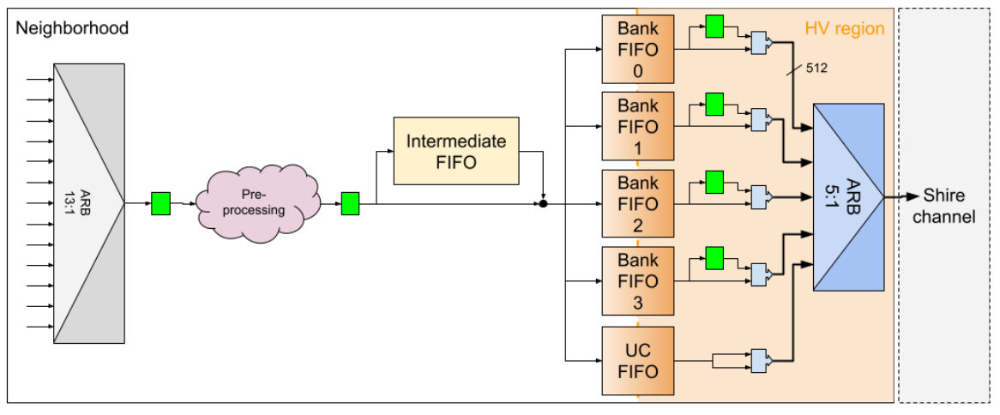

_Figure 3 - Neighborhood Request Datapath_ 

##### 4.3.1 Minion Request Datapath 

The Minions have their own request datapath before they reach the request datapath arbiter. Every Minion has two request interfaces that come from the DCache, which are shown in the table below. Each Minion request interface is connected to a buffering module that distributes the requests appropriately. 

|**Interface**|**Ports**|**I/O**|**Description**|
|---|---|---|---|
|Minion miss request|l2_dcache_miss_req|O|20-bit wide ET-Link request interface with 3 valid/ready pairs (Type B: 1-hot valid)|
||l2_dcache_miss_req_valid|O|Regular and cooperative load requests are sent through this interface|
||l2_dcache_miss_req_ready|I||
|Minion evict request|l2_dcache_evict_req|O|256-bit wide ET-Link request interface with 2 valid/ready pairs (Type B: 1-hot valid)|
||l2_dcache_evict_req_valid|O|Evicts, messages, atomic, and cache operations and any other regular or cooperative store requests are sent through this interface|
||l2_dcache_evict_req_ready|I||

2 Virtual Memory logic is unused in A0 (see Page Table Walkers) 

_Table 2 - Minion Request Interfaces_ 

The miss request interface is connected to the Miss FF module, which contains three FlipFlops (each receiving from one of the valid/ready pairs). One of these FFs is used for regular loads and the other two are used for cooperative TensorLoads from the DCache’s TensorLoad 0 and TensorLoad 1 modules. 

The evict interface is connected to the Evict FF module, which contains two Flip-Flops (each receiving from one of the valid/ready pairs). One of these FFs is used for regular stores (including messages and atomic and cache operations) and the other is used for cooperative TensorStores. The FFs can store a 512-bit ET-Link request, so whenever a 512-bit request comes through (i.e. a multicycle transfer), it uses two clock cycles to coalesce the full request into the FFs, and two more cycles to split it again into a 256-bit multi-cycle transfer. 

The Cooperative TensorLoad FFs within the Miss FF module send cooperative TLoad requests to the Cooperative TensorLoad unit. This unit synchronizes and combines cooperative TLoad requests from the Minions and sends a single cooperative request to the request datapath arbiter (see <u>Cooperative TensorLoad</u> for details). 

Similarly, the Cooperative TensorStore FF within the Evict FF module sends cooperative TStore requests to the Cooperative TensorStore unit. This unit combines partial writes from different Minions and sends a full cache line write request to the request datapath arbiter (see <u>Cooperative TensorStore for details).</u> 

Messages sent from one Minion to another Minion in the same Neighborhood that meet certain requirements will be routed from the regular Evict FF to the Fast Local Messaging Network, which interconnects the Minions of a Neighborhood for fast messaging (see <u>Fast Local Messaging Network for details).</u> 

Any other requests (regular loads, regular stores, other messages, and atomic and cache operations) that come from either the regular Miss FF or the regular Evict FF will go to the Minion request arbiter. This is a 2:1 priority arbiter (evict requests get higher priority) that multiplexes the Minion requests going to the next level of the hierarchy into a single bus. That bus is then flopped and connected to the general request datapath arbiter. If a multicycle transfer (i.e. a 512-bit evict request) comes through, the arbiter assigns two consecutive cycles to the Evict FF, so that the request is not interleaved with another one. 

The following diagram shows the Minion request datapath: 

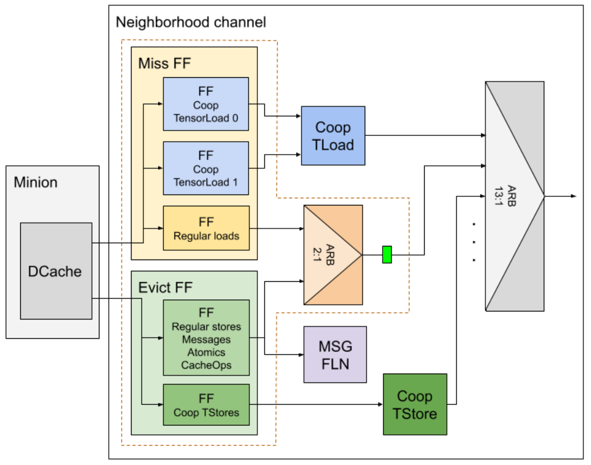

_Figure 4 - Minion Request Datapath_ 

The maximum throughput of each of the FFs in the Miss FF and Evict FF modules is one request every other cycle (a new request cannot be stored until the previous one has been cleared). The minimum latency of the regular Minion request datapath from the Minion’s output up to the request datapath arbiter input is two clock cycles, assuming that the request is immediately accepted by the Minion request arbiter. However, 512-bit evict requests see a latency of three clock cycles as the 256-bit transfers are first coalesced in the Evict FFs and then split again. 

##### 4.3.2 Request Datapath Arbiter 

The request datapath arbiter is a 13:1 Round-Robin (RR) arbiter that multiplexes all the agents’ requests into a single ET-Link bus. RR arbitration ensures that no agent will starve. 

Due to the timing issues arising from such a big arbiter, it has been implemented in two stages. In the first stage, the Round-Robin arbitration control is calculated and the different agents are multiplexed in groups of four or less. The outputs of the different multiplexers along with the arbitration control are flopped and, in the second stage, a final 4:1 multiplexer selects the winner agent. The selected request is finally flopped and sent out through the request datapath. 

The arbiter architecture is depicted in the following figure: 

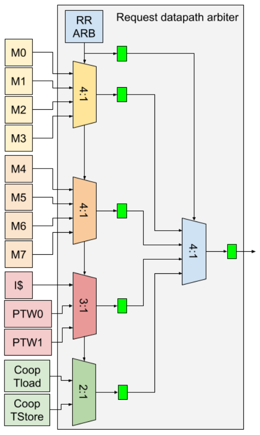

_Figure 5 - Request Datapath Arbiter Architecture_ 

If a multicycle transfer (i.e. a 512-bit request) comes through, the arbiter assigns it two consecutive cycles, so that the request is not interleaved with another one. 

The minimum latency of the request datapath arbiter is two clock cycles, assuming that the request is immediately accepted by the arbiter. 

##### 4.3.3 ET-Link Request Pre-Processing 

ET-Link requests coming out of the request datapath arbiter are pre-processed to adapt them to the output format prior to sending them to the output FIFOs. The pre-processing includes two steps: 

1. Addresses within the scratchpad region can come in two possible equivalent formats. Independent of the format, however, the scratchpad addresses always get transformed to the common L2 format (refer to the Scratchpad Region section of the <u>PRM: Memory Map for details).</u> 

2. If the request is a WriteAround going to the local scratchpad, it is converted into a regular write to prevent it from being sent to the Shire Cache coalescing buffer (refer to the Coalescing Buffer section of the <u>Shire Cache Specification for details)</u> 

The output of the pre-processing logic is flopped. Thus, this step adds 1 clock cycle to the total request datapath latency. 

##### 4.3.4 Intermediate and Output FIFOs 

In order to maximize the throughput into the L2 Shire Cache banks, five output FIFOs have been added to the request datapath, one per each of the following possible destinations: four Bank FIFOs for requests going to each of the Shire Cache banks and a UC FIFO for requests going to the UC block. This configuration prevents head-of-line blocking by a backlogged bank. 

The FIFO depth is three entries. Multicycle transfers (i.e. 512-bit requests) will take two consecutive entries in the FIFO. 

At the same time, the output FIFOs serve as clock and voltage crossing elements, so their output is already in the Shire clock domain and HV region. They are implemented using specific library semi-synchronous Voltage Crossing (VC) FIFOs (see Clock Domain Crossing and <u>Voltage Domain Crossing</u> for further details). 

To further prevent the datapath from being blocked by a stalled bank, an additional FIFO (the so-called Intermediate FIFO) has been added in parallel to the request datapath. The Intermediate FIFO contains one counter per each of the output FIFOs that counts how many requests in the Intermediate FIFO are addressed to that output FIFO. If either a request is addressed to an output FIFO that is full, or there are requests going to the same output FIFO already in the Intermediate FIFO, or the Intermediate FIFO is writing to any output FIFO, then the request is stored into the Intermediate FIFO instead. The head request of the Intermediate FIFO can get out if the output FIFO it is addressed to has available entries. The Intermediate FIFO depth is two entries. 

The request datapath can only push one request into the output FIFOs at a time. Therefore, a request will be pushed into the Intermediate FIFO if the Intermediate FIFO is writing simultaneously to any output FIFO, even if the request may otherwise have bypassed it. Furthermore, to avoid timing issues, if the Intermediate FIFO is full, back-pressure is applied to the request datapath even if the next request would have bypassed the Intermediate FIFO and gone directly to an output FIFO (only the availability of the Intermediate FIFO is checked). 

The minimum latency of the FIFOs is one clock cycle, assuming that the Intermediate FIFO is bypassed and that the corresponding destination is not stalled. The actual observed latency might differ slightly, as the output clock (i.e. the Shire clock) of the output FIFOs is shifted by a half cycle with respect to the input clock (see Clocks). 

##### 4.3.5 Output Request Interface 

Once at the HV region, the request is first up-converted to a 512-bit ET-Link request. If the request is carrying 512 bits of data (i.e. if it was a multicycle transfer), the first half is stored in an FF and combined with the second half at the output of the FIFO. This is only done for the four bank FIFOs, as requests going through the UC FIFO cannot be larger than 256 bits. In this case, the request data field is just replicated into the lower and upper halves of the final 512-bit bus. 

Finally, the five outputs are multiplexed into a 5:1 Round-Robin arbiter. The output request interface is an ET-Link bus with 5 valid/ready pairs, one per destination. This interface uses a Type B handshake (i.e. it is one-hot valid). The arbiter combines the ready signals coming in from the different destinations with the valid signals from the output FIFOs to select which pairs are ready to bid for access into the arbiter. The arbiter selects one and drives it into the output request interface by setting the corresponding valid signal. 

No additional latency is added in the final stage of the request datapath after the output FIFOs, as the arbitration needs to be done combinationally with the ready signals coming in from the Shire Cache crossbar (assuming that it is a single-cycle request, as the first half of multicycle requests need to go through the FF). 

The maximum throughput of the request datapath is one request per clock cycle, although 512-bit requests can only be served every other cycle, as they need two cycles to complete a full request. The overall minimum latency of the request datapath is four clock cycles for agents other than Minions. The latency for Minions adds up to six clock cycles due to the additional logic in the Minion request datapath. 

#### 4.4 Response Datapath 

The response datapath routes the ET-Link responses from the input response interface all the way to the originating Neighborhood agents. Similar to the request datapath, it also follows the <u>Shire Interconnect – ET-Link Specification. The data size of the response datapath is 512</u> bits. 

The response datapath is composed of a Voltage Crossing (VC) FIFO to cross clock and voltage domains, a connection to the Cooperative TensorLoad unit in order to retrieve the necessary information to distribute cooperative responses, and the so-called Fill FIFO module, which distributes the responses among the different agents. The agents that are connected to the response datapath are the Minions, the ICache and the Page Table Walkers3 . 

The following figure shows a diagram of the full response datapath from the input interface up to the receiving agents: 

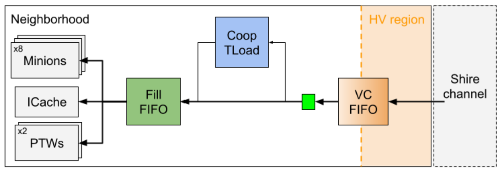

_Figure 6 - Neighborhood Response Datapath_ 

##### 4.4.1 Input Response Interface and Cooperative TLoad Access 

After getting into the Neighborhood, the ET-Link responses first go through a semisynchronous VC FIFO to cross to the Neighborhood clock domain and LV region (see Clock <u>Domain Crossing</u> and <u>Voltage Domain Crossing for further details).</u> 

Once at the LV region, the responses are sent into the Fill FIFO module. In addition, responses to cooperative TensorLoad requests access the Cooperative TensorLoad table in parallel (see <u>Cooperative TensorLoad). The necessary information to broadcast the response to the</u> cooperating Minions is obtained and sent to the Fill FIFO module along with the response itself. 

The minimum latency of the input request interface is two clock cycles. The actual observed latency might differ slightly, as the output clock (i.e. the Neighborhood clock) of the VC FIFO is shifted by a half cycle with respect to the input clock (see Clocks). 

3 Virtual Memory logic is unused in A0 (see Page Table Walkers) 

##### 4.4.2 Fill FIFO 

The Fill FIFO receives the ET-Link responses along with the cooperative information (if applicable) and distributes them to their destination. Despite its name, it does not actually behave like a FIFO, but rather contains a shared buffer that can be emptied out of order. 

The following figure shows a diagram of the Fill FIFO: 

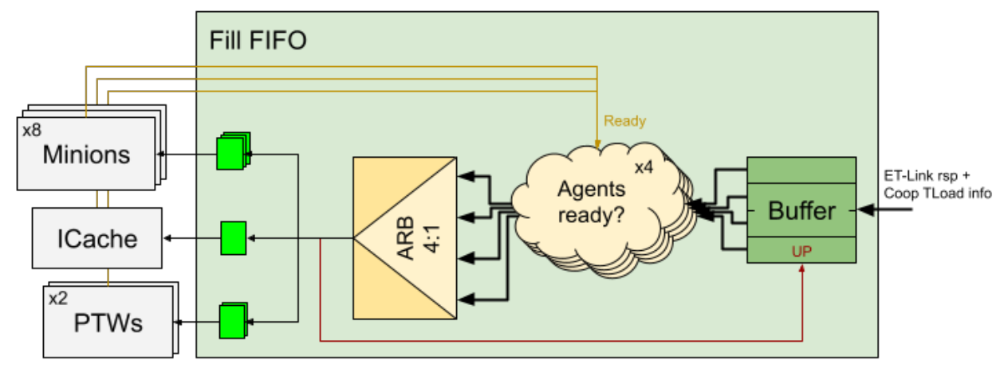

_Figure 7 - Fill FIFO_ 

When the ET-Link responses enter the Fill FIFO, they are stored in a buffer with four entries. All the entries in the buffer are checked in parallel against the ready signals coming from the agents that the response is addressed to. Cooperative TLoad responses may be addressed to more than one Minion simultaneously, so they will check the ready signals from all the cooperating Minions. All the entries that are ready to be delivered (i.e. those whose agents are ready to receive them) go to a Least Recently Used (LRU) 4:1 arbiter so that the oldest response is chosen. The response is finally flopped and sent to the corresponding agent or agents. The FF is replicated per destination to help with timing closure. 

If a cooperative TLoad response is partially ready (i.e. some, but not all, of the cooperating Minions are ready) and there is no other response that is ready to be delivered, then the cooperative TLoad response will be sent to the Minions that are ready. In this case, the entry is not removed from the buffer, but the mask of cooperating Minions is updated to clear those that have already received the response. 

The maximum throughput of the response datapath is one response per clock cycle. However, as the output of the Fill FIFO is flopped, the ready signal sent by the agents might not be up to date (i.e. it may say that it is currently ready but might not be ready in the next cycle when the response is to be delivered). The Fill FIFO checks if a flopped response is being currently delivered to an agent, and, if so, it assumes that that agent will not be ready in the next cycle to receive a new one (except for RSP_Ack responses, as these can be received back to back). While this reduces the throughput to a specific agent down to one response every other cycle, it distributes the traffic better among the different agents. 

The minimum latency of the Fill FIFO is two clock cycles, assuming that the receiving agents are ready to receive and that there is no other response with higher priority pending in the buffer. For agents other than Minions, the overall minimum latency of the response datapath is four clock cycles. However, due to the additional logic in the Minion response datapath, the latency for Minions adds up to six clock cycles. 

##### 4.4.3 Minion Response Datapath 

The Minions have their own response datapath after the Fill FIFO output. Every Minion has  a response interface going to the DCache, which is shown in the following table: 

|**Interface**|**Ports**|**I/O**|**Description**|
|---|---|---|---|
|Minion fill response|l2_dcache_resp l2_dcache_resp_valid l2_dcache_resp_ready|I I O|256-bit wide ET-Link response interface with 1 valid/ready pair All the ET-Link responses and messages are received through this interface|

_Table 3 - Minion Response Interface_ 

Each Minion response interface is connected to a buffering module that collects responses from the Neighborhood and routes them to the DCache appropriately. The buffering module is the so-called Fill FF, which contains a FIFO that receives responses from the Fill FIFO, the Fast Local Messaging Network, and the Cooperative TensorStore unit, converts them down to 256-bit responses, and finally sends them to the Minion. 

Regular responses going to the Minions are sent from the Fill FIFO into the Fill FF. Messages sent from one Minion to another Minion in the same Neighborhood that meet certain requirements are routed through the Fast Local Messaging Network into the Fill FF of the receiving Minion (see <u>Fast Local Messaging Network</u> for details). The Cooperative TensorStore unit snoops the output of the FIFO within the Fill FFs. When it detects an RSP_Ack response for a cooperative TensorStore request, it replicates and injects it into the Fill FF of all the cooperating Minions (see <u>Cooperative TensorStore</u> for details). 

These three response sources access the FIFO through a priority arbitration, where the messages from the Fast Local Network (FLN) take the highest priority, followed by the regular responses from the Fill FIFO and the RSP_Ack responses for cooperative TStore requests from the Cooperative TensorStore unit. However, for timing reasons, the access of the FLN is reserved 1 clock cycle ahead (i.e., the ready signal for the FLN occurs one cycle after the valid signal is asserted), which increments its access latency by one cycle. 

At the output of the FIFO, the responses are sent through a 256-bit ET-Link response bus. If the response carries 512 bits of data, it is split into two halves (i.e., it is converted into a multicycle transfer). The 256-bit bus is flopped for timing reasons and finally connected to the Minion response interface. 

The following diagram shows the Minion response datapath: 

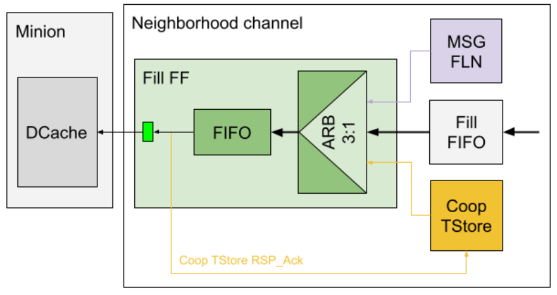

_Figure 8 - Minion response Datapath_ 

The maximum throughput of the Minion response datapath is one response per clock cycle, although 512-bit responses can only be accepted every other cycle, as the Minion response interface is 256-bit wide. The minimum latency of the Minion response datapath is two clock cycles, assuming that the response is immediately accepted by the arbiter, although messages from the FLN see a latency of three clock cycles, as they first need to reserve access one clock cycle ahead. 

#### 4.5 Cooperative TensorLoad 

TensorLoad is a pseudo-instruction encoded as a write to a CSR that loads data from memory (bypassing the L1) into the L1 scratchpad. It is part of the ET Tensor Extension (refer to the TensorLoad Instructions section of the PRM: Tensor Extension for further details). The ET Tensor Extension also provides a cooperative variant of the TensorLoad operation that can be used when multiple Minions operate on the same data in parallel. When loading cooperatively, memory requests to the same memory location from multiple Minions are coalesced into a single request to provide better performance and power. 

The Cooperative TLoad logic is located in the Neighborhood. It allows Minions from all the Neighborhoods in a Shire to cooperate so that a single TensorLoad request is sent to memory. To accomplish this, there are two buses (the coop_tload_slv_rdy and coop_tload_mst_done buses) that interconnect the Cooperative TLoad logic of all the Neighborhoods in a Shire. 

The cooperative TensorLoad requests from the different Minions are sent to the Cooperative TensorLoad logic, where they are synchronized and combined into a single request. These requests use the special ET-Link cooperative read operation. This operation is similar to a regular read, except that the data field carries relevant information for the cooperation, namely the mask of cooperating Minions, the mask of cooperating Neighborhoods, and a unique cooperative identifier. Refer to the Cooperative Read section of the Shire Interconnect – ET- <u>Link Specification</u> for further details. 

Based on the Neighborhood mask and certain bits of the requested address, the master Neighborhood is determined (this is done without any kind of data interchange between the cooperating Neighborhoods). The Neighborhoods then need to synchronize before the master Neighborhood sends the request out to memory. Slave Neighborhoods only need to send a “ready” notification to the master Neighborhood, which is done through the coop_tload_slv_rdy bus. There is a credit scheme implemented for slave Neighborhoods to send the “ready” notification to the master Neighborhood in order to avoid the need for big buffering. 

Once the master Neighborhood has received the “ready” notification from all the slave Neighborhoods, it returns the credits through the coop_tload_mst_done bus and finally sends the cooperative request through the request datapath arbiter (see Request Datapath). 

The response sent by the Shire Cache will be delivered to all the cooperating Neighborhoods. The Cooperative TLoad logic includes a table that stores relevant information for each inflight cooperative transaction. That information is retrieved when the response comes back through the response datapath so that it can be delivered to every cooperating Minion (see Response <u>Datapath).</u> 

For further details on the functionality and implementation of the Cooperative TensorLoad operation, refer to the <u>Minion Shire Cooperative TensorLoad Description.</u> 

#### 4.6 Cooperative TensorStore 

TensorStore is a pseudo-instruction encoded as a write to a CSR that writes a matrix to memory. It is part of the ET Tensor Extension (refer to the TensorStore Instructions section of the <u>PRM: Tensor Extension for further details). The ET Tensor Extension also provides a</u> cooperative variant of the TensorStore operation that can be used when multiple Minions operate on the same data in parallel. When storing cooperatively, memory requests from multiple Minions to the same memory location are coalesced into a single request to provide better performance and power. 

The Cooperative TStore logic is located in the Neighborhood. This allows pairs or quads of Minions to work together to write portions of a cache line. The TStore requests are generated in the Minions following the indications from SW, placing the information in the appropriate portion of the ET-Link 256-bit data interface. 

- In the case of Pair-128, the Minion places the data in either the lower or upper 128-bit portion of the data bus, depending on the address. The combined 256-bit data chunk is placed by the cooperative logic in the Neighborhood in either the lower or upper portion of the 512-bit request sent to the L2, depending on the address. 

- In the case of Pair-256, the two cooperating Minions fill the 256 bits of the data interface, and the cooperative logic builds the 512-bit request to the L2 from it. 

- Finally, in the case of the Quad-128 cooperating mode, the Minions place the data on the upper or lower part of the 256-bit chunk, depending on the address assigned to each Minion. The cooperative logic combines the four 128-bit portions to build the 512bit request to the L2. 

Given that only four consecutive Minions (indexes 0 to 3 or indexes 4 to 7) can cooperate to perform a TensorStore operation, there are two identical blocks that respectively handle the cooperative operations for each group. These two blocks are named TensorStore Buffer North (for Minions 0 to 3) and TensorStore Buffer South (for Minions 4 to 7). 

The composite store requests from the North or South blocks are then stored into a 256-bit wide FIFO after an arbitration process that ensures that 512-bit transfers (which take two cycles to complete) are not split by another transfer sneaking in between them. 

The following is a diagram of the ET-Link interfaces involved in cooperative TStore requests: 

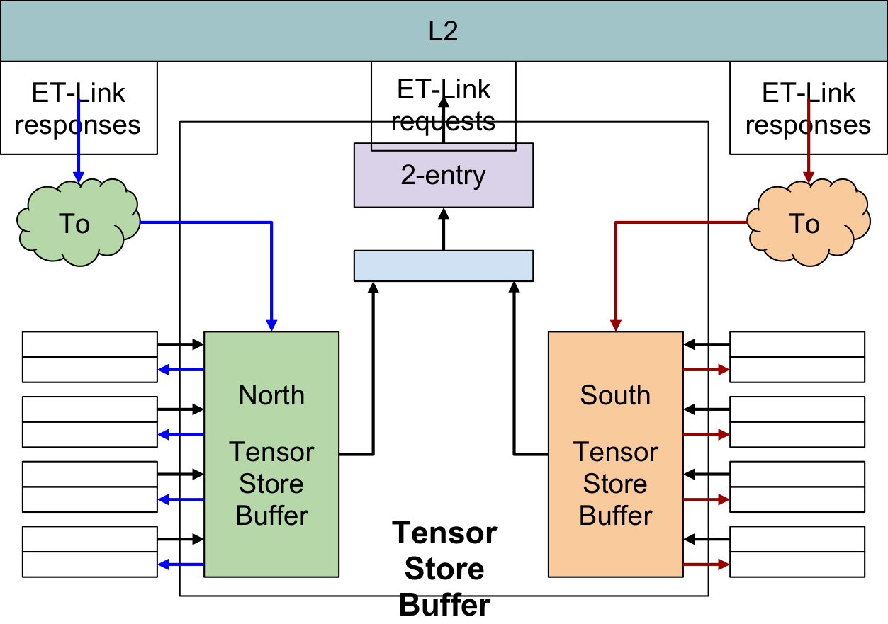

_Figure 9 - Structure of the TensorStore Buffer_ 

As can be seen in the previous figure, there are two ET-Link interfaces with each Minion. The request interface, which carries data from the Minions, and the ACK interface to acknowledge the end of the transaction. There is only one combined request that goes to the L2 interface. This request is identified with the ID of the Minion that is the “master” of the store operation. In this case, “master” means the lower Minion index participating in the operation. For Quad128 operations, this is always Minion 0 (north) or 4 (south). For Pair-128 and Pair-256, the master Minion can be 0 or 2 (north) or 4 or 6 (south). 

All Minions cooperating in a TensorStore operation have to hold their request valid until the other cooperating Minions have each generated their own request and the “ready” indication from the Tensor Buffer is received. The operation goes to the next stage only after all the Minions participating in the same cooperative operation show their requests to the TensorStore Buffer. The cooperative mask therefore must be checked to ensure that no operations are mixed. For instance, software programs Minions 0 and 1 to do a Pair-128 operation and Minions 0, 1, 2, and 3 to do a Quad-128 operation. Therefore, Minions 2 and 3 will not get an acknowledgement when Minions 0 and 1 send their request for the Pair-128 operation; they will have to wait until Minions 0 and 1 complete the Pair-128 operation first and then they can generate the requests associated with the Quand-128 operation. 

Once the response (ACK) is sent back to the “master” Minion, the individual responses to the remaining Minions are generated by the TensorStore Buffer. The north and south blocks snoop the answers and once they detect the expected ACK response, a copy is sent back to the other Minions participating in the cooperative operation. For instance, in a northern Quad128 operation, Minion 0 will receive the response directly from L2. Once this response is detected, an identical response is also sent to Minions 1, 2, and 3. These responses are routed via a specific interface in the “Minion Fill FF” block associated with each Minion (see <u>Request Datapath section).</u> 

#### 4.7 Fast Local Messaging Network 

The ET-Link specification defines an operation named REQ_MsgSendData that provides a mechanism for Minions (and potentially, any other agent) to interchange information through directed messages (check the Shire Interconnect - ET-Link Specification for further details). 

When a message is sent through an ET-Link request channel, there is no reply to the source device. Instead, the destination device receives the message as an RSP_MsgRcvData response through the reply channel. The reply must be generated in any of the intermediate routing elements. In general, messages sent by a Minion and addressed to another Minion within the same Neighborhood will go out of the Neighborhood through the request datapath and be routed back into the Neighborhood (by the Shire crossbar) through the response datapath. However, if the message meets certain requirements, it may be routed through the Fast Local Messaging Network. 

For fast message interchange, the FLN connects the Minions within the Neighborhood, preventing intra-Neighborhood messages from traveling round trip out of the Neighborhood and back in, and thus positively impacting performance. However, it is not a 1:1 interconnection, but rather is optimized for Tensor reduction operations. Tensor reduction instructions are pseudo-instructions encoded as writes to a CSR that can be used to transfer and operate on tensor data among harts. Such data transfers are implemented using messages. Refer to the Tensor Reduction Instructions section of the PRM: Tensor Extension for further details. 

Due to the scheme the Minions follow to interchange reduce data, the Minion connections implemented in the FLN are as follows: 

- Minion 7 can send messages to Minion 6 

- Minion 6 can send messages to Minions 7 and 4 

- Minion 5 can send messages to Minion 4 

- Minion 4 can send messages to Minions 6, 5, and 0 

- Minion 3 can send messages to Minion 2 

- Minion 2 can send messages to Minions 3 and 0 

- Minion 1 can send messages to Minion 0 

- Minion 0 can send messages to Minions 4, 2, and 1 

These connections are summarized in the following interconnection table: 

|||||**Receiver Minion**||||||
|---|---|---|---|---|---|---|---|---|---|
|||**0**|**1**|**2**|**3**|**4**|**5**|**6**|**7**|
|**Sender** **Minion** |**0**||X|X||X||||
||**1**|X||||||||
||**2**|X|||X|||||
||**3**|||X||||||
||**4**|X|||||X|X||

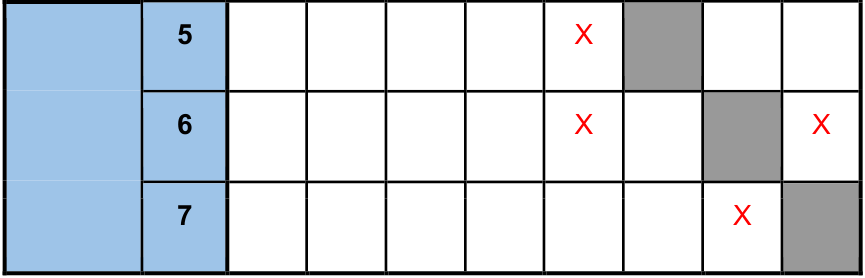

_Table 4 - Fast Local Network Connections_ 

Furthermore, the maximum data size supported for messages sent through the FLN is 256 bits. Therefore, if a Minion sends a message addressed to a paired Minion within the Neighborhood, and the message data size is lower than or equal to 256 bits, the message is routed through the FLN. 

The following figure shows a diagram of the Fast Local Network: 

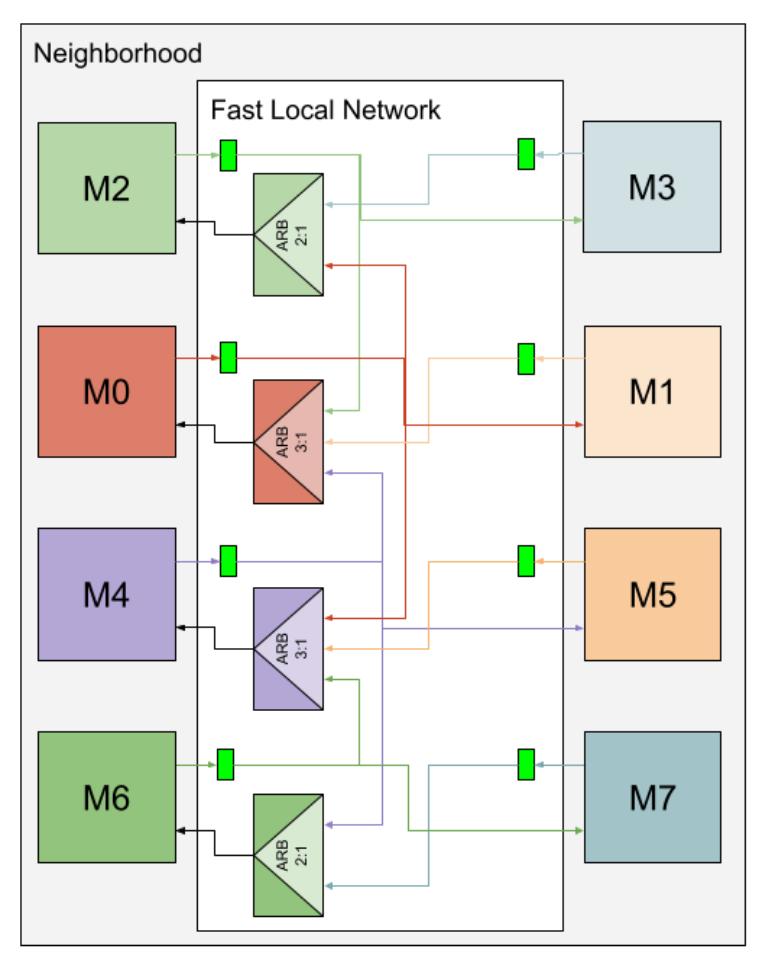

_Figure 10 - Fast Local Network Block Diagram_ 

After a Minion sends a message request through the ET-Link evict request interface, the message response is generated by the Evict FF module, which injects it into the FLN (see <u>Minion Request Datapath section). These responses are first flopped for timing reasons and</u> then sent to the receiver Minion. If the receiver Minion can receive from more than one Minion, it arbitrates all the inputs. While the arbiters in the FLN do implement a priority policy, this should not be important, as the reduction operations should not send messages from different Minions to the same receiver Minion simultaneously. Finally, the FLN sends the message to the Fill FF module of the receiver Minion (see <u>Minion Response Datapath section).</u> 

The distribution of the Minions in the Neighborhood layout is intended to minimize the distances between connected Minions and the congestion caused by the FLN interconnection. 

The FLN supports a maximum throughput of one message per clock cycle per sender Minion, assuming that there are not two Minions sending messages to the same receiver Minion simultaneously. However, this throughput is never reached, because it is limited by the Evict FF module to one message every other cycle. The latency of the FLN is one clock cycle. 

#### 4.8 Fast Local Barrier 

The ET Fast Local Barrier (FLB) extension is designed to provide fast barrier capabilities across the Minions within a Shire. Multiple “barrier counters” are provided that allow a subset of the threads in a Shire to atomically modify the barrier counter and determine whether all threads participating have indeed reached the barrier or not. 

The requests from the Minions to the FLB unit, which is found in the UC block, and the responses back to the Minions are routed through the Neighborhood. The following figure shows a diagram of the FLB routing logic within the Neighborhood. 

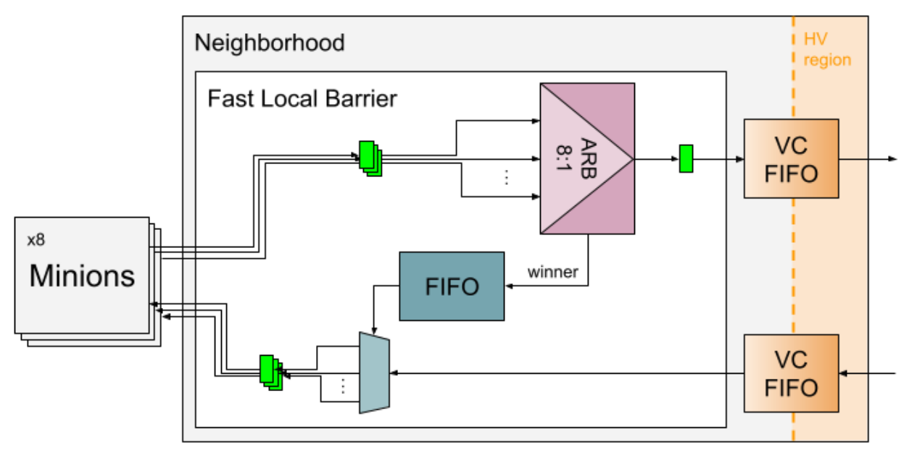

_Figure 11 - Fast Local Barrier Block Diagram_ 

The requests from the eight Minions are first flopped for timing reasons, and then LRUarbitrated. The winner request is flopped once again and sent to a semi-synchronous Voltage Crossing FIFO. Once the request is in the Shire clock domain and HV region, it is finally sent out to the Shire Channel. The index of the winner Minion is stored in a small local FIFO, which contains the Minion indexes of the outstanding FLB requests. The FIFO has a depth of four entries; therefore, it is essential to ensure that there will be no more than four outstanding FLB requests per Neighborhood at any given time. 

The responses from the FLB unit first go through another semi-synchronous VC FIFO to enter the LV region. The indexes from the local FIFO are then used to properly demultiplex the responses and assign them to the Minion they belong to. The responses from the FLB unit are guaranteed to arrive in order. Finally, the responses are flopped and sent to the Minions. 

The minimum latency of the FLB request datapath is three clock cycles, assuming that the local FIFO is not full. The latency of the FLB response datapath is two clock cycles. The actual observed latencies might differ slightly, as the Shire clock is shifted by a half cycle with respect to the Neighborhood clock (see Clocks). 

For further details on the Fast Local Barrier extensions, refer to the Fast Local Barriers section of the <u>PRM: Fast Synchronization Extension.</u> 

#### 4.9 Interrupts 

There are several interrupt lines that are routed from either input ports or Neighborhood ESRs to the Minions. These are as follows: 

- MEIP: Machine-mode External Interrupt. This is a level-triggered interrupt generated by a platform-specific interrupt controller (PLIC) and routed to all the Minions. 

- SEIP: Supervisor-mode External Interrupt. This is a level-triggered interrupt generated by the PLIC and routed to all the Minions. 

- MTIP: Machine Timer Interrupt. This is a level-triggered interrupt generated by a platform real-time counter. There is one interrupt line per Minion. 

- MSIP: Machine Software Interrupt. This is a level-triggered interrupt generated by a SW write to an ESR that can be used by remote harts to provide Machine-mode InterProcessor Interrupts (IPIs). There is one interrupt line per hart. 

- Redirect IPI: ET platform-specific IPI. This is an edge-triggered interrupt generated by a SW write to an ESR that can be used to redirect one or more harts within a Shire to a particular Program Counter (PC). The PC is configured in the Neighborhood ESR ipi_redirect_pc. There is one interrupt line per hart. 

- MIECO: Machine ICache Error Counter Overflow. This is a level-triggered interrupt generated by the ICache error counters located in the Neighborhood ESR esr_icache_sbe_dbe_counts (see <u>ET System Registers). It is routed only to the hart 0</u> of the Neighborhood. 

Check the RISC-V Privileged Spec for further information on the RISC-V interrupts. Both the classic RISC-V IPI and the redirect IPI are described in the IPI Facility section of the <u>PRM.</u> 

#### 4.10 Fast Credit Counter 

The ET Fast Credit Counter (FCC) extension is designed to provide a fast credit mechanism to coordinate different Minions in the system, either within or across Shires. 

Each hart in the system is extended with two local private credit counter CSRs (hence, there are four credit counters per Minion, two per thread) _._ The credit counters can be atomically incremented by remote harts by writing into Shire ESRs. The write is propagated from the Shire ESRs through the Neighborhood and up to the Minions. 

Refer to the Fast Credit Counters section of the <u>PRM: Fast Synchronization Extension</u> for further details. 

#### 4.11 Performance Monitor Unit 

The PMU is a block shared among the eight Neighborhood Minions. It includes a total of twelve 64-bit generic counters that can be used to count any of the events that the Minions and the Neighborhood can generate. Eight counters are reserved for Minion events, while the remaining four are reserved for Neighborhood events. 

The list of events that either any Minion or the Neighborhood can generate and that the programmers can select to monitor the performance of the system are described in the Counters section of the <u>PRM.</u> 

##### 4.11.1 Interface to Minions 

Each Minion has an interface to the PMU unit that allows it to read and write the content of any of the counters and to send events to any of the counters associated with the Minions. One additional signal allows Minions to select which Neighborhood events will be sent to the counters associated with the Neighborhood. The signals in the interface appear in the following table: 

|**Signal Name**|**I/O**|**Brief Description**|
|---|---|---|
|pmu_count_up|O|8-bit signal indicating when any of the counters associated with the Minions has to count one event|
|pmu_read_data|I|64-bit input data, per Minion thread, from the selected read counter|
|pmu_read_sel|O|4-bit signal, per Minion thread, to select the index of the counter to read|
|pmu_write_en|O|12-bit one-hot signal to indicate the register being written|
|pmu_write_data|O|64-bit output data to write into the selected counter|
|pmu_neigh_event_sel|O|5-bit signal, per Neighborhood counter, to select the event for each counter to count _Table 5 - Minion-PMU Interface _|

From the previous interface signals, it’s important to take into account the following: 

- Reading a counter 

   - Each one of the two Minion threads has an independent read channel. 

   - The data read from the counters will be available at the Minion input port two cycles after the read_sel signal has been set. 

- Writing a counter 

   - Each one of the Minion threads has a single write channel. 

   - In a given clock cycle, only one thread will write data. 

   - Back-to-back writes to counters are supported. 

   - The counter will be updated two cycles after the write_en signal has been set. 

   - If more than one Minion attempts to write the same counter in the same cycle, the Minion with the lower index will have priority, and the writes from the other Minions will be lost. 

- Incrementing a Minion counter 

   - Signal count_up can be active in the same cycle for the same counter for more than one Minion. When this happens, the counter adds the contribution of all active signals. 

   - This implies that a given counter can combine events from different Minions. 

   - ○ The PMU unit does not know if the events used to increment a given counter are of the same kind or not. It's software’s responsibility to map events of the same kind to the same counter. 

- Incrementing a Neighborhood counter 

- Each Minion has a Neighborhood event selector for each one of the Neighborhood assigned counters. 

- If more than one Minion selects a Neighborhood event to a given counter, the Minion with the lower index will select the actual event to count. 

##### 4.11.2 Power Saving Considerations 

The PMU counters are visible to all the Minions for reading through the “pmu_read_sel” signal described in the previous section. Once this signal is set after a given read operation, the value of the selected counter is continuously propagated to each of the Minion threads that have selected it. If no read operations have been performed, by default, the first counter (mhpmcounter3) is selected. 

If the selected counter is continuously toggling, the updated value will propagate to the Minions, thus toggling the logic and pipeline in the path from the PMU block to each Minion. If the register is not to be continuously read, this is a waste of energy. Therefore, the following recommendations for SW to save some power when using the PMU counters should be considered: 

- Stop the counters when they are not being used. 

- Use the default read counter (mhpmcounter3) in the last instance or to count events that happen seldomly. 

- After reading a counter that has a high toggling rate, read another one that is not toggling or that has the lowest toggling rate. 

##### 4.11.3 Implementation 

The PMU is a simple set of counters with read and write access. Given that the counters are 64-bit wide, to save some area and power, there is a single adder that will increment the value of the register when there are events to count for a given counter. If more than one counter has events to count, the adder will sequentially serve the counters to add the pending events to them. 

Each of the counters has a “pre-counter” that will store the events that come from the Minions or the Neighborhood. Once the “pre-counter” gets an overflow bit, this is added to the main counter body. The pre-counter is 7-bits wide, mainly because the adder can, in the worst case, serve one of the counters every 12 cycles (number of counters). Given that each counter can combine events of up to 8 Minions, the total accumulated value in one “pre-counter” in 12 cycles is 96 units. Hence, 7 bits are necessary to ensure that there aren’t two overflows in the same counter without having added the first to the main register counter. 

The main counter has the remaining 57 bits. The adder combines the 57 bits with one overflow bit in a single cycle. A simple control logic keeps cycling the pointer to the different counters while there are events (overflows) to count. 

A schematic representation of the structure of the shared PMU counters is shown in the following figure: 

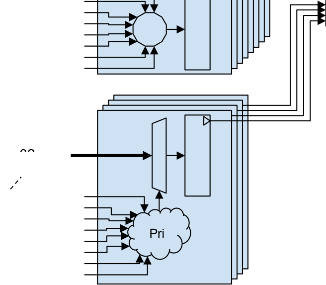

_Figure 12 - Representation of the PMU Implementation_ 

The previous figure does not show the logic for reading or writing a counter, but only the flow to add events to the different counters. 

When a read access from a Minion is received, it works totally in parallel with the counting mechanism. A simple multiplexer selects the 57 bits of the main register and combines it with the associated 7 bits of the pre-counter. The combination of the 57 Most Significant Bits (MSBs) and the 7 Least Significant Bits (LSBs) makes the 64-bit counter value. Notice that for simplicity of implementation, the “overflow” bit of the pre-counter is not delivered. This implies that there may be eventual reads that show a value that is smaller than the previous read. Software must be aware of this situation and perform a new read if the value in the counter is not monotonically increasing. 

A write access has priority for updating the content of the counter over the regular event counting update. Any write will clear the overflow bit of the pre-counter and distribute the 64bit input among the pre-counter (7 LSBs) and the main register counter (57 MSBs). 

#### 4.12 APB Access 

The Neighborhood has an input/output APB that allows for read and write accesses to the following resources: 

- Neighborhood ESRs 

- ICache: L1 ICache tags and L0 microcache data, tags, and error flags 

- Minions: DCache data and tags, CSRs, and other internal registers 

All the ESRs in the Neighborhood ESR block are mapped in the ET Memory Map. They are the only resource that can be accessed during normal operation by the Shire Bus Master (which is the interface between the Shire and the main NoC). Refer to the Minion Shire ESR Map section of the PRM: Memory Map for further details on how to access the Neighborhood ESRs. 

On the other hand, debug accesses from the Shire UltraSoc BPAM module have access to all the resources connected to the APB. These are visible through the Debug Memory Map, which is explained in the Minion Shire Debug Map section of the PRM: Memory Map. Refer to the <u>Debug section for further details on debug accesses.</u> 

The following figure shows a diagram of the APB connections within the Neighborhood: 

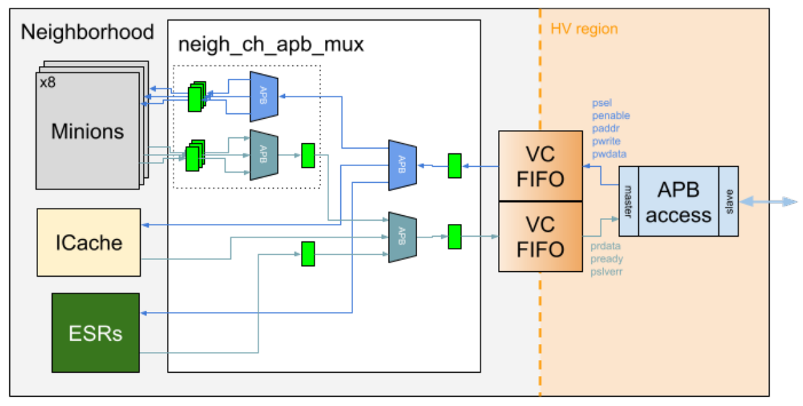

_Figure 13 - Diagram of the APB Connections Within the Neighborhood_ 

In the HV region, there is an APB bridge that acts as a slave hanging from the input APB and as the master of the Neighborhood agents. The internal APB is first converted to the LV region. Once there, the APB signals are flopped for timing reasons, appropriately demultiplexed in order to target the desired endpoint according to the address of the APB transaction, and finally pipelined to the different destinations. 

#### 4.13 External Configuration 

There are a variety of external configuration signals and ESRs that are used to configure certain Neighborhood features. The following are all the external configuration input ports: 

- **esr_clk_gate_ctrl:** Debug signal with chicken bits to manually override Minion automatic block clock gates. It comes from the clk_gate_ctrl Shire ESR. 

   - **Intpipe clock gate disable:** Bit 0: Disable the Intpipe clock gate of all the Minions 

   - **VPU lane clock gate disable:** Bit 1: Disable the VPU lane clock gate of all the Minions 

   - **VPU TIMA clock gate disable:** Bit 2: Disable the VPU TIMA clock gate of all the Minions 

   - **VPU TRANS clock gate disable:** Bit 3: Disable the VPU TRANS clock gate of all the Minions 

   - **DCache clock gate disable:** Bit 4: Disable the DCache clock gate of all the Minions 

   - **Frontend clock gate disable:** Bit 5: Disable the Frontend clock gate of all the Minions 

- **shire_id:** Virtual Shire ID. It comes from the shire_config Shire ESR (refer to the SHIRE_CONFIG section of the <u>PRM).</u> 

- **neigh_id:** Neighborhood ID. It is not configurable (each Neighborhood ID is hardwired). 

- **shire_tbox_id:** TBOX ID4 

- **shire_tbox_en:** TBOX enable5 

- **esr_thread0_enable:** Thread 0 enable per Minion. It is controlled from the thread0_disable Shire ESR. 

- **esr_thread1_enable:** Thread 1 enable per Minion. It is controlled from the thread1_disable Shire ESR (refer to the THREAD1_DISABLE section of the <u>PRM) and</u> the _Disable Multithreading_ field of the minion_feature Shire ESR (refer to the MINION_FEATURE section of the <u>PRM).</u> 

- **esr_minion_features:** Features supported by the Minions. It comes from the minion_feature Shire ESR (refer to the MINION_FEATURE section of the <u>PRM).</u> 

- **esr_shire_coop_mode:** Cooperative mode enable. This bit is set to enable cooperative operations within the Shire, namely cooperative TensorLoads, cooperative TensorStores, and code prefetching services (refer to the SHIRE_COOP_MODE section of the <u>PRM).</u> 

#### 4.14 Page Table Walkers 

**_NOTE:_** _The Page Table Walkers are part of the Virtual Memory logic, which is unused and not tested in A0. Although the VM logic is included in the RTL implementation and will be briefly covered here, its actual behavior is undefined._ 

The Page Table Walkers (PTWs) receive requests from the cache TLBs to access the Page Table and return a specific Page Table Entry according to the virtual address that is being accessed from the cores. There are two Page Table Walkers per Neighborhood, namely the north and the south PTWs, each of which is shared by four minions (i.e. the DCache TLBs) and one L0 microcache TLB. The access of the five TLBs is arbitrated in the Neighborhood Channel. 

The PTWs access the Page Table, which is allocated in memory, through the request and response datapaths of the Neighborhood, similarly to the other agents sharing access to memory (i.e. the PTW requests are sent through the request datapath arbiter and the responses are received from the Fill FIFO). 

#### 4.15 TBOX Logic 

**_NOTE:_** _The TBOX logic is part of the graphics logic, which is not implemented in A0, although it will be briefly described here._ 

The ET Texture Extension would allow software to make texture requests to a specialized texture acceleration unit (known as the TBOX). Software would prepare “texture requests” in its local cache, then it would communicate with the texture accelerator using a messaging protocol so that it could read the texture request from the requestor’s local cache, process it, compute the result and return it to the requestor. 

There was meant to be one TBOX associated with each Neighborhood, physically placed at the south of the Neighborhood Channel. It was supposed to have a single ET-Link request 

> 4 Graphics logic is unused in A0 (see <u>TBOX Logic)</u> 

> 5 Graphics logic is unused in A0 (see <u>TBOX Logic)</u> 

and response interface with the Neighborhood, which would have been used both for access to the L2 Shire Cache and for the messaging protocol with the Minions. 

The TBOX router would thus have routed requests, responses, and messages between the Neighborhood and the TBOX. Message requests from the Minions would have been routed from the request datapath into the TBOX router and to the TBOX. Messages coming back from the TBOX would have gone through the TBOX router and been injected into the appropriate Fill FF. Requests from the TBOX to the L2 Shire Cache would have been arbitrated in the request datapath arbiter, while responses from the L2 Shire Cache would have been sent from the Fill FIFO into the TBOX router and to the TBOX. 

In the end, the graphics logic was not included in A0, thus the TBOX router and associated logic in the Neighborhood is not implemented. However, there may be remaining unused logic associated with the TBOX that was not removed (e.g. the TBOX-specific ESRs or the bpam_rc_tbox_ack_hi debug port, which was meant to be used with the TBOX run control). 

## 5 ET System Registers 

All the ET System Registers (ESRs) defined in the CORE-ET Platform are found in the ESR region of the Memory Map. All ESRs are 64 bits in size and aligned to a 64-bit boundary. Refer to the ESR Regions section of the PRM: Memory Map for further details. 

Neighborhood ESRs are located within the Neighborhood ESR sub-region of the Minion Shire space (refer to the Minion Shire ESR Map section of the <u>PRM: Memory Map). These are</u> Neighborhood-specific registers that are shared by all the Minions as well as the common logic within a Neighborhood. 

The latency of accesses to Neighborhood ESRs, as seen from the Neighborhood interface, is five clock cycles (see APB Access). The actual observed latency might differ slightly, as the Shire clock is shifted by a half cycle with respect to the Neighborhood clock (see <u>Clocks). The</u> total latency to access a Neighborhood ESR may be higher, depending on the external logic connected to the Neighborhood APB and the source of the access request. 

The full list of Neighborhood ESRs can be found under the Neigh ESR section of the <u>Minion ESRs spreadsheet. A detailed description of all the Neighborhood ESRs is also provided</u> below for reference. For those that have a full description in a separate document, a reference to the appropriate section of the document is provided instead: 

#### 5.1 MINION_BOOT 

Refer to the MINION_BOOT section of the <u>PRM.</u> 

#### 5.2 MPROT 

Refer to the MPROT section of the PRM. 

#### 5.3 VMSPAGESIZE 

Refer to the VMSPAGESIZE section of the <u>PRM.</u> 

#### 5.4 IPI_REDIRECT_PC 

Refer to the IPI_REDIRECT_PC section of the <u>PRM.</u> 

#### 5.5 HACTRL 

Refer to the HACTRL ESR section of the Debug High-Level Specification. 

#### 5.6 HASTATUS0 

Refer to the HASTATUS0 ESR section of the <u>Debug High-Level Specification.</u> 

#### 5.7 HASTATUS1 

Refer to the HASTATUS1 ESR section of the <u>Debug High-Level Specification.</u> 

#### 5.8 AND_OR_TREEL0 

Refer to the AndOrTreeL0 ESR section of the <u>Debug High-Level Specification.</u> 

#### 5.9 PMU_CTRL 

63 

1 0 

0 (WARL) Disable clock 63 1 

**Address:** 0x01C0100068 + (Shire# << 22) + (Neigh# << 16) **Size:** 1b **Access** : R/W **Privilege Level:** Machine **Reset Value:** 0x0 **Description:** If enabled, it disables the PMU logic 

#### 5.10 NEIGH_CHICKEN 

|63|8|7 6|5|4 3|2|1|0|
|---|---|---|---|---|---|---|---|
||0 (WARL)|Agent forced|Force all agents|Dest FIFO|Force Dest FIFO|Bypass DCache|Bypass ICache|
||56|2|1|2|1|1|1|

**Address:** 0x01C0100070 + (Shire# << 22) + (Neigh# << 16) **Size:** 8b **Access** : R/W **Privilege Level:** Machine **Reset Value:** 0x0 

**Description:** Debug register with chicken bits to manually control certain Neighborhood resources 

- **Bypass ICache:** Bit 0: ICache is bypassed. It still fetches cachelines, but fetched lines are not cached. 

- **Bypass DCache:** Bit 1: DCache is bypassed. It still loads from and stores data to memory, but data is not cached. 

- **Force Dest FIFO:** Bit 2: If enabled, requests in the request datapath are routed to the output FIFO specified in 'Dest FIFO'. 

- **Dest FIFO:** Bits [4:3]: Output FIFO to which requests are routed when ‘Force Dest FIFO’ is enabled: 

   - 0x0: Bank FIFOs: Send requests to the Bank FIFOs. The specific Bank FIFO is selected according to the request address. 

   - 0x1: UC FIFO: Send requests to the UC FIFO. 

   - 0x2, 0x3: Unused in A0. Undefined behavior. 

- **Force all agents:** Bit 5: If this is enabled when ‘Force Dest FIFO’ is also enabled, requests from all the Neighborhood agents are routed to the output FIFO specified in 'Dest FIFO'. 

- **Agent forced:** Bits [7:6]: When ‘Force Dest FIFO’ is enabled and ‘Force all agents’ is disabled, this is the Neighborhood agent whose requests are forced into the output FIFO specified in ‘Dest FIFO’: 

   - 0x0: DCache (i.e. all Minion requests). 

   - 0x1: ICache. 

   - 0x2, 0x3: Unused in A0. Undefined behavior. 

- **WARL(0)** : Bits [63:8] 

#### 5.11 ICACHE_ERR_LOG_CTL 

Refer to the ICACHE_ERR_LOG_CTL section of the <u>ICache Description.</u> 

#### 5.12 ICACHE_ERR_LOG_INFO 

Refer to the ICACHE_ERR_LOG_INFO section of the <u>ICache Description.</u> 

#### 5.13 ICACHE_ERR_LOG_ADDRESS 

Refer to the ICACHE_ERR_LOG_ADDRESS section of the <u>ICache Description.</u> 

#### 5.14 ICACHE_SBE_DBE_COUNTS 

Refer to the ICACHE_SBE_DBE_COUNTS section of the <u>ICache Description.</u> 

#### 5.15 TEXTURE_CONTROL 

TBOX-specific ESR6 . 

#### 5.16 TEXTURE_STATUS 

TBOX-specific ESR7 . 

#### 5.17 TEXTURE_IMAGE_TABLE_PTR 

TBOX-specific ESR8 . 

> 6 Graphics logic is unused in A0 (see <u>TBOX Logic)</u> 

> 7 Graphics logic is unused in A0 (see <u>TBOX Logic)</u> 

> 8 Graphics logic is unused in A0 (see <u>TBOX Logic)</u> 

## 6 Clock and Reset Signals 

#### 6.1 Clocks 

There are two clocks operating in the Neighborhood (see table below). 

|**Clock Name**|**Frequency (MHz)**|**Description**|
|---|---|---|
|clock|1000|Main Neighborhood clock Feeds the Minions and Neighborhood Channel logic It is a version of clock_shire shifted by 180º|
|clock_shire|1000|Shire clock Feeds logic directly connected to the Neighborhood ports|

_Table 6 - Neighborhood Clocks_ 

The Shire clock is the clock that drives most of the Minion Shire logic. It is generated by the Phase-Locked Loop (PLL) found in the Shire Channel. The Neighborhood interface to the Shire Channel runs with this clock, thus the Shire clock drives all the logic directly connected to the Neighborhood ports. 

The Neighborhood clock is the main clock at this hierarchy level. It is a derived version of the Shire clock shifted by 180º and generated by the DLL found in the Shire Channel. It drives the Minions and most of the Neighborhood Channel logic. 

Both clocks are fed back to the DLL through the output ports dll_feedback_shire and dll_feedback_neigh so that the clock skew between them can be actively monitored and compensated. For further details on how both clocks are generated, refer to the <u>Minion Shire Description. For further information on how to control the clock skew using the DLL, refer to Minion Shire DLL Constraints.</u> 

##### 6.1.1 Clock Domain Crossing 

As the two clocks used in the Neighborhood have the same source, both domains are separated by a semi-synchronous <mark>interface (i.e. same clock with a different phase).</mark> 

Specific library elements, such as semi-synchronous FIFOs or registers, have been used in the actual implementation of the Clock Domain Crossing, which depends on the nature of each interface (single-bit interrupt signals, semi-static configuration registers, APB master/slave interface, ET-Link interface, etc). These semi-synchronous elements take advantage of the fact that both clocks are synchronized and are just shifted by a constant angle of 180º (which is ensured by the DLL mechanism). 

The following table lists all the interfaces along with the synchronization method implemented for each direction (relative to the Neighborhood): 

|**Interface**|**Direction**|**Synchronization**|
|---|---|---|
|Reset signals|Input / Output|See Resets|
|DFT|Input / Output|Refer to the DFT Specification|
|ECO|Input / Output|N/A|
|Power control|Input / Output|Not synchronized (false paths)|
|Debug|Output (status)|Semi-synchronous FIFO|
||Input (control)|Semi-synchronous FIFO|
|Configuration ESRs|Input|Semi-synchronous register|
|ICache Prefetch|Input (request)|Semi-synchronous FIFO|
||Output (acknowledgment)|Semi-synchronous FIFO|
|ICache Error Reporting|Output|Semi-synchronous register|
|DLL feedback|Output|N/A|
|DLL delay estimation|Input / Output|Not synchronized (it operates in the Shire clock domain)|
|ET-Link request|Output|Semi-synchronous FIFO|
|ET-Link response|Input|Semi-synchronous FIFO|
|Status Monitor|Input (configuration)|Semi-synchronous register|
||Output (Neighborhood status)|Semi-synchronous FIFO|
|APB|Input (request)|Semi-synchronous FIFO|
||Output (response)|Semi-synchronous FIFO|
|Interrupts|Input (from PLIC)|Metastability filter register (asynchronous inputs synchronized to Shire clock domain) + Semi-synchronous register|
||Input (MSIP)|Semi-synchronous register|
||Input (Redirect IPI)|Semi-synchronous FIFO|
|FCC|Input|Semi-synchronous FIFO|
|FLB|Output (request)|Semi-synchronous FIFO|
||Input (response)|Semi-synchronous FIFO|
|L1 ICache data RAM|Output (request)|Semi-synchronous FIFO|
||Input (response)|Semi-synchronous FIFO|
|Voltage monitor|Output|Not synchronized (analog signals)|
|Cooperative TLoad|Input / Output|Not synchronized (it interconnects the|
|||Cooperative TLoad logic in the Neighborhood clock domain directly to the other Neighborhoods)|

_Table 7 - Synchronization Method for Each Neighborhood Interface_ 

##### 6.1.2 DLL Delay Estimation 

The Delay-Locked Loop (DLL), which is contained in the Shire Channel, compensates for the variable delays in the distribution network of the Shire and Neighborhood clocks. This delay may change depending on the voltage, temperature, process, etc. 

It is extremely important that the two feedback paths are “perfectly” equalized and that any physical variation equally impacts both paths, otherwise the delay applied by the DLL will be offset by the difference between these two paths, leading to an incorrect timing relationship in the Shire-to-Neighborhood interface. 

Given the potential problems that may arise in real silicon with the clocking scheme in the Neighborhood based on the dynamic delay adjustment with the DLL, a backup set of programmable delay lines have been implemented in order to control the Neighborhood clock delays. Additionally, a block has been integrated in the Neighborhood to test the integrity of the semi-synchronous interface. This module sends pseudo-random generated codes through a loopback path, and the number of erroneous words is tracked. This way, software can evaluate the programmed delay against the detected errors and adjust it to a sweet point with no error detection on that interface. 

For further information on the DLL delay estimation mechanism, refer to the <u>Minion Shire DLL Delay Control.</u> 

#### 6.2 Resets 

The resets in the Neighborhood divide into resets externally generated (i.e. in the Shire Channel), that are mainly used for the logic in the Shire clock domain, and resets generated in the Neighborhood, which are used for the logic in the Neighborhood clock domain. 

Both groups of resets are generated in a very similar way using a sys_gasket module. The resets are generated by combining several types of global signals as follows: 

- reset_cold: Shire input reset from the IOShire. It resets all the sequential elements that can be reset. This is the main reset applied after power-up or when a full reset is required. 

- reset_warm: Shire input reset from the IOShire. It is similar to reset_cold, except that it does not reset certain memory elements, like some ESRs or VC FIFOs, to avoid losing the configuration. 

- dmctrl.ndmreset: Shire input signal from the IOShire. It is a signal from the debug control input bus similar to reset_warm, except that it does not reset debug modules (i.e. it resets all the “non-debug” logic). 

- bpam_run_control.gpio.ndmreset: Signal internal to the Shire. It is a signal generated in the Shire debug modules that has exactly the same behavior as dmctrl.ndmreset. 

- dmctrl.dmactive: Shire input signal from the IOShire. It is a signal from the debug control input bus that generates a reset for the debug logic upon deactivation (i.e. a falling edge of this signal generates a reset pulse for the debug logic). 

The output generated resets from the sys_gasket module are: 

- reset_c: Directly connected to the reset_cold input. It is used for memory elements that only need to be reset at system power-up or full reset. 

- reset_w: Combines reset_cold, reset_warm, and the different sources of ndmreset. It is used to reset any non-debug logic that is not reset by reset_c. 

- reset_d: Combines reset_cold, reset_warm, and the dmctrl.dmactive falling edge. It is used to reset the debug logic. 

The three reset signals generated in the Shire Channel enter the Neighborhood through the input ports reset_c_shire, reset_w_shire, and reset_d_shire. For further information on how these resets are generated, refer to the Reset section of the <u>Minion Shire Description.</u> 

To generate the Neighborhood internal resets, the input ports reset_c_shire, reset_warm, dmctrl.ndmreset, bpam_run_control.gpio.ndmreset, and dmctrl.dmactive are used. The global reset signal reset_cold is not routed to the Neighborhood as reset_c_shire is equivalent, which saves a port. 

The diagram in _Figure 14_ shows how the resets are generated and routed in the Neighborhood. They are generated in the Neighborhood clock domain and distributed to the Neighborhood Channel and Minions. 

For Minions, the warm reset is generated in the neigh_ch_dbg module after merging the Neighborhood warm reset with other debug logic that is specific for resetting the Minions. For more information, refer to the MAS: Minion Shire Debug documentation. 

The ICache data RAMs, which are located in the Shire Channel (see <u>ICache), are reset</u> simultaneously to the Neighborhood through the reset_w_icache output port. This reset signal is generated by propagating the Neighborhood warm reset back to the Shire clock domain. 

All the reset signals in the Neighborhood are distributed with the aid of reset repeaters. These modules implement asynchronous reset assertion and synchronous deassertion. They are used both to help meet timing requirements on long paths and to switch to a different clock domain. 

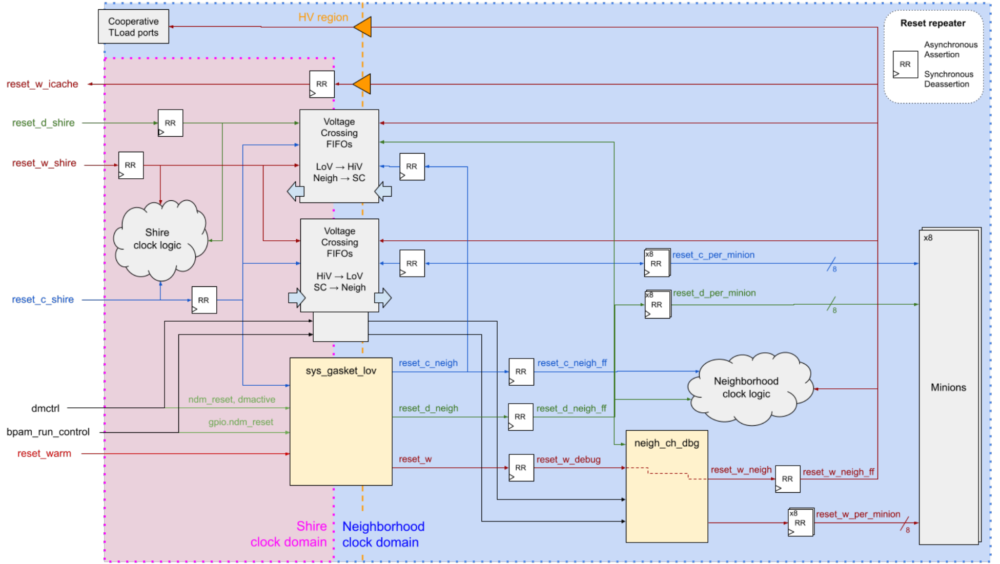

_Figure 14 - Neighborhood Reset Diagram_ 

The following diagram shows the internal structure of the sys_gasket module instantiated in the Neighborhood along with the input Neighborhood clock and clock feedback connection, including the level shifters used for Voltage Domain Crossing (see <u>Voltage Domain Crossing).</u> 

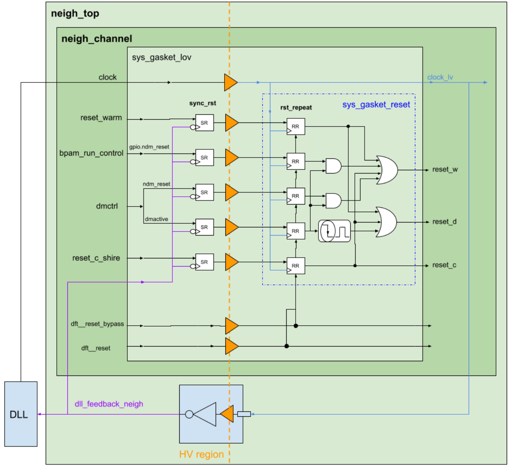

_Figure 15 - Internal Structure of the sys_gasket Module_ 

The input signals are first re-synchronized to the Neighborhood clock domain (using the Neighborhood clock feedback) and level-shifted to the LV region. The Neighborhood resets are then generated and distributed to the Neighborhood Channel and the Minions. 

## 7 Voltage Domains 

The Neighborhood is divided into two different voltage domains, namely the XLV power domain (or LV region) and the ULV power domain (or HV region), which are described in the Minshire section of the <u>Power Spec.</u> 

The LV region includes the Minions and most of the Neighborhood Channel logic and is directly related to the Neighborhood clock domain. 

On the other hand, the HV region is used as the interface between the Neighborhood and the Shire Channel (which operates in the ULV power domain), and thus includes all the logic directly connected to the Neighborhood ports. The HV region is mostly associated with the Shire clock domain (except for the Cooperative TLoad ports, which are detailed in <u>Cooperative TensorLoad).</u> 

#### 7.1 Voltage Domain Crossing 

To separate both voltage domains, the specific library elements mentioned in Clock Domain <u>Crossing</u> include internal level shifters appropriately placed so that both the Clock and Voltage Domain Crossing are performed within a single element. 

The diagram in _Figure 16_ shows an example of the semi-synchronous Voltage Crossing FIFOs used to cross from high-to-low voltage regions and vice-versa. The FIFO structure is divided into the Shire clock high voltage region (orange module) and the Neighborhood clock low voltage region (blue module). It defines a boundary (red line) between them where voltage level shifters are placed. The memory cells are always contained in the HV region independently of the direction of the interface, as performance and access time improve with the voltage. 

For interfaces that are not re-synchronized (i.e. Power control and Cooperative TLoad), simple level shifters are used to cross voltage domains. 

The Voltage Domain Crossing of the clock and reset signals is done inside the same sys_gasket module used to generate the Neighborhood resets (see <u>Clock and Reset signals).</u> 

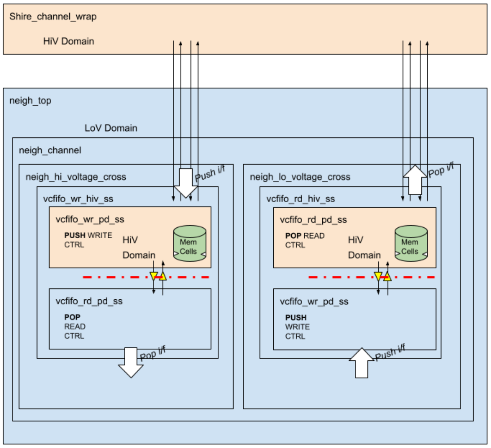

_Figure 16 - Structure of the Semi-Synchronous VC FIFOs_ 

#### 7.2 Power Control and Isolation 

The Neighborhood can be powered off and on dynamically. More specifically, the XLV power domain may be powered off while the ULV domain is in an always-on state. To isolate the XLV power domain once it is powered off, signals going from the XLV to the ULV power domain are protected by isolation cells. 

To control the Neighborhood power, there are several power control ESRs found in the Shire ESR block: 

- Shire Global Power Control: Allows each Neighborhood to be individually isolated and powered on or off. 

- Neighborhood Power Control sleepin: Allows each Minion to be individually powered on or off. This feature is not supported in A0. 

- Neighborhood Power Control isolation: Allows each Minion to be individually isolated. This feature is not supported in A0. 

- Neighborhood Power Control sleepout: Indicates the individual power status of each Minion. This feature is not supported in A0. 

For further details on Minion Shire power states, the isolation strategy, and power control ESRs, refer to the <u>Power Spec.</u> 

##### 7.2.1 Logical Stubbing 

Apart from the isolation cells, logical stubbing is applied to certain ports when the Neighborhood is powered off. The purpose is to avoid misbehaviors that may be caused either by any VDC component that is partially switched off or by an external device trying to access a powered-off Neighborhood. These forced values make the Neighborhood behave like a sink for incoming requests and also prevent it from sending spurious requests to the outer world. 

The following table lists the output ports that are stubbed when the Neighborhood is powered off along with the forced values: 

|**Port Name**|**Width (Bits)**|**Forced Logical Value**|**Notes**|
|---|---|---|---|
|reset_w_icache|1|0||
|eco_o|10|‘0|(1)|
|pwr_ctrl_glb_nsleepout|1|0||
|pwr_ctrl_min_nsleepout|8|‘0||
|bpam_rc_tbox_ack_hi|2|‘1|(2)|
|esr_icache_prefetch_done|1|1||
|esr_icache_err_detected|1|0||
|esr_icache_err_logged|1|0||
|esr_and_or_tree_L0|10|‘0||
|neigh_sc_req_valid|5|‘0||
|neigh_sc_rsp_ready|1|1||
|APB_ESR_rsp|66|‘1|(3)|
|flb_neigh_l2_req_valid|1|0||
|icache_f2_sram_req_write|1|0||
|icache_f2_sram_req_valid|1|0||
|icache_f0_sram_resp_ready|1|1||
|coop_tload_slv_rdy_out_valid|1|0||
|coop_tload_mst_done_out_valid|3|‘0||

_Table 8 - Neighborhood Stubbed Ports_ 

Notes: 

- (1) ECO ports are unconnected and reserved for potential metal fixes. As their functionality is unknown, a low logical value has been chosen by default. If a certain functionality is assigned in the future, it is always possible to select the appropriate polarity to match the forced values and invert the connected signals appropriately. 

- (2) The value is chosen to acknowledge any run control command9 . 

> 9 Graphics logic is unused in A0 (see <u>TBOX logic)</u> 

(3) The value is chosen so that the “pready” and “pslverr” APB signals are high. 

However, it is still not guaranteed that a certain interface will not misbehave if it is accessed from the outside. In general, the system should not try to access a Neighborhood that has been powered off. Otherwise, unexpected behaviors may be seen and the system may hang. As a rule of thumb, the following features should NOT be used when a Neighborhood is powered off: 

- ICache prefetching service. This feature should not be used at all or the mask should be appropriately set so as not to enable it on a powered-off Neighborhood (refer to the Code Prefetching Facility section of the PRM for details) 

- Cooperative TensorLoad. This feature should not be used at all or the mask should be appropriately set so as not to enable it on a powered-off Neighborhood (refer to <u>Minion Shire Cooperative TensorLoad for details)</u> 

- Tensor reduction operations (refer to the Tensor Reduction Instructions section of the <u>PRM: Tensor Extension</u> for details) 

- Any other operation that sends a message to a powered-off Neighborhood 

- Fast Local Barrier (see <u>Fast Local Barrier)</u> 

- Any type of interrupt, including IPIs (see <u>Interrupts)</u> 

- Fast Credit Counters (see <u>Fast Credit Counter)</u> 

- Any type of debug access (see <u>Debug)</u> 

- DLL delay estimation (see DLL Delay Estimation) 

## 8 Debug 

The Neighborhood allows multiple debug capabilities: 

- APB access. This gives the UltraSoc BPAM module write and read access to certain Neighborhood resources (see APB Access for details). The accessible resources are described in the Minion Shire Debug Map section of the <u>PRM: Memory Map</u> and in the Neighborhood APB Mux View section of the <u>Debug Memory Map.</u> 

- Run control. This allows the debugger to send certain requests to the Minions within the Neighborhood (halt, resume, reset, etc.) as well as snoop Minion status bits (halted, resume acknowledgement, error, exception, etc.). Run control operations can be independently controlled both by the IOShire and the BPAM module within the Shire Channel through the dmctrl and bpam_run_control input buses, respectively. These buses also give control over certain debug resets (see Resets). 

- Status Monitor: The UltraSoc Status Monitor in the Shire Channel allows for monitorization of the Minion and Neighborhood internal signals, including filtering and tracing data. There is a tree of Minion and Neighborhood Channel internal signals connected to the Status Monitor (SM) through a series of multiplexers (controlled through the SM GPIO bus), that can be configured by the debugger. The Neighborhood internal signals that can be accessed from the SM are listed in the Minion Shire Neigh Channel tab of the <u>UST Status Monitor Debug Signals.</u> 

Refer to the <u>MAS: Minion Shire Debug documentation for further details on debug</u> implementation. 

## 9 Glossary 

APB Advanced Peripheral Bus ATE Automatic Test Equipment BPAM Basic Partitioned Access Method CDC Clock Domain Crossing CSR Control and Status Register DBE Double-Bit Error DCache Data Cache DFT Design For Testing DLL Delay-Locked Loop ECO Engineering Change Order ESR ET System Register FCC Fast Credit Counter FE Frontend FF Flip Flop FIFO First-In First-Out FLB Fast Local Barrier FLN Fast Local Network GPIO General Purpose Input/Output HV High Voltage ICache Instruction Cache Intpipe Integer pipeline ID Identifier IPI Inter-Processor Interrupt KB Kilobytes L# Level # (of a cache memory) LV Low Voltage MEIP Machine External Interrupt Pending MIECO Machine ICache Error Counter Overflow MSIP Machine Software Interrupt Pending MTIP Machine Timer Interrupt Pending OCC On-Chip Clock Controllers PA Physical Address PC Program Counter PLIC Platform-Level Interrupt Controller PLL Phase-Locked Loop PMU Performance Monitor Unit PRM CORE-ET Programmer’s Reference Manual PT Page Table PTE Page Table Entry PTW Page Table Walker RAM Random Access Memory RR Round-Robin RTL Register Transfer Level SBE Single-Bit Error SC Shire Cache SCP Scratchpad SEIP Supervisor External Interrupt Pending SIMD Single-Instruction Multiple-Data SM Status Monitor 

|SW|Software|
|---|---|
|TBOX|Texture Box|
|TDR|Test Data Register|
|TLB|Translation Lookaside Buffer|
|TLoad|TensorLoad|
|TStore|TensorStore|
|UC|Uncached block|
|ULV|Ultra Low Voltage|
|VA|Virtual Address|
|VC|Voltage Crossing|
|VDC|Voltage Domain Crossing|
|VM|Virtual Memory|
|VPU|Vector Unit|
|XLV|Extremely Low Voltage|

## 10 References 

1. <u>Minion Shire Description</u> 

2. <u>Intpipe Description</u> 

3. <u>DCache Description</u> 

4. <u>Minion VPU Specification</u> 

5. <u>Minion CSRs</u> 

6. <u>Minion Description</u> 

7. <u>ICache Description</u> 

8. <u>Frontend-ICache Interface Description</u> 

9. <u>Shire Interconnect - ET-Link Specification</u> 

10. <u>Shire Cache Specification</u> 

11. <u>Minion Shire Cooperative TensorLoad</u> 

12. <u>Minion Shire DLL Constraints</u> 

13. <u>Minion Shire DLL Delay Control</u> 

14. <u>Power Spec</u> 

15. <u>Debug High-Level Specification</u> 

16. <u>MAS: Minion Shire Debug</u> 

17. <u>Debug Memory Map</u> 

