# Shire Cache Specification 

Version _1.1_ 


# Table of Contents 

|**1 Overview**|6|
|---|---|
|1.1 Features|8|
|1.2 Supported ET-Link Requests from Neighborhoods|12|
|1.3 Supported L3 Slave Requests|16|
|1.4 Shire Cache Partitioning|19|
|1.4.1 Shire Cache Address Decode|24|
|1.4.1.1 L2 Address Decode|24|
|1.4.1.2 L3 Address Decode|24|
|1.4.1.3 SCP (Local/Remote) Address Decode|24|
|1.4.1.4 Index CacheOp Address Decode|25|
|1.4.2 L3 Shire Aliasing|25|
|1.4.2.1 L3 Two-Shire Aliasing|25|
|1.4.2.2 L3 All-Shire Aliasing|26|
|1.4.2.3 L3 Shire Aliasing Effects on L3 Tag|26|
|1.4.3 L3 Shire Stride / L3 Shire Swizzling|26|
|**2 Shire Cache Blocks**|30|
|2.1 Shire Cache Overview|30|
|2.2 Req and Rsp Xbar|30|
|2.3 To_L3 and To_Sys Mesh Master Ports|32|
|2.4 L3 Slave Mesh Slave Port|33|
|2.5 Shire Cache Bank|34|
|2.6 Reqq|35|
|2.6.1 Reqq Request Ordering|36|
|2.7 Dataq|38|
|2.8 Read Buffer|40|
|2.9 Atomic Block|40|
|2.10 Coalescing Buffer|42|
|2.10.1 Coalescing Buffer Entry|42|
|2.11 To_L3 and To_Sys Bank Mesh|43|
|2.12 Rspmux|43|
|2.13 L3 Slave|44|
|2.14 Cache Pipeline|44|
|2.14.1 Cache Pipeline Stages|45|
|2.14.1.1 Stage ag - Reqq Allocate|45|
|2.14.1.2 Stage ad - Allocate Dependencies|45|
|2.14.1.3 Stage rqa - Reqq Arbitration|45|
|2.14.1.4 Stage tap - Tag RAM Pipeline|45|
|2.14.1.5 Stage ta - Tag RAM Access|46|
|2.14.1.6 Stage ta0 - Tag RAM 0|46|
|2.14.1.7 Stage ta1 - Tag RAM 1|46|
|2.14.1.8 Stage te - Tag ECC|46|
|2.14.1.9 Stage tc - Tag Compare|46|
|2.14.1.10 Stage dap - Data RAM Pipeline|46|
|2.14.1.11 Stage da - Data RAM Access|46|
|2.14.1.12 Stage da0 - Data RAM Access 0|46|
|2.14.1.13 Stage da1 - Data RAM Access 1|46|
|2.14.1.14 Stage de - Data ECC|46|
|2.14.1.15 Stage dc - Data Complete|46|
|2.14.2 Tag Storage|47|
|2.14.3 Tag State Storage|47|
|2.14.4 Replacement Policy|47|
|2.14.5 Data Storage|48|
|2.14.6 Cache RAMs|48|
|2.14.6.1 Cache RAM Timing|48|
|2.14.6.2 RAM ECC|48|
|2.14.6.3 BIST|49|
|2.14.6.4 RAM Trim Bits|50|
|2.15 Index CacheOp State Machine|52|
|**3 Supported Operations**|53|
|3.1 List of Operations|53|
|3.2 REQ_Read|53|
|3.2.1 L2 REQ_Read|53|
|3.2.2 L3 REQ_Read|55|
|3.2.3 L3 REQ_Read from Neighborhood (Read Forwarding)|56|
|3.2.4 SCP REQ_Read Local and Remote|56|
|3.3 REQ_ReadCoop|58|
|3.4 REQ_Write|58|
|3.4.1 L2 REQ_Write Full Line|58|
|3.4.2 L2 REQ_Write Partial|60|
|3.4.3 L3 REQ_Write|61|
|3.4.4 L3 REQ_Write from Neighborhood (Read Forwarding)|62|
|3.4.5 SCP REQ_Write Local and Remote|62|
|3.5 REQ_WriteAround|62|
|3.5.1 WriteAround Scenarios/Cases:|63|
|3.5.2 Other Interactions with WriteArounds|66|
|3.5.3 Flushing the Coalescing Buffer|68|
|3.6 REQ_MsgSendData|68|
|3.7 REQ_Atomic (ET-SOC1)|69|
|3.7.1 L2 REQ_Atomic|69|
|3.7.2 L3 REQ_Atomic|72|
|3.8 Atomic (with NEMI)|75|
|3.8.1 L2 REQ_Atomic|75|
|3.8.2 L3 REQ_Atomic from Neighborhood (Atomic Forwarding)|76|
|3.8.3 L3 REQ_Atomic|76|
|3.9 REQ_Lock|78|
|3.9.1 REQ_Unlock|79|
|3.10 REQ_Flush and REQ_FlushToMem|79|
|3.10.1 L2 REQ_Flush|80|
|3.10.2 L3 REQ_Flush and REQ_FlushToMem|82|
|3.11 REQ_Evict and REQ_EvictToMem|83|
|3.12 REQ_Prefetch|84|
|3.12.1 L2 REQ_Prefetch|85|
|3.12.2 L3 REQ_Prefetch|87|
|3.13 REQ_ScpFill|87|
|3.14 Index CacheOps|88|
|3.14.1 Index CacheOp ESR Interface|89|
|3.14.1.1 esr_sc_idx_cop_sm_ctl and esr_sc_idx_cop_sm_ctl_user|90|
|3.14.1.2 esr_sc_idx_cop_sm_physical_index|91|
|3.14.1.3 esr_sc_idx_cop_sm_data0 and esr_sc_idx_cop_sm_data1|92|
|3.14.1.4 esr_sc_idx_cop_sm_ecc|94|
|**4 ESR Registers**|95|
|4.1 ESRs for Reqq Control|97|
|4.2 ESRs for Pipeline Control|99|
|4.3 ESRs for the Index CacheOp State Machine|102|
|4.4 ESRs for SBE/DBE Counts|102|
|4.5 ESRs for Error Logging|102|
|4.6 ESRs for Reqq Debug|102|
|4.7 ESRs for UltraSoC Trace|103|
|4.8 ESR for Build Configuration|103|
|4.9 ESR for Performance Monitor|104|
|**5 Error Handling**|110|
|5.1 Error Handling at the Interfaces|110|
|<br>5.2 Pipeline Error Responses|111|
|5.3 Reqq/Dataq Error Responses|112|
|<br>5.4 ECC Error Responses|112|
|5.5 Error Logging|113|
|5.5.1 ECC Single-Bit and Double-Bit ECC Error Log Format|114|
|5.5.2 ECC Counter Saturation Error Log Format|115|
|5.5.3 Decode / Slave Error Log Format|115|
|5.5.4 Performance Counter Error Log Format|116|
|**6 ECC Single Bit ECC Error Scrubbing - Gepardo**|117|
|**7 UltraSoC Trace**|118|
|7.1 L2 and L3 Alloc Trace Snippet|119|
|7.2 TC Status Trace Snippet|120|
|7.3 RBUF Trace Snippet|120|
|7.4 Mesh and Rsp Trace Snippet|121|
|7.5 Reqq State Trace Snippet|121|
|**8 Interfaces**|123|
|8.1 General Signals|123|
|8.2 Neighborhood and UC Interfaces|123|
|8.2.1 Neighborhood Request Bus|123|
|8.2.2 Neighborhood Response Bus|124|
|8.2.3 UC Request and Response Bus|124|
|8.3 ESR Interface|125|
|8.4 Shire Cache Interfaces to Mesh|125|
|8.4.1 Ax - AW and AR AXI Address Channels|126|
|8.4.2 W - AXI Write Data Channel|127|
|8.4.3 B - AXI Write Response Channel|128|
|8.4.4 R - AXI Read Data Response Channel|129|
|**9 Glossary**|130|
|**10 References**|131|


## 1 Overview 

The Shire Cache contains Shire Cache memory that can be partitioned into regions for use as L2 memory, L3 memory, or Scratchpad (SCP) memory. 

L2 memory is private to the Shire. It is accessed by the Neighborhoods and RBOX that make Shire Cache requests. 

L3 memory is global to the entire System on Chip (SoC). Each Shire Cache configured with L3 memory has a sliver of the total L3 memory on the SoC. Said differently, the global L3 memory is distributed across the Shire Caches. L3 accesses come from requests from the L3 slave Network on Chip (NoC) port. An L3 read or L3 write request made by a Neighborhood is forwarded to the mesh, the mesh sends the request to the Shire containing that sliver of the L3, and that Shire Cache then receives the L3 request from the L3 slave NoC port. 

Scratchpad memory is also global to the entire SoC. Each Shire Cache configured with Scratchpad memory has a sliver of the total Scratchpad memory on the SoC. Said differently, the global Scratchpad memory is distributed across the Shire Caches. The Scratchpad memory is accessible by either the Neighborhood/RBOX requests or by the L3 slave. A Scratchpad request made by a Neighborhood will either be sent to the local Scratchpad or a remote Scratchpad, depending on where the Scratchpad address being accessed resides. Local Scratchpad accesses can be serviced directly, while remote Scratchpad accesses are forwarded to the mesh and sent by the NoC to the Shire that contains that sliver of the Scratchpad. That Shire Cache then receives the Scratchpad request on its L3 slave NoC port. 

Since it would be difficult and require significant power to maintain coherence across so many cores, the Shire Cache is not coherent. The L2 does not track ownership or the sharing of lines across the 32 Minions it services. Software (SW) is therefore fully responsible for dealing with this lack of coherency. 

To support the required bandwidth, the Shire Cache is composed of four identical banks (B0 through B3, shown below). Each Shire Cache bank contains a quarter of the Shire’s L2, L3, and Scratchpad memories. Each bank can take at most one request per cycle and produce at most one 512b cache line of output per cycle. L2 and SCP Requests from the Neighborhoods are routed to the banks based on bits [7:6] of the Physical Address (PA) of the request. L3 Requests are routed to the banks based on bits [12:11] of the PA of the request. 

From a connectivity point of view, each Neighborhood has one in/out port into the Shire Cache. There are crossbars (Xbars) connecting each Neighborhood/RBOX to all of the Shire Cache banks and the Uncached (UC) block, as shown in the following diagram: 


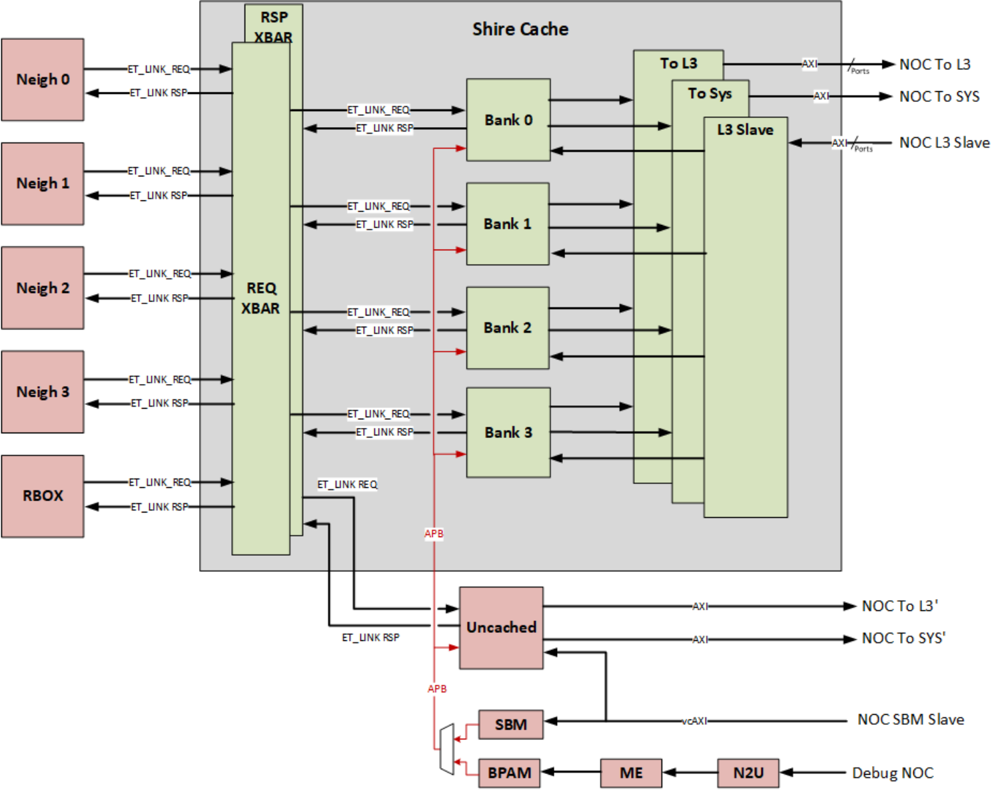


_Figure 1_ 

The below picture is the version for Shire Cache with Nemi: 


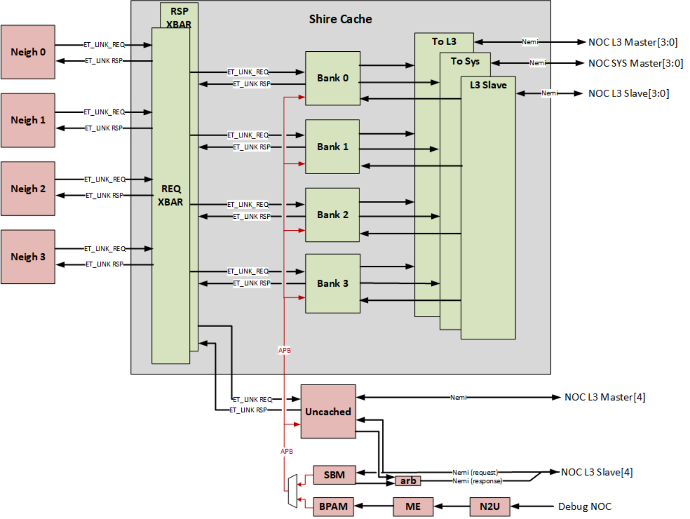


_Figure 2_ 


When the L2 has a cache miss or needs to perform an Evict, it uses its 512b To_L3 port into the NoC to make the request to the next-level cache (L3). 

L3 read requests or Scratchpad read requests from other Shires arrive from the L3 slave NoC port, which is also 512b wide and can make one request per cycle. When the L3 has a cache miss or needs to perform an Evict, it uses its 512b To_Sys port into the NoC to make the request to the memory. 

### 1.1 Features 

- The Shire Cache storage can be configured into three distinct partitions: the Scratchpad, L2 cache, and L3 cache. The size of each partition is configured by writing ET Status Registers (ESRs) during boot-up. Although the ESRs allow for flexibility in the size of each partition, to reduce the number of possible combinations to verify, six target “ **modes of operation”** are defined in the Shire Cache <u>Partitioning section.</u> 

- The L2 and L3 caches are always 


   - 4-way set-associative 

   - 64-byte cache lines 

   - Write back/Write-Allocate policy 

- At build time, a Shire Cache can be configured as follows: 

   - 1M, 2M, 3M, 4 MB, 6 MB, or 8 MB of data Random Access Memory (RAM) (other sizes may be added at a later time) 

   - 4 or 8 independent banks 

   - 4 or 8 sub-banks per bank 

   - The POR for the first SoC is 4M/Shire, 4 banks/Shire, 4 sub-banks/bank 

- At boot-up time, the Shire Cache can be configured as follows: 

   - Tag, Tag_State, and Data RAM access time: 2, 3, or 4 cycles 

      - Single control for all three cache RAM types 

   - The bases and sizes of the Scratchpad, L2, and L3 are configurable, with constraints as described in the <u>Shire Cache Partitioning</u> section. 

- Information in the Tag, Data, and State RAMs are protected with the Error Correction Code (ECC), providing single-bit correct, double-bit detect. 

   - The Tags have 7 bits of ECC stored with each 33-bit tag 

   - The Data has 8 bits of ECC stored with every 64 bits of data 

   - The State is protected with 6 bits of ECC for 33 bits of state for each cache index 

<mark>The cache supports the coalescing of writeAround requests</mark> 

- The L2 cache supports the coalescing of writeAround requests to preserve mesh bandwidth. WriteAround requests contain one or more 128-bit qwords. Multiple writeAround requests to the same cache line are coalesced in the L2 cache and are automatically flushed to the L3 once all four qwords for that line are written. WriteAround data can also be flushed to the L3 either via an explicit flush request to the cache line address or via a write to the “Flush All Pending WriteArounds” ESR. 

   - The writeAround Coalescing buffer uses the “Write Coalescing Buffer” structure, which has a limited number of entries. The number of entries can be configured at build time and is currently set to 32 entries per bank. Once this buffer is full, subsequent writeArounds cause older entries to be flushed to memory. 

   - The Coalescing buffer can be disabled via an ESR bit. 

- The L2 cache contains a Read buffer (RBUF), which saves power and improves performance when there are multiple readers of the same cache line. When an L2 cache read hits, the data is placed in the Read buffer. This saves power because Read buffer hits do not access the L2 cache. This also improves performance since Read buffer hits can be serviced once per clock. 

- Some of the Shire Cache can be configured as Scratchpad RAM. The Scratchpad is memory mapped with the part of the address that contains the Shire number. When the Shire Cache receives a request on the ET_LINK with an address that is mapped to the Scratchpad memory region, the part of the address with the Shire number is compared against the local virtual Shire number. If it 


matches, the request is satisfied with reading the local Scratchpad partition of the Shire Cache. If the Shire number does not match the corresponding address bits, the request is sent to the NoC and routed to the target Shire. When the Shire Cache receives a Scratchpad request from incoming Advanced eXtensible Interface (AXI) slave bus, the request is satisfied with the Shire Cache’s Scratchpad partition. 

- The Shire Cache ensures that the order of the same cache line address from a given source is maintained. However, there is no guarantee that the order of requests to different cache line addresses will be maintained. 

- Each cache bank has five independent L2 input ET_LINK buses, one from each Neighborhood and one from the RBOX. These buses have a data width of 512b. 

- Each cache bank also has an L3 input bus connected to an L3 slave AXI port on the NoC. This bus has a data width of 512b. 

- Each bank drives two independent output buses toward the NoC. A request is driven on the “To L3” bus to access the L3, while a request is driven on the “To System” bus when wanting to access the main memory. The target output bus for a given request is determined by the source of the request (e.g., Neighborhood input bus or L3 slave bus), the type of operation and cache state, and the configuration. 

- Each bank contains logic for cacheable Atomics, intra-Shire messages, and other CacheOps, such as Prefetch, Flush, Evict, Lock, and Unlock. 

- The Shire Cache only handles cacheable requests and intra-Shire messages. Uncached requests are handled by a separate UC block. 

- There are several ESRs associated with the Shire Cache. Each bank keeps its own copy of the ESRs, which are programmed via an Advanced Peripheral Bus (APB) interface. 

- The L2 and L3 caches can independently be disabled via the ESR bits. 

- Each Shire Cache bank contains an index CacheOp state machine that can generate a series of CacheOps to perform functions, such as initializing or flushing the entire Scratchpad, L2, or L3. This is accomplished by driving a series of CacheOp requests to the Shire Cache. Each CacheOp operates on a particular RAM index (and possibly a cache way) instead of a full Physical Address. The index CacheOp state machine is programmed via a set of ESRs. Additionally, the debug subsystem can read and write individual cache RAM contents by accessing these ESRs. 

- Each bank contains ESRs to capture the error status for SW. 

Debug Features 

- The Tag, Tag State, and Data RAMs can be read/written via a debug probe or Service Processor. 


###### Performance 

- Read Bandwidth: receive up to four read requests (one per L2 bank) and deliver four 512b cache lines back to the five agents making requests to the L2 

- Write Bandwidth: receive up to four evict requests (from the four Neighborhoods and the RBOX), each 512b wide. 

- The following latencies assume an idle Shire Cache. For L2, the number of Shire Cache cycles from the neigh ET-Link request to the neigh ET-Link response is measured, excluding the NoC/L3/Mem latency. For L3, the number of Shire Cache cycles from the L3 slave AXI AR/AW request to the R/B response, excluding the NoC/Mem latency, is measured. These latencies include the Neigh-to-Shire Cache and the Shire Cache-to-NoC crossbars. The voltage changing FIFO (VCFIFO) that interfaces with the NoC uses 2-stage synchronizers. 

|**Access Type **|**Latency (Shire Clocks)**|
|---|---|
|L2 cache read hit|21|
|L2 Read buffer hit|10|
|L2 cache read miss|34 + NoC & L3/Mem latency|
|L3 cache read hit|30|
|L3 Read buffer hit|N/A<br>L3 does not access the Read buffer|
|L3 cache read miss|42 + NoC & Mem latency|


_Table 1_ 

###### Power 

- Power: TBD. Goal is 100 MW for the entire Shire Cache running benchmark. 


### 1.2 Supported ET-Link Requests from Neighborhoods 

**Requests from Neighborhoods / RBOX**

|**Opcode**|**Address**<br>**PA**|**Subopcode**<br>**/ Data**<br>**Fields**|**Address / Size**<br>**Limits**|**Notes**|
|---|---|---|---|---|
|**REQ_Read**|Local<br>SCP|L2 / SCP|Any size;<br>address aligned<br>to size|Reads SCP in this bank|
||Remote<br>SCP|L2 / SCP|Any size;<br>address aligned<br>to size|Read sent to to_l3 mesh to<br>another Shire|
||Not SCP|L2 / SCP|Any size;<br>address aligned<br>to size|Reads L2 in this bank|
||Not SCP|L3|Any size;<br>address aligned<br>to size|Read forwarded to to_l3<br>mesh, to another Shire, and<br>then reads L3|
|**REQ_ReadCoop**|Local<br>SCP|L2 / SCP|Any size;<br>address aligned<br>to size|Reads SCP in this bank|
||Remote<br>SCP|L2 / SCP|Any size;<br>address aligned<br>to size|Read sent to to_l3 mesh,<br>then to another Shire|
||Not SCP|L2 / SCP|Any size;<br>address aligned<br>to size|Reads L2 in this bank|
||Not SCP|L3|--|Not supported.|
|**REQ_Write**|Local<br>SCP|L2 / SCP|Any size;<br>address aligned<br>to size|Writes SCP in this bank|
||Remote<br>SCP|L2 / SCP|Any size;<br>address aligned<br>to size|Write sent to to_l3 mesh,<br>then to another Shire|
||Not SCP|L2 / SCP|Any size;<br>address aligned<br>to size|Writes L2 in this bank|
||Not SCP|L3|Any size;<br>address aligned<br>to size|Write forwarding to to_l3<br>mesh, to another Shire, and<br>then writes L3.|
|**REQ_WriteAround**|Local<br>SCP|--|Qw, half line;<br>line address<br>aligned to size<br>with swiss<br>cheese qwen|Not supported. Local SCP<br>will be turned into a regular<br>write before the Shire Cache.|
||Remote<br>SCP|--|Qw, half line;<br>line address<br>aligned to size<br>with swiss<br>cheese qwen|Writes coalesced in local L2<br>and then write sent to to_l3<br>mesh, then to another bank<br>when the line is full.|
||Not SCP|--|Qw, half line;<br>line address<br>aligned to size<br>with swiss<br>cheese qwen|Writes coalesced in local L2<br>and then write sent to to_l3<br>mesh, then to another bank<br>when the line is full.|
|**REQ_MsgSendData**|--|--|Any size|Msg response passed to a<br>Neighborhood in this Shire.<br>Unlike everything else, data<br>is in LSBs regardless of<br>address.|
|**REQ_Atomic**|Local<br>SCP|--|--|Not supported. Must go to<br>UC block.|
||Remote<br>SCP|--|--|Not supported. Must go to<br>UC block.|
||Not SCP|--|ET-Link size is<br>ignored; size<br>determined by<br>conf in<br>subopcode;<br>address is size-<br>aligned.|Atomic operation of this<br>bank’s L2; atomic operand is<br>LSB-aligned in data; atomic<br>response is cache line-<br>aligned.|
|**REQ_Atomic**<br>**(Nemi)**|Local<br>SCP|L2 / SCP|ET-Link size is<br>ignored; size<br>determined by<br>conf in<br>subopcode;<br>address is size-<br>aligned.|Performs atomic in this bank.|
||Remote<br>SCP|L2 / SCP|ET-Link size is<br>ignored; size|Atomic is forwarded to<br>to_mesh.|
||||determined by<br>conf in<br>subopcode;<br>address is size-<br>aligned.||
||Not SCP|L2 / SCP|ET-Link size is<br>ignored; size<br>determined by<br>conf in<br>subopcode;<br>address is size-<br>aligned.|Atomic operation of this<br>bank’s L2; atomic operand is<br>LSB-aligned in data; atomic<br>response is cache line-<br>aligned.|
||Not SCP|L3|ET-Link size is<br>ignored; size<br>determined by<br>conf in<br>subopcode;<br>address is size-<br>aligned.|Atomic forwarded to to_l3<br>mesh, to another Shire|
|**REQ_Flush**|Local<br>SCP|--|--|Not supported.|
||Remote<br>SCP|--|--|Not supported.|
||Not SCP|Start<br>level L2|Cache line size;<br>cache-aligned<br>address|Flushes local L2; commands<br>sent to to_l3 mesh may be:<br>none, write, flush, or flush to<br>mem depending upon dest<br>level and whether there is<br>local dirty data.|
||Not SCP|Start<br>level >= L3|Cache line size;<br>cache-aligned<br>address|Flush forwarded to to_l3<br>mesh, then to another Shire.|
|**REQ_FlushToMem**|--|--|--|Not supported.|
|**REQ_Evict**|Local<br>SCP|--|--|Not supported.|
||Remote<br>SCP|Start level<br>L2; dest<br>level L3|Cache line size;<br>cache-aligned<br>address|Used to evict writeAround of<br>remote SCP PA; depending<br>on dirty data, either a write or<br>nothing will be sent to to_l3<br>mesh to write to another|
|||||Shire.|
||Remote<br>SCP|Other levels|--|Not supported.|
||Not SCP|Start<br>level L2|Cache line size;<br>cache-aligned<br>address|Flushes local L2; commands<br>sent to to_l3 mesh may be:<br>none, write, flush, or flush to<br>mem depending upon dest<br>level and whether there is<br>local dirty data.|
||Not SCP|Start<br>level >= L3|Cache line size;<br>cache-aligned<br>address|Flush forwarded to to_l3<br>mesh, then to another Shire.|
|**REQ_EvictToMem**|--|--|--|Not supported.|
|**REQ_Lock**|Local<br>SCP|--|--|Not supported.|
||Remote<br>SCP|--|--|Not supported.|
||Not SCP|--|Cache line size;<br>cache-aligned<br>address|Locks the line in the local L2.|
|**REQ_Unlock**|Local<br>SCP|--|--|Not supported.|
||Remote<br>SCP|--|--|Not supported.|
||Not SCP|--|Cache line size;<br>cache-aligned<br>address|Unlocks the line in the local<br>L2.|
|**REQ_ScpFill**|Local<br>SCP|Local<br>SCP source|Cache line size;<br>cache-aligned<br>address|Request is sent to to_l3 mesh<br>and will be routed back to this<br>Shire, maybe even this sub-<br>bank.|
||Local<br>SCP|Remote<br>SCP source|Cache line size;<br>cache-aligned<br>address|Request is sent to to_l3 mesh<br>and will be routed to another<br>Shire.|
||Local<br>SCP|Not SCP<br>source|Cache line size;<br>cache-aligned<br>address|Request is sent to to_l3<br>mesh. The request may be<br>routed to another Shire or|
|||||back to this Shire and maybe<br>even this bank. It will cause<br>an L3 read.|
||Remote<br>SCP|--|--|Not supported.|
||Not SCP|--|--|Not supported.|
|**REQ_Prefetch**|Local<br>SCP|--|--|Not supported.|
||Remote<br>SCP|--|--|Not supported.|
||Not SCP|Cache level<br>L2|Cache line size;<br>cache-aligned<br>address|Prefetches into this L2.|
||Not SCP|Cache level<br>>= L3|Cache line size;<br>cache-aligned<br>address|Forwards request to to_l3<br>mesh.|
|**REQ_AtomicRsp**|--|--|--|Not supported.|
||Not SCP|--|AXI request<br>size is ignored;<br>size determined<br>by conf in data<br>qw[2]; address<br>is size-aligned|Atomic operation of this<br>bank’s L3; Atomic operand is<br>LSB-aligned in data; Atomic<br>response is cache line-<br>aligned with byte enables<br>corresponding to size and<br>address offset.|


_Table 2_ 

### 61.3 Supported L3 Slave Requests 

**Requests from Neighborhoods / RBOX**

|**Opcode**|**Address**<br>**PA**|**Data**<br>**Fields**|**Address / Size**<br>**Limits**|**Notes**|
|---|---|---|---|---|
|**REQ_Read**|Local<br>SCP|--|Any size; address<br>aligned to size|Reads SCP in this bank|
||Remote<br>SCP|--|--|Not supported.|
||Not SCP|--|Any size; address|Reads L3 in this bank|
|**REQ_ReadCoop**|--|--|aligned to size<br>--|Not supported.|
|**REQ_Write**|Local<br>SCP|--|Any size; address<br>aligned to size|Writes SCP in this bank|
||Remote<br>SCP|--|--|Not supported.|
||Not SCP|--|Any size; address<br>aligned to size|Writes L3 in this bank|
|**REQ_WriteAround**|--|--|--|Not supported.|
|**REQ_MsgSendData**|--|--|--|Not supported.|
|**REQ_Atomic**|Local<br>SCP|--|32, 64, 256-bit<br>sizes; address<br>aligned to size|Atomic operation of this<br>bank’s SCP; Ack without data<br>sent back to L3 slave; atomic<br>response data sent back as<br>an ESR write to to_sys mesh:<br>atomic response is cache<br>line-aligned.|
||Remote<br>SCP|--|--|Not supported.|
||Not SCP|--|32, 64, 256-bit<br>sizes; address<br>aligned to size|Atomic operation of this<br>bank’s L3; atomic operand is<br>LSB-aligned in data; atomic<br>response is cache line-<br>aligned.|
|**REQ_Atomic (Nemi)**|Local<br>SCP|---|size is line and<br>address is a cache<br>line.  Real size and<br>address found in<br>data[256…]|Performs atomic in this bank.<br>atomic operand is LSB-<br>aligned in data; atomic<br>response is cache line-<br>aligned.|
||Remote<br>SCP|--|--|Not supported.|
||Not SCP|--|size is line and<br>address is a cache<br>line.  Real size and<br>address found in<br>data[256…]|Atomic operation of this<br>bank’s L2; atomic operand is<br>LSB-aligned in data; atomic<br>response is cache<br>``````````````````line-aligned.|
|**REQ_Flush**|Local<br>SCP|--|--|Not supported.|
||Remote<br>SCP|--|--|Not supported.|
||Not SCP|--|Cache line size;<br>cache-aligned<br>address|Flushes local L3.|
|**REQ_FlushToMem**|Local<br>SCP|--|--|Not supported.|
||Remote<br>SCP|--|--|Not supported.|
||Not SCP|--|Cache line size;<br>cache-aligned<br>address|Writes data to L3 and then<br>flushes the L3.|
|**REQ_Evict**|Local<br>SCP|--|--|Not supported.|
||Remote<br>SCP|--|--|Not supported.|
||Not SCP|--|Cache line size;<br>cache-aligned<br>address|Evicts local L3.|
|**REQ_EvictToMem**|Local<br>SCP|--|--|Not supported.|
||Remote<br>SCP|--|--|Not supported.|
||Not SCP|--|Cache line size;<br>cache-aligned<br>address|Writes data to L3 and then<br>evicts the L3.|
|**REQ_Lock**|--|--|--|Not supported.|
|**REQ_Unlock**|--|--|--|Not supported.|
|**REQ_ScpFill**|--|--|--|Not supported.|
|**REQ_Prefetch**|Local<br>SCP|--|--|Not supported.|
||Remote<br>SCP|--|--|Not supported.|
||Not SCP|--|Cache line size;<br>cache-aligned<br>address|Prefetches into this L3.|
|**REQ_AtomicRsp**|--|--|--|Not supported.|


_Table 3_ 

### 1.4 Shire Cache Partitioning 

As described above, the Shire Cache can be partitioned into the Scratchpad, L2 cache, and L3 cache. The partition is based on the build configuration of the Shire Cache and the following ESRs: 

**esr_sc_l2_set_base esr_sc_l2_set_size esr_sc_l2_set_mask esr_sc_l2_tag_mask** 

**esr_sc_l3_set_base esr_sc_l3_set_size esr_sc_l3_set_mask esr_sc_l3_tag_mask** 

**esr_sc_scp_set_base esr_sc_scp_set_size esr_sc_scp_set_mask esr_sc_scp_tag_mask** 

Each set of ESR registers fields defines the base and size of the associated partition. The size is in the granularity of the sub_bank sets. The Shire Cache is designed to have the following hierarchy: 


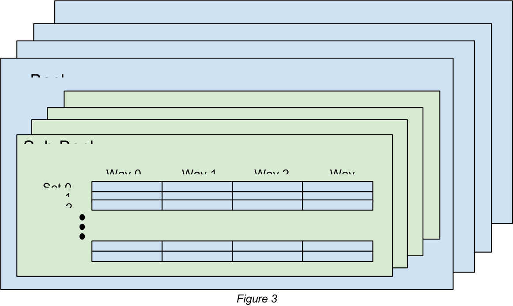


_Figure 3_ 


The number of sets per sub-bank are summarized in the following table, when the total Shire Cache size is 4 MB, with 4 banks and 4 sub_banks: 

|CACHE_SIZE_MB|4|
|---|---|
|CACHE_SIZE|4194304|
|LINE_BYTE_SIZE|64|
|BANKS|4|
|SUB_BANKS|4|
|LinesPerSubBank|4096|
|WAYS|4|
|TotalSetsPerSubBank|1024|


_Table 4_ 

###### TotalSetsPerSubBank = CACHE_SIZE/LINE_BYTE_SIZE/BANKS/SUB_BANKS/WAYS 

The following rules must be followed when setting the base and size registers to configure the cache regions: 

- The size of the Scratchpad RAM can be configured for any size with the following constraints: ▪ The size must be ‘0’ (if not allocating SCP) or a multiple of 8K bytes (for eight banks) or 4K bytes (for four banks). 

   - If supporting remote Scratchpad coalescing, the minimum size must adhere to the same rules as the L2 cache region’s minimum size to properly reconstruct an eviction address 

   - The total size for the Scratchpad region has to be less than or equal to 4 MB per Shire Cache due to the scp_shire_id starting at bit 23 in the address map. 


- The size of L2 can be configured for any size with the following constraints: 

   - The size must be ‘0’ (if not allocating L2) or at least 512K bytes and must be a multiple of 8K bytes (for eight banks) or 4K bytes (for four banks). 

- The size of L3 can be configured for any size with the following constraints (assuming the Shire Cache has been built with 32 Shires): 

   - The size must be ‘0’ (if not allocating L3) or follow the minimum size constraints shown in the table below and must be a multiple of 8K bytes (for eight banks) or 4K bytes (for four banks). 


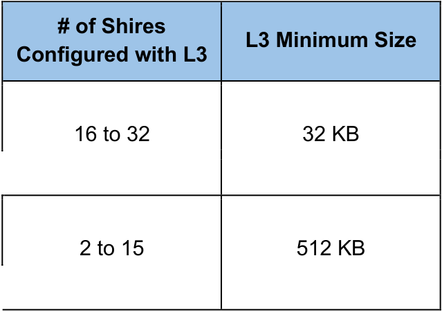


_Table 5_ 

   - The sum of the Scratchpad, L2, and L3 sizes must be less than or equal to the total data RAM in a Shire Cache. 

- The base RAM indices of the Scratchpad, L2, and L3 are also configurable. Generally, the L2 base should be set to the index after the last Scratchpad index, and the L3 base should be set to the index after the last L2 index. However, it is possible to program a configuration to not use a range of RAM indices, which allows for locations with irreparable RAM faults to be avoided.   Note that the L2 and L3 bases can be any value, and the Scratchpad must be based at a RAM index that is a multiple of the power-of-2 size of the Scratchpad. 

- The set_mask and tag_mask ESRs must be set based on the set_size. See the <u>ESRs for Pipeline Control</u> section. 

Although the implementation for cache configuration allows for a very flexible allocation, there are five primary modes defined. Many other cache configurations are possible and likely to be used in practice.  All cache configurations have to adhere to the minimum cache region size and base requirements described above for the Shire Cache to be functional. The following table shows the total memory across all Shires with a build configuration of 4M per Shire and 32 Shires: 

|**Mode**|**Scratchpad**|**L2**|**L3**|
|---|---|---|---|
|M0|80M|16M|32M|
|M1|0M|64M|64M|
|M2|0M|124M|4M|
|M3|0M|128M|0M|
|M4|128M|0M|0M|
|M5|64M|64M|0M|


_Table 6_ 

The chip will come out of reset in mode M0. 

Software can change the mode based on the application at hand. The cache configuration must be programmed before making any cacheable requests. After the cache is operational, a shutdown process must be orchestrated from the Service/Maxion Processor before the mode can be changed. Each Shire needs to have their L1, L2, and L3 caches evicted (if the intention is to retain the data); otherwise, each cache can just be invalidated. The Minions should then be stopped. Once the Service Processor verifies these steps are completed within each Shire, the cache configuration can be changed. 

Mode M5 is defined primarily for IOShire testing to verify a Shire Cache design that has a Scratchpad region and an L2 region, but not an L3 region. Since the IOShire has a cache total of 1 MB and the L2 cache region has to be at least 512K per shire, L2 has to be at least 50% of the cache partition. 

The following table shows the base, size, set_mask, and tag_mask values for each of the pre-defined modes for a 4 MB Shire Cache, 4-bank, 4-sub_bank design: 

|**Mode 0**|**Cache**<br>**Fraction**|**SetsPer**<br>**SubBank**|**Set**<br>**Bits**|**base**|**end**|**Total**<br>**Sets**|**set**<br>**mask**|**tag**<br>**mask**|**CachePer**<br>**Shire (MB)**|**Total**<br>**Cache (MB)**|
|---|---|---|---|---|---|---|---|---|---|---|
|SCP|0.625|640|10|0x0|0x27F|0x280|0x3FF|0x1FF|2.5|80|
|L2|0.125|128|7|0x280|0x2FF|0x80|0x7F|0x7F|0.5|16|
|L3|0.25|256|8|0x300|0x3FF|0x100|0xFF|0xFF|1|32|
|**Mode 1**|**Cache**<br>**Fraction**|**SetsPer**<br>**SubBank**|**Set**<br>**Bits**|**base**|**end**|**Total**<br>**Sets**|**set**<br>**mask**|**tag**<br>**mask**|**CachePer**<br>**Shire (MB)**|**Total**<br>**Cache (MB)**|
|SCP|0|0|0||||||0|0|
|L2|0.5|512|9|0x0|0x1FF|0x200|0x1FF|0x1FF|2|64|
|L3|0.5|512|9|0x200|0x3FF|0x200|0x1FF|0x1FF|2|64|
|**Mode 2**|**Cache**<br>**Fraction**|**SetsPer**<br>**SubBank**|**Set**<br>**Bits**|**base**|**end**|**Total**<br>**Sets**|**set**<br>**mask**|**tag**<br>**mask**|**CachePer**<br>**Shire (MB)**|**Total**<br>**Cache (MB)**|
|SCP|0|0|0||||||0|0|
|L2|0.96875|992|10|0x0|0x3DF|0x3E0|0x3FF|0x1FF|3.875|124|
|L3|0.03125|32|5|0x3E0|0x3FF|0x20|0x1F|0x1F|0.125|4|
|**Mode 3**|**Cache**<br>**Fraction**|**SetsPer**<br>**SubBank**|**Set**<br>**Bits**|**base**|**end**|**Total**<br>**Sets**|**set**<br>**mask**|**tag**<br>**mask**|**CachePer**<br>**Shire (MB)**|**Total**<br>**Cache (MB)**|
|SCP|0|0|0||||||0|0|
|L2|1|1024|10|0x0|0x3FF|0x400|0x3FF|0x3FF|4|128|
|L3|0|0|0||||||0|0|
|**Mode 4**|**Cache**<br>**Fraction**|**SetsPer**<br>**SubBank**|**Set**<br>**Bits**|**base**|**end**|**Total**<br>**Sets**|**set**<br>**mask**|**tag**<br>**mask**|**CachePer**<br>**Shire (MB)**|**Total**<br>**Cache (MB)**|
|SCP|1|1024|10|0x0|0x3FF|0x400|0x3FF|0x3FF|4|128|
|L2|0|0|0||||||0|0|
|L3|0|0|0||||||0|0|
|**Mode 5**|**Cache**<br>**Fraction**|**SetsPer**<br>**SubBank**|**Set**<br>**Bits**|**base**|**end**|**Total**<br>**Sets**|**set**<br>**mask**|**tag**<br>**mask**|**CachePer**<br>**Shire (MB)**|**Total**<br>**Cache (MB)**|
|SCP|0.5|512|9|0x0|0x1FF|0x200|0x1FF|0x1FF|2|64|
|L2|0.5|512|9|0x200|0x3FF|0x200|0x1FF|0x1FF|2|64|
|L3|0|0|0||||||0|0|


_Table 7_ 


Other combinations for the base and size are also allowed as long as they comply with the constraints described above. The ESR section contains information on their programming. 

When a L2 or L3 region size is configured to be power of 2, the set_mask and tag_mask are set the same and accessing the whole region with consecutive addresses will access unique sets of the cache with no capacity eviction. However when a L2 or L3 region size is configured to be non-power of 2, the set_mask and tag_mask are different and accessing the whole region with consecutive addresses will cause address hashing into shared sets of the cache resulting in capacity eviction.  Note that SCP is not affected by this non-power of 2 configuration. 

For example, if L2 is configured for 96 MB (3MB per shire in 32 shires), the set_mask is 0x3FF and the tag mask is 0x1FF. The L2 set bits in ET-SoC-1 are at address 19:10, and so the address bits 19:18 of 2’b11 will be hashed into address bits 19:18 of 2’b01 sets. Accessing the whole region with consecutive addresses will cause addresses with bits 19:18 of 2’b01 and 2’b11 to use the same index. 

To fully access the L2 or L3 non-power of 2 regions without hashing to shared sets, the consecutive address has to be broken up to skip over the addresses that cause the hashing to the shared address. 

For example, if L2 is configured for 96 MB  (3MB per shire in 32 shires), the shire can access L2 address as followed without hashing into shared sets 

- 0x8000000000 - 0x80000bffc0 

- 0x8000100000 - 0x80001bffc0 

- 0x8000200000 - 0x80002bffc0 

- 0x8000300000 - 0x80003bffc0 


#### 1.4.1 Shire Cache Address Decode 

The Shire Cache can be configured with up to three different cache regions. Each cache region (L2, L3, and Scratchpad) has its own address decode since each has its own cache memory organization. The sections below give the address decoding for a 4 MB Shire Cache, 4-bank, 4-sub-bank design. For other build configurations (with a different total cache size, number of banks, or number of sub-banks) the relative field locations do not change within each cache region; only the width of each associated field would change to accommodate the different build options. 

##### 1.4.1.1 L2 Address Decode 

The L2 address decode fields are as follows: 


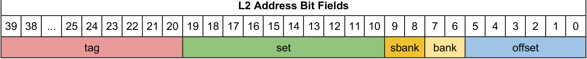


##### 1.4.1.2 L3 Address Decode 

The L3 address decode fields are as follows: 

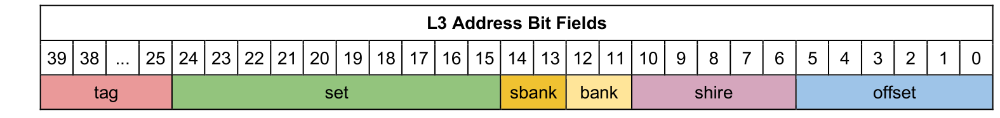


##### 1.4.1.3 SCP (Local/Remote) Address Decode 

The SCP (local/remote) address decode fields are as follows: 

|**SCP (Local/Remote) Address Bit Fields**<br>39 .. 32 31 30 29 28 27 26 25 24 23 22 21 20 19 18 17 16 15 14 13 12 11 10|9 8|7 6 5 4 3 2 1 0|
|---|---|---|
|Scratchpad<br>scp_shire<br>set<br>way|sbank|bank<br>offset|


The Scratchpad field bits [39:31] must be set to 9'h1. The scp_shire id field bits [30:23] determine which Shire the Scratchpad request is targeting. If the Shire bits match the local shire_id, it is sent down the pipeline to the local Scratchpad. If the scp_shire is all 1s, this also indicates that the request is for the local Shire. If the request does not match the local shire_id, it is sent over the to_l3 interface and routed to the Shire defined by those bits. This is considered a remote Scratchpad. 

The Scratchpad index is defined by address bits [22:0]. If a request is made that exceeds the number of indexes of the configured Scratchpad region (based on the cache configuration ESRs), an error response will be returned, the write data will be dropped, and the read data should be ignored. For a 4M build, bit 22 should always be set to zero since there are only 10 functional set bits. For 8M builds, bit 22 could be set to 1 and it would still be within the legal range of an 8M SCP region. <mark>The error type logged for an SCP</mark> 


<mark>index that exceeds the SCP cache configured region would be S</mark>C_PipeErr_ScpOpToNonEnRegion, as seen in the <u>Pipeline Error Responses</u> section. 

##### 1.4.1.4 Index CacheOp Address Decode 

The Index CacheOp address decode fields are as follows: 

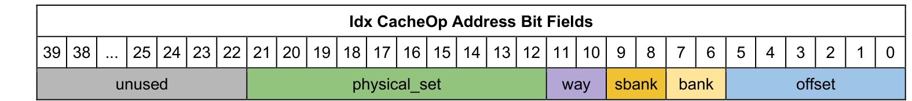


The physical set is the index (set) within the cache region plus the cache base specified by the associated esr_sc_l2_set_base, esr_sc_l3_set_base, or esr_sc_scp_set_base. 

#### 1.4.2 L3 Shire Aliasing 

The ShireID bits of an L3 address determine which Shire the NoC will route the L3 request to. When an L3 request is made, the request is routed to the virtual Shire specified by the ShireID bits of the L3 address. The SoC will be built with extra Shires to deal with poor yield issues. In the event that the number of defective Shires exceeds the number of extra Shires, the  SoC can still be used if the distributed L3 of another Shire is shared. The L3 pipeline has to be able to discern between these aliased distributed L3 cache lines. The default mode allows for L3 _Two-Shire aliasing_ , but also supports an _All-Shire aliasing_ option. 

##### 1.4.2.1 L3 Two-Shire Aliasing 

This option allows for 16 to 32 functional Shires to be supported for L3 operation. This is the default option. 

The Shire Cache pipeline stores the Most Significant Bit (MSB) of the L3 address shire_id (bit 10 of the address for a 32-Shire configuration) into the tag RAM so that two Shires can be aliased into a single Shire while maintaining the capacity to distinguish between the aliased addresses when generating the matches/eviction addresses. This provides the flexibility to handle poor yield issues that cause more than four Shires of the 36-Shire SoC to be defective. We can alias the defective Shire to a functioning Shire through MSB shire_id aliasing. This proposal allows us to alias shire_id 0 and 16, shire_id 1 and 17, ..., shire_id 15 and 31. As an example, if a chip has five defective Shires, the SoC could be programmed to use only 31 of the 32 shires when supporting L3. Any L3 operations that target virtual Shire 31 will be redirected to virtual Shire 15 by the NoC. As an aside, this option allows for L3 cache regions to be supported down to 32kB of granularity per Shire. 

By default, the NoC will use the Least Significant Bits (LSBs) of the shire_id and the Two-Shire aliasing mode will use the MSB of the shire_id. If the NoC uses the MSBs of the shire_id, then the register field “esr_sc_two_shire_aliasing_use_shire_lsb” should be set to ‘1’ to have the Shire Cache store the LSB of the shire_id into the tag. This allows for the aliased Shire to target the same memory controller, which should help reduce latency/congestion in the NoC. 


##### 1.4.2.2 L3 All-Shire Aliasing 

This option allows for 2 to 32 functional Shires to be supported for L3 operation. The Shire Cache pipeline stores all bits of the L3 address shire_id (bits [10:6] of the address for a 32-Shire configuration) into the tag RAM so that all the Shires can be aliased into a single Shire while maintaining the capacity to distinguish between aliased addresses when generating the matches/eviction addresses. As an aside, this option allows for L3 regions to be supported down to 512kB of granularity per Shire. 

##### 1.4.2.3 L3 Shire Aliasing Effects on L3 Tag 

The minimum size cache allocation changes based on the L3 aliasing mode selected. This is because there are only 23-bit tags stored and the Shire bits must be saved into the tag. For a 32-Shire SoC, there are five ShireID bits. These Shire bits of the L3 address decode reside in bits [10:6]. 

For L3 Two-Shire aliasing, the MSB of the ShireID (address[10]) is stored in the LSB location of the 23-bit tag (address[17]). This requires the set granularity to be at least eight sets since the three LSBs of the set address (2^3 = 8 set granularity) are not saved in the tag. The following table shows the location of the MSB of the ShireID within the L3 tag: 

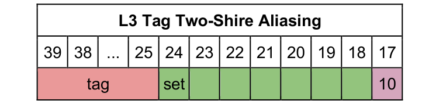


If esr_two_shire_aliasing_use_shire_lsb is set to ‘1’, then the LSB of the ShireID (address[6]) is stored in the LSB location of the 23-bit tag (address[17]). 

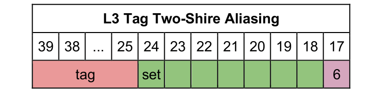


For L3 All-Shire aliasing, the full ShireID (address[10:6]) is stored in the five LSBs of the 23-bit tag (address[21:17]). This requires the set granularity to be at least 128 sets since the seven LSBs of the set address (2^7 = 128 set granularity) are not saved in the tag. The following table shows the location of the ShireID within the L3 address tag: 

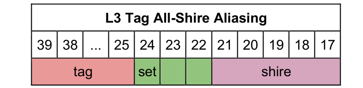


#### 1.4.3 L3 Shire Stride / L3 Shire Swizzling 

To allow for the flexibility to experiment with NoC/memory congestion in the final design, the Shire Cache supports different L3 strides. For a 32-Shire configuration, the ShireID is placed in address bits [10:6] and the Memory Shire is selected by the NoC using bits [8:6] by default. This allows for the use of 64B strides 


to Memshires and 64B strides to L3 Shires. To enable flexibility, the ShireID can be swizzled with the bank and sub_bank bits of the L3 address. This requires the shire_cache to select the bank, sub_bank, and ShireID from a programmable location within the L3 address. This means that for a 32-Shire, 4-bank, 4- sub_bank design, the ShireID can be shifted left by four bits and, in combination with shifting the Memshire selection by the NoC to the upper bits of the ShireID, allows for the memory selection to be shifted a total of six bits. This increases the size of the L3 Shire stride from 64B to 1kB and the Memshire stride from 64B to 4kB. 

Swizzling the location of the bank, sub_bank, and shire_id within the L3 address is performed using ESRs for each bit of each field. This allows for many unique combinations of swizzling, but only three swizzle modes have been tested: shire_swizzle0, shire_swizzle1, and shire_swizzle2. The sub_bank, bank, and shire_id locations within the L3 absolute address are documented in the following table for a 32-Shire design crossed against 4- or 8-bank and 4-or 8 `-` sub_bank build configurations. 


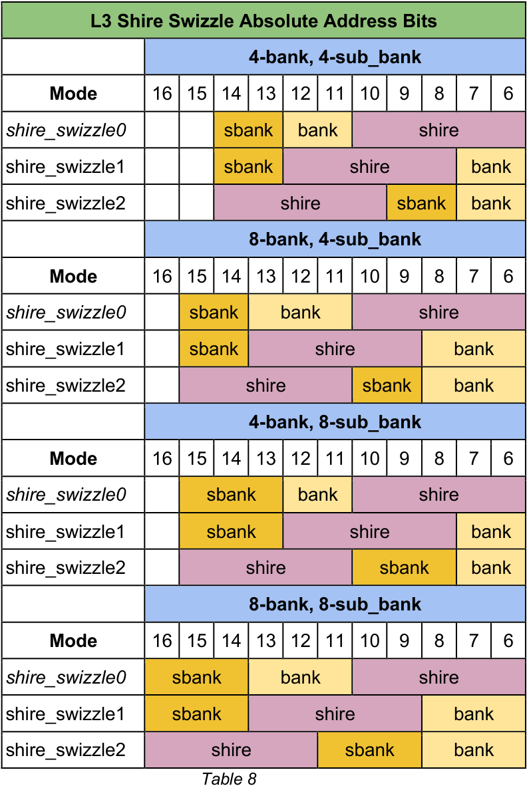


_Table 8_ 


The ESR selection for the sub_bank, bank, and ShireID will be done using a relative offset, where ShireID bit ‘0’, which is located at absolute address bit [6], is identified as bit [0] in terms of the selection. The following table shows the relative offset location for a 32-Shire design crossed against 4-bank or 8-bank and 4-sub_bank or 8-sub_bank build configurations: 


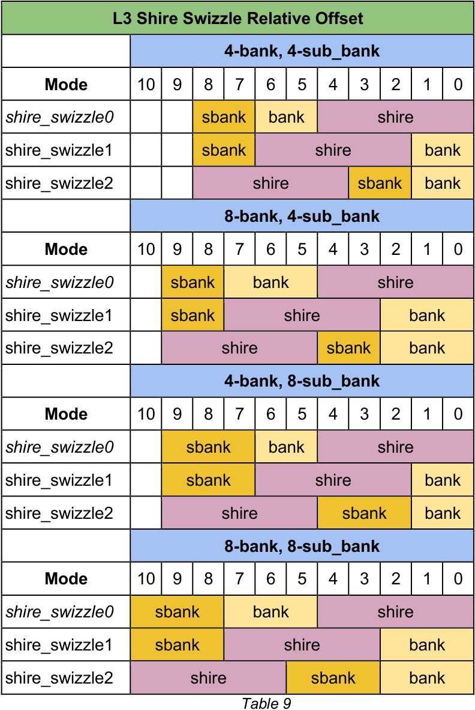


_Table 9_ 


The following table gives the ESR values for each of the swizzle modes in the previous table: 

**L3 Swizzle ESR Programming**

|**Mode**|**sbank**|||**bank**|||**shire**||||||
|---|---|---|---|---|---|---|---|---|---|---|---|---|
|_shire_swizzle0_|x|8|7|x|6|5|x|4|3|2|1|0|
|shire_swizzle1|x|8|7|x|1|0|x|6|5|4|3|2|
|shire_swizzle2|x|3|2|x|1|0|x|8|7|6|5|4|
|_shire_swizzle0_|x|9|8|7|6|5|x|4|3|2|1|0|
|shire_swizzle1|x|9|8|2|1|0|x|7|6|5|4|3|
|shire_swizzle2|x|4|3|2|1|0|x|9|8|7|6|5|
|_shire_swizzle0_|9|8|7|x|6|5|x|4|3|2|1|0|
|shire_swizzle1|9|8|7|x|1|0|x|6|5|4|3|2|
|shire_swizzle2|4|3|2|x|1|0|x|9|8|7|6|5|
|_shire_swizzle0_|10|9|8|7|6|5|x|4|3|2|1|0|
|shire_swizzle1|10|9|8|2|1|0|x|7|6|5|4|3|
|shire_swizzle2|5|4|3|2|1|0|x|10|9|8|7|6|


_Table 10_ 

For each of the fields, the generic equation that can be used for base bit selection is provided below. 

###### **swizzle0** 

shire_id_base = 0 bank_base = shire_id_size sub_bank_base = shire_id_size + bank_id_size 

###### **swizzle1** 

bank_base = 0 shire_base = bank_id_size sub_bank_base = bank_id_size + shire_id_size 

###### **swizzle2** 

bank_base = 0 sub_bank_base = bank_id_size shire_base = bank_id_size + sub_bank_id_size 


## 2 Shire Cache Blocks 

### 2.1 Shire Cache Overview 

The Shire Cache is composed of four banks, each of which is organized into four sub-banks. Each bank acts as an independent L2 cache. The banks operate in parallel and independently since they have the necessary logic to fulfill requests and generate requests to the next-level cache. 

The req_xbar is the Neighborhood request interface to the banks. It is a full crossbar between the Neighborhoods and Shire Cache banks. Requests can be received from up to five clients (4 neigh + 1 RBOX) directed to the four available L2 banks and the UC block. Since the clients must be able to access any bank at any time, all the clients can advertise their interest in any of the banks, and all the banks can receive requests in any cycle. However, to obtain the desired throughput, a good balance must be maintained among all the banks. In addition, the bank selection mechanism must be simple so as not to add unnecessary latency or stall the L1 caches. Since multiple requests might target the same bank in the same cycle, a simple arbiter must maintain a fair balance between all the Neighborhoods and also guarantee a minimum bandwidth to the other clients. Although Minions are in-order cores, the presence of multiple Minions per Neighborhood implies that the requests do not have strict ordering amongst themselves, so avoiding head-of-line blocking is a desired feature. To handle this, one entry per Neighborhood is connected to each bank’s arbiter. The arbiter selects an entry based on Round Robin in conjunction with information regarding the destination bank availability. In other words, the arbiter avoids selecting an entry if the bank is stalled. 

At the other end of the banks is a rsp_xbar, which is a full crossbar for responses back to the corresponding Neighborhood. Backpressure is not expected from the Neighborhood end since all the requests must guarantee space for the response. Consequently, the only competition that would require arbitration would be if multiple banks attempted to send a response to the same Neighborhood in the same cycle. If responses are evenly distributed back to the Neighborhoods, the rsp_xbar will send one response from each bank every cycle. 

### 2.2 Req and Rsp Xbar 

The Request and Response crossbars are used to link the Neighborhood masters (four Neighborhoods + RBOX to four shire_cache banks + UC block). To allow for full bandwidth from any Neighborhood to any bank, full bandwidth routing is supplied, as shown in the following Xbar diagram: 


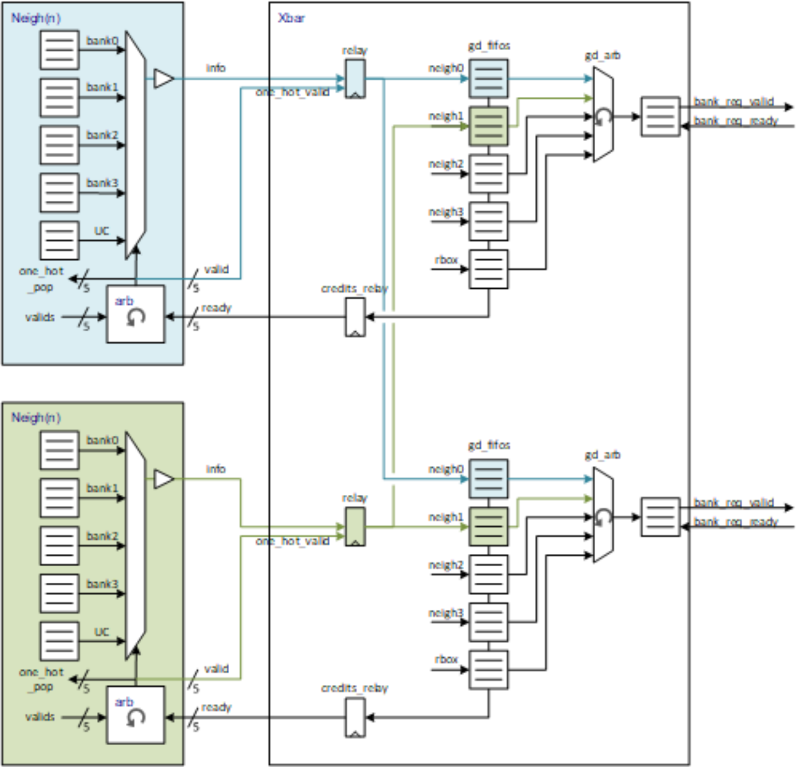


_Figure 4_ 

The FIFOs and mux shown in the blue and green blocks are in the Neighborhood code so that each Neighborhood is supplied with a single interface containing valid, ready, and 1 info packet. In the Xbar, there are per-Neighborhood catch FIFOs at all the bank destinations. For each destination bank there is an arbiter to select which source to send to the bank each cycle. 

The Req crossbar is inside the shire_cache hierarchy so that it can be routed on top of all four banks. As such, it ports out an interface to the UC block as an additional Xbar destination.  The Req crossbar transports ET-Link requests from the Neighborhoods to the banks. 


The Rsp crossbar is an identical module to the Req crossbar. However, it connects in the opposite direction, from all four banks + the UC block back to all four Neighborhoods + the RBOX.  The Rsp crossbar transports ET-Link responses from the Neighborhoods to the bank. 

### 2.3 To_L3 and To_Sys Mesh Master Ports 

There are 4 or 8 Shire Cache banks. The banks must arbitrate for access to the mesh to communicate with the other Shires. There are two mesh master designs, each of which interfaces to a different mesh: to_l3 and to_sys. 

The following shows the block diagram for the mesh master: 


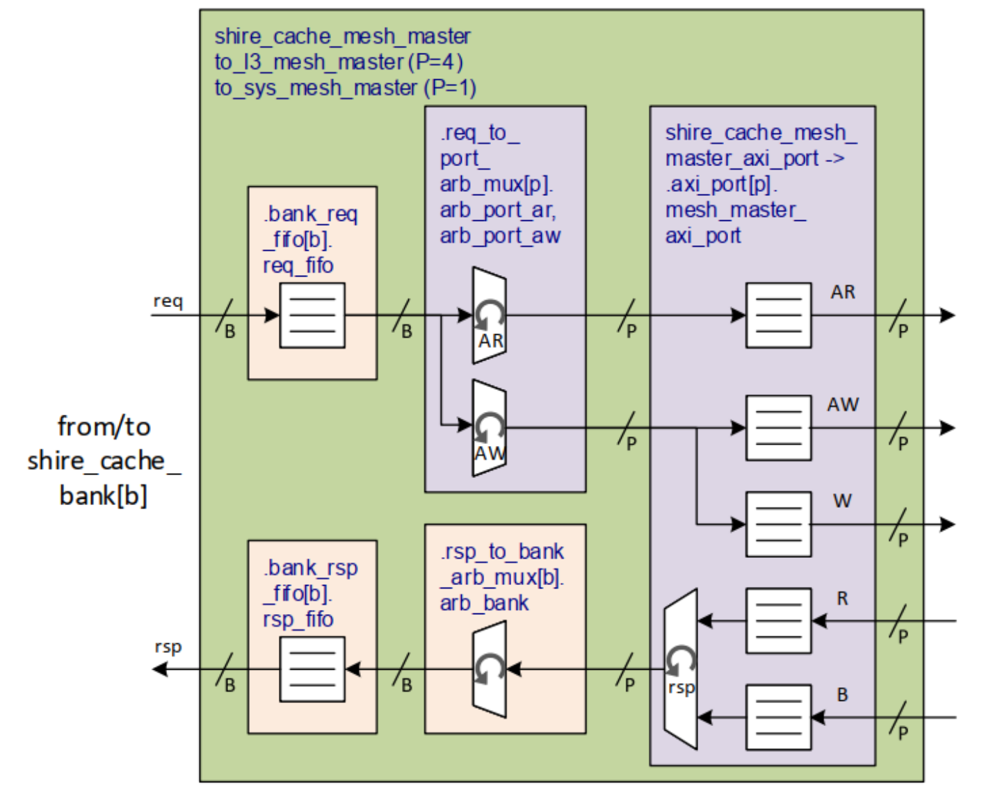


_Figure 5_ 

There are ‘B’ bank requests that arbitrate for access to ‘P’ ports. The number of ‘P’ ports is four for the L3 mesh and one for the SYS mesh. Each bank pushes its request into its associated request FIFO. Arbitration is done through a request Xbar design following the request FIFOs. The Xbar carries an ET- 


Link like transaction (single channel for both reads and writes). At the end of the Xbar, the transaction is converted and routed onto the correct AXI AR/AW/W channel through VCFIFOs. 

Transactions are tagged both with their unique transaction ID (which is identical to the reqq id used within the bank) and the bank index. The ID that is returned through the AXI response channels is used to route responses back to the correct requesting bank. 

The AXI R/B bus channels are received through VCFIFOs. The VCFIFO outputs are converted back to the ET-Link like response transaction and are fair share arbitrated before reaching the response Xbar design. The output of the R/B arbitration is input to the response Xbar design that arbitrates the responses into the bank response FIFOs. 

### 2.4 L3 Slave Mesh Slave Port 

The shire_cache acts as an L3 cache slice to the rest of the system. L3 requests come in from the mesh on the L3 slave port. These requests must be arbitrated to the correct bank according to the address requested. The Shire Cache uses the pertinent address bits to send the request transaction and routing information to the correct bank. 

The following figure shows the block diagram for the mesh slave: 


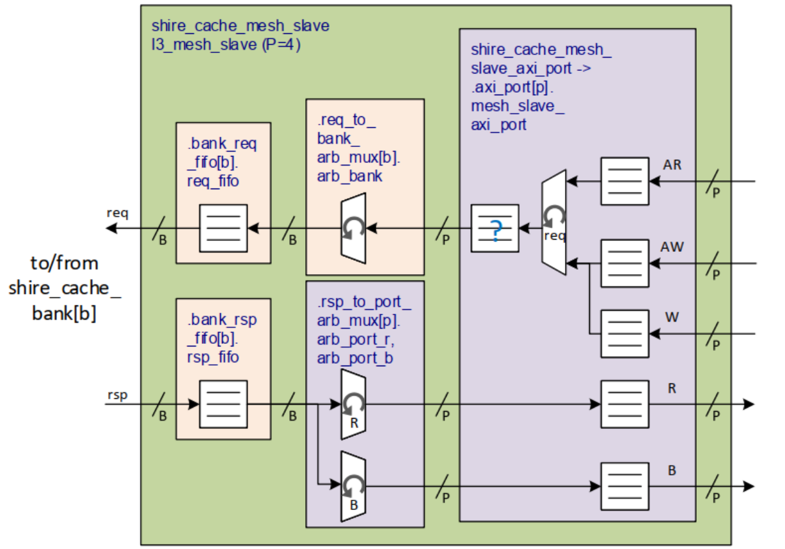


_Figure 6_ 

There are ‘P’ port requests that need to interface to the ‘B’ banks. The number of ‘P’ ports for L3 is four. L3 requests are received into VCFIFOs through the AXI AR/AW/W buses. The VCFIFO outputs are 


converted from AXI to a shared channel ET-Link like interface before being arbitrated by the request Xbar and pushed into the bank request FIFOs. 

L3 responses are returned into the bank response FIFOs. The output of the bank response FIFOs are arbitrated by the response Xbar. The ET-Link like response is converted into AXI R/B data before pushing into the VCFIFO designs, which interface to the mesh. 

### 2.5 Shire Cache Bank 

The following is an overview of a Shire Cache bank: 


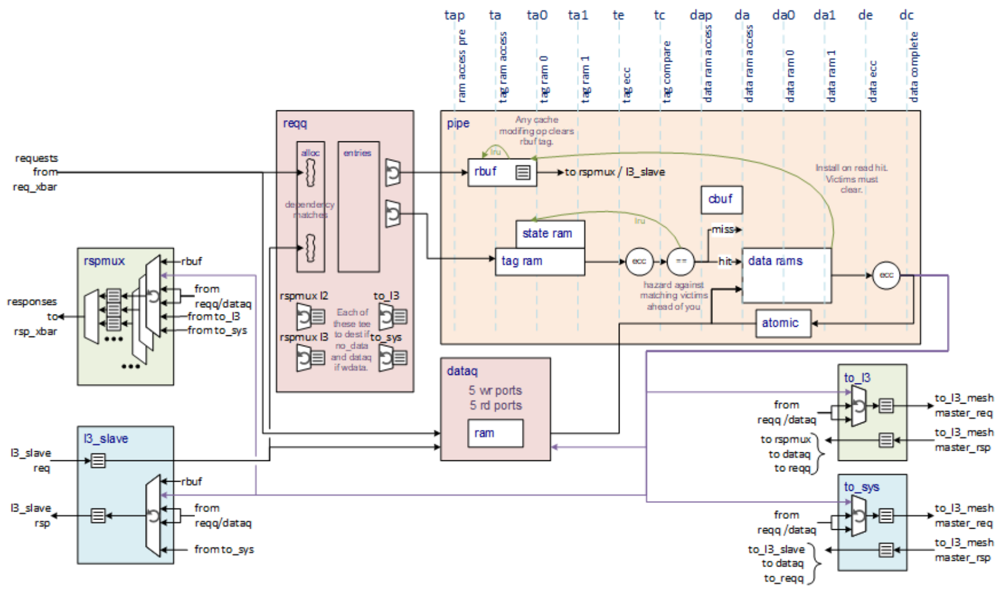


_Figure 7_ 

On the left-hand side of the block diagram there are requests and responses from the Neighborhoods and requests and responses from the L3 slave. The Shire Cache can receive a request from the Neighborhoods and the L3 slave each cycle. However, the total throughput will be limited later by the pipeline since it can only handle one request per cycle. 

The bank Request Queue (reqq) allocates a reqq entry for each request in-flight. The reqq holds the request state, selects the next state, arbitrates for the L2 pipeline and mesh, and handles request ordering. 


The dataq holds data for all requests that are in-flight. There is one dataq entry for each reqq entry.  Each entry in the dataq is a cacheline. 

The pipeline implements L2, L3, and Scratchpad cache functionality. It is subdivided into four sub-banks. Each sub-bank contains tag RAMs, state RAMs, data RAMs, and ECC generation and checking. Additionally, the pipeline contains a Read buffer, an atomic block, and a Coalescing buffer, which are shared by all the sub-banks. 

The pipeline is non-stalling and non-blocking. Once a request is scheduled, it will proceed through the pipeline stages without backpressure, and space for results and/or victims is guaranteed. In cases where either it is anticipated that there will be no space or a subbank is busy, nothing will be scheduled for that cycle. 

The to_l3 and to_sys mesh blocks send requests to the next-level cache or remote Scratchpad via the NoC. 

The rspmux is the mux of all the responses to be sent back to the Neighborhoods. The rspmux has a FIFO for each Neighborhood to avoid head-of-line blocking. 

The L3_slave is the entry point for L3 requests and Scratchpad requests that come in from the mesh.  The L3 slave has a FIFO for incoming L3 slave requests and its own rspmux_l3 for responses to the L3 slave. 

### 2.6 Reqq 

A reqq entry is allocated for each shire cache request. The reqq entry stays valid throughout the lifetime of the request until the primary request completes and all secondary effects from the request have also completed. For example, for a read miss, a reqq entry will track the request from allocation through the miss, the mesh read, subsequent fill, and the potentially generated victim. 

Two reqq entries can be allocated per cycle, one for Neighborhood requests and one for L3 requests.  ESRs control how the reqq is partitioned between entries that are allocated to the Neighborhoods and entries that are allocated to the l3_slave. 

Two reqq entries are allocated to atomics, writeArounds, and Partial Writes. See the <u>WriteArounds, Atomics,</u> and Partial Writes sections for details on why and how the second reqq entry is used. When an ET-Link request that requires two entries is allocated, the reqq will attempt to allocate both the primary and secondary reqq entries for that request. If only one reqq entry is free, then the second reqq entry will be allocated on a subsequent cycle while holding the bank request ready signal low. 

Each reqq entry keeps track of the current state of the request allocated to that entry. Based on the type of request and the current state, the entry may need to proceed to the pipeline, make a request on the mesh, or send a response back to the Neighborhoods or L3 slave. 

Each sub-bank in the pipeline can indicate to the reqq that it is busy in order to prevent new requests from being scheduled for that sub-bank. In the following cases, a sub-bank busy signal will be set: 


1. The first N cycles after a request is accepted. If the RAM access time is two cycles, a request can only be sent to the sub-bank every other cycle. If the RAM access time is three cycles, a request can only be accepted every third clock, so the busy signal will be set for two cycles after a request. 

2. Requests that may need to access the RAMs twice will schedule bubble slots to ensure that there is a free slot when needed for the second RAM access. For example, a fill that may create a victim will need to do a read followed by a write. The busy signals will be set when needed to ensure that the RAM access during the write phase of the fill will be available. 

3. Atomics will signal that the sub-bank is busy long enough to perform the read, atomic operation, and write so no intervening requests will be scheduled between the atomic read and write. 

The reqq selects which eligible request to send to the pipeline in three steps. Step 1: A Round Robin arbitration is used for each sub-bank for neigh requests and L3 requests. Step 2: A priority arbitration selects L3 requests over Neighborhood requests for each sub-bank. Step 3: The winner from each sub-bank is masked by a sub-bank busy signal and then a second Round Robin selects the sub-bank winner. 


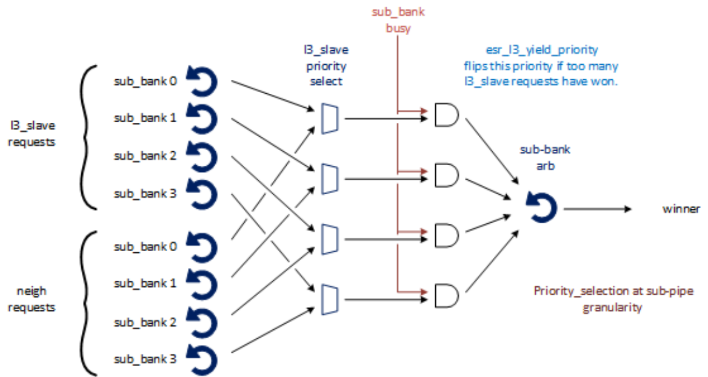


_Figure 8_ 

The reqq selects which requests to send to the mesh, rspmux, and l3_slave using simple Round Robin arbitrations. 

#### 2.6.1 Reqq Request Ordering 

The reqq maintains order between the requests. The following is a list of the rules used to maintain order: 

1. Multiple L2 cache requests to the same PA will be sent to the pipeline and/or mesh in the order that they are received by the reqq. 

   - a. Two requests to the mesh will never have the same address outstanding (with the exception of Scratchpad Fills since Scratchpad Fill request addresses are not tracked for ordering. 

   - b. Similarly, multiple L3 cache requests will never have the same PA. However, matching PAs between the L2 and L3 are not ordered with respect to each other. 


2. Scratchpad reads and writes from the Neighborhoods to the same PA will be sent to the pipeline in the order that they are received. 

   - a. The same applies to Scratchpad reads and writes from the L3_slave to the same PA. However, matching Scratchpad PAs from Neighborhoods and L3_slave are not ordered with respect to each other. 

3. MsgSendData responses to each Neighborhood will be sent in the order that the requests are received. 

Ordering is maintained in the reqq using linked lists. Each reqq entry keeps track of whether it is dependent upon the request that is in front of it and which reqq entry it is dependent upon. Each reqq entry also has a tail bit indicating whether it is the youngest in the linked list. 

When a new request is received, its address, the type of request, and its source are compared against all in-flight requests in the reqq. If it matches any in-flight requests, then it will be dependent upon the matching entry with the tail bit set. The matching entry clears its tail. All newly allocated entries are allocated with their tail bit set. 

A reqq entry that is dependent upon another entry is not eligible to be sent to the pipeline or mesh. 

Victims are inserted into the front of linked lists, but behind other victims. The victim is placed at the front of a linked list so that a read miss following the victim will not make a read request from the mesh until the write response for the victim has been received. This is required because the ordering is not guaranteed between reads and writes on AXI. 

It is possible to get multiple victims with the same address (for example write A, write B, write A can generate victim B, victim A, victim B if all but one way is locked). When there are multiple victims, victim writes to memory must maintain their order. Therefore, the younger victim is placed behind the older victims. The younger victim then waits until the older victims have received a mesh response before being sent to the mesh. 

Linked-list handling is as follows (see the diagram below): 

1. A single entry whose address doesn’t match any other requests in-flight is a singleton list with both its head and tail set. 

2. A new entry is allocated. It becomes dependent upon the address match in front of it. 

3. If there is a match against a victim, the previous head of the linked list becomes dependent upon the victim. 

4. If there is a second victim (because there were already writes to this line in-flight that got kicked out again) then the new victim is inserted in front of the non-victim-head entry and behind the victim-tail entry. 


_Figure 9_ 

For a Flush or Evict, there is a linked list corner case if the victim is generated in the pipeline just before the Flush or Evict. After the victim, the Flush or Evict already in the pipeline will miss, which would usually cause the Flush or Evict to be done, meaning that since there is no work to do, a response is sent to the Neighborhood and the reqq entry is deallocated. However, deallocating the reqq entry would mean deallocating the middle or tail of a linked list, which would break the list’s functionality. To prevent this, even though the entry still signals _done_ to the Neighborhood or l3_slave, it does not immediately deallocate, but rather, is kept valid and dependent on the victim until the victim ahead of it completes. When the victim completes, the flush/evict becomes the head of the linked list and signals _done_ to any of its dependents. Only then can the flush/evict deallocate. 

A similar corner case exists for reads, atomics, and prefetches. In this case, it is a victim, followed by a write, and then a read (or an atomic or prefetch). The read will be a hit, which would normally signal _done_ and deallocate. However, since the read (or atomic or prefetch) is now behind the victim of the same address in the linked list, it cannot be deallocated until the victim resolves. 

### 2.7 Dataq 

The dataq is designed to be implementable with a two-ported Register File containing a write port and a read port. There are five sources for dataq writes that must arbitrate for access to the single write port and there are five sources for dataq reads that must arbitrate for access to the single read port. 


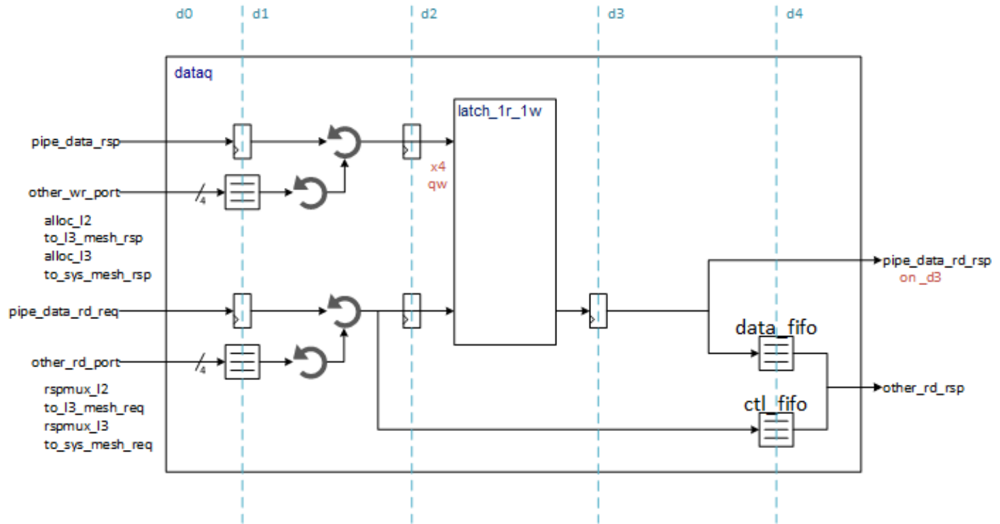


_Figure 10_ 

The five dataq write ports are as follows: 

1. Pipeline for read responses or victim data 

2. Incoming Neighborhood write requests 

3. Incoming L3_slave write requests 

4. To_l3 mesh for fill data responses 

5. To_sys mesh for fill data responses 

The pipeline is non-stalling. Write requests from the other write sources are queued up in FIFOs. If the FIFOs fill, the requestor will backpressure. To minimize pressure on the dataq write ports, pipeline responses for reads will attempt to bypass directly to the Neighborhood response mux or L3 slave response mux and pipeline victims will attempt to bypass directly to the mesh so that the dataq write is not necessary. A dataq write will be necessary in the event that the Neighborhoods or mesh get backed up and the data needs to be put somewhere. 

The five dataq read request ports are as follows: 

1. Pipeline for write data to the cache 

2. Neighborhood rspmux read responses 

3. L3_slave read responses 

4. To_l3 mesh for mesh writes 

5. To_sys mesh for mesh writes 


Numbers 2-5 are needed in the case that the pipeline responses are unable to be bypassed, requiring the data to be read back out of the dataq. They are also used for some operations, such as messages and remote Scratchpad writes, that don’t go down the pipeline. 

### 2.8 Read Buffer 

The Read buffer, also known as the RBUF, is an alternative small cache. The intention of this block is to decrease Static Random Access Memory (SRAM) accesses, as these memory panels are slow and power hungry. 

The RBUF is an 8-entry fully-associative mini-cache. This buffer is just used to keep clean data, so only read operations take advantage of it. All other operations still need to go through the pipeline. 

Read buffer installs occur when there is a read hit for an L2 or Scratchpad read. L3 reads do not use the Read buffer. Note that Scratchpad reads include those that may have arrived from the l3_slave. Read buffer evicts occur due to a Read buffer capacity eviction or tag RAM capacity eviction. Read buffer clears occur when a request that will change the data RAM is eligible for execution. 

RBUF addresses are compared against requests when they first arrive and are allocated a reqq entry. Each reqq entry keeps track of whether its address is valid in the Read buffer and if so, which Read buffer entry the line is in. Reads that are valid in the Read buffer will be sent to the Read buffer rather than the L2 pipeline. Any other operation that is valid in the Read buffer and can change the data in the cache will signal that its associated Read buffer entry needs to be invalidated when this operation is eligible to go down the pipeline. Read buffer installs, clears, and evicts are monitored by the reqq so that the reqq can update the Read buffer valid status for each reqq entry. 

There is a FIFO after the RBUF to hold the RBUF hit responses until they can be taken by the rspmux or l3_slave. The FIFO must have enough space to hold all possible hits that are already in-flight. If the RBUF FIFO is full or might become full due to already in-flight requests, then the Read buffer signals _busy_ to the reqq. 

### 2.9 Atomic Block 

To support atomic operations in L2/L3, each cache bank includes an atomic block, which, given the data and command, is capable of executing the operations required by the atomic instructions (see the <u>Atomics</u> section for specifications). To meet these requirements, this block operates on 32b, 64b, and 256b. This block is controlled by the pipeline, as the pipeline receives the request and produces one of the inputs to the atomic block. 

The atomic operation performed is controlled by conf[6:0] and an operand within the data of the request. See the Atomics section. The type of operation (32b, 64b, or vector) and target are defined in the subopcode conf[6:4]. The operation performed is based on the atomic opcode conf[3:0] in the operand. The operation performed is based on the enumeration as follows: 

```
         SC_AmoSwap      : swap operand/memory read
```


```
         SC_AmoAdd       : signed add allowing wrap (no saturation)
         SC_AmoXor       : logical xor operation
         SC_AmoAnd       : logical and operation
         SC_AmoOr        : logical or operation
         SC_AmoMin       : signed min
         SC_AmoMax       : signed max
         SC_AmoMinU      : unsigned min
         SC_AmoMaxU      : unsigned max
         SC_AmoMinPs     : psmin (float32 min, with NaN handling, see below)
         SC_AmoMaxPs     : psmax (float32 max, with NaN handling, see below)
         default         : maintain previous value
```

The `ps(min/max)` operations refer to packed short (i.e. floating point precision) operations. Although it is defined as packed "vector - 8 32-bit", it is implemented for 32b and 64b operations (as well to be completely orthogonal with the design). 

One caveat is NaN handling for the ps(min/max) formats. NaN handling should be implemented as follows: 

```
      If at least one input is a signaling NaN, or if both inputs are quiet NaNs, the result
is the canonical NaN.
```

```
       If one operand is a quiet NaN and the other is not a NaN, the result is the non-NaN
operand
         quiet     NaN (qNaN) => (value[30:23] == 8'hff) && (value[22] == 1'b1)
         signaling NaN (sNaN) => (value[30:23] == 8'hff) && (value[22] == 1'b0) && (value[21:0]
!= 0)
         canonical NaN (cNan) => 32'h7fc0_0000
       In brief:
       - if any of the inputs is an sNaN, the result is the canonical NaN
       - if both inputs are qNaNs, the result is the canonical NaN
       - if one of the inputs is a qNaN and the other is not a qNaN, the result is the non-qNaN
number
```

By extension, the ps(min/max) for the 64-bit format is implemented by replacing the previous description with the following: 

```
         quiet     NaN (qNaN) => (value[62:52] == 11'h7ff) && (value[51] == 1'b1)
         signaling NaN (sNaN) => (value[62:52] == 11'h7ff) && (value[51] == 1'b0) &&
(value[50:0] != 0)
         canonical NaN (cNan) => 64'h7ff8000000000000
```

The result of the atomic operation is stored back into memory at the location defined by the address at the appropriate offset and size within the 512-bit line of data. The original memory data from the address offset/size is returned ls-aligned and zero-extended. For L3/SCP atomics, the qw2 of the operand is returned in the data response unchanged in qw2 to the mesh/AXI interface to assist with L3 atomic routing. 


### 2.10 Coalescing Buffer 

Among the supported operations of the cache, we have writeAround operations, which are writes to the L3 or remote Scratchpad that bypass the L2 and can be accumulations of four 128-bit words. However, these cases are very inefficient and add significant pressure to the mesh interconnect and to the memory hierarchy. To improve this, the L2 takes on the responsibility of coalescing these requests as much as possible, with the objective of merging different words of the same cache line that come from different Partial Writes. 

To implement this, each L2 bank has a 32-entry Coalescing buffer. This buffer works together with the cache so the cache can store the data and quadword enables while the buffer keeps information in its entries about which addresses need to eventually be flushed to the next-level cache. 

If the address is not present in the Coalescing buffer when a writeAround is received, a new entry is created and the corresponding valid quadword bits are set. If all four valid quadword bits are set as a result of the operation, the Coalescing buffer generates a flush of the address and clears its entry. 

Not implemented - since the Coalescing buffer is intended to decrease the amount of requests sent to the mesh and higher levels of memory, if the pressure on these is low, the Coalescing buffer just empties itself. In other words, if there is mesh bandwidth available, the Coalescing buffer empties by flushing entries even if their four valid word bits are not set. Note that the entries with more bits set are flushed first to allow more time for the others to generate merges with the requests arriving to L2. 

The L2 cache entries have to interact with the Coalescing buffer to keep it up to date. If any tag line contains some, but not all, quadword enable bits, this is due to a writeAround and the entry is tracked in the Coalescing buffer. When the line data is evicted, either explicitly or through a victim, the entry in the Coalescing buffer is also evicted. 

<mark>An entry in the Coalescing buffer is also released if a write request that overwrites the whole line is received. However, in this case, the entry must be flushed since the line needs to reach the subsequent level of the memory hierarchy.</mark> 

When writeArounds are completed, the CacheOp state machine should be used to flush the Coalescing buffer. 

#### 2.10.1 Coalescing Buffer Entry 

|**Field[bits]**|**Reset**|**Description**|
|---|---|---|
|Valid[0]|1'b0|Indicates that the entry is valid|
|Address[39:0]|40'b0|Address of writeAround entry|


_Table 11_ 


### 2.11 To_L3 and To_Sys Bank Mesh 

The two bank mesh blocks are the interfaces at the edge of the shire_cache_bank on their way to the to_l3 mesh master port and the to_sys mesh master port. 

The to_l3 mesh master port is used for L2 requests to L3 or for remote Scratchpad requests to other Shire Scratchpads. The to_sys master port is used for L3 requests to memory and for L3 atomic responses back to the requesting Shire. 

The bank_mesh modules arbitrate between requests to the mesh. Requests from the reqq may or may not need data. Consequently, requests from the reqq either go directly to the bank_mesh block if no data is needed, or they are sent to the dataq so that the data can be read out of the dataq RAM, and then the request is sent on to the bank_mesh. Requests that need to look up data take four additional cycles (if there isn’t contention for the dataq memory read port). The bank_mesh module arbitrates between reqq requests without data, reqq requests with data coming from the dataq, and victims coming directly from the pipeline data response. The arbitration winner looks up additional state information from the reqq and formats the request to be sent to the mesh. 

Responses from the mesh come back into the bank_mesh. All mesh responses update the reqq. Responses that come back with data that must be sent to the pipeline must update the dataq. Read responses must also be sent to the rspmux or to the l3_slave. It is the responsibility of the bank_mesh to ensure that all required consumers of the mesh response take the response before moving on to the next mesh response (note that read responses to the neigh or l3_slave are returned from the bank_mesh directly because that is the lowest latency, and it allows the dataq entry to be used by the pipeline for a potential victim without the risk of overwriting the data that has to go back to the neigh or l3_slave). 

### 2.12 Rspmux 

The rspmux is responsible for arbitrating amongst all the Neighborhood response producers. The six Neighborhood response producers are as follows: 

1. Reqq for responses without data 

2. Dataq for responses from the reqq that require a dataq data lookup 

3. To_l3 mesh for L2 read misses or remote Scratchpad reads 

4. To_sys mesh for L2 read misses if there is no L3 in the system and misses are instead sent to the to_sys mesh port 

5. Pipeline read responses from the data RAMs. If the response can’t be taken by the rspmux, then the response is written into the dataq 

6. Pipeline responses from the Read buffer FIFO 

Each Neighborhood destination is serviced by an arbiter and the winner is pushed into a corresponding Neighborhood queue. The number of arbiters and queues matches the number of Neighborhood destinations. Each Neighborhood queue has an independent arbiter allowing the rspmux to accept responses from multiple producers per cycle. 


The use of per Neighborhood queues reduces the risk of a busy Neighborhood blocking the head of the line. On the other side of the Neighborhood queues is an arbiter that selects one response to send back to the Xbar per cycle. The arbiter also supports readCoop broadcasts. If a broadcast is in the least-recently popped rspmux queue, then the broadcast will reserve space in the Xbar FIFOs while simultaneously allowing for opportunistic responses to be sent back if there is extra space in the FIFOs after the space reserved for the broadcast is taken into account. 

### 2.13 L3 Slave 

The L3 slave module in the bank receives L3 and remote Scratchpad read and write requests from other Shires. These incoming requests are FIFO’ed and then sent on to the reqq to be allocated and then processed. 

The L3 slave also has a response mux similar to the response mux to the Neighborhoods. There are five response producers for the l3_slave, as follows: 

1. Reqq for responses without data 

2. Dataq for responses from the reqq that require a dataq data lookup 

3. To_sys mesh for L3 read misses 

4. Pipeline read responses from the data RAMs. If the response can’t be taken by the rspmux, then the response is written into the dataq 

5. Pipeline responses from the Read buffer FIFO for remote Scratchpad reads 

### 2.14 Cache Pipeline 

The L2 pipeline is heavily conditioned on the tag and data memory panels as they must wait 2, 3, or 4 cycles between subsequent operations to them. The read-modify-write operations in these panels are the bottleneck of the pipeline repeat rate. If consecutive operations can be scheduled to different sub-bank panels, a 1-cycle throughput can be achieved. 

Below is the progression of a read hit through the pipeline stages. The dark green and dark blue sections are the memory panel access cycles. This diagram assumes a 2-cycle memory access. 


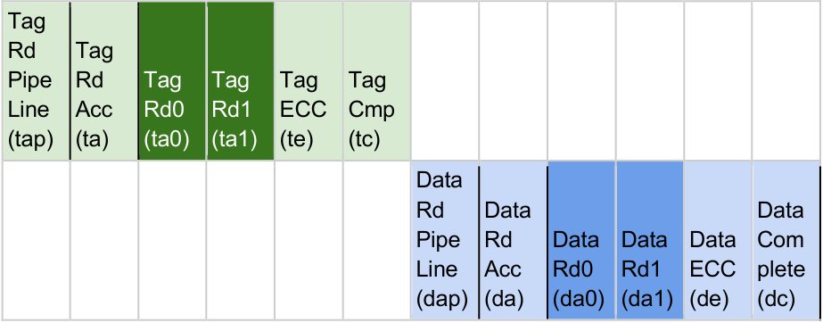


Fills, Writes, writeArounds, and Locks can generate a victim. This requires a read of the victim followed by a write of the new line in the tag and data memory panels. Since the pipeline is non-stalling, the 


scheduling always reserves the cycles for both the reads and the writes. The pipeline signals _busy_ to the reqq in order to ensure that the sub_bank will be empty during the cycles when the writes are done. For these types of operations, the pipeline throughput is one operation every 4, 6, or 8 cycles, depending upon the panel frequency divider. 

The latency between the tag read when a victim is selected until the tag is written is four cycles for the 2- cycle panel access example shown below. This allows for two requests to be moving down the pipeline between the victim selection and the tag write. The pipeline looks ahead for those two requests to ensure that a read that hits the victim address will be signaled as a miss despite the tag compare match. Similarly, reads that follow fills will grab the fill data instead of reading the data ram panels, because the data ram panels will be written after the read. 

|Tag<br>Rd<br>Pipe<br>Line|Tag<br>Rd<br>Acc|Tag<br>Rd0|Tag<br>Rd1|Tag<br>ECC|Tag<br>Cmp|Tag<br>Wr<br>Pipe<br>Line|Tag<br>Wr<br>Acc|Tag<br>Wr0|Tag<br>Wr1|||||||
|---|---|---|---|---|---|---|---|---|---|---|---|---|---|---|---|
|(tap)|(ta)|(ta0)|(ta1)|(te)|(tc)|(tap)|(ta)|(ta0)|(ta1)|||||||
|||||||Data||||||Data||||
|||||||Rd<br>Pipe|Data<br>Rd|Data|Data|Data|Data<br>Com|Wr<br>Pipe|Data<br>Wr|Dat|Dat|
|||||||Line|Acc|Rd0|Rd1|ECC|plete|Line|Acc|Wr0|Wr1|
|||||||(dap)|(da)|(da0)|(da1)|(de)|(dc)|(dap)|(da)|(da0)|(da1)|


Note that Unlock, Evict, and Flush only require one tag RAM access. They may require a state RAM read and write, but the state RAM is two-ported and so can handle both a read and a write per request in the pipeline. 

#### 2.14.1 Cache Pipeline Stages 

##### 2.14.1.1 Stage ag - Reqq Allocate 

The first stage is common for all flows. It consists of allocating a reqq entry and checking for already existing requests to the same address in the reqq. 

##### 2.14.1.2 Stage ad - Allocate Dependencies 

This is the second half of the allocation. Eligibility is determined. 

##### 2.14.1.3 Stage rqa - Reqq Arbitration 

A winner is selected to go to the pipeline and the winner’s information is muxed out of the reqq. 

##### 2.14.1.4 Stage tap - Tag RAM Pipeline 

This stage is a pipeline to get to the tag RAM panels. 


##### 2.14.1.5 Stage ta - Tag RAM Access 

This stage starts the tag RAM access. In order to save power, the inputs to the RAMs should not change if there is no access (even the address bits should remain unchanged). 

##### 2.14.1.6 Stage ta0 - Tag RAM 0 

This is the first cycle needed by the tag RAM panels. 

##### 2.14.1.7 Stage ta1 - Tag RAM 1 

This is the second cycle needed by the tag RAM panels. 

##### 2.14.1.8 Stage te - Tag ECC 

This cycle is for tag RAM ECC checking and repair. 

##### 2.14.1.9 Stage tc - Tag Compare 

The tc stage is dedicated to tag compare to determine hits, misses, and victims, if needed. 

To avoid false hits in victims generated between the victim and when the tag can be updated, the pipeline keeps track of the victim sets and ways until the tag write occurs and marks hits to victims as misses. 

The status called pipe_tag_rsp_info is sent back to the reqq from tc indicating the following: hit, victim, victim_address, and victim_qwens. 

##### 2.14.1.10 Stage dap - Data RAM Pipeline 

This stage is a pipeline to get to the data RAM panels. 

##### 2.14.1.11 Stage da - Data RAM Access 

This starts the data RAM access. In order to save power, the inputs to the RAMs should not change if there is no access (even the address and byte write enable bits should remain unchanged). 

##### 2.14.1.12 Stage da0 - Data RAM Access 0 

This is the first stage of the data RAM panel access. 

##### 2.14.1.13 Stage da1 - Data RAM Access 1 

This is the second stage of the data RAM panel access. 

##### 2.14.1.14 Stage de - Data ECC 

Stage de is for data ECC checking and fixing. 

##### 2.14.1.15 Stage dc - Data Complete 

At this stage, the data is complete. It is OR’ed back together from the sub-banks and either sent back to the rspmux, or if the Rsp mux is busy, then it’s sent back to the dataq for temporary holding. 


#### 2.14.2 Tag Storage 

Tag and tag state information are kept separate since the tag state panels must be read and written for each L2 request. 

All the tags of a set must be stored in the same panel line, so that all tags involved in a request can be compared in parallel. Each tag uses 23 bits plus 6 bits for ECC. Therefore, the 4-way cache design requires a tag RAM width of 116 bits. The tags are stored as {tag3_ecc, tag3, tag2_ecc, tag2, tag1_ecc, tag1, tag0_ecc, tag0}. 

#### 2.14.3 Tag State Storage 

Each tag state is composed of the following fields per way: 

|**Field**|**Width**|**Description**|
|---|---|---|
|valid|1|Indicates that the entry is valid|
|locked|1|Indicates that the entry is locked|
|zero|1|Indicates that cache memory must not be read and only zeroes<br>are returned|
|qwen|4|Indicates that the quad word is dirty. There is one qwen bit for<br>each of the four quadwords in the cache line.<br>If the entry is valid:<br>qwen=4’h0, indicates the line is clean.<br>qwen=4'hf, indicates the line is fully dirty.<br>else indicates the line is partial.|


_Table 12_ 

Each tag state requires seven bits and are organized as {valid, locked, zero, qwen}. In addition, a 5-bit LRU code used for the replacement policy is also stored in the tag state RAM. 

The combined 4-way tag state and LRU code are protected by a 7-bit ECC, for a total of 40 bits. The organization of the tag state RAM is {ecc, tag3_state, tag2_state, tag1_state, tag0_state, lru_code}. 

Since the state of all the ways of a set are available in the tag_state, all the necessary information to select a victim way is available. 

#### 2.14.4 Replacement Policy 

LRU is the chosen policy for the shire cache. The state RAM has five bits to store LRU states per set because in a 4-way LRU, there are 4! possible ordering states (24 states), which require five bits to encode. By using five bits, we minimize the amount of memory required to store the state at the expense of adding some combinational logic to encode/decode the way ordering. 


Given an 8-bit vector {w3[1:0], w2[1:0], w1[1:0], w0[1:0]} for a set, where w0 is the least recently used way (0..3) and w3 is the most recently used way, the proposed encoding is as follows: 

###### Input ordering 

###### Encoded state 

|7<br>6<br>w3 (MRU)|5<br>4<br>w2|<br>3<br> <br>w1|2<br>1<br>0<br>w0 (LRU)|➜<br>4<br>w3 < w2|3<br>2<br>w1[1:0]|1<br>0<br>w0 (LRU)|
|---|---|---|---|---|---|---|


By using this encoding, reading the state memory will directly give the way to be replaced (assuming all ways are valid) in the two LSBs. 

When updating the state, a combinational logic or LUT that takes the current state and the new MRU into account as well as the _lock_ bits (if any of the ways is locked, it should never be written in the bits corresponding to the LRU). 

#### 2.14.5 Data Storage 

The L2 data memory array is composed of a combination of SRAM memory panels that are 144 bits wide. To reach the 512-bit line size, a sub-bank is created, which combines four of these panels, each one containing a 128-bit word plus its corresponding ECC. This organization allows for Partial Write operations by design. Furthermore, to save power, only the appropriate panels should be selected for accessing words. The actual cache granularity is 128 bits, so there is no need to charge all four panels of a cache line unless the request involves the whole line. For instance, a Partial Write that just changes three words does not need to activate more than three memory panels. 

#### 2.14.6 Cache RAMs 

##### 2.14.6.1 Cache RAM Timing 

The different panels containing tag_state, tags, and data are Intellectual Property (IP) acquired from a third party vendor. To meet this specification, their latency needs to be taken into account and also their specific clocking requirements. 

Depending on the final choice of the panels, each access might take 2, 3, or 4 cycles. The design is intended to operate using 2-cycle access. If timing cannot be met using 2 cycles, 3-, or 4-cycle RAM timing can be used. The Shire Cache RAM timing is controlled by esr_sc_ram_delay and its programming is described in <u>ESRs for Pipeline Control</u> section. 

The pipeline design has quite a bit of control variation to handle changes in RAM delay latency. The design can be set to use any of the RAM delays. The ram_delay setup must be done at boot time or during major mode configuration changes when there is no activity in the Shire Cache. 

##### 2.14.6.2 RAM ECC 

All RAMs are protected with SECDED protection. There is a common ECC generation and a common ECC correction block that can be used for data widths from 12 to 64 bits using 6-8 bits of ECC (based on 


data width). The Shire Cache tag_state is protected by a 7-bit ECC. The Shire Cache tag protects each way’s tag with a 6-bit ECC. The Shire Cache data RAMs protect each of the 8 dwords of the cache line with an 8-bit ECC. 

##### 2.14.6.3 BIST 

The Built-In Self Test (BIST) strategy for all RAMs will be done using a shared bus BIST, such as the Synopsys SMS (STAR Memory System). The BIST muxing is hidden behind a bist_wrapper to support the shared bus flow. The diagram below shows the muxing paths for each of the logical RAMs per bank. The logical RAMs are mbs (tag_state), mbt (tag), mbd (data), and mbq (dataq), and mbi (icache - bank0 only across all Neighborhoods). 


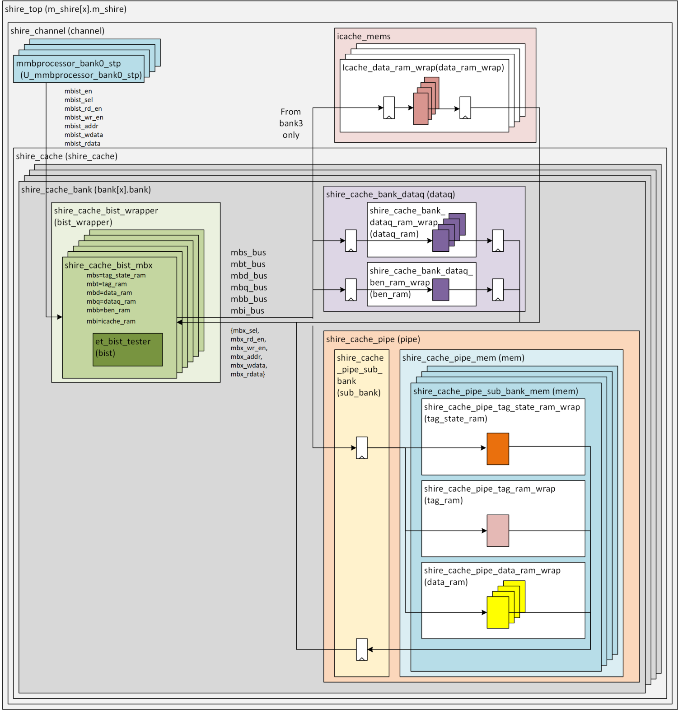


_Figure 11_ 

##### 2.14.6.4 RAM Trim Bits 

The RAM macros have trim bits to allow them to operate at various voltage levels.  These trim bits are set per logical ram group by ESR settings.  The ESR settings default to RM0 mode to allow nominal 650mV operation.  To change the default RM mode, the RME bit must be set to 1 for each associated logical ram. 


The ESRs to control the trim bits are located within the shire_other ESR group in _shire_cache_ram_cfg1_ through _shire_cache_ram_cfg4_ . 

_shire_cache_ram_cfg1_ = mbt and mbs RAM trim bit settings _shire_cache_ram_cfg2_ = mbd RAM trim bit settings _shire_cache_ram_cfg3_ = UNUSED 

_shire_cache_ram_cfg_ = mbi RAM trim bit settings 

The ESR settings can be overridden by TDR settings by setting the **use_shire_tdr_cache_ram_cfg** =1 and then controlling each RAM trim bit through the values defined in the DFT chains documentation. 

The tag_state_ram (mbs) is a 2PUHDRF ram type.  The mbt, mbd and mbi rams are 1PUHD ram type. The required trim bit settings for optimum performance are documented in the following tables.  The differences between the ram types are highlighted. 

**tag_state_ram (mbs) = saculs0g4l2p1024x40m4b1w0c0p0d0s1rm0rw11 (2PUHDRF)**

|VMIN (mV)|Vnom (calc)|RM mode|RM[3:0]|WA[2:0]|RA[1:0]|WPULSE[2:0]|
|---|---|---|---|---|---|---|
|855|950|5|7-5|4|0|0|
|765|850|4|4|4|0|0|
|675|750|3|3|4|0|0|
|650|722.222222|2|2|5|0|0|
|630|700|1|1|6|1|0|
|540|600|0|0|6|2|0|


_Table 13_ 

**tag_ram (mbt) = saduls0g4l1p1024x116m4b1w0c0p0d0s1rm0sdrw11 (1PUHD)**<br>**data_ram (mbd) = saduls0g4l1p4096x144m4b4w0c0p0d0s1rm0sdrw11 (1PUHD)**<br>**icache_ram (mbi) = saduls0g4l1p512x144m4b1w0c0p0d0s1rm0sdrw11 (1PUHD)**

|VMIN (mV)|Vnom (calc)|RM mode|RM[3:0]|WA[2:0]|RA[1:0]|WPULSE[2:0]|
|---|---|---|---|---|---|---|
|855|950|5|7-5|5|0|0|
|765|850|4|4|5|0|0|
|675|750|3|3|5|0|0|
|650|722.222222|2|2|6|0|0|
|630|700|1|1|7|1|0|
|585|650|0|0|7|1|0|


_Table 14_ 


### 2.15 Index CacheOp State Machine 

The index CacheOp state machine can be used to quickly operate across the entire cache or cache region. The index CacheOp state machine also allows for access to the tag_state, tag, and data RAM content through Dbg_Read and Dbg_Write operations. The index CacheOp state machine is described in detail in the <u>Index CacheOps</u> section. 


## 3 Supported Operations 

### 3.1 List of Operations 

A list of the supported operations from the Neighborhoods are available in the <u>Supported ET-Link Requests from Neighborhoods</u> section. 

A list of the supported operations from the L3 slave port are available in the <u>Supported L3 Slave Requests</u> section. 

In addition, there is a per-bank CacheOp Finite State Machine (FSM) controlled by ESRs (see <u>Index CacheOps).</u> 

Details regarding each of these operations are listed in the sections below. 

### 3.2 REQ_Read 

The REQ_Read operation can be a read to L2, L3, the local Scratchpad, or a remote Scratchpad. What is read is determined by the PA and subopcode. The PA and Shire determine whether the access is the Scratchpad and, specifically, whether the access is the local Scratchpad or a remote Scratchpad.  For reads that are not to the Scratchpad, the subopcode determines whether the read is sent to the local L2 or forwarded to the L3. 

#### 3.2.1 L2 REQ_Read 

This section covers requests from the Neighborhoods when the PA and subopcode indicate that the read is an L2 read. 

The diagram below shows the lifespan of a read request through the reqq and pipeline if the read is a hit. The bank receives a REQ_Read request from a Neighborhood. This request is stored into the reqq. The reqq sends an L2_Read down the pipeline. If the read is a hit, then a response is sent back to the Neighborhood with the read data. Note that if the Neighborhood response channels are very backed up, response data can get placed back into the dataq until it can be read back out and the response returned. When the response is returned, the reqq entry is deallocated. 


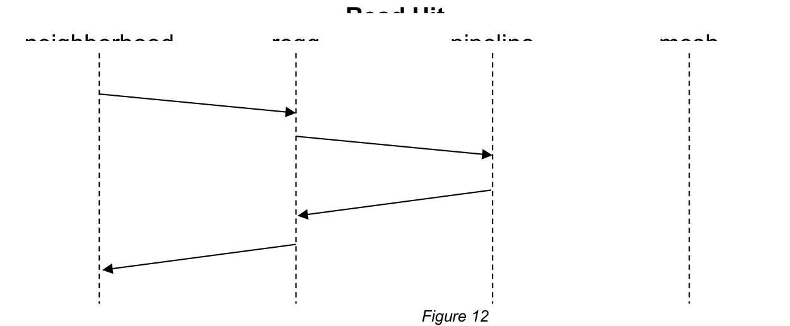


_Figure 12_ 


The diagram below shows the REQ_Read request lifespan if the read is a miss that generates a victim. If the read is a miss, the reqq sends the request on to the mesh to the to_L3 port or memory the to_sys port if there isn’t an L3 configured. When the mesh response comes back, the data is returned to the Neighborhood and installed back into the dataq entry associated with the reqq entry. The reqq then sends an L2_Fill down the pipeline. If all ways are valid, then the LRU way is evicted. If the line is clean, the eviction is silent. If the line is dirty, a victim is generated. The victim line must be written back to L3. The victim is temporarily stored back into the dataq entry and the reqq issues a write request to the mesh. When the L3 write is completed, the reqq entry is deallocated. If the mesh is not busy, the victim can be sent directly out and bypass being stored into the dataq. 

Whenever a victim is generated, all entries in the reqq watch to see if the victim matches their address. If it does, and a reqq entry is at the head of its address list, then that entry puts itself behind the victim. This ensures that the victim write makes it to the next cache or memory before any subsequent read miss attempts to read the line. 


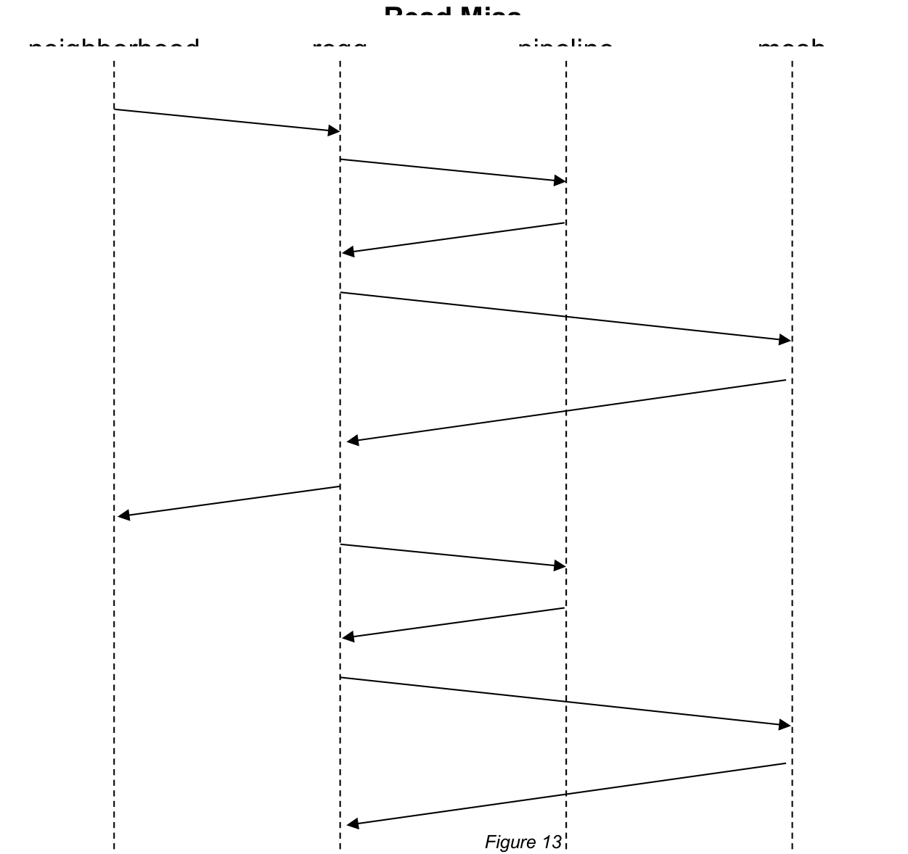


_Figure 13_ 


#### 3.2.2 L3 REQ_Read 

This section covers L3 reads received from the L3 slave port. 

L3 reads are handled the same as L2 reads. They are received from the L3_slave and move down the pipeline as L3_Read and L3_Fill. Misses and victims are directed to the to_sys mesh port. 

Unlike the L2 cache, the L3 cache can contain partial lines from writeArounds that were flushed to L3. If a read hits a partial line, the partial line is first evicted out to memory and then read back into the L3. 


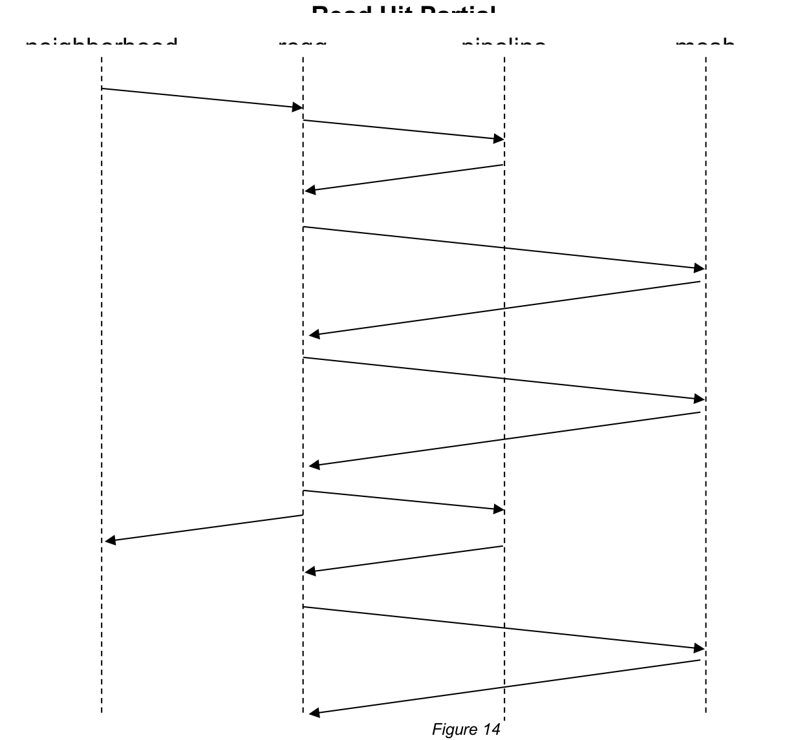


_Figure 14_ 


#### 3.2.3 L3 REQ_Read from Neighborhood (Read Forwarding) 

An L3 read can be initiated by the Neighborhoods when the subopcode indicates that it is an L3 read. This read is then forwarded directly to the to_l3 mesh. 

#### 3.2.4 SCP REQ_Read Local and Remote 

SCP REQ_Reads are determined by the incoming PA. An incoming REQ_Read PA that exists within the Scratchpad space will be mapped to a Scratchpad read. If the Shire bits in the PA match the current Shire’s virtual ShireID, then the SCP access is local and the Scratchpad read will be sent to the pipeline. If the ShireID is not the current Shire, then the SCP access is remote and the read or write request will be sent to the to_l3 mesh. 


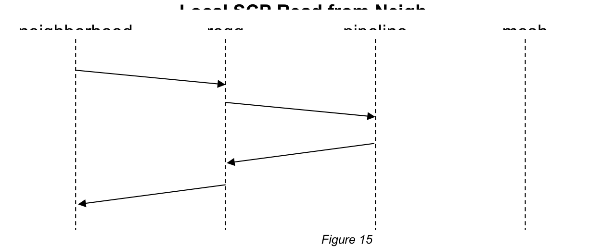


_Figure 15_ 


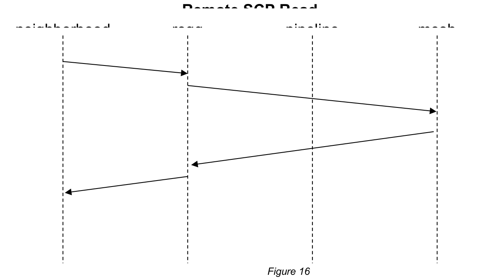


_Figure 16_ 


An SCP read received by the l3_slave looks like a local SCP read. It can go to the Read buffer or the regular cache pipeline. It is always a hit. Responses will be sent back to the l3_slave. Address matches between the Neighborhood-initiated SCP and the l3_slave-initiated SCP are not ordered. For an L3 SCP read, an error is reported if the PA for the SCP is not the current Shire (NoC routing error) or if the address is outside of the allocated SCP cache space. 


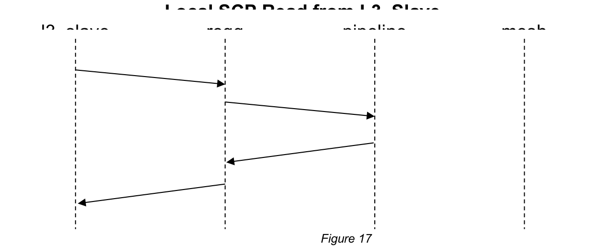


_Figure 17_ 


### 3.3 REQ_ReadCoop 

The REQ_ReadCoop is handled just like a REQ_Read with the addition of a broadcast vector. The read response is broadcasted to each Neighborhood that has its corresponding bit set in the broadcast vector. A broadcast is performed in the final step of the Shire Cache, in the rspmux. 

The list of Neighborhoods to broadcast to is specified in Data[23:16]: mask of cooperating Neighborhoods. Each bit in the mask corresponds to a Neighborhood physical ID. For each bit set in the mask, the read response will be sent to the corresponding Neighborhood. 

The Shire Cache will signal an error interrupt if the mask is zero. Note that the Shire Cache does not currently detect an error if the mask includes a port larger than the number of Neighborhoods in the Shire. 

### 3.4 REQ_Write 

The REQ_Write operation can be a write to L2, L3, the local Scratchpad, or a remote Scratchpad. What is written is determined by the PA and subopcode. The PA and Shire determine whether the access is the Scratchpad and whether, specifically, it is the local Scratchpad or a remote Scratchpad. For writes that are not to the Scratchpad, the subopcode determines whether the write is sent to the local L2 or forwarded to the L3. 

Writes can be full line or partial line. The PA must be aligned to the write size. 

#### 3.4.1 L2 REQ_Write Full Line 

This section covers full line write requests from Neighborhoods when the PA and subopcode indicate that the read is an L2 write. 

The write data is stored into the dataq entry associated with the reqq entry. When the pipeline needs the L2_Write data, it will read it from the dataq. 


If the line is a hit and not partial due to writeArounds, then the line is simply written into the hit way. If the line is a miss, then another line must be kicked out to make room for the new write, and a victim may be generated. The sequence below shows a write that generates a victim. 

The response to the Neighborhood can be sent as soon as the write to the cache has completed. The dots in the diagram after REP_Ack indicate that, depending on backpressure, the reply may or may not end up coming out before the mesh victim. The reqq entry cannot be deallocated until the REP_Ack is sent and the mesh response is received. 


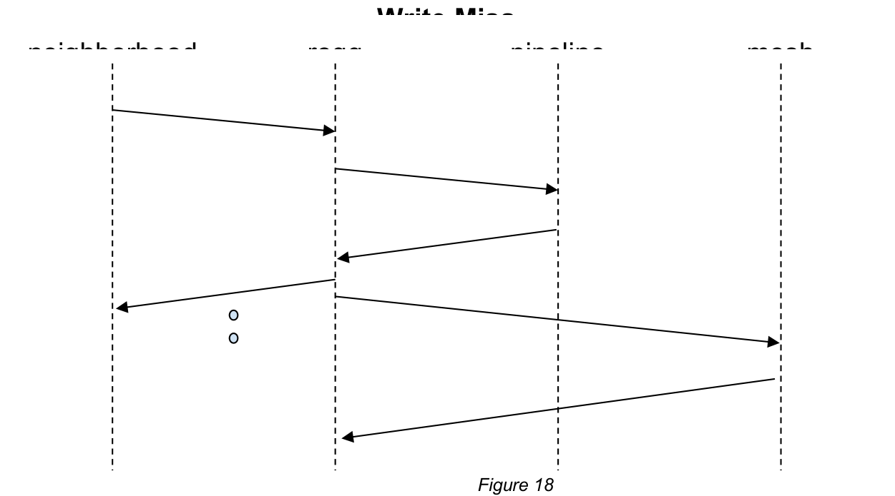


_Figure 18_ 


A full line L2 write that hits partials must evict the partials to L3 before performing the write. Partials exist in L2 due to writeArounds that are heading to L3, so they must first be sent to L3, and then the write can be performed. Note that the diagram below looks exactly like the one above, except that the victim is the same address as the line written. 


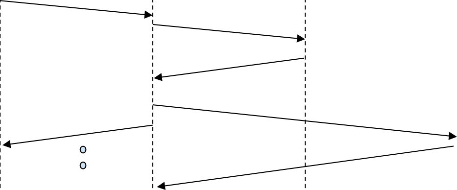


_Figure 19_ 

#### 3.4.2 L2 REQ_Write Partial 

REQ_Write will become Partial Writes under the following conditions: 

1. L2 write requests that are not full lines become Partial Writes, so any L2 write requests that are smaller than a full line. 

2. L3/SCP write requests that are not writing full qwords become Partial Writes. This refers to any L3/SCP write request that is smaller than a qword or any write request that is larger than or equal to a qword that does not have full bens per any written qword (i.e. swiss cheese within a written qword). 

Unlike normal writes, Partial Writes must have the line installed before the write can proceed. The reqq will send the write to the pipeline in an attempt to do the write. However, if the line is a miss, the reqq will fill the line before making a second attempt at the write. 

Two reqq entries are allocated for each REQ_Write Partial. In the diagrams below, the black lines indicate operations initiated by the primary reqq entry, and the purple lines indicate operations initiated by the secondary/paired reqq entry. 


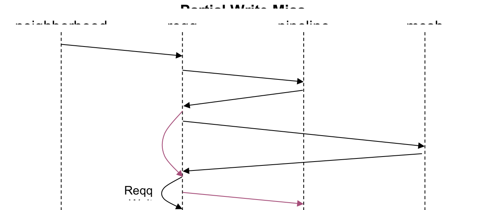


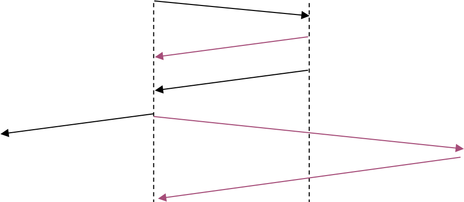


_Figure 20_ 


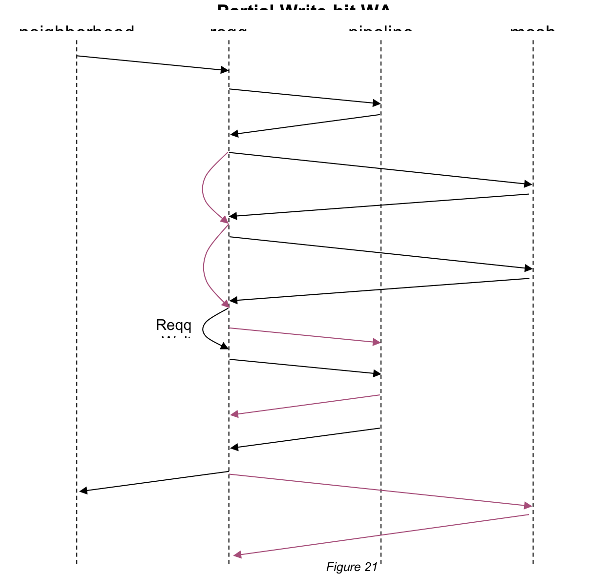


_Figure 21_ 


#### 3.4.3 L3 REQ_Write 

Writes to L3 support full lines, quad word enables, or partials. 

The L3 cache space supports quad word dirty bits. A write that misses the L3 will be installed into the cache with the dirty bits set corresponding to the incoming quad word enables. A write that has subquadword dirty bytes will be a Partial Write and behave like L2 partials. The line must be installed before the write can proceed. 

A write that hits a valid clean line in L3 will cause the L3 line to be marked as modified, setting all four quad word dirty bits (if only the one quad word is marked as dirty, a subsequent read can’t tell if the line is all valid or partially valid). 


An L3 read that hits a partial line will evict the line to memory and then read it back in order to get the full line to read. 

#### 3.4.4 L3 REQ_Write from Neighborhood (Read Forwarding) 

An L3 write can be initiated by the Neighborhoods when the subopcode indicates that it is an L3 write. This write is forwarded directly to the to_l3 mesh. 

#### 3.4.5 SCP REQ_Write Local and Remote 

SCP REQ_Writes are determined by the incoming PA. An incoming REQ_Write PA that exists within a Scratchpad space will be mapped to a Scratchpad write. If the Shire bits in the PA match the current Shire’s virtual ShireID, then the SCP access is local and the Scratchpad write will be sent to the pipeline. If the ShireID does not correspond to the current Shire, then it is a remote SCP access and the write request will be sent to the to_l3 mesh. 

An SCP write received by the l3_slave looks like a local SCP write. It will be sent down the pipeline and responses will be sent back to the l3_slave. Addresses that have a Neighborhood-initiated SCP and an l3_slave-initiated SCP that match are not ordered. For L3 SCP writes, an error is reported if the PA for the SCP is not the current Shire or if the address is outside of the allocated SCP cache space. 

### 3.5 REQ_WriteAround 

WriteArounds are received from the Neighborhoods primarily from a TensorStore operation from the Minion. The writeAround operation is a single quad word write or an accumulation of quad word writes generated by Minions and directed at the L3 or remote Scratchpad that must bypass the L2. WriteArounds should never be sent with zero qwens. 

There are two reasons this command is designed to reach the L2 banks: first, by routing these operations through the L2 banks, we avoid creating yet another 8:1 bus structure from the Neighborhoods into the mesh router, and second, the L2 will do its best (statistically only, no guarantees) to attempt to merge multiple writeAround writes into bigger writes to the L3 (256b or 512b). To this end, a Coalescing buffer is used. This is described in more detail in the <u>Coalescing Buffer</u> section. 

WriteAround requests reside in the L2 until all quad words have been accumulated, and the line is then written back to the L3 or remote Scratchpad. Optionally, the line can be written back without all quad words if the line is capacity-evicted from the tag RAM or from the Coalescing buffer. Optionally, the lines can also be evicted using L2_Evict CacheOps. 

Note that the writeAround requests can generate two victims: one from the tag RAM and another from the Coalescing buffer. Therefore, writeArounds are allocated two reqq entries. The first reqq entry is available for the tag RAM victim/eviction, and the second reqq entry is available for the Coalescing buffer victim. Any tag RAM eviction will be read from the data RAMs in the bubble cycles that were reserved during the first pass through the pipeline. Coalescing buffer victims require an additional pass down the pipeline to Evict the PA of the entry evicted from the Coalescing buffer. 


The Minions create writeAround requests while doing TensorStore operations. TensorStore operations can target L3 or the Scratchpad. The neigh will convert writeAround requests that hit the local Scratchpad to normal writes with the required qwens set. The neigh will not convert writeAround requests that target a remote Scratchpad. The L2 will be used to coalesce the qwords of a remote Scratchpad to save the bandwidth required to send Partial Writes over the mesh. While the remote Scratchpad qwords are being coalesced (L2 writeArounds to L2 to target a remote Scratchpad), any read of the remote Scratchpad (by Minions in the same Shire or by any other Shire) would not get this partially coalesced data, but would get what is currently in the remote Scratchpad. 

This is somewhat similar to cacheable writeArounds in the L2, but there is a difference. It’s different in that for cacheable coalescing (L2 writeArounds to L2 to the target L3), a read to the partially coalesced data line is flushed and merged in L3 before the read data is returned if it’s read from within the same Shire. However, it’s similar to cacheable writeArounds in the L2 in that if another Shire reads the line, that other Shire will get what is in the L3 and not what is getting coalesced in any other L2 cache at the time (since there is no coherence control). 

<mark>SW should never read from an array that hasn't been explicitly flushed by the Coalescing buffer. If this case is hit, it should be considered a SW bug.</mark> 

For Scratchpad accesses (i.e. lines that memory map to the Scratchpad), the Shire Cache will support reads, readCoops, writes, writePartials, writeArounds, and L2_Evicts. All other operations that memory map to the Scratchpad will receive an error response and no operation will occur. WriteArounds and L2_Evicts to the local Scratchpad will also receive an error response. 

To properly reconstruct the eviction address with the number of bits stored in the tag RAM, the minimum size of the Scratchpad cache region must also adhere to the rules of the L2 cache region to support remote Scratchpad coalescing. 

#### 3.5.1 WriteAround Scenarios/Cases: 

A list of the writeAround cases is provided below. For the cases listed, the following shorthand is used: _CB.install_ adds a Coalescing buffer entry 

_CB.clear_ clears the Coalescing buffer entry 

_CB.replace CB.clear_ previous and _CB.install_ new 

_CB.evict_ clears the CB entry and sends a coalescing evict request to the bank reqq 

1. L2 writeAround hit that doesn’t complete qwens: Update CB.LRU 


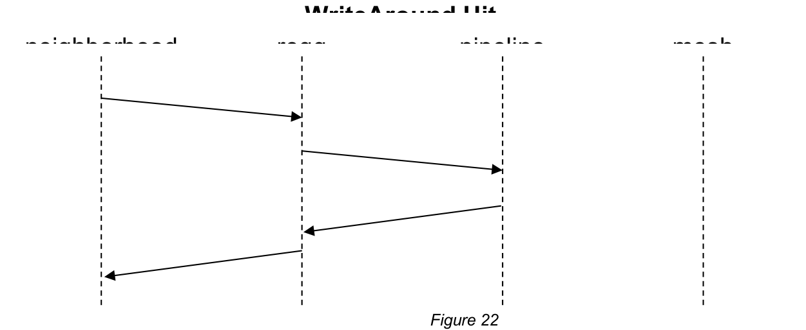


_Figure 22_ 


###### 2. L2 writeAround hit that completes all qwens in L2: 

_CB.clear_ and create a victim with the read data merged with the incoming write data, squash the data_ram write, and set the victim_write_around flag to the reqq in addition to the victim flag. 

###### 3. L2 writeAround that contains all four qwens: 

Perform the same operations as those in the _L2 writeAround hit that completes all qwens in L2_ case, where all merged data will come from the write request since all qwens are set. The pipe will send _CB.bypass_ so that a cbuf_rsp can be sent to the reqq for consistency but not be installed into the Coalescing buffer. 

4. L2 writeAround miss without an L2 victim: 

_CB.install_ to the LRU (may or may not cause a _CB.evict_ using the second reqq entry and the second pipeline pass). The _CB.evict_ is signaled on the cb_rsp bus to the reqq, which will assume that the victim_write_around flag is set. The reqq will keep this flag to determine if all victim_write_around requests to the mesh have completed for the CB flush feature. 

5. L2 writeAround miss with an L2 victim that is not partial: 

_CB.install_ to the LRU. The _CB.install_ may cause a _CB.evict_ , which will use the second reqq entry and the second pipeline pass. The CB stores the full new writeAround address and returns the _CB.evict_ address to the reqq. The second pipeline pass is used to send an L2_Evict at the full _CB.evict_ address specified by the reqq. 

###### 6. L2 writeAround miss with an L2 victim that is partial: 

_CB.replace_ (replace L2 victim CB entry with new writeAround address). The L2 victim is read out in the first pass bubble slot, and returned to the reqq as a victim with the victim_write_around flag set in the tag_rsp to indicate that the victim was a partial victim. 

7. L2 writeAround hit in the tag RAM that is not in the Coalescing buffer: 

This case occurs because the writeAround line was previously capacity-evicted from the CB, but the resulting Evict has not yet made it down the pipeline. In this case, the tag RAM state _qw enable_ will be updated with the new writeAround, but the line will not be installed into the CB. 


The next two diagrams show the following cases: a writeAround with a tag victim and a writeAround with a Coalescing buffer victim. The tag victim diagram applies to cases 2, 3, 5, and 6 above. The Coalescing buffer victim applies to any of the above cases that include a _CB.evict_ . 

The two diagrams operate in parallel with the Coalescing buffer victim handled by the second reqq entry. 

**WriteAround Tag Victim** 


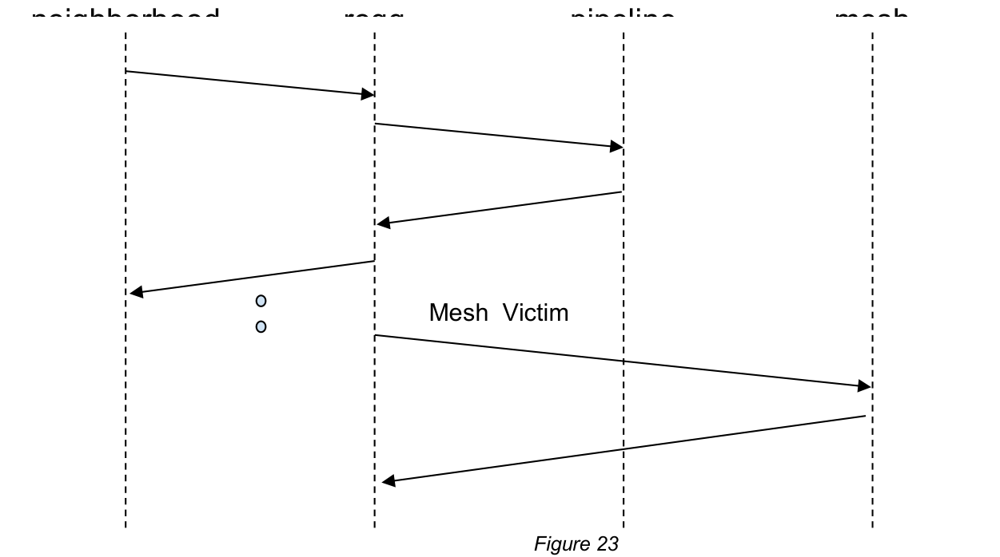


_Figure 23_ 


#### **WriteAround Coalescing Buffer Evict** 


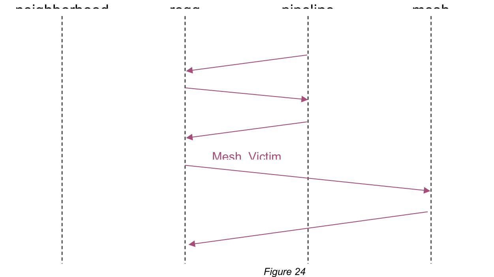


_Figure 24_ 


#### 3.5.2 Other Interactions with WriteArounds 

###### Evict / Flush: 

1. Any L2 capacity eviction or an evict CacheOp of a partial: _CB.clear_ if it exists in CB (it may already have been evicted out of CB due to CB capacity). Set the victim_write_around flag to the reqq in addition to the victim flag. 

2. Flush CacheOp that hits a partial line will not keep a clean copy of the line because it doesn’t have the whole line. The flush is thus turned into an Evict. 

###### Lock: 

3. Partial that hits a Lock clears the lock. 

4. Lock that hits a partial flushes the partial to L3 and then locks the line and zeros the data. The partial line gets _CB.clear_ . 

###### Write: 

5. Full line write that hits a partial line will flush the partial and then do the write. The partial line gets _CB.clear_ . The pipe status is hit, with the victim. 

6. A writeAround that hits a previously-written line will do a Partial Write. All quad words will be dirty, so the line will be written back to memory and the writeAround will not be installed into the Coalescing buffer. 

###### Read: 

7. Read requests that hit a partial line will get CB.clear, victimize the line, and set the victim_write_around flag in addition to the victim flag. The tag Rsp to the reqq will have the hit flag set in addition to the victim flag. The victim indicates that this line has self-evicted. The line is written to the next-level cache to be merged. When the mesh write response comes back, a mesh read is initiated to get the merged data back, after which the fill is sent down the pipe. 


The Read Hit Partial case should not occur if software has correctly prevented writeArounds from mixing with normal read/writes; however, it is included to simplify verification. 

The state diagram for Read Hits Partial is shown below. Note that the Mesh_Write state must be distinct from the Mesh_Victim state so that the state machine knows which mesh write it is dealing with. The Mesh_Write must be followed by a Mesh_Read to get the line back. The final victim of the Fill indicates when it has finished. 


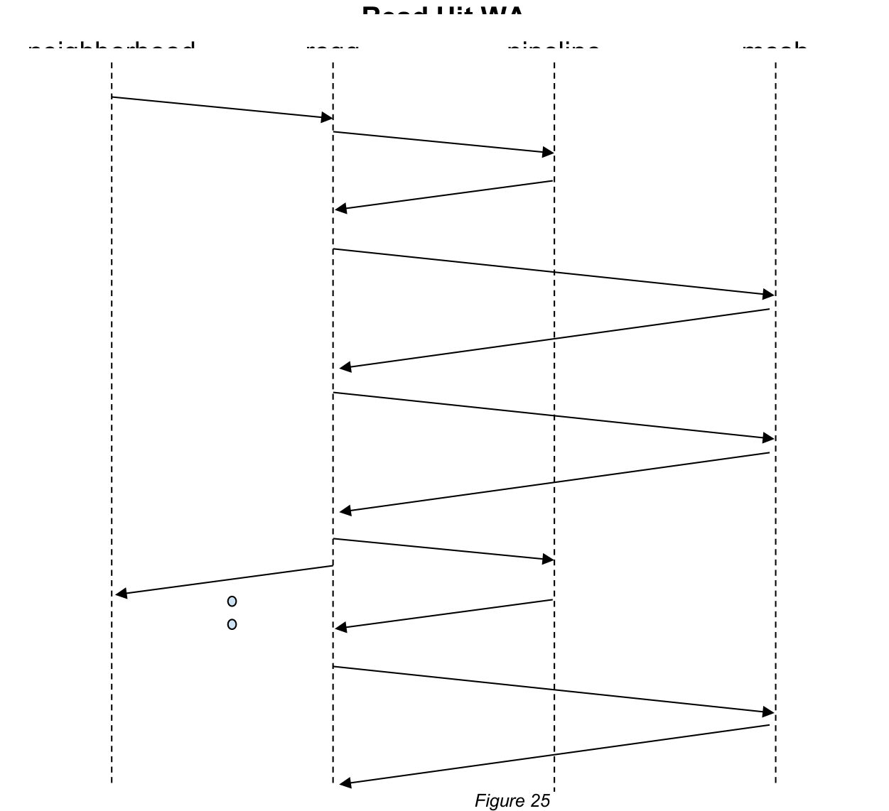


_Figure 25_ 


###### Prefetch: 

8. Prefetches that hit a partial will evict the partial line back to the next-level of memory, just like in the Read Hit Partial case. 

Atomics: 

9. Atomics that hit a partial must evict the partial to memory and then fetch it back. The victim must use the atomic’s paired reqq entry in order to avoid overwriting the atomic write data in the primary reqq entry. See more information in 3.7 REQ_Atomic. 


Victims: 

10. If a Coalescing buffer evict is coincident with a tag RAM capacity eviction for the same address, the Coalescing buffer evict is ignored. 

#### 3.5.3 Flushing the Coalescing Buffer 

When SW is done with writeArounds, there must be some means of evicting all the remaining Coalescing buffer entries to be flushed to memory and letting the SW know that it has been done. 

This can be done with a CacheOp state machine. See section the <u>Index CacheOps section.</u> 

### 3.6 REQ_MsgSendData 

The Shire Cache only supports intra-Shire message requests. Inter-Shire message requests are performed through the UC block. The message fields and id are described in detail in the document. 

An intra-Shire message is a Minion source to a Minion destination type (i.e. broadcast or multicast to destination Minions are not supported). The only message ordering requirement is that a message from the same source Minion to the same destination Minion is maintained. There is no ordering requirement for a message from a different source or different destination Minion. 

To perform an intra-Shire message, ordering from a source Minion to a destination Minion requires both the source Minion Neighborhood and Shire Cache bank to implement the following: 

- 1) The source Minion Neighborhood must always send the message to the same Shire Cache bank for the same destination Minion. To load balance the handling of messages across the Shire Cache banks, the source Minion Neighborhood can distribute the messages across the Shire Cache banks for different destination Minions. One example would be to send the message to the Shire Cache bank based on the destination Neighborhood. The Shire Cache bank does not preclude all messages being sent to the same bank, but it is preferable to load balance the message handling across the banks. 

- 2) The Shire Cache bank reqq must order all messages to the same destination Neighborhood. 

When a msgSendData is received at the Shire Cache bank reqq, its address, which has the encoding information, is looked up to determine which Neighborhood to forward the message to. The _id_ and _dest_ fields to use for the msgRecvData are also looked up, as shown in the table below. The msgSendData data, wdata, and size are passed on to the msgRecvData. 

||**MsgSendData**|**MsgRecvData**|
|---|---|---|
|source||dest = MsgSendData address[15:12]|
|id||id = MsgSendData address[10:3]|


|address||
|---|---|
|port_id|port_id = MsgSendData address[19:16]|
|data|data|
|size|size|
|wdata|wdata|


_Table 15_ 

If a message destination is illegal because it maps to a non-existent destination port (Neighborhood + RBOX), then the shire_cache will drop the message and signal an interrupt. 

### 3.7 REQ_Atomic (ET-SOC1) 

Both the L2 and the L3 support Atomic requests. See the for the list of the atomic operation types. The sections below detail how atomics are implemented by the Shire Cache. 

#### 3.7.1 L2 REQ_Atomic 

The L2 supports Atomic requests. These operations imply a read-modify-write on data in the cache without any other action on the same address until the atomic is completed. 

The data associated with atomics is 32-bit, 64-bit, or 8 32-bit Single Instruction Multiple Data (SIMD).  Atomic result data is presented address-aligned in the response. 

Atomics allocate two entries in the reqq. The first entry contains the data associated with the atomic operation, for example, the number to add or compare with the data in the cache. The second reqq entry is a placeholder in case the atomic is a miss or hit partial and the data must be filled from memory. 

The sequence below describes an atomic that hits in the cache. The atomic operation is sent to the pipeline as an L2_Atomic. The data associated with the atomic is in the dataq entry associated with the reqq entry. For an L2_Atomic, the pipeline reserves enough cycles to perform a read of the cache line, send the contents along with the atomic data to an atomic arithmetic block, wait for the response, and write the results back to the line. No operations to that sub-bank can occur between the read and the write. 


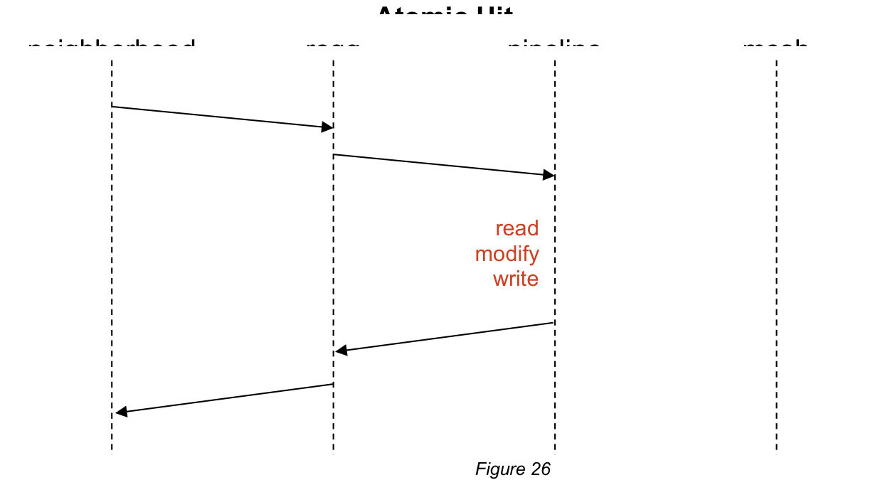


_Figure 26_ 


The sequence below shows the transactions if the atomic is a miss. This sequence uses the second reqq entry that is allocated with the atomic. The black lines are associated with the primary atomic reqq entry, and the purplish lines are associated with the secondary paired entry set aside for a possible miss. 

If an atomic misses in the cache, the mesh read will be initiated by the primary reqq entry. This ensures that the read is in its proper place with respect to other transactions or victims that match the same address. When the mesh response comes back, it is loaded into the paired atomic entry’s dataq entry. The paired entry initiates the fill. If the fill generates a victim, it will reside in the paired atomic reqq entry. The reqq will schedule the primary atomic immediately after the fill by giving it the highest arbitration priority (by suppressing all other eligible reqq entries), guaranteeing that the second pass will be a hit and the read-modify-write will be performed. 

Note that the paired atomic entry does not send any responses back to the Neighborhood either when the fill data comes back from the mesh or when the fill goes down the pipeline. 


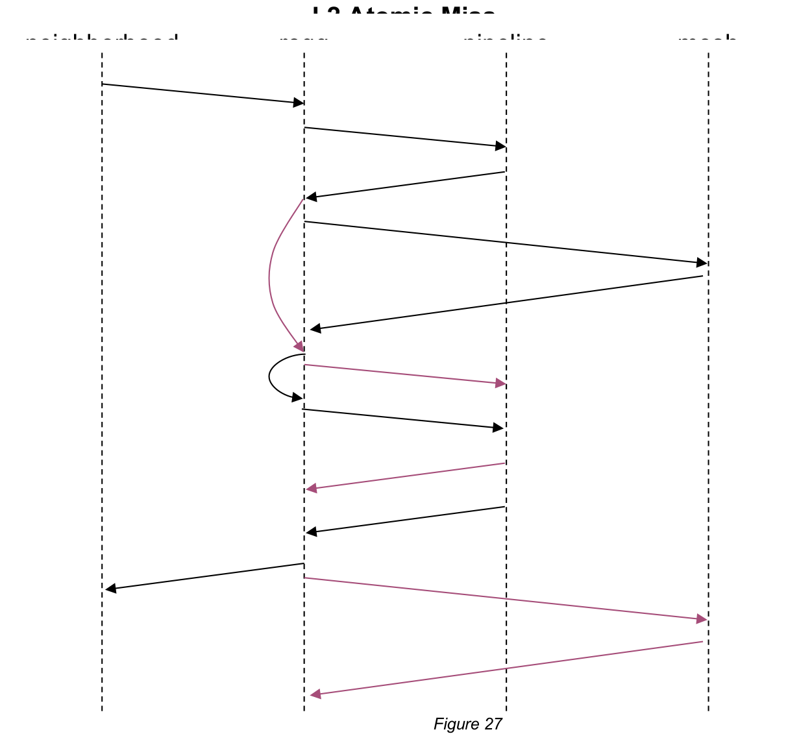


_Figure 27_ 


The sequence below shows the transactions if the atomic hits a partial. In this case, the partial data is evicted to the next-level cache and then read back. The write to the next-level cache and the subsequent read are initiated by the primary reqq entry. However, the data is stored into the paired entry’s dataq_id. The paired entry initiates the fill, and the primary reqq entry with the atomic will be scheduled immediately after the fill, guaranteeing a hit. 


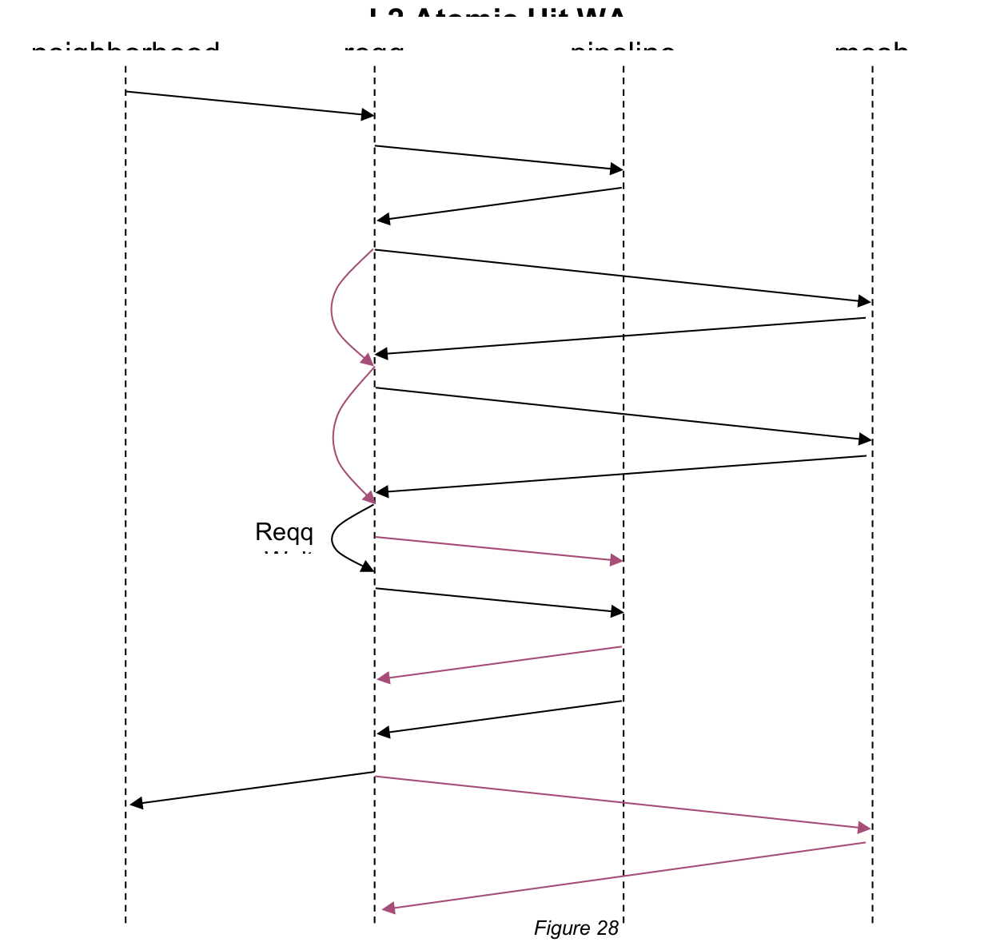


_Figure 28_ 


The atomic hit partial case causes some hardware complexity because it is the only case where the pipeline victim data response is written into a different dataq entry than the reqq entry that caused the victim. To handle this case, the pipeline will give an indication of the next data response that it will create one cycle early. The reqq will use this one cycle to determine if there are any data response modifications that need to be made before the response goes to the dataq or mesh. In this case, the secondary reqq_id should be used instead of the primary one for dataq victim storage. 

#### 3.7.2 L3 REQ_Atomic 

L3 atomics are supported by the Shire Cache. However, the system-level implementation for L3 atomics is interesting due to AXI limitations. The RISC-V atomics send 32, 64, or 256 bits of data and expect the same amount of data in the response. AXI does not have a transaction type that sends data in both directions. Therefore, system-level support for L3 atomics is implemented through using AXI writes. Atomic requests come across as an AXI write on the to_l3 mesh layer that was initiated by the UC block in the requesting Shire. The atomic response is returned as an AXI write back to the requesting Shire’s UC 


block on the to_sys mesh layer. More details regarding how all of the system-level pieces work together are provided in the document. 

The documentation below covers the Shire Cache portion of the L3 implementation. The Atomic request arrives from the L3_slave. An AXI write Acknowledge without any data is immediately sent back to the L3 slave. The Shire Cache will then perform the atomic and initiate another request to the to_sys layer with the response. 

The atomic received from the l3_slave contains the atomic operand data in bits [255:0]. Data[262:256] contains the atomic conf, which indicates the specifics of which atomic operation should be performed and Data[268:263] contains the line offset address[5:0], indicating the part of the cache line where the operation should be performed. So far, this description is the same as the one for L2 atomics. However, L3 atomics contain additional information. Data [281:277] contains the Atomic Request Transaction Id and Data[276:269] contains the Source Shire Id, indicating which Shire made the atomic request. This additional routing information is used to send the response back to the requesting Shire and to allow the requesting Shire to pair the response back up with the original request. 

The following diagram shows the process for L3 atomic hits: 


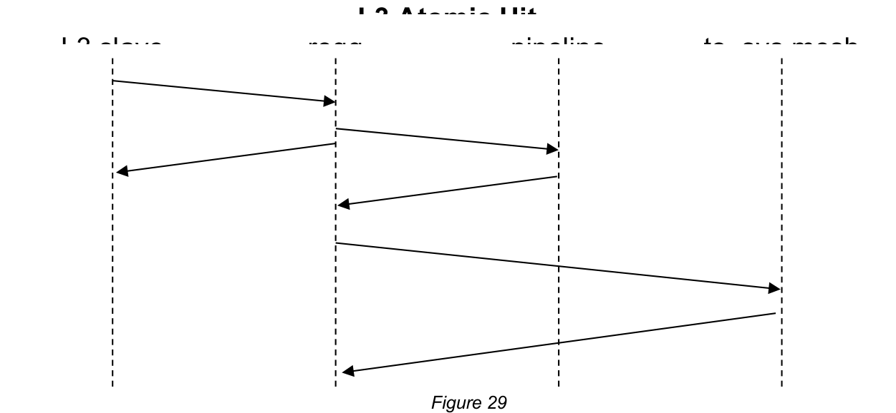


_Figure 29_ 


The following diagram shows the process for L3 atomic misses: 


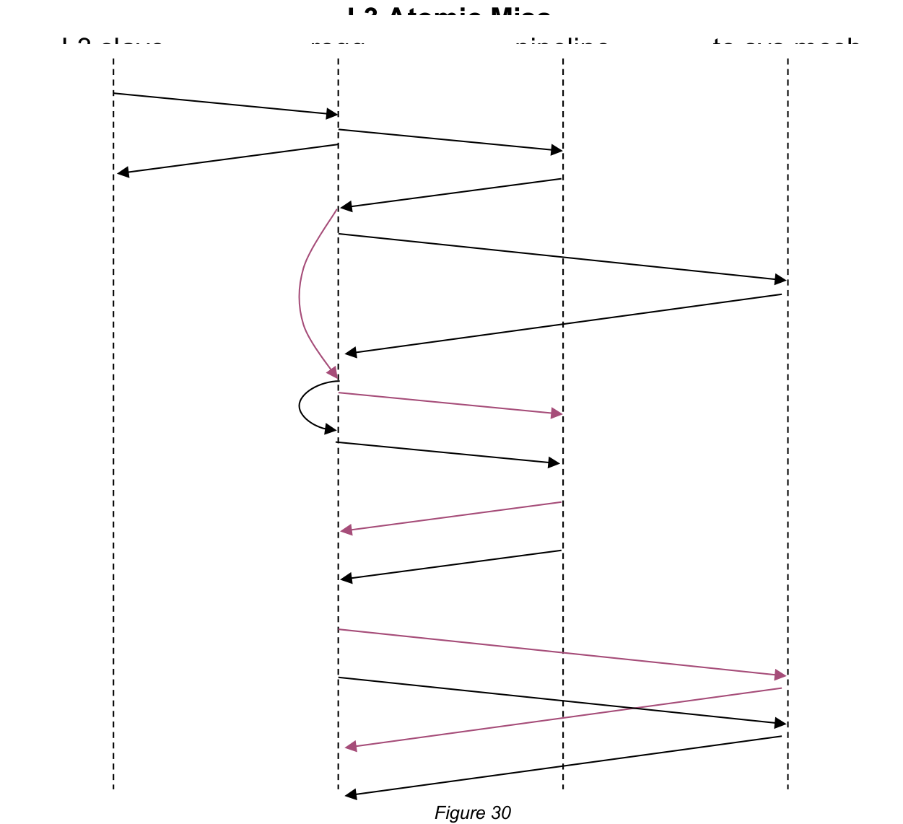


_Figure 30_ 


The state list for an L3 atomic hit partial is shown below. It looks just like the L2 atomic hit partial with the following changes: the request to the L3_slave is sent back immediately, and after the atomic completes, there is an AtomicRsp sent to the AXI write to_sys. 


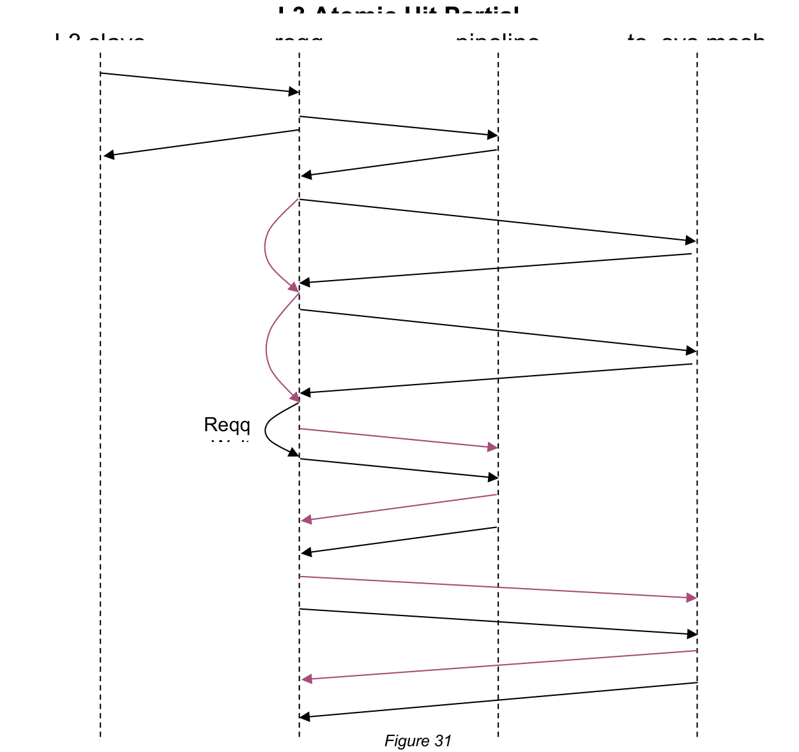


_Figure 31_ 


###### **Errors** 

If the L3 region is bypassed, the error is sent back as an error on the Atomic Acknowledge. If the L3 region (or SCP region) does not exist, the Acknowledge response has already been sent and the error can’t be sent with the AXI ESR write because a Write Error opcode is not yet supported. A normal atomic ESR write occurs with uncomputed results, and we rely on the error being reported as an interrupt. 

### 3.8 Atomic (with NEMI) 

#### 3.8.1 L2 REQ_Atomic 

This atomic is exactly the same as the ET-SOC1 L2 atomic above. 


#### 3.8.2 L3 REQ_Atomic from Neighborhood (Atomic Forwarding) 

An L3 atomic can be initiated by the Neighborhoods and goes to the L3 when the conf indicates that it is a global atomic. This atomic is forwarded by L2 directly to the to_l3 mesh. 

#### 3.8.3 L3 REQ_Atomic 

The atomic received from the l3_slave contains the atomic operand data in bits [255:0]. Data[262:256] contains the atomic conf, which indicates the specifics of which atomic operation should be performed and Data[268:263] contains the line offset address[5:0], indicating the part of the cache line where the operation should be performed. 

The diagrams below show the L3 atomic progression.  Note that these are the same as the L2 handling of atomics. 

The following diagram shows the process for L3 atomic hits: 


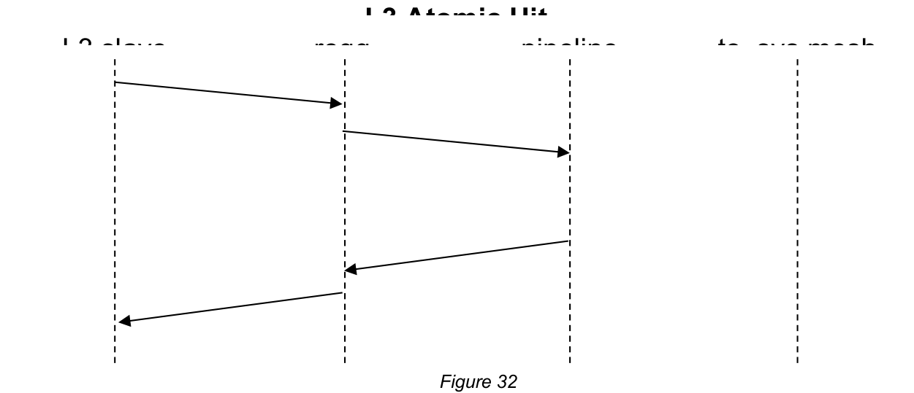


_Figure 32_ 


The following diagram shows the process for L3 atomic misses: 


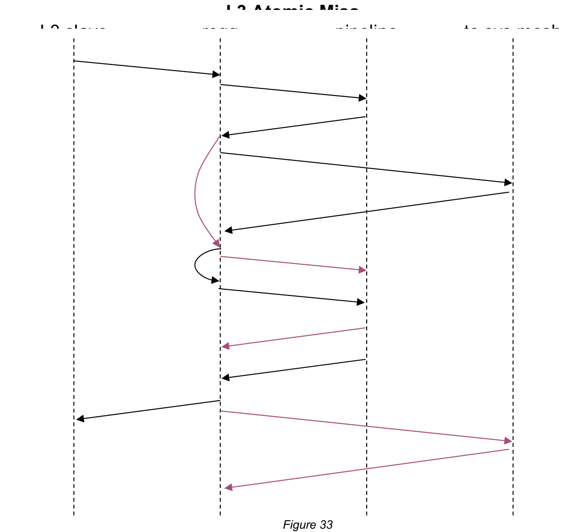


_Figure 33_ 


The following diagram shows the process for L3 atomic hit parial: 


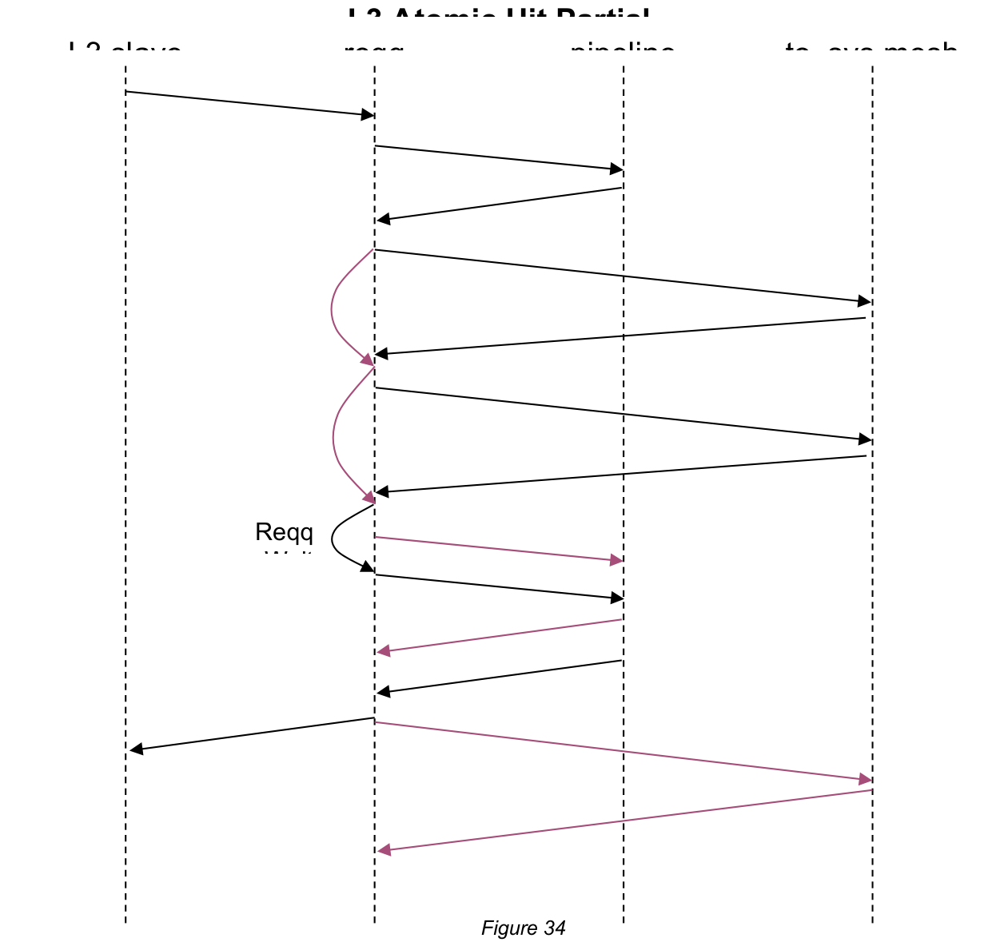


_Figure 34_ 


###### **Errors** 

If the L3 region is bypassed or if the L3 region (or SCP region) does not exist, the Acknowledge response will indicate an error. 

### 3.9 REQ_Lock 

Minions can lock a line in the cache with a ‘lock’ CacheOp to a Physical Address. REQ_Locks only operate on L2. 

If the line is already in the cache, the line gets locked and the zero bit gets set in the tag state. If the line is not in the cache, then the line is installed without a fill, locked, and the zero bit is set. Any resulting victim is evicted and written back if dirty. 


It is software’s responsibility to ensure that not all ways in a given set are locked (otherwise the L2 part of the cache would livelock). If SW attempts to lock the final way, an error status is returned and the line is not installed in the L2. 

Once the line is locked, its ‘lock’ bit is set and the line will never be evicted or written back. Evict/flush operations on a locked line act as if the line is a miss in the cache. The line stays locked. 

The cache does not allow for all four ways to be locked. If three ways are already locked and an attempt is made to lock the fourth way, the lock will be ignored and an error will be generated. 

#### 3.9.1 REQ_Unlock 

The unlock operation undoes the effect of a lock. The unlock operation can further choose between keeping the line valid or making the unlocked line invalid. Neither version of ‘unlock’ generates a victim. 

If the Physical Address is not in the cache, the unlock has no effect. If the address is in the cache, the unlock bit is cleared and the line is either left in the cache or invalidated, depending upon whether the unlock has chosen to invalidate the line. 

### 3.10 REQ_Flush and REQ_FlushToMem 

Minions can force a flush of a particular address. Flushes write dirty data to the next level of the cache hierarchy and clear the dirty bit. The line is left clean in the current cache. Flushes have a start level and a destination level. The start level is L1, L2, or L3, while the destination level is L2, L3, or Mem. 

The Shire Cache expects to see flushes with a destination level of L3 or Mem for flush requests from the Neighborhoods and destinations of Mem for flush requests from l3_slave. If the L1 has a flush to L2, the Shire Cache would expect to see dirty data come to the cache as a write. Similarly, if the destination level is L3, then the L2-level cache will send a write of dirty data to L3. Only if the destination level is Mem would L2 send a Flush on to L3. 

An incoming Flush will either be sent down the pipeline or to the mesh, depending on the start level. For example, if the L2 receives a flush from L3 to Mem request from the Neighborhoods, then it will send that request to the to_l3 mesh and on to the next-level cache. 

A flush from L2 that goes down the pipeline will generate write back data if there is dirty data in the cache. That dirty data will then be sent to the L3 mesh as either a write or a FlushToMem request, depending upon the flush destination level. If the destination level is L3, then the dirty data is sent back as a write. If the Flush destination level is Mem, then the dirty data will be sent to L3 as a FlushToMem. A FlushToMem is a flush to destination Mem with dirty data. The dirty data is first merged with any other dirty data in the L3, and then the line is flushed to Mem. 

Below is a table containing the expected traffic at each mesh layer, depending upon the flush start and end levels and whether there was dirty data in the cache. 


||**To_L2 Requests**<br>**Generated by Neigh **|**To_L3 Requests**<br>**Generated by L2**|**To_sys Requests**<br>**Generated by L3**|
|---|---|---|---|
|Flush L1 → L2|REQ_Write (if data is<br>dirty in L1)|||
|Flush L1 → L3|REQ_Write (if data is<br>dirty in L1), followed by<br>REQ_Flush L1 → L3|If L2 data is dirty:<br>REQ_Write<br>else:<br>nothing||
|Flush L2 → L3|REQ_Flush L2 → L3|If L2 data is dirty:<br>REQ_Write<br>else:<br>nothing||
|Flush L1 → Mem|REQ_Write (if data is<br>dirty in L1), followed by<br>REQ_Flush L1 → Mem|If L2 data is dirty:<br>REQ_FlushToMem<br>else:<br>REQ_Flush L1 → Mem|If L3 data is dirty:<br>REQ_Write<br>else:<br>nothing|
|Flush L2 → Mem|REQ_Flush L2 → Mem|If L2 data is dirty:<br>REQ_FlushToMem<br>else:<br>REQ_Flush L2 → Mem|If L3 data is dirty:<br>REQ_Write<br>else:<br>nothing|
|Flush L3 → Mem|REQ_Flush L3 → Mem|REQ_Flush L3 → Mem|If L3 data is dirty:<br>REQ_Write<br>else:<br>nothing|


_Table 16_ 

It is important to note that all requests from the clients will send back a response, either in the form of the requested data, an acknowledgement, or an error. This implies that operations that involve higher levels of memory hierarchy do not send the reply until the corresponding confirmation from the higher level of memory is received. 

#### 3.10.1 L2 REQ_Flush 

The diagram below shows the Flush Hit Clean case. This is identical to the Flush Miss case. 


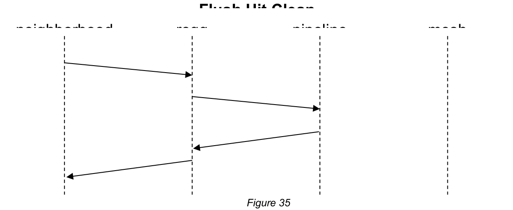


_Figure 35_ 


The diagram below shows the Flush Hit Dirty case with L3 as the destination. The response to the Neighborhood comes back after the mesh response is received. 


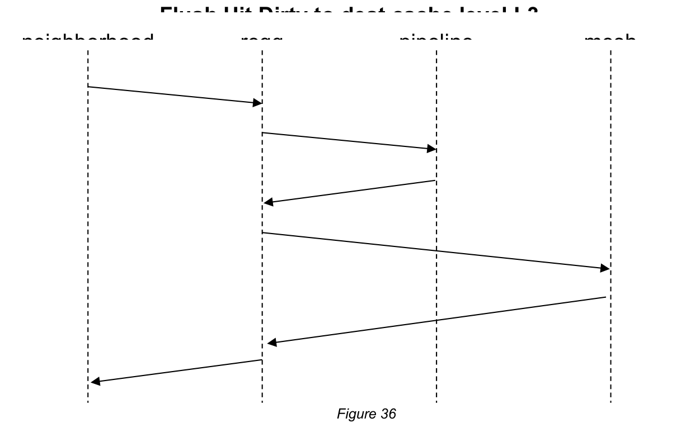


_Figure 36_ 


The diagram below shows the Flush Hit Dirty case with Mem as the destination. In this case, the dirty data is sent to the L3 cache with the FlushToMem request. 


**Flush Hit Dirty to dest cache level Mem** 


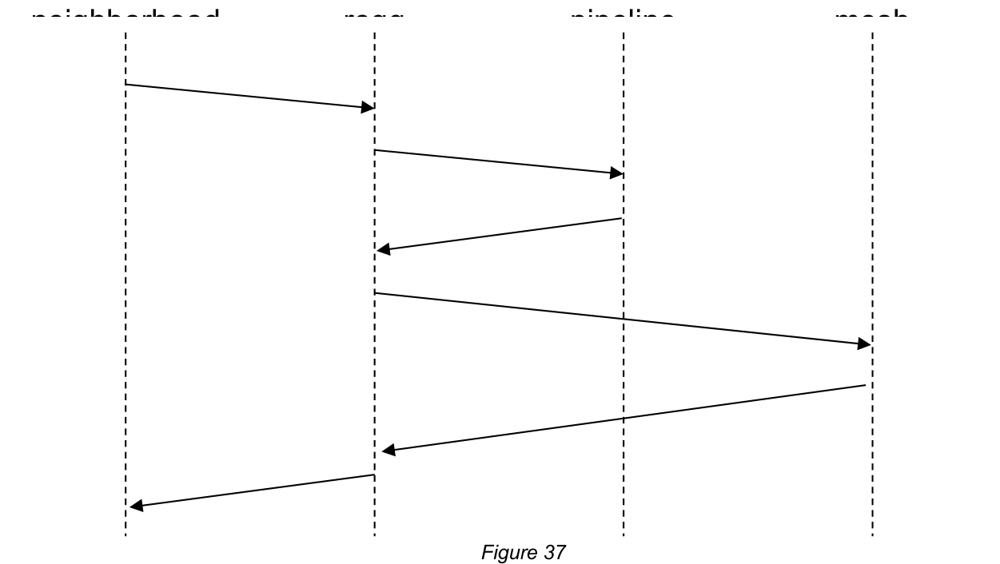


_Figure 37_ 


Finally, the diagram below shows a flush from L3 to Mem. In this case, the request just gets forwarded to the L3 cache. 


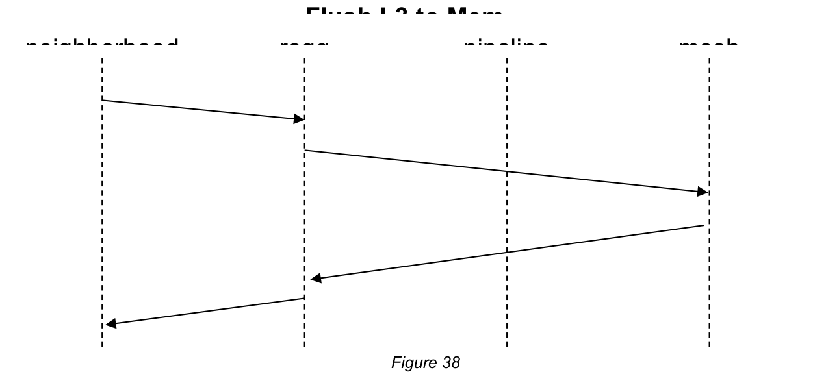


_Figure 38_ 


Note that if a Flush hits a partial line, there is no way to keep a clean partial line in the cache. The cache will thus not keep the line (the line is invalidated). 

#### 3.10.2 L3 REQ_Flush and REQ_FlushToMem 

REQ_Flush operations from l3_slave to L3 operate just like L2 REQ_Flush except that the mesh Write is directed to the to_sys mesh. 


REQ_FlushToMem operations are a flush accompanied by dirty data. Note that the dirty data may be partial if the flush was a partial line in L2. In either case, the REQ_FlushToMem sends the dirty data down the pipeline first to merge with any data in the L3. The merged dirty data is then written to the to_sys mesh. Note that the L3 will always have dirty data because dirty data comes with the FlushToMem, so there will always be a write to the to_sys mesh port. 


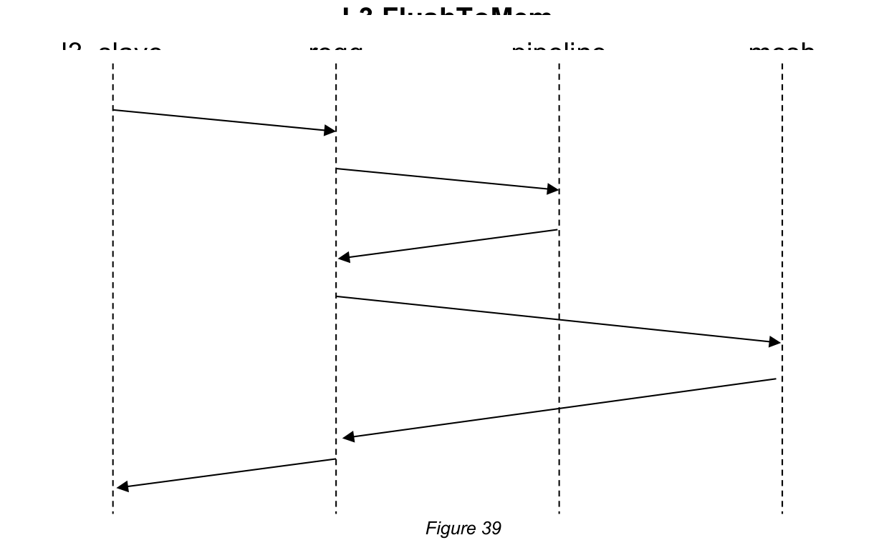


_Figure 39_ 


Note that FlushToMems that hit a clean valid line will write the dirty quad words to the to_sys mesh and keep the line clean. 

FlushToMems that hit an existing partial line will update the newly dirty quad words and quad word enables. If the line is still partial after the merge (not all qwens are set), then the line is invalidated (there is no way to keep a clean partial line in the cache). If the merged qwens cause the line to be fully dirty, the full line will be written to to_sys and the line will be kept clean. 

### 3.11 REQ_Evict and REQ_EvictToMem 

Evicts write dirty data to the next level of the cache hierarchy and clear the valid bit. The line is invalidated in the current cache. Evicts have a start level and destination level. The start level is L1, L2, or L3, while the destination level is L2, L3, or Mem. 

The Shire Cache treats flushes and evicts the same, except: evicts invalidate the line and, for flushes, the Shire Cache tries to keep a clean copy of the line. The table below depicts the expected traffic for Evicts. It is essentially a copy of the Flush table with “Flush” replaced with “Evict”. For more details on specific cases, see the <u>Flush section.</u> 


||**To_L2 Requests**<br>**Generated by Neigh **|**To_L3 Requests**<br>**Generated by L2**|**To_sys Requests**<br>**Generated by L3**|
|---|---|---|---|
|Evict L1 → L2|REQ_Write (if data is<br>dirty in L1)|||
|Evict L1 → L3|REQ_Write (if data is<br>dirty in L1), followed by<br>REQ_Evict L1 → L3|If L2 data is dirty:<br>REQ_Write<br>else:<br>nothing||
|Evict L2 → L3|REQ_Evict L2 → L3|If L2 dirty data is dirty:<br>REQ_Write<br>else:<br>nothing||
|Evict L1 → Mem|REQ_Write (if data is<br>dirty in L1), followed by<br>REQ_Evict L1 → Mem|If L2 data is dirty:<br>REQ_EvictToMem<br>else:<br>REQ_Evict L1 → Mem|If L3 data is dirty:<br>REQ_Write<br>else:<br>nothing|
|Evict L2 → Mem|REQ_Evict L2 → Mem|If L2 data is dirty:<br>REQ_EvictToMem<br>else:<br>REQ_Evict L2 → Mem|If L3 data is dirty:<br>REQ_Write<br>else:<br>nothing|
|Evict L3 → Mem|REQ_Evict L3 → Mem|REQ_Evict L3 → Mem|If L3 data is dirty:<br>REQ_Write<br>else:<br>nothing|


_Table 17_ 

### 3.12 REQ_Prefetch 

The Prefetch operation allows for a line to be prefetched to a specified cache level. The Prefetch can prefetch to L2, L3, or Mem. The table below shows the mesh requests that are expected at each cache level based upon the Prefetch type. 

||**To_L2 Requests**<br>**Generated by Neigh **|**To_L3 Requests**<br>**Generated by L2**|**To_sys Requests**<br>**Generated by L3**|
|---|---|---|---|
|**Prefetch L1**|REQ_Read|||
|**Prefetch L2**|REQ_Prefetch L2|If not already in cache:<br>REQ_Read||
|**Prefetch L3**|REQ_Prefetch L3|REQ_Prefetch L3|If not already in cache:<br>REQ_Read|


|**Prefetch Mem**|REQ_Prefetch Mem||
|---|---|---|
||(noop it gets an Ack,|no|
||mesh requests)||
|||_Table 18_|


#### 3.12.1 L2 REQ_Prefetch 

If the address is a miss, then the request goes out to the mesh as a read, down the pipe as a fill, and may generate a victim. The response back to the Neighborhood is an Ack without data and can go back when the Fill is selected for the pipeline. 


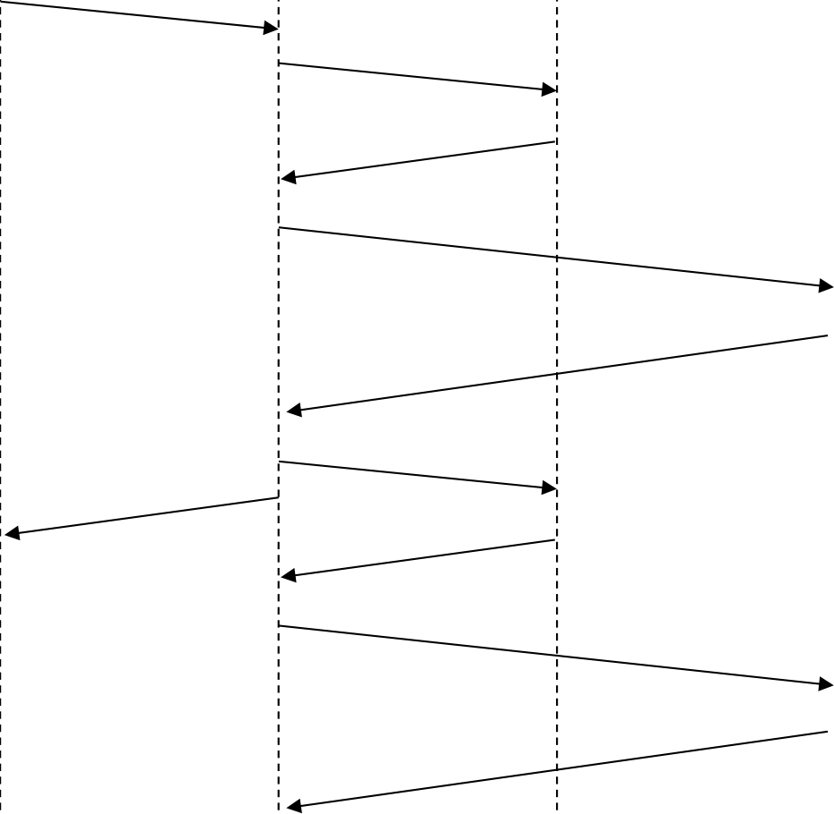


_Figure 40_ 


If the address is a partial hit, then we need to Evict the line to L3 before reading it back. 


**Prefetch Hit Partial** 


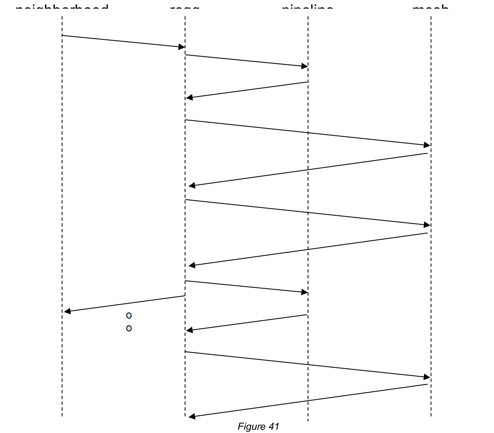


_Figure 41_ 


If the Prefetch from the Neighborhoods is targeting the L3 cache, then the prefetch is sent to the to_l3 mesh. The diagram below demonstrates this case. 


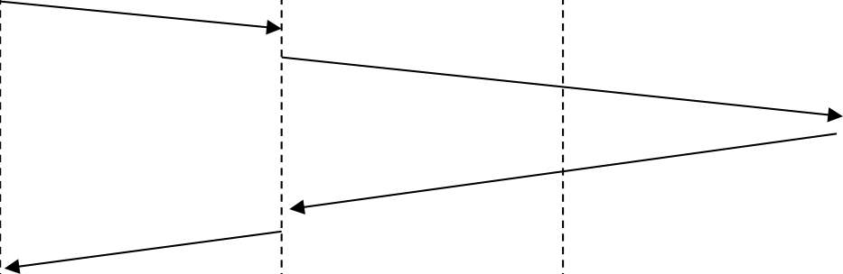


_Figure 42_ 

#### 3.12.2 L3 REQ_Prefetch 

L3 Pretches received from the l3_slave are assumed to always operate on the L3 cache. There is no cache level associated with them. Therefore, L3 Prefetches are always sent to the pipe and are either a hit, miss, or hit partial. All three cases are handled in the same way as their L2 equivalents. 

### 3.13 REQ_ScpFill 

An ScpFill request can come from the Neighborhoods. The L3 will not receive ScpFills. 

The ScpFill is used to copy data from L3 to the Scratchpad. The ScpFill request comes with a source PA address and a dest PA address. The source PA is sent to L2 in the data bits 39:6. The destination PA in the request address field should be a Scratchpad address in the current Shire and bank. An error is signaled if the destination address is not in the Scratchpad space or the current Shire and bank, or if it is outside the SCP space allocated in the RAMs. 

The Shire Cache requests the source PA cache line from L3 or a remote SCP. Note that the L2 is not accessed. If there is dirty data in the L2, the Scratchpad Fill will not be aware of this. Also, no address ordering checks are conducted for the source read address. Therefore, the Scratchpad Fill source address can be outstanding on the mesh while other requests to the same address are in-flight. Results will thus be unpredictable. 


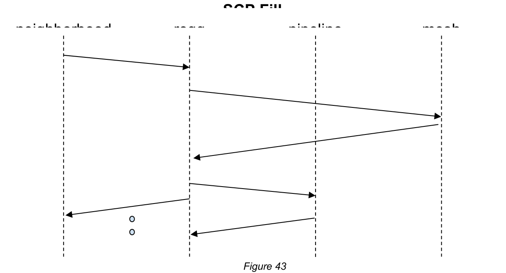


_Figure 43_ 


For Scratchpad operations, there are no victims. 


### 3.14 Index CacheOps 

The L2 pipeline has an index CacheOp state machine that can be used to quickly operate over an entire cache region (L2, L3, or SCP) or over the entire tag_state RAM for very quick power-up tag state initialization (All_Inv operation). The All_Inv operation is started about 256 clocks after a reset. This delay is to check for a BIST operation. If a BIST operation is detected, the All_Inv power-up tag state initialization is disabled. 

CacheOps operate as an index into the cache. The following commands are supported by the pipeline for index-based cache operations: 

|`●`<br>|`SC_Idx_Read               // read`|`tag state, tag, and data RAMs at index`|
|---|---|---|
|`●`<br>|`SC_Idx_Write              // write`|`tag state, tag, and data RAMs at index`|
|`●`<br>|`SC_Idx_All_Inv            // invalidate`|`entire tag_state RAM`|
|`●`<br>|`SC_Idx_L2_Inv             // invalidate`|`L2  space based on index`|
|`●`<br>|`SC_Idx_L2_Flush           // flush`|`L2  space based on index`|
|`●`<br>|`SC_Idx_L2_Evict           // evict`|`L2  space based on index`|
|`●`<br>|`SC_Idx_L3_Inv             // invalidate`|`L3  space based on index`|
|`●`<br>|`SC_Idx_L3_Flush           // flush`|`L3  space based on index`|
|`●`<br>|`SC_Idx_L3_Evict           // evict`|`L3  space based on index`|


The following command is used between the CacheOp state machine and the reqq to guarantee that all previous cache operations have completed: 

● `SC_Sync                   // reqq only request from CacheOp state machine` 

The diagram below shows how the address for the index cache operation is decoded for a 4M, 4-way, 4- sub-bank, 4-bank build configuration. The index is defined as the {physical_set, way, sub_bank, bank}, as shown below. The physical set is the index (set) within the cache region plus the cache base specified by the associated esr_sc_l2_set_base, esr_sc_l3_set_base, or esr_sc_scp_set_base. 

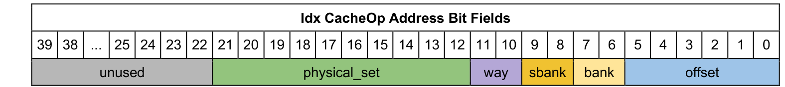


Requests from the index CacheOp state machine are made to the reqq using the following signals: 

```
   output logic                                   pipe_idx_cop_l2_busy,
   output logic                                   pipe_idx_cop_l3_busy,
   input  logic                                   pipe_idx_cop_req_ready,
   output logic                                   pipe_idx_cop_req_valid,
   output sc_pipe_idx_cop_req_t                   pipe_idx_cop_req_info,
```

The CacheOp state machine indicates that it is ready to start making requests targeting either the L2 or L3 space by setting the associated busy signal. For SCP operations, both busy signals are set. If the busy signal is set, the reqq must hold off any new incoming requests and wait until all current requests have completed. The reqq can then issue the index CacheOps in succession. While the requests from the idx_cop_sm are being processed and the associated busy signal is set, the reqq should continue to hold off any L2 or L3 requests. After the last CacheOp has completed, the state machine will send a SC_Sync. The reqq should not accept the SC_Sync with req_ready until all previous CacheOps have completed and have received their respective responses. 


The L2* and L3* CacheOps will be issued for the entire range of the cache configuration, as specified by the ESRs (base + size) of their respective regions. 

- The L2_Idx_Inv and L3_Idx_Inv operations invalidate the line and do not write back dirty data 

- The L2_Idx_Flush and L3_Idx_Flush operations write back dirty data and keep the line in the cache 

- The L2_Idx_Evict and L3_Idx_Evict operations write back dirty data and invalidate the line in the cache 

Unlike the address-based operations, L2_Idx_Inv and L2_Idx_Flush perform their respective operations independent of the locked bit. An L2_Idx_Flush that hits a locked line will write back the dirty data and keep the line valid and locked in the cache. An L2_Idx_Evict that hits a locked line will write back the dirty data and invalidate the line. 

The L2_Idx_* operations have the unfortunate effect of clearing any Read buffer or Coalescing buffer entry that is hit by the operation. 

The Idx_All_Inv operation cycles through the entire physical tag_state RAM and writes zeros to all the ways in one cycle to speed up the power-up cache initialization time. It does not read the tag_state RAM, so no Single-Bit or Double-Bit Errors (SBE/DBEs) of the tag_state RAM will occur. This operation is only expected at power-up to initialize the tag_state RAM, or when major cache configuration changes are made and no other operations are in process. This operation should be performed under the control of the Service Processor or the single thread process in charge of the boot/config code. Since the Idx_All_Inv operation can be used for a cache reconfiguration, it also sends a signal to both the Read buffer and the Coalescing buffer to invalidate all of their entries. 

The CacheOp state machine can also be programmed to invalidate the Coalescing buffer. It will traverse the Coalescing buffer and send an L2_Evict for any valid entry, followed by an SC_Sync to complete the operation. The L2_busy signal is not used for a Coalescing buffer invalidate operation. 

The CacheOp state machine can also be programmed to zero the SCP cache region. Both the L2_busy and L3_busy signals are set for this operation. The CacheOp state machine sends Scp_Zero opcodes to the entire SCP cache region that write zeros to the full cache lines of all SCP indexes. This operation does not affect the tag_state or tag RAMs since the SCP cache region does not use the tag_state or tag RAMs. 

Lastly, the CacheOp state machine can be used for single-access Dbg_Read/Dbg_Write operations through an ESR interface. In the next section, this will be described along with how the ESRs are used to operate the CacheOp state machine. 

#### 3.14.1 Index CacheOp ESR Interface 

The index CacheOp state machine is controlled through five ESR registers, defined below: 

1. esr_sc_idx_cop_sm_ctl, esr_sc_idx_cop_sm_ctl_user 

2. esr_sc_idx_cop_sm_physical_index 

3. esr_sc_idx_cop_sm_data0 


4. esr_sc_idx_cop_sm_data1 

5. esr_sc_idx_cop_sm_ecc 

##### 3.14.1.1 esr_sc_idx_cop_sm_ctl and esr_sc_idx_cop_sm_ctl_user 

The index CacheOp state machine control register controls the index CacheOp state machine. The fields of this register are as follows: 

- idx_cop_sm_state (read-only field): current state of the index CacheOp state machine (see the table below the ESRs for decoding) 

- lr = logical_ram: defines which logical RAM to read/write on Dbg_Read/Dbg_Write commands (0 = tag_state, 1 = tag, 2 = data); only used for Dbg_Read/Dbg_Write commands 

- <mark>e = ecc_wr_en</mark> : defines source of ECC data on Dbg_Write (0 = allows hardware to generate the ECC field, 1 = uses ECC from the esr_sc_idx_cop_sm_ecc register for the ECC field); only used for Dbg_Write commands 

- opcode: specifies the index CacheOp state machine opcode to execute (see the table below the ESRs for decoding) 

- a = abort: writing a ‘1’ to this bit aborts the operation (always reads back as zero); if writing both a = 1 and go = 1, the abort will take precedence, meaning that, it will either not start the machine or will abort the current operation 

- go = go: writing a ‘1’ to this bit starts the operation (always reads back as zero); if a ‘1’ is written while the state machine is not idle, it is ignored 

NOTE: The esr_sc_idx_cop_sm_ctl_user register is “user-mode” accessible; however, only opcode==CB_Inv is permitted to allow user-mode Coalescing buffer flush operations to improve performance. All other opcodes that attempt to start from this user-mode register will be silently ignored. This user-mode register has read privileges that allow it to access idx_cop_sm_state. The control bit esr_sc_idx_cop_sm_ctl_user_en defaults to ‘1’ to allow this user register to be functional. If desired, the boot code with machine privilege can set the esr_sc_idx_cop_sm_ctl_user_en to ‘0’ and all writes to this register will be ignored and all reads will return zero. The esr_sc_idx_cop_sm_ctl_user register can only start a CB_Inv operation; it cannot abort any operation. Abort requests can only be issued from the esr_sc_idx_cop_sm_ctl register. 


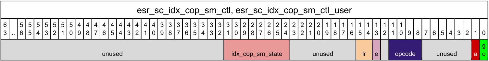


The following table defines the CacheOp state machine opcode: 


|**Opcode**|**Val**|<br>**Operation Performed**|
|---|---|---|
|All_Inv|0|Invalidates all physical tag_state addresses (does not write tag or data RAM)|
|L2_Inv|1|Invalidates all L2 indexes|
|L2_Flush|2|Flushes all L2 indexes|
|L2_Evict|3|Evicts all L2 indexes|
|L3_Inv|4|Invalidates all L3 indexes|
|L3_Flush|5|Flushes all L3 indexes|
|L3_Evict|6|Evicts all L3 indexes|
|Dbg_Read|7|Places results of a single Dbg_Read at esr_sc_idx_cop_sm_physical_index of<br>esr_sc_idx_cop_sm_ctl.lr (logical_ram) into the esr_sc_idx_cop_sm_(data0/data1/ecc)<br>registers|
|Dbg_Write|8|Uses the values of the esr_sc_idx_cop_sm_(data0/data1/ecc) registers to generate a<br>single Dbg_Write at esr_sc_idx_cop_sm_physical_index of esr_sc_idx_cop_sm_ctl.lr<br>(logical_ram)|
|Scp_Zero|9|Zeros the data in the Scratchpad RAM|
|CB_Inv|10|Coalescing buffer invalidate - sends an L2_evict to the address of any valid entry of<br>the Coalescing buffer. NOTE: this is the only operation allowed for<br>esr_sc_idx_cop_sm_ctl_user|
|||_Table 19_|


The following table defines the CacheOp state machine current state: 

|**idx_cop_sm_state**|**Val**|<br>**Current State of the CacheOp State Machine**|
|---|---|---|
|RESET|1|Reset state|
|ALL_INV|2|Indicates the state machine is currently executing an All_Inv cmd|
|IDLE|4|Indicates the state machine is idle (any previous command has completed)|
|ACTIVE|8|<sup>Indicates the state machine is currently executing one of the following cmds: L2_Inv,</sup><br>L2_Flush, L2_Evict, L3_Inv, L3_Flush, or L3_Evict|
|CB_INV|16|Indicates the state machine is currently executing a CB_Inv cmd|
|DBG|32|<sup>Indicates the state machine is currently executing one of the following cmds:</sup><br>Dbg_Read or Dbg_Write|
|SYNC|64|Indicates the state machine is waiting for the Sync acknowledgement from the reqq<br>_Table 20_|


##### 3.14.1.2 esr_sc_idx_cop_sm_physical_index 

The index CacheOp state machine physical index register defines the physical index into the logical RAM for Dbg_Read/Dbg_Write operations; only used for Dbg_Read/Dbg_Write commands 

The fields of this register are as follows: 


- physical_set = physical set to read/write within the physical RAM. The physical set is the index (set) within the cache region plus the cache base specified by the associated esr_sc_l2_set_base, esr_sc_l3_set_base, or esr_sc_scp_set_base (the number of implemented ESR set bits of the set field is based on the depth of the physical RAM for the configuration; set bits that exceed the number of physical sets will not be implemented in this register and will read back as zero). 

- way = way to read/write 

- sbank = sub_bank to read/write (the number of implemented ESR sbank bits of the sbank field is based on the physical number of sub_banks for the configuration; for instance, in the case of four sub_bank configs, only two bits, sbank[1:0], are implemented and sbank[2] will read back as zero). 

- qw = qword of data to read (only used for logical_ram = data) 


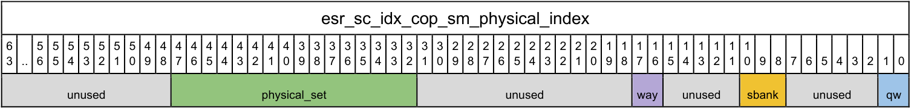


##### 3.14.1.3 esr_sc_idx_cop_sm_data0 and esr_sc_idx_cop_sm_data1 

The index CacheOp state machine data register holds the read data of the Dbg_Read operation or the write data to use for the Dbg_Write operation; these fields are logical RAM specific and only used for Dbg_Read/Dbg_Write commands. 

tag_state fields (all ways are read/written on the same DBG operation): 

- space = read-only field indicating the address space that was hit by the physical_set (0=L2, 1=L3, 2=SCP, 3-7=unused) 

- tag state ways (3:0) matching colors of the tag -> v=valid, l=locked, z=zero, qwen=qword enables (indicating dirty qwords) 

- lru_state = 5-bit LRU state for the set. Encoding for the lru_state is shown in the following table: 

|**lru_state (binary)**|**lru_state (hex)**|**MRU**<br>**Way**|||**LRU**<br>**Way**|
|---|---|---|---|---|---|
|5'b00100|0x04|3|2|1|0|
|5'b10100|0x14|2|3|1|0|
|5'b00001|0x01|3|2|0|1|
|5'b10001|0x11|2|3|0|1|
|5'b01000|0x08|3|1|2|0|
|5'b11000|0x18|1|3|2|0|
|5'b00010|0x02|3|1|0|2|
|5'b10010|0x12|1|3|0|2|
|5'b01100|0x0c|2|1|3|0|
|5'b11100|0x1c|1|2|3|0|
|5'b00011|0x03|2|1|0|3|
|5'b10011|0x13|1|2|0|3|
|5'b01001|0x09|3|0|2|1|
|5'b11001|0x19|0|3|2|1|
|5'b00110|0x06|3|0|1|2|
|5'b10110|0x16|0|3|1|2|
|5'b01101|0x0d|2|0|3|1|
|5'b11101|0x1d|0|2|3|1|
|5'b00111|0x07|2|0|1|3|
|5'b10111|0x17|0|2|1|3|
|5'b01110|0x0e|1|0|3|2|
|5'b11110|0x1e|0|1|3|2|
|5'b01011|0x0b|1|0|2|3|
|5'b11011|0x1b|0|1|2|3|


_Table 21_ 

tag fields (all ways are read/written on the same DBG operation): 

- tag_way_(3:0): tag for way (3:0) respectively; tags for all ways are read/written simultaneously 

data fields (only the qword is specified by the Physical Index [set, way, sub_bank, qword] are read/written on the DBG operation): 

- data_qwX_dw0: data for dword0 of the qword specified by the _qw_ field in esr_sc_idx_cop_sm_physical_index.qw 

- data_qwX_dw1: data for dword1 of the qword specified by the _qw_ field in esr_sc_idx_cop_sm_physical_index.qw 


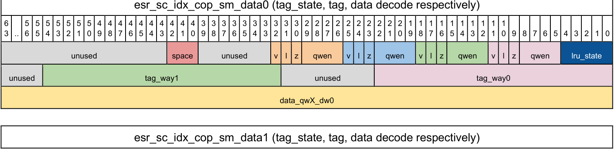


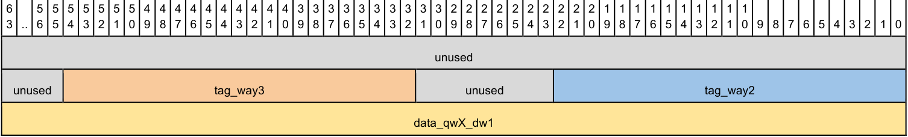


##### 3.14.1.4 esr_sc_idx_cop_sm_ecc 

The index CacheOp state machine ECC register holds either the read ECC of the Dbg_Read operation or the write ECC to use for the Dbg_Write operation (if ecc_wr_en=1); these fields are logical RAM specific and only used for Dbg_Read/Dbg_Write commands. 


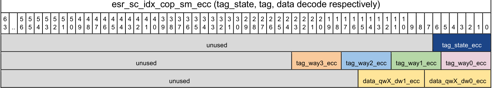


## 4 ESR Registers 

<mark>The following ESRs control the reqq behavior:</mark> 

- esr_sc_clk_gate_disable 

- esr_sc_axi_qos 

- esr_sc_cbuf_enable 

- esr_sc_remote_l3_enable 

- esr_sc_remote_scp_enable 

- esr_sc_l2_bypass 

- esr_sc_l3_bypass 

- esr_sc_num_l3_reqq_entries 

- esr_sc_reqq_no_link_list 

- esr_sc_ecc_scrub_enable 

- esr_sc_l3_yield_priority 

<mark>The following ESRs control the pipeline behavior:</mark> 

- esr_sc_l2_set_base 

- esr_sc_l2_set_size 

- esr_sc_l2_set_mask 

- esr_sc_l2_tag_mask 

- esr_sc_l3_set_base 

- esr_sc_l3_set_size 

- esr_sc_l3_set_mask 

- esr_sc_l3_tag_mask 

- esr_sc_scp_set_base 

- esr_sc_scp_set_size 

- esr_sc_scp_set_mask 

- esr_sc_scp_tag_mask 

- esr_two_shire_aliasing_use_shire_lsb ● esr_sc_all_shire_aliasing 

- esr_sc_sub_bank_sel_b2 

- esr_sc_sub_bank_sel_b1 

- esr_sc_sub_bank_sel_b0 

- esr_sc_bank_sel_b2 

- esr_sc_bank_sel_b1 

- esr_sc_bank_sel_b0 

- esr_sc_shire_sel_b5 

- esr_sc_shire_sel_b4 

- esr_sc_shire_sel_b3 

- esr_sc_shire_sel_b2 

- esr_sc_shire_sel_b1 

- esr_sc_shire_sel_b0 

- esr_sc_idx_cop_sm_ctl_user_en 


- esr_sc_ram_deep_sleep 

- esr_sc_ram_shut_down 

- esr_sc_ram_delay 

- esr_sc_l2_rbuf_enable 

- esr_sc_scp_rbuf_enable 

- esr_sc_zero_state_enable 

- esr_sc_allow_only_1_req_per_sub_bank ● esr_sc_allow_only_1_req_per_bank 

- esr_sc_cbuf_entry_enable 

The following ESRs are for the index CacheOp state machine: 

- esr_sc_idx_cop_sm_ctl 

- esr_sc_idx_cop_sm_ctl_user 

- esr_sc_idx_cop_sm_physical_index ● esr_sc_idx_cop_sm_data0 

- esr_sc_idx_cop_sm_data1 

- esr_sc_idx_cop_sm_ecc 

The following ESRs are for error logging: 

- esr_sc_err_rsp_enable 

- esr_sc_err_interrupt_enable 

- esr_sc_err_log_info 

- esr_sc_err_log_address 

The following ESRs are for reqq debug: 

- esr_sc_reqq_debug_ctl 

- esr_sc_reqq_debug2 

- esr_sc_reqq_debug1 

- esr_sc_reqq_debug0 

The following ESRs control UltraSoC trace message behavior: 

- esr_sc_trace_filter_address_enable 

- esr_sc_trace_filter_address_value 

- esr_sc_trace_filter_port_enable 

- esr_sc_trace_filter_port 

- esr_sc_trace_filter_source_enable 

- esr_sc_trace_filter_source 

- esr_sc_trace_filter_l2_enable 

- esr_sc_trace_filter_l3_enable 

- esr_sc_trace_filter_fsm_enable 

- esr_sc_trace_type_hot_enable 


The following ESR is used for the build configuration: 

● esr_shire_cache_build_config 

### 4.1 ESRs for Reqq Control 

###### **esr_sc_clk_gate_disable** 

This field provides bits to disable various module-level clock gaters in the shire_cache. Clock gaters are present in the design to reduce power while blocks are quiescent. If the clock gating logic is faulty, these bits can turn off the gaters. 

###### **esr_sc_axi_qos** 

If the request comes from L2 and this ESR is AXI_QOS_MEM_HIGH_PRIORITY, then the output QoS to the mesh will be: AXI_QOS_MEM_HIGH_PRIORITY, else AXI_QOS_MEM_LOW_PRIORITY. 

If the request comes from L3 and the incoming QoS from the L3 slave is 

AXI_QOS_MEM_HIGH_PRIORITY, then the output QoS to the next-level mesh will be: AXI_QOS_MEM_HIGH_PRIORITY, else AXI_QOS_MEM_LOW_PRIORITY. 

Atomic responses to the UC block ESRs via the to_sys mesh always have QoS AXI_QOS_ATOMIC_RSP. 

Index CacheOps get their QoS from this ESR as well. 

###### **esr_sc_cbuf_enable** 

This field enables the Coalescing buffer functionality. If the Coalescing buffer is not enabled, the reqq will send all Partial Write requests directly to the mesh. 

###### **esr_sc_remote_l3_enable** 

When this ESR is set, L3 requests from the L2 can be sent to the to_l3 mesh layer. 

When this ESR is clear, it forces all Neighborhood requests directed to an L3 address space (not SCP) to go directly to the to_sys port instead of the normal to_l3 port. This ESR is used for a system that does not support L3. The response from the to_sys port is returned back to the Neighborhood. 

For flushes and evicts, if the destination level is L3 or greater, then dirty L2 data must be sent on to the memory. Since an L3 read or write is directed to memory, the flush needs to have reached memory too. Note that memory only supports reads and writes, so memory will see a write if L2 had dirty data rather than a FlushToMem or EvictToMem. Flushes and evicts with a start level of L3 are NOPs since, again, memory only handles reads or writes. 

###### **esr_sc_remote_scp_enable** 

When this ESR is set, remote Scratchpad accesses can be sent to the to_l3 mesh layer. 


When this ESR is cleared, reads and writes to a remote Scratchpad region and ScpFill source PAs to a remote Scratchpad region are treated as NOPs and respond with an error back to the Neighborhood. 

###### **esr_sc_l2_bypass** 

When enabled, this ESR only affects L2 requests. The MsgSendData, local/remote SCP, index CacheOp, and L3 requests are not affected by this ESR. 

All L2 reads, writes, and writeArounds (and atomics with Nemi) are forwarded to the next level through the to_l3 port (or the to_sys port if esr_sc_remote_l3_enable == 0). 

L2 Cop Lock/Unlock are treated as a NOP and returned with a REP_Ack response L2 Cop Prefetch dest L2 and Cop Flush/Evict dest L3 are NOPs and returned with a REP_Ack response L2 Cop Prefetch dest L3/Mem and Cop Flush/Evict dest Mem are forwarded to the next level L2 Atomic is a NOP and returned with an error response (REP_ERR response or however it is defined) in ETSOC-1.  With Nemi, the atomic is forwarded on to L3. 

###### **esr_sc_l3_bypass** 

When enabled, this ESR only affects L3 requests. The remote SCP is not affected by it. 

All L3 reads and writes (full line or partial data) are forwarded to the next level through the to_sys port. 

L3 Cop Prefetch dest L3 are NOPs and returned with a REP_Ack response 

L3 Cop FlushToMem/EvictToMem are forwarded as a Write to the to_sys port 

L3 Atomic is an error response and there is no Atomic Response write phase in ETSOC-1.  With Nemi, the atomic is forwarded to memory. 

###### **esr_sc_num_l3_reqq_entries** 

This ESR specifies the number of reqq entries allocated for handling l3_slave requests. This register field is expected to be configured during power-up or when all reqq entries are deallocated and there are no new requests from the neigh or l3_slave. Given the total number of reqq entries, the remaining number of reqq entries that will be allocated for handling neigh requests can be determined. A minimum of two reqq entries have to be reserved for handling neigh requests. The l3_slave requests target an L3 address space or a remote SCP. The neigh requests target an L2 address space, the local SCP, index Cop, or MsgSendData. 

###### **esr_sc_reqq_no_link_list** _Reserved bit_ 

The original intent for this ESR was to throttle the reqq issuing the same address request to the pipeline in case there are issues with address ordering. It would allow us to continue issuing requests with different addresses to the pipeline. However, there is currently an issue with the ordering implementation of the link list where a victim is placed at the head of a regular request and the regular request delinks before the victim. Subsequent request allocating in the reqq thus encounters the missing regular request tail, resulting in an incorrect link list. The fix is to also check for victim-only tails, but the concern is that the additional logic will cause timing issues, and the fix is therefore not currently implemented. There are also risks associated with the additional logic potentially introducing other link list problems. 


Currently, this feature is not fully functional.  Instead the esr delays linked list dependency clearing.  When the esr is set to ‘1’ an instruction dependent upon another instruction will not be executed until the instruction ahead of it is completely finished and deallocated. 

###### **esr_sc_ecc_scrub_enable** 

###### _Reserved bit_ 

Future chips will implement this feature. Enables the reqq to schedule pipe scrub passes to fix 1-bit ECC errors.  This is implemented in Gepardo. 

If this bit is set and a single-bit ECC error is detected, then the reqq will schedule an ECC scrub pass through the pipeline. The ECC scrub is a read, fix, and write of the tag, tag state, and data RAMs. 

###### **esr_sc_l3_yield_priority_cnt** 

By default, requests from the L3 slave have priority access to the pipeline over requests from the L2. If this register is set to a non-zero value, the priority will shift to L2 if the number of L3 requests picked over valid L2 requests meets or exceeds the value in this register. 

### 4.2 ESRs for Pipeline Control 

**esr_sc_l2_set_base esr_sc_l2_set_size esr_sc_l2_set_mask esr_sc_l2_tag_mask** 

**esr_sc_l3_set_base esr_sc_l3_set_size esr_sc_l3_set_mask esr_sc_l3_tag_mask** 

**esr_sc_scp_set_base esr_sc_scp_set_size esr_sc_scp_set_mask esr_sc_scp_tag_mask** 

These ESR register fields define the cache configuration for each bank of the Shire Cache. These register fields are expected to be configured during power-up or major mode changes only (all caches must first be flushed/invalidated before these fields can be modified). 

The Shire Cache can support all combinations of functional L2, L3, and Scratchpad cache regions. The location and size of each cache region is determined by their associated set_base and set_size ESR values. If the _size_ field is set to ‘0’, the cache region is disabled. The high-level requirements for setting up the cache regions are: there can be no overlapping regions and the sum of all the regions must be less than the total cache size. The size is specified in units of the number of cache sets per sub-bank 


associated with each cache region. As an example, a Shire design with 4MB, 4 banks, and 4 sub-banks has 1024 sets per sub-bank. The total of all set_size(s) must therefore be less than 1024. 

The set_mask and tag_mask fields must be set to reflect the configured cache region size. The equations to set the set_mask and tag_mask fields are defined by the following: 

- set_mask = (1 << clog2(set_size)) - 1 

If the set size is a power of 2: 

- tag_mask = set_mask 

If the set size is not a power of 2: 

- tag_mask = (1 << (clog2(set_size)-1)) - 1 

Details regarding the requirements for legal base and size settings are documented in the <u>Shire Cache Partitioning</u> section _._ 

###### **esr_sc_two_shire_aliasing_use_shire_lsb** 

This field enables L3 Two-Shire aliasing to store the LSB of the shire_id into the tag. The default mode is to store the MSB of the shire_id into the tag. The L3 aliasing modes are described in more detail in the L3 <u>Shire Aliasing section.</u> 

###### **esr_sc_all_shire_aliasing** 

This field enables the L3 All-Shire aliasing mode. The default mode is the L3 Two-Shire aliasing mode. The L3 aliasing modes are described in more detail in the <u>L3 Shire Aliasing section.</u> 

**esr_sc_sub_bank_sel_b2 esr_sc_sub_bank_sel_b1 esr_sc_sub_bank_sel_b0 esr_sc_bank_sel_b2 esr_sc_bank_sel_b1 esr_sc_bank_sel_b0 esr_sc_shire_sel_b5 esr_sc_shire_sel_b4 esr_sc_shire_sel_b3 esr_sc_shire_sel_b2 esr_sc_shire_sel_b1 esr_sc_shire_sel_b0** 

Each of these 4-bit register fields define the relative bit locations in the L3 address to select for the sub_bank, bank, and shire_id fields. These fields allow for complete scrambling of each bit of the sub_bank, bank, and shire_id fields, but only three sub-sets will be tested. See the L3 Shire Stride / L3 <u>Shire Swizzling</u> section. These fields will be used by the incoming L3 distribute design to select the correct bank; by the reqq to select the correct sub_bank; and by the pipe to use for bank, sub_bank, and shire_id handling of L3 requests. 

###### **esr_sc_idx_cop_sm_ctl_user_en** 


This field enables the connection of the esr_status_pipe_idx_cop_sm_ctl_user read-only register to the esr_status.pipe_idx_cop_sm.ctl status coming back from the idx_cop state machine. This bit is set to ‘1’ by default to enable this readback. If this bit is set to ‘0’, then the esr_status_pipe_idx_cop_sm_ctl_user read-only register will readback all zeroes. 

###### **esr_sc_ram_deep_sleep esr_sc_ram_shut_down** 

The Shire Cache RAMs (tag_state, tag, data, and dataq) of any Shires that are not operational can be put into deep_sleep or shut_down mode to save power. Setting the associated field will put the RAMs into their respective states. 

###### **esr_sc_ram_delay** 

The Shire Cache is expected to operate with two-cycle RAM access timing and the default value for this register will be set to ‘2’. If timing problems exist, it’s possible to change the RAM access timing to either three or four cycles to achieve functionality. This causes the maximum Shire Cache throughput to be slower than the default setting. 

###### **esr_sc_l2_rbuf_enable** 

This field enables L2 read hits to create Read buffer entries. Any subsequent L2 reads that hit an entry in the Read buffer will be read from the Read buffer. 

###### **esr_sc_scp_rbuf_enable** 

This field enables SCP read requests to create Read buffer entries. Any subsequent SCP reads that hit an entry in the Read buffer will be read from the Read buffer. 

###### **esr_sc_zero_state_enable** 

This bit enables special zero-state handling within the pipeline. This bit is set to ‘1’ by default to enable zero-state handling, which prevents reading/writing from the data RAMs if the content of the data is all zeros. This bit was added to allow for the special zero-state handling to be disabled in case there is a logic bug associated with this feature. 

###### **esr_sc_allow_only_1_req_per_sub_bank** 

Setting this bit allows for pipeline requests to be throttled to one request at a time per sub-bank. The pipeline keeps the sub-bank busy signal high until the request has fully completed. 

###### **esr_sc_allow_only_1_req_per_bank** 

Setting this bit allows for the pipeline requests to be throttled to one request at a time per bank. The pipeline keeps all sub-bank busy signals high until the request has fully completed. 

###### **esr_sc_cbuf_entry_enable** 

This field contains one bit per number of Coalescing buffer entries, indicating that the entry can be used to track Partial Writes accumulating in the L2. Setting a bit in this register field enables the associated entry. Bit0 enables entry 0, bit1 enables entry 1 and so on. At least one entry must be enabled for the Coalescing buffer to function properly. 


### 4.3 ESRs for the Index CacheOp State Machine 

**esr_sc_idx_cop_sm_ctl** 

**esr_sc_idx_cop_sm_ctl_user esr_sc_idx_cop_sm_physical_index esr_sc_idx_cop_sm_data0 esr_sc_idx_cop_sm_data1 esr_sc_idx_cop_sm_ecc** 

These fields control the index CacheOp state machines. An in-depth description of the functionality is given in the <u>Index CacheOp ESR Interface</u> section _._ 

### 4.4 ESRs for SBE/DBE Counts 

###### **esr_sc_sbe_dbe_counts** 

This register tracks the Single-Bit and Double-Bit Error (SBE/DBE) counts for the logical RAMs within the Shire Cache. For more details on this register, see the <u>ECC Error Responses section.</u> 

### 4.5 ESRs for Error Logging 

###### **esr_sc_err_rsp_enable** 

Enables an error status to be sent back over the ET-Link or AXI when the error can be associated with a request. Errors that can’t be associated with a request are always sent to the IOShire. 

###### **esr_sc_err_interrupt_enable** 

Enables errors to generate interrupts and error responses. 

- bit 0 - Single-bit ECC errors 

- bit 1 - Double-bit ECC errors 

- bit 2 - ECC error counter saturation 

- bit 3 - Decode and Slave errors 

- bit 4 - Performance counter saturation 

###### **esr_sc_err_log_info** 

Records that an error was seen, the type of error, and error details. For more details, see the <u>Error Logging section.</u> 

###### **esr_sc_err_log_address** 

Records the PA associated with an error that is logged. For more details, see the <u>Error Logging</u> <mark>section.</mark> 

### 4.6 ESRs for Reqq Debug 

These ESRs allow SW to query the state of each reqq entry for debug purposes. 

**esr_sc_reqq_debug_ctl** 


When esr_sc_reqq_debug is written with a reqq_id, that reqq entry state is saved and can be read back in esr_sc_reqq_debug registers. 

Note that reqq_debug uses the error log info reqq mux. If an error arrives when the reqq debug register is being written, the error log fields will be unpredictable. 

**esr_sc_reqq_debug3** - contains reqq_state[255:192] **esr_sc_reqq_debug2** - contains reqq_state[191:128] **esr_sc_reqq_debug1** - contains reqq_state[127:64] **esr_sc_reqq_debug0** - contains reqq_state[63:0] 

### 4.7 ESRs for UltraSoC Trace 

**esr_sc_trace_filter_address_enable esr_sc_trace_filter_address_value esr_sc_trace_filter_port_enable esr_sc_trace_filter_port esr_sc_trace_filter_source_enable esr_sc_trace_filter_source esr_sc_trace_filter_reqq_id_enable esr_sc_trace_filter_reqq_id esr_sc_trace_filter_l2_enable esr_sc_trace_filter_l3_enable esr_sc_trace_filter_fsm_enable** 

These ESRs are used to filter which types of reqq requests are traced in order to help keep the UltraSoC status monitor from overflowing from too much data. The types of Shire Cache transactions that are to be traced can be filtered by address; ET-Link port; ET-Link source; reqq entry number; and according to whether the requests come from the Neighborhoods, L3 slave, or the CacheOp state machine. See the <u>UltraSoC Trace</u> section. 

###### **esr_sc_trace_type_hot_enable** 

Controls which types of trace packets are sent to the UltraSoC status monitor. See the <u>UltraSoC Trace</u> section. 

### 4.8 ESR for Build Configuration 

###### **esr_shire_cache_build_configuration** 

This read-only register is used to determine the static build configuration. This register is located in the shire_other register region (one per shire) and not in the Shire Cache register region, which is one per bank. 

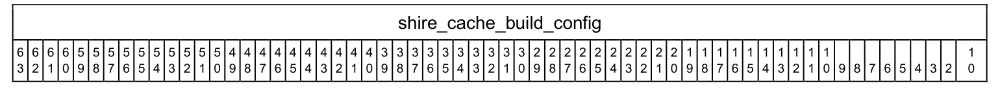


SC_L3_SHIRES 

SC_REQQ_DEPTH SC_SIZE_IN_MB SC_BANKS SC_SUB_BANKS 

SC_WAYS SC_SETS_PER_SUB_BANK 

###### **esr_shire_cache_revision_id** 

This read-only register contains the Shire Cache revision {REVISION_ID_B3, REVISION_ID_B2, REVISION_ID_B1, REVISION_ID_B0}. This register also contains the virtual ShireID (SHIRE_ID) and the physical ShireID (SHIRE_PHY_ID), which can be used for debug/diagnostics to verify that the physical Shire was programmed to the proper virtual ShireID. This register is located in the shire_other register region (one per shire) and not in the Shire Cache register region, which is one per bank. 


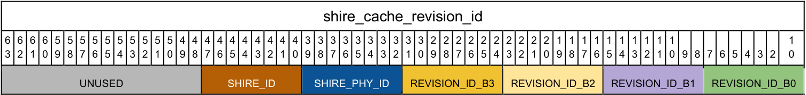


### 4.9 ESR for Performance Monitor 

**<mark>esr_sc_perfmon_ctl_status esr_sc_perfmon_cyc_cntr esr_sc_perfmon_p0_cntr esr_sc_perfmon_p1_cntr esr_sc_perfmon_p0_qual esr_sc_perfmon_p1_qual</mark>** 

These registers are used to set up the performance monitor to conduct a performance analysis of events and resource usages in a Shire Cache bank. Each Shire Cache bank has its own group of these six ESR registers. The **<mark>esr_sc_perfmon_ctl_status</mark>** <mark>register c</mark>ontrols how the three counters are started and stopped and the status when the counters stop. It also controls the qualifiers setup. The three counters are 40 bits wide. The **<mark>esr_sc_perfmon_cyc_cntr</mark>** counts the number of clock cycles that the performance monitor is activated. The **<mark>esr_sc_perfmon_p0_cntr</mark>** <mark>a</mark> nd **<mark>esr_sc_perfmon_p1_cntr</mark>** count the number of events or resources that are being measured. The corresponding qualifiers **<mark>esr_sc_perfmon_p0_qual</mark>** and **<mark>esr_sc_perfmon_p0_qual</mark>** <mark>d</mark> etermine which events or resources are measured. 

###### **<mark>esr_sc_perfmon_ctl_status</mark>** 

This register controls when the cycle, p0, and p1 counters start and stop. When the _starting_ bit (s) is set, it starts the counter. When it is cleared, it stops the counter. The counters can be preloaded with a 40-bit value. However, setting the _reset_ bit (r) clears the counter when it is started. When the _overflow_ (o) is set, the counter will stop when it overflows the 40 bits. The corresponding counter _status overflow_ (so) is also set to indicate that an overflow is detected. All _status overflow_ (so) bits are cleared when any counter is started. As previously mentioned, each counter stops when it overflows and its _overflow_ (o) is set; however, if the _any overflow_ (ao) bit is set, any counter overflow will cause all counters to stop. When the _interrupt_ (i) is set, an interrupt signal to the **esr_sc_err_interrupt_enable** is triggered when the counter overflows. To generate an interrupt to the IOShire, the performance counter saturation interrupt bit 4 has to be set. When the counter is active, the _status active_ (sa) bit is set. The _event_ (e) bit sets the p0 and p1 qualifiers to measure events. When cleared, the p0 and p1 qualifiers measure resources. The p0 and p1 


mode determines the event or resources that should be measured by the p0 and p1 qualifiers. Both the p0 and p1 qualifiers can measure any events. However, p0 and p1 can only measure its allocated resources. 

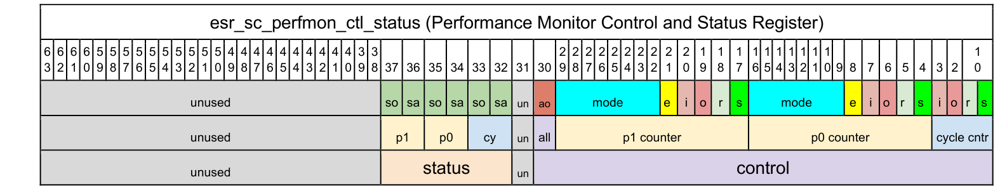


###### **<mark>esr_sc_perfmon_cyc_cntr esr_sc_perfmon_p0_cntr esr_sc_perfmon_p1_cntr</mark>** 

These registers count the number of cycles, events, or resources that are specified by the control register and the p0 and p1 event or resource qualifiers. They are 40 bits wide and can be preloaded. They are cleared at the start when the _reset_ (r) bit is set. When the counter overflows, it saturates with all ‘1’s. If the _overflow_ (o) bit is set, it sets the control status bit to ‘1’. Any counter that overflows when the _overflow_ (o) is set causes all three counters to stop. 

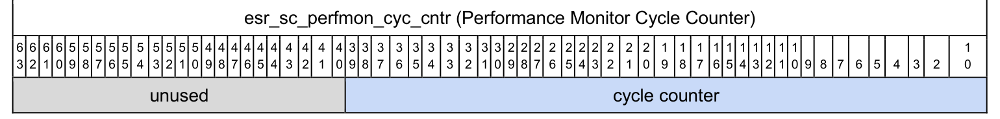


###### **<mark>esr_sc_perfmon_p0_qual esr_sc_perfmon_p1_qual</mark>** 

These are qualifier registers for p0 and p1 counters. The control register _event_ (e) specifies whether the qualifier is for an event or a resource. The control register mode specifies what event or resource the qualifier measures. Both the p0 and p1 counters can measure any event. However, the resources are assigned to specific counters. 

esr_sc_perfmon_p0_qual (Performance Monitor p0 Qualifier) 


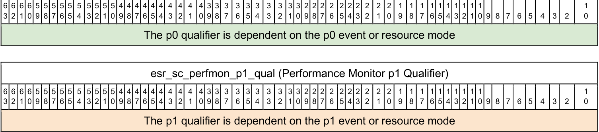


The resource qualifier specifies the operation types (oper) based on the min and max value of the resource to compare against. The operation types (oper) are as follows: accumulate (acc) if it’s within the min/max, count by 1 (cnt) if it’s within the min/max, and maximum (max) if it’s within the min/max and contains the maximum value detected so far. The oper values are 0 for acc, 1 for cnt, and 2 for max. 

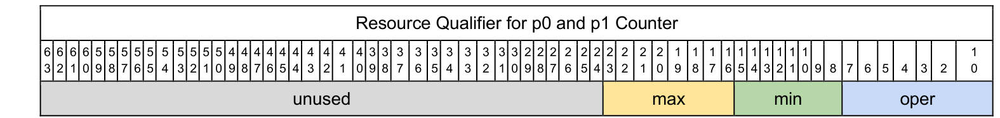

**Resource P0 Qualifier Mode**<br>(esr_sc_perfmon_ctl_status  p0  event (e) = 0)

|**Mode**<br>(esr_sc_perfmon_ctl_status  p0  mode)|**Resources Measured**|
|---|---|
|0|Number of L2 or IdxCopFSM reqq entries active|
|1|L3 reqq busy|
|2|Number of outstanding requests to the to_l3 port|
|3|Number of outstanding L2 or IdxCopFSM requests to the to_l3<br>port|
|4|Number of outstanding L3 requests to the to_sys port|


_Table 22_ 

**Resource P1 Qualifier Mode**<br>(esr_sc_perfmon_ctl_status  p1  event (e) = 0)

|**Mode**<br>(esr_sc_perfmon_ctl_status  p1  mode)|**Resources Measured**|
|---|---|
|0|Number of L3 reqq entries active|
|1|L2 reqq busy|
|2|Number of outstanding requests to the to_sys port|
|3|Number of outstanding L2 or IdxCopFSM requests to the to_sys<br>port|
|4|Number of write Coalescing buffers active|


_Table 23_ 

The event qualifier for mode 0 is broken into four “q” groups that can be independently set to control which event will be measured. The four groups are the q0: read buffer (rb), q1: msgsendata (ms), q2: tag bubble, and q3a-q3d: pipeline tag TC (bu, hm, victim, qwen, and l2/l3/scp/idxcop opcode) events. 

For example, setting the q0: read buffer group measures the Read buffer hits. However, setting the q3 group requires that q3a, q3b, q3c, and q3d are set for that event to be counted. Counting the number of L2 read hits requires the following to be set: q3a=hit, q3b=no victim or all set, q3c=qwen0 or all set, and q3d=L2 read. If both q0 and q3 are set as shown above, the number of L2 read hits and RBUF hits are counted. 


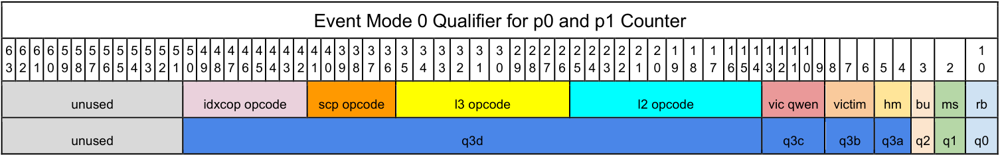


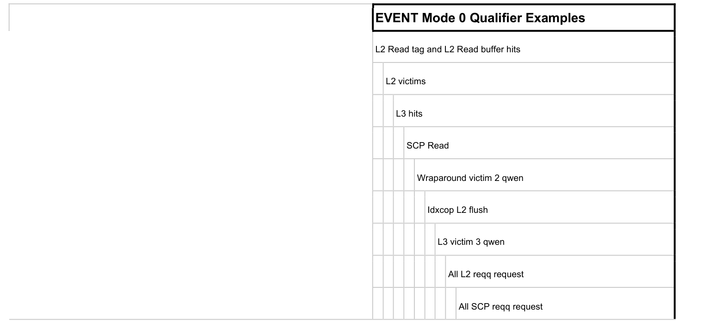

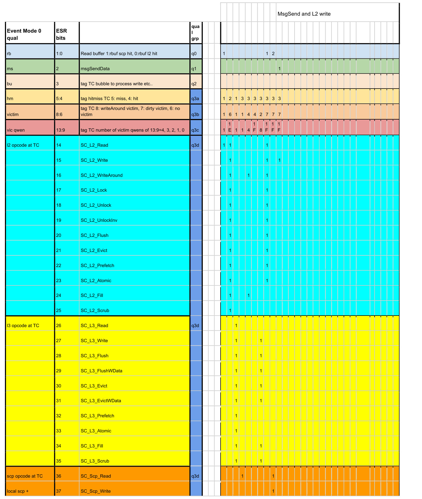

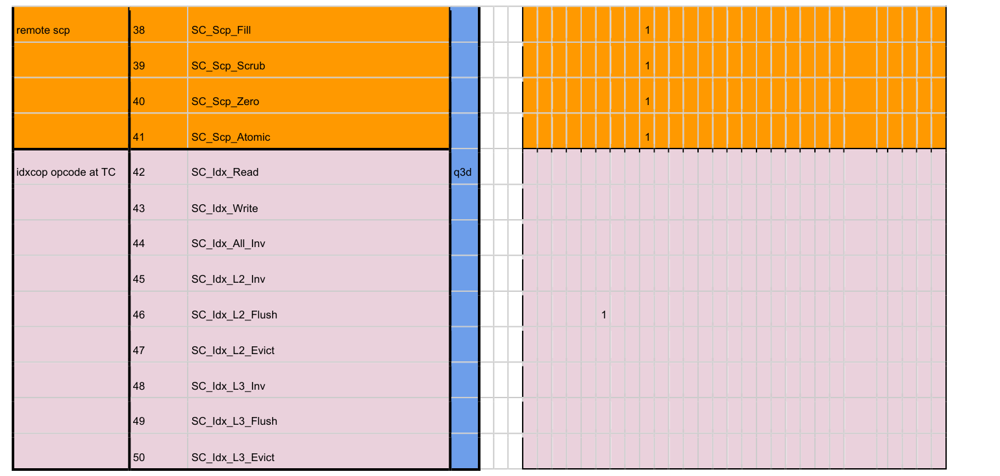

|**Event Mode 0**<br>**qual**|**ESR**<br>**bits**||**qual**<br>**grp**|
|---|---|---|---|
|rb|1:0|Read buffer 1:rbuf scp hit, 0:rbuf l2 hit|q0|
|ms|2|msgSendData|q1|
|bu|3|tag TC bubble to process write etc..|q2|
|hm|5:4|tag hitmiss TC 5: miss, 4: hit|q3a|
|victim|8:6|tag TC 8: writeAround victim, 7: dirty victim, 6: no<br>victim|q3b|
|vic qwen|13:9|tag TC number of victim qwens of 13:9=4, 3, 2, 1, 0|q3c|
|l2 opcode at TC|14|SC_L2_Read|q3d|
||15|SC_L2_Write||
||16|SC_L2_WriteAround||
||17|SC_L2_Lock||
||18|SC_L2_Unlock||
||19|SC_L2_UnlockInv||
||20|SC_L2_Flush||
||21|SC_L2_Evict||
||22|SC_L2_Prefetch||
||23|SC_L2_Atomic||
||24|SC_L2_Fill||
||25|SC_L2_Scrub||
|l3 opcode at TC|26|SC_L3_Read|q3d|
||27|SC_L3_Write||
||28|SC_L3_Flush||
||29|SC_L3_FlushWData||
||30|SC_L3_Evict||
||31|SC_L3_EvictWData||
||32|SC_L3_Prefetch||
||33|SC_L3_Atomic||
||34|SC_L3_Fill||
||35|SC_L3_Scrub||
|scp opcode at TC|36|SC_Scp_Read|q3d|
|local scp +|37|SC_Scp_Write||
|remote scp|38|SC_Scp_Fill||
||39|SC_Scp_Scrub||
||40|SC_Scp_Zero||
||41|SC_Scp_Atomic||
|idxcop opcode at TC|42|SC_Idx_Read|q3d|
||43|SC_Idx_Write||
||44|SC_Idx_All_Inv||
||45|SC_Idx_L2_Inv||
||46|SC_Idx_L2_Flush||
||47|SC_Idx_L2_Evict||
||48|SC_Idx_L3_Inv||
||49|SC_Idx_L3_Flush||
||50|SC_Idx_L3_Evict||


## 5 Error Handling 

There are multiple levels of error handling specified for the Shire Cache. While full details are outside of the scope of this spec, briefly: 

Level 1: Log errors locally and report them globally 

Level 2: Send precise errors on ET-Link or AXI read responses when possible 

Level 3: Containment of bad read data by poisoning ECC bits in the cache 

Level 4: Graceful handling of data errors on other types of operations 

Level 5: Additional handling of Tag uncorrectable errors 

Currently, the Shire Cache will support Level 2 handling, which will log the error condition, indicate the error on ET-Link or AXI responses when possible, or send the interrupt to the IOShire. 

There are two error outputs from the Shire Cache: _sc_error_detected_ and _sc_error_logged_ . sc_error_detected will cause a global interrupt in the IOShire, and sc_error_logged indicates that the Shire Cache has logged an error associated with an interrupt. sc_error_logged should be set regardless of whether the error was sent globally via sc_error_detected or via an ET-Link or AXI response back to the requesting core. 

The **esr_sc_err_rsp_enable** register controls whether the Shire Cache operates in Level 1 or Level 2 mode. If esr_sc_err_rsp_enable equals zero, the Shire Cache operates in Level 1 mode and all enabled errors will be sent globally to the IOShire via sc_error_detected. If esr_sc_err_rsp_enable is set, enabled errors will be sent back to the requesting core if possible. When it is not possible to send the error back to the core (e.g. errors on fills or evictions), then the error will be sent to the IOShire. 

The **esr_sc_err_log_info** and **esr_sc_error_log_address** registers are used to record information about errors. Details about the error log register field formats are available in the Error Logging section. 

The **esr_sc_err_interrupt_enable** register is used to enable or prevent certain categories of logged errors from generating interrupts or sending error responses. Single-bit ECC errors should not generate an interrupt. SW may or may not want to configure ECC error counter saturation to generate an interrupt. Masked errors also do not set sc_error_logged. 

### 5.1 Error Handling at the Interfaces 

ET-Link and AXI support the following signaling for errors: 

- ET-Link has response opcode ET_LINK_RSP_Err = 2'd3 

- ET-Link opcode ET_LINK_REQ_WriteError = 5'd31 indicates that there is an error on the write data. This is only expected on AWUSER[4:0]. 

- AXI supports SLVERR and DECERR responses on all RRESPs and BRESPs. 

Conversion between interfaces: 

- AXI SLVERR on RRESP or BRESP --> ET-Link RSP_Err on Rsp 


- AXI DECERR on RRESP or BRESP --> ET-Link RSP_Err on Rsp 

- ET-Link RSP_Err --> AXI SLVERR on RRESP or BRESP 

### 5.2 Pipeline Error Responses 

The pipeline signals error responses back to the reqq for error logging. There are three types of error responses: 

- _Opcode processing_ error responses 

- _Single-bit_ error (SBE) responses from the tag_state, tag, and data RAMs 

- _Double-bit_ error (DBE) responses from the tag_state, tag, and data RAMs 

_Opcode processing_ error responses are returned with the tag response using the err_rsp field of the tag_rsp struct. The opcode errors are enumerated as follows (0=highest priority, 10=lowest priority): 

0. SC_Err_None 

   - a. No error exists 

1. SC_PipeErr_L3ShireDecErr 

   - a. L3 request to an incorrect Shire (shire_id mismatch) 

2. SC_PipeErr_ScpShireDecErr *** 

   - a. SCP request to an incorrect Shire (shire_id mismatch) 

3. SC_PipeErr_ScpRegionDecErr *** 

   - a. SCP request with the wrong region id (region_id mismatch) 

4. SC_PipeErr_L2OpToNonEnRegion 

   - a. L2 request when there is no cache allocated to L2 (this should never happen since L2 should always be enabled) 

5. SC_PipeErr_L3OpToNonEnRegion 

   - a. L3 request when there is no cache allocated to L3 

6. SC_PipeErr_ScpOpToNonEnRegion 

   - a. SCP request when there is no cache allocated to Scratchpad 

7. SC_PipeErr_ScpSetOutOfRange 

   - a. SCP request to set/index that is out-of-range of the allocated Scratchpad region 

8. SC_PipeErr_LockErr 

   - a. An attempt to lock the last way 

Errors 1-8 become NOPs within the pipeline and just return an error response within the tag_rsp and indicate hit=0. 

L3 atomics must also send the error response back to the UC Shire by performing a write to the UC Shire atomic ESR response register. There will be a new ET-Link opcode to specify an error on a write request. 

Pipe decode errors cause the reqq to finish without sending additional requests on to downstream memories (e.g. a read to a non-existent memory space will not create a fill request to the next-level memory, and a flush from L2 to Mem will not forward the flush on to downstream memory if a non-existent L2 memory causes a decode error). If SW wants requests to be passed on to next-level memories, they must set L2/L3 bypass ESRs corresponding to the memory that is missing. 


*** Errors 2 and 3 should not be seen in pipe, but should be reported by reqq as error #17. 

SBE/DBE responses are returned over the tag_rsp and data_rsp. See the <u>ECC Error Responses section.</u> 

### 5.3 Reqq/Dataq Error Responses 

Besides receiving error responses from the pipeline, the reqq also receives error responses from the mesh and generates error responses for the following illegal operations: 

16. SC_ReqqErr_MeshRespErr 

a. Mesh response with an error for reads or writes to the mesh 

17. SC_ReqqErr_FillToRemote 

   - a. ScpFill destination address was not to the SCP space or not to the current Shire 

18. SC_ReqqErr_RemoteScpNotEnabled 

   - a. ScpFill request to a remote Scratchpad region, but esr_sc_remote_ scp is disabled 

19. SC_ReqqErr_L2BypassL2Atomic 

a. L2 atomic operation when L2 bypass is enabled 

20. SC_ReqqErr_L3BypassL3Atomic 

a. L3 atomic operation when L3 bypass is enabled 

21. SC_ReqqErr_UnsupportedOp 

   - a. Received an opcode that the Shire Cache doesn’t support 

      - i. An SCP PA with an opcode that is not a read, write, or ScpFill 

22. SC_ReqqErr_IllegalPort 

- a. Received a request (probably a message) that needs to be returned to a non-existent port 

- 23. SC_ReqqErr_ScpAtomicFrNeigh 

   - a. SCP atomic operation from a Neighborhood 

Error 16 completes and returns with an error response. Errors 17-21 become NOPs and just return an error response to the Neighborhood. 

### 5.4 ECC Error Responses 

SBEs are corrected so normal processing can occur. Tag_state and tag SBE responses are sent with the tag_rsp. Data SBE responses are sent with the data_rsp. The error responses are signaled to the reqq indicating that a RAM has an SBE. Future implementation could scrub the SBE before it becomes a DBE. No error response has to occur to the requesting Neighborhood since the request is processed correctly. Dataq SBEs are just logged locally and no action is taken. 

DBEs cannot be corrected, so these are fatal errors and need to be reported as quickly as possible. 

The SBE/DBE responses are one per ECC protection. This means that tag_state has a single bit, tag has one per way (4 bits), and data and dataq have one error bit per dword (8 bits). 


SBE and DBE occurrences are counted per memory type. The SBE counter is 8 bits and saturates at 255, while the DBE counter is 3 bits and saturates at 7. The current error counts are located in the register **esr_sc_sbe_dbe_counts** . The fields for this register are as follows: 

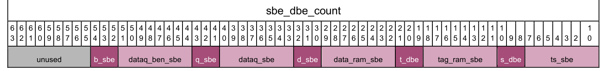


`tag_state_sbe` = tag_state single-bit error count `s_dbe` = tag_state double-bit error count 

`tag_ram_sbe` = tag_ram single-bit error count `t_dbe` = tag_ram double-bit error count 

`data_ram_sbe` = data_ram single-bit error count `d_dbe` = data_ram double-bit error count 

`dataq_sbe` = dataq_ram single-bit error count `q_dbe` = dataq_ram double-bit error count 

`dataq_ben_sbe` = dataq_ben_ram single-bit error count 

`b_dbe` = dataq_ben_ram double-bit error count 

All the fields are read-only. To clear the counts, writing all ‘1’s to the field will clear the respective field. 

If a counter saturates, it can also be error logged. See the ECC Counter Saturation Error Log Format section. 

### 5.5 Error Logging 

The Error Logging status is saved into two registers: **esr_sc_err_log_info** and **esr_sc_err_log_address** . 

The **esr_sc_err_log_info** fields are: 

**0 - valid** : an error has occurred 

**1 - multiple** : multiple errors have occurred 

**2 - enabled** : the error detected was enabled by **esr_sc_err_interrupt_enable** 

**3 - imprecise** : this bit only matters if enabled is set 

- **0** - the error was sent back with the ET-Link or AXI response 

**1** - a global interrupt request was sent to the IOShire. Panic! 

**7:4 - code** : indicates which type of error was seen. Code is used to determine how to decode the info bits. **63:8 - info** : this is additional information about the error that occurred. This field format is dependent upon the type of error code. 

The **esr_sc_err_log_address** register contains the PA associated with the error if it is available. 

The types of errors logged by the Shire Cache are as follows: 


ECC single-bit errors: code 0 ECC double-bit errors: code 1 ECC counter saturation: code 2 Decode errors: code 3 Performance counter saturation: code 4 

When an error occurs, the **esr_sc_err_log_info** and the **esr_sc_err_log_address** registers record the details of the first error that is encountered. Subsequent errors will set the multiple bit to indicate that another fatal error occurred and the details were not recorded. 

Error categories can be masked with **esr_sc_err_interrupt_enable** . There is a bit per each of the five error codes listed above to enable that error type to generate an interrupt. Bit 0 enables ECC single-bit errors (code 0), bit 1 enables ECC double-bit errors (code 1), etc. Error codes that are not enabled are still logged, but they have lower priority than errors that generate interrupts. Therefore, masked interrupts do not prevent a subsequent unmasked error from being recorded. When an enabled interrupt error overwrites a masked error, the multiple-error bit is not set. Also, multiple masked errors do not cause the multiple-error bit to be set. The multiple-error bit is intended to indicate that a fatal error was missed. 

The error log status register valid bit is cleared by writing a ‘1’ to the **esr_sc_err_log_info** bit 0 and writing the matching code to bits [7:4]. 

There is an err_dec.py script that decodes all of the Shire Cache error log info formats into human readable fields. The script is available at esperanto_soc/dv/tools. 

#### 5.5.1 ECC Single-Bit and Double-Bit ECC Error Log Format 

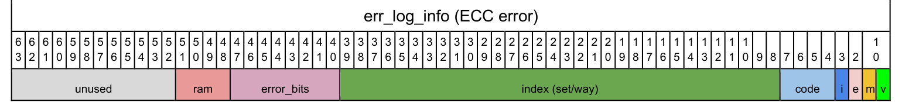


**code** : ‘0’ for Single-Bit ECC errors, ‘1’ for Double-Bit ECC errors **index** : Contains the index, or in the case of the data RAM, which set and way contains the error **error_bits** : Indicates which dw contained the error. The error_bits field is multi-hot. **ram** : Indicates which RAM had the error 

- 0 - tag state RAM 

- 1 - tag RAM 

- 2 - data RAM 

- 3 - dataq RAM 

- 4 - ben RAM 

The **esr_sc_err_log_address** register contains the PA associated with these errors. 


#### 5.5.2 ECC Counter Saturation Error Log Format 

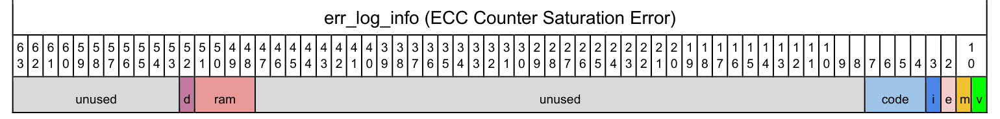


**code** : 2 **ram** : Indicates which RAM saturated 0 - tag state RAM 1 - tag RAM 2 - data RAM 15 - SBE Scrub overflow (for Gepardo) 

**double** : Single- or Double-Bit errors 1 - The DBE counter saturated 0 - The SBE counter saturated 

#### 5.5.3 Decode / Slave Error Log Format 

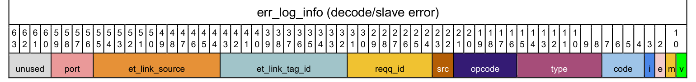

**code** : 3 

**type** : Indicates which type of error was detected. The error types are enumerated in the <u>Pipeline Error Responses and Reqq/Dataq Error Responses sections.</u> 

**opcode** : The opcode of the initiating request that triggered the error: 

0x00 : "SC_Reqq_Read" 0x01 : "SC_Reqq_Write" 0x02 : "SC_Reqq_WriteAround" 0x04 : "SC_Reqq_MsgSendData" 0x05 : "SC_Reqq_Atomic" 0x06 : "SC_Reqq_ScpRead" 0x07 : "SC_Reqq_ScpWrite" 0x09 : "SC_Reqq_Idx" 0x0a : "SC_Reqq_Sync" 0x10 : "SC_Reqq_CopLock" 0x11 : "SC_Reqq_CopUnlock" 0x12 : "SC_Reqq_CopUnlockInv" 0x13 : "SC_Reqq_CopFlush" 0x14 : "SC_Reqq_CopEvict" 0x15 : "SC_Reqq_CopFlushWData" 0x16 : "SC_Reqq_CopEvictWData" 


0x17 : "SC_Reqq_CopPrefetch" 0x18 : "SC_Reqq_CopScpFill" 0x1a : "SC_Reqq_Atomic2" 0x1b : "SC_Reqq_WriteAround2" **src** : Indicates where the request came from 0 - L2 1 - L3 2 - CacheOp FSM 

**reqq_id** : Indicates which reqq entry contains the request that triggered the error **et_link_tag_id** : tag_id received for the request across the ET-Link **et_link_source** : Source received for the request across the ET-Link **port** : Indicates which Neighborhood the request came from if it is an L2 request 

The **esr_sc_err_log_address** register contains the PA associated with these errors. 

#### 5.5.4 Performance Counter Error Log Format 

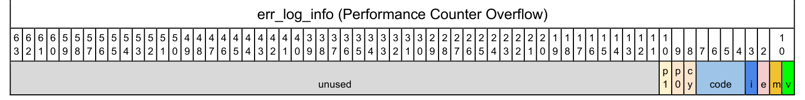

**code** : 4 **Cycle counter** : overflow **P0 counter** : overflow **P1 counter** : overflow 


## 6 ECC Single Bit ECC Error Scrubbing - Gepardo 

ECC Error scrubbing is added to Gepardo.  (This is not in ETSOC-1) 

To enable ECC Error scrubbing set the esr bit **esr_sc_ecc_scrub_enable.** If this bit is set and a single-bit ECC error is detected, then the reqq will schedule an ECC scrub pass through the pipeline. The ECC scrub is a read, fix, and write of the tag, tag state, and data RAMs. 

Single bit errors in the tag ram, tag state ram, or data ram will schedule an ecc scrub.  If an ECC scrub is scheduled, the scrub will happen just before the reqq entry would have otherwise gone to the done state. The scrub is considered a nop and at this point the scrub address should not be in any linked lists. 

Each time a scrub is sent down the pipe an ecc_scrub_cnt status register is incremented.  The status register is readable in **esr_sc_ecc_scrub_cnt.** Writing to the **esr_sc_ecc_scrub_clr** esr will reset the ecc_scrub_cnt to zero. 

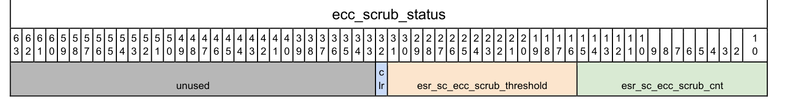


Additionally, there is an **esr_sc_ecc_scrub_threshold** esr which indicates how many scrubs are allowed. If **esr_sc_ecc_scrub_threshold** >= 0 and the number of scrubs is greater than or equal to the threshold an imprecise interrupt is signaled to the service processor.  The interrupt is logged as an ECC Counter Saturation Error with the ram field set to 15 to indicate that this is a scrub counter threshold error. 


## 7 UltraSoC Trace 

The Shire Cache provides trace data to the UltraSoC status monitor for tracing and debugging. 

In order to help limit how much data is traced and consequently help prevent status monitor overflow, there are Shire Cache ESRs that can be used to limit which transactions are traced. Each reqq entry keeps a traced bit indicating whether it should be traced. Trace data will only be generated for an activity that is caused by a traced transaction. The following ESRs filter which transaction IDs are traced: 

###### **esr_sc_trace_filter_address_enable esr_sc_trace_filter_address_value** 

Trace the entry if 

(alloc address & esr_sc_trace_filter_address_enable) == esr_sc_trace_filter_address_value 

###### **esr_sc_trace_filter_port_enable esr_sc_trace_filter_port** 

To filter traceable requests based upon the incoming ET-Link port field, set 

`esr_sc_trace_filter_port_enable` , and set `esr_sc_trace_filter_port` to the port that should be traced. 

###### **esr_sc_trace_filter_source_enable** 

###### **esr_sc_trace_filter_source** 

To filter traceable requests based upon the incoming ET-Link source field, set 

`esr_sc_trace_filter_source_enable` , and set `esr_sc_trace_filter_source` to the source that should be traced. 

###### **esr_sc_trace_filter_l2_enable esr_sc_trace_filter_l3_enable** 

###### **esr_sc_trace_filter_fsm_enable** 

To disable tracing requests from the Neighborhoods, l3_slave, or the FSM index, set the corresponding bit above. 

###### **esr_sc_trace_filter_reqq_id_enable esr_sc_trace_filter_reqq_id** 

To filter traceable requests based upon the selected reqq_id, set 

`esr_sc_trace_filter_reqq_id_enable` and set `esr_sc_trace_filter_reqq_id` to the reqq_id that should be traced. 

The Shire Cache has multiple types of trace data packets called snippets: 

1. Reqq L2 allocation for Neighborhood requests 

2. Reqq L3 allocation for L3 slave requests 

3. Pipeline TC status 

4. RBUF hit 

5. Mesh traffic and responses 


###### 6. Reqq entry state 

The **esr_sc_trace_type_enable** register controls which snippets are enabled. This is a multi-hot register with bits corresponding to each of the trace data types above. Some trace data types have multiple control bits to control which variant of the trace snippet is traced. 

The lower three bits of each snippet indicate the snippet type. Snippet type 0 indicates that nothing is traced, while snippet types 1-6 correspond to the list above. 

The diagram below shows how the trace snippets are packed into three equally-sized segments of the trace packet: 


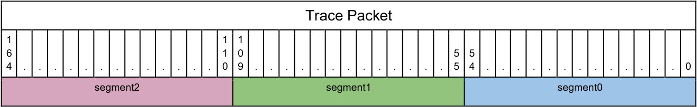


Only three snippets can be traced per cycle. If only one snippet is traced in a given cycle, then it will be placed into segment 0. Segments 1 and 2 will be left unchanged with the exception that segment 1’s snippet type is set to ‘none’. UltraSoC compresses MSBs of trace data if it is unchanged. Therefore, even though the trace data can be three segments wide when multiple things must be traced simultaneously, if only one snippet is occurring per cycle, only the LSB’s compromising segment 0 will be traced. 

The sections below contain information about each trace snippet. 

### 7.1 L2 and L3 Alloc Trace Snippet 


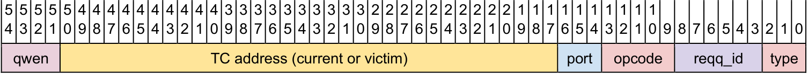


|**Alloc L2/L3**||
|---|---|
|qwen|4|
|address|34|
|port_id|3|
|orig_opcode + level|5|
|reqq_id|6|
|**Total**|**52**|


Enable the L2 alloc trace by setting **esr_sc_trace_type_enable** [0] Enable the L3 alloc trace by setting **esr_sc_trace_type_enable** [1] 


### 7.2 TC Status Trace Snippet 


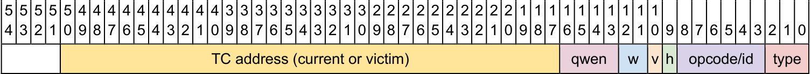


|**TC Status Opcode**||
|---|---|
|address current/victim|34|
|qwen current/victim|4|
|way|2|
|victim|1|
|hit|1|
|opcode / reqq_id|6|
|**Total**|**48**|


Enable the TC status trace by setting **esr_sc_trace_type_enable** [2]. By default, TC status traces the opcode and address. To select the reqq_id rather than the opcode, set **esr_sc_trace_type_enable** [3]. By default, the current address and qwen are traced. To trace the victim address and qwen instead, set **esr_sc_trace_type_enable** [4]. 

Bit 2 enables TC status with opcodes, while bit 3 enables TC status with reqq_id. Bits 2 and 3 are mutually exclusive. 

Additionally, **esr_sc_trace_type_enable** [11] controls whether Fills are included in the TC tracing. Set **esr_sc_trace_type_enable** [11] to trace fills at TC as well. 

### 7.3 RBUF Trace Snippet 


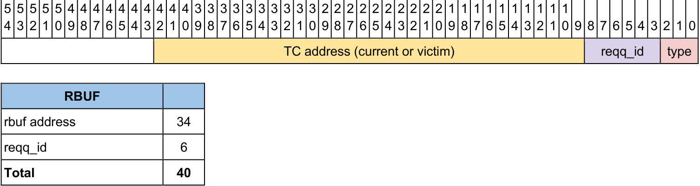


Enable the RBUF trace by setting **esr_sc_trace_type_enable** [5]. 


### 7.4 Mesh and Rsp Trace Snippet 

- 5 5 5 5 5 4 4 4 4 4 4 4 4 4 4 3 3 3 3 3 3 3 3 3 3 2 2 2 2 2 2 2 2 2 2 1 1 1 1 1 1 1 1 1 1 4 3 2 1 0 9 8 7 6 5 4 3 2 1 0 9 8 7 6 5 4 3 2 1 0 9 8 7 6 5 4 3 2 1 0 9 8 7 6 5 4 3 2 1 0 9 8 7 6 5 4 3 2 1 0 to_sys rsp to_sys req l3 slave rsp v v to_l3 rsp id v to_l3 req id v v neigh rsp id v type 

- id id id 

|**Mesh / RSPs**||
|---|---|
|to_sys rsp id|6|
|to_sys rsp valid|1|
|to_sys req id|6|
|to_sys req valid|1|
|to_l3 rsp id|6|
|to_l3 rsp valid|1|
|to_l3 req id|6|
|to_l3 req valid|1|
|l3_slave rsp id|6|
|l3_slave rsp valid|1|
|neigh rsp id|6|
|neigh rsp valid|1|
|**Total**|**21**|


Enable the mesh and response trace by setting **esr_sc_trace_type_enable** [6]. 

### 7.5 Reqq State Trace Snippet 

- 5 5 5 5 5 4 4 4 4 4 4 4 4 4 4 3 3 3 3 3 3 3 3 3 3 2 2 2 2 2 2 2 2 2 2 1 1 1 1 1 1 1 1 1 1 4 3 2 1 0 9 8 7 6 5 4 3 2 1 0 9 8 7 6 5 4 3 2 1 0 9 8 7 6 5 4 3 2 1 0 9 8 7 6 5 4 3 2 1 0 9 8 7 6 5 4 3 2 1 0 reqq_state type 

|**Reqq State**||
|---|---|
|reqq_id|6|
|opcode|6|
|rspmux_l2_eligible|1|
|rspmux_l3_eligible|1|
|rspmux_sent|1|
|pipe_req_eligible|1|
|to_l3_mesh_req_eligible|1|
|to_sys_mesh_req_eligible|1|
|rbuf_req_eligible|1|
|inflight|1|
|data_ready|1|
|wait_for_dataq|1|
|dep_valid|1|
|dep_tail|1|
|dep_victim_tail|1|
|dep_non_victim_head|1|
|dont_depend_on_me|1|
|rbuf_valid|1|
|rbuf_pending_valid|1|
|err_detected|1|
|**Total**|**31**|


Enable the reqq entry state trace by setting **esr_sc_trace_type_enable** [7]. 

Note that if the reqq entry state is traced, only one reqq entry can be traced at a time. Be careful to setup the trace so that only one reqq entry should be traceable at a time. 


## 8 Interfaces 

### 8.1 General Signals 

|**Signal**|**Dir**|**Description**|
|---|---|---|
|clock|IN|Main clock|
|reset|IN|Global synchronous reset, active high|
|shire_id[5:0]|IN|Shire number (0..63)|


_Table 24_ 

### 8.2 Neighborhood and UC Interfaces 

The L2 has five clients: 

- 4 Neighborhoods, with optionally attached TBOXs 

- 1 RBOX 

Communication between elements in the same Shire is described in detail in the ET-Link document. Each client provides a request and a response channel with its corresponding valid and ready signals for handshaking. 

In the following tables, ‘N’ indicates the number of Neighborhoods + RBOX master clients of the L2 cache, While ‘B’ indicates the number of Shire Cache banks. 

#### 8.2.1 Neighborhood Request Bus 

|**Signal**|**Dir**|**Description**|
|---|---|---|
|neigh_sc_req_valid[N-1:0][B:0]|IN|B+1 bits for each ‘N’ Shire client.<br>Each client asserts a vector indicating when it has<br>new requests for particular banks plus the UC block.|
|neigh_sc_req_ready[N-1:0][B:0]|OUT|B+1 bits per Shire client.<br>Bit set to high when L2 accepts a new request from<br>the corresponding client. Only one ready bit per client<br>is asserted per clock.|
|neigh_sc_req_info[N-1:0]|IN|One request channel per client. See ET-Link for a<br>description of all the signals it contains.<br>Each neigh_sc_req_info entry is valid only when the<br>corresponding valid and ready vectors both have a<br>bit asserted.|


_Table 25_ 

When both the valid and ready signals are high, this indicates the request from the corresponding client has been read and, in the following clock cycle, the client has to either deassert the valid signal or set the contents of neigh_sc_req_info for a new request. 

#### 8.2.2 Neighborhood Response Bus 

|**Signal**|**Dir**|**Description**|
|---|---|---|
|neigh_sc_rsp_valid[N-1:0]|OUT|1 bit per Shire client.<br>Set to high by L2 when there is a new response for the<br>corresponding client.|
|neigh_sc_rsp_ready[N-1:0]|IN|1 bit per client.<br>Set to high when the client can accept a new response<br>from L2.|
|neigh_sc_rsp_info[N-1:0]|OUT|One response channel per client. See ET-Link for a<br>description of all the signals it contains.<br>Its contents are valid when the corresponding bit in<br>neigh_sc_rsp_valid is high.<br>_Table 26_|


The read/valid ports work the same way as they do with the request bus. 

#### 8.2.3 UC Request and Response Bus 

The Shire Cache contains the request and response crossbars used to connect all the Neighborhoods with all the cache banks. The same interconnect is used to connect requests to the UC block for noncached requests. The UC block is added as the (B+1)<sup>th</sup> bank. Since the UC block lives outside the Shire Cache hierarchy, the edge of the crossbar is exposed as a port. 

|**Signal**|**Dir**|**Description**|
|---|---|---|
|neigh_uc_req_valid|OUT|Asserted when a request to the UC is available|
|neigh_uc_req_ready|IN|Asserted when a request may be taken by the UC block|
|neigh_uc_req_info|OUT|A request channel to the UC. See ET-Link for a description of<br>all the signals it contains.|
|||The neigh_uc_req_info entry is valid only when the valid bit is<br>asserted.|


_Table 27_ 

|**Signal**|**Dir**|**Description**|
|---|---|---|
|neigh_uc_rsp_valid|IN|Set to high by the UC when there is a new response<br>for the corresponding client|
|neigh_uc_rsp_ready|OUT|Set to high when the client can accept a new<br>response from the UC|
|neigh_uc_rsp_info|IN|A response channel from the UC. See ET-Link for a<br>description of all the signals it contains.<br>Its contents are valid when the bit neigh_uc_rsp_valid<br>is high.|


_Table 28_ 

### 8.3 ESR Interface 

ESRs are accessed with an APB interface. 

FIXME documents the APB, naming, addressing, bank splitting, etc. 

### 8.4 Shire Cache Interfaces to Mesh 

The Shire Cache is a collection of banks (1-8). The banks use an internal bus specification sc_mesh_(master|slave)_(req|rsp)_t that is very similar to the ET-Link. After funneling down to a single port (masters) or before distributing out from a single port (slaves), the AXI is used to connect to the Netspeed mesh. 

There are two masters (to_l3 and to_sys) and one slave (l3_slave). The AXI signals used on the masters and slaves are described in the tables below. 

**Width:** this column indicates the width and (source of width). For instance, the AxLEN width “8 (AXI)” indicates that the AxLEN width must be ‘8’ according to the AXI specification requirements, even though we don't use all the bits. 

**Width Const:** this column shows the RTL constant used for the width. 

**Source M or S:** this column indicates whether the direction of the signals is by source Master or Slave. 

**Constant M/S:** for signals that are tied to constants, this column indicates their value for master and slave ports in the Master/Slave format. “Drop” indicates the signal is ignored or removed from the interface. 

<mark>AXI specification optional ports that can be removed from the Netspeed mesh bridge are highlighted with a grey background.</mark> 

<mark>AXI signals that are tied to constants are highlighted with a yellow background.</mark> 

Width constants should ideally be named with a MIN_ prefix to differentiate them from an eventual Maxion L2 & L3, but no other defines in the code currently do that. Therefore, this will have to be managed globally at a later date. 


#### 8.4.1 Ax - AW and AR AXI Address Channels 

|**Signal**|**Width**|**Width Const**|**Source**<br>**M or S**|**Constant**<br>**M/S**|**Description**|
|---|---|---|---|---|---|
|AxID|9<br>Master<br>16<br>Slave|SC_MESH_MASTER_AXI<br>_ID_SIZE<br>SC_MESH_SLAVE_AXI_I<br>D_SIZE|M|-|Address ID. Tags the transaction for identification on the<br>response bus. The AXI may imply ordering requirements<br>if the same ID is used on multiple transactions in flight at<br>the same time.<br>No requirement to support any ordered transactions<br>across the AXI (utilizing the same ID for multiple<br>transactions in flight).<br>Requires a large enough ID to avoid artificial ordering of<br>independent transactions.<br>Width =<br>0  UC/non-UC bank bit → This bit is generated by the<br>NetSpeed SIB<br>3  bank bits<br>6  independent transactions (max 48 entries in the<br>request queue inside each bank)<br>---<br>9<br>+7 on slave for 128 source Shire space (64 Minion Shires<br>+ others)<br>Master ID is formed by concatenating {‘0, bank_id,<br>reqq_id}, where bank_id and reqq_id sizes are defined by<br>`SC_BANK_ID_SIZE and `SC_REQQ_ID_SIZE,<br>respectively.<br>The slave ID is formed by concatenating a source ID (7<br>bits) onto the MSBs above the Master ID.|
|AxADDR|40|SC_MESH_MASTER_AXI<br>_ADDR_SIZE|M|-|Address|
|AxLEN|8 (AXI)|AXI_AXLEN_SIZE|M|8'b0 / Drop|Number of transfers in a burst minus 1. Fixed AxLEN==0.<br>Full cache line width DATA, no multi-line bursts<br>supported.<br>Netspeed creates this port even though it's optional in the<br>AXI specification for masters.|
|AxSIZE|3 (AXI)|AXI_AXSIZE_SIZE|M|-|The log2 number of bytes in a transfer. Maximum<br>AxSIZE==6==64B (AxSIZE 7 not used). Only uncached<br>may do AxSIZE<6 (full cache line).|
|AxBURST|2 (AXI)|AXI_AXBURST_SIZE|M|2'b1/ Drop|Burst Type. 'b00 FIXED; 'b01 INCR; 'b10 WRAP; 'b11<br>Reserved. AxBURST==INCR. AxLEN is fixed to a single<br>beat, AxBURST doesn't matter. Netspeed creates this<br>port even though it's optional in the AXI specification for<br>masters.|
|AxLOCK|1||M|1'b0|Indicates an exclusive access attempt. Netspeed creates<br>this port even though it's optional in the AXI specification<br>for masters. Not used.|
|AxCACHE|4 (AXI)|AXI_AXCACHE_SIZE|M|4'b1111 /<br>Drop|AxCACHE[0] - Bufferable bit<br>AxCACHE[1] - Modifiable bit<br>AW / AR are different from each other in AxCACHE[3:2]:<br>AWCACHE[2] - Other Allocate<br>AWCACHE[3] - Allocate<br>ARCACHE[2] - Allocate<br>ARCACHE[3] - Other Allocate<br>Our system is ignoring these bits.|
|AxPROT|3 (AXI)|AXI_AXPROT_SIZE|M|3'b010|Access permissions<br>AxPROT[0] - 0=Unprivileged; 1=Privileged<br>AxPROT[1] - 0=Secure; 1=Non-secure<br>AxPROT[3] - 0=Data; 1=Instruction<br>We are not currently using any of this. A constant should<br>just be picked and used. Required by AXI specification.|
|AxQOS|4 (AXI)|AXI_AXQOS_SIZE|M|4'b0|QoS identifier. AXI does not define QoS operations.<br>Probably won't be used. Netspeed creates this port even<br>though it's optional in the AXI specification.|
|_AxREGION_|_4 (AXI)_|-|_M_|-|_Region identifiers. Consider these extra address bits._<br>_Don't use. Optional in AXI specification, delete these_<br>_pins._|
|AxUSER|?|SC_MESH_MASTER_AXI<br>_AXUSER_SIZE|M|-|Indicates extra opcode bits for CacheOps and atomics<br>(see AxUSER section below).|
|AxVALID|1||M|-|Channel handshake, master trying to send transaction<br>address. Transaction moves when<br>AxVALID==AxREADY==1|
|AxREADY|1||S|-|Channel handshake, slave ready to receive address.|


_Table 29_ 


8.4.2 W - AXI Write Data Channel 

|**Signal**|**Width**|**Width Const**|**Source**|**Constant**<br>**M/S**|**Description**|
|---|---|---|---|---|---|
|WDATA|512|SC_MESH_MASTER_AXI<br>_DATA_SIZE|M|-|Write data|
|WSTRB|64|SC_MESH_MASTER_AXI<br>_WSTRB_SIZE|M|-|One write strobe per byte of write data.<br>L2_AXI_MASTER_WSTRB_SIZE =<br>L2_AXI_MASTER_DATA_SIZE/8|
|WLAST|1||M|1'b1 / Drop|Indicates the last transfer in a write burst. Always 1, as<br>there are never multi-beat bursts.|
|WUSER|/|SC_MESH_MASTER_AXI<br>_WUSER_SIZE|M|-|No use for WUSER bits. This bus has been removed.|
|WVALID|1||M|-|Channel handshake, master trying to send write data<br>beat. Data moves when WVALID==WREADY==1|
|WREADY|1||S|-|Channel handshake, slave ready to receive write data.|


_Table 30_ 


#### 8.4.3 B - AXI Write Response Channel 

|**Signal**|**Width**|**Width Const**|**Source**|**Constant**|**Description**|
|---|---|---|---|---|---|
|BID|9 Master<br>16 Slave|SC_MESH_MASTER_A<br>XI_ID_SIZE|S|-|Response ID tag. Indicates which AWID request this is in<br>response to. Width must match the AxID.|
|BRESP|2|AXI_BRESP_SIZE|S|-|Write response<br>0b00 OKAY<br>0b01 EXOKAY<br>0b10 SLVERR<br>0b11 DECERR<br>Don't expect EXOKAY, as exclusive accesses are not<br>supported.|
||||||Need to support both error types|
|BUSER|/|SC_MESH_MASTER_A<br>XI_BUSER_SIZE|S|-|No use for WUSER bits. This bus has been removed.|
|BVALID|1||S|-|Channel handshake, slave trying to send response.<br>Moves when BVALID==BREADY==1|


|BREADY<br>1<br>M<br>-<br>_Table 31_|Channel handshake, master ready to receive response.|
|---|---|


#### 8.4.4 R - AXI Read Data Response Channel 

|**Signal**|**Width**|**Width Const**|**Source**|**Constant**<br>**M/S**|**Description**|
|---|---|---|---|---|---|
|RID|9<br>Master<br>16<br>Slave|SC_MESH_MASTER_AXI<br>_ID_SIZE|S||Response ID tag. Indicates which ARID request this is in<br>response to. Width must match the AxID|
|RDATA|512|SC_MESH_MASTER_AXI<br>_DATA_SIZE|S||Read data beat|
|RRESP|2|AXI_RRESP_SIZE|S||Read response. Same as BRESP (see above).|
|RLAST|1||S|1'b1 / Drop|Read Last. Indicates the last beat of a read burst.<br>Expected to always be ‘1’ when RVALID (no multi-beat<br>bursts).|
|RUSER|/|SC_MESH_MASTER_AXI<br>_RUSER_SIZE|S||No use for WUSER bits. This bus has been removed.|
|RVALID|1||S||Channel handshake, slave trying to send response.<br>Moves when RVALID==RREADY==1|
|RREADY|1||M||Channel handshake, master ready to receive response.|


## 9 Glossary 

APB Advanced Peripheral Bus AXI Advanced eXtensible Interface DRAM Dynamic Random Access Memory ECC Error Correction Code ESR ET System Register FIFO First-In First-Out IP Intellectual Property LSB Least-Significant Bit MSB Most-Significant Bit NoC Network on Chip PA Physical Address RAM Random Access Memory RBOX Raster Box RBUF Read Buffer SCP Scratchpad SoC System on Chip SRAM Static Random Access Memory SW Software UC Uncached VCFIFO Voltage Changing FIFO Xbar Crossbar 


## 10 References 

1. <u>ET SoC1 High-Level Spec</u> 

2. <u>Shire Interconnect</u> 

3. <u>L2 and L3 Pipeline stages Spreadsheet</u> 

