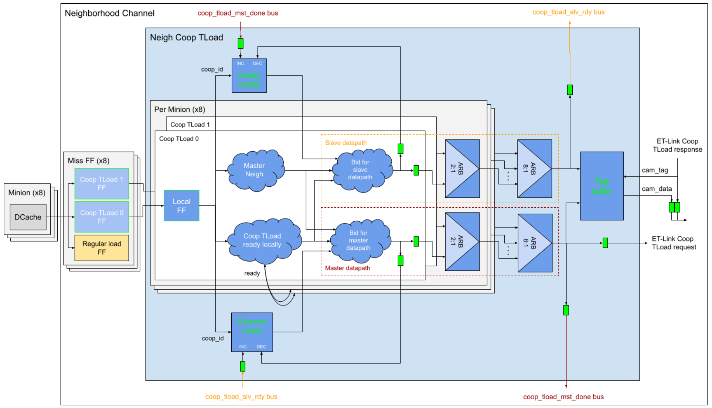
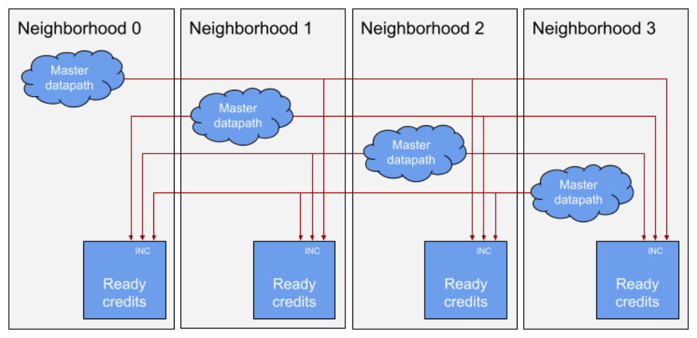

# Minion Shire Cooperative TensorLoad Description 

<u>Guillem Sole Ildefonso Gomariz</u> 

# Table of Contents 

|**1 Introduction**|4|
|---|---|
|**2 Overview**|5|
|**3 DCache TensorLoad**|6|
|**4 Neighborhood Cooperative TensorLoad**|8|
|4.1 Block Diagram|8|
|4.2 Ready Logic|10|
|4.3 Slave Datapath|11|
|4.3.1 coop_tload_slv_rdy Bus|12|
|4.4 Master Datapath|12|
|4.4.1 coop_tload_mst_done Bus|14|
|4.5 Tag Table|15|
|4.6 ET-Link Response|15|
|**5 Shire Cache**|17|
|**6 Glossary**|18|
|**7 References**|19|

# Revision History 

|**Versio** **n**|**Date**|**Author**|**Changes**|
|---|---|---|---|
|v0.1.0|2018.12.13|Guillem Sole|First version|
|v0.2.0|2021.06.02|Ildefonso Gomariz|Document fully reviewed and standardized|
|v0.2.1|2021.11.24|Jennie Weyant|Format and grammar review|

## 1 Introduction 

This document is intended to describe the Cooperative TensorLoad implementation within the Minion Shire in the A0 revision of the ET-SoC-1 device. 

This document is intended primarily for the members of the VLSI team in charge of designing and verifying the Minion (especially the DCache), the Neighborhood, and the Shire Cache, since the implementation of the Cooperative TensorLoad is distributed among all these modules. 

The microarchitecture of the Cooperative TensorLoad logic is detailed for each one of the containing modules. Special attention is paid to the Neighborhood section, where most of the Cooperative TensorLoad operation is implemented. 

## 2 Overview 

A TensorLoad (TLoad) is a pseudo-instruction encoded as a write to a Control and Status Register (CSR) that loads data from memory (bypassing the L1) into the L1 Scratchpad. It is part of the ET Tensor Extension. Refer to the Tensor Load Instructions section of the PRM: <u>Tensor Extension</u> for further details. 

The ET Tensor Extension also provides a cooperative variant of the TensorLoad operation that can be used when multiple Minions operate on the same data in parallel. When loading cooperatively, memory requests to the same memory location from multiple Minions are coalesced into a single request to provide better performance and power. The cooperative feature for TensorLoads is configured through the tensor_coop CSR. Refer to the <u>tensor_coop section of the PRM: Tensor Extension</u> for further details on the Cooperative TensorLoad configuration. 

## 3 DCache TensorLoad 

A Minion’s DCache contains two Finite State Machines (FSMs) that are able to perform Cooperative TensorLoads: 

- The Tensor Load 0 FSM implements the “regular” TensorLoad (download data into the L1 Scratchpad) 

- The Tensor Load 1 FSM implements the “TensorLoadSetupB” operation, which loads data directly to the VPU 

When an FSM receives a new Cooperative TLoad request, it starts sequencing cooperative read requests through the L2 ET-Link miss interface (refer to the <u>Cooperative Read section of the Shire Interconnect</u> - ET-Link Specification for further details). The request carries the following information: 

|**Field**|**Size**|**Contents**|
|---|---|---|
|id|4 bits|Miss ID|
|source|1 bit|Not used. Set to 1'b0|
|wdata|1 bit|1'b1|
|opcode|5 bits|REQ_ReadCoop (5'd3)|
|subopcode|7 bits|Not used. Set to 7'b0|
|address|40 bits|Physical Address to read from|
|data|20 bits|LSBs contain cooperative configuration: _data[7:0]_: Mask of cooperating Minions _data[15:8]_: Cooperative ID (5 bits) + sequence ID (3 bits) _data[19:16]_: Mask of cooperating Neighborhoods|
|size|3 bits|Requested data size (3'b110: 64 bytes)|
|qwen|4 bits|4'b0001|

_Table 1 - DCache Cooperative TLoad Request_ 

The Miss ID identifies which FSM and which operation within the FSM generated the request. It will be copied into the response and used to identify the destination of the data received. 

The cooperative ID is obtained from the GROUP field of the tensor_coop CSR and identifies a specific Cooperative TLoad operation. The sequence ID has 3 bits and identifies a specific request within a Cooperative TLoad operation. The cooperative ID and sequence ID together are used to fully identify a Cooperative TLoad request going to the L2 Shire Cache within the Shire. 

The masks of cooperating Minions and Neighborhoods are obtained from the MINIONS and NEIGHS fields of the tensor_coop CSR, respectively. 

The responses are received through the L2 ET-Link response interface and carry the following information: 

|**Field**|**Size**|**Contents**|
|---|---|---|
|id|4 bits|Miss ID|
|dest|1 bit|Not used. Set to 1'b0|
|wdata|1 bit|1'b1|
|opcode|2 bits|REP_AckData (2'd1)|
|data|512 bits|Read data|
|size|3 bits|Requested data size (3'b110: 64 bytes)|
|qwen|4 bits|4'b1111|

_Table 2 - DCache Cooperative TLoad Response_ 

Refer to the TensorLoad section of the <u>DCache Description for further details on the DCache’s</u> TensorLoad FSMs. 

## 4 Neighborhood Cooperative TensorLoad 

The main unit of the Cooperative TensorLoad logic is located in the Neighborhood. It allows Minions from all the Neighborhoods in a Shire to cooperate so that a single TensorLoad request is sent to memory. 

Cooperative TensorLoad requests from different Minions are sent to the Cooperative TensorLoad logic, where they are synchronized and combined into a single request. Additionally, the Cooperative TLoad units of the different neighborhoods within a Shire are interconnected so that only one of them will send the request to memory. 

### 4.1 Block Diagram 

The following figure shows a block diagram of the Neighborhood Cooperative TensorLoad unit: 

_Figure 1 - Neighborhood Cooperative TensorLoad block diagram_ 

### 4.2 Ready Logic 

The Neighborhood contains three Miss FF blocks per Minion, each receiving a different type of operation: 

- Regular loads: Cannot perform cooperative operations so no special logic is required; are sent directly to the arbitration logic in the Neighborhood 

- Coop TLoad 0: For cooperative TensorLoadSetupB operations 

- Coop TLoad 1: For regular cooperative TLoad operations (to the L1 Scratchpad) 

Both Coop TLoad 0 and Coop TLoad 1 Miss FF blocks send their requests to the Coop TLoad unit, where they are processed in parallel (i.e. the logic is replicated for both datapaths). 

For timing reasons, the Coop TLoad Miss FF blocks are replicated locally at the Coop TLoad logic input. The cooperative requests are kept there until they are processed, synchronized, and ready to be sent down the datapath. Each of these FFs supports a maximum throughput of one request every other cycle. 

The Coop TLoad logic first checks that all the cooperation partners within the Neighborhood have sent their requests. A Cooperative TLoad request is ready if all the Minions that are set in the Minion mask have sent a request with the same cooperative ID that is waiting in the corresponding Local FF. 

In parallel, the master Neighborhood is computed. The master Neighborhood will be the only one sending the request out to the L2 Shire Cache. Slave Neighborhoods will just wait for the response (that will be appropriately replicated by the L2 Shire Cache, see Shire Cache). The master Neighborhood is computed through a combination of the Neighborhood mask and bits [7:6] of the Physical Address. Below is a table to compute the master Neighborhood: 

|**Address[7:6]**|**Neighborhood Mask**|**Master Neighborhood**|
|---|---|---|
|2'b00|4'bxxx1|0|
||4'b1xx0|3|
||4'b0x10|1|
||4'b0100|2|
|2'b01|4'bxx1x|1|
||4'bxx01|0|
||4'bx100|2|
||4'b1000|3|
|2'b10|4'bx1xx|2|
||4'bx01x|1|
||4'b100x|3|
||4'b0001|0|
|2'b11|4'b1xxx|3|
||4'b01xx|2|
||4'b00x1|0|
||4'b0010|1|

_Table 3 - Master Neighborhood Computation_ 

The request will take a different datapath depending on whether the current Neighborhood is the master or not. 

### 4.3 Slave Datapath 

If the request is in a slave Neighborhood, it will _not_ be sent down the Neighborhood request datapath to the L2 Shire Cache. However, it still needs to send a “ready” notification to the master Neighborhood through the coop_tload_slv_rdy bus (see <u>coop_tload_slv_rdy Bus) and</u> store the transaction in the tag table so that the responses can find it (see <u>Tag Table).</u> 

There is an implicit credit scheme to send the “ready” notification between the Neighborhoods. Otherwise, a Neighborhood that is much further ahead of the others could send multiple “ready” messages, requiring every Neighborhood to have a large buffer to accumulate them. A request going through the slave datapath needs to check if there are available credits before it sends the notification. 

The **ready credits table** contains the available credits per cooperation ID. Each Neighborhood has three credits per cooperation ID after reset (i.e. it is a table of 32 entries of 2 bits each). Ready Coop TLoad requests within a slave Neighborhood check this table to determine whether they can send the “ready” notification to another Neighborhood. Both the Coop TLoad 0 and Coop TLoad 1 datapaths of every Minion share the ready credits table. Thus, it has 16 read ports and 19 write ports. Sixteen of the write ports come from the different Coop TLoad slave datapaths to decrement credits and the other three come from the coop_tload_mst_done bus to increment them back again (see coop_tload_mst_done Bus). 

For timing reasons, the credit counter within the ready credits table is decremented with a delay of one clock cycle after the credit is consumed. This delay will be acceptable as long as requests with the same cooperative ID never arrive in consecutive clock cycles. In principle, this is ensured since each Local FF has a throughput of one request every other cycle and all the requests with the same cooperative ID also share the same Minion mask (i.e. they arrive through the same Local FFs). 

The next step is arbitration. Potentially, each Minion may be performing a different cooperative operation (e.g. with Minions from other Neighborhoods) and might all be ready in the same cycle. There is a 2:1 Least Recently Used (LRU) arbiter per Minion that selects a request between Coop TLoad 0 and Coop TLoad 1 datapaths followed by a final 8:1 LRU arbiter to select the winner Minion. 

Finally, the winner request sends the “ready” notification through the coop_tload_slv_rdy bus and writes the transaction information into the tag table. 

The maximum throughput of the slave datapath is one request per clock cycle, and the minimum latency is three clock cycles, assuming that there are available credits to send the “ready” notification and available entries in the tag table. 

#### 4.3.1 coop_tload_slv_rdy Bus 

The **coop_tload_slv_rdy** bus is used by the slave Neighborhoods to send the “ready” notification to the master Neighborhood. Each Neighborhood has a single output bus that carries the following information: 

|**Field**|**Size**|**Description**|
|---|---|---|
|valid|1 bit|Valid notification|
|dest_neigh|2 bits|Notification destination Neighborhood (master)|
|coop_id|5 bits|Cooperative ID of the request that is ready in a slave Neighborhood|

_Table 4 - coop_tload_slv_rdy Bus_ 

Every Neighborhood has three input buses that come from each of the other Neighborhoods. When a valid “ready” notification comes in, it updates the corresponding counter of the external ready table (see <u>Master Datapath).</u> 

The following figure shows the interconnection of the Coop TLoad units of the different Neighborhoods through the coop_tload_slv_rdy buses. 

_Figure 2 - Neighborhood Interconnection Through the coop_tload_slv_rdy Buses_ 

### 4.4 Master Datapath 

If the request is in the master Neighborhood, it will be sent all the way down the Neighborhood request datapath to the L2 Shire Cache. A “done” notification will also be sent to the slave Neighborhoods through the coop_tload_mst_done bus (see coop_tload_mst_done bus) and store the transaction in the tag table so that the responses can find it (see <u>Tag table).</u> 

Before a request going through the master datapath is sent, it needs to check that all the slave Neighborhoods have already sent their “ready” notification, to ensure that the slave Neighborhoods will be ready when the response comes back. 

To achieve this, a Coop TLoad request that is ready within the master Neighborhood checks the **external ready table** . The external ready table contains three counters per cooperative ID (one per slave Neighborhood) that are set to ‘0’ upon reset. Each of the counters counts how many “ready” notifications have come from that Neighborhood, up to a maximum of three (i.e. it is a table of 32 entries with three counters of 2 bits each). When the counter is greater than 0 for all the external Neighborhoods set in the Neighborhood mask, the request is ready to arbitrate for access to the request interface. The external ready table is shared among the Coop TLoad 0 and Coop TLoad 1 datapaths of every Minion. Thus, it has 16 read ports and 19 write ports. Three of the write ports come from the coop_tload_slv_rdy bus to increment the respective counters (see <u>coop_tload_slv_rdy bus) and the other 16 come from the different</u> Coop TLoad master datapaths to decrement them back again. 

For timing reasons, the external “ready” notification counters within the external ready table are decremented with a delay of one clock cycle after the counter is checked. However,  this will only work as long as requests sharing the same cooperative ID never arrive in consecutive clock cycles. In principle, this is ensured since each Local FF has a throughput of one request every other cycle and all the requests with the same cooperative ID also share the same Minion mask (i.e. they arrive through the same Local FFs). 

The next step is arbitration. This is completely equivalent to the slave datapath. There is a 2:1 LRU arbiter per Minion that selects a request between the Coop TLoad 0 and Coop TLoad 1 datapaths followed by a final 8:1 LRU arbiter to select the winner Minion. 

Finally, the winner request is sent through the request interface, credits are sent back to the slave Neighborhoods through the coop_tload_mst_done bus, and the tag table is updated with the transaction information. 

The Coop TLoad request sent through the Neighborhood’s request datapath carries the following information: 

|**Field**|**Size**|**Contents**|
|---|---|---|
|id|8 bits|Tag|
|source|4 bits|ET_LINK_NEIGH_SRC_Coop (4'd12)|
|wdata|1 bit|1'b0: If there is no inter-Neighborhood cooperation 1'b1: If there is inter-Neighborhood cooperation|
|opcode|5 bits|REQ_Read (5'd1): If there is no inter-Neighborhood cooperation REQ_ReadCoop (5'd3): If there is inter-Neighborhood cooperation|
|subopcode|7 bits|Not used. Set to 7'b0|
|address|40 bits|Physical Address to read from|
|data|256 bits|Cooperative configuration: _data[7:0]_: Mask of cooperating Minions _data[15:8]_: Cooperative ID (5 bits) + sequence ID (3 bits) _data[19:16]_: Mask of cooperating Neighborhoods|
|size|3 bits|Requested data size(3'b110: 64 bytes)|

qwen 4 bits 4'b0000: If there is no inter-Neighborhood cooperation 4'b0001: If there is inter-Nei<mark>g</mark>hborhood coo<mark>p</mark>eration 

_Table 5 - Neighborhood Cooperative TLoad Request_ 

The tag sent in the _id_ field is composed of the cooperative ID + sequence ID, which fully identifies a Cooperative TLoad request going to the L2 Shire Cache within the Shire. It will be copied into the response and used to identify the destination of the data received. As all the Minions use the same cooperative ID + sequence ID pattern, both the master and the slave Neighborhoods can retrieve the transaction information from the tag table using the tag in the _id_ field (see <u>Tag table).</u> 

If there is inter-Neighborhood cooperation (i.e. if the Neighborhood mask has more than one active bit), a REQ_ReadCoop ET-Link request containing the Neighborhood mask in the _data_ field is sent (rather than a regular read request) so that the L2 Shire Cache can replicate the response to the appropriate Neighborhoods (see Shire Cache). 

The maximum throughput of the master datapath is one request per clock cycle, and the minimum latency is three clock cycles, assuming the following: the slave Neighborhoods have already sent the “ready” notification, there are available entries in the tag table, and there is no back pressure applied by the request interface. 

#### 4.4.1 coop_tload_mst_done Bus 

The **coop_tload_mst_done** bus is used by the master Neighborhood to return credits to the slave Neighborhoods. Each Neighborhood has one output bus that carries the following information: 

|**Field**|**Size**|**Description**|
|---|---|---|
|valid|3 bits|Valid notification per slave Neighborhood|
|coop_id|5 bits|Cooperative ID of the request that has been sent by a master Neighborhood|

_Table 6 - coop_tload_mst_done Bus_ 

This is a hot-mux-based bus, meaning the master Neighborhood can return a credit to more than one slave Neighborhood according to the Neighborhood mask. 

Every Neighborhood receives three input buses that come from the other Neighborhoods (each one only receives the valid bit corresponding to that Neighborhood). When a valid “done” notification comes in, it updates the corresponding entry of the ready credits table (see Slave <u>Datapath).</u> 

The following figure shows the interconnection of the Coop TLoad units of the different Neighborhoods through the coop_tload_mst_done buses: 

_Figure 3 - Neighborhood Interconnection Through the coop_tload_mst_done Buses_ 

### 4.5 Tag Table 

The **tag table** stores relevant information regarding the in-flight Coop TLoad transactions. The information is stored when a request is processed and is accessed when a Coop TLoad response is received so it can be properly broadcasted to the cooperating Minions (see ET- <u>Link Response). The tag table contains the following information:</u> 

|**Field**|**Size**|**Description**|
|---|---|---|
|tag|8 bits|Cooperative ID + sequence ID of the request. Sent in the_id_field of the ET-Link request to the L2 Shire Cache; used by the response to find the transaction entry|
|coop_min_mask|8 bits|Mask of cooperating Minions. Used by the response to know which Minions to broadcast the response to|
|min_miss_id|24 bits|Bits [2:0] of the Miss ID from the different Minions. Used to re-compose the_id_field of the ET-Link responses broadcasted to the cooperating Minions (bit 3 is common to all Coop TLoad requests)|

_Table 7 - Tag Table Contents_ 

The tag table contains 32 entries. As each DCache’s Cooperative TLoad FSM may have up to two outstanding operations, there can be a maximum of 32 outstanding Coop TLoad transactions in a Neighborhood at any given time. Therefore, a new request should always be able to find an available entry when trying to write to the table. 

The tag table has two write ports (one that comes from the slave datapath and the other from the master datapath) and one Content Addressable Memory (CAM) port for the responses to access the transaction information. 

### 4.6 ET-Link Response 

Coop TLoad responses received through a Neighborhood’s ET-Link response interface carry the following information: 

|**Field**|**Size**|**Contents**|
|---|---|---|
|id|8 bits|Tag|
|dest|4 bits|ET_LINK_NEIGH_SRC_Coop (4'd12)|
|wdata|1 bit|1'b1|
|opcode|2 bits|REP_AckData (2'd1)|
|data|512 bits|Read data|
|size|3 bits|Requested data size(3'b110: 64 bytes)|
|qwen|4 bits|4'b1111|

_Table 8 - Neighborhood Coop TLoad Response_ 

When a Coop TLoad response comes in, the tag obtained from the _id_ field is CAMed against the tag table. The matching entry is then read, the Minion mask plus the associated miss IDs are retrieved, and the entry is released. The Neighborhood will use the information retrieved to build and deliver the different responses for the corresponding cooperating Minions. 

## 5 Shire Cache 

When there is inter-Neighborhood cooperation (i.e. the Neighborhood mask has more than one active bit), the Shire Cache is in charge of broadcasting the L2 response to all the cooperating Neighborhoods. Inter-Neighborhood cooperation is detected by checking that the _opcode_ field of the ET-Link request is REQ_ReadCoop (5'd3) and the Neighborhood mask is obtained from bits [19:16] of the _data_ field of the request. 

Refer to the REQ_ReadCoop section of the Shire Cache Specification for further details on how inter-Neighborhood response broadcasting is implemented within the Shire Cache. 

## 6 Glossary 

|CAM|Content Addressable Memory|
|---|---|
|Coop|Cooperative|
|CSR|Control and Status Register|
|FF|Flip Flop|
|FSM|Finite State Machine|
|ID|Identifier|
|L#|Level (of a cache memory)|
|LRU|Least Recently Used|
|LSB|Least Significant Bit|
|PA|Physical Address|
|SW|Software|
|TLoad|TensorLoad|
|VPU|Vector Floating Point Unit|

## 7 References 

1. <u>ET-Link Specification</u> 

2. <u>DCache Description</u> 

3. <u>Shire Cache Specification</u> 

4. <u>Neighborhood Description</u> 

