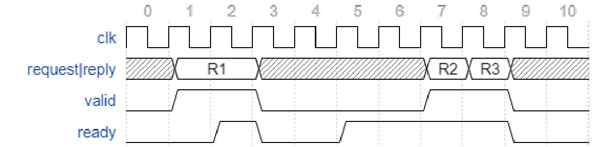
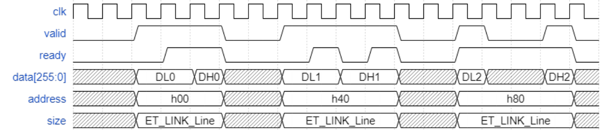
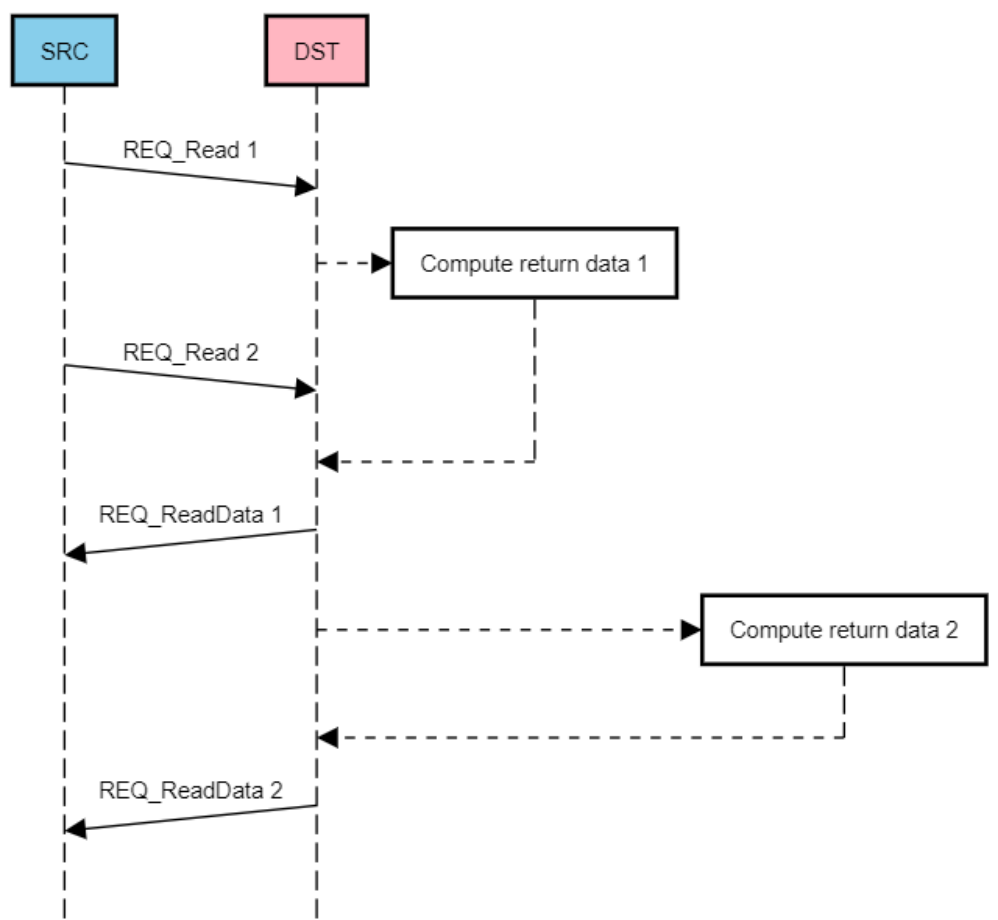
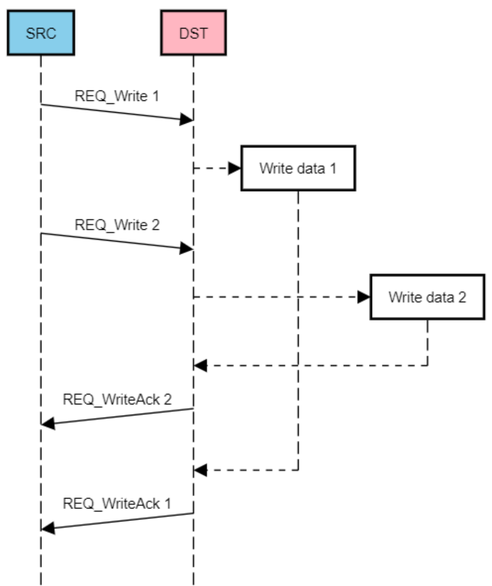
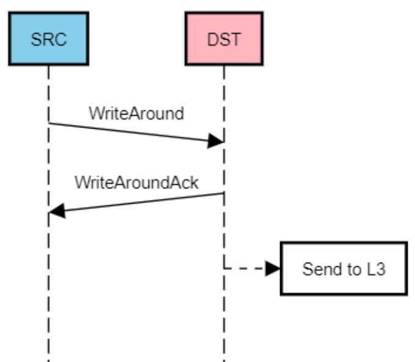
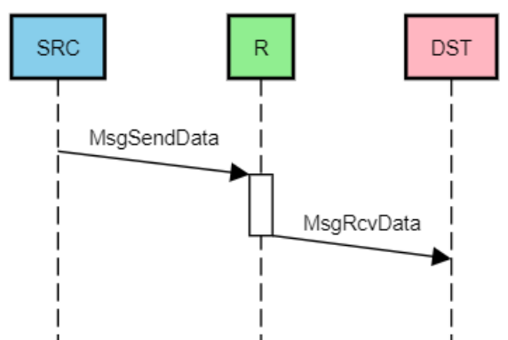

Shire Interconnect – ET-Link Specification 

<u>Sebastia Tortella Miquel Izquierdo Xavier Reves Ildefonso Gomariz</u> 

# Table of Contents 

|**1 Introduction**|5|
|---|---|
|**2 Overview**|6|
|2.1 Handshaking|6|
|2.1.1 Multiple Handshake Pairs|7|
|2.2 Supported Operations|7|
|**3 Request Channel Signals**|8|
|3.1 Id Field|10|
|3.2 Source Field|11|
|3.3 Multiple Cycle Requests|12|
|**4 Reply Channel Signals**|13|
|4.1 Id Field|13|
|4.2 Dest Field|14|
|4.3 Multiple Cycle Replies|14|
|**5 Operations**|16|
|5.1 Read Operation|16|
|5.2 Write Operation|17|
|5.3 WriteAround Operation|20|
|5.4 Cooperative Read|22|
|5.5 Messages|23|
|5.5.1 Message ID|24|
|5.6 Atomics|25|
|5.7 CacheOps|27|
|5.7.1 Flush|28|
|5.7.2 Flush to Memory|29|
|5.7.3 Evict|29|
|5.7.4 Evict to Memory|30|
|5.7.5 Lock|30|
|5.7.6 Unlock|30|
|5.7.7 Scratchpad Fill|31|
|5.7.8 Prefetch|31|
|5.8 Error Responses|32|
|**6 ET-Link Operations and Memory Map**|33|
|**7 Glossary**|34|
|**8 References**|34|

# Revision History 

|**Version**|**Date**|**Author**|**Changes**|
|---|---|---|---|
|v0.1.0|2018.04.19|Sebastià Tortella|First version|
|v0.2.0|2018.05.10|Sebastià Tortella|Changed req/rep opcodes and added_wdata_field Lock/unlock without way ScpFill: swapped PA and set+way (now in_data_ and_address_fields)|
|v0.3.0|2018.10.29|Xavier Revés|Updated spec after discussion about partial reads/writes|
|v0.4.0|2019.04.03|Miquel Izquierdo|Updated read/write opcodes|
|v0.5.0|2021.05.20|Ildefonso Gomariz|Document reviewed, old VM references removed and “ET-Link messaging protocols” section moved to a separate document|
|v0.5.1|2021.10.15|Ildefonso Gomariz|Format review|
|v0.5.2|2021.10.20|Jennie Weyant|Format and grammar review|

## 1 Introduction 

This document describes the ET-Link protocol implemented in the A0 revision of the ET-SoC-1 device. ET-Link is a bus protocol used to communicate between devices in the same Shire (for instance, a Minion requesting data to the L2 cache). 

The main intended users of this document are the members of the VLSI team in charge of implementing, using, and verifying the ET-Link buses throughout the design. The software (SW) team may also find it useful to know the different types of memory accesses available in the hardware (HW). Refer to the <u>PRM: Memory Map for further information on memory access.</u> 

In the following sections, the request and reply channels of the ET-Link bus are presented, and details regarding each of the available operations are provided. 

## 2 Overview 

The ET-Link protocol consists of two channels (request and reply), each of which is capable of transferring up to one 64-byte (512-bit) cache line per cycle. The communication between the Shire blocks _I_ (the initiator) and _T_ (the target) will typically follow this scheme: 

- _I_ sends a new request in the request Shire 

- The request is routed through arbiters, crossbars, and FIFOs until it reaches its destination ( _T_ ) 

- _T_ receives the request, processes it, and prepares the reply. It will either return data, or just an acknowledgement (ACK), or an error 

- _T_ sends the reply, which is routed again until it reaches _I_ 

### 2.1 Handshaking 

The request and reply channels use a pair of valid/ready signals to handshake a transfer so that both the source and destination can control the rate at which the information travels. Note that the source and destination do not refer to the initiator and target devices in the Shire, but rather to any interconnect element between the two. 

- When the valid signal is HIGH, the source is providing the request or reply information. ● When the ready signal is HIGH, the destination can accept the request or reply information. 

- Only when both the ready and valid signals are HIGH will the transfer be performed. In the next cycle, the source will then have to deassert valid or provide a new request/reply. 

- While valid is asserted, the transfer information must remain stable. 

- While it is not mandatory, it is good practice to: 

   - Once valid is asserted, keep it HIGH until the handshake finishes. 

   - Avoid dependencies between valid and ready signals. For instance, do not wait for ready to be HIGH before asserting the valid signal. 

The following figure shows a timing diagram of the handshake process for three transfers (R1, R2, and R3) that occur during cycles 2, 7, and 8, respectively. 

_Figure 1 - Timing Diagram of the Handshake Process_ 

#### 2.1.1 Multiple Handshake Pairs 

There can be more than one valid/ready pair in an interface. These pairs will share the request information. This is useful for saving pins in an interface and multiplexing different source/destination pairs on the common request pins. 

Since there is only one request bus, it is not possible for more than one valid/ready pair to handshake simultaneously. Therefore, different types of interfaces with multiple handshake pairs are defined as follows: 

- Type A: can have more than one “valid” signal simultaneously active, but only one “ready” signal active (multi-hot valid / 1-hot ready). 

- Type B: can have only one “valid” signal active, but more than one “ready” signal simultaneously active (1-hot valid / multi-hot ready). 

Two modules with the ET-Link interface can only be connected if both have the same interface type. 

### 2.2 Supported Operations 

The table below provides a list of the supported operations, including the request and reply opcodes that are used and a brief description of what they do. Note that the reply destination is the same as the request origin, except when using messages. 

|**Request Opcode**|**Reply Opcode**|**Description**|
|---|---|---|
|REQ_Read|RSP_AckData|Read operation. Request provides address + size, reply returns data.|
|REQ_Write|RSP_Ack|Write operation. Request provides address + size + data, reply returns ACK.|
|REQ_WriteAround|RSP_Ack|(Partial) write operation. Received by L2, but data destination is L3 cache.|
|REQ_ReadCoop|RSP_AckData|Cooperative read operation. Several initiators (Minions) provide the same address + size, an intermediate interconnect element (Neighborhood) combines them into one regular REQ_Read, reply returns data, which is distributed to all initiators.|
|REQ_MsgSendData|RSP_MsgRcvData|Direct message. Request provides data, reply provides data to the destination.|
|REQ_Atomic|RSP_AckData|Atomic operation. Request provides address + size + data, reply returns data.|
|REQ_Flush|RSP_Ack|If the line is dirty, writes back the cache line specified. The|
|||caches might keep a (clean) copy of the line. Request provides address + configuration, reply returns ACK.|
|REQ_FlushToMem|RSP_Ack|If the line is dirty, writes the cache line specified back from L3 to Memory. The caches might keep a (clean) copy of the line. Request provides address + data, reply returns ACK.|
|REQ_Evict|RSP_Ack|Invalidates a line, writing back if it is dirty. No copy of the line will end up in any cache. Request provides address + configuration, reply returns ACK.|
|REQ_EvictToMem|RSP_Ack|Invalidates a line from L3 to Memory. No copy of the line will end up in any cache. Request provides address + data, reply returns ACK.|
|REQ_Lock|RSP_Ack|Locks and zeroes a cache line. Request provides address, reply returns ACK.|
|REQ_Unlock|RSP_Ack|Unlocks a cache line. Request provides address + configuration, reply returns ACK.|
|REQ_ScpFill|RSP_Ack|Copies the contents of a line into the Scratchpad (SCP) cache. Request provides address + configuration, reply returns ACK.|
|REQ_Prefetch|RSP_Ack|Prefetches a line in a cache. Request provides address + configuration, reply returns ACK.|
|_Any_|RSP_Err|If something goes wrong, an error response may be returned to the origin for any request opcode (except REQ_MsgSendData) in place of the expected reply opcode.|

_Table 1 - Supported Operations_ 

## 3 Request Channel Signals 

The following table shows the signals used to configure a request transaction: 

|**Name**|**Type**|**Description**|
|---|---|---|
|id|Variable width vector|Transaction identifier. Each agent will use this field to store any information that needs to be copied in the reply in order to identify it among other outstanding transactions and handle it properly. It is unused in messages, as it may get lost when routing a message to another Shire. See the Id Field section below for details.|
|source|Variable width vector|Source identifier. Encodes all the agents that can be hanging from the same bus. It is used by intermediate interconnect elements (e.g. Neighborhood) to know where to route the reply. The source encoding will be specific to the element hanging from the bus. Agents connected to the bus that are alone within a specific location may not use this field when sending requests to Memory. It is unused in messages, as it may get lost when routing a message to another Shire. See the Source Field section below for details.|
|wdata|1 bit|Request carries data|
|opcode|5-bit vector|5'd0: REQ_Write 5'd1: REQ_Read 5'd2: REQ_WriteAround 5'd3: REQ_ReadCoop 5'd4: REQ_MsgSendData 5'd5: REQ_Atomic 5'd8: REQ_Flush 5'd9: REQ_FlushToMem 5'd10: REQ_Evict 5'd11: REQ_EvictToMem 5'd12: REQ_Lock 5'd13: REQ_Unlock 5'd14: REQ_ScpFill 5'd15: REQ_Prefetch other: Reserved, should not be used|
|subopcode|7 bits|Additional codes to further specify the operation to be performed. It is used currently only for the following: REQ_Atomic to specify the operation to be performed, REQ_WriteAround to specify the cooperation ways, and REQ_Write/REQ_Read opcodes to specify the write/read_cache bits.|
|address|40-bit vector|Physical Address|
|data|Variable width vector|Up to 64B of data, in steps of powers of 2. In write operations (Writes and WriteArounds), and for any data size, valid data in the transfer will be aligned to the address offset within the data size. The_data_field will be aligned to the data width boundary (1). It is also used in certain CacheOps and cooperative reads to configure the operation.|
|size|3-bit vector (3)|3'bx000: 1 byte (8 bits) 3'bx001: 2 bytes (16 bits) 3'bx010: 4 bytes (32 bits) 3'bx011: 8 bytes (64 bits) 3'bx100: 16 bytes (128 bits) 3'bx101: 32 bytes (256 bits) 3'bx110: 64 bytes (512 bits) 3'bx111: Not used|
|||For CacheOps, set the size to the next power of 2 that is greater than or equal to the number of bytes used in the_data_field. The CacheOps always operate on full cache lines.|
|qwen|4-bit vector|Write mask (quadword enable). Each bit corresponds to one of the four 128-bit lanes in the_data_field. When high, the corresponding lane has valid data to be written. If low, the corresponding lane does not have to be written in the destination (2).|

_Table 2 - Request Channel Signals_ 

1. For instance: **a)** with a 512-bit data interface, an operation with _address[5:0]_ =32 and _size_ 128 bits ( _qwen_ =4'b0100) will have valid data in _data[383:256]_ . **b)** With a 256-bit data interface, an operation with _address[4:0]_ =4 and _size_ 32 bits ( _qwen_ =4'b0001) will have valid data in _data[63:32]_ . 

2. The Shire Cache will be able to merge writes (e.g. merging 128b writes with offset 0 and 32 will result in a mask 4'b0101). For these cases, the _size_ field may be inconsistent and the _qwen_ configuration must prevail. 

### 3.1 Id Field 

The contents of the _id_ field in the request configuration are variable and depend on the initiator, as shown in the following tables. If the _id_ field of a specific connection contains more bits than those indicated in the tables, the Most Significant Bits (MSBs) will be padded with zeros. 

If the request comes from a Minion’s DCache: 

|**Name** miss_id|**Type** 4-bit vector|**Description** Miss id, indicating which of the submodules the request is coming from|
|---|---|---|

_Table 3 - Minion’s DCache Id Field_ 

If the request is a read generated from combined cooperative reads coming from several initiators: 

|**Name**|**Type**|**Description**|
|---|---|---|
|tag|8-bit vector|Tag identifying the cooperative read. It is composed of the coop_id (5 bits) plus a sequence_id_that identifies the line within a cooperative operation (3 bits).|
|||Each output transaction can correspond to more than one Minion, but that is handled internally in the Neighborhood.|

_Table 4 - Cooperative Read Id Field_ 

If the request comes from the ICache, this field is unused. 

If the request comes from Mesh (L2 request to L3 slave): 

|**Name**|**Type**|**Description**|
|---|---|---|
|id|10 bit|{UC, bank_id, L2 request queue id}|

_Table 5 - Mesh Id Field_ 

### 3.2 Source Field 

The encoding of the _source_ field in the request configuration is specific to the element hanging from the bus. If the request comes from a final agent (Minion...) this field may be unused. If the _source_ field of a specific connection contains more bits than those indicated in the tables, the MSBs will be padded with zeros. 

If the request comes from a Neighborhood, it needs to encode eight Minions plus other blocks, such as the ICache and Page Table Walkers (PTWs): 

|**Name**|**Type**|**Description**|
|---|---|---|
|source|4-bit vector|4'd0: Minion 0 4'd1: Minion 1 4'd2: Minion 2 4'd3: Minion 3 4'd4: Minion 4 4'd5: Minion 5 4'd6: Minion 6 4'd7: Minion 7 4'd8: ICache 4'd9: PTW 0 4'd10: PTW 1 4'd11: Tbox1 4'd12: Cooperative TensorLoad|

_Table 6 - Neighborhood Source Field_ 

If the request comes from Mesh (L2 request to L3 slave): 

|**Name**|**Type**|**Description**|
|---|---|---|
|source|7-bit vector|Mesh source master, indicating physical master source port|

_Table 7 - Mesh Source Field_ 

1 Graphics logic is unused in A0 

### 3.3 Multiple Cycle Requests 

The request _data_ signal can be up to 512 bits, but smaller data sizes are allowed in the interfaces. 

When the _size_ signal indicates a larger transfer than the _data_ signal width, the transfer can be completed using multiple cycles. 

During the transfer cycles necessary to complete the total transfer bits, all signals except _data_ will keep the same value. Each cycle has to be handshaked with the valid/ready signals. However, the “multiple handshake pairs” case is one exception to this rule. Since the request bus is shared in this case, handshaking is possible for different pairs. The content of the bus may thus change. 

When the _data_ signal is already 512 bits, all the transfers are completed in a single cycle. 

If an instance that supports/uses multiple-cycle transfers has to be connected to another instance that does not support it, an appropriate bridge has to be inserted between them. This is similar to the case in which the interface of one instance has a _data_ width larger than the interface of another instance, as this also requires an appropriate bridge to connect them. 

A transfer that is completed in multiple cycles will receive only one reply. 

An example of a multi-cycle waveform is shown in the figure below. An interface of 256 bits wants to transfer 512 bits. This is accomplished in two cycles. During the first cycle, the lower 256 bits are transferred and during the second cycle, the remaining upper 256 bits are transferred. While it is not necessary for handshaking with valid/ready signals to be on consecutive clocks, no other transaction can land in the middle of an inflight transaction. 

_Figure 2 - Multicycle Requests_ 

## 4 Reply Channel Signals 

The following table provides a description of the signals used in a reply transaction: 

|**Name**|**Type**|**Description**|
|---|---|---|
|id|Variable width vector|Transaction identifier. It will have the same contents as the_id_field in the corresponding request, except for messages. See Id Field below for details.|
|dest|Variable width vector|Destination identifier. It will have the same contents as the_source_field in the corresponding request, except for messages. See Dest Field below for details.|
|wdata|1 bit|Reply carries data|
|opcode|2-bit vector|2'd0: RSP_Ack 2'd1: RSP_AckData 2'd2: RSP_MsgRcvData 2'd3: RSP_Err|
|data|Variable width vector|Up to 64B of data, in steps of powers of 2. In replies to read and atomic operations (AckData), and for any data size, valid data in the transfer will be aligned to the request address offset within the data size. The_data_field is aligned to the data size boundary(1).|
|size|3-bit vector (3)|3'b000 1 byte (8 bits) 3'b001 2 bytes (16 bits) 3'b010 4 bytes (32 bits) 3'b011 8 bytes (64 bits) 3'b100 16 bytes (128 bits) 3'b101 32 bytes (256 bits) 3'b110 64 bytes (512 bits) 3'b111 Not used|
|qwen|4-bit vector|Read mask (quadword enable). Each bit corresponds to one of the four 128-bit lanes in_data_. When high, the corresponding lane has valid data to be read. If low, the corresponding lane does not have to be read in the destination.|

_Table 8 - Reply Channel Signals_ 

3. Size is ignored when wdata==0 

### 4.1 Id Field 

The _id_ field of the reply configuration will typically have the exact same contents as the _id_ field in the request transaction corresponding to the reply, except for messages. 

When the reply opcode is REP_MsgRcvData, the Message ID is extracted from the request address and copied into the reply _id_ , as shown in the following table (see <u>Message ID</u> for details): 

|**Name**|**Type**|**Description**|
|---|---|---|
|message_id|8-bit vector|Message ID extracted from bits 10:3 of the request address|

_Table 9 - Message Reply Id Field_ 

### 4.2 Dest Field 

The _dest_ field of the reply configuration will typically have the exact same contents as the _source_ field in the request transaction corresponding to the reply, except for messages. 

When the reply opcode is REP_MsgRcvData, the destination must be generated from the address of the request configuration. In this case, the encoding of the _dest_ field in the reply configuration is specific to the element hanging from the bus, and the last interconnect element must be aware of that encoding in order to generate a correct reply. If the reply goes to a final agent (Minion…) this field may be unused. 

If the message reply goes to a Neighborhood, it needs to encode 16 harts (8 Minions and 2 threads per Minion). The other agents in the Neighborhood (ICache, PTWs…) will never receive messages. 

|**Name**|**Type**|**Description**|
|---|---|---|
|min_id|3-bit vector|Minion identifier|
|thread_id|1 bit|Thread identifier|

_Table 10 - Message Reply Dest Field_ 

### 4.3 Multiple Cycle Replies 

Similarly to what occurs with requests, when a reply contains data and the “data” signal in the interface is smaller than the transfer size, multiple cycles can be used to complete the data transfer. 

The same rules from the Multiple Cycle Requests section apply here. Appropriate bridges have to be provided for the cases in which the two interfaces have different bits in the “data” signal or different capacities regarding multiple cycle transfers. 

When the “data” signal is already 512 bits, all the transfers are completed in a single cycle. 

## 5 Operations 

### 5.1 Read Operation 

The request configuration set by the source device is: 

|**Name**|**Description**|
|---|---|
|id|Transaction identifier|
|source|Source identifier|
|wdata|1'b0|
|opcode|REQ_Read (5'd1)|
|subopcode|Specify, ls-aligned, the read_cache bit(0=L2/SCP, 1=L3)|
|address|Physical address to read from|
|data|_Unused_|
|size|Requested data size|
|qwen|4'b0000|

_Table 11 - Read Request_ 

By looking at the _address_ , _opcode,_ and _subopcode_ fields, the request will be routed to the destination device, traversing the necessary FIFOs, arbiters, crossbar switches, and any other interconnect elements. 

Note that the destination can be a local or a remote Shire Cache Scratchpad region. This is determined through the address. An address pointing to a Scratchpad region that does not exist for the present Shire Cache mode will return a decode error (see Error Responses). 

Once the request reaches the destination device, it will compute or generate the return data and prepare the reply, with the following signals: 

|**Name**|**Description**|
|---|---|
|id|Same as_id_in the request|
|dest|Same as_source_in the request|
|wdata|1'b1|
|opcode|RSP_AckData (2'd1)|
|data|Read data|

Data is always address-aligned within the interface data width 

size Same as _size_ in the request qwen Quadword read mask for each of the 128-bit words. If any of the bytes within each 128-bit word is used, the corresponding bits must be set according to the request address and size. _Table 12 - Read Reply_ 

By looking at the _dest_ field, the reply will be routed to the source device, traversing the necessary FIFOs, arbiters, and any other interconnect elements. Note that the replies might come in a different order to that of the requests. 

The following figure shows the timing sequence of a device _SRC_ reading twice from _DST_ : 

_Figure 3 - Timing Diagram of a Read Operation_ 

### 5.2 Write Operation 

The request configuration set by the source device is: 

|**Name**|**Description**|
|---|---|
|id|Transaction identifier|
|source|Source identifier|
|wdata|1'b1|
|opcode|REQ_Write (5'd0)|
|subopcode|Specify, ls-aligned, the write_cache bit(0=L2/SCP, 1=L3)|
|address|Physical address to write to|
|data|Data to write Data is always address-aligned within the interface data width|
|size|Size of written data|
|qwen|Quadword write mask for each of the 128-bit words. If any of the bytes within each 128-bit word is used, the corresponding bits must be set according to the address and size.|

_Table 13 - Write Request_ 

Once the request reaches the destination device, it will perform the write operation. 

Note that the destination can be a local or a remote Shire Cache Scratchpad region. This is determined through the address. An address pointing to a Scratchpad region that does not exist for the present Shire Cache mode will return a decode error (see Error Responses). 

Once the write operation is performed, the reply is sent: 

|**Name**|**Description**|
|---|---|
|id|Same as_id_in the request|
|dest|Same as_source_in the request|
|wdata|1'b0|
|opcode|RSP_Ack (2'd0)|
|data|_Unused_|
|size|_Unused_|
|qwen|4'b0000|

_Table 14 - Write Reply_ 

The following figure shows the timing sequence of a device _SRC_ writing twice in _DST_ (note that in this example, the reply order is not the same as the request order): 

_Figure 4 - Timing Diagram of a Write Operation_ 

### 5.3 WriteAround Operation 

This operation is only used when data is to be written to either the L3 cache or a remote Scratchpad using the L2 Coalescing Buffer (CB). The writes will typically be partial (not all the words are valid). Once one or more WriteArounds write all the bits of a cacheline, the CB will write it to the corresponding L3 or remote Scratchpad, which will address it appropriately. 

Data might also be written for a non-complete cacheline in the case of a capacity eviction in the CB (too many partial cachelines in flight in the CB). Software is responsible for flushing the CB to guarantee that all the writeArounds find their destinations. 

|**Name**|**Description**|
|---|---|
|id|Transaction identifier|
|source|Source identifier|
|wdata|1'b1|
|opcode|REQ_WriteAround(5'd2)|
|subopcode|Used to differentiate the cooperative ways. Only 2 Least Significant Bits (LSBs) are meaningful. WriteAround (7'bxxxxx00): No cooperation (1 way) WriteAround2Way (7'bxxxxx01): 2-way cooperative WriteAround4Way (7'bxxxxx10): 4-way cooperative|
|address|Physical Address to write to|
|data|Data to write Data is always address-aligned within the interface data width|
|size|Size of written data|
|qwen|Quadword write mask for each of the 128-bit words. If any of the bytes within each 128- bit word is used, the corresponding bits must be set according to the address and size.|

_Table 15 - Write Around Request_ 

Once the request reaches the L2, it will send the reply. This means the acknowledgment is not sent when the L2 sends the data to the L3 or once it has been effectively written in the L3, but rather, when the L2 has queued it in the CB. A full description of the additional synchronization mechanisms that have been put in place to deal with this is out of the scope of this document. 

Apart from regular write arounds, there are two variants (specified in the subopcode) that are handled internally by an intermediate interconnect element (e.g. Neighborhood), which merges independent stores sent by several agents (e.g. Minions) that want to write less than 512 bits that go to the same cache line. The reply must be routed to every cooperating agent. The 2-way option joins two separate 128-bit transfers into a single 256-bit transfer or joins two separate 256-bit 

transfers into a single 512-bit transfer. The 4-way option joins four separate 128-bit transfers into a single 512-bit transfer. 

For simplicity of design, an agent might generate a WriteAround directed to the local L2 Scratchpad. However, L2 is not required to support this case (a write collected by the CB which has to be written locally). Therefore, the interconnect element (e.g. Neighborhood) must ensure that the operation is converted into a regular write before reaching the L2. 

The _reply_ fields take the following values: 

|**Name**|**Description**|
|---|---|
|id|Same as_id_in the request|
|dest|Same as_source_in the request|
|wdata|1'b0|
|opcode|REP_Ack (2'd0)|
|data|_Unused_|
|size|_Unused_|
|qwen|4'b0000|

_Table 16 - Write Around Reply_ 

See the following figure for an example timing sequence: 

_Figure 5 - Timing Diagram of a WriteAround Operation_ 

### 5.4 Cooperative Read 

The cooperative read is similar to the read operation, but is used when several agents (e.g. Minions) want to read the same data from L2. This will be handled internally by an intermediate interconnect element (e.g. Neighborhood), which combines all the cooperative reads into one regular read to L2. The reply must be routed to every cooperating agent. 

Two levels of cooperative read operations are considered. The first is at the Neighborhood level and involves the cooperation of several Minions. The second is at the Shire level and involves the cooperation of several Neighborhoods (with or without cooperation inside the Neighborhood). 

The request is: 

|**Name**|**Description**|
|---|---|
|id|Transaction identifier|
|source|Source identifier|
|wdata|1'b1|
|opcode|REQ_ReadCoop (5'd3)|
|subopcode|Not used. Set to 7'b0|
|address|Physical address to read from|
|data|LSBs contain cooperative configuration: _data[7:0]_: Mask of cooperating Minions _data[15:8]_: Cooperative load identifier _data[19:16]_: Mask of cooperating Neighborhoods|
|size|Requested data size|
|qwen|4'b0001|

_Table 17 - Cooperative Read Request_ 

The reply is: 

|**Name**|**Description**|
|---|---|
|id|Same as_id_in the request|
|dest|Same as_source_in the request|
|wdata|1'b1|
|opcode|REP_AckData (2'd1)|
|data|Read data Data is always address-aligned within the interface data width|

size Same as _size_ in the request qwen Quadword read mask for each of the 128-bit words. If any of the bytes within each 128-bit word is used, the corresponding bits must be set according to the request address and size. 

_Table 18 - Cooperative Read Reply_ 

### 5.5 Messages 

The request configuration set by the source device is: 

|**Name**|**Description**|
|---|---|
|id|_Unused (although it may be filled for debugging purposes)_|
|source|_Unused (although it may be filled for debugging purposes)_|
|wdata|1'b1|
|opcode|REQ_MsgSendData (5'd4)|
|subopcode|Not used. Set to 7'b0|
|address|Physical Address to send the message to. It may correspond to a port or be a special address reserved for messaging. The bits 10:3 contain the Message ID. See Message ID section below for details|
|data|Message data, placed in the LSBs|
|size|Regular 3-bit coded size of message data, any defined size|
|qwen|Quadword write mask for each of the 128-bit words. If any of the bytes within each 128- bit word is used, the corresponding bits must be set according to the address and size. _Table 19 - Message Request_|

There is no ACK nor reply to the source device. The destination device will receive a message in the reply channel with: 

|**Name**|**Description**|
|---|---|
|id|Message ID, extracted from bits 10:3 of the_address_in the request. See Message ID section below for details|
|dest|Destination identifier, obtained from the_address_in the request|
|wdata|1'b1|
|opcode|REP_MsgRcvData(2'd2)|
|data|Same as_data_in the request|
|size|Same as_size_in the request|

qwen Same as _qwen_ in the request 

_Table 20 - Message Reply_ 

The reply is generated somewhere in the interconnect in a block _R_ , which can be: 

- Within the Neighborhood for messages between Minions of the same Neighborhood. 

- 

   - In the L2 for messages between Minions of the same Shire but different Neighborhoods. 

- In the UC block of the destination Shire for messages between Minions of different Shires. 

_Figure 6 - Timing Diagram of a Message Operation_ 

#### 5.5.1 Message ID 

The messaging address space defines a set of ports that can be addressed in each agent as well as other reserved addresses that can be used to send special messages (e.g. by dedicated hardware protocols). This set of message addresses containing the port id and other information is codified in bits 10:3 of the address and is known as the Message ID. 

The Message ID is extracted from the _address_ of the message request and then copied into the reply _id_ . 

If the target is a Minion, it supports four regular message ports as well as some other reserved addresses for reduce and Texture Box (Tbox) operations,2 as follows: 

|**Message ID**|**Description**|
|---|---|
|8'b000pp000|Message addressed to a regular port. It contains the following subfields: port_p[1:0]_: Port id|
|8'b100ppv00|Tbox texture reply message. It accesses the same ports as the messages addressed to regular ports. It contains the following subfields: port_p[1:0]_: Port id valid_v_: Valid data. Used by Tbox to indicate that returned data is valid|

2 Graphics logic is unused in A0 

|8'b11000000|Reduce ready message|
|---|---|
|8'b11000100|Reduce data message|
|8'b11001000|Texture pull message|

_Table 21 - Message ID for Minions_ 

### 5.6 Atomics 

The ET atomic extension adds scalar and vector atomic instructions. Atomic operations are defined as either local or global. Local operations bypass the L1 DCache of the Minion cores and operate on values directly in the L2 cache. Global operations bypass the L1 DCache and the L2 cache and operate on the L3 cache or the L2 Scratchpad directly. Refer to the <u>PRM: Atomic Extension for further information on atomic operations.</u> 

The request configuration set by the source device is: 

|**Name**|**Description**|
|---|---|
|id|Transaction identifier|
|source|Source identifier|
|wdata|1'b1|
|opcode|REQ_Atomic (5'd5)|
|subopcode|Use the value of conf[6:0] shown in the table at the end of this section|
|address|Address of the first operand|
|data|Data carries the operands which are always aligned to the LSBs, independent of the address. Scalar32/Scalar64 operands are zero extended through qword 0. SIMD/vector operands are 256-bit so they completely fill qword 0 and qword 1.|
|size|3'bx010: 4 bytes (32 bits) 3'bx011: 8 bytes (64 bits) 3'bx101: 32 bytes (256 bits) The atomic request will always set the size to that of the atomic operation. There is no special case for the compare exchange atomic operation, which carries two operands; scalar32 will set the size to 4 bytes even though there is a total of 8 bytes of data with two operands and scalar64 will set the size to 8 bytes even though there is a total of 16 bytes of data with two operands. All atomic operands are zero extended as mentioned above.|
|qwen|Quadword write mask for each of the 128-bit words. If any of the bytes within each 128-bit word is used, the corresponding bits must be set according to the address and size. In this case, valid values for qwen are only 4'b0001 and 4'b0011.|

_Table 22 - Atomic Request_ 

The reply is: 

|**Name**|**Description**|
|---|---|
|id|Same as_id_in the request|
|dest|Same as_source_in the request|
|wdata|1'b1|
|opcode|REP_AckData (2'd1)|
|data|Returned data aligned, just as in any other regular REQ_Read operation|
|size|Regular 3-bit coded size of returned data|
|qwen|Quadword read mask for each of the 128-bit words. If any of the bytes within each 128-bit word is used, the corresponding bits must be set according to the address and size.|

_Table 23 - Atomic Reply_ 

The reply size will be 5 (32B) for vector/SIMD operations, 3 (8B) for 64b scalar operations, and 2 (4B) for 32b scalar operations. The response data will be the original read data before the operations selected by address bits [5:0]. The response data will be address-aligned and zero extended. 

The operation to perform is determined by the content of subopcode[6:0]=conf[6:0], as shown in the following table: 

|**ET Atomic Extensions**|**conf[3:0]** **(Atomic** **Opcode)**|**conf[4]** **(sc_vec)** **0=scalar** **1=vector**|**conf[5]** **(s=size)** **0=32b** **1=64b**|**conf[6]** **(d=destination)** **0=L2** **1=L3**|
|---|---|---|---|---|
|amoswap[G/L].w/d (32b/64b)|0|0|s|d|
|amoadd[G/L].w/d (32b/64b)|1|0|s|d|
|amoxor[G/L].w/d (32b/64b)|2|0|s|d|
|amoand[G/L].w/d (32b/64b)|3|0|s|d|
|amoor[G/L].w/d (32b/64b)|4|0|s|d|
|amomin[G/L].w/d (32b/64b)|5|0|s|d|
|amomax[G/L].w/d (32b/64b)|6|0|s|d|
|amominu[G/L].w/d (32b/64b)|7|0|s|d|
|amomaxu[G/L].w/d (32b/64b)|8|0|s|d|
|amocmpswp[G/L].w/d (32b/64b)|11|0|s|d|
|famoswap[G/L].pi (8xsc32b)|0|1|N/A|d|
|famoadd[G/L].pi (8x32b)|1|1|N/A|d|
|famoxor[G/L].pi (8x32b)|2|1|N/A|d|
|famoand[G/L].pi (8x32b)|3|1|N/A|d|
|famoor[G/L].pi (8x32b)|4|1|N/A|d|
|famomin[G/L].pi (8x32b)|5|1|N/A|d|
|famomax[G/L].pi (8x32b)|6|1|N/A|d|
|famominu[G/L].pi (8x32b)|7|1|N/A|d|
|famomaxu[G/L].pi (8x32b)|8|1|N/A|d|
|famomin[G/L].ps (8x32b)|9|1|N/A|d|
|famomax[G/L].ps (8x32b)|10|1|N/A|d|

_Table 24 - Atomic Configuration_ 

Note the following: 

- For the ET atomic extensions: 

   - The “L” specifies local opcodes and the target destination is L2, while the “G” specifies global opcodes and the target destination is L3. The target destination will be specified by conf[6]. 

   - The w/d specifies word(32b) or dword(64b). 

   - The .pi and .ps specify packed integer and packed single, respectively. 

   - This does not support the “A” extension available in RISC-V. 

   - There is no support for LR/SC. 

   - There are no “fire and forget” atomics. All atomics will return an ACK with data. The data will be the previous data read from the L2 or L3 based on the address and size of the atomic. The data will be returned ls-aligned and zero extended. 

- Conf[3:0] determines the operation. 

- Conf[4] determines if the operation is scalar (32/64b) or vector/SIMD (32x4). 

- Conf[5] is only used for scalar operations and distinguishes between 32b scalar and 64b scalar operations: 

   - 32b (0) or 64b (1) 

- Conf[6] determines the destination level where the operation is performed: 

   - L2 (0) or L3 (1) 

### 5.7 CacheOps 

All these CacheOps are only used by the Minions when communicating with the L2 cache. 

The request configuration is as follows: 

|**Name**|**Description**|
|---|---|
|id|Transaction identifier|
|source|Source identifier|
|wdata|CacheOp carries either configuration or actual data in the_data_field|
|opcode|Cache operation codes|
|subopcode|Not used. Set to 7'b0|
|address|For Scratchpad fill: Physical Address in the Shire Cache Scratchpad memory region where the requested line is stored For other CacheOps: Physical Address referring to the line to operate with|
|data|LSBs contain CacheOp configuration or data|
|size|Uses the same encoding as REQ_Read, set to the next power of 2 greater than or equal to the number of bytes used in the_data_field if configuration is transported, or data size if data is transported|
|qwen|Quadword write mask for each of the 128-bit words|

_Table 25 - CacheOp Request_ 

The L2 will send the following reply once the operation is completed: 

|**Name**|**Description**|
|---|---|
|id|Same as_id_in the request|
|dest|Same as_source_in the request|
|wdata|1'b0|
|opcode|REP_Ack (2'd0)|
|data|_Unused_|
|size|_Unused_|
|qwen|4'b0000|

_Table 26 - CacheOp Reply_ 

The supported cacheOps are defined in the following sections. Only fields of the request with specific values are specified. 

#### 5.7.1 Flush 

|**Name**|**Description**|
|---|---|
|wdata|1'b1|
|opcode|REQ_Flush (5'd8)|
|data|_data[4:3]_: Start Level (00=L1, 01=L2, 10=L3) _data[6:5]_: Destination level (01=L2, 10=L3, 11=MEM)|
|size|0 (1B)|
|qwen|4'b0001|

_Table 27 - Flush Request_ 

If the line is dirty, the flush cacheOp writes the cache line specified in the _address_ field back from start to destination level. The caches might keep a (clean) copy of the line. 

#### 5.7.2 Flush to Memory 

|**Name**|**Description**|
|---|---|
|wdata|1'b1|
|opcode|REQ_FlushToMem (5'd9)|
|data|Data to write|
|size|6 (64B)|
|qwen|4'b1111|

_Table 28 - Flush to Memory Request_ 

Similarly to the flush, if the line is dirty, the flush to Memory writes the cache line specified in the _address_ field back from L3 to Memory. However, it transports the data with it. The caches might keep a (clean) copy of the line. 

#### 5.7.3 Evict 

|**Name**|**Description**|
|---|---|
|wdata|1'b1|
|opcode|REQ_Evict (5'd10)|
|data[4:3]|Start Level (00=L1, 01=L2, 10=L3)|
|data[6:5]|Destination level (01=L2, 10=L3, 11=MEM)|
|size|0 (1B)|
|qwen|4'b0001|

_Table 29 - Evict Request_ 

The evicted line is invalidated from start to destination level and written back if it is dirty. No copy of the line will end up in any cache. 

#### 5.7.4 Evict to Memory 

|**Name**|**Description**|
|---|---|
|wdata|1'b1|
|opcode|REQ_EvictToMem (5'd11)|
|data|Data to write|
|size|6 (64B)|
|qwen|4'b1111|

_Table 30 - Evict to Memory Request_ 

Similar to the evict, the evicted line is invalidated from L3 to Memory. However, the data is transported with the cacheOp. No copy of the line will end up in any cache. 

#### 5.7.5 Lock 

|**Name**|**Description**|
|---|---|
|wdata|1'b0|
|opcode|REQ_Lock (5'd12)|
|data|_Unused_|
|size|_Unused_|
|qwen|4'b0000|

_Table 31 - Lock Request_ 

The lock cacheOp locks and zeroes the cache line specified in the _address_ field. If the line is already in the cache, the line gets locked and the zero bit gets set in the TAG state. If the line is not in the cache, then the line is installed without a fill, locked, and the zero bit is set. Any resulting victim is written back if it’s dirty. 

If software attempts to lock the last way, an error status will be returned. No line will be installed into the cache. 

#### 5.7.6 Unlock 

|**Name**|**Description**|
|---|---|
|wdata|1'b1|
|opcode|REQ_Unlock (5'd13)|
|data[3]|Final state: 1'b0: Invalidate the line, no writeback necessary|
||1'b1: Keep the line in the cache unlocked|
|size|0 (1B)|
|qwen|4'b0001|

_Table 32 - Unlock Request_ 

The unlock cacheOp unlocks the cache line specified in the _address_ field. If the cache line is not locked, the unlock cacheOp has no effect. If the cache line is locked, the "final state" bit corresponds to the valid bit after the unlock is successful. If the final state is 1, the line is kept in the cache and only the lock bit is cleared. If the final state is 0, the line will be invalidated and no Write Back will occur. 

#### 5.7.7 Scratchpad Fill 

|**Name**|**Description**|
|---|---|
|wdata|1'b1|
|opcode|REQ_ScpFill (5'd14)|
|data[5:0]|Not used. Set to zero.|
|data[39:6]|Physical Address bits (PA[39:6]). PA bits [5:0] are implicitly zero|
|size|3 (8B)|
|qwen|4'b0001|

_Table 33 - Scratchpad Fill Request_ 

The Scratchpad fill cacheOp copies the contents of the line specified by the Physical Address located in the _data_ field into the Scratchpad cache at the index implicitly specified by the Physical Address in the _address_ field. The data content will be requested from L3 (the software should make sure the line is not dirty in the local L2) or any Shire Cache Scratchpad region. The Shire Cache will return a decode error if the target address is not in the Scratchpad address space (see <u>Error Responses).</u> 

#### 5.7.8 Prefetch 

|**Name**|**Description**|
|---|---|
|wdata|1'b1|
|opcode|REQ_Prefetch (5'd15)|
|data[6:5]|Destination level (01=L2, 10=L3, 11=MEM3)|

> 3 The Memshire does not currently support prefetches. Shire Cache will treat a prefetch with destination to MEM as a no-op and not forward the request on to the Memshire 

|size qwen|0 (1B) 4'b0001|
|---|---|

_Table 34 - Prefetch Request_ 

The prefetch cacheOp prefetches the line in the _address_ field in the cache specified in the destination level similar to a read operation; however, it returns no data. 

### 5.8 Error Responses 

Potentially, any ET-Link request may be replied with an error response in place of the expected reply opcode if something goes wrong while the request is being processed. In this case, the reply will contain the following information: 

|**Name**|**Description**|
|---|---|
|id|Same as_id_in the request|
|dest|Same as_source_in the request|
|wdata|Error information is carried in the_data_field|
|opcode|RSP_Err(2'd3)|
|data|Error information|
|size|Error information size|
|qwen|4'b0000|

_Table 35 - Error Reply_ 

The _data_ field cannot contain data other than additional information about the error. If any data is added in the reply message, the _wdata_ field has to be set to 1, otherwise it must be set to 0. 

The initiator should know how to properly handle the error response according to the request that generated it (e.g. based on the _id_ field). It may optionally look at the _data_ field to extract the error information contained there. 

However, this is not true for messages, as there is no response sent to the source device. In this case, it may happen that the message is silently dropped at the routing node where the error occurred. Therefore, it is important that nodes that route messages have the capacity to log relevant error information and, if necessary, report the error appropriately (e.g. through a global interrupt to the IOShire). 

## 6 ET-Link Operations and Memory Map 

Several ET-Link operations have a _subopcode_ field that carries information about the target memory location. This is the case for REQ_Atomic, REQ_Write, and REQ_Read, which include information about whether the operation has to be performed on either L2 or L3. 

On the other hand, in the PRM: Memory Map, it is specified that configuring address bits [39:38] = 2'b11 (768G) allows for direct access to DRAM. 

These two configurations, _subopcode_ and address bits [39:38], may be contradictory. It is thus necessary to define some rules: 

- In general, Minions cannot directly access DRAM. This is cacheable memory and should go through L2/L3. The Physical Memory Attributes (PMA) block should raise an exception if any operation tries to access that address range (i.e. address bits [39:38] = 2'b11). 

- If the PMA is not enabled, then direct access to DRAM is allowed, in which case the configuration in address bits [39:38] has priority over the _subopcode_ field. 

## 7 Glossary 

ACK Acknowledgement CB Coalescing Buffer DCache Data Cache DRAM Dynamic Random Access Memory HW Hardware ICache Instruction Cache L# Level # (of a cache memory) LSB Least Significant Bit MSB Most Significant Bit PA Physical Address PMA Physical Memory Attributes PTW Page Table Walker Qword Quadword SCP Scratchpad SIMD Single Instruction Multiple Data SW Software Tbox Texture Box UC Uncached block VLSI Very Large Scale Integration 

