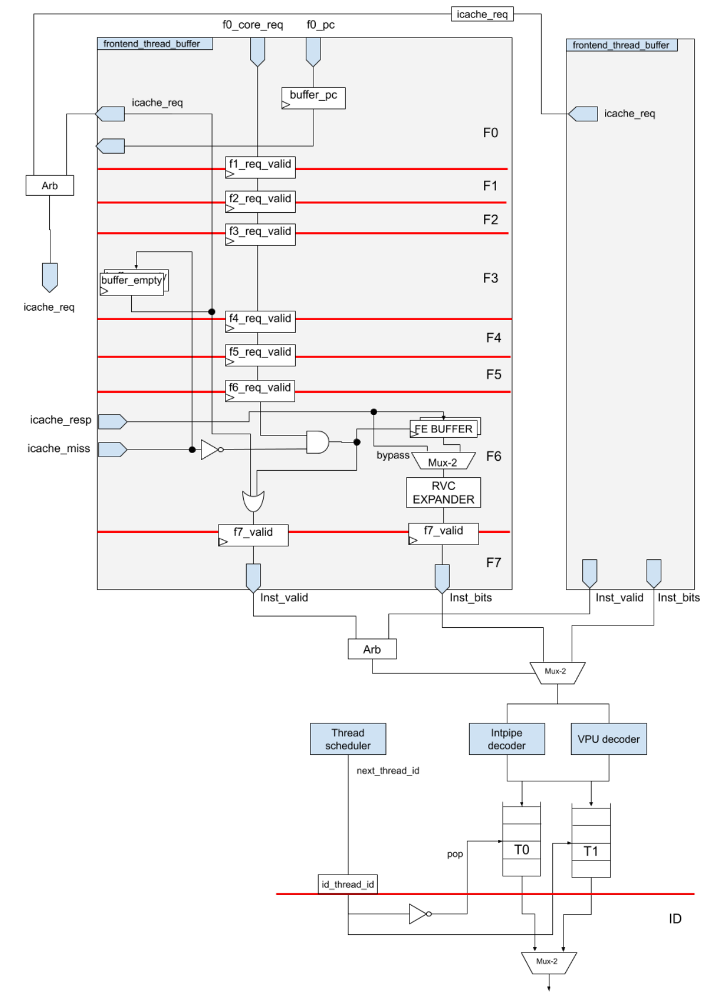
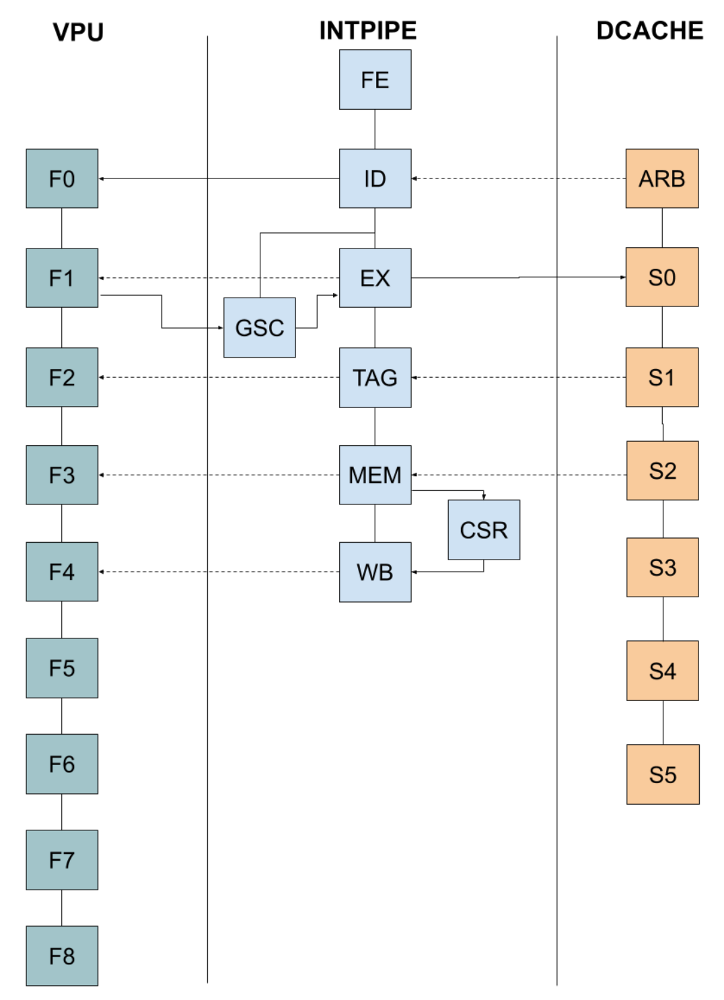
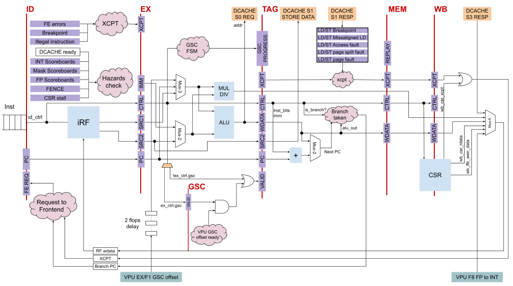
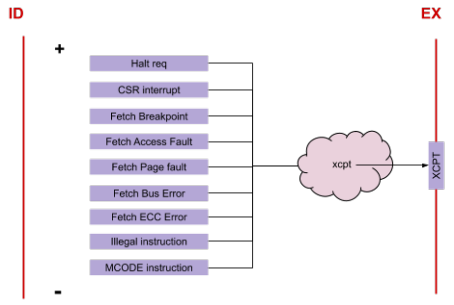
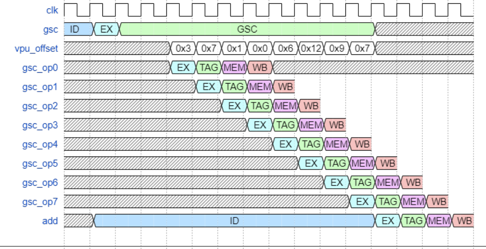
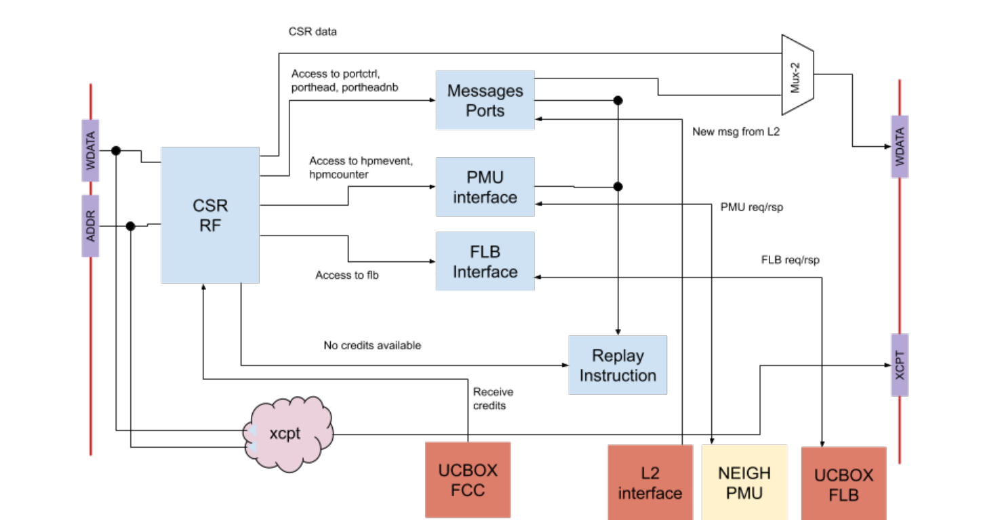
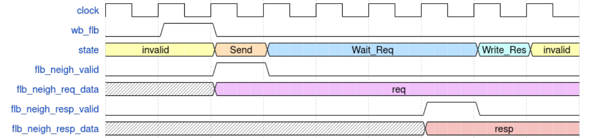
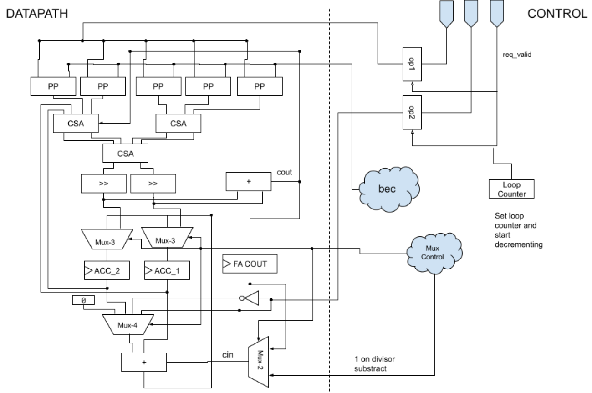

# FE/Intpipe Description 

Albert Navarro Sebastià Tortella 

# Table of Contents 

|**1 Introduction**|4|
|---|---|
|**2 Frontend**|4|
|2.1 Overview|4|
|2.2 Stages|6|
|2.2.1 Stage 0|6|
|2.2.2 Stages 1-5|6|
|2.2.3 Stage 6|6|
|2.2.4 Stage 7|7|
|2.2.5 Debug Mode|8|
|**3 Intpipe**|9|
|3.1 Overview|9|
|3.2 Stages|12|
|3.2.1 ID Stage|12|
|3.2.2 EX Stage|13|
|3.2.3 GSC Stage|13|
|3.2.4 TAG Stage|14|
|3.2.5 MEM Stage|15|
|3.2.6 WB Stage|15|
|3.3 Stall Conditions|15|
|3.3.1 Intpipe ID Stalls|15|
|3.3.2 CSR Replay Stalls|17|
|3.3.3 VPU Internal Stalls|17|
|3.3.4 Instruction Groups|18|
|3.4 Modules|19|
|3.4.1 CSR File|19|
|3.4.2 MulDiv Unit|21|
|3.4.2.1 Interface|21|
|3.4.2.2 MulDiv Control Unit|22|
|3.4.2.3 MulDiv Datapath Unit|23|
|3.5 Other Details|24|
|3.5.1 Instruction Clock-Gating|24|
|3.5.2 Thread 1 Restrictions|24|
|**4 Glossary**|26|
|**5 References**|27|

# Revision History 

|**Version**|**Date**|**Author**|**Changes**|
|---|---|---|---|
|v0.1|2019.12.11||First version of the file|
|v0.2|2020.09.28||Major revision of the document|
|v0.3|2021.02.03||Updated pipeline figures|
|v0.3.1|2021.09.06|Jennie Weyant|Format and grammar review|
|v0.3.2|2022.07.11|Jennie Weyant|Updated format and added References/Glossary section|

## 1 Introduction 

This document was written on 11 December 2019 and describes the current architecture state of ET-SoC-1. 

## 2 Frontend 

### 2.1 Overview 

The Frontend (FE) is the interface between the Integer Pipeline (Intpipe) and the Instruction Cache (ICache) that keeps the current Program Counter (PC), asks for new instructions from the ICache, and propagates ICache exceptions to the intpipe. 

To support the latency between the FE and the memory, the FE uses a double buffer. This allows the FE to issue a new request to the ICache while the core is consuming the instructions it has already received. This buffer is capable of storing 2 half lines of data (256 bits each). Each buffer has one dedicated flop to track the PC. 

The FE also provides the program buffer functionality. This allows for instructions to be injected through the debug hardware (HW) to inspect and modify the hart state. The same double buffer that stores the ICache responses is used as a program buffer. 

_Figure 1_ 

### 2.2 Stages 

The FE is composed of 7 stages. 

#### 2.2.1 Stage 0 

This stage contains a handler for the requests from the intpipe, an ET-LINK interface with the ICache to ask for a new line of instructions, and 2 PC registers. 

A request from the core contains the new PC and some flags. 

Debug flags: 

- Halt: this request is generated as a result of a halt interrupt that has been committed. The FE should enter in debug mode. 

- Resume: this request is generated due to a DRET instruction that has been committed. The FE should exit debug mode. 

Other flags: 

- Speculative: new request to the FE, but there are instructions inside the pipeline. In the case that FE is fetching from an uncacheable space (only valid in the IOShire where there is no ICache), it will need to wait until the instruction commits because it may change the data inside the memory region where the FE is fetching. 

When the stage receives a new request, it updates one of the PC registers, issues a new request to the ICache and sends the request to the next stage. Each PC register is associated with one of the two FE buffer entries and will choose the one that is free. Outstanding requests are killed when there is a new request from the intpipe so there is always a free buffer. Since there are 2 hardware threads (harts) and 1 bus to the ICache, this pipeline is duplicated and the requests are sent to an arbiter to serialize the ICache interface. 

In the case that there are no hart requests and there are empty buffers, a new request will be issued with the next PC from the last request (PC+4). 

#### 2.2.2 Stages 1-5 

These stages are used to wait a fixed amount of cycles for the ICache response. The requested information is propagated from stage 0 to stage 5 and can be killed by any new request from the core. 

#### 2.2.3 Stage 6 

This stage contains the double buffer inside which ICache responses are stored. The responses from the ICache are aligned with the requests sent through the FE. 

Possible responses from the ICache are: 

- A response with the instructions that were requested. In this case, the response is written to the FE buffer. 

- A miss notification. This means that the request is killed and the FE will stall the pipeline until the miss notification is resolved and the ICache responds that there is no miss pending. The request is then rerun. 

When the ICache response contains valid instructions, they are written to the FE buffer. The buffer sizes are different for Read/Write (32 bits/256 bits) since the FE can only process one instruction at the time. To accelerate this process, instead of writing to the FE buffer first and then reading from it, the data is bypassed in the first cycle so the instructions can start being processed as soon as the ICache response arrives. 

The Minion supports the RISC-V compressed instructions extension. These instructions need to be expanded to regular instructions (from 16 bits to 32 bits). The ‘expander’ is located in this stage so the instruction can be expanded as soon as it is ready. 

The ICache response includes the possible exceptions (e.g., Translation Lookaside Buffer [TLB] miss). These exceptions are propagated with the instruction until the Write Back (WB) stage so the core can take a trap to a suitable handler. 

#### 2.2.4 Stage 7 

This is the final stage where the instructions are decoded and sent to the intpipe. 

The decoders are inside the FE for reasons of timing. There are two decoders, one for the intpipe and one for the Vector Processing Unit (VPU). On the ET-SoC-1, the intpipe does the control flow inside the pipeline so every instruction (even if it is a VPU instruction) goes inside the intpipe. However, only VPU instructions have valid VPU decoding so non-VPU instructions never go through the VPU. 

Since the intpipe may stall the pipeline due to hazards, the FE and the intpipe are connected through two small First-In First-Outs (FIFOs) so the FE can handle some congestion. There is one FIFO per hart. 

The intpipe only supports one issued instruction at time; therefore, it needs a scheduler that can communicate which hart has the next instruction to issue. This scheduler (called the Thread Scheduler) is located in this stage. The scheduling is quite simple. 

When there are two harts enabled and available, a round robin schedule between the harts is performed. In the case that there is a hazard or just one hart is enabled, the hart that is unable to issue instructions is disabled so that only the one hart that is able to issue instructions can progress. 

#### 2.2.5 Debug Mode 

The Minion has an Advanced Peripheral Bus (APB) interface, which allows for the Data Cache (DCache) and the intpipe to be controlled through a set of ET System Registers (ESRs). To enable the use of these ESRs, the Minion has to enter ‘Debug mode’ or to be ‘halted’. This can be done through hardware/software (HW/SW) breakpoints and through the halt interrupt. 

If the halt interrupt is being used to halt the hart, the FE will enter into a special mode where it will: 

- Not send a request to the ICache 

- Ignore any stall 

The core is expected to be able to enter into debug mode even if the memory does not respond. Since the RISC-V debug spec defines that when the hart enters into debug mode, the Debug Program Counter (DPC) Control and Status Registers (CSRs) should contain the PC that took the halt interrupt (and therefore allow the HW to return to a previous state), a valid PC needs to be propagated until the WB stage. 

When the PC reaches the WB stage, the interrupt is taken, the core is set into debug mode and the intpipe requests a new PC to the FE, but instead of fetching the next batch of instructions, the FE is set into debug mode. 

In debug mode, the FE does not fetch from the ICache and does not react to any request from the core with the exception of a resume request. In this mode, the APB requests are able to manipulate the FE. The available operations are: 

- Write instructions to the FE buffer 

- Send instructions to the intpipe 

## 3 Intpipe 

### 3.1 Overview 

The integer pipeline (intpipe) executes all instructions regardless of whether they are integer, memory or Floating Point (FP) instructions. For FP instructions, the intpipe only provides control flow (kill the instruction in case we jump, etc). 

The pipeline is composed of 5 stages: 

- ID stage: dependencies check + read Register File (RF) 

- EX stage: Arithmetic Logic Unit (ALU) 

   - Gather/Scatter (GSC) stage: extra stage for GSC instructions 

- TAG stage: check DCache tags (miss/hit) 

- MEM stage: access DCache data 

- WB stage: commit instruction (write RF, exception trap, etc.) 

Each of these stages is synchronized with another stage from the VPU/DCache so the intpipe <mark>can request the VPU/DCache to kill an inflight instruction if there is a</mark> control flow <mark>operation before that instruction commits.</mark> The following figure shows a diagram of the pipeline stages and their relationship to each other. 

_Figure 2_ 

A more detailed diagram of the main building blocks of the Inpipe is represented in the following figure. 

_Figure 3_ 

### 3.2 Stages 

#### 3.2.1 ID Stage 

The Instruction Dispatch (ID) stage is aligned with the VPU F0 stage and the DCache S0 stage. This allows the intpipe to control the issuance of new instructions to the VPU and to make sure that the DCache has space in the replay queue to absorb the request before sending it to the next stage. 

The main function of the ID stage is to provide the RF operands for new instructions. To be able to do that, this stage holds three scoreboards to track the dependencies between instructions. When a dependency is not met, the instruction is killed and the hart is stalled until the dependency is fulfilled. 

To reduce the dependencies latency, a full set of bypasses is provided for integer data. Notice that DCache data is available at the WB stage or later. 

There are two special instructions that behave differently: Fence and GSC instructions. Fence instructions activate the Fence Mode one cycle after they exit the ID stage. During Fence Mode, memory instructions are stalled in this stage until the DCache is idle. When the DCache is no longer busy, the ID stage deactivates the Fence Mode. 

The other special instruction is the GSC. GSC operations are special instructions that are kept in the EX stage for eight cycles to issue multiple memory requests. As a result, the ID stage will stall and the EX stage will be free again. 

Interrupts go inside the pipeline at this stage. According to RISC-V spec, interrupts have a higher priority than exceptions; if any exceptions come from the FE, they will be overridden. 

The following interrupts/exceptions are checked at this stage: 

- Halt request: interrupt that puts the core in debug mode. This interrupt has the highest priority 

- CSR interrupt: pending interrupt (stored in Machine Interrupts Register CSR [mip]) 

- Fetch breakpoint: a breakpoint on that PC 

- Fetch access fault: misaligned access 

- Fetch Page fault: page fault accessing the page containing that PC 

- Fetch bus error: unknown error coming from a remote source (DDRAM, etc) 

- Fetch ECC error: error correction code (ECC) error 

- Illegal instruction: unknown instruction or an instruction that should not be executed under the current conditions (i.e. tensor operations on thread 1) 

- M-code instruction: instruction that is implemented in SW 

_Figure 4_ 

The RF has four ports: three for reading and one for writing. One of the reading ports is a dedicated port for the x31 register. Some instructions require an extra reading port (i.e. tensors, atomics, etc.). To avoid an extra multiplexor (mux) and extra bits in the instructions, all these instructions use the x31 register. 

#### 3.2.2 EX Stage 

The Execute (EX) stage contains the Arithmetic Logic Unit (ALU) and the Multiplier/Divider (MulDiv) unit. 

The MulDiv is a multicycle unit and operates asynchronously (the instruction may commit before the unit ends) and the result is written to the RF when the write port is available. The request to the DCache for memory instructions is sent in this stage since it is the earliest stage where the address is available. The data is sent in the TAG stage to use the same path as the VPU data. 

Checking for an illegal rounding mode in the FP instructions is also performed in this stage. Memory operations use this stage to compute the memory address. Operations that need to compute multiple memory addresses (GSC instructions) will stall the pipeline at the ID stage until they finish and free the EX stage (see the GSC stage section for more information). 

#### 3.2.3 GSC Stage 

Between the EX and TAG stages, there is the Gather/Scatter (GSC) stage. When a GSC instruction reaches the EX stage, the ID stage is stalled until the GSC instruction finishes issuing all the operations. In the next cycle, the instruction reaches the GSC stage. In this stage, the data coming from the VPU is handled and passes the EX stage to compute the next GSC 

address. The bus between the VPU and the core has some delay so the GSC stage will enable the TAG stage flops when the data has reached the EX stage and the GSC address is ready. 

The DCache doesn’t check if there is enough space for all the requests, it just checks if there are free entries, so it is possible that the DCache will run out of space in the replay queue after the ID stage. If this occurs, the DCache will notify the intpipe and the intpipe will stop issuing GSC operations until the DCache is ready again. 

_Figure 5_ 

#### 3.2.4 TAG Stage 

In the TAG stage, the response from the DCache, which only contains exception information, is checked. In the case of an exception, it is propagated until the WB stage. 

The intpipe is not concerned with cache misses since the DCache will handle them. Load (LD) and store (ST) will retire even if they miss and the intpipe will mark this in the scoreboard to track the dependency. The intpipe will continue executing instructions and will write the LD data into the RF when the write port is free. 

In the case of stores/scatters, the data that needs to be stored is sent to the DCache in this stage. Tensor Stores and Tensor Reduce use the same path to send the data to the DCache. The DCache should stall memory operations in the intpipe to avoid a collision in the TAG stage. Branches that are taken will request the new PC from the FE during this stage and kill older instructions from the previous stages. 

#### 3.2.5 MEM Stage 

The Memory access (MEM) stage checks for exceptions from the DCache and communicates with the VPU in case an instruction needs to be killed (just like in the other stages). This is also the first stage for the CSR file. 

In this stage, the instruction can issue a read/write to the CSRs. The read data will be available in the next stage. 

Additionally, in the case of a TLB miss, the DCache can request a pipeline flush. The instruction will be marked to be replayed when it reaches the WB stage and the rest of the pipeline instructions will be killed. 

#### 3.2.6 WB Stage 

The Write Back (WB) stage is just for committing instructions. In the case of an exception or an interrupt, the instructions will take a trap. Instructions write to the RF in this stage. 

There are some muxes to choose, which is the agent that is able to write to the RF. (DCache, Instruction, Fast Local Barrier (FLB) read, MulDiv, FP to INT). The arbitration is also done at this stage. 

### 3.3 Stall Conditions 

#### 3.3.1 Intpipe ID Stalls 

In addition to the stall conditions derived from the data dependencies detected by the scoreboard, the intpipe will be stalled when any of the conditions in the following tables are met. These all represent structural hazards since two instructions or operations need the same resource. 

|**Older**|**Younger**|**Thread**|
|---|---|---|
|Uses MulDiv and has not completed yet|Instruction requires MulDiv (G1**0**)|Any|
|DCache not ready to accept new instructions**4**|Instruction is a Memory Operation (G2)|Any|
|TensorFMA configured to write to the VPU RF|Any core instruction1requiring the VPU (G3)|Any|
|TQUANT|Any core instruction requiring the VPU (G3)|Any|
|TREDUCE/TSTORE|Any core instruction requiring the VPU (G3)|Any|
|Any CSR Write for a Tensor operation to VPU**5**|Any core instruction requiring the VPU (G3)|Any|
|VPU Trans block inserting a new instruction|Any core instruction requiring the VPU (G3)|Any|
|VPU Trans block is busy|GSC core instruction requiring the VPU (G4)|Any|
|VPU Trans block is busy|Any CSR Write for a Tensor operation to VPU**5**|Only 0|
|There is another core instruction in the pipeline|Any not safe**3**access to CSR register|Same|
|VPU Trans block is busy|Any not safe**3**access to CSR register|Any|
|VPU indicates a stall to update flags|Access to CSR flags register|Any|
|There is another access to CSR ongoing in the EX stage|Any access to a shared CSR register|Any|
|Another CSR instruction in the pipeline**2**|Any other instruction except for safe CSR access or read only|Same|
|An FP instruction that has to write into the intpipe RF|Any instruction that has to write into integer RF|Any|
|A GSC instruction not yet completed|A GSC instruction|Any|

_Table 1_ 

0 Instruction groups G1 … G3 are listed at the end of this section (TBC). 

1 A “core instruction” is an instruction that is managed by the “regular” pipeline, not by another Finite State Machine (FSM) like the Tensor* or CacheOp*. These include memory operations, register operations, branches, etc. 2 A CSR instruction has to be executed alone in the pipeline for a given thread: a new CSR instruction won’t be issued while there are instructions in the pipeline, and no new instructions will be issued until an ongoing CSR instruction is retired. 

- 3 A CSR operation is not considered “safe” if it needs to have the pipeline clean before starting execution. By default, access to CSRs is “not safe”, but access to the following CSRs is considered safe: 

   - CO_EVICT_VA 

   - CO_FLUSH_VA 

   - CO_LOCK_VA 

   - CO_UNLOCK_VA 

   - CO_PREFETCH_VA 

   - TENSOR_LOAD 

   - TENSOR_FMA 

   - TENSOR_QUANT 

   - TENSOR_REDUCE 

   - TENSOR_STORE 

   - TENSOR_CONV_CTRL 

   - TENSOR_WAIT 

   - TENSOR_COOPERATION 

   - FLB 

   - FCC 

- 4 DCache is not ready to accept a new instruction when all the NRQ entries in the DCache Replay Queue have been allocated (i.e. there are NRQ ongoing instructions not yet completed). Current implementation has NRQ = 8. 

> 5 A CSR Write for a tensor operation to the VPU includes the following tensor operations: 

- TENSOR_FMA 

- TENSOR_QUANT 

- TENSOR_REDUCE 

- TENSOR_STORE 

#### 3.3.2 CSR Replay Stalls 

There is also a second type of stall situation for operations started through CSRs. This is basically a “replay” instruction that sends the CSR Write instruction that has reached the WB stage back to the ID stage. This kind of stall situation is used for the following set of operations that find the resource is already being used. 

|**Older**|**Younger**|**Thread**|
|---|---|---|
|Started a Cache Op that is still ongoing|Wants to do a similar Cache Op|Any|
|Started a Tensor Load Op that is still ongoing|Wants to do a similar Tensor Load Op|Only 0|
|Started a Tensor FMA Op that is still ongoing|Wants to start a Tensor FMA Op|Only 0|
|Started a Tensor Store Op that is still ongoing|Wants to start a Tensor Store Op|Only 0|
|Started a Tensor Reduce Op that is still ongoing|Wants to start a Tensor Reduce Op|Only 0|
|Started a Tensor Quant Op that is still ongoing|Wants to start a Tensor Quant Op|Only 0|
|Started a Tensor Conv Op that is still ongoing|Wants to start a Tensor Conv Op|Only 0|
|Reading the Performance Monitor Unit (PMU) register has not yet been completed|Wants to read the PMU register|Any|
|Previous access to the FLB has not yet been completed|Wants to access an FLB|Any|
|N/A - No credits available|Wants to get a credit via the FCC|Same|
|N/A - Operation not yet completed|Wants to wait on a given operation to be completed using Tensor Mask|Same*|

_Table 2_ 

* Tensor Wait bits for Cache Ops discriminate per thread. The remaining Tensor Wait bits only apply to thread 0. 

#### 3.3.3 VPU Internal Stalls 

There is a final group of pseudo stall situations within the VPU. These do not stall the intpipe, but the Older instruction will wait for the Younger instruction to complete before starting the real operation. Both instructions will be “live” but only one will be executed. 

|**Older**|**Younger**|**Thread**|
|---|---|---|
|TREDUCE|TFMA IMA writing RF / FP|Only 0|
|TQUANT|TFMA IMA writing RF / FP|Only 0|
|TFMA IMA writing RF / FP|TQUANT|Only 0|
|TREDUCE|TQUANT|Only 0|
|TFMA IMA writing RF /FP|TREDUCE|Only 0|
|TQUANT|TREDUCE|Only 0|

_Table 3_ 

#### 3.3.4 Instruction Groups 

The group identifiers are referenced in the following tables according to the resource that they require 

|**Group ID**|**Short Description**|**Instruction**|**List**||||
|---|---|---|---|---|---|---|
|G1|Requires MulDiv|DIV*|MUL*|REM*|||
|G2|Memory operation|AMO* FAMO* FBC_PS|FG* FLQ2 FLW*|FSC* FSQ2 LD|LB* LH* LW* FSW*|SD SB* SH* SW|
|G3|Requires VPU|CUBE* FADD* FAMO* FAND* FBC* FCLASS* FCMOV* FCVT***1** FEQ*|FEXP_PS FFRC_PS FG* FLE* FLOG_PS FLQ2 FLT* FLW* FM*|FNM* FNOT_PI FOR_PI FPACK* FRCP* FROUND_ PS FRSQ_PS FSAT* FSC*|FSETM_PI FSGNJ* FSIN_PS FSLL* FSQ2 FSR* FSUB* FSW* FXOR_PI|MAND MASKPOP * MNOT MOR MOV* MXOR|
|G4|Requires VPU and GSC|FAMO*|FGB*|FGH*|FGW*|FSC*|

_Table 4_ 

1 Except FCVT_L_S, FCVT_LU_S, FCVT_S_L, and FCVT_S_LU 

### 3.4 Modules 

#### 3.4.1 CSR File 

_Figure 6_ 

The CSR file contains all the CSRs from the Minion. This RF is aligned with the MEM and WB stages and contains nearly all the control signals that configure the Minion. Additionally, due to the nature of the CSRs, CORE-ET implements some extensions using custom CSRs as an interface for the SW to trigger them, so there are some functionalities that are located inside this RF. 

CSRs can be accessed in the MEM stage and data are available in the WB stage. 

The following features are enclosed inside the CSR files: 

- Message ports 

Harts can send messages back and forth using the Hart Port ESRs. To read the messages, the harts needs to read the PORTHEAD or PORTHEADNB CSRs. The messages are stored inside a Set and Way that should be locked to avoid unfortunate data overwriting. The module stores the offset for the pending messages and the out-ofband bit in case it is enabled. 

The access time for these CSRs is the same as a normal CSR. It provides the data in just one cycle (when the WB stage is reached). However, if the port is empty and access is being blocked (PGET), the CSR will replay the instruction and stall the thread until the data is available. 

Check PRM-9 for more details on how ports work 

- PMU 

The Performance Monitor Unit (PMU) is located in the neighborhood and is shared by all the Minions. The CSR file contains logic to select which events are sent to the unit. Due to the latency of the data coming from the Neighborhood, a read from the PMU is replayed. The next time the instruction reaches the WB stage, the data should be available to be read. 

Check PRM-0 - Section 4.5 

- Fast Local Barrier (FLB) 

The Fast Local Barrier (FLB) unit provides an interface with the barrier counters inside the Uncacheable block. Due to the long distance between the counters and the Minion, there is a protocol to request and wait for the data. 

The protocol is implemented using a state machine as follows: When a hart tries to read the FLB CSR, the state machine changes to the FLB_Send_Req state, sending a request to get the values on the FLB. While the unit is busy, the hart is free to run other code, and data dependencies are controlled with the scoreboards. In case there is a second read to an FLB, the hart will block until the unit is available again. 

In the next cycle, the FSM changes to FLB_Wait_Req and will remain there until it receives a response. 

When it receives the data, the FSM will change to the FLB_Write_Data state and will try to write the data to the RF when the write port is available. 

When the data is written, the unit is ready to go back to FLB_Idle state and any thread waiting to read an FLB will be awoken. 

The following figure shows the whole process: wb_flb is a pulse when an FLB instruction such as ‘csrrw xd, flb, xs’ is in the WB stage. From there the state machine is triggered along with the signaling to and from the Neighborhood where the FLB counters reside. 

_Figure 7_ 

The flb_neigh_req_data is a 13-bit port that is set to xs when executing ‘csrrw xd, flb, xs’: flb_neigh_req_data[4:0] = barrier number (from 0 to 31) flb_neigh_req_data[12:5] = number compare (0 to 255) 

The FLB block (outside the Minion) will atomically increment the corresponding barrier counter and set the flb_neigh_resp_data to either 1 or 0 if the barrier counter matched the value in flb_neigh_req_data[12:5] before incrementing. This return bit is copied into the destination register of the csrrw instruction. 

- Tensors 

To trigger a tensor operation or a Cache-Op, a CSR interface is provided. The data will be forwarded to the DCache or the VPU where the operation will be performed. In the case that the receiver units are busy, the thread is stalled and the instruction will replay when the unit is available. 

- CSR Replay 

There are some cases where access to a CSR cannot be completed (Tensor wait and Tensor load ongoing, FLB and data not ready, etc.). The CSR replay module manages these situations by stalling the hart and replaying the instruction when the unit/data is available. 

#### 3.4.2 MulDiv Unit 

The Multiple/Divide (MulDiv) unit provides hardware support for 64- and 32-bit integer multiplications and divisions. The multiplication datapath can provide a 32/64-bit multiplication in 4/8 cycles and the division datapath can provide it every 33/65 cycles. 

For multiplications, the unit uses a Radix-4 booth algorithm. The datapath is able to compute four partial products per cycle, which are reduced using a 3-level Wallace tree. For divisions, the unit implements a non-restoring division algorithm. 

The unit is split into two modules: the control unit and the datapath. 

##### 3.4.2.1 Interface 

|**Signals Request**|**Size**|**Description**|
|---|---|---|
|`req_ready`|1 bit|The unit is ready to receive a request|
|`req_valid`|1 bit|Request a new MulDiv operation|
|`req_fn`|5 bits|Request operation type (MUL, DIV, MULU, etc.)|
|`req_in1`|64 bits|Request first operand|
|`req_in2`|64 bits|Request second operand|
|`req_dw`|1 bit|Request operation is for a double-word (64-bits). Otherwise, it is for a single word (32-bits)|
|`req_dest`|7 bits|Destination register (register + thread id) for the request result|
|`kill`|1 bit|Kill inflight operation due a mispredict or exception|
|**Signals Response**|||
|`resp_ready`|1 bit|Register-file is ready to accept the MulDiv result|
|`resp_valid`|1 bit|Write result to the RF|
|`resp_valid_early`|1 bit|1-cycle early resp_valid|
|`resp_data`|64 bits|MulDiv data result|
|`resp_dest`|7 bits|Destination register (register + thread id) for the request result|

_Table 5_ 

##### 3.4.2.2 MulDiv Control Unit 

The control unit manages the interface to the intpipe and orchestrates the datapath unit. 

Requests are issued at the ID stage and start at the EX stage. The unit availability is controlled through the _`req_ready`_ signal. Only one request is supported at a time. 

Upon receiving a new request, the unit will set up and start decrementing a loop-counter. The loop counter controls the number of iterations that the requested operation needs. 

To orchestrate the datapath, the control unit controls 3 muxes in the datapath. The configuration of these muxes determines the action to be performed. One of these muxes selects the input Ain pin in the adder and the other 2 select the input for the accumulators. 

|**Adder****_Ain_select**|**Adder****_Ain_ value**|**Action**|
|---|---|---|
|3|Negated divisor|Subtract divisor (Cin is expected to be 1)|
|2|Divisor|Add divisor|
|1|Content of accumulator 2|Quotient or multiplication result for quotient adjustment or final multiplication adjustment.|
|0|Zeroes|Nothing. Set to save power|

_Table 6 - Actions for the Divisor Adder Mux_ 

|**Acc 1 select**|**Acc 1 value**|**Action**|
|---|---|---|
|3, 2|Adders output|Store adders output. Used in the last MulDiv iteration to adjust the result|
|1|Wallace tree output|Store the Wallace tree output. Used during multiplication loop|
|0|Shifted remainder|Store shifted remainder. Used during division loop|

_Table 7 - Actions for the Accumulator 1 Mux_ 

|**Acc 2 select**|**Acc 2 value**|**Action**|
|---|---|---|
|3, 2|Adders output|Store adders output. Used for quotien adjust|
|1|Wallace tree output|Store the wallace tree output. Used during multiplication loop|
|0|Shifted quotient|Stores shifted quotient. Used during division loop|

_Table 8 - Actions for the Accumulator 2 Mux_ 

For multiplications, the control unit consumes the multiplier 8 LSB bits and generates 4 Booth Encoding (BENC) values and sends them to the Datapath Unit. 

For divisions, the control unit checks the output of the adder in the datapath to choose which is the next command to be executed by the datapath. 

##### 3.4.2.3 MulDiv Datapath Unit 

The datapath is shared between the divider and the multiplier. 

For multiplications, the datapath implements the Radix-4 booth algorithm. The control unit compares the 8 less significant bits of the multiplicand and generates the Booth Encoding (BENC), which is consumed by the datapath to generate the partial products. The partial products are reduced using the Wallace tree. 

The Wallace tree has three levels. The first two levels generate two vectors: the multiplication partial result and the carry. These two vectors are stored into 2 65-bit accumulators for the entire operation. 

The last level is the 6-bit full-adder that computes the Wallace tree first level _`Cin`_ for the next iteration. On the last iteration, the carries and the partial results are added and sent through the response bus. 

For the divider, the datapath uses an adder to implement the non-restoring division algorithm. It reuses the same adder that is used for the final step in multiplications. The control unit controls the muxes in the input of the adder to add or subtract the divisor for each division iteration. 

_Figure 8_ - _MulDiv Unit_ 

### 3.5 Other Details 

#### 3.5.1 Instruction Clock-Gating 

To save power, the instruction bits are clock-gated on every stage, pruning the unnecessary bits for future stages. There are a few exceptions where instructions are not clock-gated: exceptions, interrupts, and debug mode. 

#### 3.5.2 Thread 1 Restrictions 

Thread 1 doesn’t have access to the following CSRs and trying to use them will result in an illegal instruction exception: 

1. tensor_reduce 

2. tensor_fma 

3. tensor_cooperation 

4. tensor_quant 

5. tensor_load 

6. tensor_store 

Because of these restrictions, waiting for the end of the events corresponding to these CSRs with the _tensor_wait_ CSR has no effect. And the corresponding bits in the _tensor_error_ CSR are hardwired to 0 (see <u>PRM-10 for details).</u> 

Another difference between the threads is that the _SCPEnable_ field of _ucache_control_ CSR can only be set by thread 0 and not by thread 1. Attempts by thread 1 to write this field are ignored. 

## 4 Glossary 

ALU Arithmetic Logic Unit of the integer CSR Control and Status Register DCache Data Cache ESR ET System Register FE Frontend FLB Fast Local Barrier FP Floating Point FSM Finite State Machine GSC Gather/Scatter hart Hardware thread ICache Instruction Cache ID Instruction Dispatch Intpipe Integer Pipeline LD Load MulDiv Multiplier/Divider PC Program Counter RF Register File ST Store trans Transcendental VPU instruction TLB Translation Lookaside Buffer VPU Vector Processing Unit WB Write Back 

## 5 References 

1. <u>CORE-ET Programmer’s Reference Manual - Section 4.5</u> 

