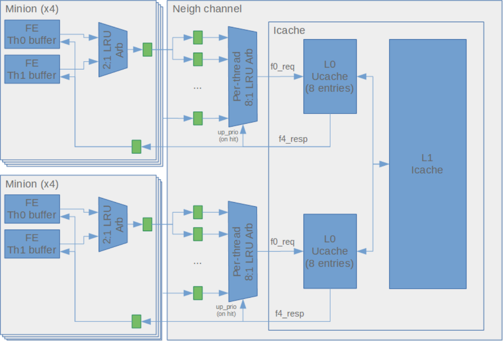
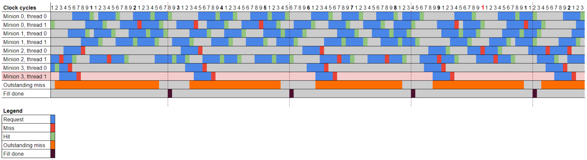
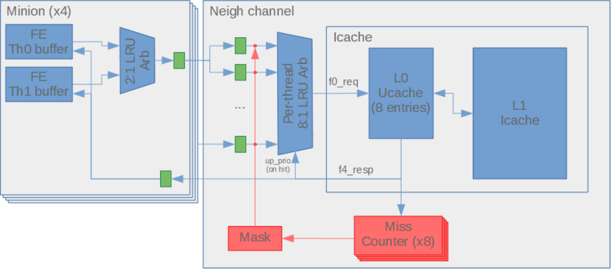

# Frontend-ICache Interface 

<u>Ildefonso Gomariz</u> 

# Table of Contents 

|**1 Introduction**|4|
|---|---|
|**2 Microarchitecture**|5|
|2.1 Frontend|6|
|2.2 Shared ICache|7|
|**3 Bus Specification**|9|
|3.1 Request Channel|9|
|3.2 Response Channel|9|
|**4 Issues**|10|
|4.1 Livelock|11|
|4.1.1 Conditions|11|
|4.1.2 Timing Diagram|12|
|4.1.3 Proposed Fix|14|
|**5 Future Versions**|16|
|**6 Glossary**|17|
|**7 References**|18|

# Revision History 

|**Version**|**Date**|**Author**|**Changes**|
|---|---|---|---|
|v0.1.0|2019.10.31|Ildefonso Gomariz|First version|
|v1.0.0|2021.05.20|Ildefonso Gomariz|Document completed and standardized|
|v1.0.1|2021.10.07|Jennie Weyant|Format and grammar review|

## 1 Introduction 

This document is intended to describe the interface between the Minion’s Frontend and the Neighborhood’s shared ICache in the A0 revision of the ET-SoC-1 device. 

The main intended users of this document are the members of the VLSI team in charge of designing the Minion and the Neighborhood blocks, especially the Minion’s Frontend and the ICache modules. Refer to the FE/Intpipe Description and the ICache Description documents for further details on those modules. 

The microarchitecture and bus specification of this interface are presented. Since the handshake used in this interface presents serious drawbacks which can lead to livelock situations (i.e. certain threads starving and never getting new instructions), the different issues and implemented fixes are analyzed. Last, potential improvements for future versions are discussed. 

## 2 Microarchitecture 

Inside each Neighborhood, there is one L1 ICache shared among 8 Minions. As the access to the L1 ICache data Random Access Memory (RAM) has a high latency (they are placed in the high voltage domain, out of the Neighborhood), an L0 microcache (UCache) is inserted in between. There are 2 L0 microcaches per Neighborhood, each serving 4 Minions (eight threads). Each L0 microcache has 16 fully-associative entries (so, on average, there is one entry per thread). 

The block diagram of the Frontend-ICache interface is shown in _Figure 1_ (the green blocks represent flop stages). 

Communication between the Frontend and the ICache will typically follow this scheme: 

1. One of the Frontend thread buffers sends a new request 

2. The request is routed through the Frontend thread arbiter and the Neighborhood shared ICache arbiter 

3. The L0 microcache receives the request and processes it 

4. The L0 microcache sends the response back to the requesting Minion after a fixed time, regardless of whether the request hit or missed 

5. The Frontend delivers the response to the corresponding thread buffer. If the request hit the L0 microcache, then the transaction is finished 

6. If the request missed the L0 microcache, a fetch request is sent to the L1 ICache and the requesting thread goes to sleep 

7. Once the response from the L1 ICache is received, a ‘fill done’ pulse is sent to all the Minions so that the sleeping threads can retry 

_Figure 1 - Block Diagram of the Frontend-ICache Interface_ 

### 2.1 Frontend 

Each Minion has two threads. The Frontend has one buffer per thread that acts as an instruction stream. The buffer size is 2 entries of 32B (each request to the ICache is 32B), which are typically filled with consecutive addresses. <mark>This buffer size was chosen so that a thread could cope with the delay introduced by sharing the ICache between N threads.</mark> 

When there is a request to jump from the core (because of branch/jump instructions or interrupts/exceptions), the buffer is cleared and the 32B data corresponding to the program counter provided by the intpipe is requested to the ICache. When an entry in the buffer is invalid or clear, it is filled with the next 32B data in sequential order. An entry is cleared when there is a request from the intpipe, as mentioned above, and when no more data from the entry is needed. 

This happens when: 

- The PC ends with 5'h1c and the instruction is not compressed 

- The PC ends with 5'h1e and the instruction is compressed 

- The PC ends with 5'h1e, the instruction is not compressed, and the next entry is valid (because half the instruction will be in offset 0 of the next entry). 

For example, with [m, n] representing the contents of the entries of one of these buffers: 

1. The intpipe requests Program Counter (PC) A ⇒ entries are cleared ⇒ [X, X] 

2. Request is sent to the ICache (address {A & ~0x1F}) ⇒ [A>>5, X] 

3. Because there is a free entry, it requests the address {(A & ~0x1F) + 32} to the ICache ⇒ [A>>5, (A>>5)+1] 

4. Eventually, the last instruction from the first entry is read (PC {(A & ~0x1F) + 28} if only using non-RVC instructions) ⇒ first entry is cleared ⇒ [X, (A>>5)+1] 

5. Because there is a free entry, it requests the address {(A & ~0x1F) + 64} to the ICache ⇒ [(A>>5)+2, (A>>5)+1] 

6. And so on 

ICache requests from both threads are Least Recently Used (LRU)-arbitrated and multiplexed into a single request bus going to the Neighborhood channel. 

For further details on the Frontend architecture, refer to the Frontend section of the FE/Intpipe <u>Description.</u> 

### 2.2 Shared ICache 

Once in the channel, the request is split back to two buses (one per thread) and flopped (there are independent per-thread flops so that fair arbitration can be applied afterwards). Every group of eight thread requests is again LRU-arbitrated and multiplexed into a single request bus going to the corresponding L0 microcache, which can serve up to one request per clock cycle. 

When hit, each fetch request returns half a cache line (256 bits; i.e. 8 instructions). So, assuming that a Minion can execute up to one instruction per clock cycle (however many threads run on it), it would need to send one request every 8 cycles. So, each L0 microcache has 2x more bandwidth than the maximum required. 

For legacy reasons, the Minion’s Frontend requires the ICache response to have fixed latency. Thus, after a four-stage pipeline in the L0 microcache, a response is generated and sent back to the Frontend. If the request missed the L0 microcache, a miss notification is sent in the response and the Frontend goes to sleep. Meanwhile, the line will be requested to the L1 ICache. Only one outstanding fill request to L1 is supported. Any other requests from other threads that also miss the L0 microcache will not be attended, and such threads will also go to sleep. 

Once the L1 response comes back, a ‘fill done’ pulse is sent to all the Minions so that the sleeping threads can retry their request. 

The 8:1 arbiter in the Neighborhood monitors the microcache output and updates the priority only when a thread hits the ICache. This helps a thread that missed the L0 microcache to retry with a higher priority than the others. 

For further details on the Neighborhood and ICache architecture, refer to the <u>Neighborhood Description and the ICache Description.</u> 

## 3 Bus Specification 

The Frontend-ICache interface implements a dedicated bus consisting of two channels: request and response. 

### 3.1 Request Channel 

The request channel uses a pair of valid/ready signals to handshake a transfer so that both the source and destination can control the rate at which the information moves. 

- When the valid signal is HIGH, the source is providing the request or response information. 

- When the ready signal is HIGH, the destination can accept the request or response information. 

- Only when both the ready and valid signals are HIGH is the transfer performed. In the next cycle, the source will have to deassert valid or provide a new request. 

- While valid is asserted, the transfer information must remain stable. 

- While it is not mandatory, it is good practice to do the following: 

   - Once valid is asserted, keep it HIGH until the handshake finishes. 

   - Avoid dependencies between valid and ready signals. For instance, do not wait for ready signal to be HIGH before asserting the valid flag. 

The following table shows the signals used to configure a request transaction: 

|**Name**|**Type**|**Description**|
|---|---|---|
|_min_id_|_2-bit vector_|_Minion identifier_ **_NOTE:_**_This field is added in the Neighborhood after arbitration and is only_ _used to know where to route the response_|
|thread_id|1 bit|Thread identifier|
|addr[48:5]|44-bit vector|Extended virtual fetch address|
|vm_status|8-bit vector|Virtual Memory (VM) status. This includes useful information for translating a virtual address into a physical address1|

_Table 1 - Frontend-ICache Request Bus_ 

### 3.2 Response Channel 

The response channel uses a valid signal to validate the contents of a transfer. No further handshaking is needed in this channel, as the latency of the responses is fixed. Asynchronously, 

1 Virtual Memory logic is unused in A0 

a ‘fill done’ signal is used to notify that a sleeping thread may retry a request after the previous one missed the L0 microcache. 

The following table provides a description of the signals used in a response transaction: 

|**Name**|**Type**|**Description**|
|---|---|---|
|data|256-bit vector|Half a cache line corresponding to the requested address. This field is only valid if neither an exception nor an error is notified (except when it is a correctable Error Correction Code [ECC] error, in which case the data is already corrected) This field is only valid if neither the_miss_nor the_page_fault_nor the _access_fault_fields are set.|
|cacheable|1 bit|Indicates whether returned data is cacheable. This field is only valid if neither the_miss_nor the_page_fault_nor the _access_fault_fields are set.|
|page_fault|1 bit|Page fault flag; indicates a fetch page fault exception in the Translation Lookaside Buffer (TLB).|
|access_fault|1 bit|Access fault flag; indicates a fetch access fault exception either in the TLB or in the Physical Memory Attributes (PMA).|
|bus_err|1 bit|Bus error flag; indicates an L2 bus error response. This field is only valid if neither the_miss_nor the_page_fault_nor the _access_fault_fields are set.|
|ecc_err|1 bit|ECC error flag; indicates that the requested cache line has an ECC error in the L1 ICache. This field is only valid if neither the_miss_nor the_page_fault_nor the _access_fault_fields are set. **NOTE:**The ECC error may be notified on either the Single-Bit Error (SBE) or Double-Bit Error (DBE) or both, depending on the configuration of the Neighborhood ET System Register (ESR)_icache_err_log_ctl_. The error will be notified even if it is found on a bit that is not being sent in the current half line.|
|miss|1 bit|Indicates that the current request missed the L0 microcache This field is only valid if neither the_page_fault_nor the_access_fault_fields are set.|
|fill_done|1 bit|Indicates that an L1 ICache fill happened and that sleeping threads should retry after their previous requests missed the L0 microcache. This signal is asynchronous to the other fields.|

_Table 2 - Frontend-ICache Response Bus_ 

## 4 Issues 

The Frontend-ICache interface was inherited from the original Rocket core. When the ICache was moved to the Neighborhood and shared among several Minions, the fixed latency response was 

kept. However, this design presents severe drawbacks from both a design and backend point of view: 

- Every time a new stage is added in the request-response loop, the Frontend has to be modified. 

- From the backend point of view, this structure has caused numerous timing issues, which have been tricky to solve. 

- The arbiters introduce variable latency, which is difficult to make transparent to the Frontend (combinational grant lines need to be wired back to the Frontend). 

- Unfair throughput is observed. Resonant behaviors have been spotted where, depending on the timing of the requests from each thread, certain threads get less throughput (fewer hits) than others. 

- Potential livelocks. This is the most dangerous issue. Depending on the delays that different interfaces have and on the frequency and the address of the requests themselves, it might happen that a request from one (or more) of the threads is never served as, every time that it enters the microcache pipeline, an outstanding miss for another thread request is being processed. 

### 4.1 Livelock 

Due to how the handshake was implemented, a livelock situation is possible. This occurs when a request from one (or more) of the threads is never attended by the L0 microcache since every time that it enters the microcache pipeline, there is an outstanding miss for the other thread. 

Such a situation would have a big impact on performance to say the least. We may see big drops in throughput periodically and may even see some threads hanging forever. SW workarounds may not be trivial, if they are at all possible. 

#### 4.1.1 Conditions 

The exact conditions that trigger the livelock are extremely difficult to know, and there might actually be different scenarios that result in this issue. The conditions that affect the livelock that we have found are as follows: 

- Address of the request from each thread: If every thread executes code from a different address, the microcache will rapidly saturate. When all the threads are running the same code, livelock will not happen. 

- Frequency of requests from each Frontend: If requests are sent more often, it is more likely to saturate the ICache. This usually happens in single-instruction infinite loops in which a single jump instruction is mispredicted again and again, especially if the instruction is the last one of the current cache line since, in that case, the current and next cache lines will be alternatively requested. 

- Frontend 2:1 LRU arbiter: The LRU arbiter within the Frontend gives priority to thread 0 after reset. Assuming that both threads follow the same pattern of requests, after every round of requests, both threads will have gone through the arbiter; thus, the arbiter will 

end up in the same state as before (thread 0 goes next). That is to say, we are giving higher priority to even thread requests, which will always be the first ones to reach the ICache on each round of requests and hence have more opportunity to have their miss attended with respect to odd threads. 

- Number of threads: A minimum number of threads must be sending requests for one of them to be blocked. If some of the threads are not sending requests, a livelock will probably not happen. 

- Neighborhood per-thread 8:1 LRU arbiter: This arbiter is designed to keep priorities unchanged until a thread hits the L0 microcache. This would work nicely if all the threads followed the same request pattern (e.g. after going to sleep, not sending new requests until the ‘fill done’ pulse is sent back). However, this is not the case. For instance, after a misprediction, a speculative fetch may be canceled and a new one sent even if the ‘fill done’ pulse has not been received. This creates unfair patterns in which certain threads have more requests gone through than others. 

- Number of stages of the L0 microcache: The previous arbiter uses the hit/miss flag from the ICache responses to update its priority. This flag is fed back from the output of the L0 microcache, which happens to have a four-stage pipeline. This power-of-two number of stages helps with creating resonant timing patterns in the arbiter when there are also a power-of-two number of threads sending requests to the ICache, which may end up starving one of the threads. 

- Number of entries in the L0 microcache: This issue is more likely to show up when the number of entries in the L0 microcache is low and thus, highly saturated. However, it is not guaranteed that such a condition will trigger a livelock. For instance, if the number of entries is very low compared to the number of threads, the timing pattern may be different in such a way that all the threads end up going through. 

- Latency of L0 microcache misses: The latency of the miss requests sent to the L1 ICache is variable (e.g. L1 may also miss and go to L2). The timing pattern that causes livelock depends on this latency. 

#### 4.1.2 Timing Diagram 

The following figure shows the timing diagram of an extract of a failing scenario: 

_Figure 2 - Timing Diagram of an ICache Livelock Scenario_ 

This timing diagram is too short to show the livelock itself, but long enough to observe that some threads continue to send requests after getting a miss and before receiving the ‘fill done’ notification, hence creating an unfair pattern in which the starving thread (Minion 3, thread 1) never gets its request attended, as there is always an outstanding miss when its request gets through. 

As can be seen, thread 0 of Minion 3 always gets its requests through a couple of cycles before the starving Minion does, due to the impact of the Frontend LRU arbiter. After some more time, thread 0 will have the opportunity to get its request accepted and then hit the microcache. Thread 1, however, will be left behind forever and never attended. 

It is also interesting to observe that there are three threads (Minion 0/thread 0, Minion 1/thread 0, and Minion 1/thread 1) that never miss the L0 microcache. These three make requests quite often, hence keeping their accessed lines hot and never replaced. They may be using even more than one line per thread. This is another example of an unfair shared use of the ICache. 

#### 4.1.3 Proposed Fix 

An RTL fix was proposed and implemented in A0. This fix had to be simple, modify the existing RTL as little as possible, and guarantee that a livelock would not happen. For future versions, a review of the whole interface should be carried out (see Future Versions). 

For this fix, a counter was added per thread in the Neighborhood to count the number of consecutive misses. Since there are eight threads accessing each L0 microcache, eight misses in a row (or even more) is relatively common. Thus, a 5-bit counter that allows for a count up to 31 is a good trade-off. 

Whenever any of the counters saturates, requests from other threads are masked so that the starving thread can get through. In fact, both threads from the starving Minion are allowed in. This occurs because they share the same request bus, so we do not want to block a starving thread with a masked thread. 

The mask is applied at the 8:1 arbiter input. Since the requests that are already in the microcache pipeline when the mask is applied could potentially also saturate their counters, more than one counter may be saturated. If this occurs, only one Minion will still be allowed in on a priorityencoding basis (the Minion with the lowest index among all the Minions with saturated counters). 

The following block diagram shows where the fix is applied: 

_Figure 3 - Block Diagram of the Frontend-ICache Interface with the Livelock Fix Implemented_ 

The mask will hold until the starving thread hits the ICache. After this, its counter is reset. If more than one thread’s counter is saturated, then the mask will switch to the next Minion. Otherwise, the mask will be released. 

On an error condition (page fault, access fault, bus error, or ECC error), all the counters and the mask will be reset so that the error can be handled properly and corner cases in which a Minion hangs on an error are avoided. In any case, when an error occurs, either the timing pattern will change and the livelock will disappear or the counters will saturate again and the mechanism will trigger. 

## 5 Future Versions 

For future chip versions, a full review of the Frontend-ICache mechanism should be carried out. Here are a number of ideas to improve this interface: 

- Remove the need for a fixed latency in the Frontend. We could have a typical requestresponse interface with variable latency (e.g. ET-Link) with which we avoid the miss and ‘fill done’ notifications. The Frontend would send the request and just wait for the response to come back with the cache line. If the request misses the L0 microcache, then the response would just take longer to come back and hence, we avoid the livelock by construction. 

- A small local cache with one or two lines may be implemented in the Frontend where the thread buffer may have a very quick fix-latency access to its local cache. The miss/fill notification mechanism may even be implemented locally, hiding the variable latency access to the Neighborhood ICache. In this case, a livelock could not happen since the access would not be shared internally. This architecture may also help improve performance with certain applications. 

- The hit feedback to the Neighborhood 8:1 LRU arbiter could be removed. Once we remove the miss notification, we do not need to trick the arbiter priority anymore. This would prevent resonant timing patterns and also help with performance. 

- If need be, more than one outstanding miss may be supported by the L0 microcaches and the L1 ICache in order to deal with the new variable latencies without impacting performance. 

## 6 Glossary 

DBE Double-Bit Error ECC Error Correction Code ESR ET System Register FE Frontend ICache Instruction Cache L# Level # (of a cache memory) LRU Least Recently Used PC Program Counter PMA Physical Memory Attributes RAM Random Access Memory RTL Register Transfer Level SBE Single-Bit Error SW Software TLB Translation Lookaside Buffer UCache Microcache VM Virtual Memory 

## 7 References 

1. <u>FE/Intpipe Description</u> 

2. <u>Neighborhood Description</u> 3. <u>ICache Description</u> 

