# Minion DCache Description 

<u>Francisco Torres Xavier Reves</u> 

# Table of Contents 

|**1 Introduction**|5|
|---|---|
|**2 Interfaces**|6|
|2.1 Pipeline Interface|8|
|2.2 CSR Interface|10|
|2.3 VPU Interface|11|
|2.3.1 VPU Scratchpad Reading|12|
|2.3.2 TensorReduce Operations|13|
|2.3.3 TensorStore Operations|14|
|2.3.4 TensorLoad Operations|15|
|2.4 Virtual Memory Interfaces|15|
|2.4.1 TLB Interface|15|
|2.4.2 PTW Interface|16|
|2.5 L2 Interface|16|
|2.6 Other Interfaces|18|
|2.6.1 Errors|19|
|2.6.2 APB|19|
|2.6.3 Debug|19|
|**3 Internal Architecture**|21|
|3.1 Pipeline|23|
|3.1.1 Pipeline Stage 0|23|
|3.1.2 Pipeline Stage 1|24|
|3.1.3 Pipeline Stage 2|25|
|3.1.4 Pipeline Stage 3|26|
|3.1.5 Pipeline Stage 4|27|
|3.1.6 Pipeline Stage 5|28|
|3.2 Memory Structure|29|
|3.2.1 Changing DCache Structure|30|
|3.3 MetaData Structure|31|
|3.4 PMA|32|
|3.5 L2 Flow|32|
|3.6 Miss Handler|34|
|3.6.1 Miss Handler Allocation|35|
|3.6.2 Miss Handler FSM|35|
|3.7 Replay Queue|38|
|3.8 Scoreboard|39|
|3.9 TensorLoad|40|
|3.9.1 TensorLoad 0|40|
|3.9.2 TensorLoad 1|43|
|3.9.3 TensorLoad FSMs|43|
|3.9.4 Control FSM|44|
|3.9.5 Request Control FSM|46|
|3.9.6 L2I FSM|47|
|3.9.7 Cooperative TensorLoad|48|
|3.10 CacheOps FSM|49|
|3.11 CacheOps L2 FSM|54|
|3.12 Debug|56|
|3.12.1 APB Access|56|
|3.12.2 Internal State|57|
|**4 Glossary**|61|
|**5 References**|62|


# Revision History 

|**Version**|**Date**|**Author**|**Changes**|
|---|---|---|---|
|v0.1|2018.07.02||First version|
|v0.2|2019.12.10||Completed Internal architecture section|
|v0.3|2021.02.03||Review file and section format|
|v0.5|2021.03.31||Major revision completed|
|v0.5.1|2021.09.21|Jennie Weyant|Format and grammar review|
|v0.5.2|2022.07.11|Jennie Weyant|Updated format and added References/Glossary<br>section|


## 1 Introduction 

This document provides a general description of the microarchitecture and functions of the Minion DCache. To better understand the context where this block is instantiated, please refer to the diagrams in the <u>Minion Description document.</u> 

This document should be used and read by RTL designers and verifiers before trying any modifications or implementing any tests. 

The document will not provide detailed descriptions regarding the code. However, it will provide an overview of the Minion DCache to ease the process of understanding how it operates and the relationship among the different DCache sub-modules. 

## 2 Interfaces 

This section describes the interfaces of the DCache module. 

The interfaces can be categorized into six different classes, namely, the pipeline, Control Status Register (CSR), Vector Processing Unit (VPU), Page Table Walker (PTW), L2, and system interfaces. 

In the following table, the signals that are outputs from the DCache are marked in **red** , while the inputs are marked in **green** . 

|**Interface name**|**Signals**|
|---|---|
|Pipeline|**id_core_alloc_rq_pre**|
||**s0_core_alloc_rq_val**|
||**id_core_gsc**|
||**id_core_ready**|
||**s0_core_req_valid**|
||**s0_core_req**|
||**s0_core_gsc**|
||**s1_core_kill**|
||**s1_core_store_data**|
||**s1_mprot**|
||**s2_core_kill**|
||**s3_core_x31**|
||**s2_core_resp_int_valid**|
||**s3_core_resp_valid**|
||**s3_core_resp**|
||**id_core_scoreboard**|
||**id_core_sb_fp_dealloc**|
||**id_core_sb_int_dealloc**|
||**s1_core_replay_next**|
||**s1_core_xcpt**|
||**s2_core_flush_pipeline**|
||**s3_ordered**|
||**s3_invalidate_lr**|
||**s1_bp_conf**|
||**s1_bp_conf_valid**|
||**io_events**|


CSR **core_ctrl core_ctrl_resp** 

|VPU|**s1_vpu_ctrl**|
|---|---|
||**s3_vpu_scp_resp**<br>**s3_vpu_scp_data**<br>**s3_vpu_tenb_data**|
||**vpu_reduce_ctrl**|
||**wb_dcache_fp_toint**|
|PTW|**ptw_req_data**<br>**ptw_req_valid**<br>**ptw_req_ready**|
||**ptw_resp_data**<br>**ptw_resp_valid**|
|L2|**l2_evict_req_ready**|
||**l2_evict_req_valid**<br>**l2_evict_req**|
||**l2_miss_req_ready**<br>**l2_miss_req_valid**<br>**l2_miss_req**|
||**l2_resp_ready**<br>**L2_resp_valid**|
||**l2_resp**|
|TLB/Virtual Mem|**vmspagesize**<br>**vm_status**<br>**tlb_invalidate**<br>**satp_info**<br>**matp_info**<br>**satp_info_en**<br>|
||**matp_info_en**|
|APB|**apb_paddr**<br>**apb_pwrite**<br>**apb_psel**<br>**apb_penable**<br>**apb_pwdata**<br>**apb_pready**<br>**apb_prdata**<br>**apb_pslverr**|
|Errors|**tensor_load_err_flags**<br>**tensor_reduce_err_flags**<br>**cache_ops_err_flags**|
||**bus_err**<br>**bus_err_addr**|
|System|**clock**<br>**reset**<br>**shire_id**<br>**shire_min_id**<br>**ioshire**<br>**chicken_bit_dcache**|
||**bypass_dcache**<br>**mem_ctrl_override**|
||**dcache_idle_excl_mode**|
|Debug|**csr_debug_sigs**|
||**sm_match_debug_signals_***<br>**sm_filter_debug_signals_***<br>**sm_data_debug_signals_***|


_Table 1_ 

### 2.1 Pipeline Interface 

The following table provides a description of the pipeline interface signals and their functions: 

|**Signal**|**Function**|
|---|---|
|id_core_alloc_rq_pre|Pre-allocates DCache RQ for MEM instructions in ID.<br>Instruction has the mem_val bit set to 1 after decoding.|
|s0_core_alloc_rq_val|Confirms DCache RQ for MEM instructions in the EX stage.|
|id_core_gsc|Indicates that the instruction is a Gather/Scatter (GSC).<br>Instruction has the ‘gsc’ bit set to 1 after decoding.<br>See the GSC specification for details(PRM: SIMD Extension)|
|id_core_ready|Output from the DCache indicating that it can get a new instruction<br>from the Core, i.e. not busy processing other commands.|
|s0_core_req_valid|The Core validates the new request input at DCache first stage<br>(S0/EX).|
|s0_core_req|Information from the Core regarding the current request at the EX<br>stage:<br>**addr**: address of the request<br>**dest**: destination register for loads<br>**fp**: destination is a FP register<br>**addr**: register address<br>**thread_id**: thread that is carrying out the request<br>**cmd**: command (see dcache_cmd type for valid commands)|
||**typ**: type of access (see dcache_typ for valid types)<br>**gsc_cnt**: GSC element<br>**ps_mask**: mask for accesses of type PS (typ = dcache_type_PS)<br>**phys**: address is physical, skip TLB<br>**gsc32_idx**: indices for GSC 32-byte block<br>**amo_global**: atomic or write around to go local (L2) or global (L3)|
|s0_core_gsc|Indicates that the instruction is a GSC at the EX stage|
|s1_core_kill|Kills instruction at stage 1 (S1)|
|s1_core_store_data|Data from Core to be stored in case of store operations|
|s1_mprot|Memory protection flags from ET Status Register (ESR). The names<br>of the flags are self-explanatory.<br>**disable_osbox_access**<br>**disable_pcie_access**<br>**disable_io_access**|
|s2_core_kill|Kills instruction at stage 2 (S2)|
|s3_core_x31||
|s2_core_resp_int_valid|Indication, in S2, that DCache response is for intpipe|
|s3_core_resp_valid|Validation of DCache response in stage 3 (S3)|
|s3_core_resp|Response data from DCache:<br>**dest**: destination register for loads<br> **fp**: destination is an FP register<br> **addr**: register address<br> **thread_id**: thread that is carrying out the request<br>**typ**: type of access (see dcache_typ for valid types)<br>**gsc_cnt**: GSC element<br>**ps_mask**: mask for accesses of type PS (typ = dcache_type_PS)<br>**data**: data to core/VPU<br>**replay**: indicates that the instruction was replayed|
|id_core_scoreboard|For each entry in the DCache RQ:<br>**valid**: entry is valid<br>**dest:**register (number, int/fp, and thread) this entry in the RQ will<br>write|
|id_core_sb_fp_dealloc||
|id_core_sb_int_dealloc||
|s1_core_replay_next|Indication to the Core that the write port for the integer will be used<br>during the next cycle|
|s1_core_xcpt|Exception detected by DCache at S1 (TAG stage):<br>**pf_ld**: page fault load<br>**pf_st**: page fault store<br>**pf_wa**: page fault write around|
|s2_core_flush_pipeline|Indication to the Core that the pipeline has to be flushed due to a TLB<br>miss. When this signal is triggered, DCache kills the core instructions<br>in S1 and S0. The Intpipe must also kill the instructions in its<br>equivalent stages (TAG and EX) and then replay the instructions that<br>are in the Intpipe MEM stage.|
|s3_ordered|Ordered signal at S3. Indicates that there are no transactions in the<br>DCache|
|s3_invalidate_lr|Invalidates a load reserve (not supported, don’t use it)|
|s1_bp_conf|Breakpoint configuration. Contains the following fields:<br>**thread_id**: thread associated with the operation<br>**address**: address associated with the operation<br>**cmd**: command description for the operation, load, store,<br>tensor_load, etc.|
|s1_bp_conf_valid|Breakpoint configuration is valid|


_Table 2_ 

### 2.2 CSR Interface 

The CSR interface is used to send complex commands to the DCache. A set of registers are filled with different fields that are understood by the DCache according to the specification. 

The table below provides a description of the CSR interface signals and their functions: 

|**Signal**|**Function**|
|---|---|
|core_ctrl|Provides contents of CSR registers and triggers when CSR registers<br>are updated  for:|
||1.**TensorLoad operations**<br>(See CSR for TensorLoad description)<br>2.**Cache operations**<br>(See CSR for cacheOps and CSR for Scratchpad control)<br>3.**Message operations**<br>(See CSR for messaging operation)<br>Note that it only includes the enable and port address into LRAM<br>4.**Reduce operations**<br>(See CSR for TensorReduce description)<br>5.**Texture operations**|
||(See CSR for TexSend description|
|core_ctrl_resp|Feedback to CSR interface. Each signal comes from a different<br>module in charge of executing CSR commands.<br>**cache_op_ready**: ready for accepting new cacheOps<br>**ml_ready**: ready for accepting new TensorLoad operations<br>**reduce_ready**: ready for accepting new TensorReduce operations|


_Table 3_ 

### 2.3 VPU Interface 

The VPU interface has three simple functions. First, the VPU drives a direct access to the Scratchpad (SCP); second, it requests information during the TensorReduce or TensorStore operations; and third, TensorLoad data is dumped directly from the memory to the VPU buffer. 

**Signal Function** s1_vpu_ctrl Control bits used by the VPU to read data from the SCP or to return credits during TensorLoad Setup B (TenB) operations. 

Access to the SCP has priority over any other ongoing operation in the DCache pipeline, so any other operation in DCache S1 will be cancelled or sent to the RQ when the VPU is reading. 

**scp_req** : struct including SCP reading fields: 

**read_en** : enables SCP reading **way** : selects one of the 4 ways to read from **addr** : address to read from within the selected way **size** : specifies 32b (0) or 128b (1) reading **bid** : bids for the DCache pipeline (prevents RQ or Core from getting into the pipeline) 

Fields to return credits during TenB operations: 

**tenb_credit** : return credit indication **tenb_credit_entry** : entry for which the credit is returned (0 to 3) 

Other information for VPU-DCache relationship: 

**tfma_enabled** : indicates that the TensorFlow Model Analysis (TFMA) is enabled **reduce_wait** : indicates that reduce cannot start yet, as the VPU is busy **tfma_rf_write** : indicates that the VPU is doing a Tensor Fused Multiply-Add (TFMA) and using the VPU Register File (RF) wen[1](load) port. The signal is used to cancel regular instructions in S1 if they will require write access to the VPU RF 

||For addressing details see the Memory Structure section|
|---|---|
|s3_vpu_scp_data|Returned data from the SCP reading (256 bits)|
|s3_vpu_scp_resp|Signals used to communicate to the VPU that new data for the TenB<br>operation is being delivered, among other flags.<br>Fields in the struct:<br>**fill_is_tenb_early**: signal indicating that data will be delivered during<br>the next cycle<br>**fill_is_tenb**: signal indicating that data are being delivered (256 bits,<br>in s3_vpu_tenb_data signal)<br>**tenb_flush**: indication to the VPU to remove any previously stored<br>data in the local buffer, since the TenB operation has been cancelled<br>**tenb_line**: index of the line that is being delivered (0..15)|
|s3_vpu_tenb_data|Delivered data during the TenB operation (256 bits)|
|vpu_reduce_ctrl|Requests from the DCache to the VPU while doing TensorReduce or<br>TensorStore operations<br>**send_reg**: requests that a register be sent. A register is requested<br>through the pipeline operation<br>**exec_op**: requests that the VPU executes the Reduce operation<br>**nothing**: Reduce operation does not require that anything be done,<br>so the VPU has to clear the state|
|wb_dcache_fp_toint|Indication from the VPU that an instruction in the Write Back (WB)<br>stage will write to the intpipe register. This is used to prevent a replay<br>instruction from entering the DCache pipeline and thus a collision<br>when accessing the intpipe register.|


|_Table 4_|
|---|


Four main operations are possible when dealing with the VPU: 

- Reading SCP using the s1_vpu_ctrl.scp_req signal. Data is returned via s3_vpu_scp_data two cycles later. 

- TensorReduce operations with control distributed among the DCache, intpipe, and VPU. 

- TensorStore operations with control distributed among the DCache, intpipe, and VPU. 

- TenB operations, delivering data from the memory through the DCache directly to the VPU (instead of storing it in the SCP). 

#### 2.3.1 VPU Scratchpad Reading 

The VPU accesses the DCache Data Array (DA) directly to its ports. Any other transaction ready at S1 is cancelled (s1_nack) and no more requests are accepted at S0 that need the read portion of the pipeline, as it remains totally dedicated to SCP reading. Currently, the only operations that are not allowed at S0 are _WriteBack_ unit reads and _debug_ reads. A simplified illustration of the data and control connection is shown in the next figure. Some signals that are used to determine 

the data muxing or the Latch Random Access Memory (LRAM) read enable signals to the four banks are not shown. 


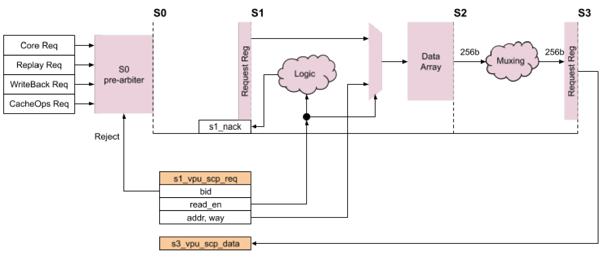


_Figure 1 - VPU Access to the DCache_ 

There is no control access to the DA. The address and way requested by the VPU is read and data is delivered in S3. However, the VPU uses the same linear address to the SCP index conversion as the DCache (i.e. the pointer to the correct SCP physical locations is obtained by simple address mapping functions). Notice that the output is currently 256 bits to feed the 8 lanes of the VPU (32 bits each). 

The interface is very simple, as it is just a reading operation from the memory. For timing requirements, data read from the DA is pipelined for one more cycle and delivered in S3. 

When an instruction is not executed at S1 because of a VPU read, it is pushed into the Replay Queue (RQ), which tries to push it back to the pipeline as soon as it can. 

#### 2.3.2 TensorReduce Operations 

The control for a TensorReduce operation is more elaborate since the VPU and Core must be coordinated with the DCache. However, exactly how other parts of the system are implemented to provide data to the DCache for reduce operations is beyond the scope of this document. 

A reduce operation starts with writing to a CSR. A special module (dcache_reduce) inside the DCache is in charge of performing the actions as specified. These operations include: 

- Send or wait for the “send ready” message to/from the partner Minion. This is achieved through the L2 interface, as represented in the figure in the L2 Flow section. 

- Sending data (see next figure for a simplified representation of the data flow): 

   - Signal vpu_ctrl.send_reg is active while there are registers to send and the Buffer Array (BA) is not full. This signal rejects requests at S0 and is used to indicate that the pipeline is going to be used in S1, S2 and S3. 

   - Data from VPU arrives at S1 via signal s1_core_store_data and is temporarily stored in the BA in S3 (an index of the allocated entry is obtained in S2). 

   - The BA content is subsequently read and sent to the destination Minion via an L2 message with the ID “ET_LINK_Min_Msg_Id_Reduce_Data” 

- Receiving data  (see next figure for simplified data flow): 

   - BA entries are allocated to receive new data. 

   - When data arrives via L2, it is stored in the BA allocated entries. 

   - Data is sent to the VPU and bit vpu_ctrl.exec_op is set to indicate that a new operation has to be executed. Data is extracted from the BA and sent to the Core validating signal s3_core_resp_valid (indicating that the destination is Floating Point (FP) and data type PS) and delivering data in s3_core_resp.data. 


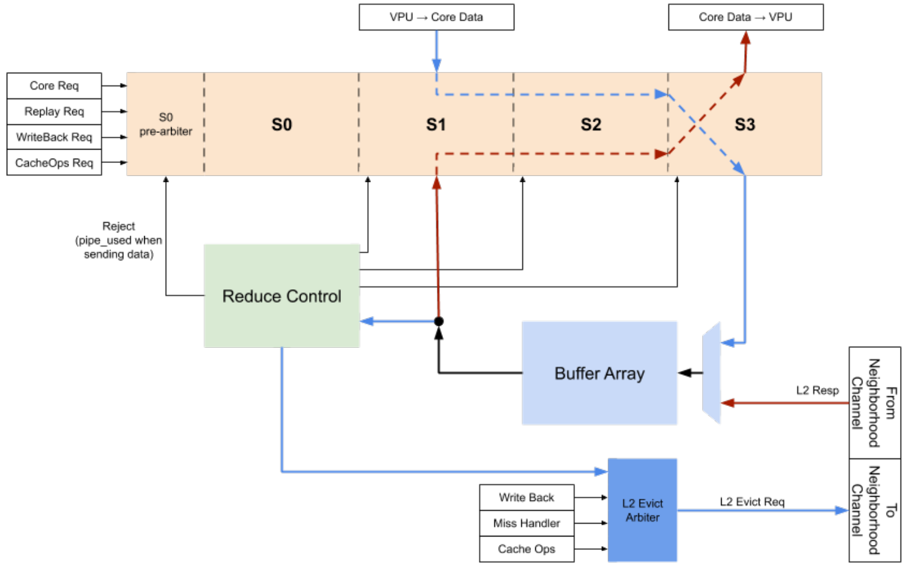


_Figure 2 - TensorReduce Operation Microarchitecture_ 

#### 2.3.3 TensorStore Operations 

TensorStore and TensorReduce operations related to the VPU are very similar; in fact they share the state machine inside the DCache. While there are some particularities that differentiate the two operations, they are quite minimal. 

A TensorStore of the VPU registers requests VPU registers the same way the TensorReduce does during a send operation. 

#### 2.3.4 TensorLoad Operations 

In the context of the VPU Interface section, the TensorLoad operations interact with the VPU in only one of its modes. This is the TenB mode that injects data directly from memory to a buffer in the VPU. The general operation is similar to that of other Tensor operations. A write in the tensor_load CSR triggers the signal tensor_ctrl.start. If no error in the configuration is detected, a special module in the DCache (tensor_load0 or tensor_load1) performs the following actions: 

- **TL0 loads data from matrix A** 

   - a. Request data: The software (SW) starts a TensorLoad to prefetch data from matrix A via the L2 interface 

   - b. Receive data: The data received through the L2 interface is stored in the L1 SCP. This action does not involve the VPU. 

- **TL1 loads data from matrix B** 

   - a. Request data: The SW starts a TenB that will  prefetch data from matrix B via the L2 interface 

   - b. Receive data: The data is also received through the L2 interface but it is stored in internal buffers of TL1 and VPU. TL1 implements a flow control mechanism with 4/6 credits. As soon as the TL1 pushes data from matrix B into the buffer of the VPU, the TFMA operation can be started. 

### 2.4 Virtual Memory Interfaces 

#### 2.4.1 TLB Interface 

These are basically Virtual Memory (VM) configuration signals used by the Translation Lookaside Buffer (TLB). See the following table for details: 

|**Signal**|**Function**|
|---|---|
|vmspagesize|VM Page Size. Supported sizes are 4 KB, 2 MB, and 1 GB|
|intervm_status|Selected bits from the MSTATUS CSR and other Minion internal<br>status bits that affect the VM operation:<br>**prv:**current privilege level<br>**mprv:**privilege level is modified<br>**mpp:**machine previous privilege level<br>**sum:**supervisor level can access user level pages<br>**mxr:**make executable pages readable<br>**debug:**debug mode|
|satp_info|SATP CSR: contains the VM mode and the Physical Page Number<br>(PPN) for the S-mode|
|matp_info|MATP CSR: contains the VM mode and the PPN for the m mode|
|satp_info_en|Pulse to notify a change in satp_info|
|matp_info_en|Pulse to notify a change in matp_info|
|tlb_invalidate|Pulse to invalidate all the TLB entries|


_Table 5_ 

#### 2.4.2 PTW Interface 

The TLB caches Page Table entries that translate a virtual address into a physical address. When a VM access misses the TLB, a request is sent to the PTW, which will walk the Page Table and return the corresponding Page Table Entry (PTE). 

|**Signal**|**Function**|
|---|---|
|ptw_req_data|Data field of the PTW request bus<br>**satp_mode:**mode field of the SATP CSR<br>**satp_ppn:**ppn field of the SATP CSR<br>**prv:**current privilege mode<br>**addr:**requested virtual address|
|ptw_req_valid|Valid flag of the PTW request bus (valid/ready protocol)|
|ptw_req_ready|Ready flag of the PTW request bus (valid/ready protocol)|
|ptw_resp_data|Data field of the PTW response bus. It contains the requested PTE<br>plus some status flags:|
||**access_fault:**access fault happened while walking the Page Table<br>**canceled_req:**response corresponds to a canceled request|
|ptw_resp_valid|Valid flag of the PTW response bus|


_Table 6_ 

### 2.5 L2 Interface 

The L2 interface has three independent interfaces: two for output and one for input. One output connects to the Neighborhood _evict_ module and another to the _miss_ module. The operation codes that each one can use will mainly depend on the size of the _data_ bus in the request (interfaces under modification). 

Notice that the evict and miss interface handshake follows the _Type A_ definition with two and three valid/ready pairs, respectively. 

See the Shire Interconnect (ET-Link specification) documentation for further information. 

|**Signal**|**Function**|
|---|---|
|l2_*_req_ready|Request ready from Evict or Miss entities in the Neighborhood|
|l2_*_req_valid|Request valid to Evict or Miss entities in the Neighborhood|
|l2_evict_req|Current fields in the request to Evict are:<br>**id**: identifier for the request. Contains an identification of the sub-<br>block within the DCache that created the request. This has to be<br>returned with the ACK (acknowledgement) for proper handling.<br>**source:**source is always Minion. Field set to 0.<br>**wdata:**request carries data<br>**opcode**: one of the currently defined ET_LINK_REQ_* OpCodes,<br>depending on the operation to be performed.<br>**address**: address field of the request, whose contents depend on the<br>operation (see Shire Interconnect document).<br>**data**: up to 512 bits of data for the evict. Actual size is specified in<br>the next field.<br>**size**: amount of data carried in the request, from 1 to 64 bytes, in<br>powers of two.<br>**qwen:**qword enable<br>**subopcode:**OpCode specific field|
|l2_miss_req|Current fields in the request to Miss are:<br>**id**: identifier for the request. Contains an identification of the sub-<br>block within the DCache that created the request. This has to be<br>returned with the ACK for proper handling.<br>**source:**source is always Minion. Field set to 0.<br>**wdata:**request carries data<br>**opcode**: one of the currently defined ET_LINK_REQ_* OpCodes,<br>depending on the operation to be performed.<br>**address**: address field of the request, whose contents depend on the<br>operation (see Shire Interconnect document).<br>**data:**up to 20 bits (upper bound set by the Cooperative TensorLoad<br>operations) used to convey additional information required by the<br>operation.<br>**size**: amount of data being requested, from 1 to 64 bytes, in powers<br>of two.<br>**qwen:**qword enable<br>**subopcode:**OpCode specific field|
|l2_resp_ready|Ready signal from the DCache to accept an L2 response|
|l2_resp_valid|Valid signal from the L2 indicating that a new transfer is arriving|
|l2_resp|Content of response. Current fields are:|
||**id**: must match the id of the request or provide information for the<br>message port being written<br>**dest:**destination<br>**wdata:**response carries data<br>**opcode**: operation to be performed.<br>**data**: up to 512 bits of data for the transfer, indicated in the next field<br>**size**: amount of data being provided, from 1 to 64 bytes, in powers of<br>two.<br>**qwen:**Qword enable|


_Table 7_ 

### 2.6 Other Interfaces 

#### 2.6.1 Errors 

The DCache has a few error interfaces to report and propagate the different error flags from its subblocks. A full list of the error signals together with their descriptions can be found below. 

The first error signal is relative to the TensorLoad blocks, while the second (cache_ops_err_flags) combines the memory access faults from multiple sources. There are also the error flags from the TensorReduce block and a few more signals to report the different bus errors from subblocks as well as the Physical Memory Attribute (PMA) bus errors. 

|**Signal**|**Function**|
|---|---|
|tensor_load_err_flags|Combines err_flags from both TensorLoad 0 and TensorLoad 1.<br>Does not take into account the access faults.|
|cache_ops_err_flags|Combines memory access fault flags from different sources:<br>cacheOp unit, cacheOp unit L2, TensorStore (Reduce), and<br>TensorLoad.|
|tensor_reduce_err_flags|TensorReduce error flags|
|bus_err|Reports bus errors from different sources: cacheOp unit L2, Miss<br>Handlers (MHs), Reduce, TL0, TL1, and PMA.|
|bus_err_addr|If the bus error comes from MHs, then the bus error address is<br>taken from the MH output as well. If there is a PMA bus error,<br>then this address will be the address from S1. Otherwise, it will<br>be all zeros.|
|bus_err_pc|Only present if the bus error comes from MHs.|


_Table 8_ 

#### 2.6.2 APB 

There is also an Advanced Peripheral Bus (APB) interface that is used for debugging. These signals come from the Bus Processor Analytic Module (BPAM). 

The list of signals for this interface can be found in the table below. They are standard Advanced Microcontroller Bus Architecture (AMBA) APB interface signals. Refer to the <u>APB Access</u> section for details about what is accessible through this interface. 

|**Signal**|**Function**|
|---|---|
|apb_paddr|APB address|
|apb_pwrite|APB write or read|
|apb_psel|APB select|
|apb_penable|APB enable|
|apb_pwdata|APB write data|
|apb_prdata|APB read data|
|apb_pslverr|APB slave error|


_Table 9_ 

#### 2.6.3 Debug 

The DCache top block has several debug interfaces. These are connected to the Debug Status Monitor. One of these interfaces, called csr_debug_bits, is for the CSRs. There are seven additional interfaces, which come from different DCache subblocks, all of which are composed of three arrays: sm_match_* (64 bits), sm_filter_* (200 bits), and sm_data_* (4 x 128 bits). The different subblocks they refer to are: TensorLoad 0 (tl0), TensorLoad 1 (tl1), TensorStore (ts), cacheOp unit (co), cacheOp L2 unit (col2), Miss Handlers (mh), and DCache (dc). 

Below the full list of signals: 

|**Signal**|**Function**|
|---|---|
|csr_debug_bits|Debug signals to CSR|
|sm_match_debug_signals_tl0|TensorLoad 0|
|sm_filter_debug_signals_tl0|TensorLoad 0|
|sm_data_debug_signals_tl0|TensorLoad 0|
|sm_match_debug_signals_tl1|TensorLoad 1|
|sm_filter_debug_signals_tl1|TensorLoad 1|
|sm_data_debug_signals_tl1|TensorLoad 1|
|sm_match_debug_signals_ts|TensorStore|
|sm_filter_debug_signals_ts|TensorStore|
|sm_data_debug_signals_ts|TensorStore|
|sm_match_debug_signals_co|CacheOp unit|
|sm_filter_debug_signals_co|CacheOp unit|
|sm_data_debug_signals_co|CacheOp unit|
|sm_match_debug_signals_col2|CacheOp L2 unit|
|sm_filter_debug_signals_col2|CacheOp L2 unit|
|sm_data_debug_signals_col2|CacheOp L2 unit|
|sm_match_debug_signals_mh|Miss Handlers 0 and 1 (2 x 64 bits)|
|sm_filter_debug_signals_mh|Miss Handlers 0 and 1 (2 x 200 bits)|
|sm_data_debug_signals_mh|Miss Handlers 0 and 1 (2 x 4 x 128 bits)|
|sm_match_debug_signals_dc|DCache pipeline|
|sm_filter_debug_signals_dc|DCache pipeline|
|sm_data_debug_signals_dc|DCache pipeline|


_Table 10_ 

## 3 Internal Architecture 

The DCache architecture comprises six pipeline stages that execute load or store commands from the Core. The same pipeline can be used by additional modules running ad-hoc complex commands. 

In general, to enter the DCache pipeline there is an arbitration process. The only exception is that the VPU will read from the internal memory when configured as the SCP. 

After the first arbitration process, any block that has granted access to the pipeline provides information about the type of memory operation that it wants to perform. The details of the memory operation include, but are not limited to, the size of the data to be manipulated, the address where the data are located, the read or write operation to perform, the source or destination of the data, etc. There are some special operations that require additional information, like the _atomic_ operations. 

Once the necessary information from the block requesting to use the DCache pipeline is available, the address is checked to validate that the instruction/operation has permission to access the data. If this is not the case, an error (exception) is reported. 

Once access to the data has been granted, if the data is already available in the DCache, it will be updated or returned to the destination, depending on whether it is a write or read operation, respectively. On the other hand, if the data is not available (missing) in the DCache, a specific Finite State Machine (FSM) called _Miss Handler_ (MH) is started to retrieve the data (for readings or for cacheable writings) from the upper memory levels or to send the data (for non-cacheable writings) to the upper memory levels. While the MH FSM is accessing remote memory locations, the instruction/operation may remain in the _Replay Queue_ (RQ) until data is available and it can be replayed to complete. 

Some of the blocks that may want to access the DCache pipeline only do a subset of these operations, like validating that accessing a given memory address is allowed. Other operations just read the _MetaData_ associated with the cached information. 


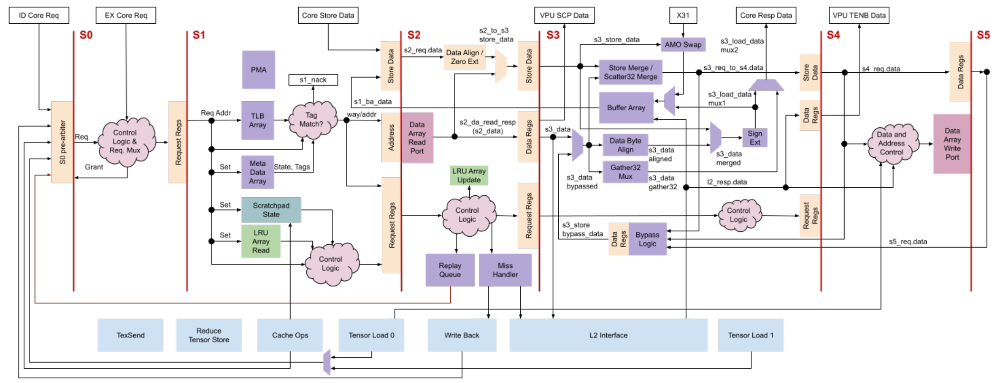


_Figure 3 - DCache Microarchitecture Details_ 

### 3.1 Pipeline 

A schematic representation of the pipeline together with the additional modules is shown in the previous figure. The details of the control logic are relatively complex and are not described in detail in the following sections; only the general functional operation is described. 

#### 3.1.1 Pipeline Stage 0 

Pipeline stage 0 (S0) is aligned with the Intpipe EX stage. In this stage, the request entering the pipeline is selected. One cycle before S0 (pre-S0 or ID in the Intpipe), the different blocks willing to access the pipeline activate their requests, and one cycle later (in S0) only one grant signal is positive. The “winner” request is created and registered to be processed in pipeline stage 1 (S1). 


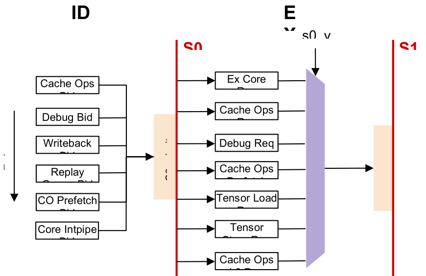


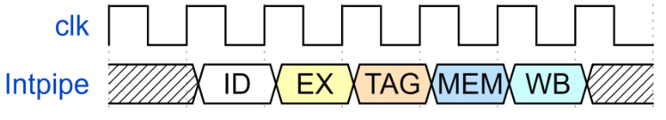


_Figure 4 - Main Tasks Performed in Pre-S0 and S0_ 


Up to six functional units can request access to enter the pipeline in pre-arbitration S0. The prearbitration is accessed by order of priority from high to low, as follows: 

- CacheOps module, willing to read MetaData 

- Debug port, willing to read MetaData 

- WB unit, willing to read from DA 

- RQ, willing to replay an incomplete instruction 

- CacheOps module (again), willing to inject a L1 prefetch instruction (load to “null” register) 

- Core intpipe, willing to inject a new instruction 

Additionally, the following four units may require access at S0 to start an operation within the pipeline: 

- Reduce unit: blocks any other access to the pipeline when it requires that some store data from the VPU passes through it. 

- VPU: directly accesses the DA and also blocks any other access to the pipeline input. 

- TensorLoad unit: injects its request to S0 only when the stage is not being used by any other module. 

- CacheOps prefetch unit: also only injects its request to S0 when the stage is not used by any of the previous modules. 

The amount of information included in the S0 request by each functional module depends on the actions to be performed. The most complex requests come from the RQ, followed by the Core Intpipe. Other units like TensorLoad and cacheOps prefetch only push an address into the pipeline to translate it from the Virtual Address (VA) to the Physical Address (PA). Note that S0 is not synchronized with the EX stage of the Intpipe in all cases. For example, for cacheOps, originated by a write to CSR, the WB stage of the Intpipe is synchronized with the pre-S0 stage of the DCache. 

#### 3.1.2 Pipeline Stage 1 

The main operations of pipeline stage S1 are: 

- Translate from the VA to the PA via the TLB 

- Determine whether the address to be accessed is present in the DA, given the information stored in the MetaData array 

- Generate exceptions if there is any kind of memory access fault (PMA) 

- Generate the address for the DA 

- Detect if the instruction has to be rejected (there may be multiple causes). If this is the case, a new instruction may end up in the RQ in the next stage. 

In this cycle, the Core data to be stored is also received by the pipeline to be stored later, if appropriate. These data may come from the Core or from the VPU in some special operations. 


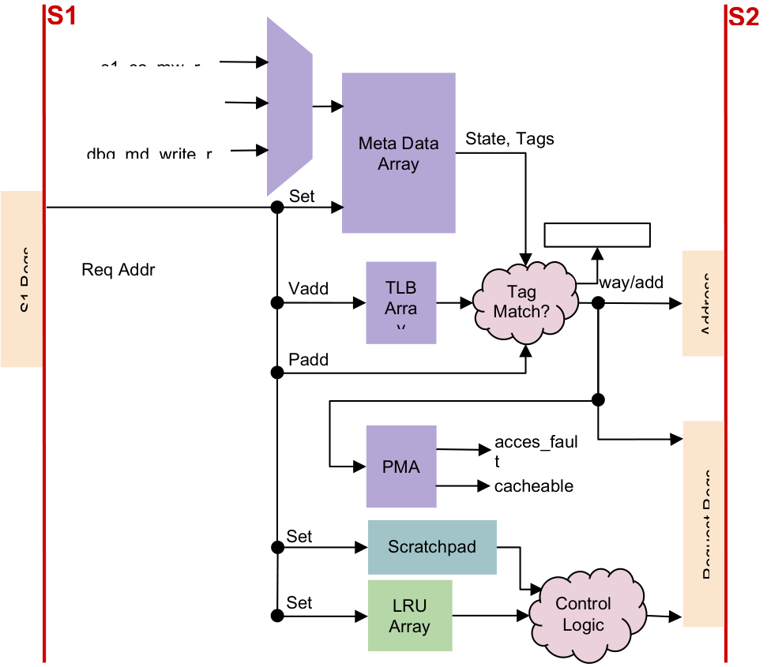


_Figure 5 - Microarchitecture of Pipeline S1_ 

#### 3.1.3 Pipeline Stage 2 

Pipeline stage 2 (S2) is where the access to the DA and the hit detection are performed. If a miss occurs, the MH requests the data through the L2 interface. If a hit occurs, the instruction progresses to S3. S2 contains three main register-to-register paths: 

- **Store Data** to **Store Data** : Data from the previous S1 core or S3 BA is aligned/zero extended and registered. 

- **Address** to **Data Regs:** The DA is accessed with the registered address computed in S1. Up to 256b of data are read and registered into data regs to be used in S3. 

- **Request Regs** to **Request Regs** : Whether the instruction passes to S3 is determined by the information contained in the Request Registers. If the cache hits, the instruction passes to S3, otherwise the MH takes ownership and the instruction will be replayed. 

The two main auxiliary blocks that get their inputs in S2 are the <u>Replay Queue and the Miss Handler.</u> 

Other relevant work implemented in S2 includes: 

- Misaligned accesses for the VPU are done in two passes reusing the store data path. The first pass reads 256b from the DA. This data goes to the BA in S3, and the instruction goes to the RQ for the second pass. The data stored in the BA will be later registered in 

the S2 Store Data. When the second pass is performed, the first 256b are sent from the S2 Store Data to the S3 Store Data and the second 256b are sent from the DA to the S3 Data Regs (see Figure below). 

- The Least Recently Used (LRU) MetaData is updated at every memory block access. 

- For stores, the atomic unit takes care of aligning the new data to write and merge it with the current data. Therefore, when dealing with stores, we are doing a read + modify + write. 


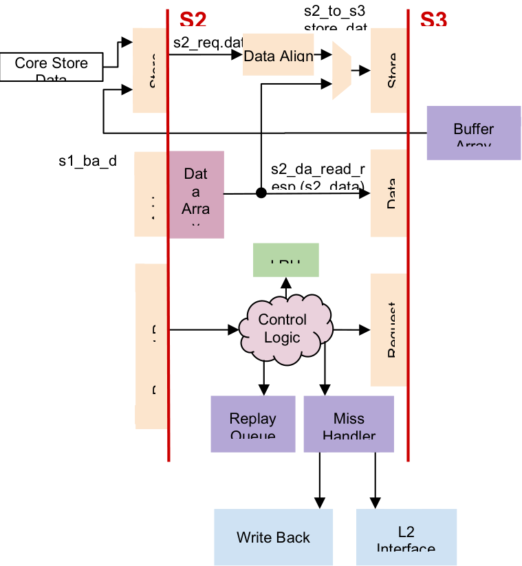


_Figure 6 - Microarchitecture of Pipeline S2_ 

#### 3.1.4 Pipeline Stage 3 

Pipeline stage 3 (S3), which is aligned with the WB stage of the Core, is responsible for handling the data read in S2: 

- Writes back the data to the Core and the VPU after aligning it at the byte level and signextends or zero-extends the data based on the request type 

- Bypasses store data from older stores 

- Merges first pass and second pass data for misaligned loads. The first pass data is stored in the BA and the instruction goes to the RQ for the second pass. The data stored in the BA is registered in the S2 Store Data. When the second pass is performed, the first 256b are sent from the S2 Store Data to the S3 Store Data and the second 256b are sent from the DA to the S3 Data Regs, where it is merged. 


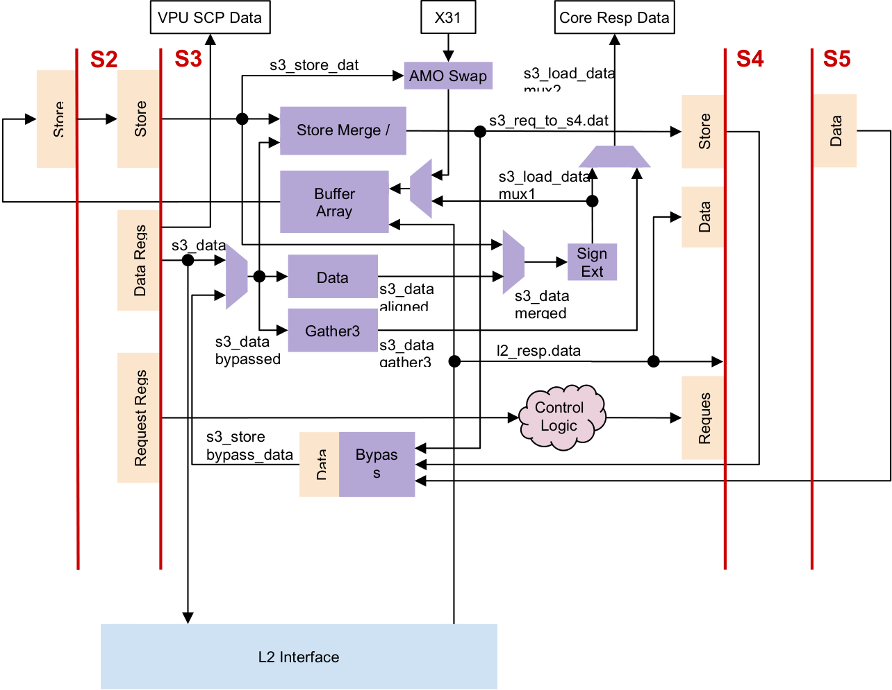


_Figure 7 - Microarchitecture of Pipeline S3_ 

#### 3.1.5 Pipeline Stage 4 

In pipeline stage 4 (S4), the data is stored in the DA. An arbiter with static priority selects the client that wins the write port of the DA. The following are the clients (listed from highest to lowest priority): 

- Stores in S4 (**highest priority**) 

- Fills from the SEND port 

- L2 fills initiated from the MH 

- TensorLoad transformation loads 

- Config DA clear 

- CacheOps DA clear 

- Debug writes (**lowest priority**) 


Fills can only access the write port if there's no store and if the read port of the Data Array was not granted in the previous cycle. 


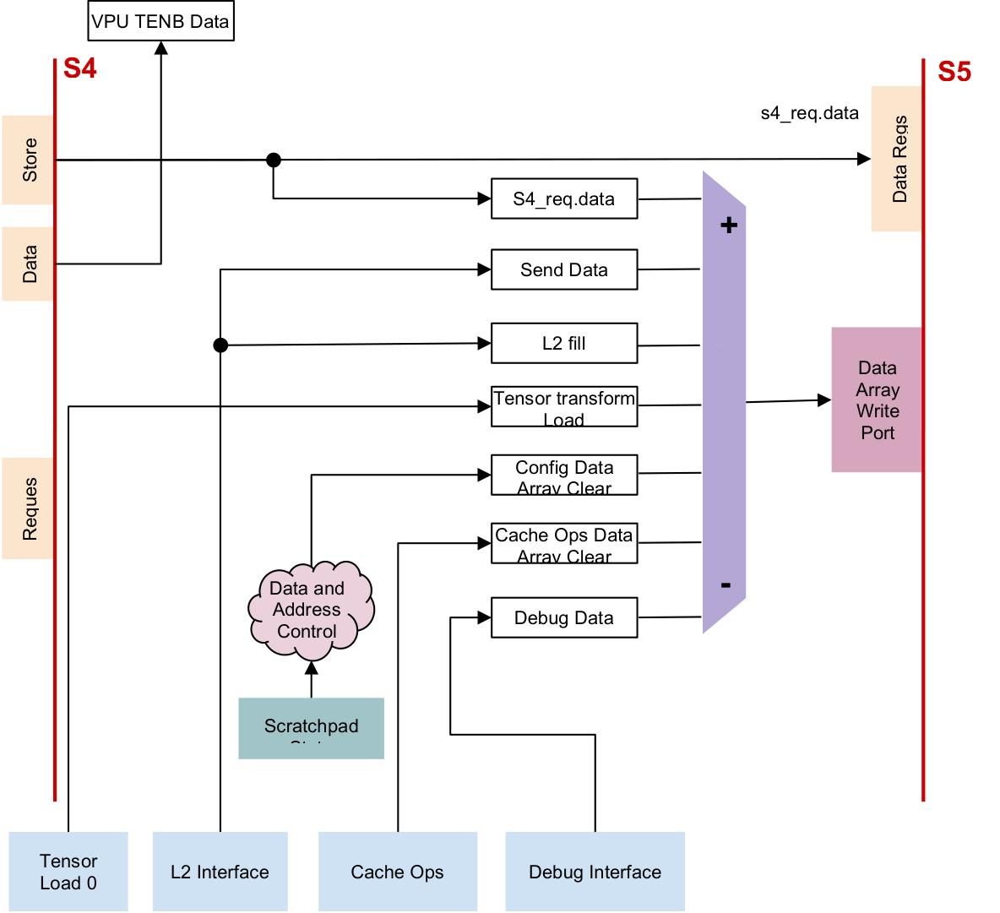


_Figure 8 - Microarchitecture of Pipeline S4_ 

#### 3.1.6 Pipeline Stage 5 

The purpose of pipeline stage 5 (S5) is to bypass store data to S3. 


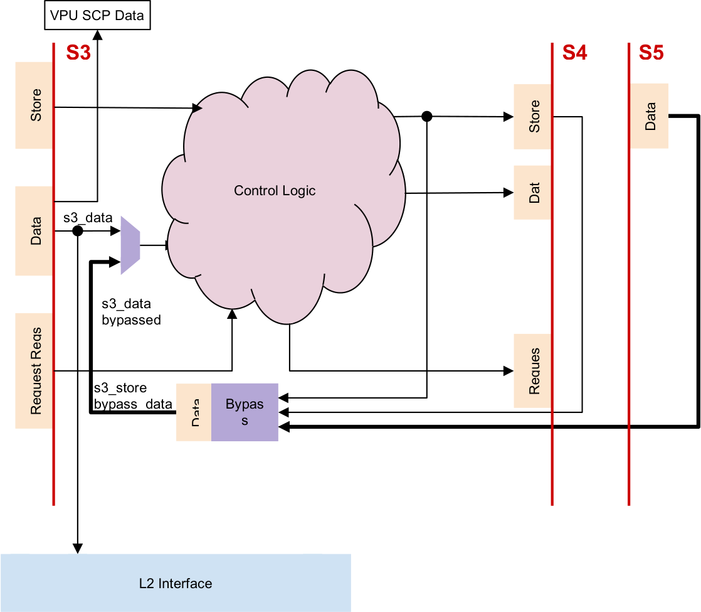


_Figure 9 - Microarchitecture of Pipeline S5_ 

### 3.2 Memory Structure 

The DCache has a 16-set, 4-way structure with 512 bits per line by default. It also supports another mode (4-set, 4-way) when SCP is enabled. 

The physical memory of the DCache is made of 4 LRAM (Latch-RAM) blocks of 128 rows and 64 bits per row. Each block has a single read and a single write port. These blocks are wrapped by the dcache_data_array module that accepts 4-dimensional read and write requests, one per memory block. It is then possible to access 1x256b (one row), 2x128b (2 different rows), or 4x64b (4 different rows) memory chunks. Being able to access multiple rows at a time is useful in case of misaligned accesses. 

The requests to the dcache_data_array module specify two addressing fields: the address and the way. The address field is the complete byte address within a way. Since the LRAM has capacity for 128 rows x 8 bytes/row x 4 blocks = 4k bytes, each way has 1k byte, and the valid address bits are then [9:0]. 

For internal addressing purposes of each block, the way is used as the 2 Least Significant Bits (LSBs) of the row index and address bits 5 to 9 are used as the remaining 5 Most Significant Bits (MSBs) of the row index. Notice that each complete row has 32 bytes (4 blocks of 8 bytes), so the row index must discard address bits [4:0]. 

In terms of the set/way, given that a cache line is 512b, the address to the LRAM blocks can be described as follows: 


```
addr_LRAM = { set[3:0], idx[0], way[1:0] }
```


where idx[0] (1 bit) represents one half of the cache line. Notice that the previous expression can also be written as: 

```
addr_LRAM = { addr[9:5], way[1:0] }
```

according to the described interface to the dcache_data_array. From a graphical perspective, the memory can be represented as shown in the next figure. 


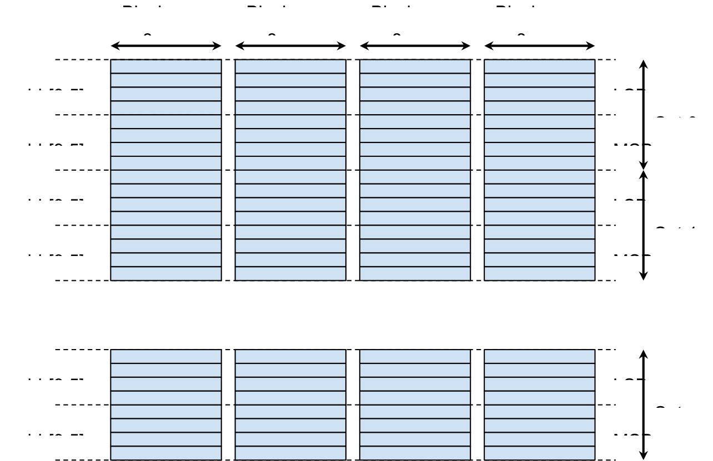


_Figure 10 - Memory Organization in the DCache LRAM_ 

#### 3.2.1 Changing DCache Structure 

The DCache can be configured as a 4-set/4-way with the space used by 12 sets (48 cache lines) reserved for the SCP or as a 16-set/4-way. The default configuration is 16-set/4-ways, which uses 100% of the available local memory to cache data. 

The operation in a 4-set mode is implemented by considering two more bits in the TAG for each stored cache line and by forcing the two MSBs of the set to 2'b11. This way, only sets 12 ..15 from the default set values are used. 

In the normal 16-set mode, the two extra bits in the TAG are also stored and used, but they don’t cause a disturbance since they are the same as the 2 MSB of the set. This means that there is a single implementation for the TAG matching check. 

When a new request enters the pipeline and the 4-sets mode is configured, the hardware (HW) forces the 2 MSBs of the set to 1. From that point onwards, everything operates normally taking into account that sets 0 .. 11 are in the SCP, which implies that they can’t be used for regular DCache operations (i.e. store memory lines depending on the Intpipe requests). 

The process to switch from 16-set to 4-set and vice-versa is started by changing bit 0 in the CSR _Scratchpad Control_ . Each time that the bit is modified, the process to change the DCache mode starts. During this process, no new requests are allowed to enter the DCache and the Intpipe must not make new requests to other DCache modules (via CSR) until the operation is completed (it can be monitored via the s3_ordered signal, which is used by the _fence_ instruction). 

When the pipeline and the other functional modules in the DCache are idle, the mode is changed in a process that lasts several cycles because the content of the local memory has to be cleared. This implies writing a zero to each memory line that has to be cleared. The contents of the MetaData are also invalidated. 

After reset, the process to define the mode is initiated to ensure that it matches with the value present in the CSR _Scratchpad Control_ . 

### 3.3 MetaData Structure 

The MetaData array contains the state and TAG for all the sets and ways of the cache. The structure is pretty simple as there are 64 entries (16 sets x 4 ways) and each entry has the following information: 

- Valid bit: validates the information contained in the latch-based memory 

- TAG: physical address bits [39:7]. In a normal share-mode configuration, only bits [39:10] are necessary (bits [5:0] are for the byte address in the cache line and bits [9:6] indicate the set). However, in split or SCP modes, the sets are reduced to just two (1 bit). 

- Line state: 2-bit field indicating the state of the line. The possible states are as follows: _invalid_ (2'b00), _shared_ (2'b01), _exclusive_ (2'b10), or _modified_ (2'b11). However, the _shared_ state is never assigned, given that there is no cache coherency at this level. 

MetaData is normally checked during pipeline S1 to determine whether a given cache line being accessed by the instruction is locally stored and, in that case, whether it has been modified or not. 

The content of the MetaData can be modified by the <u>Miss Handler</u> (MH) or by the <u>Cache Operations (cacheOps). Given that the FSMs for these two blocks are working in parallel, there</u> are cases in which either the instruction that may trigger the MH or the ongoing cacheOps may collide.Therefore, an anti-collision mechanism is implemented to make one of the processes (the ongoing instruction in the pipeline or the micro operation of the cacheOps) wait until the other has finished, depending on which arrives first. This mechanism is represented in the following figure: 


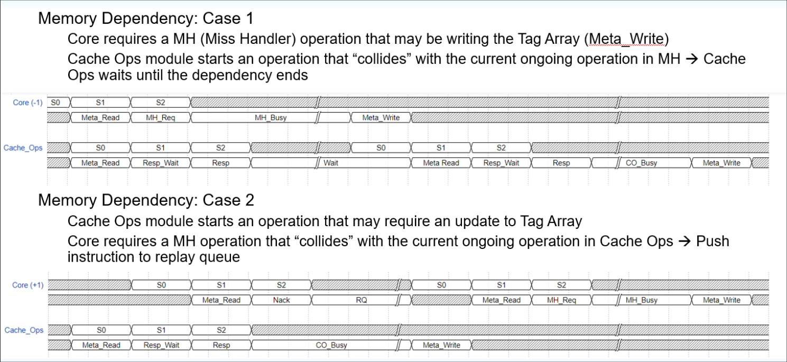


_Figure 11 - Anti-Collision Mechanisms When Updating MetaData_ 

### 3.4 PMA 

The Physical Memory Attribute (PMA) implementation in S1 makes sure that the memory operation or instruction has the right permissions given the properties and capabilities of each region of the machine’s physical address space. Please refer to the <u>RISC-V Instruction Set Manual, Volume II: Privileged Architecture document for more information.</u> 

### 3.5 L2 Flow 

The internal structure of the operation involving the multiple L2 interfaces is represented in the next figure. 

Currently, requests using the L2 evict interface are generated by the WB (following evict requests from cacheOps or MH), MH (for uncacheable [UC] operations), Reduce, and L2_Prefetcher units. Requests using the L2 miss interface are generated by the MH and TensorLoad. 

The L2 requests are routed through two interfaces (named evict_req and miss_req) only to improve the implementation timing for those signals from/to the Neighborhood. 


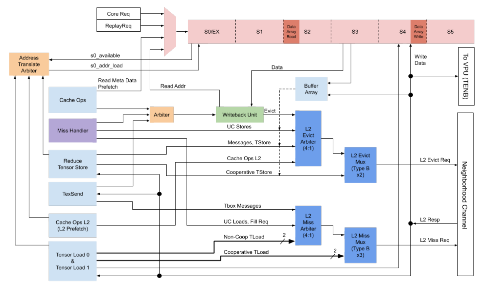


_Figure 12 - L2 Interface Structure_ 

The requests to L2 may either contain or not contain data: 

- WB operations are used to write data to upper cache levels 

   - Evict operations (REQ_Write): always 512b in two transfer cycles of 256b each, reading from the LRAM 256b in every cycle. Triggers for these operations are the cacheOps upon a core request or MH when a dirty line has to be replaced. 

- UC stores: initiated by MH, sends up to 256b of data in one cycle (ET_LINK_HLine) coming from the Core and temporarily stored in the DCache BA. 

- UC loads: initiated by MH; contain no data. They may request transfers of up to 256b that will be stored in the BA when receiving the response (see below). 

- Reduce operations: initiated by Reduce module, messages with different amounts of data may be sent (opcode ET_LINK_REQ_MsgSendData): 

   - Single-byte data to synchronize with Reduce modules in other Minions 

   - 256b towards other Reduce modules (destination Minion specified in the address field together with the message ID, ET_LINK_Msg_Id_Reduce_Data). Data is taken from the BA, previously stored using the DCache pipeline (“intercepting” the pipeline to receive the VPU register content from the core interface, s1_core_interface_data) and stored during S3. 

- TensorStore operations: similar to TensorReduce operations, but they produce a different OpCode for the requests (ET_LINK_REQ_WriteAround), the address format is different (contains a real address aligned to at least 16 bytes), and data size can be 128b, 256b, or 512b. 

- L2 prefetch operations: these requests contain no real data, but the data field is used to provide the command (lock, unlock, flush, evict, prefetch, SCP fill), start level, and destination level (this is the reason why the prefetch operations are issued through the evict arbiter, as shown in the previous figure). 

The responses from L2 may also either contain or not contain data: 

- Pure ACK responses are captured by the different state machines to prevent too many requests from being in-flight and to return to the Ready state to accept more queries. 

- AckData responses are treated in different ways and data may be stored in different locations: 

   - MH operations: 

      - UC stores: data stored in the BA module, 128b max per transfer. 

      - Fill operations receive one cache line (512b) each time and data are directly written into the DCache LRAM following the address and way specified by the MH. 

   - TensorLoad operations: similar to the fill operations. For transforms, the TensorLoad module captures the data and writes it back to the LRAM later on with the appropriate transformation 

- MsgRcvData: some protocols, like those implemented by Reduce or Ports, receive data via a message. Messages can be stored directly into the LRAM (for Ports; data is actually stored in pre-allocated ports), or into the BA (Reduce operations), to be sent to the Core/VPU later. 

### 3.6 Miss Handler 

The Miss Handler Unit (MHU) block contains a number of MH FSMs, defined by the value of the constant DCACHE_MH_FILE_SIZE. The default value for this constant is 2 and only this value has been verified. 

A free MH is invoked when an instruction requires data to be obtained or sent from/to the next memory level, in this case the L2. Two different scenarios may require the MH to be invoked: 

1. An instruction wants to access a cacheable memory region but the cache line is not present in the L1 memory. In this case the missing data is requested from the L2 to fill one cache entry with the required cache line (main flow). 

2. An instruction wants to access an uncacheable (UC) memory region, wants to access a cacheable memory region bypassing the L1, or wants to perform an atomic operation. In this case, the transfer of data in and out of the Core is managed without modifying any cached content (UC flow). 

#### 3.6.1 Miss Handler Allocation 

If an instruction requires an MH and there aren’t any free, the instruction waits in the RQ until the required MH is available. Once the instruction gets a free MH, it also waits in the RQ until the MH has completed the necessary steps. 

If the instruction needs to retrieve missing data from a cacheable memory region using the main flow, any of the DCACHE_MH_FILE_SIZE MHs can process the request. However, if the UC flow needs to be used, only the MH with an index that matches the thread ID associated with the instruction can take the request. This way, any UC access is guaranteed to happen in a strict order. 

More than one instruction can be assigned to the same MH. This happens when an instruction (of any thread) allocates the MH to obtain a missing cache line. If one (or more) subsequent instruction needs to access the same cache line and it arrives at the S2 before the MH has completed the fill operation, it will be assigned to the same MH. All the instructions assigned to the same MH will wait in the RQ until the MH completes the action, and they will simultaneously become ready to be replayed. 

#### 3.6.2 Miss Handler FSM 

The FSM to obtain missing data is shown in the following figure, which represents the main flow to handle miss requests. This also represents the initial entry state towards the UC flow. 

Depending on the action that needs to be performed and whether the required cache line is in the local memory or not, the FSM will leave the initial state (named Invalid or Idle) to go to different states. 

Three different situations can be observed here: 

1. The instruction wants to write into the cache line that is already in the cache. The cache MetaData is updated to mark that the line is in the Modified state. No additional action is required. 

2. The instruction wants to access data that is not in the cache and does not need to replace a used cache entry or will replace a non-modified cache entry. Go directly to request the missing cache line and once it’s obtained, update the MetaData info to reflect the newly downloaded cache line and its state. 

3. The instruction wants to access data that is not in the cache and needs to replace a used cache entry in the Modified state. In this case, the first action before requesting new data is to ensure that the modified data is evicted to the L2. After that, the procedure to fill the cache memory with the requested cache line is the same as in the previous step. 

Notice that the final step is always to update the MetaData for the cache entries. When the associated instruction is a write operation, it is set to be in the Modified state right after the fill process has completed. However, if the instruction is a read operation, the state is marked as 

Exclusive. These states will determine whether a dirty or clean Evict is necessary when one line is being replaced by another one. 

The set of states is listed in the following table and the FSM in the figure that follows. The names all include the MH prefix, and the ones that handle the UC accesses start with UC following the prefix. 

|**State**|**Purpose**|
|---|---|
|Invalid (or Idle)|MH is available|
|Acquire_Wb|Dirty evict, requests WB access|
|Fill_Req|Requesting a new cache line|
|Fill_Resp|Waiting for the fill to finish|
|Meta_Write_Req|Updates the meta state to the fill one|
|Meta_Hazard|Hazard after the meta write|
|UC_Wait_Idle|Waits until other UCs are empty before starting a UC load|
|UC_Load_Req|Requests the UC load data|
|UC_Load_Resp|Waits for the UC load data simply to keep the UC as outstanding|
|UC_Store_Wait|Sends the store UC request to the L2|
|UC_Store_Req|Sends the store UC request to the L2|
|UC_Store_Ack|Waits for the L2 ACK|
|Fill_Clean|Cleans the content of the MetaData if the fill gets an error|


_Table 11_ 


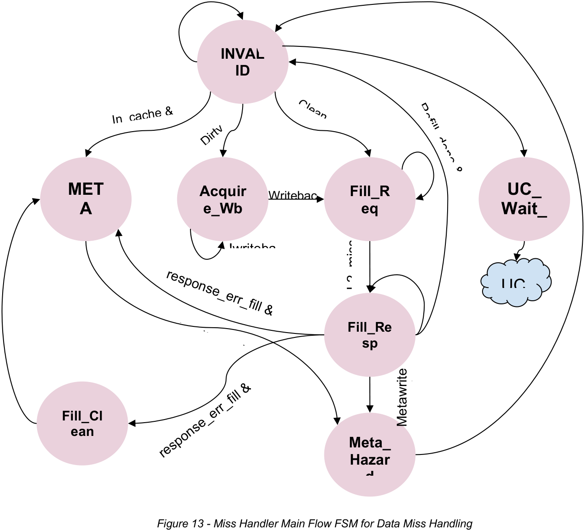


_Figure 13 - Miss Handler Main Flow FSM for Data Miss Handling_ 


A separate flow to handle the Uncached accesses is represented in the following figure: 


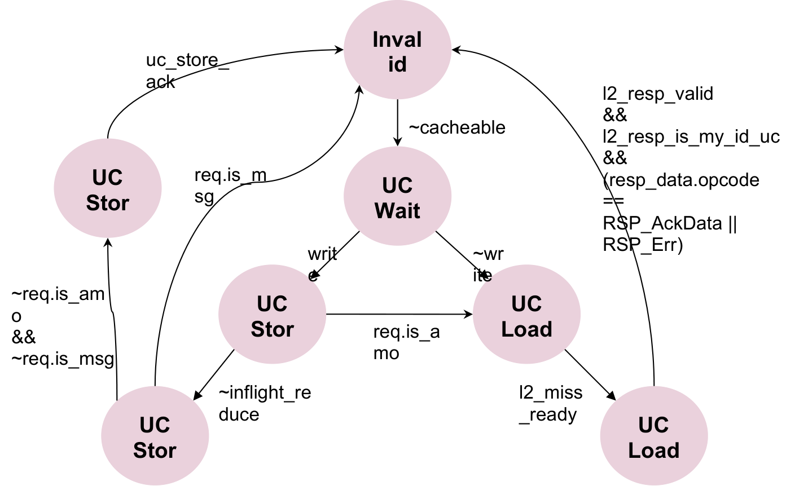


_Figure 14 - Miss Handler UC Flow FSM for Data Exchange to L2_ 

### 3.7 Replay Queue 

When an instruction enters the DCache pipeline (access granted to the Core at S0) and can’t be executed for any reason, it is pushed into the RQ, which will try to re-execute the instruction when possible. 

As indicated in the <u>Pipeline Stage 0</u> section, instructions in the RQ have a higher order of precedence than new instructions from the Core, but a lower order of precedence than instructions/requests coming from other internal modules that need to use the pipeline. 

When the RQ is full, the Core receives id_core_ready = 0, which means that no more instructions can be accepted. The depth of the queue is 8 entries. If one instruction is allowed to enter the pipeline in S0, it is guaranteed that there will be room for it in the RQ in case it has to be replayed. 

Given that the allocation is actually a pre-allocation at the ID stage (indicated by id_core_alloc_rq_pre), if the instruction is not executed in S0 (confirmed with s0_core_alloc_rq_val), the pre-allocation is canceled. 

One instruction in S2 can enter the RQ if any of the following conditions are met: 

1. The instruction was NACKed in the previous stage (S1) because of: 

   - a. A collision with a cacheOp, meaning  there's a hit in the same set for an inflight transaction in the cacheOp unit. 

   - b. A collision resulting from a load operation going to the VPU registers while they are being used by the TFMA 

   - c. The instruction needs access to the BA read port but an UC store or a TensorReduce is using it 

   - d. The VPU is requesting SCP access 

2. The instruction conflicts with another instruction stored in any RQ entry. Conflicts appear when either the new instruction or the instruction in the RQ entry are of the _store_ type and one of the following conditions are fulfilled: 

   - a. The two instructions are accessing a similar address (only a range of bits are checked, 10 bits starting at bit 5, [14:5]). 

   - b. Either of the two instruction’s access is misaligned 

   - c. The instruction in the queue is accessing an UC memory region. 

3. The instruction gets a hit in the DCache, but this matches the line being updated by an ongoing MH operation 

4. The instruction does not get a hit in the DCache 

All the previous conditions are analyzed regardless of the thread to which the instruction belongs. 

Instructions whose accesses are misaligned may enter the RQ even if there is a hit because they may have to pass through the pipeline twice to complete the read or write operation. 

Once an instruction enters the RQ, the order of execution depends on a set of simple rules. The conditions for an entry in the RQ to be ready are the following: 

1. There must be no conflict with other instructions in the queue. Conflicts are set in temporal order (i.e., older instructions have preference over newer ones) and conflict flags are then set so that the execution of newer instructions depends on the execution of the older ones. 

2. If the instruction has entered the queue because some data from memory has to be returned (e.g., UC loads), the transaction initiated to obtain the data has to have finished. 

3. If the instruction entered the queue because there was a data miss and it is being handled by MH _N_ ( _N_ =0,1), this MH has to be ready to accept new operations (i.e., has finished the operation). 

4. If the instruction entered the queue and there was a data miss and no handlers were available, any MH has to be ready to handle the request. 

### 3.8 Scoreboard 

From the RQ, the scoreboard is generated by indicating whether or not each entry in the RQ contains a pending instruction that is the read type. This condition validates the scoreboard item for the destination and thread register indicated in the instruction request structure. The context of the scoreboard within the DCache pipeline is shown in the next figure. 


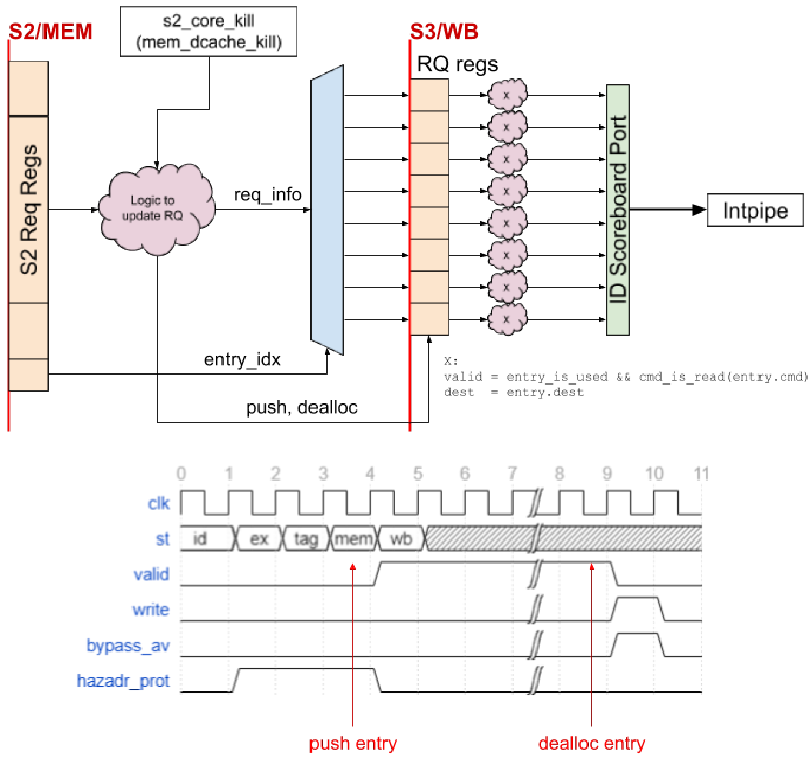


_Figure 15 - Diagram of the Relationship Between the RQ and the Scoreboard_ 

### 3.9 TensorLoad 

There are two instances of modules dcache_tensor_load, and each one has a different parameter value (MODULE_IDX), 0 or 1, that defines the functions that each one can implement. These two instances are described below. 

#### 3.9.1 TensorLoad 0 

This module implements the “regular” TensorLoad (downloads data into the L1 SCP) and  various other valid TensorLoadInterleave and TensorLoadTranspose operations. 

For regular TensorLoad operations, data is stored in the L1 SCP directly from the L2 interface. The SCP address (defined as the _addr_ and _way_ fields, as the addressing is the same as that used for L1 cache lines) is computed inside the TensorLoad FSM. 

For TensorLoad Interleave and TensorLoad Transpose operations, an intermediate buffer of 128 bytes located inside the tensor_load module is used to store part of the line downloaded from memory. Once the buffer is full, its contents are written into the L1 SCP. The WriteEnable signals together with the addr and way (to address the L1 SCP) are generated by the TensorLoad FSM. Data stored in the local buffer are muxed so that they are stored in the appropriate location. 

The local buffer size of 128 bytes is the minimum necessary to implement the five possible transformations given the capacity to write into the SCP in 8-byte chunks. 

##### **Interleave operations** 

Interleave operations are split into three states: one to update control counters/state after checking that all the lines to write are done, one to request new lines to memory, and another to move data from the local buffer to the SCP. 

##### **Transpose operations** 

Transpose operations are split into two states: one to request new lines to memory and another to move data from the local buffer to the SCP. 

Given that the local buffer is limited to 128 bytes (2 cache lines), during the state of requesting new lines, the state machine requests 8, 4, or 2 lines in each loop, depending on the specified size. The loop is repeated 8 times, totalling 64, 32, or 16 transposed cache lines. 

For instance, if the size = 0 (byte), 8 cache lines are requested. For each line (64 bytes) a section of 16 bytes is saved into the local buffer that depends on the configured offset. A matrix of (8 rows x 1 byte) x 16 columns is “vertically” stored. This is then read horizontally (rows) in groups of 8 bytes for up to 16 output lines (the limit is set by the num_lines configuration parameter). Each group of 8 bytes is stored in a different LRAM row (each column is 8 bytes wide). This process is repeated eight times so that a total of 64 lines are transposed starting at a given offset. A given line to transpose is only downloaded once. The following figure represents the first iteration when the offset is set to 0 (the first 16-byte chunk of each cache line is kept). 


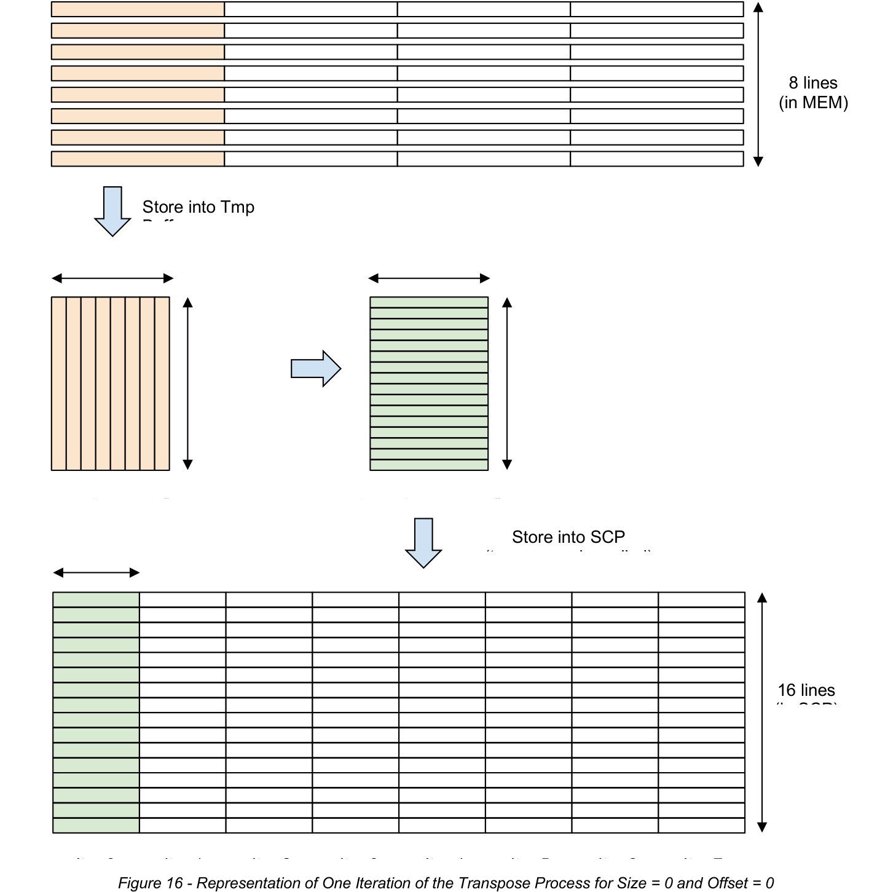


_Figure 16 - Representation of One Iteration of the Transpose Process for Size = 0 and Offset = 0_ 


For size = 1 (half word) and size = 2 (word), the process is similarly repeated eight times, but in these cases, the stored matrices are (4 rows x 2 bytes) x 16 columns and (2 rows x 4 bytes) x 16 columns, respectively, writing as many chunks of 8 bytes to the LRAM as the specified num_lines. 

Please refer to <u>PRM: Tensor Extension</u> for a detailed description of the Interleave and Transpose operations. 

#### 3.9.2 TensorLoad 1 

This module implements the TensorLoad Setup B (TenB) operation only. It uses a subset of the states of the TensorLoad 0 and defines additional control lines to interface with the VPU. 

The main difference between this module and the previous one is that downloaded memory lines are stored directly into a 4-entry buffer inside the VPU rather than in the L1 SCP. The interface signal _s3_vpu_scp_resp_ is used to indicate the arrival of new data (carried on _s3_vpu_tenb_data_ ). 

The overflow of the VPU buffer is avoided by means of a credit-based mechanism. Each time the TensorLoad FSM requests one memory line, it consumes one credit, and each time the VPU consumes the entry in the buffer, the credit is returned (using signal _s1_vpu_ctrl_ ). 

To improve performance, even if the number of entries is only 4, the TensorLoad state machine can use up to 6 credits to advance the request of memory lines, but only once the associated TFMA operation has started. If the responses from L2 arrive before the VPU has consumed an entry, the response will be stalled at the input of the DCache, thus blocking the L2 response interface. 

#### 3.9.3 TensorLoad FSMs 

The module _dcache_tensor_load_ includes three different FSMs: 

1. Control state FSM 

2. Request control FSM 

3. L2I (L2 Interface) FSM 

The Control state FSM feeds the request control FSM, which feeds the L2I FSM. The SW programmer may think about their relationship as nested loops: 

**<mark>loop</mark>** <mark>control state { ...</mark> **<mark>loop</mark>** <mark>request control { ...</mark> **<mark>loop</mark>** <mark>L2I { ... } ... } ...</mark> 

<mark>}</mark> 

#### 3.9.4 Control FSM 

There are two different FSMs that implement the different types of TensorLoads. A single module with a MODULE_IDX parameter selects the subset of operations that each instance implements. Possible values for this parameter are 0 and 1, so the modules are named _tensor_load_0_ and _tensor_load_1_ . The full list of states is as follows: 

|**State**|**Coding**|**Purpose**|
|---|---|---|
|ML_CTRL_Idle|3'b000|Default Idle state|
|ML_CTRL_Wait_Start|3'b001|Wait for convolutional bits to be ready|
|ML_CTRL_NoT_Req|3'b010|State without transformation, plain, writes|
|ML_CTRL_Int_Trans_Flush|3'b011|Base<br>state<br>to<br>implement<br>interleaves<br>for<br>MODULE_IDX 0 / Flush state for MODULE_IDX 1|
|ML_CTRL_Int_Req|3'b100|Interleave makes request to download lines|
|ML_CTRL_Int_Int|3'b101|Interleave makes data interleaving and writes to<br>SCP|
|ML_CTRL_Tra_Req|3'b110|Transpose makes request to download lines|
|ML_CTRL_Tra_Tra|3'b111|Transpose makes data transposition and writes to<br>SCP|


_Table 12_ 

**Control FSM 0** 


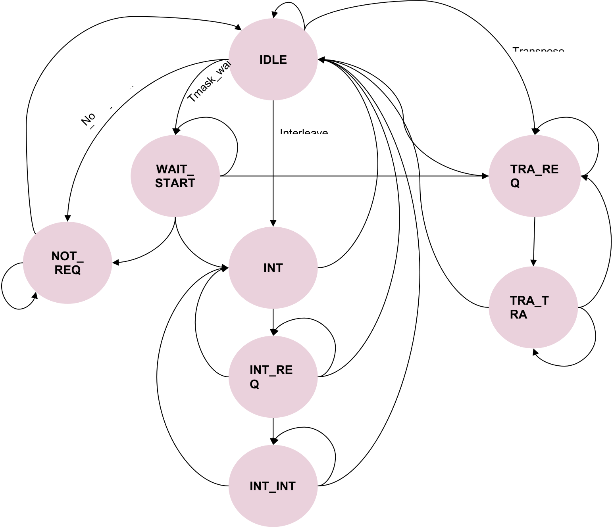


_Figure. 17 - TensorLoad Main Control FSW Flow for tensor_load_0 Configuration_ 

##### **Control FSM 1** 

|**State**|**Coding**|**Purpose**|
|---|---|---|
|ML_CTRL_Idle|3'b000|Default Idle state|
|ML_CTRL_Wait_Start|3'b001|Wait for convolutional bits to be ready|
|ML_CTRL_NoT_Req|3'b010|State for no transformation, plain, writes|
|ML_CTRL_Int_Trans_Flush|3'b011|Base state to implement interleaves for<br>MODULE_IDX 0 / Flush state for MODULE_IDX 1|


_Table 13_ 


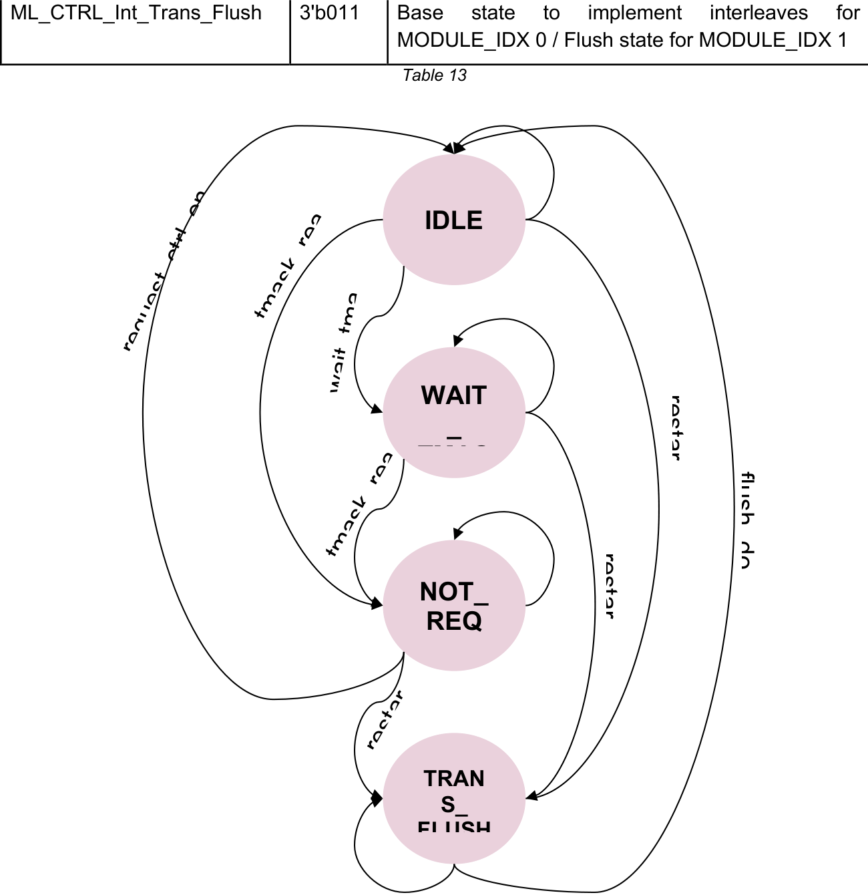


_Figure 18 - TensorLoad Main Control FSW Flow for tensor_load_1 Configuration_ 

#### 3.9.5 Request Control FSM 

The Request control FSM handles the requests to download a certain number of cache lines from certain memory addresses and store them in specific SCP destinations. 

This FSM is in charge of computing the source address by incrementing it with the stride value at each new line. It also checks the line mask to skip the masked lines. The computed address is then introduced into the DCache pipeline to check its validity. The TLB (in the case of using VM) 

and the PMA will validate the address. If it is incorrect or access is not granted, then an error will be triggered and returned back to the main control FSM to cancel the operation. If the address is valid, the memory request will be passed to the L2I FSM. 

#### 3.9.6 L2I FSM 

Common to tensor_load_0 and tensor_load_1, this FSM implements the interface to the next memory level (L2). It is replicated multiple times, one for each of the possible outstanding requests that the TensorLoad modules are allowed to keep at any time. The maximum number of outstanding values is defined by the constant DCACHE_TL_L2_TRANSFERS. When a new memory access is requested from the Request control FSM, any of the L2I FSMs can serve it as long as it is in the L2_Wait_Req state. 

This FSM is very simple, as it’s just a sequence of states that check that the request can be done (e.g. checks that the sequence number for the request can be reused in case of Cooperative TensorLoad operations), make the request, and then wait for the response before returning to the initial state. 


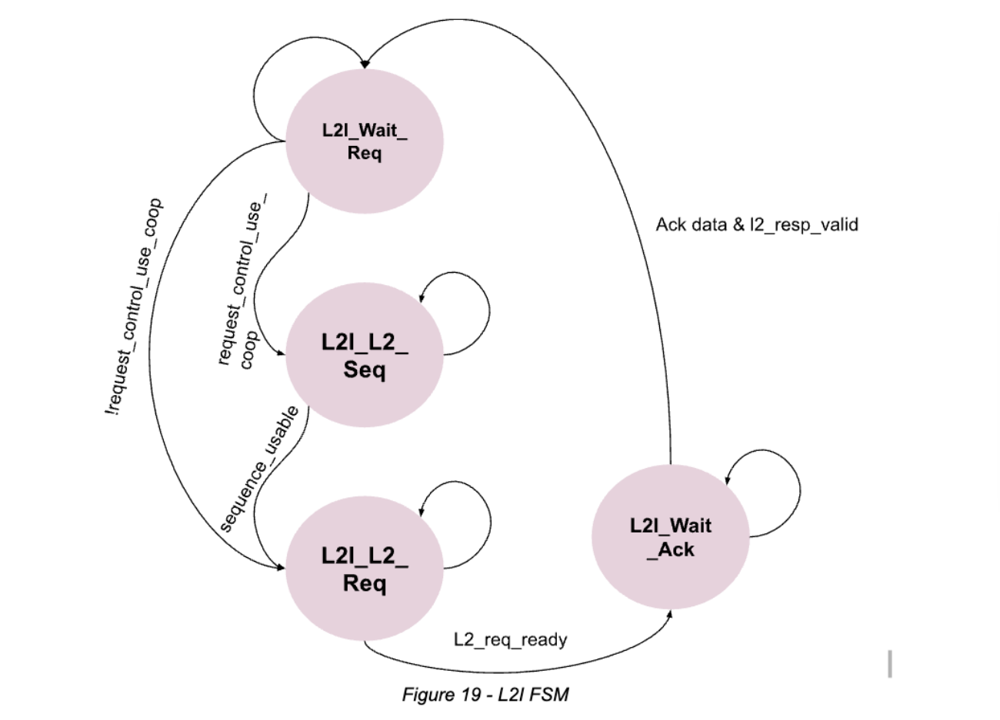


However, before accepting a new request either the “operation index” must be the index currently associated with the ongoing operations or there must be no outstanding operations associated with such an index. This index is just one bit to differentiate two operations. The TensorLoad FSMs operate in “continuous” mode, which allows for an operation that is triggered from software 

to start before the previous one has completed. However, no memory request for a new operation can be made if the one with the same index has not yet completed (i.e., it has not yet received all the responses). This is illustrated in the following figure: 

Scenario 1, normal operation pipeline with sequential request phases <mark>and overlapped response phases</mark> 

Scenario 2, pause in the request phases because operation with ID 0 <mark>has not completed the reponse phase</mark> w<mark>ait</mark> 

_Figure 20 - TensorLoad Operations Pipeline_ 

The index mentioned here is for internal use only and has no relationship with the “software index” that is specified at the moment of programming a new TensorLoad operation (see PRM: <u>Tensor Extension</u> for details in the programming of TensorLoad operations) and that can be used in conjunction with the tensor_wait CSR to check if a given operation has completed downloading data from memory. 

#### 3.9.7 Cooperative TensorLoad 

From the viewpoint of the TensorLoad state machines (tensor_load_0 and tensor_load_1), the main difference compared to non-Cooperative TensorLoads is that each request to L2 must follow some rules for the cooperative mask that is provided in the data field of the ET_Link interface. 

In non-Cooperative TensorLoads, the data field contains just one bit different from zero that matches with the bit index of the local minion_id: (`MIN_PER_N'b1 << minion_id). This is an 8-bit field, one bit per Minion in the Neighborhood. 

For Cooperative TensorLoads, additional fields are added. There is a common content that includes the mask for the cooperating Minions and Neighborhoods (according to the <u>PRM: Tensor Extension spec) and the ID provided by SW (5 bits).</u> 

```
((`MIN_PER_N'b1 << neigh_id) << `SHIRE_COOP_NEIGH_MASK_START)  | // Own Neigh mask
 (tensor_ctrl.coop.neigh_mask << `SHIRE_COOP_NEIGH_MASK_START) | // Provided Neigh mask
 (tensor_ctrl.coop.id << `SHIRE_COOP_ID_START)                 | // Provided ID
 (`MIN_PER_N'b1 << minion_id)                                  | // Own Minion mask
 tensor_ctrl.coop.minion_mask;                                   // Provided Minion mask
```

In the previous structure, the eight LSBs are for the Minion mask. The next eight bits are for the sequence (3) and ID (5). This ID is provided by SW. The upper four bits are for the Neighborhood 

mask. Notice how RTL always ensures that at least the mask bits for their own Minion and Neighborhood are set. 

The three bits for the sequence are generated internally by the state machine in charge of doing requests to L2. This sequence number is reset each time that this state machine receives a new command to download any number of lines. However, two different situations can be distinguished: 

1. Regular downloads to the SCP without transformation: The L2 requesting state machine just receives one command for a number of lines from 1 to 16. Each time a new line is requested, the sequence number is increased, looping around 8. 

2. Downloads for transformation operations: The main state machine sends multiple commands to the L2 requesting state machine. Each time a new command is issued, the sequence number is reset. This allows for the same sequence number to be repeated multiple times within a single transformation operation. 

In any case, the state machines must comply with the rule that two outstanding transactions cannot have the same ID+SEQ. The state machine compares the IDs provided by SW together with the available sequence numbers. 

Sequence numbers always increase by one, starting from zero so that all the Minions cooperating start with the same sequence value. When a new sequence number has to be used, HW checks that the response for the previous transaction that used it has already finished. 

### 3.10 CacheOps FSM 

The cacheOps FSM handles all the cache operations that are targeting the L1 data cache level. See <u>PRM: Cache Control Extension for more information about the operations that can be</u> performed. 

The state machine for cacheOps is aligned with the pipeline in that, for any operation, it may have to first read the MetaData and then go through the TLB and PMA. If the pipeline arbiter allows it, the address and set used for the operation are inserted in S0. Actions to be performed are evaluated in S2, after capturing back the data from the MetaData array and the translation from the TLB to the physical address, when necessary. If the TLB or PMA issue an error, this is captured in S1. 

The operations are repeated one or more times for every line to be processed, depending on the configured number of lines and the type of operation to be performed. 

The most complex state, aligned with pipeline S2, is the Cache_Op_Meta_Resp, which discriminates what the next action will be for every operation, depending on the response obtained from the MetaData array. 

CacheOps are constrained by other operations that may be in process, like MH operations or instructions in the RQ. If this is the case, cacheOps will wait until the conflict is resolved. Similarly, if a cacheOp is already doing an action that may conflict with other operations, the impacted state machines or instructions will have to wait until the cacheOp is finished. 

The set of states is listed in the following table (note that the names will all include the Cache_Op prefix): 

|**State**|**Purpose**|
|---|---|
|Invalid|Idle state|
|Meta_Read|Reads the tags to check which way the line is (if present) (S0 stage)|
|Meta_Resp_Wait|Waits for the tag response (S1 stage)|
|Meta_Resp|Receives the tag response (S2 stage)|
|Writeback_Req|Starts a WB|
|Writeback_Resp|Waits for the WB response|
|Meta_Write|Updates the tags|
|Meta_Write_Lock|Updates the lock status|
|Wait_Conflict|Waits for the MH to finish an operation with dependencies|
|Next_Operation|Moves to the next operation of the request|
|Wait_Tmask|Waits for the Tensor mask to be ready|
|L1_Prefetch|Injects a prefetch request into the pipeline|
|NextOp_Or_Invalid|Intermediate state for prefetch to wait for s1_tlb_fail|
|Wait_Next|Waits for the cacheOp to finish other side actions|
|Wait_TLB|Waits for the TLB to be ready|


_Table 14_ 

The cacheOp unit FSM can be represented as a set of smaller FSMs. Each one of them represents the flow associated with a certain operation, with just a few common or shared states between the different FSMs. 

The first one we can consider is a smaller FSM that deals only with prefetch operations: 


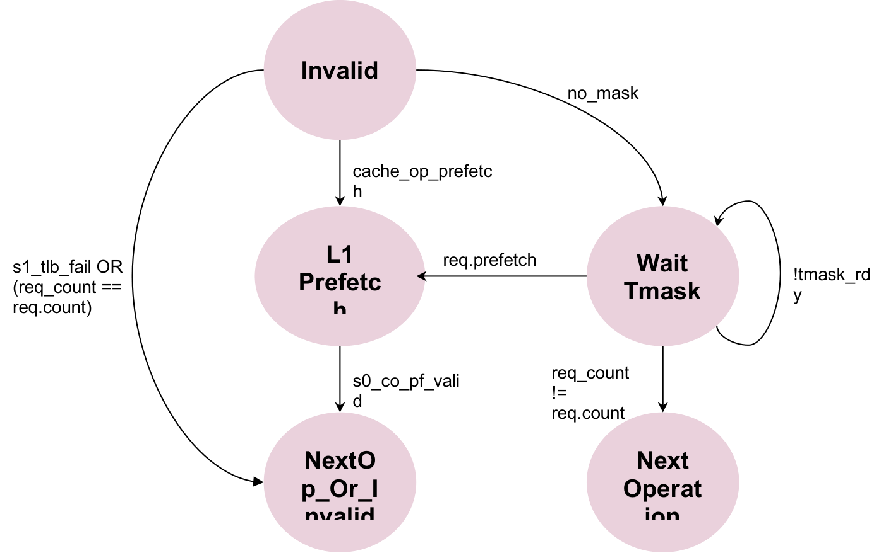


_Figure 21 - CacheOp Prefetch FSM Flow_ 

We can then consider how a main FSM will read the MetaData and go through the TLB and the PMA. We can also split this main FSM into two smaller FSMs for easier interpretation. The first one goes through S0, S1, and S2, all the way to the most complex state mentioned above (the Meta_Resp state, aligned with S2), which will then decide the next action for each of the operations. 


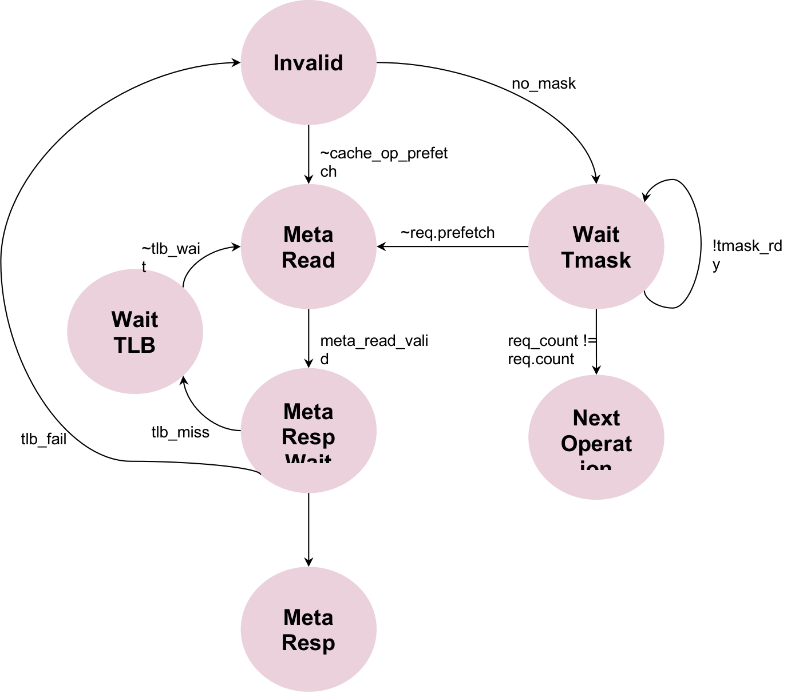


_Figure 22 - CacheOp FSM Initial Steps and TLB/PMA Address Check_ 

From the Meta_Resp state we have: 


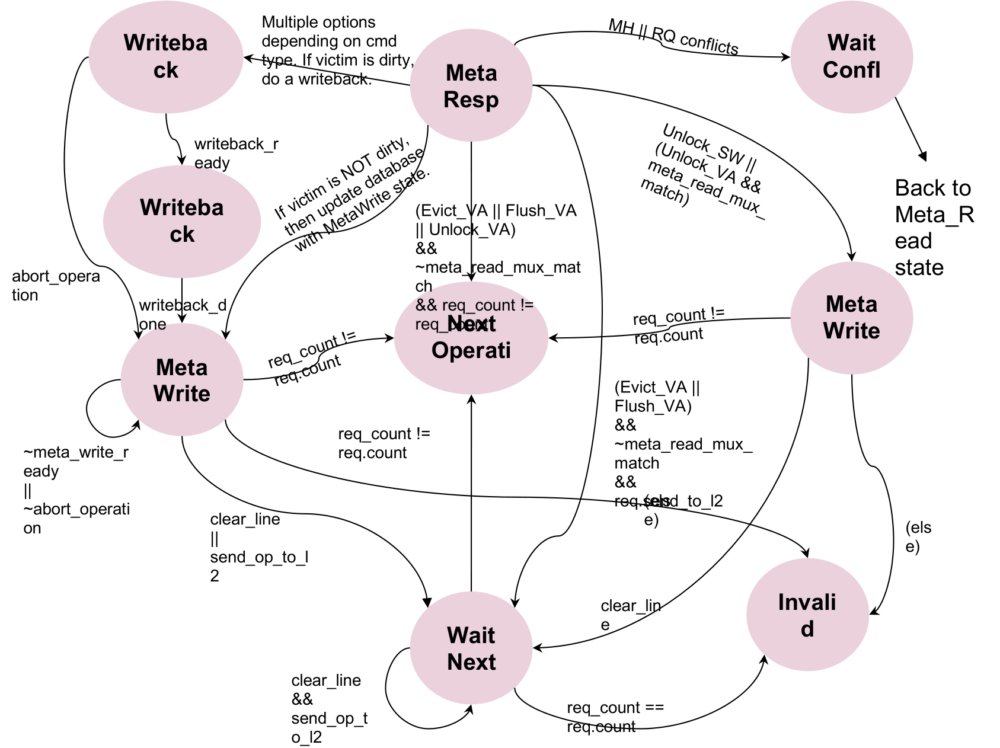


_Figure 23 - CacheOp FSM Part for the States that Update the Cache Metadata and Memory Content_ 

As seen in the three FSMs above, several states (six, more precisely) can go into the Next_Operation state if the request counter is not finished and there are still pending operations. At this point, the system goes back to a decision similar to the initial one performed in the Invalid state between the L1_Prefetch and Meta_Read states. A very small FSM can be drawn just for the Next Operation state, represented below: 


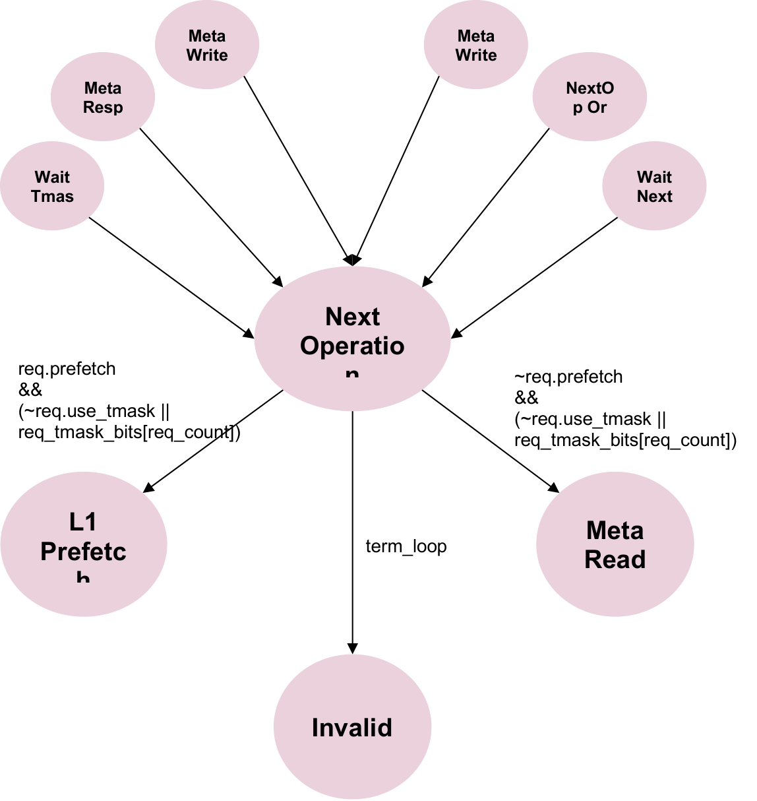


_Figure 24 - CacheOp FSM Flow from/to the Next Operation State_ 

### 3.11 CacheOps L2 FSM 

The set of states is listed in the following table (note that the names will all include the L2_Cache_Op prefix): 

|**State**|**Purpose**|
|---|---|
|Invalid|Idle state|
|Translate|Requests address translation|
|Translate_Wait|Waits for address translation|
|Request|Does an L2 cacheOp|
|Next_Operation|Moves to the next operation of the request|
|Wait_Tmask|Waits for Tensor mask bits to be ready|


_Table 15_ 

The cacheOps L2 FSM is much simpler than the cacheOp FSM. Composed only of the six states described above, its full functionality is shown in the diagram below. Essentially, the system moves straight to the Request state if the request comes from the cacheOp unit. If it’s a regular request coming from the Core, it will then check whether it needs a mask. If a mask is needed, then we move to the Wait_Tmask state until the mask is ready. Once it is ready, and if the first bit is valid, then we move to the Translate state. If the mask is not needed, then we go straight from the Invalid state to the Translate state. 

The FSM only goes away from the Translate state when there is an indication from s1_addr_load, meaning that the address delivered by the FSM to the DCache pipeline has been accepted and it is processed in S1. If there is no fail or wait from the TLB, then we go to the Request state. If there is a tlb_wait, the system temporarily moves to the Translate_Wait state and returns to the Translate state once the tlb_wait is gone; however, if there is a tlb_fail, then the FSM goes straight back to the Invalid state. 

In the Request state, we process the L2 cacheOp requests and send the commands to L2. If we are done with the requests, then we go back to the Invalid state. Otherwise, we keep processing the requests by moving to the Next Operation state. 


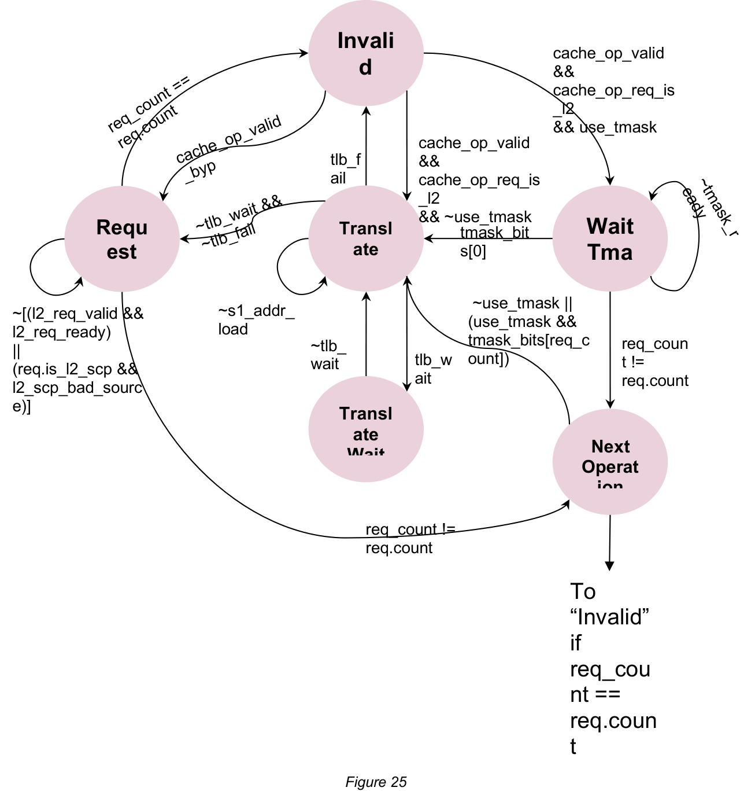


_Figure 25_ 


### 3.12 Debug 

#### 3.12.1 APB Access 

Via the APB bus connected to Minion, some internal memories of the DCache are accessible. In particular, the LRAM and MetaData can be read and written in 64-bit chunks. 

For LRAM, the 9 LSBs of the APB address are used to access the 512 chunks of 64 bits (64 cache lines x 512 bits = 512 chunks x 64 bits). This is valid for reading and writing. 

For the MetaData, each of the 64 entries (one per cache line) is read as a 64-bit chunk. This includes the TAG (33 LSBs) and Line state (2 MSBs) (35 bits in total, zero-extended up to 64). Notice that the read value will not show the actual content of the memory if the valid bit for the entry is set to ‘0’. In that case, the read value will be the TAG, just containing the zero-extended upper bits of the set, and the Line state, just indicating that the line is invalid. 

When writing the MetaData, each 64-bit data chunk will also be assigned to one entry. In this case, the 35 LSBs will be used for the TAG and Line state, and the valid bit will be set to ‘0’ if the written Line state is invalid or to ‘1’ otherwise. 

The access to the LRAM and MetaData takes a variable number of cycles, depending on the activity in the pipeline. 

#### 3.12.2 Internal State 

To debug the DCache components, an M-MODE RO CSR is provided. This register exposes the internal state of different parts of the DCache: 

**CSR:** dcache_debug **Encoding:** CSRR xd, 0xFF0 

● **Bits[26:24]** : Tensor load0 FSM state 

- **Bits[23:21]** : Tensor load1 FSM state 

|**State**|**Encoding**|**Description**|
|---|---|---|
|ML_CTRL_Idle|3'b000|Default Idle state|
|ML_CTRL_Wait_Start|3'b001|Wait for convolutional bits to be ready or for the<br>previous operation to finish|
|ML_CTRL_NoT_Req|3'b010|State for no transformation, plain, writes|
|ML_CTRL_Int_Trans|3'b011|Base state to implement interleaves for<br>MODULE_IDX 0 / Flush state for MODULE_IDX 1|
|ML_CTRL_Int_Req|3'b100|Interleave makes a request to download lines|
|ML_CTRL_Int_Int|3'b101|Interleave makes data interleaving and writes to the<br>SCP|
|ML_CTRL_Tra_Req|3'b110|Transpose makes a request to download lines|
|ML_CTRL_Tra_Tra|3'b111|Transpose makes data transposition and writes to the<br>SCP|


_Table 16_ 

● **Bits[20:17]** : Tensor store/reduce FSM state 

|**State**|**Encoding**|**Description**|
|---|---|---|
|Reduce_Invalid|4'b0000|Unit is idle|
|Reduce_Wait_Tensor|4'b0001|Waits for TensorOp dependencies to be cleared|
|Reduce_New_Req|4'b0010|Decoding a new request|
|Reduce_Send_Ready|4'b0011|Sends a message indicating that the unit is ready to<br>receive data (receiver only)|
|Reduce_Wait_Ready|4'b0100|Waiting for the ready message from the receiver<br>(sender only)|
|Reduce_Send_Data|4'b0101|Sends data to the receiver (sender only)|
|Reduce_Wait_Data|4'b0110|Waits for data from the sender (receiver only)|
|Reduce_Drain|4'b0111|Waits for the instruction to drain|
|Reduce_Store_Data|4'b1000|Sends TensorStore data|


_Table 17_ 

##### ● **Bits[16:13]** :  CacheOps unit FSM state 

|**State**|**Encoding**|**Description**|
|---|---|---|
|Cache_Op_Invalid|4'b0000|Unit is idle|
|Cache_Op_Meta_Read|4'b0001|Reads the tags to check which way the line is (if<br>present) (S0 stage)|
|Cache_Op_Meta_Resp_Wait|4'b0010|Waits for the tag response (S1 stage)|
|Cache_Op_Meta_Resp|4'b0011|Receiving the tag response (S2 stage)|
|Cache_Op_Release|4'b0100|Downgrades the state of the clean data|
|Cache_Op_Writeback_Req|4'b0101|Starts a WB|
|Cache_Op_Writeback_Resp|4'b0110|Waits for the WB response|
|Cache_Op_Meta_Write|4'b0111|Updates the tags|
|Cache_Op_Next_Operation|4'b1000|Moves to the next operation of the request|
|Cache_Op_Wait_Tmask|4'b1001|Waits for the tensor mask to be ready|
|Cache_Op_L1_Prefetch,|4'b1010|Injects a prefetch request into the pipeline|
|Cache_Op_Wait_Co_L2|4'b1011|Waits for the cacheOp requested to cacheOps<br>L2 to be completed|
|Cache_Op_Wait_TLB|4'b1100<br>|Waits for the TLB to be ready<br>_Table 18_|


- **Bits[12:10]** :  CacheOps L2 unit FSM state 

|**State**|**Encoding**|**Description**|
|---|---|---|
|L2_Cache_Op_Invalid|3'b000|Unit is idle|
|L2_Cache_Op_Translate|3'b001|Unit is requesting an address translation|
|L2_Cache_Op_Translate_Wait|3'b010|Unit is waiting for an address translation|
|L2_Cache_Op_Request|3'b011|Performs an L2 cacheOp|
|L2_Cache_Op_Next_Operation|3'b100|Moves to the next operation of the request|
|L2_Cache_Op_Wait_Tmask|3'b101|Waits for the Tensor mask bits to be ready|


_Table 19_ 

- **Bits[9:8]** : Reserved 

- **Bits[7:4]** : Miss Handler 0 FSM state 

- **Bits[3:0]** : Miss Handler 1 FSM state 

|**State**|**Encoding**|**Description**|
|---|---|---|
|MH_Invalid|4'b0000|MH is available|
|MH_Acquire_Wb|4'b0001|MH is available|
|MH_Fill_Req|4'b0010|Sending a request to get a memory line|
|MH_Fill_Resp|4'b0011|Waiting for the fill to finish|
|MH_Meta_Write_Req|4'b0100|Updates the meta state to the Fill state|
|MH_Meta_Hazard|4'b0101|Hazard after the meta write|
|MH_UC_Wait_Idle|4'b0110|Waiting until other UCs are empty before starting a UC<br>load|
|MH_UC_Load_Req|4'b0111|Requesting data to a UC memory region|
|MH_UC_Load_Resp|4'b1000|Waiting for the UC load to finish|
|MH_UC_Store_Wait|4'b1001|Sending a store request to a UC memory region (step<br>1)|
|MH_UC_Store_Req|4'b1010|Sending a store request to a UC memory region (step<br>2)|
|MH_UC_Store_Ack|4'b1011|Waiting for the UC store request to return an ACK|
|MH_Fill_Clean|4'b1100|Cleans the MetaData content if the fill gets an error|


_Table 20_ 

## 4 Glossary 

APB Advanced Peripheral Bus BA Buffer Array CSR Control and Status Register DA Data Array DCache Data Cache FMA Fused Multiply-Add FP Floating Point FSM Finite State Machine GSC Gather/Scatter LRAM  Latch Random Access Memory LSB Least Significant Bit MH Miss Handler MSB Most Significant Bit PA Physical Address PMA Physical Memory Attribute PTW Page Table Walker RF Register File RQ Replay Queue TenB TensorLoad Setup B TFMA TensorFlow Model Analysis TL TensorLoad TLB Translation Lookaside Buffer TS TensorStore UC Uncacheable VA Virtual Address VM Virtual Memory VPU Vector Processing Unit WB Write Back 

## 5 References 

1. <u>Minion Description</u> 

2. <u>Shire Interconnect - ET-Link Specification</u> 

