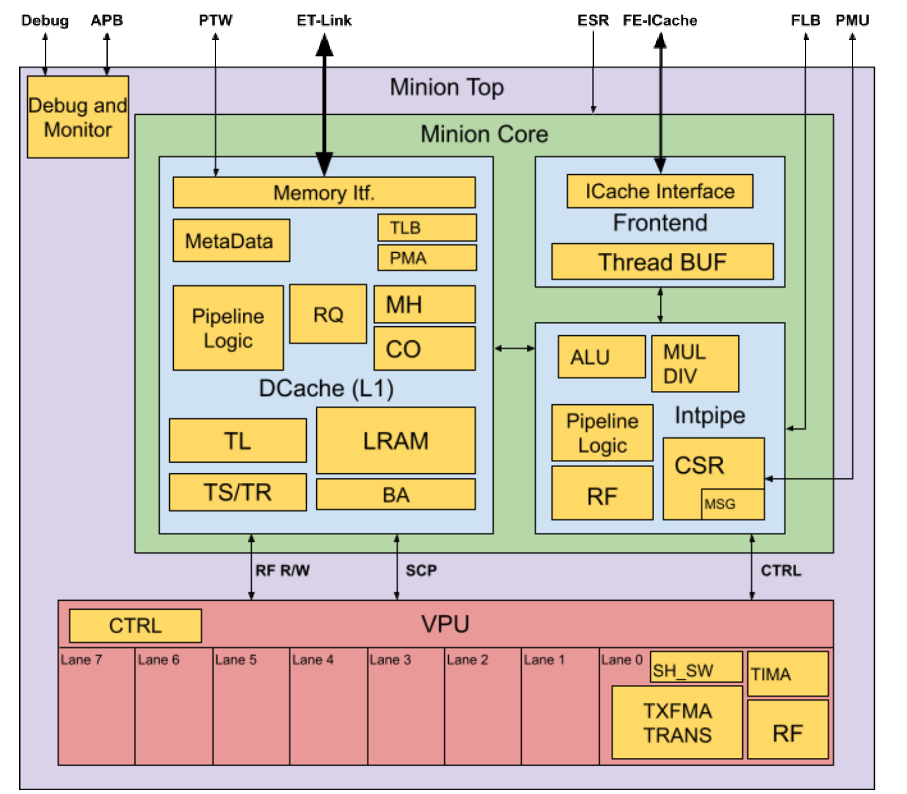

# Minion Description 

<u>Sebastia Tortella Xavier Reves</u> 

# Table of Contents 

|**1 Scope**|4|
|---|---|
|**2 Overview**|5|
|**3 Interfaces**|7|
|**4 Glossary**|11|
|**5 References**|12|

# Revision History 

|**Version**|**Date**|**Author**|**Changes**|
|---|---|---|---|
|v0.1|2021.03.04||Document created|
|v0.1.1|2021.09.02|Jennie Weyant|Format and grammar review|
|v0.1.2|2022.07.11|Jennie Weyant|Updated format and added References/Glossary section|

## 1 Scope 

This document is a brief introduction to the CORE-ET Minion processor. From here the reader can follow the links to the documents that provide details on the different building blocks. 

The contents of this document and the additional linked documents are useful for design or verification engineers who want to understand the architecture and microarchitecture of the Minion processor. 

## 2 Overview 

The Minion core is a dual-threaded, in-order, single-issue, 64-bit RISC-V core extended with a proprietary 8-lane Single-Instruction Multiple-Data (SIMD) extension. Specifically, the Minion core implements the following RISC-V architecture: 

|**Base**|**Version**|**Comments**|
|---|---|---|
|RV64I|2.1||
|**Extension**|**Version**|**Comments**|
|M|2.0||
|F|2.2|Not fully compliant*|
|C|2.0||
|Zicsr|2.0||
|Zifencei|2.0|Trap-and-emulate|
|**Module**|**Version**|**Comments**|
|Machine ISA|1.11|Not fully compliant*|
|Supervisor ISA|1.11|Not fully compliant*|

* See Minion deviations from the RISC-V specification 

Each Minion core has its own 4 KB private Data Cache (DCache), which can also act as a scratchpad, but does not have a private Instruction Cache (ICache). The vector unit supports a custom ET SIMD extension that allows for eight floating point values to be operated on in the same cycle. The vector unit supports transcendental instructions and tensor instructions that accelerate machine learning applications. 

The following figure shows the components of the Minion, divided into two main parts: the Core and the Vector Processing Unit (VPU). Within each of these parts there are additional sub-components that handle specific functions. 

Each Minion includes two main interfaces for exchanging data in and out and loading instructions to execute. The first is based on a proprietary interface named ET-Link (ET-Link <u>Specification) and the second is a simple pipelined interface for reading instructions from the</u> ICache. 

_Figure 1 - Simplified Diagram of the Minion Processor_ 

The Minion core is composed of a Frontend (FE), an Integer Pipeline (Intpipe) and a DCache. The FE unit fetches instructions from an external shared ICache. Instructions are then fed to the Decoder unit (part of the FE) that provides the configuration that the integer and VPU pipelines will use for this instruction. The VPU is composed of eight identical lanes that always operate completely synchronously. Therefore, to the final programmer, the VPU appears as a single entity that performs eight operations per cycle. The data width of the DCache is such that it can feed one Register File (RF) entry of the 8 VPU lanes in a single cycle. 

## 3 Interfaces 

This section includes a table with a list and description of the Minion processor’s interfaces. 

For most of the interfaces, the internal or external Minion block that the interface is ultimately connected to is indicated. For details about the interface operation, please refer to the specific documentation of the internal Minion blocks that can be found in the <u>References</u> section. These are marked with _FE/I_ , _DCache_ , or _VPU_ labels. 

In the table, there are also references to other documents that can be consulted for a more detailed description regarding the interface operation. 

For those signals or interfaces that are not described in the references, a more detailed description may be found after the following table: 

|**Interface**|**Port Name**|**I/O**|**Description(Final block)**|
|---|---|---|---|
|System signals|clock|I|Minion clock|
||reset|I|Global “cold” reset|
||reset_debug|I|Reset for the debug infrastructure|
||reset_non_debug|I|Reset for the non-debug infrastructure|
||shire_id|I|Identifies the Shire where the Minion is located|
||shire_min_id|I|Identifies the Minion within the Shire|
||ioshire|I|Indicates that the Minion is the SP in the IOShire|
|DFT signals|dft__*|I/O|Multiple signals for DFT purposes|
|Power control (not |nsleepin|I|Inputs sleep indication|
|used)|iso_enable|I|Activates isolation cells|
||nsleepout|O|Outputs sleep indication|
|ET-Link request |l2_dcache_evict_req_ready|I|Consult the ET-Link Specification and DCache Description documents|
|channel “evict”|l2_dcache_evict_req_valid|O||
||l2_dcache_evict_req|O||
|ET-Link request|l2_dcache_miss_req_ready|I||
|channel “miss”|l2_dcache_miss_req_valid|O||
||l2_dcache_miss_req|O||
|ET-Link response channel|l2_dcache_resp_ready l2_dcache_resp_valid|O I||
||l2_dcache_resp|I||
|ICache request |icache_req_ready|I|Consult the FE-ICache Interface document|
|channel|icache_req_valid|O||
||icache_req|O||
|ICache response |icache_resp_valid|I|Consult the FE-ICache Interface document|
|channel|icache_resp_miss|I||
||icache_resp|I||
||icache_fill_done|I||
|ICache control|icache_flush_data|O|Indicates for the ICache to flush current content|
|interface|satp_info|O|SATP CSR. VM mode and PPN for S-mode|
||matp_info|O|MATP CSR. VM mode and PPN for M-mode|
||tlb_invalidate|O|Indicates the ICache TLB invalidation|
|PTW request |dc_ptw_req_data|O|Consult the NBH PTW section of the Neighborhood Description document for details|
|channel|dc_ptw_req_valid|O||
||dc_ptw_req_ready|I||
|PTW response |ptw_dc_resp_data|I|Consult the NBH PTW section of the Neighborhood Description document for details|
|channel|ptw_dc_resp_valid|I||
||interrupts|I|Interrupts reaching the Minion (FE/I)|
|FLB request channel|flb_neigh_req_valid||See the Intpipe CSR File section of the FE/Intpipe Description document for details|
||flb_neigh_req_data|||
|FLB|flb_neigh_resp_valid||See the Intpipe CSR File section of the FE/Intpipe|
|response channel|flb_neigh_resp_data||Description document for details|
|Trace encoder |te_thread_sel|I|Selects thread|
|interface|traceEncoder|O|Signals for the UST TraceEncoder|
||te_enable||Enables the generation of signals for the TE|
|APB interface|apb_paddr apb_penable|I I|The APB interface allows for specific registers inside the Minion to be accessed in order to control debug operations and to read specific internal memory resources. See the Minion Debug Hardware section of the Debug High-Level|
||apb_prdata|O|Specification document.|
||apb_pready|O||
||apb_psel|I||
||apb_pslverr|O||
||apb_pwdata|I||
||apb_pwrite|I||
||debug_in|I||
||debug_out|O||
|Interface to UltraSoC |minion_dbg_signals|O|Monitors signals out to debug infrastructure|
|modules|minion_dbg_signals_mux|I|Selects the internal signals to monitor|
||minion_dbg_sig_enable|I|Enables monitoring of internal signals|
|Interface to ESRs|enabled|I|Enables the fetching of instructions to start (FE/I)|
||reset_vector esr_features|I I|Pointer to the boot address to jump to upon reset Connection to Minion feature ESR|
||esr_bypass_dcache|I|Forces DCache bypass|
||esr_shire_coop_mode|I|Enables TensorLoad Cooperative mode|
||esr_minion_mem_override|I|Test signals: block write to DC or VPU memories|
||mprot|I|Memory protection configuration for PMA|
||vmspagesize|I|Specifies the virtual page size|
||chicken_bits|I|Control bits to disable some automatic functions|
|PMU interface|pmu_count_up|O|The PMU in the Neighborhood is accessed via this interface. Check the Neighborhood PMU |
||pmu_read_data|I|documentation for details.|
||pmu_read_sel|O||
||pmu_write_en|O||
||pmu_write_data|O||
||pmu_neigh_event_sel|O||

## 4 Glossary 

APB Advanced Peripheral Bus CSR Control and Status Register DCache Data Cache DFT Design for Testability ESR ET System Register FE Frontend FLB Fast Local Barrier ICache Instruction Cache Intpipe Integer Pipeline ISA Instruction Set Architecture MATP Machine Address Translation and Protection PMU Performance Monitor Unit PTW Page Table Walker RF Register File SATP Supervisor Address Translation and Protection SIMD Single-Instruction Multiple-Data SP Service Processor TE Trace Encoder TLB Translation Lookaside Buffer VPU Vector Processing Unit 

## 5 References 

1. Detailed description of the Frontend, Integer, DCache, and VPU pipeline and architecture can be found in the following documents: 

   - <u>FE/Intpipe Description</u> 

   - <u>Data Cache Description</u> 

   - <u>VPU Specification</u> 

2. <u>ET-Link Specification</u> 

3. <u>FE-ICache Interface</u> 

4. <u>Neighborhood Description</u> 

5. <u>Debug High-Level Specification</u> 

