# Minion Shire DLL Constraints 

<u>Juanjo Galindo Xavier Reves</u> 

# Table Of Contents 

|**1 Introduction**|3|
|---|---|
|**2 Delay Constraints**|5|
|2.1 Seamless Frequency Switch|5|
|2.2 Locking at Low Frequencies|6|
|**3 Probe Point Location**|8|
|**4 DLL Feedback Clocks in Functional Simulation**|10|
|**5 Implementation**|12|
|5.2 Physical View|12|
|5.2.1 Timing Relationships|12|
|5.2.2 Other Neighborhoods|17|
|5.3 Software-Based Delay Adjustment|18|
|5.4 Similar Loop Delay|18|
|5.5 Uncertainty Correction|19|
|**6 Glossary**|22|
|**7 References**|23|

## 1 Introduction 

Minion Shire uses a clock for shire_channel and another for neighborhood, named **shire_clock** and **neigh_clock** respectively. These two clocks are derived from the same parent clock, so they have exactly the same frequency, but in the interface between shire_channel and neighborhood they must be shifted half cycle (180 degrees), i.e. one of them is inverted with respect to the other. 

The context and hardware that generates the two clocks, where the DLL operates, is represented in the following two diagrams. The first one is higher level representation of the Minion Shire clock scheme showing the different clock domains and the logic associated with each one of them. 

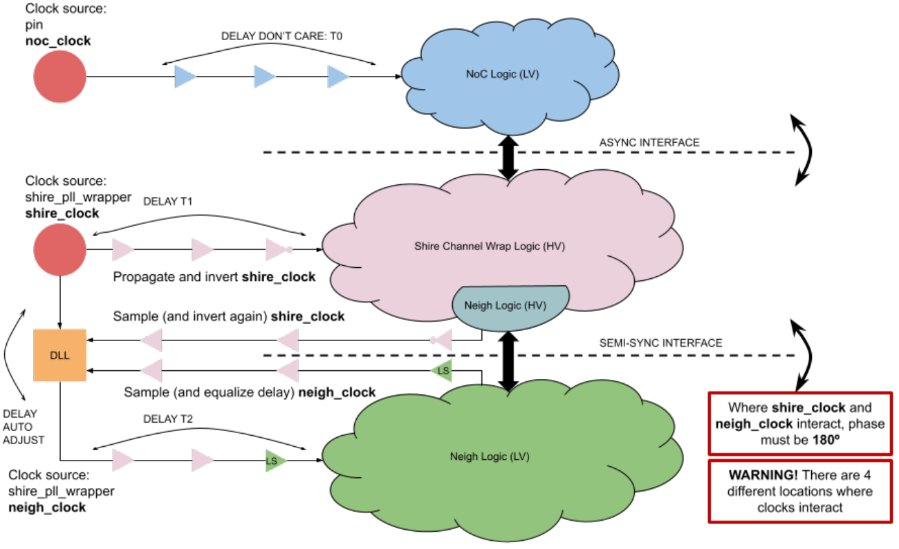

_Figure 1 - Simplified Clock Diagram of Minion Shire_ 

The second figure shows a more detailed diagram of the components inside the Min Shire that drives/generates the clocks. The _PLL Wrapper_ module, inside the _shire channel wrap_ module, can generate the clock from the PLL and includes a DLL to delay the clock for the Neighborhood logic. 

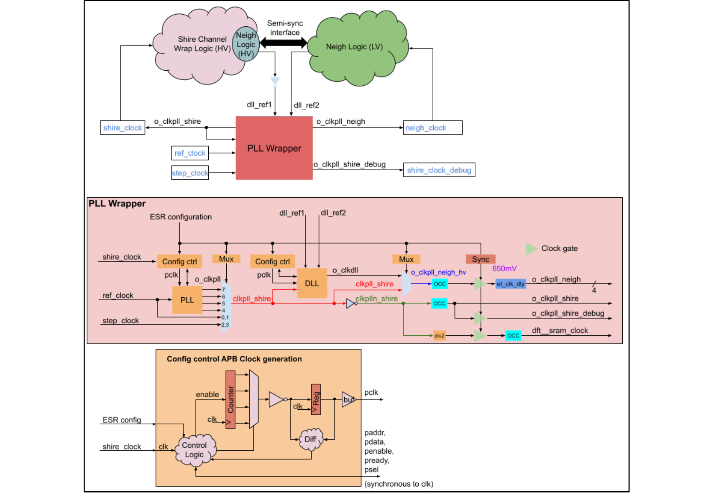

_Figure 2 - Detailed View of Clock Generation for Minion Shire_ 

The function of the DLL is to compensate for the variable delays in the distribution network of shire_clock and neigh_clock. The delay may change depending on voltage, temperature, process, etc. 

##### **Important notes:** 

- It is extremely important that the two feedback paths are “perfectly” equalized and that any physical variation equally impacts both paths, otherwise the delay applied by the DLL will be offset by the difference in these two paths, leading to incorrect timing relationship in the shire_channel to neigh interface. 

- The total loop delay (DLL output to neighborhood probe point back to the feedback input) must be known under all operating conditions to ensure that it is limited to a value for which the DLL has a stable behavior (lock achieved, no divergence, no oscillation). 

## 2 Delay Constraints 

### 2.1 Seamless Frequency Switch 

Given that the DLL can only add delay and that the clock that is delayed is the **neigh_clock** , if we want to switch from one frequency to another keeping the same relative phase between the two clocks, we need to impose some constraints to the operating conditions of the DLL. 

##### **Constraint:** 

The physical implementation must guarantee that the DLL can align at its feedback pins the same edge from the two clocks. This implies that shire_clock always arrives later than neigh_clock (when DLL is at minimum delay) at the probe points in the shire_channel to neigh boundaries. 

The probe points to provide feedback to the DLL will be located as close as possible to the voltage and clock crossing FIFOs (for semi-sync interface). 

##### **<mark>Sample Scenario:</mark>** 

- <mark>DLL can introduce a variable delay</mark> **<mark>Td</mark>** <mark>, from minimum</mark> **<mark>Td_min</mark>** <mark>to maximum</mark> **<mark>Td_max</mark>** <mark>.</mark> 

- <mark>DLL will lock if the error between the two clocks at the feedback pins is less than</mark> **<mark>Te</mark>** <mark>.</mark> 

- Path for shire_clock: pll_output → delay_to_neigh → delay_to_vc_fifo_probe_point_1 → delay_to_feedback_pin_1: total delay is **Ts** 

- Path for neigh_clock: pll_output → dll_delay → delay_to_neigh → 

   - delay_to_vc_fifo_probe_point_2 → delay_to_feedback_pin_2: total delay is **Tn+Td_min** 

- <mark>By design,  delay_to_feedback_pin_1 should be as close as possible to delay_to_feedback_pin_2, so difference between Ts and Tn is in the paths until the probe points.</mark> 

- <mark>Clock period:</mark> **<mark>Tc</mark>** 

- <mark>A simplified representation of scenario follows:</mark> 

##### **<mark>Case 1:</mark>** 

- <mark>Assume</mark> **<mark>Ts > Tn + Td_min</mark>** <mark>.</mark> 

- <mark>What will the DLL do? It will increase delay until</mark> **<mark>Tn + Td_x1 = Ts</mark>** <mark>, where</mark> **<mark>Td_x1</mark>** <mark>is the necessary delay to align both clocks.</mark> 

- <mark>Everything is good as a change in frequency will keep the edges well aligned as represented in the following figure.</mark> 

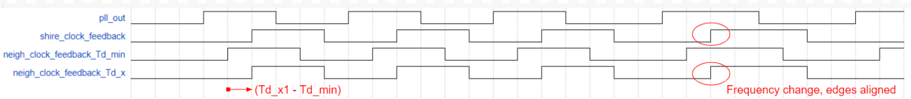

_Figure 3_ 

**<mark>Case 2:</mark>** 

- <mark>Assume</mark> **<mark>Ts < Tn + Td_min</mark>** 

- <mark>What will the DLL do? It will increase delay until</mark> **<mark>Tn + Td_x2 = Ts + Tc</mark>** <mark>, where</mark> **<mark>Td_x2</mark>** <mark>is the necessary delay to align the two clock edges given that clocks are periodic signals.</mark> 

- <mark>DLL can't make</mark> **<mark>Tn + Td_x2 = Ts</mark>** <mark>given that</mark> **<mark>Td_x2</mark>** <mark>can't be less than zero.</mark> 

- <mark>In this case, if there is a frequency change, the edges will not be aligned. Re-locking may be needed and</mark> **<mark>Td_x2</mark>** <mark>will have to increase. This is represented in the next figure:</mark> 

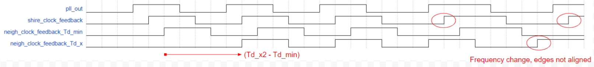

_Figure 4_ 

### 2.2 Locking at Low Frequencies 

<mark>This situation can be analyzed from Case 2 in the previous section. The current DLL spec indicates a minimum delay of 300ps and a maximum delay of 1800ps. This maximum delay limits the minimum frequency at which lock can happen under the situation represented in Case 2.</mark> 

##### **<mark>Case 3:</mark>** 

- <mark>Assuming that the initial clock difference is larger than</mark> **<mark>Te</mark>** <mark>, the lock condition can never happen when</mark> **<mark>Tc</mark>** <mark>is large enough: if</mark> **<mark>(Ts + Tc) - (Tn + Td_max) > Te</mark>** <mark>, DLL can’t lock.</mark> 

- <mark>This situation is represented in the following figure where the vertical arrows represent the clock edges (same edge of the root clock marked in red).</mark> 

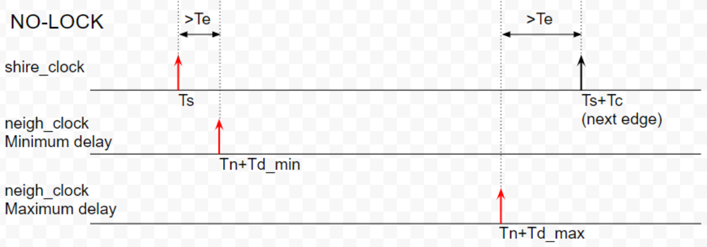

_Figure 5_ 

<mark>Not achieving ‘lock’ at very low frequencies may not be a problem (depending on DLL configuration and behavior) if the resulting edges are sufficiently separated so that the time distance meets the “half period constraint” at highest frequency.</mark> 

<mark>The desired situation would be like the one represented in the following figure. The gray areas represent the variation in delay that each clock may suffer because of PVT. Notice that it is assumed that the feedback path from the probe points to the DLL pins has almost identical delay, with a “known” and “limited” tolerance (this magnitude is to be defined or measured).</mark> 

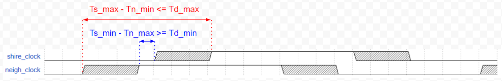

_Figure 6_ 

<mark>In the figure the values for Ts_min/max and Tn_min/max may be different for different corners. Assuming P and T equal for both clocks, which set an “initial” delay offset, the variation in delay would be mainly introduced by different voltage settings.</mark> 

## 3 Probe Point Location 

Current RTL (Neighborhood) has a simple connection to the feedback DLL signals for shire and neigh clocks. This connection happens in the “high voltage” area of the neighborhood as a “placeholder” to allocate the neighborhood pins to provide feedback to the DLL. But from a physical design perspective, this is not the “right” option. 

The probe point for shire_clock must be near one voltage and clock crossing FIFO (VC_FIFO), on the high voltage area, i.e. near a leaf cell (flip-flop). It must be assumed that the clock to all leaf cells is properly balanced, with a limited skew to ensure that timing is met in all VC_FIFOs. 

The probe point for neigh_clock must be also near a VC_FIFO, but on the low-voltage region. 

Figure 7 shows the current “logic” connection (in red with a ‘X’ indicating that the connection should be different in physical) and the connection as it should be in “physical” (in green). 

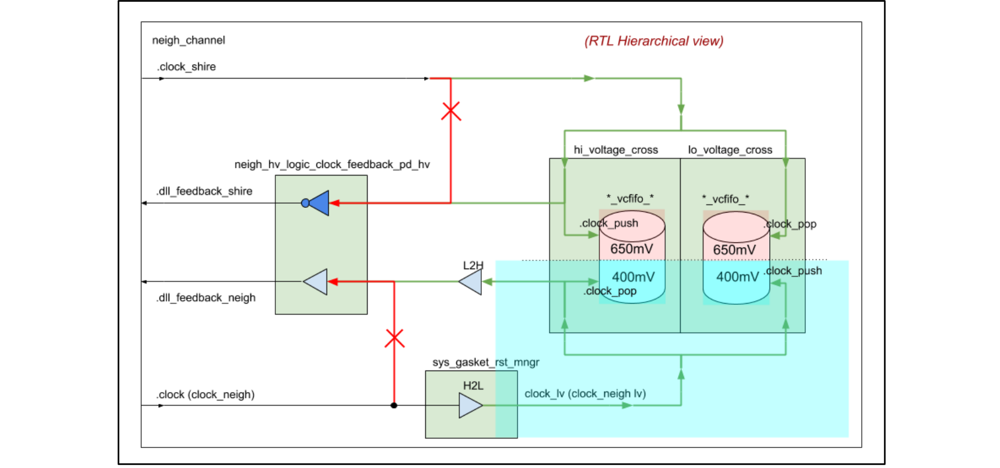

_Figure 7 - Logical and Physical Connection of DLL Feedback_ 

A more detailed approach to the real circuit could be as represented in Figure 8, comparing the RTL view and the assumed equivalent physical implementation. 

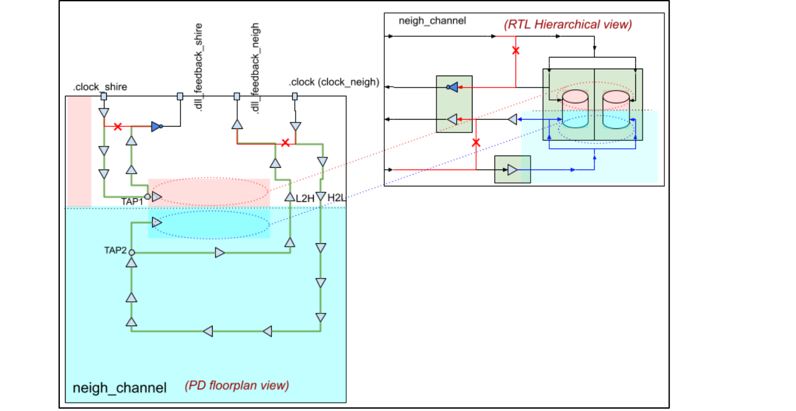

_Figure 8 - Physical “View” of the Connections to DLL Feedback Paths_ 

These diagrams are based on assumptions that may not match the strategy that PD is going to use. They are used to illustrate the need to precisely identify the probe point. 

The diagrams also omit any reference to cells that could be used to equalize the feedback paths, mainly under voltage variations of the shire_channel and neighborhood domains. 

So, in any case, we need feedback from PD to modify the RTL, if necessary, in the way that better fits the PD flow. 

## 4 DLL Feedback Clocks in Functional Simulation 

In functional simulations, with zero delay, if the feedback clock doesn’t have any real delay the DLL could not achieve the lock condition depending on the clock frequency. 

As stated in previous point 2.1: 

“This implies that shire_clock always arrives later than neigh_clock (when DLL is at minimum delay) at the probe points in the shire_channel to neigh boundaries.” 

Previous constraints must be respected to assure that the DLL is able to achieve the lock. 

Current functional simulations use a DLL model that introduces a certain delay to the output clock at port “o_clock” taking as a reference the input clock at port “i_clk”. Let’s call it “DelayA”. 

Figure 9 below shows the feedback paths. 

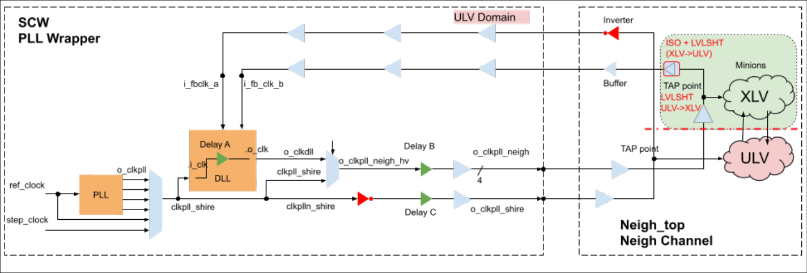

_Figure 9 - Representation of feedback paths_ 

The following feedback clock paths have different delays in silicon (let’s call them _DelayB_ and _DelayC_ ): 

- Clkpll_shire to i_fbclk_a (shire_clock) 

- Clkpll_shire to i_fbclk_b (neigh_clock) 

In functional simulation with zero delay, if DelayB=0 and DelayC=0, and considering that the DLL is actually introducing a certain delay (minimum ~50ps in the DLL model, that makes DelayA=~50ps),  the constraint is not accomplished because the shire_clock feedback arrives (~50 ps) before the neigh_clock feedback. 

For instance with Fout=500MHz (T=2ns), the DLL should introduce a delay DelayA=1950ps to adjust the phases of the feedback clocks. The specification for the DLL set a maximum delay of 1800 ps, so under these conditions the lock is never going to be achieved. 

So, to accomplish the requirements DelayB and DelayC must be added to the simulations. At least DelayC>50ps and DelayB=0ps to accomplish the requirements. 

The mechanism to introduce the delays has been made into file **$REPOROOT/rtl/shire/shire_channel/shire_pll_wrapper.v** as non-synthesizable code. 

By default, the applied delays are: DelayC=300ps, DelayB=0. DelayC depends on the model. 

These are the new arguments that allow to change the delay in functional simulation: 

- --uarg ENABLE_DLL_FEEDBACK_TRANSPORT_DELAY 

   - Enables the simulation with transport delays in the feedback clocks. It makes a define of DLL_FEEDBACK_TRANSPORT_DELAY=1. If used it could slow down a bit the simulation. 

- --uarg +shire_dllfeedback_delay=1.4 

   - Specifies a delay in ns to the shire_clock feedback (DelayC). Requires first argument. 

- --uarg +neigh_dllfeedback_delay=0.1 

   - Specifies a delay in ns to the shire_clock feedback (DelayB) . Requires first argument. 

Example: 

et-dvrun --config dv/tests/minion_core/regress_lists/minion.etdv.py --test_name_enable uart$ -- build_name_enable fc_ioshire$ --uarg trace --uarg vv --make --tags b4c_fcio_smoke --uarg +LVDPLL_MODE=16 --uarg +UVM_TIMEOUT=200000 **--uarg** 

**ENABLE_DLL_FEEDBACK_TRANSPORT_DELAY --uarg +shire_dllfeedback_delay=1.4 -- uarg +neigh_dllfeedback_delay=0.1** 

In case of running gate netlist simulations with annotated delays it would be required to explicitly assign **--uarg +shire_dllfeedback_delay=0 --uarg +neigh_dllfeedback_delay=0** 

## 5 Implementation 

This section will contain details about the implementation from a physical perspective that needs to be ensured to guarantee the correct clock alignment between shire_clock and neigh_clock in the boundaries of the clock domains. 

### 5.1 Physical View 

#### 5.1.1 Timing Relationships 

The representation in Figure 10 attach temporal labels to the different nets that propagate from/to the DLL that need to be taken into account. 

The buffers (or inverters used as buffers) in the wires are implicit. Only two inverters are explicit to highlight the need to have such inversion as written in the RTL. 

##### **Definitions** 

- shire_clock delay to TAP1: Ts_a = Ts0 + Ts1 

- neigh_clock delay to TAP2: Tn_a = T0 + Td + Tn0 + Tn1 + Tn2 

- shire_clock delay from TAP1 to DLL feedback pin: Ts_b = Ts2 + Tinv + Tfs 

   - Ts2 = Ts2a + Ts2b 

- neigh_clock delay from TAP2 to DLL feedback pin: Tn_b = Tl + Tn3 + Tfn 

   - Tn3 = Tn3a + Tn3b 

- shire_clock loop delay: Ts = Ts_a + Ts_b 

- neigh_clock loop delay: Tn = Tn_a + Tn_b 

- Minimum and Maximum DLL delay: Td_min, Td_max 

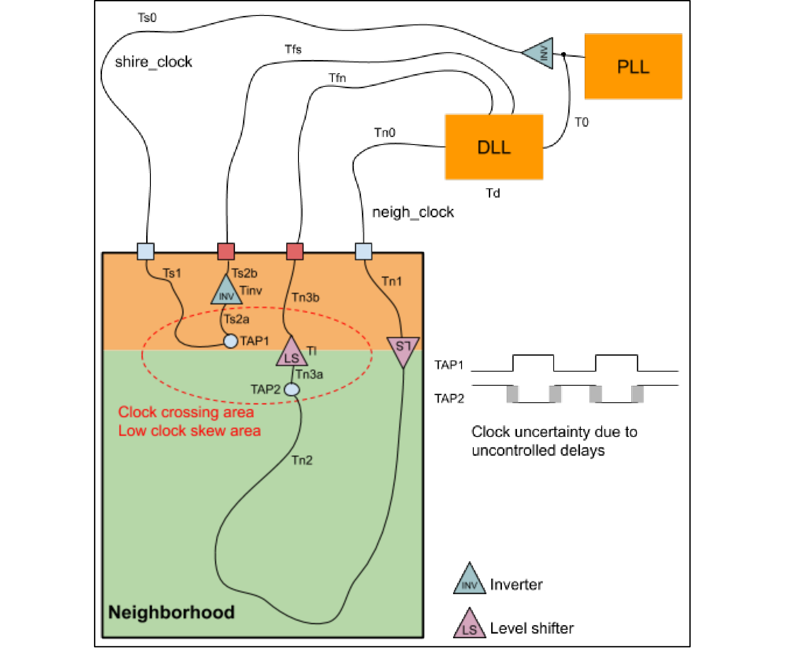

_Figure 10 - Time Labels to Clock Paths_ 

##### **Conditions to meet** 

- Tfs ~= Tfn, error/difference between paths: Tfe = Tfs - Tfn 

- Ts2 + Tinv ~= Tl + Tn3, error/difference between paths: Tte = (Ts2 + Tinv) - (Tl + Tn3) 

- Ts > Tn, in all corner/voltage cases for Td = Td_min 

   - Assuming the feedback paths from the TAP points are almost identical, this condition is equivalent to Ts_a > Tn_a 

- Ts - Tn < (Td_max - Td_min), in all corner cases (Tn computed for Td = Td_min) 

##### **Uncertainty sources** 

The correct equalization of the feedback paths is necessary to minimize the clock uncertainty in the clock crossing area. When the voltage in the neighborhood and in the shire_channel change, the main source of uncertainty is the level shifter (assuming there are no other LV buffers between TAP2 and LS). 

The variable errors in the feedback paths are represented with the magnitudes Tfe and Tte, combined as Te = max|Tfe + Tte|, which have to be quantified under every possible operating condition. 

The DLL has an adjustment error of 50ps. This value has to be added to the uncertainty, defined as Tu. 

##### **Clock skew** 

Assuming that during the process of closing timing in the Neighborhood, the tools will adjust the clock tree and logic to meet timing **under the constraints that align the clocks in the TAP points** , the existing clock skew in the set of registers that are interfacing with the other side of the clock/voltage crossing boundary is part of the timing analysis and should not be considered an additional source of uncertainty. 

However, the clock skew will change when the voltage changes, as the delay to the different FFs on the side that changes voltage is going to change differently. As the timing is closed at the highest frequency, if voltage is reduced, the frequency will have to reduce too. The DLL will keep a half cycle distance between the FFs on either side, which will increase as frequency reduces. 

<mark>A design check has to be added to ensure that “FROM launching flops TO capture flops” there is never more than a half cycle, with additional margin taking into account the clock skew in every FF collection and other possible variations.</mark> 

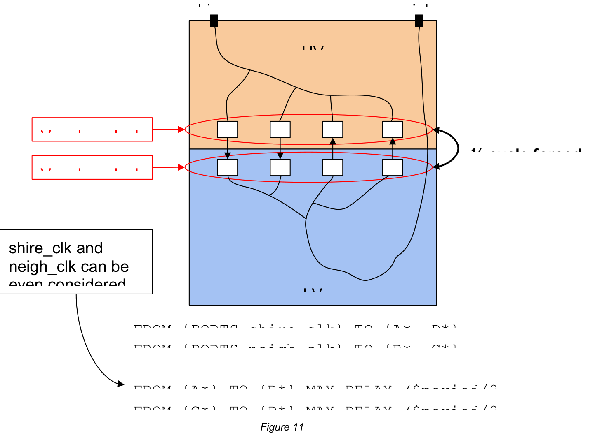

_Figure 11_ 

##### **Corner cases to consider** 

The following set of values has to be filled from real data (taking into account the Neighborhood that is used to provide feedback to the DLL). The data will be used to check all corner cases or conditions under which we want to ensure that the design works. Delays are represented in ns and voltages in V. 

|**Parameter**|**Description**|
|---|---|
|Corner|Name/description of the corner case|
|SC V|Shire Channel Voltage|
|NB V|Neighborhood voltage|
|Td_min|Minimum delay of the DLL|
|Ts_a min/max|Minimum and Maximum value for this delay|
|Tn_a min/max|Minimum and Maximum value for this delay (for Td = Td_min)|
|Ts_b min/max|Minimum and Maximum value for this delay|
|Tn_b min/max|Minimum and Maximum value for this delay|
|Ts min/max|Minimum and Maximum value for this delay (obtained from Ts_a + Ts_b)|
|Tn min/max|Minimum and Maximum value for this delay (obtained from Tn_a + Tn_b)|
|Tfe min/max|Minimum and Maximum error in the feedback path (shire channel part)|
|Tte min/max|Minimum and Maximum error in the feedback path (neighborhood part)|
|Te max|Maximum feedback path error combining the min/max values of Tfe and Tte|
|DLL min extra delay|Minimum additional delay that the DLL will have to apply, obtained from Ts|min - Tn|max. It must always be a positive magnitude.|
|DLL max total delay|Maximum total delay that the DLL will have to apply, obtained from Ts|max - (Tn|min - Td_min). It must always be lower than Td_max.|
|Uncertainty|Maximum clock alignment error, obtained from Te + DLL step|

_Table 2_ 

For example, let’s consider the following defined, measured, or computed values: 

|**Parameter**|**Value for reference neighborhood**|**Source**|
|---|---|---|
|Corner|tt_nv_85c|Defined|
|SC V|0.650 V|Defined|
|NB V|0.400 V|Defined|
|Td_min|500 ps|Defined|
|Ts_a min/max|2.20 / 2.32 ns|Measured|
|Tn_a min/max|1.75 / 1.82 ns|Measured|
|Ts_b min/max|0.95 / 1.00 ns|Measured|
|Tn_b min/max|0.96 / 1.01 ns|Measured|
|Ts min/max|3.15 / 3.32 ns|Computed|
|Tn min/max|2.71 / 2.83 ns|Computed|
|Tfe min/max|-20 / 50 ps|Measured|
|Tte min/max|-10 / 30 ps|Measured|
|Te max|max|Tfe + Tte| = 80 ps|Computed|

|DLL min extra delay|Ts|min - Tn|max = 3.15 - 2.83 = 320 ps|Computed|
|---|---|---|
|DLL max total delay|Ts|max - (Tn|min - Td_min) = 3.32 - (2.71 - 0.5) = 1.11 ns|Computed|
|Uncertainty (Tu)|Te max + DLL step = 130 ps|Computed|

_Table 3_ 

#### 5.2.2 Other Neighborhoods 

Given that there is a single DLL and four Neighborhoods, one of the following two nominal conditions have to be met: 

1. Identical/balanced delay of clock networks to the four Neighborhoods 

   - a. Ts0 must be identical for the four Neighborhoods 

   - b. Tn0 must be identical for the four Neighborhoods 

2. Identical differential delay of clock networks to the four Neighborhoods 

   - a. Ts0 - Tn0 must be identical for the four Neighborhoods 

The differences, due to routing or manufacturing, between the different Neighborhoods have to be added to the uncertainty. 

A conservative (pessimistic) approach can be taken, adding to the uncertainty the delay variations that can be expected in shire_channel and also in the different instances of the Neighborhoods. 

Filling the table for the four Neighborhoods, which may produce different values for Ts_a and Tn_a, will result in different “required” DLL delays, which won’t be applied as there is no feedback from these Neighborhoods. The difference between the applied delay and the “required” delay will be added to the uncertainty. Notice that the values for Ts_b and Tn_b for the Neighborhoods not connected to the DLL are not relevant. 

As the _DLL extra delay_ is computed from Ts|min - Tn|max, the additional uncertainty can be obtained from the variation in these magnitudes, i.e. ΔTs|min - ΔTn|max, in absolute value. 

For example, let’s consider the previous example for another Neighborhood where the delays for Ts_a and Tn_a are somewhat different: 

|**Parameter**|**Value for Reference Neighborhood**|**Source**|
|---|---|---|
|Ts_a min/max|2.20 / 2.32 ns (Ts_a|ref)|Measured|
|Tn_a min/max|1.75 / 1.82 ns (Tn_a|ref)|Measured|
|**Parameter**|**Value for “Another” Neighborhood**|**Source**|
|Ts_a min/max|2.25 / 2.35 ns|Measured|
|Tn_a min/max|1.80 / 1.85 ns|Measured|
|ΔTs_a min/max|Ts_a|ref - Ts_a = -50 / -30 ps|Computed|
|ΔTn_a min/max|Tn_a|ref - Tn_a = -50 / -30 ps|Computed|
|Additional uncertainty||ΔTs_a|min - ΔTn_a|max| = 20 ps|Computed|
|Total uncertainty (Tu)|180 ps + 20 ps|Computed|

_<u>Table 4</u>_ 

### 5.3 Software-Based Delay Adjustment 

What if the measurements and/or applied constraints do not lead us to a fully functional device? Can we “manually” tune the DLL for every shire given some relatively static (slow speed variation) voltage/temp conditions? Can we implement a software-based delay adjustment? 

### 5.4 Similar Loop Delay 

If the physical implementation is not easily setting that Ts_a > Tn_a, i.e. without any ad-hoc delay both branches are very similar, as voltage for neighborhood is reduced it may happen that Ts_a < Tn_a, which leads to an undesired situation as the DLL may lock to “next edge” or not even lock at low frequencies. Notice that Tn_a includes the minimum delay for the DLL, which is as high as 500ps for the nominal voltage values. 

A potential solution for this would be adding a “delay line” to the shire_clock root source, just after the connection to the neighborhood DLL (Figure 12). This delay line would be programmed in open-loop mode and by default it would be programmed with the minimum delay value. If, for any reason, the delay Tn_a increases beyond the point in which we can guarantee that Ts_a > Tn_a, then we can reprogram the delay line to increase Ts_a. 

The configuration of the delay line would be “static” and depending on static settings like voltage or specific chip process. The specific delay added by this HW component would be used to ensure that other “dynamic” variations are always within the safe operating margins of the DLL. Given the static operation, which does not require that settings are modified while the system is working, there is no need to have excessive protection to the multiplexing of the selected clock. A possible implementation of this “safeguard” delay line would be represented in a simplified manner as follows. 

The ESR registers could be used to modify the delay. As the ESRs are clocked by the clock to be delayed, glitch-free clock muxes have to be used or just make the design so that after an update to the ESR registers there is some safeguard time before and after modifying the clock to avoid any side-effect of any glitch. 

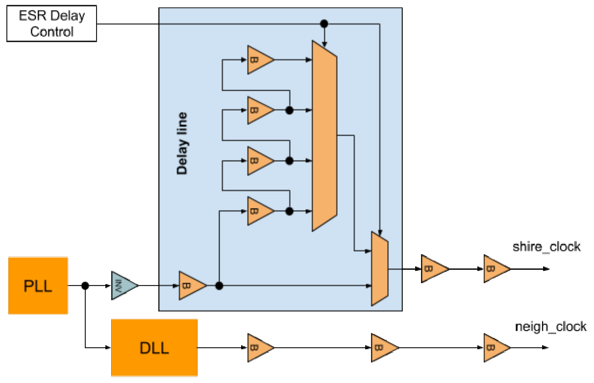

_Figure 12 - “Manual” Delay Line in shire_clock Path_ 

### 5.5 Uncertainty Correction 

If the feedback paths, for any operating/process conditions, get unbalanced beyond the estimated uncertainty, the DLL will lock to a delay that may compromise the shire_channelneigh semi-sync interface. What can we do in that case? 

Tuning the feedback paths requires some knowledge of the impairment, or some sort of feedback that allows the software to adjust the delay. This is precisely what the DLL is doing, but it is clear that SW can’t measure clock differences with such precision. 

But it can evaluate if in a semi-sync interface there are errors in the bits transferred from side A to side B and vice-versa. Of course, if the transferred bits get errors during the normal operation we have a problem, but if we implement a specific semi-sync interface (and some mechanisms) to measure how well aligned are the clocks so that software can adjust the delay to a sweet point until there are no errors in that interface, then we can be sure that the functional interfaces will correctly operate. 

The procedure would be as follows: 

- Add one controllable delay line to each feedback path just before the DLL. By default set delay to the minimum value. 

- Reset HW to measure bit errors in the semi-sync interface. 

- Release reset and let the HW measure the errors in both directions 

- Stop measurement and read counters 

- Update the delay to the next value in one of the branches and re-start the measurement. ● Once the delays in one branch have all been measured, repeat the process resetting the delay to minimum value and increasing the delay in the other branch. 

The result should provide a representation of the delays that produce errors and, then, the optimum delay to “perfectly” balance the semi-sync interface. 

The full process to measure errors in the interfaces may take some time, especially if very low Bit Error Rates (BER) have to be measured. However, the exact BER is not necessary and by pushing the delays to situations in which the errors appear easily it is quite straightforward to determine the “sweet point”, or the intermediate point between to delay configurations that produce a similar BER (see Figure 13) 

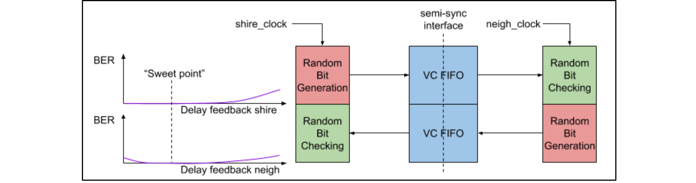

_Figure 13 - Simplified Representation of the Error Measurement Procedure_ 

The “Random Bit Generation” and “Random Bit Checking” blocks are relatively simple modules. The first starts pushing random patterns to the VC FIFO once the reset is released. The second reads data from the VC FIFO and compares the read value against an identical random reference. If any bit is erroneous, an error is counted (can count just once per erroneous random block or once per erroneous bit in a block). 

The interface should be tested at maximum speed. Some very basic controls that are properly synchronized to the corresponding clock domain are needed, as represented in Figure 14. 

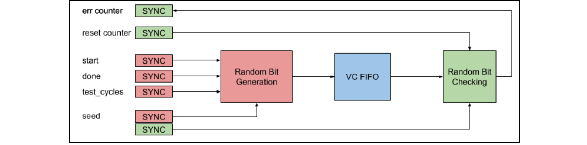

_Figure 14 - Interfaces for the Error Detection Mechanism_ 

## 6 Glossary 

DLL Delay-Locked Loop FIFO First-In First-Out PLL Phase-Locked Loop PVT Power, Voltage, and Temperature VCFIFO Voltage-Crossing FIFO 

## 7 References 

1. <u>Minion Shire DLL Timing</u> 

