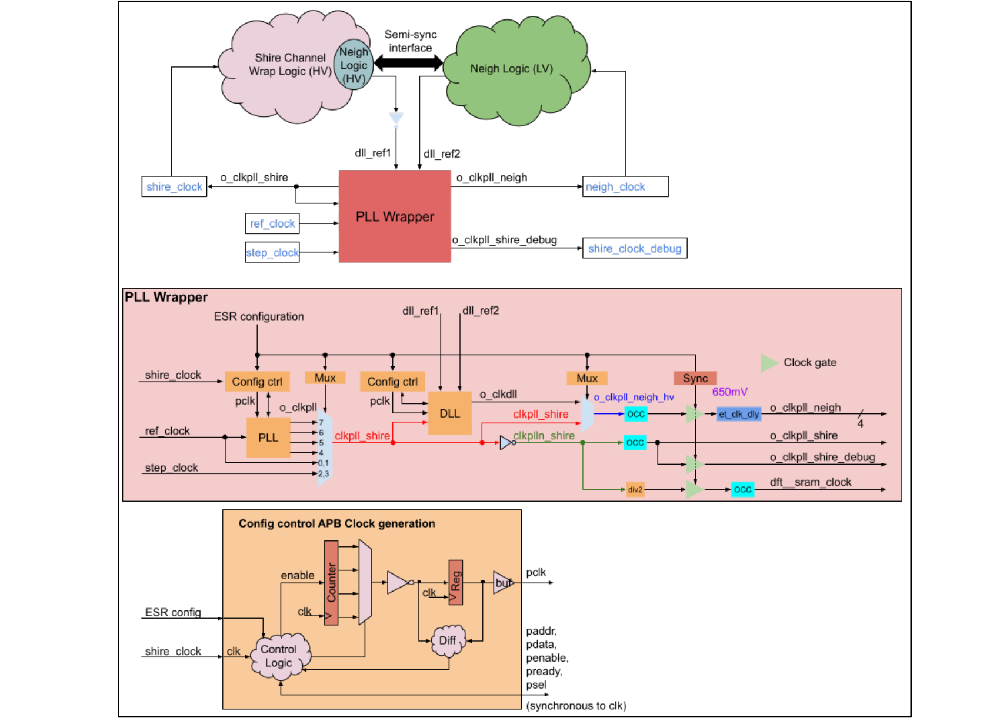
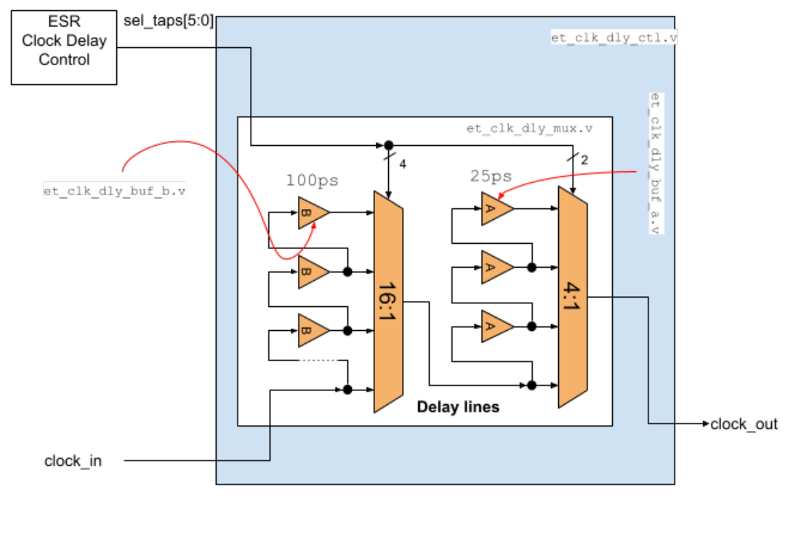
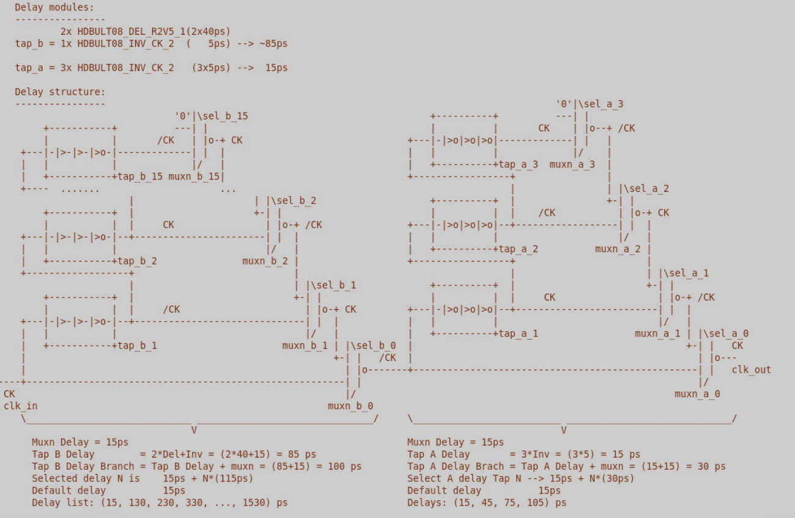
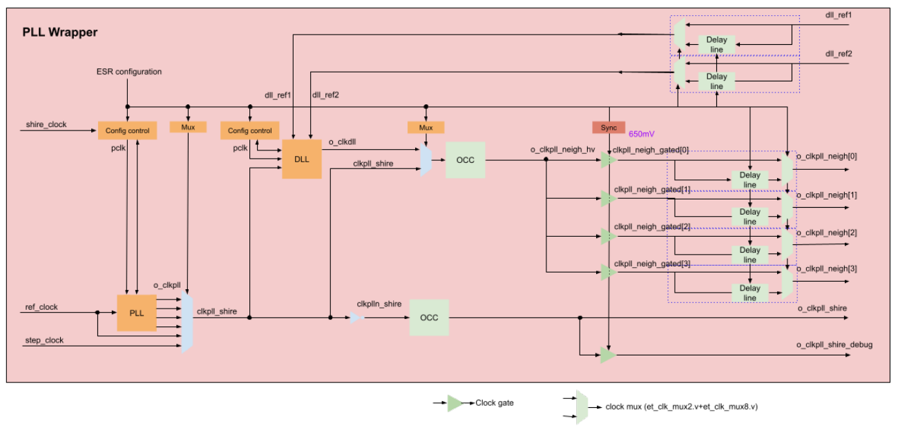
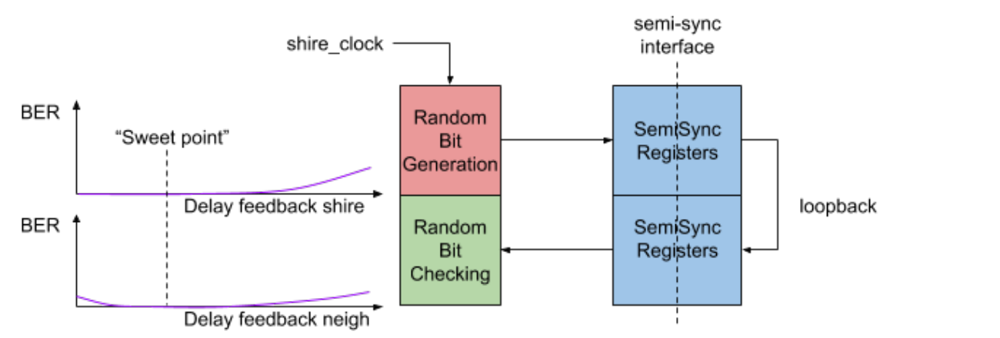
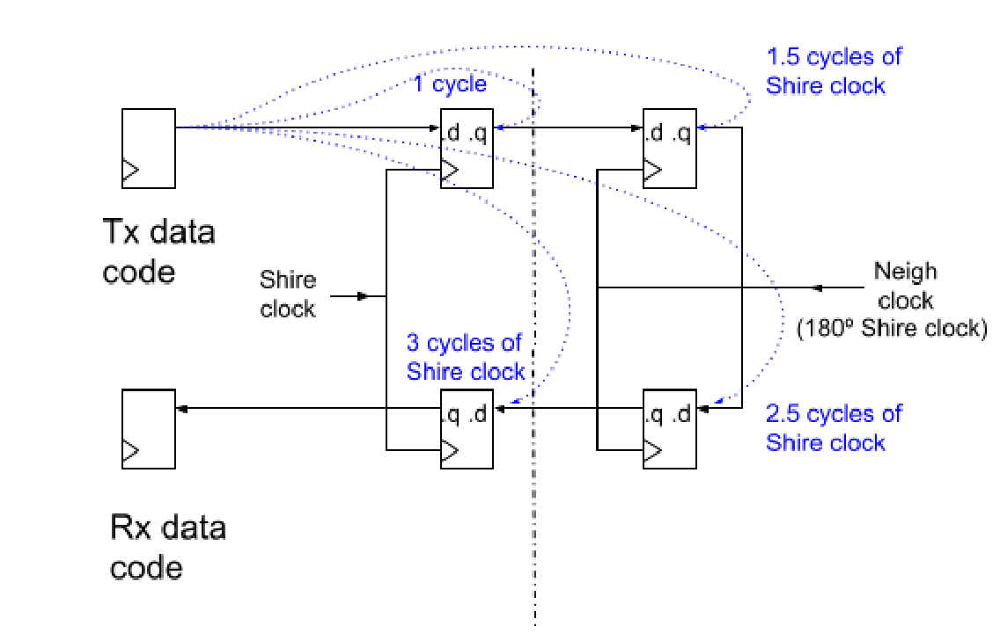
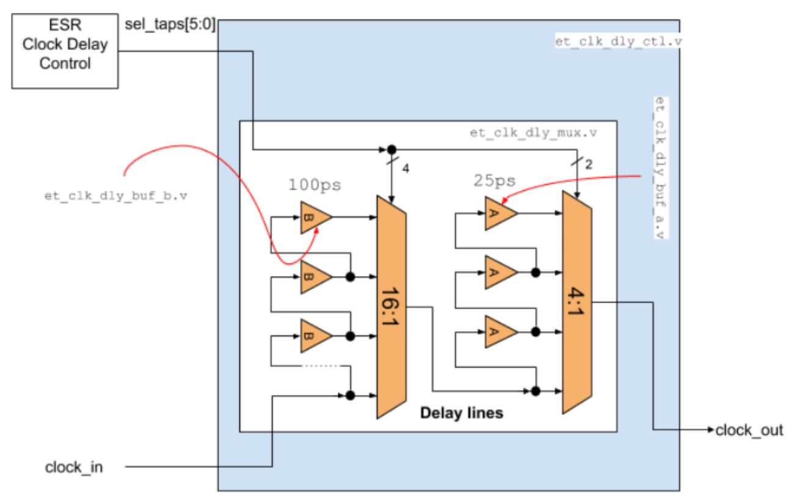
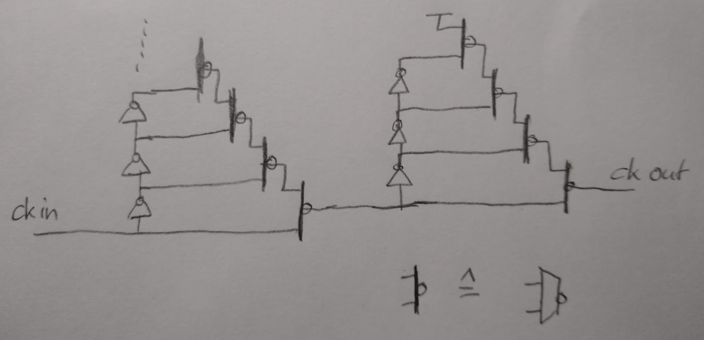

Minion Shire DLL Delay Control 

# Table Of Contents 

|**1 Introduction**|3|
|---|---|
|**2 Programmable delay specification**|4|
|**3 Programmable delay implementation**|6|
|3.1 Programmable delay cells|6|
|3.2 ESR|8|
|3.2.1 DLL delay control registers|8|
|Register: clk_dly_ctl|8|
|**4 DLL delay estimation module**|10|
|4.1 ESR|11|
|4.1.1 DLL delay estimation registers|11|
|Register: dll_dly_est_ctl|11|
|Register: dll_dly_est_sts|12|
|**5 DLL delay estimation procedure**|13|
|**6 Reviewing Physical implementation of delay taps**|14|


# 1 Introduction 

Here is the structure of the Minion Shire clocks 





_Figure 1 - Detailed view of clock generation for Minion Shire_ 

The function of the DLL is to compensate for the variable delays in the distribution network of shire_clock and neigh_clock. The delay may change depending on voltage, temperature, process, etc. 

For simulation purposes, as described in document <u>Minion Shire DLL Constraints</u> (“4 DLL feedback clocks in functional simulation”) there are a few delays that can be controlled in simulation by means of plusargs values.  By default, the shire clock is delayed by 300 ps at the output of the PLL. It allows us to test the behavior of the DLL in particular timing scenarios. 

#### **Important notes:** 

- It is extremely important that the two feedback paths are “perfectly” equalized and that any physical variation equally impacts both paths, otherwise the delay applied by the DLL will be offset by the difference in these two paths, leading to incorrect timing relationship in the shire_channel to neigh interface. 

- The total loop delay (DLL output to neighborhood probe point back to the feedback input) must be known under all operating conditions to ensure that it is limited to a value for which the DLL has a stable behavior (lock achieved, no divergence, no oscillation). 

Given the potential problems that may arise in real silicon with the clocking scheme in the neighborhood based on dynamic delay adjustment with DLL, a set of programmable delay lines have been requested to have control on the delays of clocks involved in the Neighborhood. 

# 2 Programmable delay specification 

Initial specification: 

- A bypass to the DLL has to exist, i.e. a mux must exist to feed the Neigh clock branch directly from the DLL input instead of the DLL output. 

- Location of the programmable delays: 

   - shire_channel_wrap/shire_pll_wrapper: one for each neigh_clock 

   - shire_channel_wrap/shire_pll_wrapper: one for each dll_feedback path 

- Programmable delay spec: 

   - Delay step: 100ps 

   - Maximum delay: 1ns 

   - Delay after reset: 0ps (minimum delay) 

   - Glitch-free switching required with no cycle-to-cycle period shrinking 

      - Required for shire_clock to keep shire operative while changing clock delay 

      - For neigh and dll_feedback not required 

- Configuration ESRs to control each delay line. 

After some discussion in JIRA, the previous specification has been modified. 

- The delay granularity has been increased to 25ps 

- The delayed clocks are connected to the “pll_debug” module that allows monitoring the clocks. 

- The glitch-free clock mux is not required. After setting the delay line configuration the Neigh has to be put under reset. 

- An additional block is integrated into each Neigh to allow software to get feedback about whether the clocks are correctly aligned or not. The description of this implementation will be updated in the “Minion Shire DLL Constraints” document. 

# 3 Programmable delay implementation 

## 3.1 Programmable delay cells 

Summary: 

- The controllable delay is applied to the 4 neigh clocks and the 2 feedback clocks. 

- The shire clock cannot be delayed. 

- In the initial design the muxes 16:1 & 4:1 were implemented using“et_clk_mux2.v” and “et_clk_mux8.v” modules but it was changed to a structure using 2-1 multiplexer with inverted output that has a better duty cycle response. 

- In the initial design there were 2 different tap delay cells corresponding to 25ps and 100 ps: “et_clk_dly_buf_a.v” “et_clk_dly_buf_b.v”, but these cells were updated ending up with tap delay cells corresponding to 30ps and 115ps 

- The delay is selected by means of shire other ESR. 

- The selection associated with zero delay actually corresponds to a minimum delay associated with the muxes. 

- The delay applied to the clock is: 

Delay = Constant_delay(2:1 muxes)  + Tap_B_delay + Tap_A_delay Tap_B_delay = sel_taps[5:2]*115ps 

Tap_A_delay = sel_taps[1:0]*30ps 





_Figure 2 - Initial design of the programmable delay module_ 





_Figure 3 - Final view of the programmable delay module_ 





_Figure 4 - Detailed view of the programmable delay module integration_ 

<mark>1. The delays in the neigh_clock and dll_feedback nets do not need any glitch free clock mux because the neighborhood can be in reset mode while the delays are changed (similar situation as when the DLL is not “locked”).</mark> 

<mark>2. When the DLL works, with the existing delays we can “advance” or “delay” the shire_clock (neigh_clock) with respect to neigh_clock (shire_clock) in every neighborhood.</mark> 

   - a. Notice that modifying the feedback to the DLL we can advance neigh_clock with respect to shire_clock 

   - b. Then we can delay neigh_clock as necessary for every neighborhood 

## 3.2 ESR 

### 3.2.1 DLL delay control registers 

DLL delay control configuration registers 

|Mod|PP<br>Address|Name|Acc<br>ess|<br>Description|Type|
|---|---|---|---|---|---|
|||||Clock Delay Control in||
|shire_other|3<br>0x069|clk_dly_ctl|RW|neigh shire interface|esr_clk_dly_ctl_t|


Register: clk_dly_ctl 

|fields|sel_taps_feedback_shire|sel_taps_feedback_neigh|sel_taps_neigh3|sel_taps_neigh2|sel_taps_neigh1|sel_taps_neigh0|
|---|---|---|---|---|---|---|
|width|<br>6|6|6|6|6|6|
|bits|35:30|29:24|23:17|16:12|11:6|5:0|


<mark>Fields</mark> 

- <mark>clk_dly_ctl [5:0]:= sel_taps_neigh0[5:0]</mark> Description: Selects tap in the “delay mux” for Neigh0 clock. There are 6 bits to select the tap configuration that is going to determine the applied delay to the clock line. These 6 bits are divided in 2 blocks that determine 2 different delays that have to be added in order to obtain the value of the total delay. These 2 blocks are : 

   - ❏ 4 MSB bits to select “Tap_A_delay” (100ps granularity, from 0 to 1500 ps). 

   - ❏ 2 LSB bits to select “Tap_B_delay” (25ps granularity, from 0 to 75 ps). 

Total applied delay = Tap_A_delay + Tab_B_delay 

Tap_A_delay (4 MSB): 

sel_taps_neigh0[5:2] = 4’h0 → Selects 0 ps delay, sel_taps_neigh0[5:2] = 4’h1 → Selects 100ps delay sel_taps_neigh0[5:2] = 4’h2 → Selects 200ps delay 

sel_taps_neigh0[5:2] = 4’hf → Selects 1500ps delay 

Tab_B_delay (2 LSB): 

sel_taps_neigh0[1:0] = 2’h0 → Selects  0 ps delay, sel_taps_neigh0[1:0] = 2’h1 → Selects 25ps delay sel_taps_neigh0[1:0] = 2’h2 → Selects 50ps delay sel_taps_neigh0[1:0] = 2’h3 → Selects 75ps delay 

For instance: 

Sel_taps_neigh0[5:0] = 6’b101101 = {4’b1011, 2’b01} = {4’hb, 2’h1} = 1100ps+ 25ps = 1125 ps 

- <mark>clk_dly_ctl [11:6]:= sel_taps_neigh1[5:0]</mark> Description: Selects tap in the “delay mux” for Neigh1 clock. It follows the same format as “sel_taps_neigh0” 

- <mark>clk_dly_ctl [16:12]:= sel_taps_neigh2[5:0]</mark> Description: Selects tap in the “delay mux” for Neigh2 clock. It follows the same format as “sel_taps_neigh0” 

- <mark>clk_dly_ctl [23:17]:= sel_taps_neigh3[5:0]</mark> Description: Selects tap in the “delay mux” for Neigh3 clock. It follows the same format as “sel_taps_neigh0” 

- <mark>clk_dly_ctl [29:24]: sel_taps_feedback_neigh[5:0]</mark> Description: Selects tap in the “delay mux” for the feedback neigh clock. It follows the same format as “sel_taps_neigh0” 

- <mark>clk_dly_ctl [35:30]: sel_taps_feedback_shire[5:0]</mark> Description: Selects tap in the “delay mux” for feedback shire clock. It follows the same format as “sel_taps_neigh0” 

# 4 DLL delay estimation module 

If the clock tree is not properly balanced and the DLL compensates the clock phase to an erroneous or non-optimal phase it is possible to introduce certain delays to correct this situation. It is made by means of the programmable delay cells described in previous chapters but in order to adjust dynamically the delay applied to the clocks an estimation mechanism is implemented. 

This mechanism is implemented into a new block in each Neighborhood that tests the integrity of the semi-sync interface between the shire_channel and neigh_channel. Basically there’s a loopback path that transmits a pseudo-random generated code. The number of transferred words could be configured and the number of erroneous words is stored into registers. 

The sweep of the applied delay is evaluated against the detected errors. This way the delay could be adjusted to a sweet point with no error detection. 





_Figure 5 - Detailed view of the programmable delay module_ 

The “Random Bit Generation” and “Random Bit Checking” blocks are relatively simple modules. They consist of a pseudo random number generator (LFSR  polynomial  x^8+x^4+x^3+x^2+1). The random patterns are pushed through to semi-sync registered loopback: 

Neigh_channel (hiv) → Neigh_channel (lov) → Neigh_channel (hiv) 

and checked against the expected value. If there is a mismatch the error counter is incremented. 

The latency of the semi-sync loopback is taken as a constant value of 3 corresponding to the latencies of the round trip: 

- High to Low voltage i/f through a semi-sync register (“semisync_reg_wr_hiv”) 

● Low to High voltage i/f through a semi-sync register (“semisync_reg_wr_lov”). That makes 3= 1.5+1.5) which corresponds to the addition of latencies in the interfaces high-tolow voltage (shire clock to neigh clock registers) and low-to-high voltage (neigh clock to shire clock registers). 





_Figure 6 - Detailed view of the programmable delay module_ 

## 4.1 ESR 

### 4.1.1 DLL delay estimation registers 

DLL delay estimation control and status registers 

|Mod|PP<br>Address|Name|Acc<br>ess|<br>Description|Type|
|---|---|---|---|---|---|
|||||Dll Delay Estimation||
|shire_other|3<br>0x06a|dll_dly_est_ctl|RW|Control|MANUAL|
|||||Dll Delay Estimation||
|shire_other|3<br>0x06b|dll_dly_est_sts|RO|Status Neigh 0|MANUAL|


Register: dll_dly_est_ctl 

|fields|Enable|Init|Start|txn|
|---|---|---|---|---|
|width|1|1|1|8|
|bits|10|9|8|7:0|


- <mark>dll_dly_est_ctl[7:0]: txn</mark> 

Description: Number of words to be transmitted. This is an encoded value: 

   - 8'h00: 2^5 -1 words 

   - 8'h01: 2^11 -1 words 

   - 8'h02: 2^17 -1 words 

   - 8'h03: 2^23 -1 words 

   - Any other value is not valid. 

- <mark>dll_dly_est_ctl[8]: Start</mark> 

Description: Writing a ‘1’ to this bit triggers the automatic estimation procedure with “txn” words. This is a read only bit which is always read as ‘0’. 

- <mark>dll_dly_est_ctl[9]: Init</mark> 

Description: Writing a ‘1’ to this bit clears content from previous estimation. 

- <mark>dll_dly_est_ctl[10]: Enable</mark> 

Description: Enables the module 

Register: dll_dly_est_sts 

|fields|errors||||done||||
|---|---|---|---|---|---|---|---|---|
||Neigh3|Neigh2|Neigh1|Neigh0|Neigh3|Neigh2|Neigh1|Neigh0|
|width|8|8|8|8|1|1|1|1|
|bits|35:28|27:20|19:12|11:4|3|2|1|0|


- <mark>dll_dly_est_sts[0]: done</mark> 

   - Description: Done flag per Neigh [3:0]. This flag is set when an estimation process has ended. These flags are cleared with the control bit “init” in “dll_dly_est_ctl” register. 

- <mark>dll_dly_est_sts[0]: errors</mark> 

   - Description: Number of erroneous words per Neigh. The number of detected erroneous words is set into this register when an estimation process has been executed. This field is cleared with the control bit “init” in “dll_dly_est_ctl” register. 

dll_dly_est_sts[35:28] = Erroneous words in Neigh3 dll_dly_est_sts[27:20] = Erroneous words in Neigh2 dll_dly_est_sts[19:12] = Erroneous words in Neigh1 dll_dly_est_sts[11:4] = Erroneous words in Neigh0 

# 5 DLL delay estimation procedure 

The procedure would be as follows: 

- Add one controllable delay line to each feedback path just before the DLL. By default set delay to the minimum value (register: “clk_dly_ctl”) 

- The DLL is able to track phase variations of the feedback clocks under 50 ps and correct the phase of the output clock in order to maintain the phase difference of the feedback clocks. But if the clock variation observed by the DLL is > 50 ps then the DLL could lose the lock status. For this reason after every delay update 

   - a. the DLL has to be first put under reset to assure that the lock status is recovered again. 

   - b. The Neighborhood reset has to be asserted. 

- Configure the number of transmitted words and start the estimation (register: “dll_dly_est_ctl”) 

- Wait for estimation to end (polling of register: “dll_dly_est_sts”) 

- Read error counters per Neigh (register: “dll_dly_est_sts”) 

- Update the delay to the next value in one of the branches and re-start the measurement. Once the delays in one branch have all been measured, repeat the process resetting the delay to minimum value and increasing the delay in the other branch. 

The result should provide a representation of the delays that produce errors and, then, the optimum delay to “perfectly” balance the semi-sync interface. 

# 6 Reviewing Physical implementation of delay taps 

```
No worries about DV, if someone is on it.
```

```
But I like a shorter path through the delay circuit, for the default
case:
```





_<mark>Figure 7</mark>_ 

```
The first intuition here would be to use a clock mux,
HDBULT08_MUX2_CK_2. However, even though these are called balanced,
that's only true to a certain extent.
```

```
So when we go through multiple delay elements in series, i.e. 15+3
(not counting muxes) we are better off using inverting stages to clean
up the duty cycle ratio.
```

```
So I suggest the following structure that minimizes the minimum delay
through the circuit when we are selecting "0" delay:
```





```
These cells should be used:
HDBULT08_INV_CK_2     ~5ps
HDBULT08_MUXI2_Y2_2  ~15ps
HDBULT08_DEL_R2V5_1  ~40ps
```

```
So with 3 inverters and 1 inverting mux we get ~25-30ps for the short
stages (this one is hard to meet exact, took some tinkering with
various cells) and 2*DEL+1INV+MUX for the long stages.
```

```
A decoder stage (that synthesis can build) will translate from
sel_taps[5:0] to the appropriate selects. They are not timing
critical.
```

```
I think we need to build this block as a hard(er) macro in order to
achieve predictable delays.
```

```
If we want to avoid an RTL change, then we have to build the decoder
into the macro.
```

Physical Cells: 

```
According to lped1571_ts07nxpvlogl08hdl057f.pdf
```

```
HDBULT08_INV_CK_2    input(.CK), output(.X)
HDBULT08_MUXI2_Y2_2  inputs(.D0,.D1,.S), output (.X)
HDBULT08_DEL_R2V5_1  input(.A), output(.X)
```

