# Minion VPU Specification 

<u>Jordi Munoz Sri Samudrala</u> 

# Table of Contents 

|**1 Interfaces**|4|
|---|---|
|**2 Microarchitecture**|10|
|2.1 Pipeline Description|11|
|2.1.1 Pipeline Stage F0|12|
|2.1.2 Pipeline Stage F1|14|
|2.1.3 Pipeline Stage F2|14|
|2.1.4 Pipeline Stage F3|15|
|2.1.5 Pipeline Stage F4|15|
|2.1.6 Pipeline Stages F5-F7|15|
|2.1.7 Pipeline Stage F8|15|
|2.2 VPU Lane|15|
|2.2.1 Bypass|15|
|2.2.2 Register File|17|
|2.2.3 TXFMA|17|
|2.2.3.1 F0|22|
|2.2.3.2 F1|23|
|2.2.3.3 F2|23|
|2.2.3.4 F3|24|
|2.2.3.5 F4|24|
|2.2.3.6 F5|25|
|2.2.3.7 F6|25|
|2.2.3.8 FP16A32 Tensor Instruction Exception Behavior|26|
|2.2.3.9 Denormals|27|
|2.2.4 INT Short-Swizzle|28|
|2.2.5 TIMA Lane|31|
|2.2.5.1 Scalar TIMA Lane|32|
|2.2.5.2 Vector TIMA Lanes|32|
|2.2.6 Transcendental ROMs|34|
|2.2.7 Instruction Latencies|34|
|2.3 VPU Control|35|
|2.3.1 Decoding|35|
|2.3.2 Load/Store|36|
|2.3.3 Gather/Scatter|38|
|2.3.4 Atomic|40|
|2.3.5 Mask Unit|43|
|2.3.6 Machine Learning Units|45|
|2.3.6.1 TensorFMA Operation|47|
|2.3.6.2 TensorQuant Operation|54|
|2.3.6.3 TensorStore Operation|57|
|2.3.6.4 TensorReduce Operations|57|
|2.3.6.4.1 TensorReduce Send|58|
|2.3.6.4.2 TensorReduce Receive|58|
|2.3.7 Transcendental Unit|60|
|2.3.7.1 Trans Sequencer|60|
|2.3.7.2 FRCP|61|
|2.3.7.3 FLOG|63|
|2.3.7.4 FEXP|64|
|2.3.7.5 FRCP_FIX.RAST (EXPERIMENTAL)|65|
|2.3.8 FP Rounding Operations|66|
|2.3.8.1 Rounding Tables|67|
|2.3.9 Scoreboards|69|
|2.3.9.1 Floating Point Scoreboard|69|
|2.3.9.2 FP2INT Integer Scoreboard|70|
|2.3.9.3 Floating Point Trans Scoreboard|70|
|2.3.9.4 Mask Scoreboard|70|
|2.4 Clock Gates|71|
|2.5 Debug|71|
|**3 Glossary**|97|
|**4 References**|98|


# Revision History 

|**Version**|**Date**|**Author**|**Changes**|
|---|---|---|---|
|v0.1|2018.02.12||First version|
|v0.2|2018.04.18||Synch with new PRM instructions|
|v0.3|2018.07.18||VPU growing to 8 lanes|
|v0.4|2018.11.13||TXFMA re-pipelining|
|v0.5|2021.03.15||Review file and section format|
|v0.5.1|2021.09.29|Jennie Weyant|Format and grammar review|
|v0.5.2|2022.07.12|Jennie Weyant|Updated format and added References/Glossary<br>section|


## 1 Interfaces 

The Vector Processing Unit (VPU) interfaces with the Minion core, DCache, and Frontend: 

|**Port name**|**Size**|**Stage**|**I/O**|**Function**|
|---|---|---|---|---|
|clock|1||I|System clock (always on)|
|reset|1||I|System reset|
|chicken_bit_vpulane|1||I|VPU lane clock gate is enabled|
|chicken_bit_vputima|1||I|TIMA clock gate is enabled|
|chicken_bit_vputrans|1||I|Trans clock gate is enabled|
|mem_ctrl_override|1||I|VRF overwrite for DFT|
|id_core_req|struct|ID/F0|I||
|id_core_req.valid|1|||The core issues a VPU instruction|
|id_core_req.inst_bits|32|||Instruction bits (refer to RISC-V Spec and ET-PRM for<br>fields description)|
|id_core_req.thread_id|1|||Thread ID of the core-issued instruction|
|id_core_req.fcsr_rm|3|||Rounding mode used when<br>id_core_inst[14:12]==3’d7(DYN)|
|id_vpu_decoder_sigs|struct|||VPU decoder signals from Frontend (refer to 8.1 for<br>fields description)|
|f0_core_ctrl|struct|ID/F0|I|Core to VPU control signals for F0 stage|
|f0_core_ctrl.tensorfma_start|1|||Write to TensorFMA CSR|
|f0_core_ctrl.tensorfma_ctrl.is_conv|1|||Use convolution CSR to skip computation of rows|
|f0_core_ctrl.tensorfma_ctrl.start_a|5|||Position within cacheline where the first broadcast<br>element is located|
|f0_core_ctrl.tensorfma_ctrl.cols_b|4|||Number of columns of B matrix to be computed<br>(writing a 15 means 16 columns)|
|f0_core_ctrl.tensorfma_ctrl.cols_a|4|||Number of columns of A matrix to be computed<br>(writing a 15 means 16 columns)|
|f0_core_ctrl.tensorfma_ctrl.rows_a|4|||Number of rows of A matrix to be computed (writing a<br>7 means 8 rows)|
|f0_core_ctrl.tensorfma_ctrl.scp_b|8|||Scratchpad address where B matrix is stored|
|f0_core_ctrl.tensorfma_ctrl.scp_a|8|||Scratchpad address where A matrix is stored|
|f0_core_ctrl.tensorfma_ctrl.mode|2|||Mode: 000 -> FP32, 001 -> *FP16+FP32, 010 -><br>FP16, 011 -> *INT8+INT32 operation|
|f0_core_ctrl.tensorfma_ctrl.ten_b|1|||If set, read data straight from TENB (L2). Otherwise,<br>read from SCP MEM|
|f0_core_ctrl.tensorfma_ctrl.to_vrf|1|||Store results to VPU RF (IMA only)|
|f0_core_ctrl.tensorfma_ctrl.u_b|1|||B matrix is unsigned (IMA only)|
|f0_core_ctrl.tensorfma_ctrl.u_a|1|||A matrix is unsigned (IMA only)|
|f0_core_ctrl.tensorfma_ctrl.first_pass|1|||1 -> TensorFMA, 0 -> Control|
|f0_core_ctrl.tensorfma_conv_bits_ready|1|||Convolution CSR bits are ready|
|f0_core_ctrl.tensorfma_conv_bits|8|||Convolution CSR bit results|
|f0_core_ctrl.reduce_start|1|||Start a new TensorReduce instruction|
|f0_core_ctrl.tensorstore_start|1|||Start a new TensorStore instruction|
|f0_core_ctrl.reduce_ctrl.reduce.op|4|||0 -> ADD, 8 -> FGET|
|f0_core_ctrl.reduce_ctrl.reduce.start_reg|8|||Starting register|
|f0_core_ctrl.reduce_ctrl.reduce.num_regs|8|||Number of registers to send|
|f0_core_ctrl.reduce_ctrl.reduce.partner|12|||ID of the partner Minion|
|f0_core_ctrl.reduce_ctrl.reduce.action|4|||Auto (11) / send (01) / receive (00)|
|f0_core_ctrl.reduce_ctrl.tensor_store.start_reg|5|||Starting register|
|f0_core_ctrl.reduce_ctrl.tensor_store.rows|3|||Number of rows to store|
|f0_core_ctrl.reduce_ctrl.tensor_store.addr|43|||Base address to store the Tensor. Bits [47:4] of the 48-<br>bit virtual address|
|f0_core_ctrl.reduce_ctrl.tensor_store.src_inc|2|||Increment of source for every element store|
|f0_core_ctrl.reduce_ctrl.tensor_store.cols|2|||Number of registers per column|
|f0_core_ctrl.reduce_ctrl.tensor_store.coop|2|||Cooperative: 0 => No, 1 => 2 Minions, 3 => 4 Minions|
|f0_core_ctrl.reduce_ctrl.tensor_store.rate|4|||Rate|
|f0_core_ctrl.tensorquant_start|1|||Start a new TensorReduce instruction|
|f0_core_ctrl.f0_core_ctrl.start_reg|5|||Starting register|
|f0_core_ctrl.f0_core_ctrl.cols|2|||Number of registers per column|
|f0_core_ctrl.f0_core_ctrl.rows|4|||Rows to store|
|f0_core_ctrl.f0_core_ctrl.scp_src|6|||Where in scratchpad the sources start|
|f0_core_ctrl.f0_core_ctrl.trans|40|||Up to 10 transformations|
|ex_core_req|struct|EX/F1|I|Core to VPU control signals at EX stage|
|ex_core_req.gscing|1|EX/F1||Core is performing a Gather/Scatter instruction|
|ex_core_req.gsc_src|2|EX/F1||Gather/Scatter count element|
|ex_core_req.kill|1|EX/F1||Core commands to kill current instruction (f1_core_kill<br>command)|
|ex_core_req.fromint_data|64|EX/F1||Integer data coming from core RF/bypasses|
|ex_core_req.thread_id|1|EX/F1||Core thread ID|
|f2_core_kill|1|F2|I|Core commands to kill current instruction at TAG stage|
|f3_core_kill|1|F3|I|Core commands to kill current instruction at MEM<br>stage|
|f4_core_kill|1|F4|I|Core commands to kill current instruction at WB stage|
|wb_dcache_resp_valid|1||I|Write back DCache valid response|
|wb_dcache_resp|struct||I|Write back DCache response data|
|wb_dcache_resp.thread_id|1|||Thread ID|
|wb_dcache_resp.gdst|2|||Gather/Scatter element|
|wb_dcache_resp.typ|1|||Type of access:<br>4'b0000: Byte sidcache_da_read_reqgn extend<br>4'b0001: Half word sign extend<br>4'b0010: Word sign extend<br>4'b001:   DWord<br>4'b0100: Byte zero extend<br>4'b0101: Half word zero extend<br>4'b0110: Word zero extend<br>4'b1011: 128-bit<br>4'b1010: Broadcast 32b to 128b<br>4'b1100: Gather/Scatter 8 bits<br>4'b1101: Gather/Scatter 16 bits<br>4'b1110: Gather/Scatter 32 bits|
|wb_dcache_resp.addr|5|||Register destination|
|wb_dcache_resp.data|256|||Load data|
|wb_dcache_resp.ps_mask|4|||Write mask for packed instructions|
|dcache_scp_data|256||I|DCache static RAM direct port data|
|dcache_tenb_data|256||I|DCache TENB (L2) data|
|dcache_scp_rsp|struct|F3|I|DCache control signals to VPU to perform reduce<br>operations|
|dcache_scp_rsp.fill_is_tenb_early|1|||The fill is related to a TENB (early version)|
|dcache_scp_rsp.fill_is_tenb|1|||The fill is related to a TENB|
|dcache_scp_rsp.tenb_flush|1|||Flush the current TENB buffer|
|dcache_scp_rsp.tenb_line|4|||Which TENB line is related|
|dcache_reduce_ctrl|struct|F3|I|DCache control signals to VPU to perform reduce<br>operations|
|dcache_reduce_ctrl.send_reg|1|||DCache reduce module is requesting the VPU to send<br>a register|
|dcache_reduce_ctrl.exec_op|1|||DCache reduce module is requesting the VPU to<br>execute the reduce operation|
|dcache_reduce_ctrl.nothing|1|||The reduce action is to do nothing, so clear the state|
|dcache_ctrl|struct||O|Request from the VPU to DCache|
|dcache_ctrl.tenb_credit|1|||Returns a TENB credit to the DCache|
|dcache_ctrl.tenb_credit_entry|2|||Which TENB credit is returned|
|dcache_ctrl.tfma_enabled|1|||The TFMA is enabled|
|dcache_ctrl.reduce_wait|1|||Reduce has to wait until dependencies with other<br>Tensor Ops are resolved|
|dcache_ctrl.tfma_rf_write|1|||The TFMA is using the RF wen[1](load) port|
|dcache_ctrl.scp_req|struct||O|Request from VPU to DCache to read straight from<br>LRAM SCP|
|dcache_ctrl.scp_req.read_en|1|||Enable the read|
|dcache_ctrl.scp_req.way|2|||Which way to read from|
|dcache_ctrl.scp_req.addr|10|||Which block to read from|
|dcache_ctrl.scp_req.size|1|||Size of the read (0: 32b, 1: 256b)|
|dcache_ctrl.scp_req.bid|1|||Bids for the DCache pipeline (prevents replay queue<br>or core from getting into pipeline)|
|id_core_ctrl|struct|ID/F0|O|Control signals from VPU to core at the ID stage|
|id_core_ctrl.m0ren|1|||Instruction reads mask entry 0|
|id_core_ctrl.mallren|1|||Instruction reads all mask registers|
|id_core_ctrl.mren1|1|||Instruction reads mask src1|
|id_core_ctrl.mren2|1|||Instruction reads mask src2|
|id_core_ctrl.wen|1|||Instruction has a destination|
|id_core_ctrl.ren1|1|||Instruction needs to read src1|
|id_core_ctrl.ren2|1|||Instruction needs to read src2|
|id_core_ctrl.ren3|1|||Instruction needs to read src3|
|id_core_ctrl.is_trans|1|||Instruction is using trascendental (trans) unit|
|id_core_ctrl.trans_busy|1|||Trans is currently executing an instruction and<br>therefore not available|
|id_core_ctrl.id_trans_insert|1|||Trans will write in the same cycle as the ID instruction,<br>so don't execute if there’s a conflict|
|id_core_ctrl.tfma_enabled|1|||TFMA module is enabled, performing<br>TensorFMA/TensorIMA|
|id_core_ctrl.tfma_wrrf_enabled|1|||TFMA module is enabled, performing<br>TensorFMA/TensorIMA that writes VPU RF|
|id_core_ctrl.tquant_enabled|1|||TQuant module is enabled, performing TensorQuant|
|id_core_ctrl.reduce_enabled|1|||Reduce module is enabled, performing<br>TensorReduce/TensorStore|
|id_core_ctrl.fflags_stall|1|||Instruction in f2..f4 can update the flags|
|id_core_ctrl.fromint|1|||Instruction reads data from integer RF|
|id_core_ctrl.scoreboard|struct|ID/F0|O|In-flight entries that have a long latency|
|id_core_ctrl.scoreboard.fp_valid|14|||Which FP/trans instruction entries are valid|
|id_core_ctrl.scoreboard.fp_dest|struct|ID/F0|O|FP/trans destination register|
|id_core_ctrl.scoreboard.fp_dest.fp|14x1|||Destination is a VPU register|
|id_core_ctrl.scoreboard.fp_dest.addr|14x5|||Destination address|
|id_core_ctrl.scoreboard.fp_dest.thread_id|14x1|||Thread of the register|
|id_core_ctrl.scoreboard.toint_valid|4|||Which toint instruction entries are valid|
|id_core_ctrl.scoreboard.toint_dest|struct|ID/F0|O|Toint destination register|
|id_core_ctrl.scoreboard.toint_dest.fp|4x1|||Destination is a VPU register|
|id_core_ctrl.scoreboard.toint_dest.addr|4x5|||Destination address|
|id_core_ctrl.scoreboard.toint_dest.thread_id|4x1|||Thread of the register|
|id_core_ctrl.scoreboard.mask_valid|4|||Which mask instruction entries are valid|
|id_core_ctrl.scoreboard.mask_dest|struct|ID/F0|O|Mask destination register|
|id_core_ctrl.scoreboard.mask_dest.fp|4x1|||Destination is a VPU register|
|id_core_ctrl.scoreboard.mask_dest.addr|4x3|||Destination address|
|id_core_ctrl.scoreboard.mask_dest.thread_id|4x1|||Thread of the mask register|
|ex_core_ctrl|struct|EX/F1|O|Control signals from VPU to core at the EX stage|
|ex_core_ctrl.tointm|1|||Comparison instruction writing to mask|
|ex_core_ctrl.illegal_rm<br>ex_core_ctrl.ps_mask|1<br>4|||Illegal rounding mode<br>Packed single (PS) mask for DCache access|
|ex_core_ctrl.gsc_fs|32|||Gather/Scatter index|
|f2_core_ctrl|struct|TAG/F2|O|Control signals from VPU to core at TAG/F2 stage|
|f2_core_ctrl.fma|1|||Instruction is an FMA|
|f2_core_ctrl.store_data|128|||Data to store to DCache|
|f2_core_ctrl.scatter_data|32|||Store data for scatters|
|f2_core_ctrl.tointm|1|||Comparison instruction writing to mask|
|f3_core_ctrl|struct|MEM/F3|O|Control signals from VPU to core at MEM/F3 stage|
|f3_core_ctrl.fma|1|||Instruction is an FMA|
|f3_core_ctrl.tointm|1|||Comparison instruction writing to mask|
|wb_core_ctrl|struct|WB|O|Control signals from VPU to core at WB stage|
|wb_core_ctrl.fma|1|||Instruction is an FMA|
|wb_core_ctrl.toint_data|128|||Convert data to store to integer RF|
|wb_core_ctrl.mova_mx|1|||mova.m.m instruction|
|wb_core_ctrl.fcsr_flags_valid|1|||FCSR flag update|
|wb_core_ctrl.fcsr_flags|6|||FCSR flag update contents<br>fcsr_flags[0]: INEXACT<br>fcsr_flags[1]: UNDERFLOW<br>fcsr_flags[2]: OVERFLOW<br>fcsr_flags[3]: DIV0<br>fcsr_flags[4]: INVALID<br>fcsr_flags[5]: DENORMAL|
|wb_core_ctrl.thread_id|1|||Thread ID|
|wb_core_ctrl.tointm|1|||Comparison instruction writing to mask|
|io_events|11||I|Events for performance counters|
|vpu_dbg_match|64||I|VPU debug monitor match|
|vpu_dbg_filter|200||I|VPU debug monitor filter|
|vpu_dbg_data|5x128||I|VPU debug monitor data|


_Table 1_ 

## 2 Microarchitecture 

The VPU is composed of eight identical lanes and a control unit. 

Lanes always operate completely synchronously, so to the final programmer, the VPU appears as a single entity that performs eight operations per cycle. Each VPU lane contains: 

- A Register File (RF) holding sixty-four (32 x 2 threads) 32b-wide registers. When the programmer views them together, the eight lanes present a unified RF containing thirty-two 256b-wide registers. 

- A Tensor (FP16/FP32/INT) Fused Multiply-Add (TXFMA) unit capable of performing one 32b or two 16b Floating Point (FP) multiply-add operations 

- Two Tensor INT8 Multiply-Add (TIMA) units capable of performing 8b integer multiplyaccumulate operations 

- An Integer (int) unit capable of performing 32b integer and logical operations 

- A transcendental (trans) unit capable of performing 32b FP trans instructions (exp2, log2, 

   - reciprocal) 

The control unit consists of an Instruction Decoder (ID), a trans sequencer to generate the trans instructions, the Machine Learning (ML) control (TFMA, TQuant, TStore/Reduce) to generate the Tensor instructions and other enhancements for ML, and the mask module holding eight 8b-wide mask registers with some simple logical operations. 


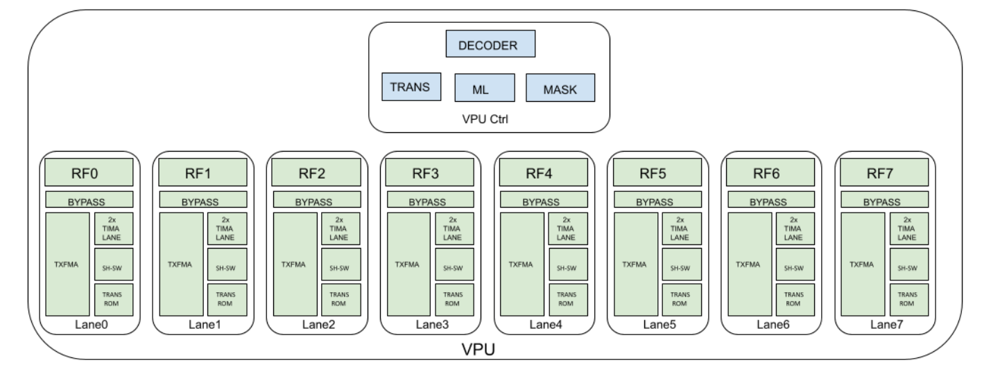


_Figure 1_ 

### 2.1 Pipeline Description 

The VPU pipeline consists of eight stages that execute instructions issued by the intpipe core and also conform complex Tensor/trans operations by injecting u-sequence instructions into the control datapath. The following figure is a schematic representation of the vpu_ctrl and the vpu_lane(S) pipelines along with the additional sub-modules. The details of the control logic are relatively complex and will be described in the next sections. 


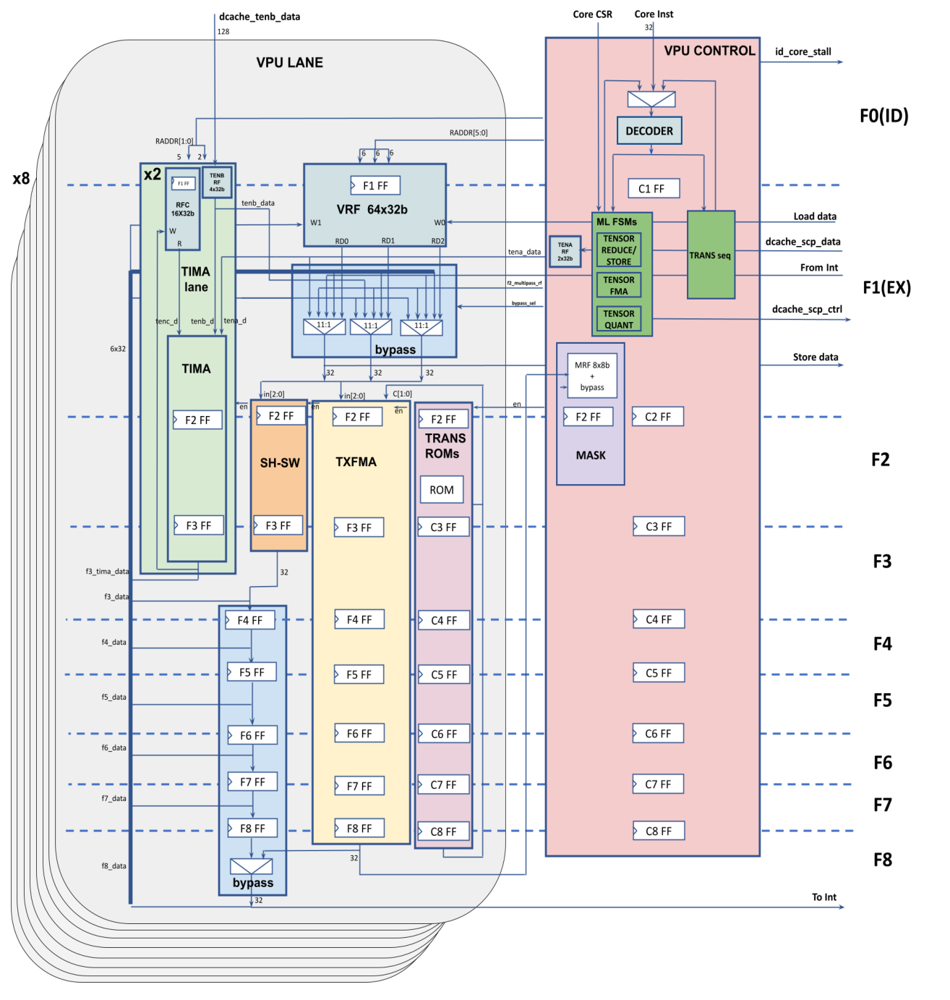


_Figure 2_ 

Each of the VPU stages is synchronized with another stage from the integer pipeline (intpipe) or Data Cache (DCache) pipeline. The following figure shows the datapath block diagram of the VPU, intpipe, and DCache and the alignment between the states: 


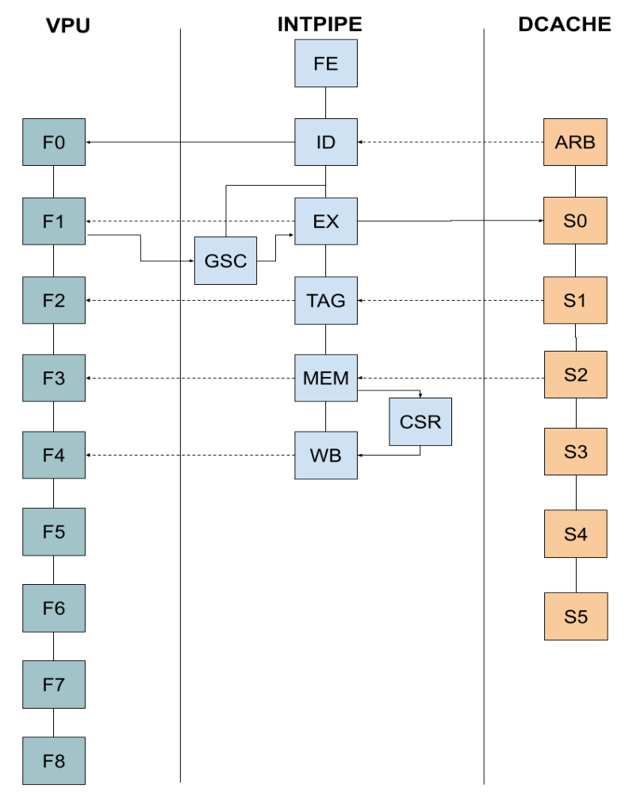


_Figure 3_ 

#### 2.1.1 Pipeline Stage F0 

Pipeline stage F0 is aligned with the core stage ID. The issued instruction enters into the VPU pipeline along with the decoded control signals, the thread ID, and the instruction valid signal. 

For timing purposes, the VPU decoder module is located in the frontend_top (Frontend stage 5). The decoder generates datapath control signals and flops the data, so the VPU receives the signals (which are timing clean) at the ID stage. 

The VPU control module extracts the source addresses (maximum of three operands) from the instruction bits to read the VPU Register File (VRF) and provide the operand data to the instructions. Note that the VRF internally latches the read address ports, so the read operation is actually produced in the next stage (F1). 

The source address bits are encoded in different positions on the encoded instruction. To handle this, the unit uses control information from the decoders to swap the assignment bits of the target operands (i.e., op1=op2, op2=op3, op1=opd, etc). 

There are some instructions that require an _immediate_ value to operate. In this case, the bits are extracted from the instruction and the operand is forced into the bypass network. 

For the FP instructions that require a Rounding Mode (RM), the bits are extracted from the instruction too. Notice that if the RM value is equal to ‘7’ (so-called dynamic mode in RISC-V) then the VPU uses the FCSR_RM input port (Control and Status Register [CSR] in the core) as the RM. 

Refer to the <u>RISC-V Spec and ET-PRM for a more detailed description of all the instruction</u> encodings. 

A second VPU decoder (vpu_uinst_decoder) is instanced in the VPU ctrl to decode the u-instructions injected by the ML or trans units. There is a 3:1 Multiplexer (MUX) to select who has control over the VPU ctrl datapath to issue instructions. 


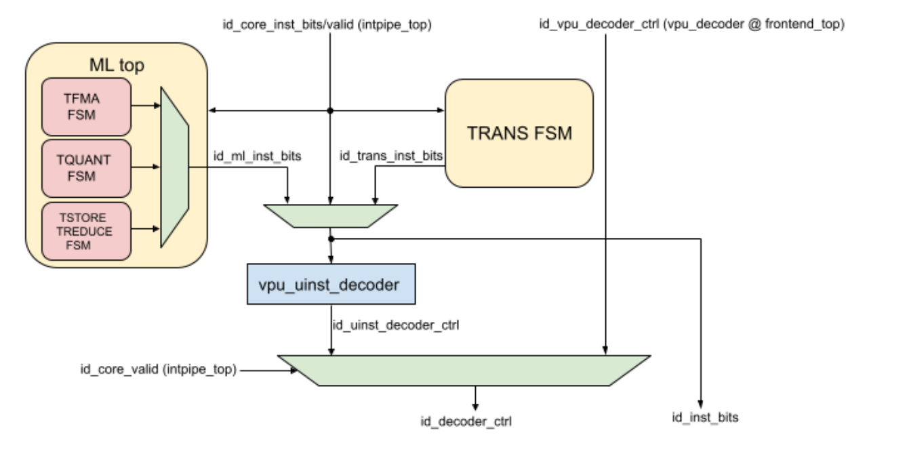


_Figure 4_ 

This design is meant to ensure the intpipe will never send an instruction to the VPU while there is an ML or trans operation ongoing (busy). A stall mechanism in the core is implemented for this purpose. 

The intpipe core at this stage holds 3 scoreboards (INT.S, FP, and mask) to track the operand dependencies between the instructions and stall the pipeline if the conditions are met. To implement the scoreboards, the core requires the following instruction execution information from the VPU: 

- Standard instructions targeting the INT.S/FP or mask destination require destination operand protection from stages F5 to F8 (addr, thread id, valid). 

- Trans instructions require source/destination operand protection during the entire u- sequencing process. 

See the Scoreboards section for more details about the different scoreboard implementations. 

Tensor operations also require protection from all the VPU datapath resources during the whole u- sequencing process. To achieve this, the VPU provides a single bit ‘busy’ signal to the core to stall the pipeline if any younger instruction requires access to the VPU (even if it belongs to thread1). 

#### 2.1.2 Pipeline Stage F1 

Pipeline stage F1 is aligned with the core stage EX. The control datpath provides the required instruction control and a valid signal to enable the functional unit and command to compute the instruction. 

The VPU qualifies the instruction valid signal with the EX kill input from the core. If the kill signal is active, then the instruction will not start the execution. 

To ease the operand dependencies between instructions, a full set of bypass network logic (see the <u>Bypass section for more details) is provided at the input of the units on each lane.</u> 

For the PS instructions that depend on the special M0 (mask) register (refer to the <u>PRM-4</u> document for details), the VPU will only execute the instruction in a functional lane if it has its associated M0 bit set to 1 (i.e., if M0[0]==0, then VPUlane0 is ‘OFF’ and if  M0[7]==1, then VPUlane7 is ON). 

In this stage, the VPU also passes some control information to the core: the M0 reg value for the load instruction, VRF lane data for the gathers, and an illegal RM check. 

The F1 stage is also aligned with the core stage Gather/Scatter (GSC). When a GSCr instruction reaches the EX stage, the ID stage is stalled while the GSC instruction iterates over the lane operations. During the next cycle, the instruction reaches the GSC stage in the core and the VPU provides data from the VRF lanes. The core uses the VPU data to compute the GSC next address to access memory. 

#### 2.1.3 Pipeline Stage F2 

Pipeline stage F2 is aligned with the core stage TAG. It contains the TXFMA, Short-Swizzle (SHSW) unit, the mask, and the trans u-sequencer/Read-Only Memory (ROM). 

The VPU qualifies the F2 instruction valid signal with the TAG kill signal from the core. Note that from this point onwards, if the kill signal is active, the result will not be committed into the VRF nor bypassed to younger instructions even though the units will continue their computation. 

For Store/Scatter instructions, a flopped VRF data is sent to the core. 

To implement the SWIZZLE and PACKREPH/B instructions, the VPU control implements a mesh MUX between all input/outputs of all the VPU lanes. 

#### 2.1.4 Pipeline Stage F3 

Pipeline stage F3 is aligned with the core stage MEM. The VPU qualifies the instruction valid signal with the MEM kill signal from the core. 

The SH-SW unit provides computation results, where the data is pushed to the next pipeline stage (F4) and might be bypassed (if it meets dependency) to the inputs of an instruction at the EX stage. 

This stage is also aligned with the DCache stage S2. Although the memory responses occur asynchronously to the pipeline, the VPU aligns with them at F3 to write the RFs. 

#### 2.1.5 Pipeline Stage F4 

Pipeline stage F4 is aligned with the core stage WB. The VPU qualifies the instruction valid signal with the WB kill signal from the core. The bypass logic is also operative. 

#### 2.1.6 Pipeline Stages F5-F7 

Pipeline stages F5-F7 are mainly used to propagate pipeline control signals and instruction results data from the short unit. The bypass logic is also operative. 

#### 2.1.7 Pipeline Stage F8 

This stage exists only to commit the instructions and write the final computation results to the VRF. 

The TXFMA unit, the trans ROM unit, or the pipeline provide the computation results, where the data is pushed to the VRF and might be bypassed (if it meets dependency) to the inputs of an instruction at the EX stage. 

The VPU sends the following WB delayed signals to the core: 32b integer data from the scalar FP2INT convert instruction, 6b FP exception flags from FP instructions, and the thread ID. 

### 2.2 VPU Lane 

The following section lists all sub-modules that form a single (scalar) VPU lane. 

#### 2.2.1 Bypass 

<mark>VPU registers are read at the beginning of the F1 (EX) stage and updated at the end of the pipeline in F8. Some instructions that use the same registers as sources and/or destinations may overlap, so after checking which instructions are dependent on one another, the bypass unit forwards the results as soon as they are available. Some logic comparators can detect instruction dependencies</mark> 

<mark>by matching the destination register RD of an instruction in stages F3-F8 with the source registers RS0, RS1, or RS2 of an instruction at the EX stage. It also makes sure that the source thread ID matches the destination thread ID and that the lane is enabled (M0 reg). For the Tensor and trans u-instructions injected in the pipeline, it is sometimes necessary to force some source operands forward to a specific data result. The control sequencers provide some control signals to force the bypass. If none of the bypass conditions are met, the EX instruction receives data from the VRF</mark> read. 

<mark>11:1 Mux bypass network implementation for each of the three source operands:</mark> 

|**Reg Src**|**Seq Control Signal**|**bypassed_data**|**Operation**|**Latency Between**<br>**Inst (cyc)**|
|---|---|---|---|---|
|0|ex_tena_regfile_bypass_en==1|ex_tena_rf_rdata|Tensor u-inst|Upon op config|
|0|ex_bypass_force_ctrl.txfma_in0==1|f8_txfma_res.data|Trans u-inst|N/A|
|0|ex_req_lane.sigs.fromint==1|ex_fromint_data|Functional with scalar<br>int src|N/A|
|1|ex_tenb_regfile_bypass_en==1|ex_tenb_rf_rdata|Tensor u-inst|Upon op config|
|1|ex_bypass_force_ctrl.shsw_in1==1|f8_bits.data|Trans u-inst|N/A|
|1|ex_bypass_force_ctrl.txfma_in1==1|f8_txfma_res.data|Trans u-inst|N/A|
|2|ex_bypass_force_ctrl.shsw_in2==1|f8_bits.data|Trans u-inst|N/A|
|2|ex_bypass_force_ctrl.txfma_in2==1|f8_txfma_res.data|Trans u-inst|N/A|
|2|(ex_req_lane.sigs.fromint==1) &<br>(ex_req_lane.sigs.txfma==1)|ex_fromint_data|Functional with an RF<br>int src|N/A|


_Table 2_ 

|**Reg**<br>**Src**|**radd==waddr**|**ex_thread_id==wr_thread_id**|**bypassed_data**|**Instruction Type**|**Latency**<br>**Between**<br>**Inst (cyc)**|
|---|---|---|---|---|---|
|0,1,2|ex_raddr ==<br>dcache_addr_reg|ex_thread_id ==<br>dcache_thread_id_reg|dcache_wdata_l_<br>reg|Load|1|
|0,1,2|ex_raddr == f3_waddr|ex_thread_id == f3_thread_id|f3_wdata|Functional|2|
|0,1,2|ex_raddr == f4_waddr|ex_thread_id == f4_thread_id|f4_wdata|Functional|3|
|0,1,2|ex_raddr == f5_waddr|ex_thread_id == f5_thread_id|f5_wdata|Functional|4|
|0,1,2|ex_raddr == f6_waddr|ex_thread_id == f6_thread_id|f6_wdata|Functional|5|
|0,1,2|ex_raddr == f7_waddr|ex_thread_id == f7_thread_id|f7_wdata|Functional|6|
|0,1,2|ex_raddr == f8_waddr|ex_thread_id == f8_thread_id|f8_wdata|Functional|7|
|0,1,2|default (no dependencies)|default (no dependencies)|ex_rf_data|Functional|0|


_Table 3_ 

#### 2.2.2 Register File 

The VRF statically provisions all of the register read ports required to satisfy all issued instructions. 

Main features: 

- 64-entry x 32b (32 entries x thread) 

- 3 read ports (regular instruction) 

- 2 write ports (one assigned to functional instructions, one assigned to loads) 

- Thread ID is mapped into the Most Significant Bit (MSB) of the address 

- RD/WR input ports are flopped 

- Parameterized selection between ET-custom RF and synthesized SOL (sea-of-latches) 


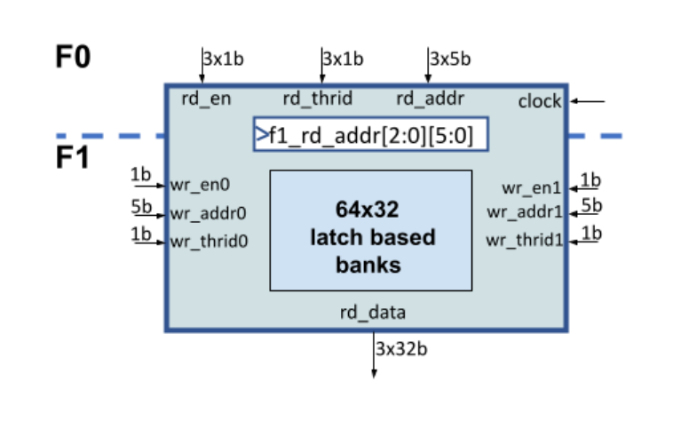


_Figure 5_ 

#### 2.2.3 TXFMA 

The Tensor X Fused Multiply-Add (TXFMA) unit is instanced in the VPU lane and performs 32b integer and FP arithmetic scalar operations. The ‘X’ is meant for supporting different data types (INT, FP16, FP32). The pipeline consists of 7 stages, the first of which is used to clock gate the input operands when the unit is not active. 

The following sections provide detailed block diagrams of each stage. 

###### **Supported instructions:** 

|**Instruction**|**Assembly**|**Description**<br>**RISC-V ISA**<br>**CONVERSION AND MOVE**|
|---|---|---|
|**FCVT.S.W**|fcvt.s.w fd, rs1 rm|Convert a 32b component from a signed integer register to a fd reg|
|**FCVT.S.WU**|fcvt.s.wu fd, rfs1 rm|Convert a 32b component from an unsigned integer register to a fd reg|
|**FCVT.W.S**|fcvt.w.s rd, fs1 rm|Convert a float32 component into a signed 32b number and store it in the int reg rd<br>using the encoded rounding mode|
|**FCVT.WU.S**|fcvt.wu.s rd, fs1 rm|Convert a float32 component into an unsigned 32b number and store it in the int reg rd<br>using the encoded rounding mode|
|||**COMPARE**|
|**FEQ.S**|feq.s rd, fs1, fs2|Perform an ieee 754 compare between a 32b component following the base ISA<br>rules leaving the boolean result in an int reg rd|
|**FLT.S**|flt.s rd, fs1, fs2|Perform an ieee 754 compare between a 32b component following the base ISA<br>rules leaving the boolean result in an int reg rd|
|**FLE.S**|fle.s rd, fs1, fs2|Perform an ieee 754 compare between a 32b component following the base ISA<br>rules leaving the boolean result in an int register rd|
|**FCLASS.S**|fclass.s rd, fs1|Perform a classify operation on a 32b component following the base ISA rules<br>leaving the 10b mask result in an int reg rd|
|||**COMPUTATIONAL**|
|**FADD.S**|fadd.s fd, fs1, fs2 rm|Perform single-precision Floating-Point addition|
|**FSUB.S**|fsub.s fd, fs1, fs2 rm|Perform single-precision Floating-Point subtraction|
|**FMUL.S**|fmul.s fd, fs1, fs2 rm|Perform single-precision Floating-Point multiplication|
|**FMADD.S**|fmadd.s fd, fs1, fs2, fs3 rm|Perform single-precision Floating-Point Fused Multiply–Add_[(fs1 x fs2) + fs3]_|
|**FMSUB.S**|fmsub.s fd, fs1, fs2, fs3 rm|Perform single-precision Floating-Point Fused Multiply–Sub_[(fs1 x fs2) - fs3]_|
|**FNMADD.S**|fnmadd.s fd, fs1, fs2, fs3 rm|Perform single-precision Floating-Point Fused Multiply–Add (NEG)_[(~fs1 x fs2) + fs3]_|
|**FNMSUB.S**|fnmsub.s fd, fs1, fs2, fs3 rm|Perform single-precision Floating-Point Fused Multiply–Sub (NEG)_[(~fs1 x fs2) - fs3]_|
|**FMIN.S**|fmin.s fd, fs1, fs2|Perform single-precision FMIN, which follows the RISC-V “S” extension definition for<br>not a number(NaN)and infinity|
|**FMAX.S**|fmax.s fd, fs1, fs2|Perform single-precision FMAX, which follows the RISC-V “S” extension definition for<br>not a number(NaN)and infinity|


_Table 4_ 

|**Instruction**|**Assembly**|**Description**<br>**ET ISA extension**<br>**CONVERSION AND MOVE**|
|---|---|---|
|**FCVT.PS.PW**|fcvt.ps.pw fd, rs1 rm|Convert each 32b component from a signed int32 to a float32 and store it<br>in fd. Operation is controlled by the Mask0 register.|
|**FCVT.PS.PWU**|fcvt.ps.pwu fd, rs1 rm|Convert each 32b component from an unsigned int32 to a float32 and<br>store it in fd. Operation is controlled by the Mask0 register.|
|**FCVT.PW.PS**|fcvt.pw.ps fd, fs1 rm|Convert each float32 component into a signed 32b integer and store it in<br>the fp destination. Operation is controlled by the Mask0 register.|
|**FCVT.PWU.PS**|fcvt.pwu.ps fd, fs1 rm|Convert each float32 component into an unsigned 32 integer and store it<br>in the fp destination. Operation is controlled by the Mask0 register.|
|||**COMPARE**|
|**FEQM.PS**<br>**(mask destination)**|feqm.ps md, fs1, fs2|Perform an ieee 754 compare between each 32b component following the<br>base ISA rules leaving the boolean result in **mask register md**|
|**FEQ.PS**<br>**(freg destination)**|feq.ps fd, fs1, fs2|Perform an ieee 754 compare between each 32b component following the<br>base ISA rules leaving the boolean result in **freg register fd**|
|**FLEM.PS**<br> **(mask destination)**|flem.ps md, fs1, fs2|Perform an ieee 754 compare between each 32b component following the<br>base ISA rules leaving the boolean result in **mask register md**|
|**FLE.PS**<br> **(freg destination)**|fle.ps fd, fs1, fs2|Perform an ieee 754 compare between each 32b component following the<br>base ISA rules leaving the boolean result in **freg register fd**|
|**FLTM.PS**<br> **(mask destination)**|fltm.ps md, fs1, fs2|Perform an ieee 754 compare between each 32b component following the<br>base ISA rules leaving the boolean result in **mask register md**|
|**FLT.PS**<br> **(freg destination)**|flt.ps fd, fs1, fs2|Perform an ieee 754 compare between each 32b component following the<br>base ISA rules leaving the boolean result in **freg register fd**|
|**FCLASS.PS**|fclass.ps fd, fs1|Perform a classify operation on each 32b component following the base<br>ISA rules leaving the 10b mask result in FP register fd|
|||**COMPUTATIONAL**|
|**FADD.PS**|fadd.ps fd, fs1, fs2 rm|Performs an FADD on each of the 4-float32 components. Operation<br>controlled by the Mask0 register.|
|**FSUB.PS**|fsub.ps fd, fs1, fs2 rm|Performs an FSUB on each of the 4-float32 components. Operation<br>controlled by the Mask0 register.|
|**FMUL.PS**|fmul.ps fd, fs1, fs2 rm|Performs an FMUL on each of the 4-float32 components. Operation<br>controlled by the Mask0 register.|
|**FMIN.PS**|fmin.ps fd, fs1, fs2|Performs an FMIN on each of the 4-float32 components. Operation<br>controlled by the Mask0 register. Should have the same behavior in<br>relation to NaN and infinity as the base FMIN instruction defined in the<br>RISC-V “S” extension.|
|**FMAX.PS**|fmax.ps fd, fs1, fs2|Performs an FMAX on each of the 4-float32 components. Operation<br>controlled by the Mask0 register. Should have the same behavior in<br>relation to NaN and infinity as the base FMAX instruction defined in the<br>RISC-V “S” extension.|
|**FMADD.PS**|fmadd.ps fd, fs1, fs2, fs3<br>rm|<br>Performs an FMADD on each of the 4-float32 components. Operation<br>controlled by the Mask0 register.|
|**FMSUB.PS**|fmsub.ps fd, fs1, fs2, fs3<br>rm|<br>Performs an FMSUB on each of the 4-float32 components. Operation<br>controlled by the Mask0 register.|
|**FNMADD.PS**|fnmadd.ps fd, fs1, fs2,<br>fs3 rm|<br>Performs an FNMADD on each of the 4-float32 components. Operation<br>controlled by the Mask0 register.|
|**FNMSUB.PS**|fnmsub.ps fd, fs1, fs2,<br>fs3 rm|<br>Performs an FNMSUB on each of the 4-float32 components. Operation<br>controlled by the Mask0 register.|
|||<br>**PACKED-INTEGER**<br>|
|**FMUL.PI**|fmul.pi fd, fs1, fs2|Performs integer multiplication between src1 and src2 for each of the four<br>components. Result is the 32 LSBs of the multiplication.|
|**FMULH.PI**|fmulh.pi fd, fs1, fs2|Performs a 32-bit signed integer multiplication between src1 and src2 for<br>each of the four components. Result is the 32 MSBs of the multiplication.|
|**FMULHU.PI**|fmulhu.pi fd, fs1, fs2|Performs a 32-bit unsigned integer multiplication between src1 and src2<br>for each of the four components. Result is the 32 MSBs of the|
|||multiplication.|
|||**UPCONVERT**|
|**FCVT.PS.F16**|fcvt.ps.f16 fd, fs1|Upconvert the 16 high order bits of each 32b sub-element from float16 to<br>float32|
|**FCVT.PS.F11**|fcvt.ps.f11 fd, fs1|Upconvert the 11 high order bits of each 32b sub-element from float11 to<br>float32|
|**FCVT.PS.F10**|fcvt.ps.f10 fd, fs1|Upconvert the high order 10b of each 32b sub-element from float10 to<br>float32|
|**FCVT.PS.UN24**|fcvt.ps.un24 fd, fs1|Upconvert the high order 24b of each 32b sub-element from unorm to<br>float32|
|**FCVT.PS.UN16**|fcvt.ps.un16 fd, fs1|Upconvert the high order 16b of each 32b sub-element from unorm to<br>float32|
|**FCVT.PS.UN8**|fcvt.ps.un8 fd, fs1|Upconvert the high order 8b of each 32b sub-element from unorm to<br>float32|
|**FCVT.PS.UN10**|fcvt.ps.un10 fd, fs1|Upconvert the high order 10b of each 32b sub-element from unorm to<br>float32|
|**FCVT.PS.UN2**|fcvt.ps.un2 fd, fs1|Upconvert the high order 2b of each 32b sub-element from unorm to<br>float32|
|**FCVT.PS.SN16**|fcvt.ps.sn16 fd, fs1|Upconvert the high order 16b of each 32b sub-element from snorm to<br>float32|
|**FCVT.PS.SN8**|fcvt.ps.sn8 fd, fs1|Upconvert the high order 8b of each 32b sub-element from snorm to<br>|
|||float32|
|||**DOWNCONVERT**|
|**FCVT.F16.PS**|fcvt.f16.ps fd, fs1|Downconvert each 32b sub-element from float32 down to float16 (according<br>to the FCSR rounding mode)|
|**FCVT.F11.PS**|fcvt.f11.ps fd, fs1|Downconvert each 32b sub-element from float32 down to float11 (no<br>rounding)|
|**FCVT.F10.PS**|fcvt.f10.ps fd, fs1|Downconvert each 32b sub-element from float32 down to float10 (no<br>rounding)|
|**FCVT.UN24.PS**|fcvt.un24.ps fd, fs1|Downconvert each 32b sub-element from float32 down to unorm24<br>(according to the FCSR rounding mode)|
|**FCVT.UN16.PS**|fcvt.un16.ps fd, fs1|Downconvert each 32b sub-element from float32 down to unorm16<br>(according to the FCSR rounding mode)|
|**FCVT.UN10.PS**|fcvt.un10.ps fd, fs1|Downconvert each 32b sub-element from float32 down to unorm10<br>(according to the FCSR rounding mode)|
|**FCVT.UN8.PS**|fcvt.un8.ps fd, fs1|Downconvert each 32b sub-element from float32 down to unorm8<br>(according to the FCSR rounding mode)|
|**FCVT.UN2.PS**|fcvt.un2.ps fd, fs1|Downconvert each 32b sub-element from float32 down to unorm2<br>(according to the FCSR rounding mode)|
|**FCVT.SN16.PS**|fcvt.sn16.ps fd, fs1|Downconvert each 32b sub-element from float32 down to snorm16<br>(according to the FCSR rounding mode)|
|**FCVT.SN8.PS**|fcvt.sn8.ps fd, fs1|Downconvert each 32b sub-element from float32 down to snorm8<br>(according to the FCSR rounding mode)|
|||**GRAPHICS ADDITIONAL**|
|**FFRC.PS**|ffrc.ps fd, fs1 rm|Computes the fractional portion of each float32 component. Performs the<br>same function as the <math.h> “modf” function, which is used in the<br>semantics below.|
|**FROUND.PS**|fround.ps fd, fs1 rm|Rounds each component according to the rounding mode encoded in the<br>instruction. Operation enabled by the Mask0 register bits.|
|||**TENSOR U-INSTRUCTIONS (INJECTED BY ML SEQUENCER)**|
|**TMUL FP16A32**|u-instruction|Multiplies the two FP16 matrices (A and B) and accumulates them in FP32.|
|**TFMA FP16A32**|u-instruction|Multiplies the two FP16 matrices (A and B) and accumulates the result into<br>the FP32 C matrix. The internal accumulations performed during the|
|||multiplication process are FP32.|
|||**TRANS U-INSTRUCTIONS (INJECTED BY TRANS SEQUENCER)**|
|**TRANS_RCP_FMA1**|u-instruction|Reciprocal FMA1 (see 2.3.7.2 for details)|
|**TRANS_RCP_FMA2**|u-instruction|Reciprocal FMA2 (see 2.3.7.2 for details)|
|**TRANS_LOG_FMA1**|u-instruction|LOG FMA1 (see 2.3.7.3 for details)|
|**TRANS_LOG_FMA2**|u-instruction|LOG FMA2 (see 2.3.7.3 for details)|
|**TRANS_LOG_MUL**|u-instruction|LOG MUL (see 2.3.7.3 for details)|
|**TRANS_LOG_RR**|u-instruction|LOG convert (see 2.3.7.3 for details)|
|**TRANS_EXP_FMA1**|u-instruction|EXP FMA1 (see 2.3.7.4 for details)|
|**TRANS_EXP_FMA2**|u-instruction|EXP FMA2 (see 2.3.7.4 for details)|
|**TRANS_EXP_FRAC**|u-instruction|EXP FRAC (see 2.3.7.4 for details)<br>_Table 5_|


2.2.3.1 F0 


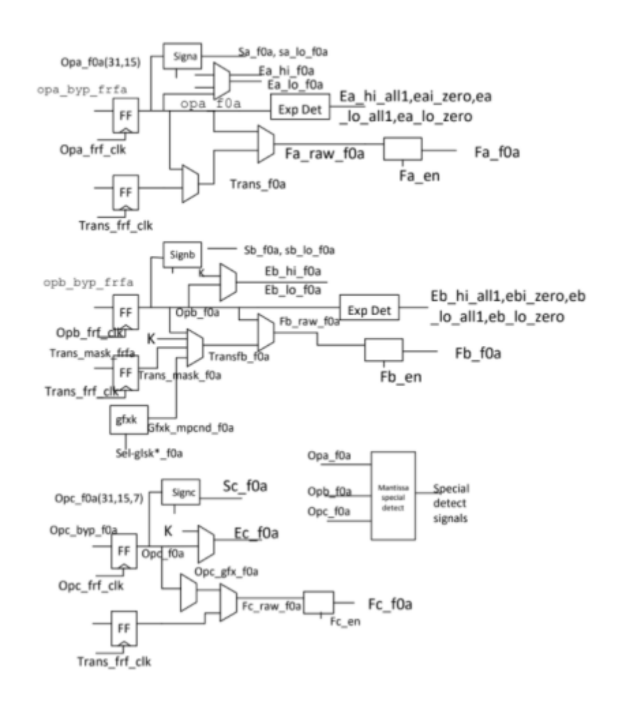


_Figure 6_ 

2.2.3.2 F1 


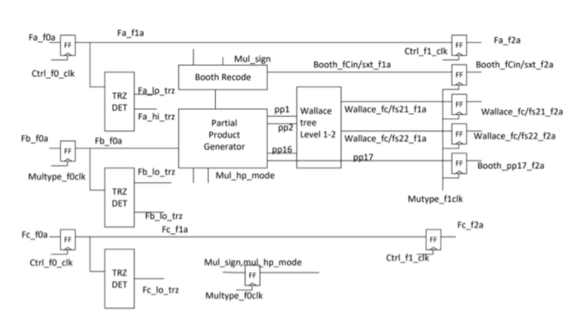


_Figure 7_ 

##### 2.2.3.3 F2 


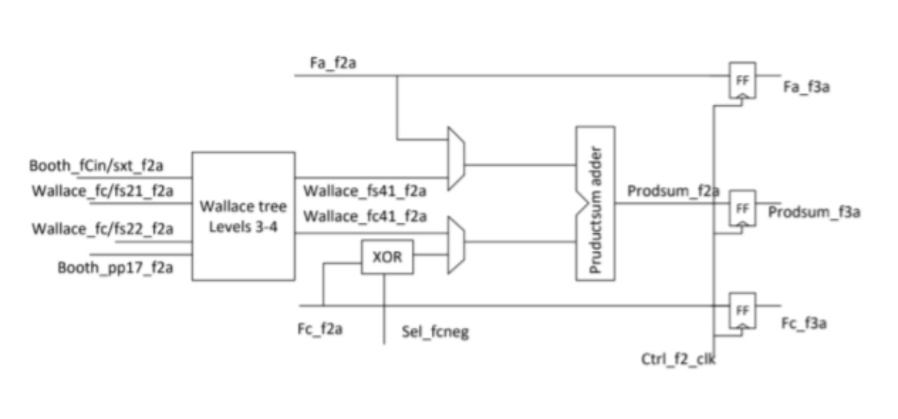


_Figure 8_ 

2.2.3.4 F3 


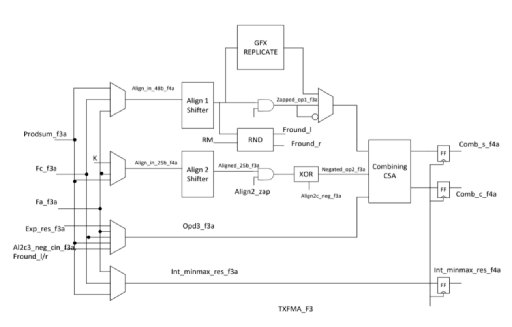


_Figure 9_ 

##### 2.2.3.5 F4 


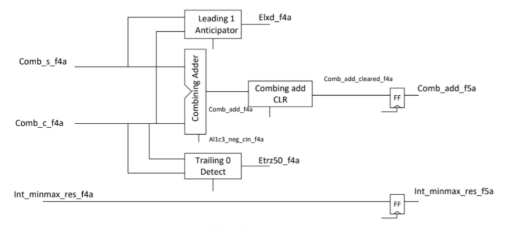


_Figure 10_ 

2.2.3.6 F5 


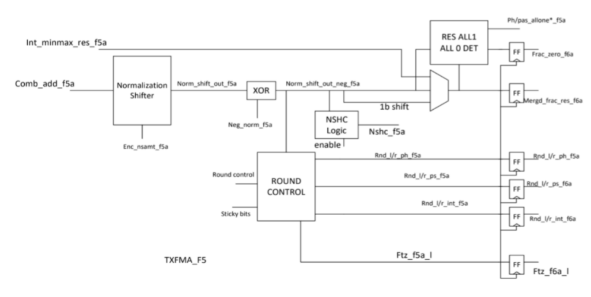


_Figure 11_ 

##### 2.2.3.7 F6 


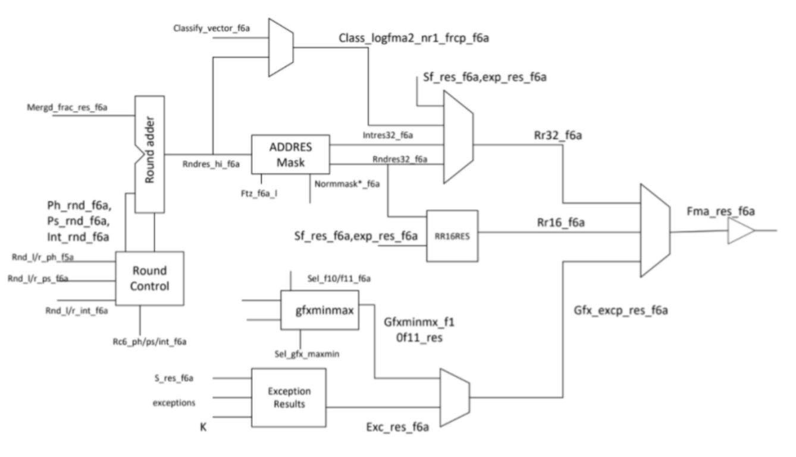


_Figure 12_ 

##### 2.2.3.8 FP16A32 Tensor Instruction Exception Behavior 

The following describes the expected exception behavior for each of the ET Tensor instructions. 

It is important to note that there are no traps signaled. Instead, the appropriate flags are set and the results are shown below: 

|**Tensor**<br>**Instructions**|**Operation**|**Tensor/**<br>**RISC-V**|**Exception**<br>**Model **|**Comments**|
|---|---|---|---|---|
|SFMA .PS|A*B ± C|RISC-V|IEEE||
|SFMUL. PS|A*B|RISC-V|IEEE||
|TXFMA. PH|AH*BH +CH||AL*BL + CL ==> D(PH)|RISC-V|IEEE|AH/AL/BH/BL/CH/CL are HP|
|TXFMUL. PH|AH*BH||AL*BL==> D(PH)|RISC-V|IEEE|AH/AL/BH/BL/CH/CL are HP|
|TXFMA .PS|AH * BH  + AL * BL  +C(PS)==> D(PS)|Tensor|See next|AH/AL/BH/BL/CH/CL are HP|
|TXFMUL. PS|AH * BH  + AL * BL ==>D(PS)|Tensor|See next|AH/AL/BH/BL/CH/CL are HP|
|TIMA.S8|A3*B3+A2*B2+A1*B1+A0*B0 +C(32b)|Tensor|See next|Ai/Bi are 8b and C is a 32b signed<br>integerƒ|
|TIMA.u8|A3*B3+A2*B2+A1*B1+A0*B0 +C(32b)|Tensor|See next|Ai/Bi are 8b unsigned integers|


_Table 6_ 

|**Exception Behaviors**|**Operands**|**Any Input**<br>**Value/Operation**|**Proposed Result for**<br>**Minion**|**FLAGS**|
|---|---|---|---|---|
||||**Masked IEEE Result**||
|**Input exceptions**|||||
|TXFMA. PS/TXFMUL.PS|AH/BH/AL/BL: PH.  C: PS|Nan/Snan|CQNAN|INV for SNaN|
|||Denorm|Input forced to zero|DENORMAL|
|||± INF|± INF||
|||INV OPERATION|CQNAN|INV|
|**Output Exceptions**||**Exception**|**Proposed Result for**<br>**Minion**|**FLAGS**|
|TXFMA. PS/TXFMUL.PS||INE|Inexact rounded result|INE|
|||OVERFLOW|f(RM): Max or INF|OVF|
|||UNDERFLOW|0|UNF|
|TIMA.S8||overflow|Positive: 7FFFFFFF<br>Negative: 1000 0000|INV|
|TIMA.u8||overflow|FFFF FFFF|INV|
|||Max value: ± exp = 254, Frac = all ones|||


_Table 7_ 

##### 2.2.3.9 Denormals 

<mark>The TXFMA does not support denormal numbers in the FP operations and treats all denormalized inputs as zeros. The source register is not altered. A denormal exception (ET extension bit) occurs</mark> when a denormal input is flushed-to-zero. 

<mark>If the result of an FP32 operation is in the range of -2^-126 to +2^-126 before rounding, it is replaced by a 0. Similarly, if the result of an FP16 operation is in the range of -2^-15 to +2^-15, it is replaced by a 0.</mark> 

#### 2.2.4 INT Short-Swizzle 

The Short-Swizzle (SH-SW) unit is instanced in the VPU lane and performs 32b integer and logical scalar operations. The ‘short’ name stands for the fastest functional unit providing results in the VPU pipeline. The datapath is formed by two stages and the first one is used to clock gate the input operands while the unit is not active. 


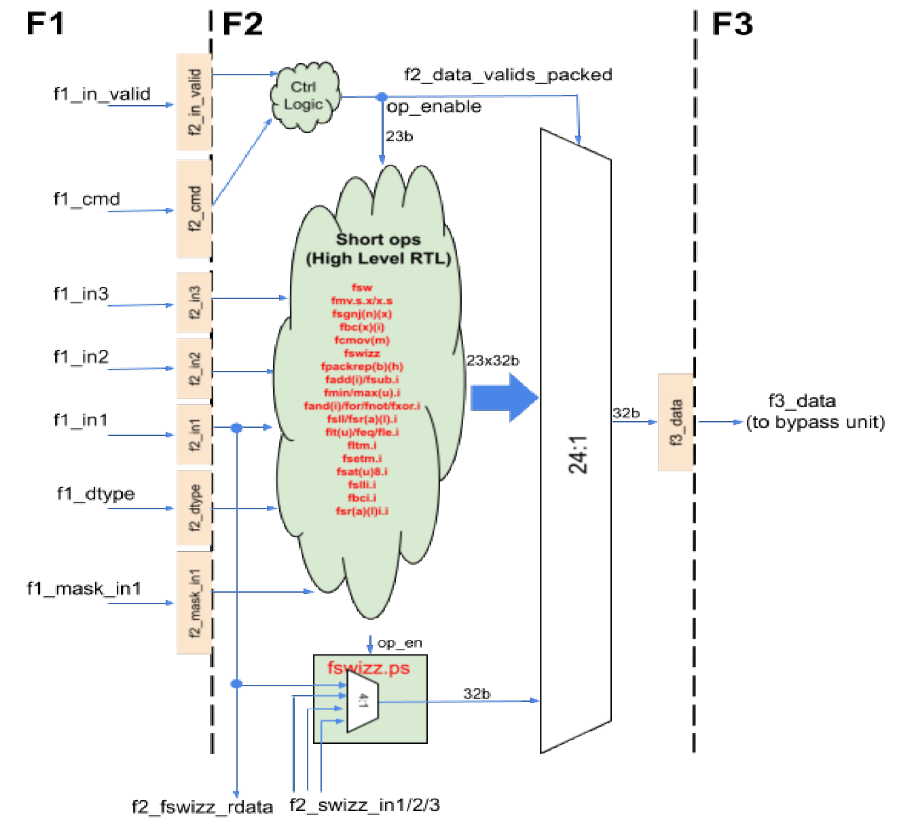


_Figure 13_ 

###### **Supported instructions:** 

|**Instruction**|**Assembly**|**Description**|
|---|---|---|
|||**RISC-V ISA**|
|||**CONVERSION AND MOVE**|
|**FSGNJ.S**|fsgnj.s fd, fs1, fs2|Appends the sign bit of fs2 with the exponent and mantissa of fs1 and writes the resulting<br>float32 into the destination VRF.<br>Operation ( S(fs2) . Exp(fs1) . Mant(fs1) → fd )<br>Sign-injection instructions do not set FP exception flags.|
|**FSGNJN.S**|fsgnjn.s fd, fs1, fs2|Appends the inverse sign bit of fs2 with the exponent and mantissa of fs1 and writes the<br>resulting float32 into the destination VRF.<br>Operation ( S(~fs2) . Exp(fs1) . Mant(fs1) → fd )<br>Sign-injection instructions do not set FP exception flags.|
|**FSGNJX.S**|fsgnjx.s fd, fs1, fs2|Takes the XOR of the fs1 and fs2 sign bits and appends the result with the exponent and<br>mantissa of fs1 and writes the resulting float32 into the destination VRF.<br>Operation ( S(fs1 ^ fs2) . Exp(fs1) . Mant(fs1) → fd )<br>Sign-injection instructions do not set FP exception flags.|
|**FMV.X.S**|fmv.x.s rd, fs1|Moves 32b of the s register into the lower 32b of an integer register. The upper 32 bits of<br>the rd register are zeroed|
|**FMV.S.X**|fmv.s.x fd, xs1|Moves 32b of an integer register into the the 32b of the s register|


_Table 8_ 

|**Instruction**|**Assembly**|**Description**|
|---|---|---|
|||**ET ISA extension**|
|||**BROADCAST**|
|**FBC.PS**|fbc.ps fd, offset(rs1)|Broadcasts 32 bits from memory into zero or more of the four elements of an<br>FP register, as indicated by the Mask0 register. A mask value of 0 is a legal<br>value and will result in no data movement.|
|**FBCI.PS**|fbci.ps fd, imm20|Expands the 20b immediate in the instruction to an FP32 value and<br>broadcasts this value into the four elements of an f-reg. The immediate<br>codifies the bits 31:12 of an IEEE single-precision floating-point number (i.e.,<br>1 sign bit, 8 exponent bits, and 11 mantissa bits). To fill the missing lower 12<br>mantissa bits of a 32-bit FP value, the 4 lower bits of imm20 are replicated<br>using the formula for low12.|
|**FBCX.PS**|fbcx.ps fd, rs1|Broadcasts the lower 32 bits of an integer register into zero or more of the<br>four components of an FP register, as indicated by the Mask0 register. A<br>mask value of 0 is a legal value and will result in no data movement.|
|||**CONVERSION AND MOVE**|
|**FCMOV.PS**|fcmov.ps fd, fs1, fs2, fs3|For each component, conditionally move from src2 or src3 based on the<br>boolean value located in fs1<br>Example: fd.e0 = fs1.e0 != 0 ? fs2.e0 : fs3.e0|
|**FCMOVM.PS**|fcmovm.ps fd, fs1, fs2|For each component, conditionally move from src1 or src2 based on the<br>boolean value located in the mask register M0|
|**FMVZ.X.PS**|fmvz.x.ps rd, fs1, index|Moves one of the four components of the PS register into the lower 32b of<br>an integer register. The upper 32 bits of the rd register are zeroed|
|**FMVS.X.PS**|fmvs.x.ps rd, fs1, index|Moves one of the four components of the PS register into the lower 32b of<br>an integer register. The upper 32 bits of the rd register take the sign bit of<br>the moved component|
|**FSGNJ.PS**|fsgnj.ps fd, fs1, fs2|Performs an FSGNJ on each of the four float32 components|
|**FSGNJN.PS**|fsgnjn.ps fd, fs1, fs2|Performs an FSGNJN on each of the four float32 components|
|**FSGNJX.PS**|fsgnjx.ps fd, fs1, fs2|Performs an FSGNJX on each of the four float32 components|
|**FSWIZZ.PS**|fswizz.ps fd, fs1, imm|For each of the four elements in the destination, allows any of the four<br>elements in src1 to be selected according the the selector located in the|
|||immediate|
|||**ADDITIONAL GRAPHICS**|
|**CUBEFACE.PS**|cubeface.ps fd, fs1, fs2|Computes the cubemap face given the result of the comparisons between the<br>three texture cube coordinates|
|**CUBEFACEIDX.PS**|cubefaceidx.ps fd, fs1, fs2|Computes the signed cubemap face index given the defined cubemap face<br>and the sign of the maximum absolute cubemap coordinate rc|
|**CUBESGNSC.PS**|cubesgnsc.ps fd, fs1, fs2|Corrects the sign for the cubemap face s coordinate based on the cubemap<br>face index. fs1 holds the cubemap face index and fs2 holds the cubemap face<br>s coordinate before sign correction|
|**CUBESGNTC.PS**|cubesgntc.ps fd, fs1, fs2|Corrects the sign for the cubemap face t coordinate based on the cubemap<br>face index. fs1 holds the cubemap face index and fs2 holds the cubemap face|
|||t coordinate before sign correction|
|||**PACKED-INTEGER**|
|**FBCI.PI**|fbci.pi fd, imm20|Sign-extends the 20b immediate in the instruction to 32b and broadcasts this<br>value into the four elements of an f-reg. Broadcast controlled by the Mask0<br>register|
|**FMAX.PI**|fmax.pi fd, fs1, fs2|Performs integer max between src1 and src2 for each of the four<br>components under control of the Mask0 register|
|**FMIN.PI**|fmin.pi fd, fs1, fs2|Performs integer min between src1 and src2 for each of the four<br>components under control of the Mask0 register|
|**FMAXU.PI**|fmaxu.pi fd, fs1, fs2|Performs unsigned integer max between src1 and src2 for each of the four<br>components under the control of the Mask0 register|
|**FMINU.PI**|fminu.pi fd, fs1, fs2|Performs unsigned integer min between src1 and src2 for each of the four<br>components under the control of the Mask0 register|
|**FAND.PI**|fand.pi fd, fs1, fs2|Performs an AND between src1 and src2 for each of the four components<br>under the control of the Mask0 register|
|**FANDI.PI**|fandi.pi fd, fs1, imm10|Performs an AND between src1 and a sign-extended 10-bit immediate for<br>each of the four components under the control of the Mask0 register|
|**FOR.PI**|for.pi fd, fs1, fs2|Performs an OR between src1 and src2 for each of the four components<br>under the control of the Mask0 register|
|**FNOT.PI**|fnot.pi fd, fs1|Performs a NOT on src1 for each of the four components under the control<br>of the Mask0 register|
|**FXOR.PI**|fxor.pi fd, fs1, fs2|Performs an XOR between src1 and src2 for each of the four components<br>under the control of the Mask0 register|
|**FSLL.PI**|fsll.pi fd, fs1, fs2|Performs a left shift of each component of src1 by the amount indicated in<br>src2. Operation controlled by the Mask0 register.|
|**FSLLI.PI**|fslli.pi fd, fs1, imm5|Performs a left shift of each component of src1 by the amount indicated in the<br>immediate. Operation controlled by the Mask0 register.|
|**FSRL.PI**|fsrl.pi fd, fs1, fs2|Performs a logical right shift of each component of src1 by the amount<br>indicated in src2, inserting ‘0’s in the top bits. Operation is controlled by the<br>Mask0 register.|
|**FSRLI.PI**|fsrli.pi fd, fs1, imm5|Performs a logical right shift of each component of src1 by the amount<br>indicated in the immediate. Operation is controlled by the Mask0 register.|
|**FSRA.PI**|fsra.pi fd, fs1, fs2|Performs an arithmetic right shift of each component of src1 by the amount<br>indicated in src2; the original sign bit is copied into the vacated upper bits.<br>Operation is controlled by the Mask0 register.|
|**FSRAI.PI**|fsrai.pi fd, fs1, imm5|Performs an arithmetic right shift of each component of src1 by the amount<br>indicated in the immediate field; the original sign bit is copied into the<br>vacated upper bits. Operation controlled by the Mask0 register.|
|**FEQ.PI**|feq.pi fd, fs1, fs2|Performs an integer compare between each 32b component leaving the<br>boolean result (True (all ‘1s) if fs1 = fs2) in **freg register fd.**Operation is<br>controlled by the Mask0 register.|
|**FLE.PI**|fle.pi fd, fs1, fs2|Performs an integer compare between each 32b component leaving the<br>boolean result (True (all ‘1s) if fs1 <= fs2) in **freg register fd.**Operation is<br>controlled by the Mask0 register.|
|**FLT.PI**|flt.pi fd, fs1, fs2|Performs an integer compare between each 32b component leaving the<br>boolean result (True (all ‘1s) if fs1 <  fs2) in **freg register fd.**Operation is<br>controlled by the Mask0 register.|
|**FLTU.PI**|fltu.pi fd, fs1, fs2|Performs an **unsigned**integer compare between each 32b component<br>leaving the boolean result (True (all ‘1s) if fs1 < fs2) in **freg register fd.**<br>Operation controlled by the Mask0 register.|
|**FLTM.PI**|fltm.pi md, fs1, fs2|Performs an integer compare between each 32b component leaving the<br>boolean result (True (1 bit) if fs1[i] < fs2[i]) in **mreg register md**(1 bit for each<br>lane). Operation controlled by the Mask0 register.|
|**FPACKREPH.PI**|fpackreph.pi fd, fs1|Packs the lower 16 bits of the four 32-bit elements from the source register<br>and replicates them into the lower and higher 64 bits of the destination register<br>under the control of the Mask0 register.|
|**FPACKREPB.PI**|fpackrepb.pi fd, fs1|Packs the lower 8 bits of the four 32-bit elements from the source register and<br>replicates them through the 32-bit elements of the destination register under<br>the control of the Mask0 register.|
|**FSAT8.PI**|fsat8.pi fd, fs1|Performs a saturating downconvert from int32 to int8 under control of the<br>Mask0 register|
|**FSATU8.PI**|fsatu8.pi fd, fs1|Performs a saturating downconvert from int32 to intu8 under control of the<br>Mask0 register|
|**FADD.PI**|fadd.pi fd, fs1, fs2|Performs an integer ADD between src1 and src2 for each of the four<br>components|
|**FADDI.PI**|faddi.pi fd, fs1, imm|Performs an integer ADD between src1 and a sign-extended 10-bit immediate<br>for each of the four components|
|**FSUB.PI**|fsub.pi fd, fs1, fs2|Performs an integer SUB between src1 and src2 for each of the four<br>components<br>_Table 9_|


Refer to PRM-0 for a detailed description of each instruction. 

#### 2.2.5 TIMA Lane 

The TIMA (Tensor INT8 Multiply-Add) lane unit is instanced in the VPU-TIMA lane and performs 8b integer multiply + 32b accumulate scalar operations. The datapath consists of two stages, the first of which is used to flop the input operands and gate power when the unit is not operative. The lane is composed of a computational unit, a TENB RF (4 entries) to hold B matrix data from L2/SCP and a TENC RF (16 entries) to store temporal accumulation results. Note that the A matrix 32b data comes from a TENA RF (2 entries) that is located in the VPU ctrl unit. The interfaces of the  TIMA 

units are directly controlled from the TFMA control and the design is detached from the VPU ctrl to improve performance and power. 

###### **Supported instructions:** 

|**Instruction**|**Assembly**|**Description**|
|---|---|---|
|||**TENSOR EXTENSION (COMMANDED BY ML SEQUENCER)**|
|**TMUL INT8**|u-instruction|Multiplies two signed INT8 matrices (A and B) and accumulates them in<br>FP32.|
|**TFMA INT8**|u-instruction|Multiplies two signed INT8 matrices (A and B) and accumulates the result<br>into a signed INT32 C matrix. The internal accumulations performed during<br>the multiplication process are INT32.|
|||_Table 10_|


##### 2.2.5.1 Scalar TIMA Lane 


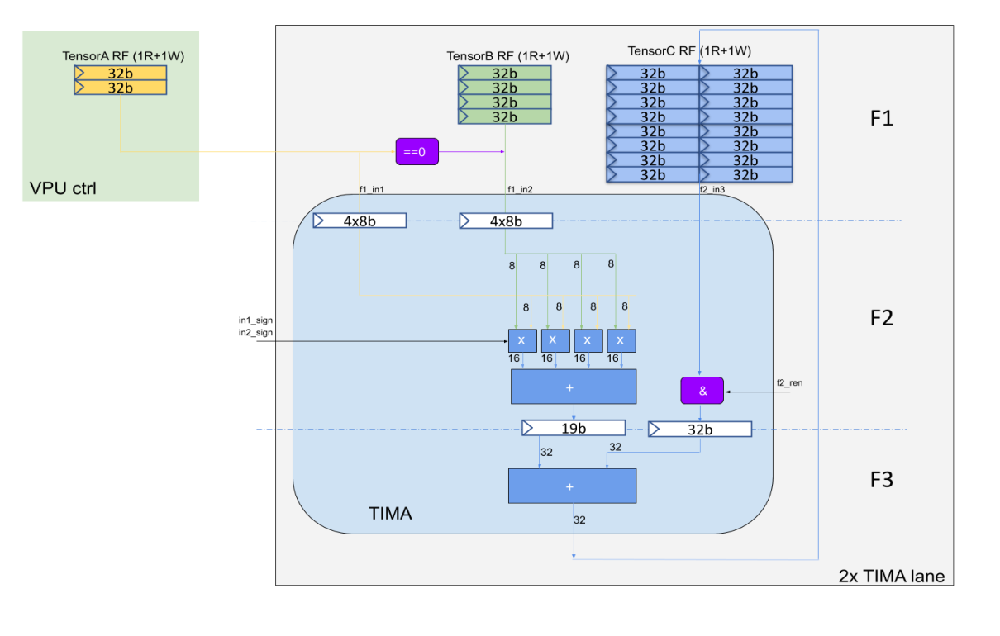


_Figure 14_ 

##### 2.2.5.2 Vector TIMA Lanes 

Each of the eight VPU lanes instantiates two TIMA lanes. So there are 16 total TIMA lanes in the VPU unit. 


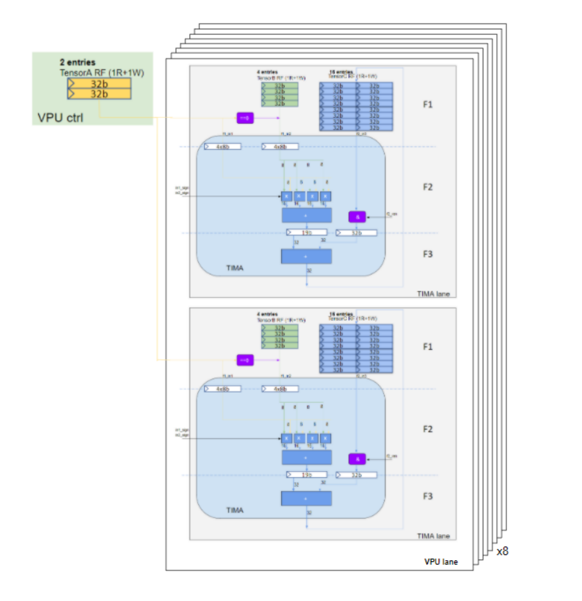


_Figure 15_ 

#### 2.2.6 Transcendental ROMs 

This unit is instanced in the VPU lane and contains transcendental ROMs (LUT latch-based) required to read the mantissa coefficients to implement a quadratic approximation operation (see 2.3.7 for further details). 

The pipeline consists of seven stages (similar to the TXFMA DP), the first of which is used to clock gate the input operands while the unit is not active. 

The input operand is the FP mantissa bits of the trans instruction and is used to generate an address for the table to obtain the approximation coefficients. 


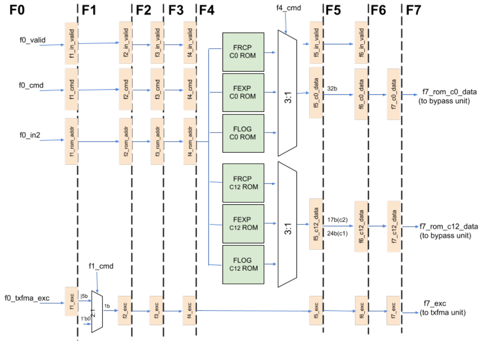


_Figure 16_ 

#### 2.2.7 Instruction Latencies 

The table below table summarizes the latency of regular instructions (non-tensor) executed in the different VPU lane functional units: 

**Functional Unit Execution Instruction Latency (cyc)** 

|INT Short-Swizzle|2|
|---|---|
|TXFMA|7|
|Trans ROMs|7|
|Load (data in the L1 $D)|4|


_Table 11_ 

If a younger instruction INS2 has operand dependencies with an older instruction INS1 executed for example in the TXFMA unit, it needs to wait 7 cycles until the instruction has completed to bypass the source operand data in F8: 

_INS1: ID F1 F2 F3 F4 F5 F6 F7 F8                               (VPU pipeline)_ 

_INS2:      ID ………...............ID F1 F2 F3 F4 …_ 

Similarly, if a younger instruction has operand dependencies with an older ‘load’ instruction, assuming that the data is in the L1 D$, it needs to wait 4 cycles until the data is available to bypass it in WB+1. The extra cycle is due to the VPU internally latching the memory data: 

_INS1: ID EX TAG MEM WB                            (Intpipe pipeline)_ 

_INS2:      ID ...................ID F1 F2 ..._ 

### 2.3 VPU Control 

The VPU control block manages all interactions with the Minion core and the DCache, performs VPU instruction decoding and sequencing, and maintains important state information regarding the status of instructions in flight. 

The control entity mainly consists of: 

- Datapath logic to control the pipeline execution (instruction decoding, functional unit activations, core kill qualification, RF read/write, core control feedback signals, etc.) 

- U-instruction decoder (main VPU decoder is located at the Frontend) 

- Load/Store logic support 

- GSC logic support 

- Mask unit 

- ML control units: TFMA, TQuant, TStore/TReduce 

- Transcendental u-sequencer 

#### 2.3.1 Decoding 

The decoding (ID) stage allows the VPU to determine which instruction is to be performed and which operands to fetch and to produce control signals for the datapath to compute the operations. 

The unit receives the 32-b instructions from the intpipe core along with a valid signal to issue the instruction. 

For timing purposes, the instruction VPU decoder module is located in the frontend_top (Frontend stage 5), while the u-instruction decoder used for sequencing instructions is located inside the VPU control. 

For a full description of the decoded control signals for all the instructions supported by the VPU, see the <u>Minion VPU Instructions document.</u> 

#### 2.3.2 Load/Store 

Load/Store instructions are managed by the VPU control logic. There is one dedicated VRF write port that allocates the load data replies. 

For the PS load instructions that conditionally use the M0 register to operate, it may take the memory accesses for the loads a long time to return with the responses. Meanwhile, younger instructions might enter into the pipeline and change the value of the M0 register. To manage this situation without stalling the pipeline, the VPU passes the M0 value to the core at the beginning of the instruction. The M0 then travels along with the load memory request, and the DCache returns the original M0 value along with the data reply. Finally, the VPU conditionally loads the VRF lanes. 

To simplify the design implementation, all store instructions are executed in F1 by the SH-SW unit, which basically reads the VRF entry and passes the registered data to the core in the next stage (F2). 

The following figures show the whole Load/Store sequence from the VPU’s point of view: 

Load 


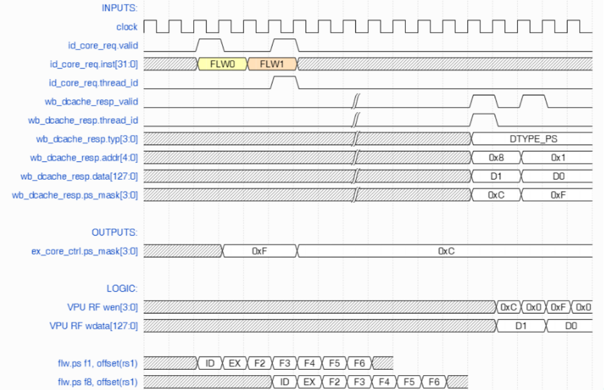


_Figure 17_ 


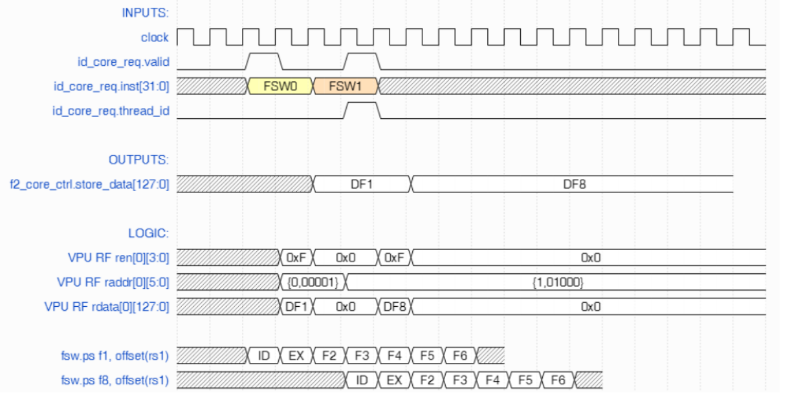


_Figure 18_ 

###### **Supported instructions:** 

|Instruction|Assembly|Description|
|---|---|---|
|||**RISC-V ISA**|
|||**LOAD AND STORE**|
|**FLW**|flw fd, offset(rs1)|Loads 32 consecutive bits from memory and stores them in destination fd reg|
|**FSW**|fsw fs1, offset(rs1)|Stores an freg into 32 consecutive bits in memory|


_Table 12_ 

|**Instruction**|**Assembly**|**Description**|
|---|---|---|
|||**ET ISA extension**|
|||**LOAD AND STORE**|
|**FLW.PS**|flw.ps fd, offset(rs1)|Loads 128 consecutive bits from memory and stores them in<br>destination fd reg|
|**FSW.PS**|fsw.ps fs1, offset(rs1)|Stores an freg into 128 consecutive bits in memory|
|**FSWPC.PS**|fswpc.ps fs1, offset(rs1)|Stores an freg into 128 consecutive bits in memory. This write will bypass<br>(write-around) all non-coherent caches and will write to the point of<br>coherency in the system. The address must be aligned with the 128b<br>boundary. The full 128 bits must be written. If the mask is clear for a lane,<br>zeros are written.|


_Table 13_ 

#### 2.3.3 Gather/Scatter 

Gather/Scatter (GSC) instructions are conformed between the intipe, VPU and DCache units. Refer to the <u>FE/Intpipe Description document for details about the instruction sequences.</u> 

The gather insn updates the VPU RF using the first write port (like load insn). 

The following figures show the whole GSC sequence from the VPU’s point of view: 

Gather: 


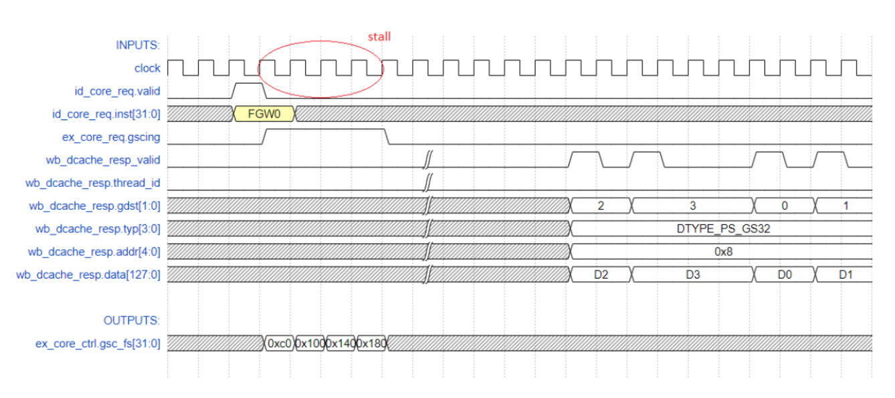


_Figure 19_ 

Scatter: 


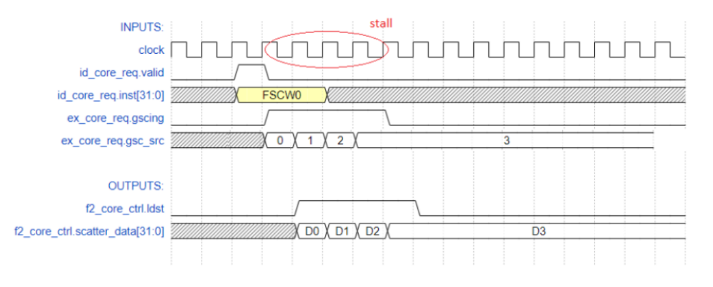


_Figure 20_ 

###### **Supported instructions:** 

|**Instruction**|**Assembly**||**Description**|
|---|---|---|---|
|||**ET ISA extension**||


|||**GATHER/SCATTER**|
|---|---|---|
|**FGW.PS**|fgw.ps fd, fs1, rs2|Gathers four arbitrary 32b memory locations and stores them in<br>destination fd reg|
|**FGH.PS**|fgh.ps fd, fs1, rs2|Gathers four arbitrary 16b memory locations and stores them in<br>destination fd reg after sign-extension to 32b|
|**FGB.PS**|fgb.ps fd, fs1, rs2|Gathers four arbitrary 8b memory locations and stores them in destination<br>fd reg after sign-extension to 32b|
|**FSCW.PS**|fscw.ps fs3, fs1, rs2|Scatters the four elements of an freg into four arbitrary 32b memory<br>locations|
|**FSCH.PS**|fsch.ps fs3, fs1, rs2|Scatters the 16b low-order bits of each of the four elements of an freg into<br>four arbitrary 16b memory locations|
|**FSCB.PS**|fscb.ps fs3, fs1, rs2|Scatters the 8b low-order bits of each of the four elements of an freg into<br>four arbitrary 8b memory locations|
|**FG32B.PS**|fg32b.ps fd, rs1, rs2|Restricted gather of bytes from a 32-byte aligned block of data pointed by<br>the second source operand as defined by the 5-bit indices in the first source<br>operand|
|**FG32H.PS**|fg32h.ps fd, rs1, rs2|Restricted gather of 16-bit words from a 32-byte aligned block of data<br>pointed by the second source operand as defined by the 4-bit indices in the<br>first source operand|
|**FG32W.PS**|fg32w.ps fd, rs1, rs2|Restricted gather of 32-bit words from a 32-byte aligned block of data<br>pointed by the second source operand as defined by the 3-bit indices in the<br>first source operand|
|**FSC32B.PS**|fsc32b.ps fs3, rs1, rs2|Restricted scatter of bytes from the third source operand on a 32-byte<br>aligned block of data pointed by the second source operand as defined by<br>the 5-bit indices in the first source operand|
|**FSC32H.PS**|fsc32h.ps fs3, rs1, rs2|Restricted scatter of 16-bit words from the third source operand on a 32-<br>byte aligned block of data pointed by the second source operand as defined<br>by the 4-bit indices in the first source operand|
|**FSC32W.PS**|fsc32w.ps fs3, rs1, rs2|Restricted scatter of 32-bit words from the third source operand on a 32-<br>byte aligned block of data pointed by the second source operand as defined<br>by the 3-bit indices in the first source operand|


_Table 14_ 

#### 2.3.4 Atomic 

Gathers eight arbitrary 32-bit memory locations into a temporary vector, scatters the eight 32-bit elements of the source register fd into the same memory locations, and then writes the temporary vector to the destination register fd. The effective addresses of the memory accesses are calculated by adding the 32-bit elements of register fs1, sign-extended to 64 bits, to the value in register rs2. 

The gather insn updates the VPU RF using the first write port (like load insn). 

|**Instruction**|**Assembly**|**Description**|
|---|---|---|
|||**ET ISA extension**|
|||**ATOMICS**|
|**FAMOADDL.PI**|famoaddl.pi fd, fs1(rs2)|Gathers eight arbitrary 32-bit memory locations into a temporary vector,<br>adds the data in memory to the eight 32-bit elements of the source register|
|||fd, scatters the result to the same memory locations, and then writes the<br>temporary vector to the destination register fd|
|**FAMOSWAPL.PI**|famoswapl.pi fd, fs1(rs2)|Gathers eight arbitrary 32-bit memory locations into a temporary vector,<br>scatters the eight 32-bit elements of the source register fd into the same<br>memory locations, and then writes the temporary vector to the destination<br>register fd.|
|**FAMOANDL.PI**|famoandl.pi fd, fs1(rs2)|Gathers eight arbitrary 32-bit memory locations into a temporary vector,<br>performs a bitwise AND of the data in memory with the eight 32-bit elements<br>of the source register fd, scatters the result to the same memory locations,<br>and then writes the temporary vector to the destination register fd.|
|**FAMOORL.PI**|famoorl.pi fd, fs1(rs2)|Gathers eight arbitrary 32-bit memory locations into a temporary vector,<br>performs a bitwise OR of the data in memory with the eight 32-bit elements<br>of the source register fd, scatters the result to the same memory locations,<br>and then writes the temporary vector to the destination register fd|
|**FAMOXORL.PI**|famoxorl.pi fd, fs1(rs2)|Gathers eight arbitrary 32-bit memory locations into a temporary vector,<br>performs a bitwise XOR of the data in memory with the eight 32-bit elements<br>of the source register fd, scatters the result to the same memory locations,<br>and then writes the temporary vector to the destination register fd.|
|**FAMOMINL.PI**|famominl.pi fd, fs1(rs2)|Gathers eight arbitrary 32-bit memory locations into a temporary vector,<br>compares the 32-bit signed integer values from memory to the eight 32-bit<br>signed integer values in the source register fd, scatters the smaller values<br>to the same memory locations, and then writes the temporary vector to the<br>destination register fd|
|**FAMOMAXL.PI**|famomaxl.pi fd, fs1(rs2)|Gathers eight arbitrary 32-bit memory locations into a temporary vector,<br>compares the 32-bit signed integer values from memory to the eight 32-bit<br>signed integer values in the source register fd, scatters the larger values to<br>the same memory locations, and then writes the temporary vector to the<br>destination register fd|
|**FAMOMINUL.PI**|famominul.pi fd, fs1(rs2)|Gathers eight arbitrary 32-bit memory locations into a temporary vector,<br>compares the 32-bit signed integer values from memory to the eight 32-bit<br>signed integer values in the source register fd, scatters the smaller values<br>to the same memory locations, and then writes the temporary vector to the<br>destination register fd|
|**FAMOMAXUL.PI**|famomaxul.pi fd, fs1(rs2)|Gathers eight arbitrary 32-bit memory locations into a temporary vector,<br>compares the 32-bit unsigned integer values from memory to the eight 32-<br>bit unsigned integer values in the source register fd, scatters the larger<br>values to the same memory locations, and then writes the temporary vector<br>to the destination register fd.|
|**FAMOMAXL.PS**|famomaxl.ps fd, fs1(rs2)|Gathers eight arbitrary 32-bit memory locations into a temporary vector,<br>compares the 32-bit signed integer values from memory to the eight 32-bit<br>signed integer values in the source register fd, scatters the larger values to<br>the same memory locations, and then writes the temporary vector to the<br>destination register fd|
|**FAMOMINL.PS**|famominl.ps fd, fs1(rs2)|Gathers eight arbitrary 32-bit memory locations into a temporary vector,<br>compares the single-precision values from memory to the eight single-<br>precision values in the source register fd, scatters the smaller values to the<br>same memory locations, and then writes the temporary vector to the<br>destination register fd.|
|**FAMOADDG.PI**|famoaddg.pi fd, fs1(rs2)|Gathers eight arbitrary 32-bit memory locations into a temporary vector,<br>adds the data in memory to the eight 32-bit elements of the source register<br>fd, scatters the result to the same memory locations, and then writes the<br>temporary vector to the destination register fd|
|**FAMOSWAPG.PI**|famoswapg.pi fd, fs1(rs2)|Gathers eight arbitrary 32-bit memory locations into a temporary vector,<br>scatters the eight 32-bit elements of the source register fd into the same<br>memory locations, and then writes the temporary vector to the destination<br>register fd.|
|**FAMOANDG.PI**|famoandg.pi fd, fs1(rs2)|Gathers eight arbitrary 32-bit memory locations into a temporary vector,<br>performs a bitwise AND of the data in memory with the eight 32-bit elements<br>of the source register fd, scatters the result to the same memory locations,<br>and then writes the temporary vector to the destination register fd.|
|**FAMOORG.PI**|famoorg.pi fd, fs1(rs2)|Gathers eight arbitrary 32-bit memory locations into a temporary vector,<br>performs a bitwise OR of the data in memory with the eight 32-bit elements<br>of the source register fd, scatters the result to the same memory locations,<br>and then writes the temporary vector to the destination register fd|
|**FAMOXORG.PI**|famoxorg.pi fd, fs1(rs2)|Gathers eight arbitrary 32-bit memory locations into a temporary vector,<br>performs a bitwise XOR of the data in memory with the eight 32-bit elements<br>of the source register fd, scatters the result to the same memory locations,<br>and then writes the temporary vector to the destination register fd.|
|**FAMOMING.PI**|famoming.pi fd, fs1(rs2)|Gathers eight arbitrary 32-bit memory locations into a temporary vector,<br>compares the 32-bit signed integer values from memory to the eight 32-bit<br>signed integer values in the source register fd, scatters the smaller values<br>to the same memory locations, and then writes the temporary vector to the<br>destination register fd.|
|**FAMOMAXG.PI**|famomaxg.pi fd, fs1(rs2)|Gathers eight arbitrary 32-bit memory locations into a temporary vector,<br>compares the 32-bit signed integer values from memory to the eight 32-bit<br>signed integer values in the source register fd, scatters the larger values to<br>the same memory locations, and then writes the temporary vector to the<br>destination register fd|
|**FAMOMINUG.PI**|famominug.pi fd, fs1(rs2)|Gathers eight arbitrary 32-bit memory locations into a temporary vector,<br>compares the 32-bit signed integer values from memory to the eight 32-bit<br>signed integer values in the source register fd, scatters the smaller values<br>to the same memory locations, and then writes the temporary vector to the<br>destination register fd.|
|**FAMOMAXUG.PI**|famomaxug.pi fd, fs1(rs2)|Gathers eight arbitrary 32-bit memory locations into a temporary vector,<br>compares the 32-bit unsigned integer values from memory to the eight 32-<br>bit unsigned integer values in the source register fd, scatters the larger<br>values to the same memory locations, and then writes the temporary vector<br>to the destination register fd.|
|**FAMOMAXG.PS**|famomaxg.ps fd, fs1(rs2)|Gathers eight arbitrary 32-bit memory locations into a temporary vector,<br>compares the 32-bit signed integer values from memory to the eight 32-bit<br>signed integer values in the source register fd, scatters the larger values to<br>the same memory locations, and then writes the temporary vector to the<br>destination register fd|
|**FAMOMING.PS**|famoming.ps fd, fs1(rs2)|Gathers eight arbitrary 32-bit memory locations into a temporary vector,<br>compares the single-precision values from memory to the eight single-<br>precision values in the source register fd, scatters the smaller values to the|


same memory locations, and then writes the temporary vector to the destination register fd. 

_Table 15_ 

#### 2.3.5 Mask Unit 

The mask function unit, which is instanced in the VPU ctrl, performs a set of simple logical instructions operating on pairs of mask registers and has a method to read/write all mask registers at once for context switching needs.The mask extension introduces a 8x8b mask RF. The mask register M0 reg is unique in that it is intended to affect all PS, PH, and PI instructions, as described in the ET-PRM. 

The pipeline consists of seven stages, the first of which is mainly used to clock gate the input operands while the unit is not active. 

In order to optimize the design, the bypass network is only connected to F2, F3, and F8, so any younger instruction with mask operand dependencies will be stalled if there is an ongoing mask instruction at F4-F8. 


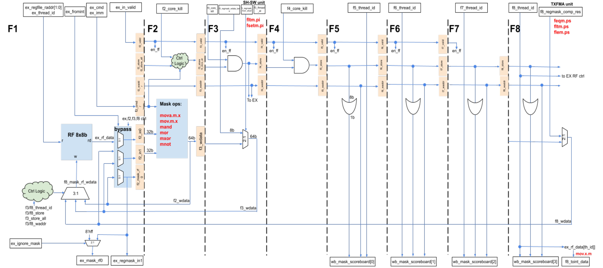


_Figure 21_ 

###### **Supported instructions:** 

|**Instruction**|**Assembly**|**Description**|
|---|---|---|
|||**ET ISA extension**<br>**MASK**|
|**MASKAND**|maskand md, ms1, ms2|AND mask register ms1 with ms2 and puts the result in mask register md|
|**MASKOR**|maskor md, ms1, ms2|OR mask register ms1 with ms2 and puts the result in mask register md|
|**MASKXOR**|maskxor md, ms1, ms2|XOR mask register ms1 with ms2 and puts the result in mask register md|
|**MASKNOT**|masknot md, ms1|NOT mask register ms1 and puts the result in mask register md|
|**MOVA.X.M**|mova.x.m xd|Concatenates the contents of all 8 mask registers and writes them into<br>integer destination register xd|
|**MOVA.M.X**|mova.m.x xd|Writes all mask registers at once using the contents of the source x-reg|
|**MOV.M.X**|mov.m.x md, xs, imm8|Writes a single mask register with the value of an integer register and an<br>immediate|
|**MASKPOPC**|maskpopc xd, ms|Performs a population count of the number of ‘true’ (1) values in the mask and<br>writes the result into a destination xreg|
|**MASKPOPCZ**|maskpopcz xd, ms|Performs a population count of the number of ‘false’ (0) values in the mask<br>and writes the result into a destination xreg|
|**MASKPOPC.RAST**|maskpopc.rast xd, ms1, ms2,<br>imm4|Performs a population count of the number of ‘true’ (1) values in the two source<br>masks after applying a mask defined by the 4-bit immediate and writes the<br>result into a destination xreg|
|**FSETM.PI**<br>**(mask destination)**|fsetm.pi md, fs1|Sets the corresponding destination mask register bit if the source is non-zero|


_Table 16_ 

#### 2.3.6 Machine Learning Units 

The VPU Tensor operations are designed to efficiently multiply small matrices using as little power as possible and, hence, approaching the power-efficiency of custom logic as much as possible. Small matrix multiplication is the basic building block for the Tensor matrix multiplication and the Tensor convolution operations performed by inference. 

There are three dedicated control units for each of the supported ML operations: the TensorFMA, TensorQuant, and TensorReduce/Store. These units manage the injection of u-instruction sequences through the VPU pipeline to conform the configured Tensor extension operations. 

An ML top level instantiates the three control units and implements some logic to multiplex the control of a unit over the VPU ctrl datapath or the SCP memory interface. 

Note that different Tensor units can be configured simultaneously without stalling the core pipeline. There is some synchronization logic between the units so that they will sequentially wait for other (previous) TensorOps to finish before starting to execute a new operation. TFMA-IMA8 ops that write into the TENC RF can run simultaneously with TensorQuant or TensorStore/Reduce. 

The following list includes only the ET ISA Tensor extension instructions that impact the VPU (i.e. those that are input into the VPU as operations and decoded in the VPU control unit): 

|**VPU Op**|**Assembly**|**Description**|
|---|---|---|
|||**ET ISA extension**|
|||**TENSOR**|
|**TensorFMA16A32**|CSRRW  xd, tensor_fma, xs|Multiplies two FP16 matrices (A and B) and<br>accumulates the result into the FP32 C matrix. A matrix<br>is stored in consecutive lines of the scratchpad starting<br>at line xs[19:12]. B matrix is also stored in consecutive<br>lines of the scratchpad starting at line xs[11:4]. The<br>resulting C matrix is stored in N floating-point registers<br>(f0 through fN-1), where N=(xs[54:52]+1)*(xs[51:48]+1).<br>PF32 is the result of the internal accumulations<br>performed during the multiplication process.|
|**TensorIMA8A32**|CSRRW  xd, tensor_fma, xs|Multiplies two FP16 matrices (A and B) and<br>accumulates them into FP32. A matrix is stored in<br>consecutive lines of the scratchpad starting at line<br>xs[19:12]. B matrix is also stored in consecutive lines of<br>the scratchpad starting at line xs[11:4]. The resulting C<br>matrix is stored in N floating-point registers (f0 through<br>fN-1), where N=(xs[54:52]+1)*(xs[51:48]+1). The<br>internal accumulations performed during the<br>multiplication process become INT32.|
|**TensorFMA32**|CSRRW  xd, tensor_fma, xs|Multiplies two FP32 matrices (A and B) and<br>accumulates the result into the FP32 C matrix. A matrix<br>is stored in consecutive lines of the scratchpad starting<br>at line xs[19:12]. B matrix is also stored in consecutive<br>lines of the scratchpad starting at line xs[11:4]. The<br>resulting C matrix is stored in N floating-point registers<br>(f0 through fN-1), where N=(xs[54:52]+1)*(xs[51:48]+1).<br>The internal accumulations performed during the<br>multiplication process become FP32.|
|**TensorQuant**|CSRRW  xd, 0x806, xs|The TensorQuant pseudo-instruction performs a<br>sequence of up to 10 transformations to A matrix. Each<br>transformation is executed sequentially, starting with the<br>transformation located in position 0 of the list (xs[3:0])<br>up to position 9 (xs[39:36]). Each transformation writes<br>its result into A. If a transformation has the encoding 0<br>(LAST), no more transformations will be executed.|
|**TensorStore**|CSRRW  xd, tensor_store, xs|The TensorStore pseudo-instruction writes A matrix to<br>memory. A C matrixan have up to 16 rows, and each<br>row can be up to 64B in size (the number of columns<br>depends on the type of elements that A has).|
|**TensorReduce send**|CSRRW xd, tensor_reduce, xs|The TensorSend pseudo-instruction sends the values<br>held in a number of floating-point registers from the<br>issuing hart to hart 0 of the Minion specified at xs[15:3].|
|**TensorReduce**<br>**receive**|CSRRW xd, tensor_reduce, xs|The TensorRecv pseudo-instruction performs a function<br>C=f(A,B) to all the elements of a set of floating-point<br>registers. The function to be performed is specified at<br>xs[27:24].|


_Table 16_ 

##### 2.3.6.1 TensorFMA Operation 

Tensor matrix multiplication, also referred to as TensorFMA instructions, perform a matrix multiplication on two Tensors (A and B), accumulates the resulting Tensor to a third tensor (Tensor C), and writes the result of the addition back to C, overwriting the original Tensor values. 

For the TensorFMA16A32 instruction, Tensors A and B have two Float16 elements, while Tensor C and the resulting Tensor elements have Float32 elements. 

For the TensorIMA8A32 instruction, Tensors A and B have four 8-bit (unsigned) integer elements, while Tensor C and the resulting Tensor elements have 32-bit (unsigned) integer elements. 

For matrices A, B, and C (of dimensions MxK, KxN, and MxN respectively) with M≤16, N≤16, and 

K≤64/T, where T is the size in bytes of the A and B elements, the operation iterates over all the elements as follows: 

```
for (k = 0; k < K; ++k)
    for (m = 0; m < M; ++m)
        for (n = 0; n < N; ++n)
            C[m][n] += A[m][k] * B[k][n];
```


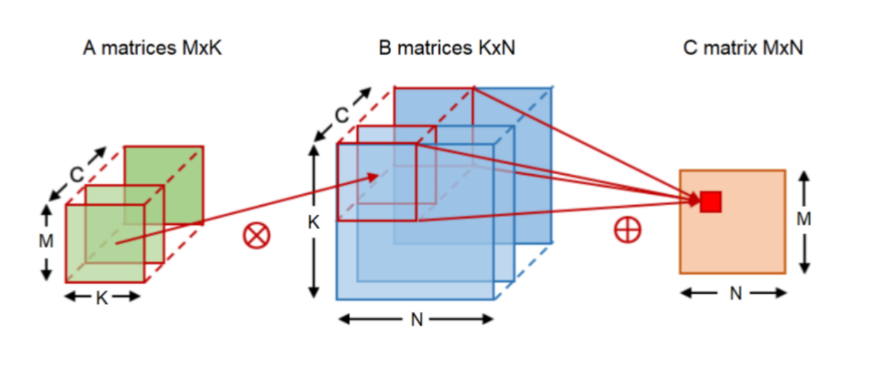


_Figure 22_ 

The KMN ordering **maximizes data reuse and minimizes memory accesses** . In the above code, C0[m][n] can be either C[i][j] or 0. This option allows the instructions that would otherwise be necessary to clear the destination registers to be eliminated before starting the matrix multiplication in the case that we calculate C=A×B. 

Below is the sequence of operations of a Tensor matrix-multiply-acc of two 4x4 matrices: 


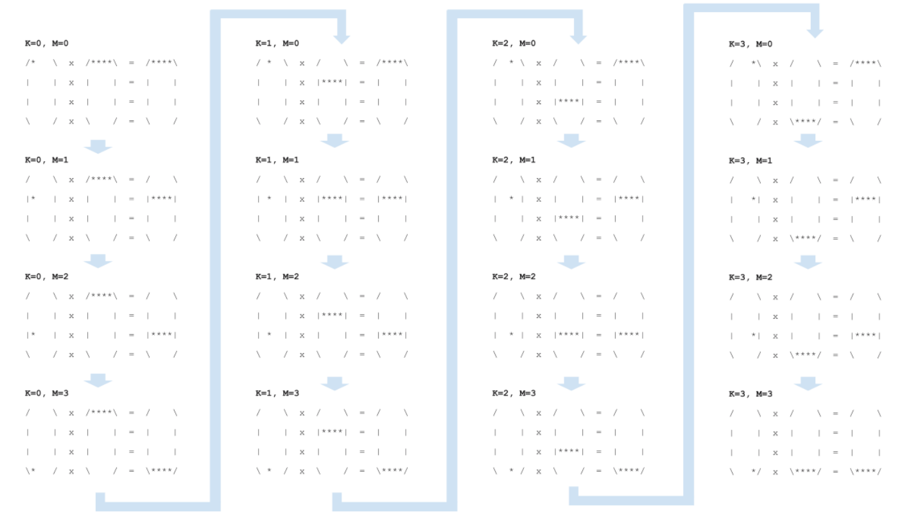


_Figure 23_ 

There are some important limitations to take into account about this operation: 

1. Tensor matrix multiplication instructions require the parameter N (i.e., the number of columns in B and C) to be a multiple of 16 bytes. Software must make sure that matrices are padded with 0s in the memory so that each row occupies a multiple of 16B. 

2. The TENC RF is only accessible by the TensorIMA8A32 instruction (for holding the original and optional final C matrix values). It is not available to the TensorFMA32 or the TensorFMA16A32 instructions. 

3. Matrix multiplication requires the Single Instruction Multiple Data (SIMD) extension, since the C matrix values are held in the vector registers. Moreover, the SIMD extension must implement at least 256-bit vector registers to be able to hold at least one Tensor. 

The intpipe, DCache and the VPU are the Minion components involved in a Tensor FMA operation. The following picture shows the Minion sub-blocks involved in a Tensor operation and how they interface: 


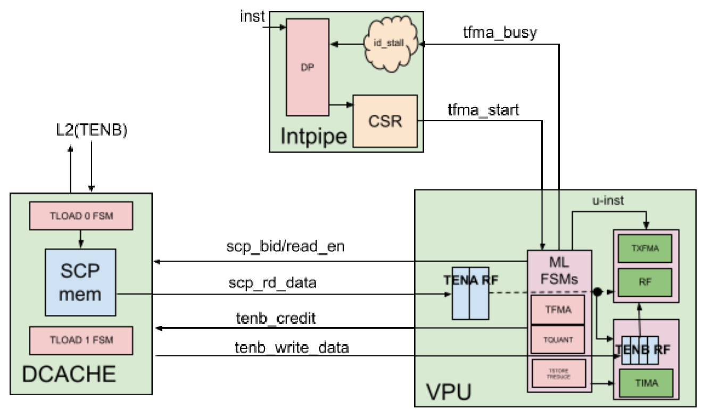


_Figure 24_ 

The intpipe core generates the tfma_start signal to the VPU at the F4 (WB) stage when the CSR tensor_fma is written. The VPU starts the operation by producing memory reads to the DCache SCP memory to fetch required computational data and stores them internally in the TENA/B buffers. Note that you can configure B matrix to be located at L1 or L2. For L2, the DCache will be responsible for bringing the data into the VPU by means of the previously configured TensorLoadSetupB operation. A credit-based mechanism is implemented between the VPU and the DCache to prevent the TENB buffer from overflowing. Finally the VPU reads the buffers and passes the data to the functional units to compute the FMA operations. While the VPU is executing the operation, it notifies the core that it is busy. This could be used to stall younger VPU instructions coming to the core. 

The Tensor FMA unit implements two different control units: 

1. DCache request control 

2. FMA execution control 

Both units run in parallel and in sync, whereas the DCache request control feeds the FMA execution control. 

**DCache request control unit:** 


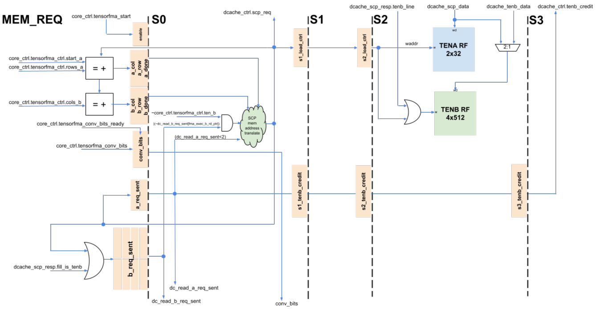


_Figure 25_ 

When the VPU is configured to start a new TensorFMA operation, the DCache request control unit generates the required read commands straight to the SCP LRAM arrays in the DCache to bring the configured A/(B) matrices. Notice that all the matrix data are expected to have already been prefetched to the L1 SCP at the start of the operation. 

The SCP replay comes two cycles after the request (S2) and the data is stored in the internal VPU buffers TENA RF (32b x 2 entries) and TENB RF (512b x 4 entries). 

If the operation is configured with B matrix located in L2, then the control does not produce any SCP read requests. Instead, the DCache will be in charge of bringing the data from L2 straight to the VPU TENB RFs. The TENB buffer is prevented from overflowing by means of a credit-based mechanism. Each time the TensorLoad FSM requests one memory line, it consumes one credit, and each time the VPU consumes the entry in the buffer, the credit is returned. To improve performance, even if there are only four entries, the TensorLoad state machine can use up to 6 credits to advance the request of memory lines. 

The TensorLoadSetupB is forward-paired with the first TensorFMA that follows the TensorLoadSetupB pseudo-instruction even if the said TensorFMA instruction specifies that B is located in the L1 SCP. 

The datapath implements some logic to synchronize the DCache request control producing the memory entries with the FMA execution control unit consuming them. 

If B is located in L2, then the DCache TensorLoad FSM produces the B memory entries. This means that as soon as TensorLoadSetupB pushes data from B matrix into the VPU buffer, execution of the FMA can be started. 

###### **FMA execution control Unit:** 


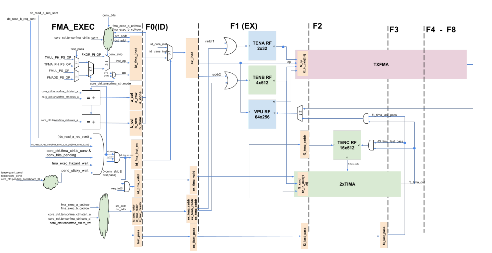


_Figure 26_ 

The FMA execution unit manages the sequencing of u-instructions/u-operations to conform the TensorFMA operations. 

In the IMA8 format, the unit has direct control of the TIMA lane interfaces and thus bypasses the VPU control pipeline. Detaching the TIMA lanes from the VPU control allows for the parallelization of execution between the TensorIMA8 (TENC) and the TensorQuant or TensorStore/Reduce. 

In the FP16/FP32 formats, the unit injects u-instructions through the VPU pipeline and the FP computations are executed by the TXFMA. 

Before starting any operation, the control has to wait for pending sticky (previous) Tensor operations from other units. However, IMA8 ops that don't write to the VRF do not have to wait since they don't have dependencies with other Tensor operations. 

When the control issues a new FMA sequence, it moves the A/B col/row pointers. First it goes to the next B column block (for INT8, it does all B columns at once), then it moves to the next A row and then the next A column. Based on the current pointer position, it generates the instruction only if the A and B entries are available, otherwise it stalls the FMA execution. The operation finishes when the pointers last into the configured number of A columns, A rows, and B columns. 

The operation can be configured to use the Tensor mask bits to skip operations in the A row granularity. Before starting any TFMA operation, the control waits for a Tensor mask valid signal from the core. 

During the first sequence of a first pass configuration, the unit executes FMUL operations to implement the first accumulation and initialize the TENC/VRF. However, when the Tensor mask bits indicate for a row to be skipped during the first pass, then the unit initializes the TENC/VRF with a ‘0’ using FXOR.PI instructions. 

By default, the IMA8 format uses the TENC buffers to store temporal IMA8A32 results. After the last pass configuration is set, the results of the last A column go into the VRF. 

In order to save power, the VPU control implements some logic to conditionally compute the operations based on the values of the A/B matrices. This is done to gate the functional units when we know the result of the FMA multiplication is going to be zero because any/some of the input operands are zeros. 

While the Tensor operation is ongoing, it will send a busy signal to the intpipe that might stall younger VPU instructions from any thread. 

##### 2.3.6.2 TensorQuant Operation 

The TensorQuant operation performs a sequence of up to 10 transformations to an A matrix. Each transformation is executed sequentially, starting with the transformation located in position 0 of the list up to position 9. Each transformation writes its result into A. If a transformation has the encoding 0 (LAST), no more transformations will be executed. 

A matrix is stored in consecutive FP registers starting from the register number specified at xs[61:57] and wrapping around to f0 when f31 is reached. 

The operation iterates over all transformations and elements as follows: 

```
fstart = xs[61:57];
cols   = (xs[56:55] + 1) * 4;
rows   = xs[54:51] + 1;
line   = xs[50:45]%48;
for (k = 0; k < 10; k++) {
    trans = xs[4*k+3:4*k];
    for (i = 0; i < rows; i++) {
      for (j = 0; j < cols; j++) {
        reg = (fstart + i*2 + j/ 8) % 32;
          f[reg].e<j%8> = trans(f[reg].e<j%8>, L1Scp[line].e[j], rdyn);
      }
    }
}
```

There are currently 11 transformation functions (including LAST), which are encoded as follows: 

|**Value**|**Name**|**Description**|
|---|---|---|
|0|LAST|Do not perform any more transformations|
|1|INT32_TO_FP32|Convert all elements of A from INT32 to FP32|
|2|FP32_TO_INT32|Convert all elements of A from FP32 to INT32|
|3|RELU|Convert all negative INT32 values in A to 0|
|4|INT32_ADD_ROW|Read a vector of sixteen INT32 values from the L1 scratchpad<br>and add the first N elements to every row of the INT32 A<br>matrix, where N is the number of columns of A.|
|5|INT32_ADD_COL|Read a vector of sixteen INT32 values from the L1 scratchpad<br>and add the first N elements to every column of the INT32 A<br>matrix, where N is the number of rows of A.|
|6|FP32_MUL_ROW|Read a vector of sixteen FP32 values from the L1 scratchpad<br>and multiply the first N elements with every row of the FP32 A<br>matrix, where N is the number of columns of A.|
|7|FP32_MUL_COL|Read a vector of sixteen FP32 values from the L1 scratchpad<br>and multiply the first N elements with every column of the FP32<br>A matrix, where N is the number of rows of A.|
|8|SATINT8|Clamp all elements of A from INT32 to the range [-128, 127].<br>The values are stored in the low-order byte of each element.|
|9|SATUINT8|Clamp all elements of A from INT32 to the range [0, 255]. The<br>values are stored in the low-order byte of each element.|
|10|PACK_128B|Move the low-order byte of the n-th 32-bit element of every row<br>of A into the n-th byte of the row.|


_Table 17_ 

Some transformations read a vector of values from the L1 SCP. The first such transformation reads the L1 SCP line specified in the configuration, and each successive such transformation reads the next line in the L1 SCP (wrapping around to line 0 when the last line is reached). 

The TQuant control unit implements a single control logic that produces requests to SCP memory and executes operations in the functional units. 

###### **TQuant control:** 


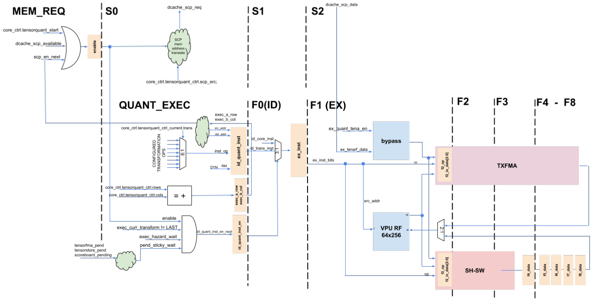


_Figure 27_ 

When the VPU is configured to start a new TensorQuant operation, the TQuant control unit generates the required read commands straight to the SCP LRAM arrays in the DCache to bring the configured A matrix. Note that A matrix data is expected to have already been prefetched to the L1 SCP at the start of the operation. To simplify the design, the control always performs a pre-fetch of SCP data first, even if there are no configured transformations that require it. 

Before starting any operation, the control has to wait for pending sticky (previous) Tensor operations from other units. Given that the IMA8-TENC and the TensorQuant can run in parallel, they can collide when accessing the SCP. The TFMA is therefore given a higher priority over the TQuant to access the SCP interface, so the control needs to check for a free slot before doing a SCP read request. 

The unit injects u-instructions through the VPU pipeline and the transformation computations are executed by the TXFMA or the SH-SW units and finally stored in the VRF. Small row configurations require that some bubble cycles be introduced between transformations to solve data dependencies between the input and output operands, meaning the configured number of rows is smaller than the number of SH-SW pipeline stages (2) or TXFMA pipeline stages (7). 

When the control issues a new instruction sequence, it moves the A col/row pointers first to the next A column block, then to the next A row. Even registers are done first and then odd registers to keep the matrix data more regular (i.e. pack to 128b operation requires this order). The operation finishes when the pointers last into the configured number of A columns and A rows. 

While the Tensor operation is ongoing, it will send a busy signal to the intpipe that might stall younger VPU instructions from any thread. 

##### 2.3.6.3 TensorStore Operation 

The TensorStore operation writes the A matrix stored in the VPU RFs to memory. A C matrixan have up to 16 rows, and each row can be up to 64B in size (the number of columns depends on the type of elements that A has). Although A matrix is stored in row-major order, it does not need to be consecutive, as configured in the register stride. 

Given that the TensorStore and the TensorReduce send operations are very similar, a single control unit has been implemented to manage both. 


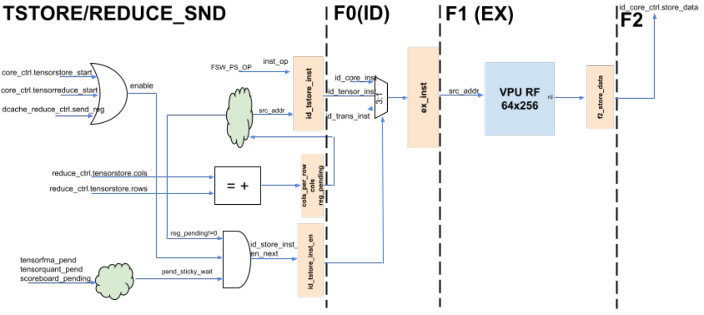


_Figure 28_ 

When the VPU is configured to start a new TensorStore operation, the control waits for several DCache data requests for all the configured elements. When a DCache request is received, the control unit injects a store instruction into the VPU pipeline, which produces a read from the VRF element and the data is shipped to the core in F2. 

Before starting any operation, the control has to wait for pending sticky (previous) Tensor operations from other units. 

When the control issues a new instruction sequence, it moves the A col/row pointers first to the next A column block, then to the next A row. The operation finishes when the pointers last into the configured number of A columns and A rows. 

While the Tensor operation is ongoing, it will send a busy signal to the intpipe that might stall younger VPU instructions from any thread. 

##### 2.3.6.4 TensorReduce Operations 

This operation reduces the contents of the VRF between two Minions. The instruction can specify the starting VRF entry, the number of VRF entries, the reduction operation (float/int, 

add/sub/max/min, etc.), and the pairing Minion. One Minion behaves as the sender and another as the receiver. Once the receiver Minion receives the reduce instruction, it sends a message to the sender Minion saying that it is ready to accept packets. Once the sender Minion sees this, it will start sending the contents of the requested VRF lines. Once the receiver gets the contents, it will write it to the buffer array, and then ship it to the VPU, which will do the reduce op and write the final results to the VRF. 

###### 2.3.6.4.1 TensorReduce Send 

From the VPU’s point of view, the TensorReduce send operation is similar to a TensorStore, where the VPU passes VRF elements to the DCache. The only differences are some fields of configurability, but essentially they are more or less equal. 

As mentioned previously in the TensorStore Operation section, the control datapath is unique and shares almost the same control logic to manage this operation. 

###### 2.3.6.4.2 TensorReduce Receive 


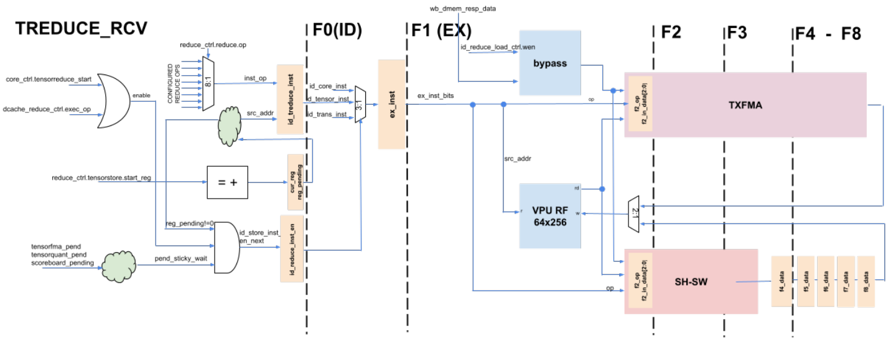


_Figure 29_ 

When the VPU is configured to start a new TensorReduce operation, the control waits for the DCache to send the VRF data contents from the Minion sender for all the configured elements. 

After the VPU receives the dcache_ctrl.exec_op signal from the DCache: 

- Two cycles later the DCache sends the Minion sender contents. The data goes directly to the bypass network that will force the input of the functional units. 

- The control unit injects u-instructions through the VPU pipeline, and the reduce operations are executed by the TXFMA or the SH-SW units. Finally, the result goes to the VRF. 

When the control issues a new instruction sequence, it moves the next row element. The operation finishes when the pointer last into the configured number of rows. 

The VPU can also be commanded to do nothing by means of the dcache_ctrl.nothing. This will reset to finish the operation and reset the row pointer. 

Before starting any operation, the control has to wait for pending sticky (previous) Tensor operations from other units. 

While the Tensor operation is ongoing, it will send a busy signal to the intpipe that could stall younger VPU instructions from any thread. 

#### 2.3.7 Transcendental Unit 

The transcendental (trans) instructions are implemented with a sequence of u-instructions. There is a transl sequencer (FSM) that manages the injection through the VPU pipeline to conform the operations. 

All the computation implementations are based on a quadratic approximation of the form: 


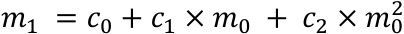


Where m0 is the mantissa of the input, and m1 is the mantissa of the output. 

The sequencer uses the TXFMA unit to implement the required FP32 to fixed point converts, FP32 FMAs, or FP32 multiplication. The TXFMA also handles exponent adjustments that are specifically required for each trans operation. 

The SH-SW unit is used as a support for transporting control/data information through the pipeline stages during u-sequencing. 

The module trans top, instanced on each lane, contains the C0/C1/C2 coefficients stored in different ROMs (RTL LUTs). Those coefficients are read at the beginning of each FMA u-instruction. The LSBs of the input FP32 mantissa are used to generate the address and ROM data contents. 

###### **Supported instructions:** 

|**Instruction**|**Assembly**|**Description**|
|---|---|---|
|||**ET ISA extension**|
|**FEXP.PS**|fexp.ps fd, fs1|Performs an exp() on a float32 component|
|**FLOG.PS**|flog.ps fd, fs1|Performs a log2() on a float32 component|
|**FRCP.PS**|frcp.ps fd, fs1|Performs the reciprocal on the four int32 components|


_Table 18_ 

##### 2.3.7.1 Trans Sequencer 

The trans sequencer (FSM) manages the injection of the required u-instructions (sequences) though the VPU pipeline to conform the 32-bit FP trans vector operations. The number of control stages (S0-S6) is aligned with the 7-stage length of the TXFMA datapath. 


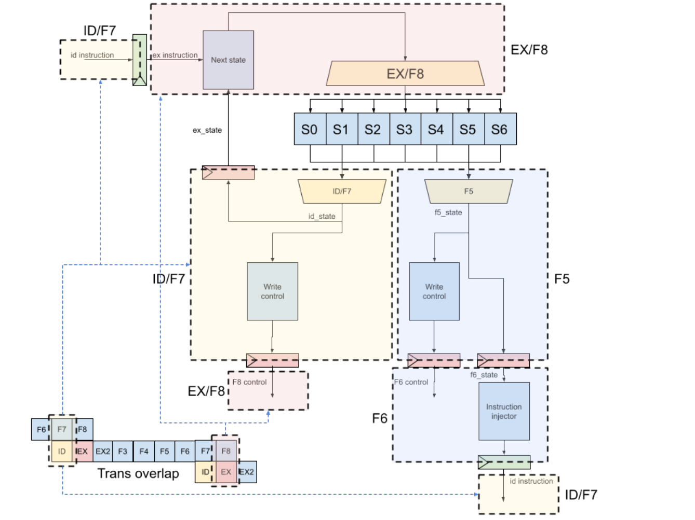


_Figure 30_ 

##### 2.3.7.2 FRCP 

Definition: 


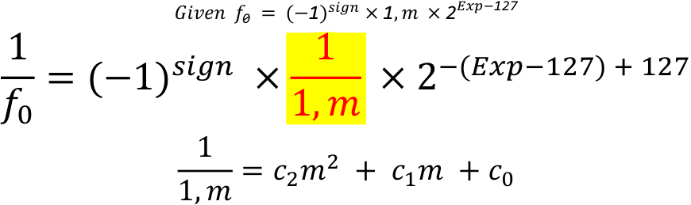


###### Pseudo-code: 

#define x { in[15:0], 8'b0 } frcp(in){ c2 = { load(in[22:16])[50:41], 22'b0} c1 = { 1'b1, load(in[22:16])[40:25], 15'b0} fma1 = c2*x + c1 

c0 = { 1'h1, load(in[22:16])[24:0], 6'b0} fma2 = fma1*x + c0 exp = (254 - in[30:23] - (in[22:0] != 0)) return {in[31], exp, fma2[47:25]} } 

Special cases: 

- Zero and Denormals ⇒ Infinity 

- Infinity ⇒ Zero 

- Greater than 2<sup>126</sup> ⇒ Zero 

- NaN ⇒ NaN 

Implementation: 


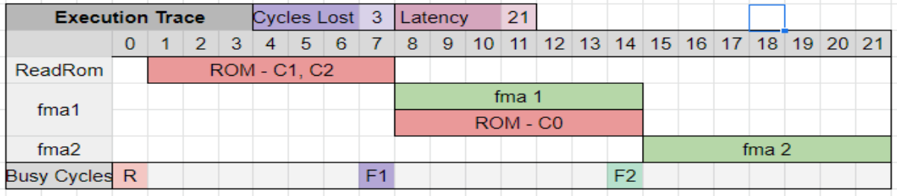


_Figure 31_ 

MicroOps: 

1. ReadRom: Reads the two first coefficients 

2. Fma1: Reads the last coefficient while it performs the first product + accumulation 

3. Fma2: Performs the second product + accumulation and generates an FP32 number 

The following picture defines the bit alignment of the TXFMA input operands. The bits need to be properly aligned to produce a result inside the datapath with the required number of precision bits: 


_Figure 32_ 

##### 2.3.7.3 FLOG 

Definition: 


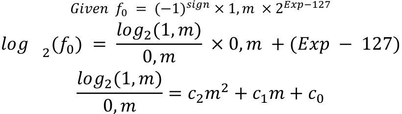


###### Pseudo-code: 

#define x in[15:0] flog2(in){ c2 = { load({~in[22], in[21:16]})[51:42], 21'b0 } c1 = { load({ 1'b1, ~in[22], in[21:16]})[41:26], 15'b0 } c0 = { load({ 1'b0, ~in[22], in[21:16]})[25:0], 5'b0 } fma1 = c2*x + (-c1) fma2 = (fma1*x + c0) integer_part = int2float(in[30:23] - 127) floatFma = 1.fma2 * 0.in[22:0] + integer_part Return floatFma } 

Special cases: 

- Negative (not 0) ⇒ NaN 

- NaN ⇒ NaN 

- +Infinity ⇒ +Infinity 

- 0 ⇒ -Infinity 

- 1 ⇒ 0 (must be enforced) 

###### Implementation: 


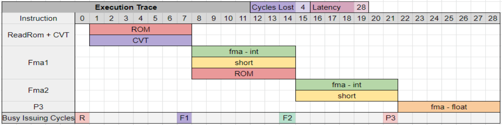


_Figure 33_ 

###### MicroOps: 

1. ReadRom + CVT: Fetches the first two coefficients of the approximation and performs a convert to generate 0,m for the final product (since this is the only slot where TXFMA is not used). 

2. Fma1: Performs the first multiply + accumulate, fetches the third coefficient, and bypasses the result of the convert through the short unit in order to save it for the final product. 

3. Fma2: Performs the second multiply + accumulate and bypasses the result of the CVT again. 

4. Multiplies the result of the second fma and the convert and generates an FP32 output. 

###### FMA structures: 


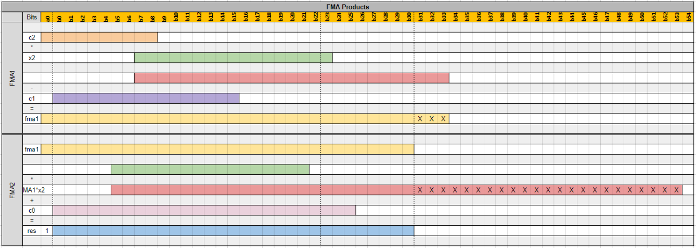


_Figure 34_ 

##### 2.3.7.4 FEXP 

Definition: 

𝐺𝑖𝑣𝑒𝑛  𝑓" = (−1)<sup>$%&'</sup> × 1, 𝑚 × 2<sup>()*+!#,</sup> = (−1)<sup>$%&'</sup> × 𝐼, 𝐹 2<sup>$-</sup> = 2<sup>%</sup> × 2<sup>('")./01)</sup> 2<sup>!</sup> = 𝑐"𝑚<sup>"</sup> + 𝑐#𝑚+ 𝑐$ 

###### Pseudo-code: 

fexp2(in){ in_integer = (in[22:0] >> (23 - (in[30:23] - 0x7f)) + (1 << (in[30:23] - 0x7f)); in_shifted = ({1, in[22:0]}) << (in[30:23] - 0x7d) in_rev = (in[31])? (~(in_shifted[23:1] + in_sifted[0]) +1) : (in_shifted[23:1] + in_shifted[0]) //Detect edge cases 

c2, c1, c0 = shift(load(in_rev[23:18]), 0, 19, 19) fma1 = c2*in_rev[17:0] + c1 + (1 << 14) fma2 = fma1[37:15]*in_rev[17:0] + c0 if(edge_case) //treat special case return {0, (sign)? (0x7f - in_integer - or_mantissa) : (0x7f + in_integer), fma2[45:22] + fma2[21] } } 

Special cases: 

- >= 128 ⇒ +Infinity 

- < -126 ⇒ zero 

- NaN ⇒ NaN 

Implementation: 


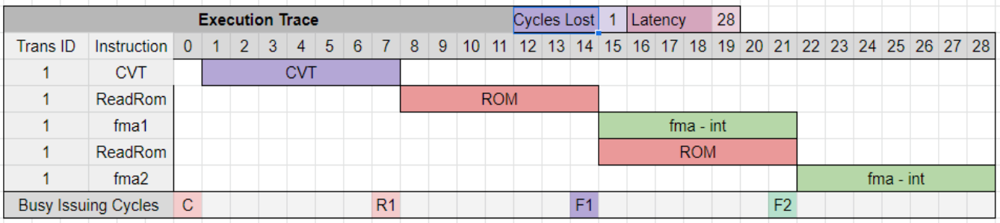


_Figure 35_ 

MicroOps: 

1. CVT: Takes a float32 input and converts it to a fixed point 8.24 signed integer and stores it in the destination register indicated in the fexp.ps instruction. 

2. ReadRom: Executed on the trans_top unit. Fetches the coefficients for the first FMA using the result of the convert. 

3. Fma1 + ReadRom: Executed on trans_top and TXFMA at the same time. Performs the computation of the first FMA and fetches the coefficients for the second FMA, using the result of the convert. 

4. Fma2: Executed on TXFMA. Computes the second FMA and generates a float32 output, using the result of the convert. 

##### 2.3.7.5 FRCP_FIX.RAST (EXPERIMENTAL) 

Performs one iteration of newton raphson for a reciprocal (RCP), given the original operand and the first approximation. 

s: Input to the whole operation, from which we want the reciprocal; in the format Fxp 15.16 rn: Approximation of the reciprocal of s; in the format Fxp 17.14 

rn+1: Improved approximation of the reciprocal; in the format Fxp 17.14 

𝑟'2! = 2𝑟' −𝑠𝑟'<sup>#</sup> 


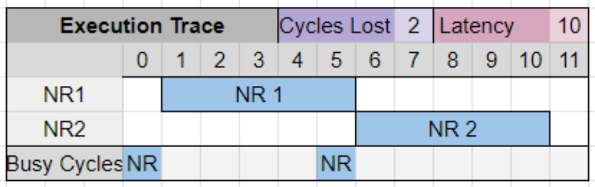


_Figure 36_ 

MicroOps: 

1. First product: 𝑎 = 𝑠𝑟'. The result is a number close to one, the output is returned in the shape of a fixed point 1.31 

2. Second product: 𝑟'2! = 2𝑟' −𝑎∗𝑟' 

Note: this instruction is experimental and has not been fully verified. 

#### 2.3.8 FP Rounding Operations 

The VPU conforms to the FP rounding operations defined in the RISC-V specification, which in turn conforms to the IEEE 754-2008 specification for FP arithmetic. The description included here for the reader’s convenience is taken from the RISC-V spec. 

FP operations use either a static RM encoded in the instruction rounding-mode (rm) field, or a dynamic RM programmed into the FP Control and Status Register (FCSR) Rounding Mode (frm) field. RMs are encoded as shown in the following table: 

|||**VPU Rounding Modes**|
|---|---|---|
|**Rounding mode**<br>**FCSR.frm**|**Mnemonic**|**Meaning**|
|000|RNE|Round to nearest, ties to even|
|001|RTZ|Round towards zero|
|010|RDN|Round down (towards −∞)|
|011|RUP|Round up (towards +∞)|
|100|RMM|Round to nearest, ties to max magnitude|


|101|Invalid. Reserved for future use.|
|---|---|
|110|Invalid. Reserved for future use.|
|111|In the instruction’s rm field, selects dynamic RM; in the<br>RM register, it is invalid.|


_Table 19_ 

A value of `111 in the instruction’s rm field selects the dynamic RM held in FCSR.frm. Any other value in the instruction’s rm field either selects the above defined RM or causes an invalid operation in the case where the RM is set to ‘101 or ‘110. 

If FSCR.frm is set to an invalid value (101–111), any subsequent attempt to execute a FP operation with a dynamic RM will cause an illegal instruction operation. 

Example: 

fadd.ps fd, fs1, fs2 --> no RM is specified; 3'b111 is set by default in the instruction field fadd.ps fd, fs1, fs2 rne --> round-to-nearest, ties to even (RNE) is specified; a 3'b000 is set at the instruction fields 

##### 2.3.8.1 Rounding Tables 

From a microarchitectural design standpoint, it’s important to take into account that the VPU/TXFMA rounding logic serves a dual purpose. 

In order to optimize the TXFMA datapath, subtract operations are implemented by negating one of the operands (taking the 2’s complement) and adding it to the other operand. This is a common practice. However, in order to meet timing within the adder’s pipeline stage, the operand is only inverted (taking the 1’s complement). In order to complete the negation, it is necessary to add a ‘1bit into the LSB at some point in the pipeline. In the TXFMA, this is accomplished through rounding logic. 

Since the rounding equations are complicated by this overloading of the rounding logic, the tables for all but Round-to-Zero (RTZ) are included here to assist the reader’s understanding. 

In the case of RTZ (which is commonly referred to as _truncate_ ), there is no rounding necessary. Instead, it is simply a matter of setting the Round L-Bit whenever the negate increment signal is asserted. 

###### **Round-to-Nearest, Ties to Even (RNE) Rounding Mode**

|**L-Bit**|**R-Bit**|**Sticky**<br>**Bit**|**Negate**<br>**Increment**|**Round**<br>**L-Bit**|**Round**<br>**R-Bit**|**Operation**|
|---|---|---|---|---|---|---|
|0|0|0|0|0|0|No Change|
|0|0|0|1|0|1|No round, but negate increment|
|0|0|1|0|0|0|Less than halfway; no round|
|0|0|1|1|0|0|Less than halfway, no round and no negate because it’s sticky,<br>indicating that negate increment should occur to the right of the<br>L-Bit|
|0|1|0|0|0|1|Halfway even, no round (but do so anyway to simplify, then set<br>ftz to clear later)|
|0|1|0|1|1|0|Halfway even, no round but negate|
|0|1|1|0|0|1|More than halfway, round|
|0|1|1|1|0|1|More than halfway, round and no negate because it’s sticky|
|1|0|0|0|0|0|No change|
|1|0|0|1|1|0|No round, but negate|
|1|0|1|0|0|0|Less than halfway, no round|
|1|0|1|1|0|0|Less than halfway, no round or negate because it’s sticky|
|1|1|0|0|0|1|Halfway odd, round|
|1|1|0|1|0|1|Halfway odd, negate increment but no round because L<br>changes to 0 during compliment|
|1|1|1|0|0|1|More than halfway, round|
|1|1|1|1|0|1|More than halfway, round but no negate because it’s sticky|


_Table 20_ 


###### **Round-to-Nearest, Ties to Infinity (RMM) Rounding Mode** 

|**L-Bit**|**R-Bit**|**Sticky**<br>**bit**|**Negate**<br>**Increment**|**Round**<br>**L-Bit**|**Round**<br>**R-Bit**|**Operation**|
|---|---|---|---|---|---|---|
|0|0|0|0|0|0|No change|
|0|0|0|1|0|1|No round, but negate increment|
|0|0|1|0|0|0|Less than halfway, no round|
|0|0|1|1|0|0|Less than halfway, no round and no negate because it’s sticky,<br>indicating neg increment should occur to the right of the L-Bit|
|0|1|0|0|0|1|Halfway even, round|
|0|1|0|1|1|0|Halfway even, round and negate (adding 2-bits in R)|
|0|1|1|0|0|1|More than halfway, round|
|0|1|1|1|0|1|More than halfway, round but no negate because it’s sticky|
|1|0|0|0|0|0|No change|
|1|0|0|1|1|0|No round, but negate|
|1|0|1|0|0|0|Less than halfway, no round|
|1|0|1|1|0|0|Less than halfway, no round or negate because it’s sticky|
|1|1|0|0|0|1|Halfway odd, round|
|1|1|0|1|1|0|Halfway odd, round and negate (adding 2-bits in R)|
|1|1|1|0|0|1|Greater than halfway, round|
|1|1|1|1|0|1|Greater than halfway, round but no negate because it’s sticky|


_Table 21_ 

#### 2.3.9 Scoreboards 

The VPU implements different scoreboards to detect data hazards involving instructions with multicycle latencies that commit the results into integer, FP, and mask RFs. 

The figures in the next sections show how the VPU interfaces with the core for each type of operand and destination (FP, INT, mask, and FP trans). Some details about the nomenclatures used are as follows: 

**st** : VPU pipeline stages 

**valid** : Which scoreboard entries are valid. Each entry contains the destination register that is going to be modified and the corresponding thread ID 

**write** : Data write into the RF 

**bypass_av** : Data is available for bypass at the ID stage (intpipe) and EX stage (VPU) **hazard_prot** : Data hazard detected by intpipe pipeline (ID-WB) 

##### 2.3.9.1 Floating Point Scoreboard 


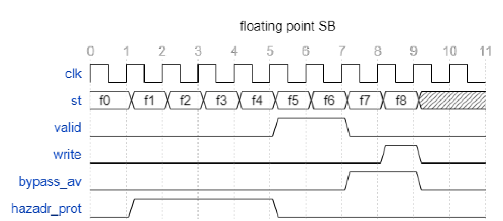


_Figure 37_ 


##### 2.3.9.2 FP2INT Integer Scoreboard 


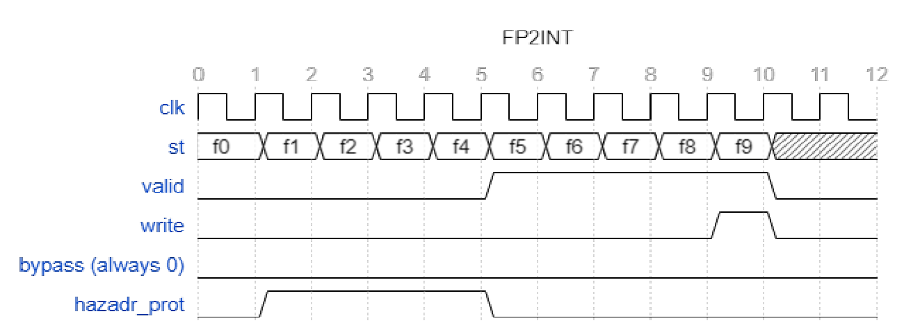


_Figure 38_ 

##### 2.3.9.3 Floating Point Trans Scoreboard 


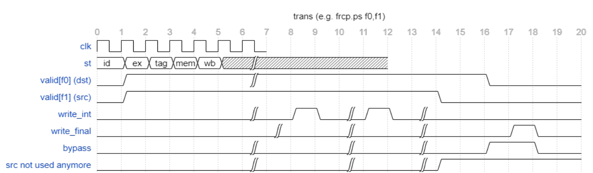


_Figure 39_ 

##### 2.3.9.4 Mask Scoreboard 


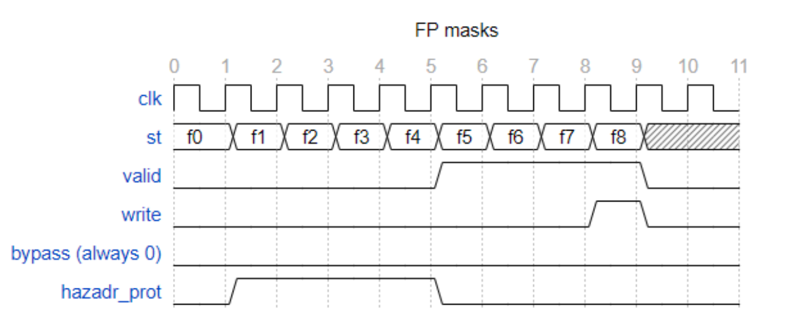


_Figure 40_ 

### 2.4 Clock Gates 

<mark>The VPU implements two levels of clock gates:</mark> 

<mark>1- The first level is expected to be automatically inferred by the synthesis tool. The VPU has been carefully designed so that most of its Flip Flops (FFs) contain a clock enable signal, so it should facilitate the tool inferring clock gate cells. The clock gate signals are produced with fine granularity and target groups of FFs that are active for a specific type of functionality.</mark> 

<mark>2- The second level is manually instantiated in the RTL using the et_clk_gate cell with one et_clk_gate for each functional unit. The clock is enabled while the pipelines are actively executing the operations.</mark> 

<mark>The Minion synthesis for A0 is constrained to infer a maximum of two levels of clock gates</mark> 

A representation of the VPU clock tree is shown below: 

<mark>vpu_top | |>vpu_ctrl |              | |              |>cgate_trans (2nd-level) -->vpu_trans_seq_clock | |>vpu_lane (7:0) |</mark> |> cgate_rf (2nd-level) → rf_clock <mark>| |> cgate_tima (2nd-level) --> tima_clock | |> cgate_trans_rom (2nd-level) --> trans_rom_clock | |> cgate_sh_sw (2nd-level) --> sh_sw_clock | |> cgate_bypass (2nd-level) --> bypass_clock |> cgate_txma (2nd-level) --> txfma_clock</mark> 

### 2.5 Debug 

The following table describes the internal VPU signal map to the different Minion debug monitor buses: match, filter, and data: 

|**SM Bus**|**Mux**<br>**Number**|**Bit Number**|**Signal**|**Module**|**Width**|**Description**|
|---|---|---|---|---|---|---|
|Match|0x0|0|io_events[`VPU_EVENT_T<br>FMA_WAIT_TENB]|vpu_ctrl|1|TFMA wait TENB|
|||1|io_events[`VPU_EVENT_TI<br>MA_OPS]||1|TIMA op|
|||2|io_events[`VPU_EVENT_T<br>XFMA_3216_OP]||1|TXFMA FP32 FP16|
|||3|io_events[`VPU_EVENT_T<br>XFMA_32_OPS]||1|TXFMA FP32|
|||4|io_events[`VPU_EVENT_T<br>XFMA_INT_OPS]||1|TXFMA FP32|
|||5|io_events[`VPU_EVENT_T<br>RANS_OPS]||1|Trans ops|
|||6|io_events[`VPU_EVENT_S<br>HORT_OPS]||1|Short ops|
|||7|io_events[`VPU_EVENT_M<br>ASK_OPS]||1|Mask ops|
|||8|io_events[`VPU_EVENT_T<br>FMA_INST]||1|TensorFMA instruction|
|||9|io_events[`VPU_EVENT_R<br>EDUCE_INST]||1|TensorReduce instruction|
|||10|io_events[`VPU_EVENT_T<br>QUANT_INST]||1|TensorQuant instruction|
|||11|1'b0||1||
|||27:12|f4_regfile_wmask_l||8|RF wen load|
|||35:28|f8_regfile_wmask||8|RF wen func|
|||38:36|id_regfile_ren||3|RF ren|
|||39|f3_tima_tenc_wen||1|TENC RF wen|
|||40|f3_tenb_regfile_wen_l||1|TENB RF wen_l|
|||41|f3_tena_regfile_wen_l||1|TENA RF wen_l|
|||42|id_core_valid||1|ID core valid qual|
|||43|ex_ctrl_valid_qual||1|EX core valid qual|
|||44|f2_ctrl_valid_qual||1|F2 core valid qual|
|||45|f3_ctrl_valid_qual||1|F3 core valid qual|
|||46|f4_ctrl_valid_qual||1|F4 core valid qual|
|||47|f5_ctrl_valid_qual||1|F5 core valid qual|
|||48|f6_ctrl_valid_qual||1|F6 core valid qual|
|||49|f7_ctrl_valid_qual||1|F7 core valid qual|
|||50|f8_ctrl_valid_qual||1|F8 core valid qual|
|||51|ex_core_kill||1|EX core kill|
|||52|f2_core_kill||1|F2 core kill|
|||53|f3_core_kill||1|F3 core kill|
|||54|f4_core_kill||1|F4 core kill|
|||55|ex_core_gscing||1|EX core Gather/Scatter|
|||56|ex_rom_valid||1|ROM valid|
|||57|wb_dmem_resp_val||1|Dmem resp valid|
|||58|f8_fcsr_flags_valid||1|Flags valid generation|
|||59|id_trans_insert_en_next||1|Trans instruct en|
|||60|id_ml_inst_en_next||1||
|||63:61|EMPTY||3||
|**SM bus**|**Mux**<br>**Number**|<br>**Bit Number**|**Signal**|**Module**|**Width**|**Description**|
|||95:64|id_core_inst_bits||32|ID core instruction bits|
|||100:96|ex_regfile_raddr1||5|EX regfile raddr1|
|||105:101|ex_regfile_raddr2||5|EX regfile raddr2|
|||110:106|ex_regfile_raddr3||5|EX regfile raddr3|
|||115:111|f8_regfile_waddr||5|F8 regflie waddr|
|||120:116|f7_regfile_waddr||5|F7 regflie waddr|
|Filter|0x0|125:121|f6_regfile_waddr|vpu_ctrl|5|F6 regflie waddr|
|||130:126|f5_regfile_waddr||5|F5 regflie waddr|
|||135:131|f4_regfile_waddr||5|F4 regflie waddr|
|||140:136|f3_regfile_waddr||5|F3 regflie waddr|
|||145:141|f4_regfile_waddr_l||5|F4 regflie waddr_l|
|||151:146|wb_core_ctrl.fcsr_flags||6|WB FCSR flags|
|||199:152|EMPTY||47||
|**SM bus**|<br>**Mux**<br>**Number**|**Bit Number**|**Signal**|**Module**|**Width**|**Description**|
|Data[0]|0x0|1:0|id_vpu_ctrl.typ|vpu_ctrl|2|ID VPU ctrl typ|


||4:2|id_vpu_ctrl.rm|3|ID VPU ctrl rm|
|---|---|---|---|---|
||24:5|id_vpu_ctrl.imm|20|ID VPU ctrl imm|
||69:25|id_vpu_ctrl.sigs|45|ID VPU ctrl sigs|
||70|id_vpu_ctrl.use_prev_sigs|1|ID VPU ctrl use previous sigs|
||102:71|id_core_inst_bits|32|ID core instruction bits|
||103|id_core_thread_id|1|ID core thread id|
||108:104|ex_regfile_raddr1|5|EX regfile raddr1|
||113:109|ex_regfile_raddr2|5|EX regfile raddr2|
||118:114|ex_regfile_raddr3|5|EX regfile raddr3|
||126:119|ex_mask_rf0|8|EX mask rf[0]|
||127|EMPTY|1||
|Data[1]|0x1<br>0|wb_core_ctrl.mova_mx|1|WB core ctrl mova mx|


||1|wb_core_ctrl.thread_id|1<br>WB core ctrl.fs|
|---|---|---|---|
||2|wb_core_ctrl.fcsr_flags_vali<br>d|1<br>WB core ctrl thread ID|
||8:3|wb_core_ctrl.fcsr_flags|1<br>WB core ctrl FCSR flags valid|
||9|wb_core_ctrl.fma|6<br>WB core ctrlFCSR flags|
||10|wb_core_ctrl.tointm|1<br>WB core ctrl.fma|
||12:11|f3_core_ctrl|1<br>WB core ctrl.tointm|
||13|f2_core_ctrl.tointm|2<br>F3 core ctrl|
||14|f2_core_ctrl.fma|1<br>F2 core ctrl.tointm|
||56:15|ex_core_ctrl|1<br>F2 core ctrl.fma|
||57|id_core_ctrl.id_trans_insert|42<br>EX core ctrl|
||58|id_core_ctrl.trans_busy|1<br>ID core ctrl.trans WB|
||59|1'b0|1<br>ID core ctrl.trans busy|
||60|id_core_ctrl.reduce_enable<br>d|1<br>ID core ctrl.multipass|
||61|id_core_ctrl.tquant_enabled|1<br>ID core ctrl.reduce enabled|
||62|id_core_ctrl.tfma_enabled|1<br>ID core ctrl.tquant enabled|
||63|id_core_ctrl.tfma_wrrf_ena<br>bled|1<br>ID core ctrl.tfma enabled|
||78:64|txfma_trans_dbg|1<br>ID core ctrl.tfma wrrf enabled|
||103:79|trans_state|16<br>TXFMA trans dbg|
||108:104|ex_bypass_force_ctrl|25<br>Trans state|
||127:109|EMPTY|5<br>EX bypass force ctrl|
|Data[2]|0x2<br>97:0|id_core_ctrl.scoreboard.fp_<br>dest|98<br>ID core ctrl.scoreboard FP dest|


|||111:98|id_core_ctrl.scoreboard.fp_<br>valid|14<br>ID core ctrl.scoreboard FP valid|
|---|---|---|---|---|
|||115:112|id_core_ctrl.scoreboard.toin<br>t_valid|4<br>ID core ctrl.scoreboard toint<br>valid|
|||119:116|id_core_ctrl.scoreboard.ma<br>sk_valid|4<br>ID core ctrl.scoreboard mask<br>valid|
|||126:120|dcache_scp_resp|7<br>DCache SCP resp|
|||127|EMPTY|1|
|Data[3]|0x3|24:0|vpu_tensorfma_debug|25<br>VPU TensorFMA debug|


49:25 vpu_tensorreduce_debug 25 VPU TensorReduce debug 

60:50 vpu_tensorquant_debug 11 VPU TensorQuant debug 

f0_core_ctrl.tensorfma_ctrl. F0 core ctrl TensorFMA ctrl first 61 first_pass 1 pass 

f0_core_ctrl.tensorfma_ctrl. F0 core ctrl TensorFMA ctrl 64:62 mode 3 mode 

||70:65|f0_core_ctrl.tensorfma_ctrl.<br>scp_a|6<br>F0 core ctrl TensorFMA ctrl<br>SCP A|
|---|---|---|---|
||76:71|f0_core_ctrl.tensorfma_ctrl.<br>scp_b|6<br>F0 core ctrl TensorFMA ctrl<br>SCP B|
||77|f0_core_ctrl.tensorfma_ctrl.<br>ten_b|1<br>F0 core ctrl TensorFMA ctrl<br>TENB|
||78|f0_core_ctrl.tensorfma_ctrl.<br>u_a|1<br>F0 core ctrl TensorFMA ctrl u A|
||79|f0_core_ctrl.tensorfma_ctrl.<br>u_b|1<br>F0 core ctrl TensorFMA ctrl u B|
||80|f0_core_ctrl.tensorfma_ctrl.<br>to_vrf|1<br>F0 core ctrl TensorFMA ctrl to<br>VRF|
||84:81|f0_core_ctrl.tensorfma_ctrl.<br>start_a|4<br>F0 core ctrl TensorFMA ctrl start<br>A|
||88:85|f0_core_ctrl.tensorfma_ctrl.<br>cols_a|4<br>F0 core ctrl TensorFMA ctrl A<br>columns|
||92:89|f0_core_ctrl.tensorfma_ctrl.<br>rows_a|4<br>F0 core ctrl TensorFMA ctrl A<br>rows|
||94:93|f0_core_ctrl.tensorfma_ctrl.<br>cols_b|2<br>F0 core ctrl TensorFMA ctrl B<br>columns|
||95|f0_core_ctrl.tensorfma_ctrl.i<br>s_conv|1<br>F0 core ctrl TensorFMA ctrl is<br>conv|
||96|f0_core_ctrl.reduce_ctrl.ten<br>sorstore.scp|1<br>F0 core ctrl reduce ctrl<br>TensorStore SCP|
||98:97|f0_core_ctrl.reduce_ctrl.ten<br>sorstore.coop|2<br>F0 core ctrl reduce ctrl<br>TensorStore coop|
||102:99|f0_core_ctrl.reduce_ctrl.ten<br>sorstore.rows|4<br>F0 core ctrl reduce ctrl<br>TensorStore rows|
||104:103|f0_core_ctrl.reduce_ctrl.ten<br>sorstore.cols|2<br>F0 core ctrl reduce ctrl<br>TensorStore columns|
||109:105|f0_core_ctrl.reduce_ctrl.ten<br>sorstore.start_reg|5<br>F0 core ctrl reduce ctrl<br>TensorStore start reg|
||111:110|f0_core_ctrl.reduce_ctrl.ten<br>sorstore.src_inc|2<br>F0 core ctrl reduce ctrl<br>TensorStore src inc|
||127:112|EMPTY|12|
|Data[4]<br>0x4|38:0|f0_core_ctrl.tensorquant_ct<br>rl.trans|39<br>F0 core ctrl TensorQuant ctrl<br>trans|
|44:39|f0_core_ctrl.tensorquant_ct<br>rl.scp_src|6|F0 core ctrl TensorQuant ctrl<br>SCP src|
|48:45|f0_core_ctrl.tensorquant_ct<br>rl.rows|4|F0 core ctrl TensorQuant ctrl<br>rows|
|50:49|f0_core_ctrl.tensorquant_ct<br>rl.cols|2|F0 core ctrl TensorQuant ctrl<br>columns|
|55:51|f0_core_ctrl.tensorquant_ct<br>rl.start_reg|5|F0 core ctrl TensorQuant ctrl<br>start reg|
|57:56|f0_core_ctrl.reduce_ctrl.red<br>uce.action|2|F0 core ctrl reduce ctrl reduce<br>action|
|70:58|f0_core_ctrl.reduce_ctrl.red<br>uce.partner|13|F0 core ctrl reduce ctrl reduce<br>partner|
|77:71|f0_core_ctrl.reduce_ctrl.red<br>uce.num_regs|7|F0 core ctrl reduce ctrl reduce<br>num regs|
|81:78|f0_core_ctrl.reduce_ctrl.red<br>uce.op|4|F0 core ctrl reduce ctrl reduce<br>op|
|86:82|f0_core_ctrl.reduce_ctrl.red<br>uce.start_reg|5|F0 core ctrl reduce ctrl reduce<br>start reg|
|87|f0_core_ctrl.reduce_ctrl.ten<br>sorstore_scp.scp|1|F0 core ctrl reduce ctrl<br>TensorStore SCP scp|
|91:88|f0_core_ctrl.reduce_ctrl.ten<br>sorstore_scp.rows|4|F0 core ctrl reduce ctrl<br>TensorStore SCP rows|
|98:92|f0_core_ctrl.reduce_ctrl.ten<br>sorstore_scp.start_entry|7|F0 core ctrl reduce ctrl<br>TensorStore SCP start entry|
|100:99|f0_core_ctrl.reduce_ctrl.ten<br>sorstore_scp.stride_entry|2|F0 core ctrl reduce ctrl<br>TensorStore SCP stride entry|
|127:101|EMPTY|15||


_Table 22_ 

## 3 Glossary 

CSR Control and Status Register DCache Data Cache FMA Fused Multiply-Add FP Floating Point FP16 Half-Precision (16-bits) Floating Point format FP32 Single-Precision (32-bits) Floating Point format GSC Gather/Scatter ID Instruction Decoder Intpipe Integer Pipeline ISA Instruction Set Architecture LRAM Latch Random Access Memory LUT Lookup Table ML Machine Learning RF Register File RM Rounding Mode SCP Scratchpad SH-SW Short-Swizzle unit TIMA Tensor INT8 Multiply-Add TLoad TensorLoad TQuant TensorQuant trans Transcendental TReduce TensorReduce TStore TensorStore TXFMA Tensor (FP16/FP32/INT) Fused Multiply-Add VPU Vector Processing Unit VRF Vector Register File WB Write Back 

## 4 References 

1. <u>Minion VPU Instructions</u> 2. <u>FE/Intpipe Description</u> 

