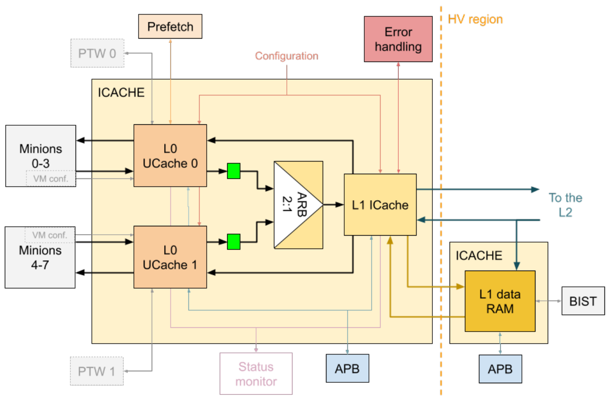
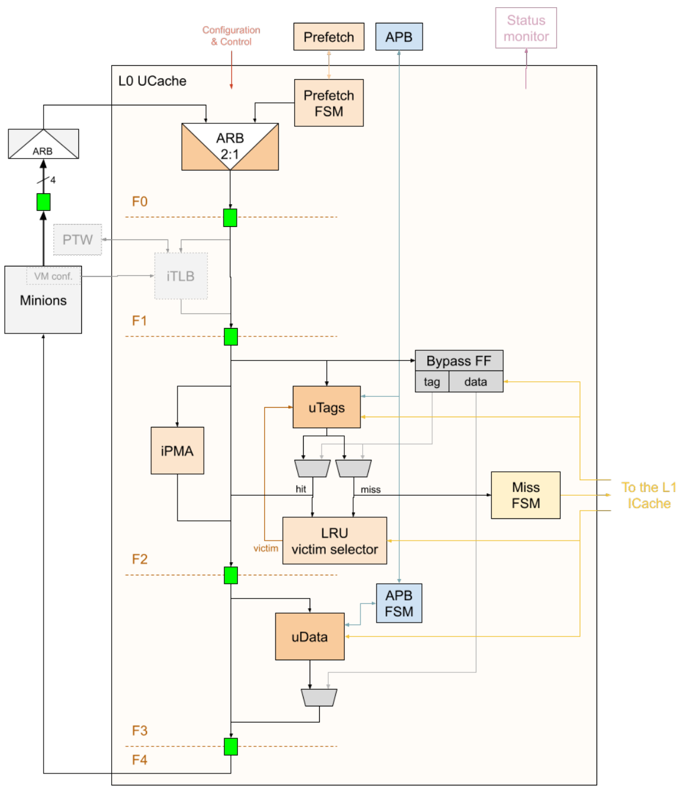
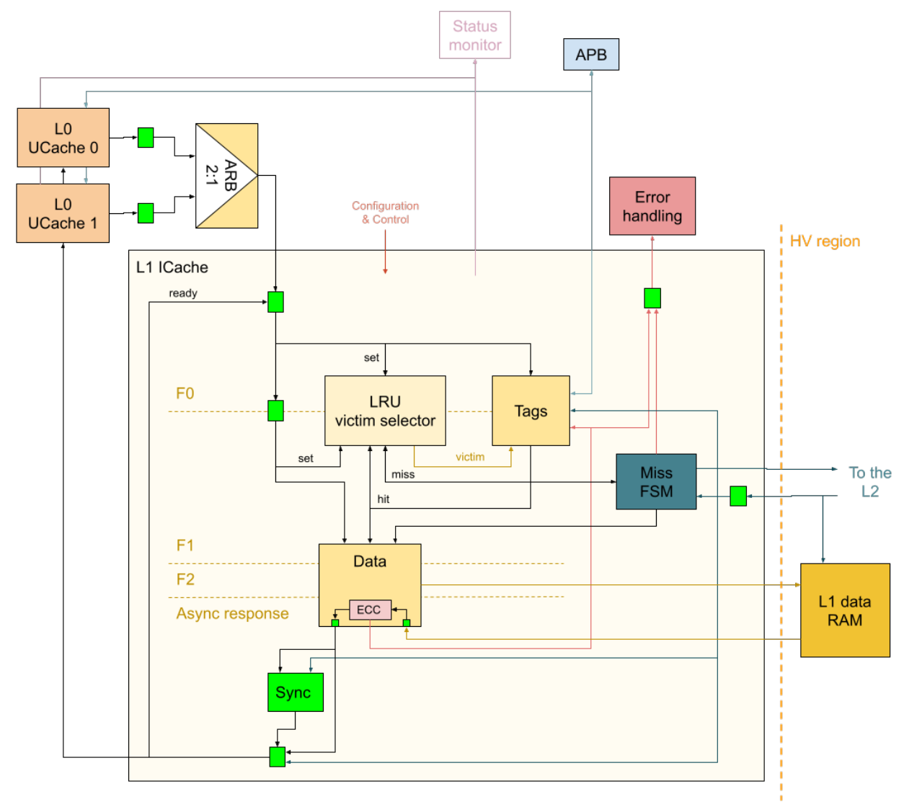
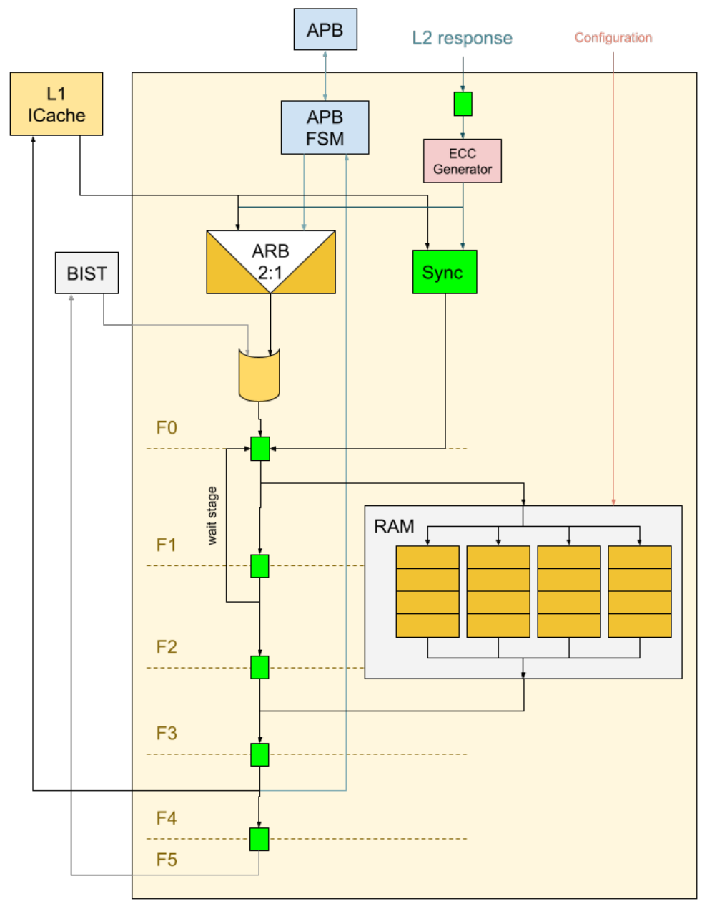
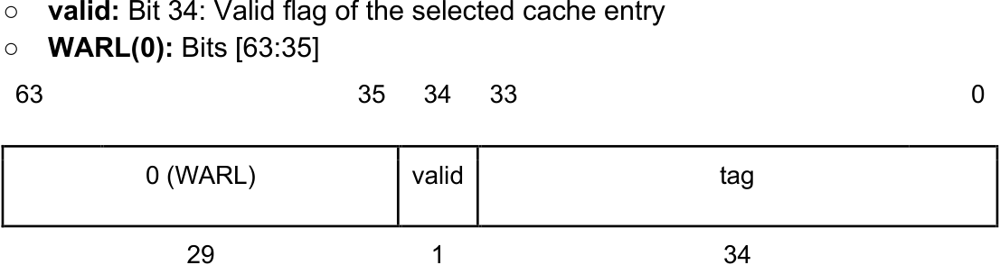
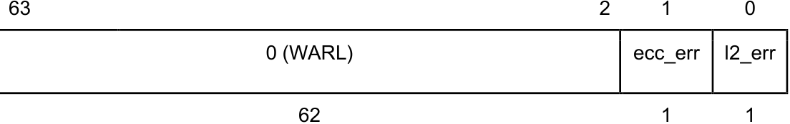
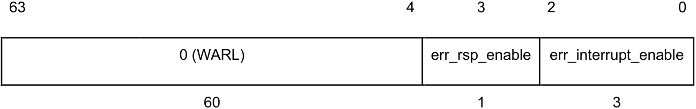
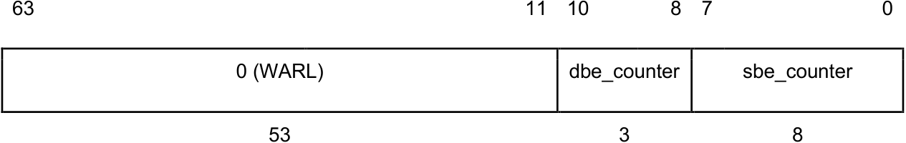

# Neighborhood ICache Description 

### <u>Ildefonso Gomariz</u> 

# Table of Contents 

|**1 Introduction**|4|
|---|---|
|**2 Overview**|5|
|2.1 Block Diagram|5|
|**3 Interfaces**|7|
|3.1 ICache|7|
|3.2 L1 Data RAM|9|
|**4 Building Blocks**|12|
|4.1 L0 Microcache|12|
|4.1.1 Prefetch|13|
|4.1.2 Bypass|14|
|4.1.3 TLB|14|
|4.2 L1 ICache|15|
|4.3 L1 Data RAM|16|
|4.3.1 BIST|18|
|4.4 APB Access|18|
|4.4.1 L0 Microcache|18|
|4.4.2 L1 ICache|19|
|4.4.3 L1 Data RAM|19|
|4.5 External Configuration and Control|19|
|**5 Error Handling**|21|
|5.1 Error Logging|21|
|5.1.1 Single Bit and Double Bit ECC Error Log Format|22|
|5.1.2 ECC Error Counter Saturation Log Format|22|
|5.2 Error Reporting|23|
|**6 Esperanto System Registers**|24|
|6.1 ICACHE_ERR_LOG_CTL|24|
|6.2 ICACHE_ERR_LOG_INFO|24|
|6.3 ICACHE_ERR_LOG_ADDRESS|25|
|6.4 ICACHE_SBE_DBE_COUNTS|25|
|**7 Debug**|26|
|**8 Glossary**|27|
|**9 References**|28|

# Revision History 

|**Version**|**Date**|**Author**|**Changes**|
|---|---|---|---|
|v0.1.0|2021.03.03|Ildefonso Gomariz|Document created|
|v0.2.0|2021.05.18|Ildefonso Gomariz|First version finished|
|v0.2.1|2021.10.29|Jennie Weyant|Format and grammar review|

## 1 Introduction 

This description corresponds to the Neighborhood’s Instruction Cache (ICache) implementation in the A0 revision of the ET-SoC-1 device. The Neighborhood’s ICache serves instructions to all the Minions in a Neighborhood. 

This document is intended primarily for the members of the VLSI team in charge of designing and verifying the ICache, the Minion, and the Neighborhood. It may also be useful as a reference manual for the software (SW) team, especially the ET System Registers section. 

The microarchitecture of the ICache is presented and its interfaces and building blocks are detailed in this document. There is a full section dedicated to error handling and another dedicated to the ET System Registers (ESRs), which can be used to check the error status of the ICache. Last, a section with references to different debug resources is provided. 

## 2 Overview 

The ICache architecture has been optimized for a multicore design. The Minion cores do not have private ICaches. Instead, each Neighborhood includes a single ICache that is shared among all the Minions of the Neighborhood. The shared ICache architecture has been chosen because, in most typical applications, all the Minions within a Neighborhood will execute the same code, so this distribution allows for considerable saving of both area and power. 

The ICache follows a quite particular two-level architecture determined by the location of the data RAM. The memory cells used to implement the ICache data RAMs need to be placed in a High Voltage (HV) region; however, the Neighborhood voltage domain is a Low Voltage (LV) region. Thus, the data memory has been placed outside of the Neighborhood (in the Shire Channel), which gives a very high access latency. To work around this, a lower level microcache (UCache) has been added between the Minions and the main ICache so that the Minion core still sees a low latency access. The ICache is thus composed of: 

- L0 microcache: A lower-level 16-entry fully-associative cache. There are two instances of the L0 microcache, each of which serves four Minions. The access of the Minions is arbitrated in the Neighborhood Channel. 

- L1 ICache: The main cache. The size of the L1 ICache is 32KB (128 sets and 4 ways). The data RAMs are located outside of the Neighborhood and are accessed asynchronously from the L1 ICache pipeline. The two L0 microcaches arbitrate to access the L1 ICache when they miss a fetch request. 

When the L1 ICache misses a fetch request, it accesses the L2 Shire Cache through the common ET-Link request datapath of the Neighborhood Channel. Refer to the <u>Neighborhood Description for further information regarding the ICache connections within the Neighborhood.</u> 

The L1 data RAMs located in the Shire Channel behave as a self-contained module that receives read (on a hit) and write (on a miss) requests from the L1 ICache and asynchronously sends the appropriate responses. It also snoops the L2 Shire Cache responses going to the L1 ICache to store the requested line after a miss. 

#### 2.1 Block Diagram 

The following figure shows a block diagram of the ICache: 

_Figure 1 - ICache Block Diagram_ 

## 3 Interfaces 

#### 3.1 ICache 

Below is a list of all the interfaces of the ICache and their ports. 

|**Interface**|**Port**|**I/O**|**Description**|
|---|---|---|---|
|System signals|clock|I|Clock|
||reset|I|Synchronous reset|
|Prefetch (see Prefetch)|esr_prefetch_conf|I|Prefetch configuration|
||esr_prefetch_start|I|Prefetch start|
||esr_prefetch_done|O|Prefetch done|
|Error handling (see Error Handling)|esr_err_log_ctl|I|Error log control|
||esr_err_log_sbe|O|SBE notification|
||esr_err_log_dbe|O|DBE notification|
||esr_err_log_info|O|Error log information|
|External configuration and |ioshire|I|This ICache belongs to the IOShire|
|control (see External Configuration and|esr_mprot|I|PMA memory protection|
|Control)|esr_vmspagesize|I|TLB page size _Unused in A0_|
||esr_bypass_icache|I|Bypass ICache|
||esr_shire_coop_mode|I|Cooperative mode enable _Unused in A0_|
||f0_flush_data|I|Invalidate caches|
|Fetch request (see L0 |f0_req_ready|O|Fetch request ready|
|Microcache)|f0_req_valid|I|Fetch request valid|
||f0_req|I|Fetch request|
||f0_req_min_id|I|Fetch request Minion ID|
|Fetch response (see L0 |f4_resp_valid|O|Fetch response valid|
|Microcache)|f4_resp_miss|O|Fetch response miss notification|

|f4_resp|O|Fetch response|
|---|---|---|
|f5_resp_fill_done|O|Fetch response fill done notification|

|**Interface**|**Port**|**I/O**|**Description**|
|---|---|---|---|
|L2 Shire Cache request (see L1 ICache)|f0_l2_miss_req_disable_next|I|Disable next L2 Shire Cache request|
||f0_l2_miss_req_ready|I|L2 Shire Cache request ready|
||f0_l2_miss_req_valid|O|L2 Shire Cache request valid|
||f0_l2_miss_req|O|L2 Shire Cache request|
|L2 Shire Cache response |f0_l2_miss_resp_ready|O|L2 Shire Cache response ready|
|(see L1 ICache)|f0_l2_miss_resp_valid|I|L2 Shire Cache response valid|
||f0_l2_miss_resp|I|L2 Shire Cache response|
|VM configuration and control |satp_info|I|SATP from the Minions _Unused in A0_|
|(see TLB)|matp_info|I|MATP from the Minions _Unused in A0_|
||tlb_invalidate|I|TLB invalidate from the Minions _Unused in A0_|
|PTW request (see TLB)|ptw_req_data|O|PTW request _Unused in A0_|
||ptw_req_valid|O|PTW request valid _Unused in A0_|
||ptw_req_ready|I|PTW request ready _Unused in A0_|
||ptw_invalidate|O|PTW invalidate _Unused in A0_|
|PTW response (see TLB)|ptw_resp_valid|I|PTW response valid _Unused in A0_|
||ptw_resp_data|I|PTW response _Unused in A0_|
|L1 data RAM request|f2_sram_req_write|O|L1 data RAM request write flag|
|(see L1 ICache)|f2_sram_req_addr|O|L1 data RAM request address|
||f2_sram_req_valid|O|L1 data RAM request valid|
||f2_sram_req_ready|I|L1 data RAM request ready|
|L1 data RAM response |f0_sram_resp_dout|I|L1 data RAM response data|
|(see L1 ICache)|f0_sram_resp_valid|I|L1 data RAM response valid|
||f0_sram_resp_ready|O|L1 data RAM response ready|
|APB (see APB Access)|apb_paddr|I|APB address|
||apb_pwrite|I|APB write|
||apb_psel|I|APB select|
||apb_penable|I|APB enable|
||apb_pwdata|I|APB write data|
||apb_pready|O|APB ready|
||apb_prdata|O|APB read data|
||apb_pslverr|O|APB error|
|Status Monitor (see Debug)|dbg_sm_signals|O|Status Monitor signals|

_Table 1 - ICache Interfaces_ 

#### 3.2 L1 Data RAM 

Below is a list of all the interfaces of the L1 data RAM module (the module located in the HV region) and their ports. 

|**Interface**|**Port**|**I/O**|**Description**|
|---|---|---|---|
|System signals|clock|I|Clock|
||reset|I|Synchronous reset|
|DFT (refer to the DFT |dft__sram_clock|I|DFT SRAM clock|
|Specification)|dft__clk_override|I|DFT clock override|
|L1 ICache request (see L1 Data RAM)|icache_req_write|I|L1 ICache request write flag|
||icache_req_addr|I|L1 ICache request address|
||icache_req_valid|I|L1 ICache request valid|
||icache_req_ready|O|L1 ICache request ready|
|L1 ICache response (see L1 Data RAM)|icache_resp_dout|O|L1 ICache response data|
||icache_resp_valid|O|L1 ICache response valid|
||icache_resp_ready|I|L1 ICache response ready|
|L2 Shire Cache response (see L1 Data RAM)|neigh_sc_rsp_info|I|L2 Shire Cache response|
||neigh_sc_rsp_valid|I|L2 Shire Cache response valid|
||neigh_sc_rsp_ready|I|L2 Shire Cache response ready|
|External configuration (see External Configuration and Control)|esr_shire_cache_ram_cfg|I|RAM static configuration|
|BIST (see BIST)|bist_req_info|I|BIST request|
||bist_rsp_info|O|BIST response|
|APB (see APB Access)|apb_paddr|I|APB address|
||apb_pwrite|I|ABP write|
||apb_psel|I|APB select|
||apb_penable|I|APB enable|
||apb_pwdata|I|APB write data|
||apb_pready|O|APB ready|

|apb_prdata apb_pslverr|O O|APB read data APB error|
|---|---|---|

_Table 2 - L1 Data RAM Interfaces_ 

## 4 Building Blocks 

#### 4.1 L0 Microcache 

This is the lowest ICache level. It is a fully-associative cache with 16 entries. 

There are two instances of the L0 microcache (the north and south microcaches), each of which serves four Minions. This distribution helps reduce the congestion of the Neighborhood Channel, as the microcaches are closer to their connected Minions. The access of the Minions to the L0 microcache is arbitrated in the Neighborhood Channel (refer to the <u>Frontend-ICache Interface Description for further details on Minion access to the ICache).</u> 

The following figure shows a block diagram of the L0 microcache: 

_Figure 2 - L0 Microcache Block Diagram_ 

The L0 microcache pipeline is composed of five stages: 

1. **F0:** Consists of the arbitration between regular requests coming from the Minions and the requests generated by the Prefetch Finite State Machine (FSM) (see Prefetch). It 

also includes the arbitration among Minions outside this unit to select the request going into the ICache (refer to the Frontend-ICache Interface Description for further details on Minion access to the ICache). 

2. **F1:** Performs virtual-to-physical address translation.1 

3. **F2:** Reads tags and performs tag comparisons against the fetched Program Counter (PC). It also accesses the Physical Memory Attributes (PMA) module to check permissions for physical addresses (refer to the Physical Memory Attributes section of the <u>PRM: Memory Map for further details on memory permissions).</u> 

4. **F3:** Uses the tag hit array to read the data from the entry in which it is stored. 

5. **F4:** Sends the data back to the Minions. 

For legacy reasons, the Minion’s Frontend requires the ICache response to have a fixed latency. Thus, if a fetch request misses the L0 microcache, the transaction keeps moving and a miss notification is sent through the f4_resp_miss port as a response to the requesting thread, which will go to sleep. Meanwhile, the line will be requested to the L1 ICache. Requests from the same Minion or from other Minions are allowed to flow through the pipeline. However, only one outstanding fill request to the L1 ICache is supported. Therefore, any other requests that also miss the L0 microcache will not be attended to and such threads will also go to sleep. Upon receiving the L1 ICache response, a _fill done_ pulse is sent through the f5_resp_fill_done port to all the Minions so that the sleeping threads can retry their requests. 

A single bus is used to serve all the Minions sharing a microcache, as they will latch the data in the appropriate cycle. 

The interface between the Minion’s Frontend and the ICache, including its architecture and the request and response channels, is fully explained in the <u>Frontend-ICache Interface Description.</u> 

##### 4.1.1 Prefetch 

The ET platform offers a code prefetching service that software can use to preload critical code into the shared ICaches prior to executing them. This service is programmed through Shire ESRs that reach the ICache through the ICache Prefetch interface. Refer to the Code Prefetching Facility section of the <u>PRM</u> for further details on how to program the code prefetching service. 

The code prefetching service is meant to preload code into the L1 ICache. However, the Prefetch FSM is implemented within the north L0 microcache so that it can access the microcache’s Translation Lookaside Buffer (TLB) and PMA. Prefetch requests generated by the Prefetch FSM arbitrate with regular fetch requests for access to the L0 microcache pipeline (they are accepted only if there are no simultaneous Minion requests). They are treated similarly, with the exception that prefetch requests cannot read from or write to the L0 microcache. A prefetch request is always forced to miss in order to allow for a request to be sent to the L1 ICache. When the L1 ICache response comes back, it is dismissed so that it is not stored into the tag and data caches. Prefetch requests cannot modify the Least Recently Used (LRU) victim selector status and do not generate a response for the Minions. 

A prefetch operation configures the privilege mode, a virtual address, and the number of lines. Starting at the configured virtual address, as many consecutive lines as have been configured are prefetched. If any of the memory requests generated by the prefetch engine generates an exception, the line is not prefetched and the operation continues with the next line. 

1 Virtual Memory logic is unused in A0 (see TLB) 

If a prefetch operation is started while a previous one is in progress, the previous one is canceled and the Prefetch FSM immediately starts working on the most recent operation. 

##### 4.1.2 Bypass 

The ICache includes a mechanism allowing for it to be bypassed. This mechanism is configured through the esr_bypass_icache input port (see <u>External Configuration and Control). When the bypass mechanism is enabled, the ICache still fetches cache lines, but</u> fetched lines are not cached. 

However, the bypass mechanism has had to be implemented in a very particular way given how the L0 microcache functions. Since the latency of the responses needs to be fixed, the L0 microcache actually needs to store a fetched line after a miss so that the requesting Minion can retry and hit it. 

For this reason, the L0 microcache implements a Bypass FF, which works as a small cache of just one line. When the bypass mechanism is enabled, the Bypass FF contains the tag, data, and error flags of the last requested line. Regular tag and data memories are bypassed and the Bypass FF is accessed instead. This does not work exactly the same as a bypass of the L0 microcache, since a subsequent access to the same address will directly hit the Bypass FF, just like it would with the regular cache. Instead, it just bypasses the regular tag and data memories by switching to a single-line Flip Flop (FF). 

##### 4.1.3 TLB 

**_NOTE:_** _The TLB is part of the Virtual Memory (VM) logic, which is unused and not tested in A0. Although the VM logic is included in the RTL implementation and will be briefly covered here, its actual behavior is undefined._ 

The TLB performs the virtual-to-physical address translation. In the case of a TLB miss, the transaction keeps moving and the event is reported as a miss to the Minions. Meanwhile, a request is sent to the corresponding Page Table Walker (PTW) to search for the physical address in the Page Table. Upon receiving the PTW response, the _fill done_ notification is sent to the Minions so that the sleeping threads can try again. 

The TLB is configured and controlled from the Minions through the VM configuration and control interface: 

- **satp:** Supervisor Address Translation and Protection (SATP) Control and Status Registers (CSRs) from all the Minions sharing a microcache. The Minion ID coming with the fetch request is used to select the proper register. Refer to the <u>RISC-V Privileged Spec for further information on the SATP register.</u> 

- **matp:** Machine Address Translation and Protection (MATP) CSRs from all the Minions sharing a microcache. The Minion ID coming with the fetch request is used to select the proper register. Check the <u>PRM: M-mode Virtual Memory Extension for further</u> information on the MATP register. 

- **tlb_invalidate:** TLB invalidate pulse, which invalidates the TLB cache. This is an OR function of the tlb_invalidate pulses from all the Minions sharing a microcache. 

#### 4.2 L1 ICache 

This is the main ICache. It is accessed from both L0 microcaches through an arbiter when one of them misses a fetch request. 

The L1 ICache is composed of 128 sets and 4 ways, which add up to a total of 32KB. The data RAMs are located outside and are accessed asynchronously from the L1 ICache pipeline (see L1 Data RAM). 

The following figure shows a block diagram of the L1 ICache: 

_Figure 3 - L1 ICache Block Diagram_ 

The L1 ICache pipeline is composed of six stages: 

1. There is an arbitration pre-stage where requests from both L0 microcaches arbitrate for access to the L1 ICache. 

2. **F0:** Tags are read in this stage. The LRU victim selector is also accessed to select a way to be replaced within the current set. 

3. **F1:** Performs tag comparisons against the fetched physical address. The LRU victim selector is updated in this stage. It uses the current set and the tag hit array to send a request to the data block. 

4. **F2:** The data block sends a request to the L1 data RAM located outside. The request is sent both on a hit (read request) and on a miss (write request). 

5. **Asynchronous response:** On read requests, the L1 data RAM reads the data from the set and way in which it is stored and sends it back to the data block. On write 

requests (i.e. after a fetch has missed the L1 ICache and a fetch request has been sent to the L2 Shire Cache), the L1 data RAM snoops the L2 response bus to store the fetched line and send it back to the data block. For both read and write requests, the data block receives the data from the L1 data RAM asynchronously, performs Error Correction Code (ECC) checking, and generates a response. If it applies (i.e. on a miss), the response is synchronized with the L2 response. 

6. Finally, the data is sent back to the L0 microcaches. 

On a miss, a read request is sent to the L2 Shire Cache to fetch the missed line. The response is snooped by the L1 data RAM, which stores the new cache line and returns it to the L1 ICache. The L2 response is used by the L1 ICache only for the purpose of synchronization and error checking. 

Only one outstanding request is allowed into the L1 ICache. Therefore, any other requests that enter the L1 ICache pipeline will be stalled before the F0 stage. Once the response is sent to the L0 microcache, the next request is allowed into the pipeline. Thus, the hit latency is around ten cycles. However, if both L0 microcaches want to read from the L1 ICache at the same time, then the L0 microcache that loses the arbitration sees a latency of 20 cycles. The maximum throughput is around one request every nine cycles. 

#### 4.3 L1 Data RAM 

The L1 data RAM module contains the L1 ICache data RAMs. The memory cells used to implement the ICache data RAMs need to be placed in a High Voltage region; however, the ICache is located within a Low Voltage region. Therefore, the data RAMs have been moved out of the L1 ICache into an independent module. 

The L1 data RAM module is located within the Shire Channel (HV region) and behaves as a self-contained module that receives read and write requests from the L1 ICache and sends the appropriate responses. 

After a hit in the L1 ICache, a read request is sent to the L1 data RAM. The cache line is then retrieved from the RAMs and returned to the L1 ICache. In case of a miss, the L1 ICache sends a read request to the L2 Shire Cache and simultaneously sends a write request to the L1 data RAM. Upon receiving the write request, the L1 data RAM module will snoop the L2 response going to the L1 ICache to grab the cache line data that is to be stored locally in the data RAMs. Once the data is stored, a response containing the fetched line is sent back to the L1 ICache. 

The following figure shows a block diagram of the L1 data RAM: 

_Figure 4 - L1 Data RAM Block Diagram_ 

The L1 data RAM pipeline is composed of six stages: 

1. **F0:** The request from the L1 ICache arbitrates for access with the APB bus. The L1 ICache gets higher priority, as the APB bus is only used for debug (see APB Access). On write requests, the L2 response is snooped, the ECC information is generated, and the data obtained is combined with the L1 ICache write request. Built-In Self-Test (BIST) requests are also combined into the request datapath in this stage; however, since BIST and mission mode will not access simultaneously, arbitration is not needed here. Therefore, there is no need to alternate access (see <u>BIST).</u> 

2. **F1:** The request is sent to the data RAMs. On write requests, the data obtained from the L2 response is synchronized with the L1 ICache request in this stage. The request is stalled until the L2 response is received. 

3. **F2:** Wait stage. The data RAM access time is two cycles, thus a wait stage is needed for the RAMs to deliver data. 

4. **F3:** On read requests, the RAM output data is delivered 

5. **F4:** The response is generated and sent back to the L1 ICache 

6. **F5:** The response is sent back to the BIST module. BIST access uses an additional cycle in order to improve timing closure (performance is not an issue on BIST access). 

The data RAM is physically distributed in four memory modules of 144 bits each. Each module contains 128 bits of a 512-bit cache line plus the corresponding ECC information. Ways of a specific set are stored in consecutive entries in memory. 

The maximum throughput of the L1 data RAM is one request every other cycle, which is limited by the RAM access time of two cycles. The minimum latency of the L1 data RAM module is five clock cycles for both read and write requests. However, for write requests, this assumes that the L2 response is immediately available. 

##### 4.3.1 BIST 

The BIST strategy is done using a shared bus BIST, such as the Synopsys SMS (STAR Memory System). Refer to the BIST section of the <u>Shire Cache Specification</u> for further information. 

#### 4.4 APB Access 

Both the ICache in the Neighborhood and the L1 data RAM module in the Shire Channel have an input/output APB bus that allows read and write access to certain resources. 

Debug accesses from the Shire UltraSoC Bus Processor Analytic Module (BPAM) have access to all the resources connected to the APB bus. These are visible through the Debug Memory Map, which is explained in the ICache Debug Space section of the PRM: Memory <u>Map. Refer to the Debug</u> section for further details on debug accesses. 

In the following subsections, a list of the accessible resources is provided along with a description. 

##### 4.4.1 L0 Microcache 

Below is a list of the resources accessible via the APB in the L0 microcache: 

- Tags: 

   - **tag:** Bits [33:0]: Tag of the selected cache entry 

   - **valid:** Bit 34: Valid flag of the selected cache entry 

   - **WARL(0):** Bits [63:35] 

- Data: 

   - **dword:** Bits [63:0]: Selected double word of the data cache entry 

|63||0|
|---|---|---|
||dword||
||64||

- Error flags: 

   - **l2_err:** Bit 0: L2 error flag of the selected cache entry 

   - **ecc_err:** Bit 1: ECC error flag of the selected cache entry 

   - **WARL(0):** Bits [63:2] 

##### 4.4.2 L1 ICache 

Below is a list of the resources accessible via the APB in the L1 ICache: 

- Tags: Two tags can be accessed simultaneously (for two consecutive cache lines) 

   - **tag0:** Bits [26:0]: Tag of the selected low cache line 

   - **valid0:** Bit 27: Valid flag of the selected low cache line 

   - **WARL(0):** Bits [31:28] 

   - **tag1:** Bits [58:32]: Tag of the selected high cache line 

   - **valid1:** Bit 59: Valid flag of the selected high cache line 

   - **WARL(0):** Bits [63:60] 

63 60 59 58 32 31 28 27 26 0 

|0 (WARL)|valid1|tag1|0 (WARL)|valid0|tag0|
|---|---|---|---|---|---|
|4|1|27|4|1|27|

##### 4.4.3 L1 Data RAM 

Below is a list of the resources accessible via the APB in the L1 data RAM module: 

- Data: 

   - **dword:** Bits [63:0]: Selected double word of the data cache line 

63 0 

|dword 64|
|---|

- ECC information: 

   - **ecc:** Bits [63:0]: ECC information for the selected cache line 

   - 63 0 

|ecc 64|
|---|

#### 4.5 External Configuration and Control 

There are a variety of external configuration and control signals and ESRs that are used to configure certain ICache features. Below is a list of all the external configuration and control input ports. 

- Main ICache: 

   - **ioshire:** Indicates whether the current ICache is instantiated within the IOShire (the ICache design is reused for the Instruction Cache of the Service Processor). It controls the permissions seen by the PMA block within the L0 microcache. 

   - **esr_mprot:** Controls the behavior of the PMA unit within the L0 microcache 

      - (refer to the MPROT section of the <u>PRM).</u> 

   - **esr_vmspagesize:** Determines the page size used by the TLB within the L0 microcache (refer to the VMSPAGESIZE section of the <u>PRM).</u>2 

   - **esr_bypass_icache:** Bypass of the ICache. It still fetches cache lines, but fetched lines are not cached (refer to the NEIGH_CHICKEN section of the <u>Neighborhood Description). The bypass mechanism has had to be</u> implemented in a very particular way, given how the L0 microcache functions. See the <u>Bypass section for further details on how the bypass mechanism works</u> in the L0 microcache. 

   - **esr_shire_coop_mode:** Enables cooperative mode. In cooperative mode, the whole TLB cache is shared among all the Minions accessing the ICache. Otherwise, the TLB cache entries are split among the different accessing Minions (refer to the SHIRE_COOP_MODE section of the <u>PRM).</u>3 

   - **f0_flush_data:** Invalidates the contents of the L0 microcache and the L1 ICache. 

- L1 data RAM: 

   - **esr_shire_cache_ram_cfg:** Allows for the L1 data RAM static configuration ports to be changed. 

> 3 Virtual Memory logic is unused in A0 (see TLB) 

2 Virtual Memory logic is unused in A0 (see TLB) 

## 5 Error Handling 

The ICache can notify certain types of errors, such as Single Bit Errors (SBEs) or Double Bit Errors (DBEs) in a cache line. Error notifications are controlled by the following Neighborhood ESRs: icache_err_log_ctl, icache_err_log_info, icache_err_log_address, and icache_sbe_dbe_counts (see <u>ET System Registers).</u> 

ICache error notifications follow the Error Logging and Reporting specification. However, a full description of this error specification is outside the scope of this document. This specification defines multiple levels of error handling. Briefly: 

- Level 1: Log errors locally and report them globally 

- Level 2: Send precise errors back to the core 

- Level 3: Containment of bad read data by poisoning ECC bits in the cache 

- Level 4: Graceful handling of data errors on other types of operations 

- Level 5: Additional handling of tag uncorrectable errors 

Currently, the ICache supports Level 2 handling. This means it will log the error condition in the corresponding ESRs and either send a global error notification to the IOShire through the ICache error reporting Neighborhood interface or indicate the error on responses to the core, depending on the configuration provided. 

The icache_err_log_ctl ESR is used to configure error handling (see <u>ICACHE_ERR_LOG_CTL):</u> 

- **err_rsp_enable:** Controls whether the ICache operates in Level 1 or Level 2 mode. If err_rsp_enable equals zero, the ICache operates in Level 1 mode and all enabled errors will be sent globally to the IOShire via icache_error_detected. If err_rsp_enable is set, enabled errors will be sent back to the requesting core (see Error Reporting). 

- **err_interrupt_enable:** Used to enable or prevent certain categories of logged errors from generating interrupts or sending error responses. Disabled errors do not set icache_error_logged (see <u>Error Reporting).</u> 

The errors that the ICache can notify are: 

- Single Bit Error (SBE): A single bit ECC error occurred in the ICache data RAMs. SBEs are corrected so, generally, normal processing should occur. No error response should be sent to the requesting core since the request is processed correctly. No global interrupt should be generated either. SBEs should just be logged locally and no action should be taken. 

- Double Bit Error (DBE): A double bit ECC error occurred in the ICache data RAMs. DBE errors cannot be corrected, so these are fatal errors and need to be reported. 

- ECC error counter overflow: An ECC error counter is saturated. SW may or may not want to configure ECC error counter saturation to generate an interrupt. 

#### 5.1 Error Logging 

The following ESRs are used to record information about errors: 

- **icache_err_log_info:** Contains general information about the error (see <u>ICACHE_ERR_LOG_INFO).</u> 

- **icache_err_log_address:** Contains the physical address associated with the error, if it is available (see <u>ICACHE_ERR_LOG_ADDRESS).</u> 

- **icache_sbe_dbe_counts:** Contains the current ECC error counts (see <u>ICACHE_SBE_DBE_COUNTS).</u> 

When an error occurs, the icache_err_log_info and the icache_err_log_address registers record the details of the first error that is encountered. Subsequent errors will set the multiple bit to indicate that another fatal error occurred though the details are not recorded. The specific format of the icache_err_log_info.info field depends on the type of error that occurred (see the subsections below). 

Error categories can be masked with icache_err_log_ctl.err_interrupt_enable. Error codes that are not enabled are still logged, but they have lower priority than errors that generate interrupts. Therefore, masked interrupts do not prevent a subsequent unmasked error from being recorded. When an enabled interrupt error overwrites a masked error, the multiple error bit is not set. Also, multiple masked errors do not cause the multiple error bit to be set. The multiple error bit is intended to indicate that a fatal error was missed. 

The icache_sbe_dbe_counts ESR contains the current ECC error counts. The SBE counter is eight bits and saturates at 255, while the DBE counter is three bits and saturates at seven. If a counter saturates, that error can also be logged (see ECC Error Counter Saturation Log <u>Format).</u> 

##### 5.1.1 Single Bit and Double Bit ECC Error Log Format 

This is the format of the icache_err_log_info ESR for single bit and double bit ECC errors (see <u>ICACHE_ERR_LOG_INFO</u> for further details): 

|63 48|47|40|39||17 16 15|14 8|7 4|3|2|1 0|
|---|---|---|---|---|---|---|---|---|---|---|
|unused||error_bits||unused|way|set|err_code|i |e|m v|
|16||8||23|2|7|4|1|1|1 1|

The specific fields are: 

- **err_code:** 

   - 0x0: Single bit ECC error 

   - 0x1: Double bit ECC error 

- **set:** Indicates which set contains the error 

- **way:** Indicates which way contains the error 

- **error_bits:** There is one ECC bit per double word in the cache line (8 bits). It indicates which double word contained the error. This field is multi-hot. 

The physical address associated with these errors is stored in the icache_err_log_address ESR. 

##### 5.1.2 ECC Error Counter Saturation Log Format 

This is the format of the icache_err_log_info ESR for ECC error counter saturation (see <u>ICACHE_ERR_LOG_INFO</u> for further details): 

|63 53|52|51||8 7 4|3 2|1 0|
|---|---|---|---|---|---|---|
|unused|double||unused|err_code|i e| m v|
|11|1||44|4|1 1|1 1|

The specific fields are: 

- **err_code:** 0x2 

- **double:** Single or double bit error counter: 

   - 0x0: Single bit error counter saturated 

   - 0x1: Double bit error counter saturated 

#### 5.2 Error Reporting 

The ICache error reporting Neighborhood interface is composed of two error signals that come from the ICache ESRs: 

- **icache_error_detected:** Generates a global interrupt to the IOShire. 

- **icache_error_logged:** Indicates that the ICache has logged an error associated with an interrupt. icache_error_logged is set regardless of whether the error is sent globally via icache_error_detected or via a response back to the requesting core. 

Furthermore, the ICache returns two signals to the core to indicate errors: 

- **f4_resp.ecc_err:** Indicates that an ECC error occurred in the ICache data RAMs. 

- ● **f4_resp.bus_err:** Indicates that an error response was received from the L2 Shire Cache after an L1 ICache miss. 

Due to the way the L0 microcache is implemented, error flags for the core are stored in the data cache in parallel to the affected cache line. Sinces the latency of the responses needs to be fixed, the L0 microcache actually needs to store the error information after a miss is attended so that the requesting Minion can retry, hit a cache entry, and retrieve the error information. 

Also, the signal **esr_icache_ecc_count_ov** coming from the icache_sbe_dbe_counts ESR is sent to the core to indicate that an ECC error counter is saturated. 

## 6 ET System Registers 

There are a number of registers within the Neighborhood ESR sub-region of the Minion Shire space that are dedicated to the ICache (refer to the Minion Shire ESR Map section of the <u>PRM: Memory Map). A detailed description of all the ICache ESRs are included in the following</u> sections for reference. 

#### 6.1 ICACHE_ERR_LOG_CTL 

**Address:** 0x01C0100078 + (Shire# << 22) + (Neigh# << 16) **Size:** 4b **Access** : R/W **Privilege Level:** Machine **Reset Value:** 0x6 **Description:** ICache error log control 

- **err_interrupt_enable:** Bits [2:0]: Enable logged errors to generate interrupts or send error responses: 

   - Bit 0: Enable SBE 

   - Bit 1: Enable DBE 

   - Bit 2: Enable ECC error counter saturation 

- **err_rsp_enable:** Bit 3: Enable Level 2 precise error response to core. 

- **WARL(0)** : Bits [63:4] 

#### 6.2 ICACHE_ERR_LOG_INFO 

63 

||8 7 4|3|2|1|0|
|---|---|---|---|---|---|
|info|err_code|imprecise|enabled|multi|valid|
|56|4|1|1|1|1|

**Address:** 0x01C0100080 + (Shire# << 22) + (Neigh# << 16) **Size:** 53b **Access** : R/W **Privilege Level:** Machine **Reset Value:** 0x0 **Description:** ICache error log info 

- **valid:** Bit 0: An error has occurred. This can be cleared by writing a 1 to this field and writing the matching code to err_code. 

- **multi:** Bit 1: Multiple enabled errors have occurred. This is intended to indicate that a fatal error was missed. 

- **enabled:** Bit 2: The error detected was enabled by the corresponding bit of the err_interrupt_enable field of the icache_err_log_ctl ESR. 

- **imprecise:** Bit 3: This bit only matters if enabled is set: 

   - 0x0: The error was sent back to the core 

   - 0x1: A global interrupt request was sent to the IOShire 

- **err_code:** Bits [7:4]: Indicates which type of error was seen. The code is used to determine how to decode the info bits. The types of errors logged by the ICache are: 

   - 0x0: ECC single bit error 

   - 0x1: ECC double bit error 

   - 0x2: ECC error counter saturation 

- **info:** Bits [63:8]: This is additional information about the error that occurred. This field format is dependent upon the type of error code. 

#### 6.3 ICACHE_ERR_LOG_ADDRESS 

63 

34 33 0 

|0 (WARL)|address|
|---|---|
|30|34|

**Address:** 0x01C0100088 + (Shire# << 22) + (Neigh# << 16) **Size:** 34b **Access** : R/O **Privilege Level:** Machine **Reset Value:** 0x0 **Description:** ICache error log address 

- **address:** Bits [33:0]: Physical address associated with the error 

- **WARL(0)** : Bits [63:34] 

#### 6.4 ICACHE_SBE_DBE_COUNTS 

**Address:** 0x01C0100090 + (Shire# << 22) + (Neigh# << 16) **Size:** 11b **Access** : R/W **Privilege Level:** Machine **Reset Value:** 0x0 **Description:** ICache SBE/DBE count status. All the fields are read-only. To clear the counts, writing all-ones to the field will clear the respective field. 

- **sbe_counter:** Bits [7:0]: ICache data RAM Single Bit Error count 

- **dbe_counter:** Bits [10:8]: ICache data RAM Double Bit Error count 

- **WARL(0)** : Bits [63:11] 

## 7 Debug 

The ICache allows multiple debug capabilities: 

- APB access: Gives the UltraSoC BPAM write and read access to certain ICache resources (see <u>APB Access</u> for details). The accessible resources are described in the ICache Debug space section of the PRM: Memory Map and in the ICache section of the <u>Debug Memory Map.</u> 

- Status Monitor: The UltraSoC Status Monitor (SM) in the Shire Channel allows for the monitorization of Minion and Neighborhood internal signals, including filtering and tracing data. The ICache internal signals that can be accessed from the SM are listed in the Minion Shire Neigh Channel tab of the <u>UST Status Monitor Debug Signals.</u> 

Refer to the <u>MAS: Minion Shire Debug</u> document for further details on the debug implementation. 

## 8 Glossary 

APB Advanced Peripheral Bus BIST Built-In Self Test BPAM Bus Processor Analytic Module CSR Control and Status Register DBE Double Bit Error DFT Design For Testing ECC Error Correction Code ESR ET System Register FSM Finite State Machine HV High Voltage ICache Instruction Cache ID Identifier L# Level # (of a cache memory) LRU Least Recently Used LV Low Voltage MATP Machine Address Translation and Protection PC Program Counter PMA Physical Memory Attributes PTW Page Table Walker RAM Random Access Memory RTL Register Transfer Level SATP Supervisor Address Translation and Protection SBE Single Bit Error SM Status Monitor SMS STAR Memory System SP Service Processor SRAM Static Random Access Memory TLB Translation Lookaside Buffer UCache Microcache VM Virtual Memory 

## 9 References 

1. <u>Neighborhood Description</u> 

2. <u>Frontend-ICache Interface Description</u> 

3. <u>Shire Cache Specification</u> 

4. <u>MAS Minion Shire Debug</u> 

5. <u>Debug Memory Map</u> 

6. <u>UST Status Monitor Debug Signals</u> 

7. <u>DFT Specification</u> 

